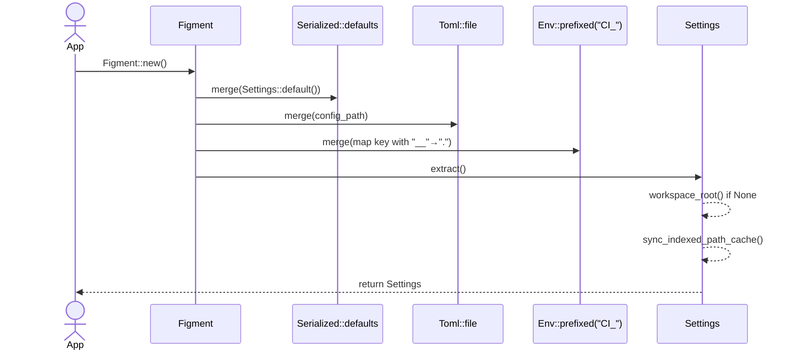

# config.rs Review

## TL;DR

- 目的: 設定の層（デフォルト/TOML/環境変数）を統合し、ワークスペース検出・初期化・保存・インデックス対象パス管理を提供する。
- 主要公開API: Settings::load, Settings::load_from, Settings::save, Settings::init_config_file, Settings::add_indexed_path, Settings::remove_indexed_path, Settings::get_indexed_paths, is_global_debug_enabled。
- 複雑箇所: Figmentによる設定統合、環境変数のキー変換（load と load_from の実装差）、コメント挿入ロジック add_config_comments。
- 重大リスク: 環境変数の解釈の不整合（load が __→. 変換、load_from が split("_")）（関数名:行番号不明）、semantic_search.enabled の serdeデフォルト(false)と Default(true)の乖離による混乱、外部モジュール依存（crate::init, crate::parsing）の失敗時挙動。
- Rust安全性: unsafeは本体では未使用。OnceLockによりグローバルフラグの競合安全。Mutex/Lockの取得失敗時に安全なフォールバックあり。
- エラー設計: 戻り値型が混在（Box<figment::Error>, Box<dyn Error>, String）で一貫性不足。
- テスト: 基本動作・層統合・インデックスパス管理・ファイルウォッチ設定のデフォルト/部分設定がカバーされているが、load_from の環境変数上書きテストが欠落。

## Overview & Purpose

このモジュールは、コードベースインテリジェンスシステムの設定を管理する中心的な構成レイヤーを提供する。以下の機能を統合的に扱う。

- デフォルト値の提供（構造体の Default 実装とフィールド毎の default関数）
- TOMLファイル（settings.toml）の読み書き
- 環境変数（接頭辞 CI_、ネストは __ 区切り）による上書き
- CLI初期化（init_config_file）と補助ファイル（.codannaignore）の生成
- ワークスペースルート検出（.codanna ディレクトリ探索）
- 言語レジストリからの言語設定デフォルト生成（失敗時にはRustのみのフォールバック）
- インデックス対象パスの追加/削除/取得と重複・包含関係の整合性確保
- グローバルデバッグフラグのキャッシュ（OnceLock）

設定は serde によるシリアライズ可能なデータ契約を持ち、figmentプロバイダを利用してレイヤー統合を行う。

## Structure & Key Components

| 種別 | 名前 | 公開範囲 | 責務 | 複雑度 |
|------|------|----------|------|--------|
| Struct | Settings | pub | 設定の総合コンテナ。読み込み/保存/初期化/パス管理/ワークスペース検出 | Med |
| Struct | IndexingConfig | pub | 並列設定・Tantivy・再試行・無視パターン・インデックス対象パス | Low |
| Struct | LanguageConfig | pub | 言語別の有効化/拡張子/パーサーオプション/監視対象設定ファイル | Low |
| Struct | McpConfig | pub | MCPサーバのコンテキストサイズ/デバッグ | Low |
| Struct | SemanticSearchConfig | pub | セマンティック検索の有効化/モデル/閾値 | Low |
| Struct | FileWatchConfig | pub | ファイル監視の有効/デバウンス | Low |
| Struct | ServerConfig | pub | サーバモード/バインドアドレス/ウォッチ間隔 | Low |
| Struct | GuidanceConfig | pub | AIガイダンスの有効化/テンプレート/変数 | Med |
| Struct | GuidanceTemplate | pub | 結果件数別テンプレート集 | Low |
| Struct | GuidanceRange | pub | 件数範囲とテンプレート指定 | Low |
| Function | is_global_debug_enabled | pub | 設定からデバッグフラグを一度だけ読み込みキャッシュ | Low |
| Impl fn | Settings::for_init | pub | 初期化ファイル生成用の環境依存設定構築 | Low |
| Impl fn | Settings::load | pub | レイヤー統合で総合設定を読み込み | Med |
| Impl fn | Settings::find_workspace_config | pub | ワークスペース設定ファイル探索 | Low |
| Impl fn | Settings::check_init | pub | 設定ファイル存在/整合性チェック | Low |
| Impl fn | Settings::workspace_root | pub | .codannaからワークスペースルート算出 | Low |
| Impl fn | Settings::load_from | pub | 指定ファイルから設定読み込み（環境変数も） | Med |
| Impl fn | Settings::save | pub | 設定のTOML保存 | Low |
| Impl fn | Settings::init_config_file | pub | 設定/補助ファイル生成、グローバル初期化 | Med |
| Impl fn | Settings::add_indexed_path | pub | パス追加（重複/包含整理、キャッシュ同期） | Med |
| Impl fn | Settings::remove_indexed_path | pub | パス削除 | Low |
| Impl fn | Settings::get_indexed_paths | pub | インデックス対象パス一覧を返す | Low |
| Fn | generate_language_defaults | private | レジストリから言語デフォルト作成（失敗時フォールバック） | Med |
| Fn | fallback_minimal_languages | private | 最小構成（Rustのみ） | Low |
| Fn群 | default_* | private | 各フィールドのデフォルト値関数 | Low |
| Impl fn | Settings::add_config_comments | private | TOML文字列へ説明コメント挿入 | Med |
| Impl fn | Settings::create_default_ignore_file | private | .codannaignore生成 | Low |

### Dependencies & Interactions

- 内部依存
  - Settings::load → find_workspace_config → workspace_root（なしの場合）→ sync_indexed_path_cache
  - Settings::for_init → std::env::current_dir
  - Settings::init_config_file → for_init → add_config_comments → create_default_ignore_file → crate::init::{init_global_dirs, create_fastembed_symlink, ProjectRegistry::register_or_update_project}
  - add_indexed_path/remove_indexed_path → indexed_paths/indexed_paths_cache の整合
  - generate_language_defaults → crate::parsing::get_registry().lock() → registry.iter_all()
- 外部依存（クレート/モジュール）
  | 依存 | 用途 |
  |------|------|
  | figment::{Figment, providers::{Env, Format, Serialized, Toml}} | 設定レイヤー統合 |
  | serde::{Deserialize, Serialize} | データ契約のシリアライズ |
  | toml | 設定ファイルの（逆）シリアライズ |
  | num_cpus | デフォルト並列スレッド数 |
  | std::sync::OnceLock | グローバルデバッグフラグの一回性初期化 |
  | crate::init | ローカルディレクトリ名/グローバル初期化/プロジェクト登録 |
  | crate::parsing | 言語レジストリ取得 |
- 被依存推定
  - CLI層（init, add-dir, remove-dir, list-dirs, index など）
  - MCPサーバ起動/設定（server/file_watch/mcp/semantic_search）
  - インデクサ（indexing/ignore_patterns/indexed_paths）
  - パーサ/解析器（languages）

## API Surface (Public/Exported) and Data Contracts

| API名 | シグネチャ | 目的 | Time | Space |
|-------|------------|------|------|-------|
| Settings::for_init | fn for_init() -> Result<Self, Box<dyn std::error::Error>> | 初期化用設定生成 | O(1) | O(1) |
| Settings::load | fn load() -> Result<Self, Box<figment::Error>> | レイヤー統合で設定読み込み | O(F+E+L) | O(S) |
| Settings::find_workspace_config | fn find_workspace_config() -> Option<PathBuf> | 祖先探索で設定ファイル検出 | O(D) | O(1) |
| Settings::check_init | fn check_init() -> Result<(), String> | 設定ファイル存在/整合性検証 | O(|file|) | O(|file|) |
| Settings::workspace_root | fn workspace_root() -> Option<PathBuf> | .codanna存在する祖先を返す | O(D) | O(1) |
| Settings::load_from | fn load_from(path: impl AsRef<Path>) -> Result<Self, Box<figment::Error>> | 指定TOMLと環境変数で読み込み | O(F+E) | O(S) |
| Settings::save | fn save(&self, path: impl AsRef<Path>) -> Result<(), Box<dyn std::error::Error>> | 設定の保存（ディレクトリ作成含む） | O(|toml|) | O(|toml|) |
| Settings::init_config_file | fn init_config_file(force: bool) -> Result<PathBuf, Box<dyn std::error::Error>> | 設定/補助ファイル生成と登録 | O(IO+R) | O(|toml|) |
| Settings::add_indexed_path | fn add_indexed_path(&mut self, path: PathBuf) -> Result<(), String> | パス追加・重複/包含整理 | O(N) | O(1) |
| Settings::remove_indexed_path | fn remove_indexed_path(&mut self, path: &Path) -> Result<(), String> | パス削除 | O(N) | O(1) |
| Settings::get_indexed_paths | fn get_indexed_paths(&self) -> Vec<PathBuf> | パス一覧取得（コピー） | O(N) | O(N) |
| is_global_debug_enabled | fn is_global_debug_enabled() -> bool | グローバルデバッグフラグのキャッシュ取得 | 初回O(load)以降O(1) | O(1) |

注:
- F: 設定ファイル読み込みコスト
- E: 関係する環境変数の処理コスト
- L: レジストリ言語デフォルト処理（generate_language_defaults）
- D: 祖先ディレクトリ数
- S: 設定サイズ（構造体のフィールド総量）
- R: プロジェクト登録処理（crate::init::ProjectRegistry）

データ契約（主要構造体）
- Settings: version, index_path, workspace_root, debug, indexing, indexed_paths_cache(skip), languages, mcp, semantic_search, file_watch, server, guidance
- 各サブ構造体は全て pub フィールドで、serdeによりTOMLと往復可能。Guidance関連はテンプレート/変数の柔軟な連想配列。

以下、各APIの詳細。

### Settings::for_init

1. 目的と責務
   - 現在の作業ディレクトリを workspace_root に設定し、その他は Default に基づく初期値で埋める。init_config_file で使用。

2. アルゴリズム
   - current_dir を取得し workspace_root に設定
   - Settings::default() を展開し構造体を完成
   - Ok(settings) を返却

3. 引数
   | 名前 | 型 | 説明 |
   |------|----|------|
   | なし | - | - |

4. 戻り値
   | 型 | 説明 |
   |----|------|
   | Result<Settings, Box<dyn Error>> | 成功時 Settings、失敗時エラー（current_dir失敗など） |

5. 使用例
   ```rust
   let init_settings = Settings::for_init().expect("init settings");
   assert!(init_settings.workspace_root.is_some());
   ```

6. エッジケース
   - 現在ディレクトリ取得失敗（権限/環境）→ Err
   - それ以外は Default による安定動作

### Settings::load

1. 目的と責務
   - Defaults → TOML → Env(CI_) の順で統合し、workspace_root の自動検出と indexed_paths_cache を同期。

2. アルゴリズム
   - find_workspace_config で設定ファイルパス探索、なければ `<local_dir>/settings.toml`
   - Figment::new()
     - Serialized::defaults(Settings::default())
     - Toml::file(config_path)
     - Env::prefixed("CI_").map(|k| k.to_lowercase().replace("__",".").into())
   - extract() で Settings に変換
   - workspace_root が None なら workspace_root() で検出
   - sync_indexed_path_cache()

3. 引数
   | 名前 | 型 | 説明 |
   |------|----|------|
   | なし | - | - |

4. 戻り値
   | 型 | 説明 |
   |----|------|
   | Result<Settings, Box<figment::Error>> | 統合設定、失敗時はFigmentエラー |

5. 使用例
   ```rust
   let s = Settings::load().expect("settings loaded");
   println!("index at {:?}", s.index_path);
   ```

6. エッジケース
   - 設定ファイルが不在でも defaults が効く
   - 環境変数キー解釈は __ 区切りのみサポート（load側）
   - serde default と Default 実装の乖離があるフィールド（semantic_search.enabled）に注意

### Settings::find_workspace_config

1. 目的と責務
   - 現在ディレクトリから祖先まで `.codanna/settings.toml` を探索し最初に見つかったパスを返す。

2. アルゴリズム
   - current_dir → ancestors() 反復
   - ancestor.join(local_dir).exists/dir なら settings.toml を返す

3. 引数
   | 名前 | 型 | 説明 |
   |------|----|------|
   | なし | - | - |

4. 戻り値
   | 型 | 説明 |
   |----|------|
   | Option<PathBuf> | 見つかった場合パス、なければ None |

5. 使用例
   ```rust
   if let Some(p) = Settings::find_workspace_config() {
       println!("config at {}", p.display());
   }
   ```

6. エッジケース
   - current_dir 取得失敗→ None
   - .codanna がないプロジェクト構成→ None

### Settings::check_init

1. 目的と責務
   - 設定ファイルの存在と TOML としての整合性を検証し、ユーザ向けメッセージを返す。

2. アルゴリズム
   - find_workspace_config → なければ .codanna/settings.toml 仮定
   - ファイル存在チェック、未存在なら Err("No configuration file...")
   - read_to_string → toml::from_str::<Settings> で検証
   - パース失敗なら再生成案内付き Err

3. 引数
   | 名前 | 型 | 説明 |
   |------|----|------|
   | なし | - | - |

4. 戻り値
   | 型 | 説明 |
   |----|------|
   | Result<(), String> | 成功なら Ok、失敗時は説明付き文字列 |

5. 使用例
   ```rust
   Settings::check_init().expect("configuration is valid");
   ```

6. エッジケース
   - 読み取り権限なし→ Err("Cannot read configuration file: ...")
   - TOML構造破損→ Err("Configuration file is corrupted: ...")

### Settings::workspace_root

1. 目的と責務
   - `.codanna` を含む祖先ディレクトリを返却。

2. アルゴリズム
   - current_dir → ancestors() → `.codanna`存在チェック → ancestor を返す

3. 引数
   | 名前 | 型 | 説明 |
   |------|----|------|
   | なし | - | - |

4. 戻り値
   | 型 | 説明 |
   |----|------|
   | Option<PathBuf> | ワークスペースルート or None |

5. 使用例
   ```rust
   let root = Settings::workspace_root();
   ```

6. エッジケース
   - ルートまで探索して .codanna がない場合は None

### Settings::load_from

1. 目的と責務
   - 指定されたパスの TOML と環境変数（CI_）から設定を読み込む。

2. アルゴリズム
   - Figment::new()
     - Serialized::defaults(Settings::default())
     - Toml::file(path)
     - Env::prefixed("CI_").split("_") ← 注意: load とは異なるキー処理
   - extract() → sync_indexed_path_cache()

3. 引数
   | 名前 | 型 | 説明 |
   |------|----|------|
   | path | impl AsRef<Path> | 設定ファイルパス |

4. 戻り値
   | 型 | 説明 |
   |----|------|
   | Result<Settings, Box<figment::Error>> | 読み込み済み設定 |

5. 使用例
   ```rust
   let s = Settings::load_from("settings.toml").unwrap();
   ```

6. エッジケース
   - 環境変数キー解釈が load と不一致（__ がネスト扱いにならない可能性）
   - ファイルが不正→ Figmentエラー

### Settings::save

1. 目的と責務
   - 設定を prettified TOML として保存。親ディレクトリがなければ作成。

2. アルゴリズム
   - parent = path.parent().ok_or("Invalid path")?
   - create_dir_all(parent)
   - toml::to_string_pretty(self)
   - write(path, toml_string)

3. 引数
   | 名前 | 型 | 説明 |
   |------|----|------|
   | path | impl AsRef<Path> | 保存先 |

4. 戻り値
   | 型 | 説明 |
   |----|------|
   | Result<(), Box<dyn Error>> | 成功/失敗 |

5. 使用例
   ```rust
   let s = Settings::default();
   s.save("out/settings.toml")?;
   ```

6. エッジケース
   - 親ディレクトリ不正→ Err("Invalid path")
   - 書き込み権限不足→ Err

### Settings::init_config_file

1. 目的と責務
   - 設定ファイル生成、.codannaignore生成、グローバルディレクトリ初期化、モデルキャッシュシンボリックリンクの試行、インデックスディレクトリ作成、プロジェクト登録。

2. アルゴリズム
   - `<local_dir>/settings.toml` を決定、force=false且つ存在なら Err
   - 親ディレクトリ作成
   - Settings::for_init() → TOML → add_config_comments → write
   - create_default_ignore_file(force)
   - crate::init::init_global_dirs()
   - create_fastembed_symlink() は失敗しても警告ログのみ
   - index/tantivy ディレクトリ作成
   - ProjectRegistry::register_or_update_project(current_dir) → .project-id を更新/作成
   - 成功時 config_path を返却

3. 引数
   | 名前 | 型 | 説明 |
   |------|----|------|
   | force | bool | 既存ファイル上書き可否 |

4. 戻り値
   | 型 | 説明 |
   |----|------|
   | Result<PathBuf, Box<dyn Error>> | 作成された settings.toml のパス |

5. 使用例
   ```rust
   let path = Settings::init_config_file(false)?;
   println!("initialized at {}", path.display());
   ```

6. エッジケース
   - Windowsなどでシンボリックリンク作成失敗→許容（警告のみ）
   - 既存ファイルあり & force=false → Err
   - プロジェクト登録失敗→ Err

### Settings::add_indexed_path

1. 目的と責務
   - 正規化（canonicalize）したパスを追加。既存の親に含まれる場合は追加拒否、子が存在する場合は親追加の前に子を削除して一意な最小集合に保つ。

2. アルゴリズム
   - canonicalize(path) → Errなら「Invalid path」
   - indexed_paths_cache を走査
     - 同一なら Err("Path already indexed")
     - 新パスが既存の祖先に含まれるなら Err("covered by ...")
     - 既存が新パスの子なら has_descendants=true
   - has_descendants=true → indexed_paths と cache から子を retain(false)
   - push 新パスを indexed_paths と cache に

3. 引数
   | 名前 | 型 | 説明 |
   |------|----|------|
   | path | PathBuf | 追加対象パス |

4. 戻り値
   | 型 | 説明 |
   |----|------|
   | Result<(), String> | 成功/エラー（重複/包含/無効パス） |

5. 使用例
   ```rust
   let mut s = Settings::default();
   s.add_indexed_path(PathBuf::from("./src"))?;
   ```

6. エッジケース
   - パスが存在しない→ canonicalize 失敗
   - 既に親が登録済み→ 追加拒否
   - 子が登録済み→ 親追加時に子を削除

### Settings::remove_indexed_path

1. 目的と責務
   - 正規化した対象パスを設定から削除。

2. アルゴリズム
   - canonicalize(path)
   - indexed_paths と cache から該当パスを削除
   - 長さが変わらなければ「Path not found」エラー

3. 引数
   | 名前 | 型 | 説明 |
   |------|----|------|
   | path | &Path | 削除対象 |

4. 戻り値
   | 型 | 説明 |
   |----|------|
   | Result<(), String> | 成功/「存在しない」エラー |

5. 使用例
   ```rust
   settings.remove_indexed_path(Path::new("./src"))?;
   ```

6. エッジケース
   - パスが存在しない→ canonicalize 失敗
   - 登録されていない→ Err("Path not found...")

### Settings::get_indexed_paths

1. 目的と責務
   - 現在のインデックス対象パスを Vec<PathBuf> として返す（所有権のコピー）。

2. アルゴリズム
   - self.indexing.indexed_paths.clone()

3. 引数
   | 名前 | 型 | 説明 |
   |------|----|------|
   | なし | - | - |

4. 戻り値
   | 型 | 説明 |
   |----|------|
   | Vec<PathBuf> | パス配列のコピー |

5. 使用例
   ```rust
   for p in settings.get_indexed_paths() { println!("{:?}", p); }
   ```

6. エッジケース
   - 未設定なら空配列（後方互換）

### is_global_debug_enabled

1. 目的と責務
   - 設定の debug フラグをたった一度読み込み、以後はキャッシュを返す（高速）。

2. アルゴリズム
   - OnceLock<bool> に Settings::load().map(|s| s.debug).unwrap_or(false) を初期化

3. 引数
   | 名前 | 型 | 説明 |
   |------|----|------|
   | なし | - | - |

4. 戻り値
   | 型 | 説明 |
   |----|------|
   | bool | デバッグの有効/無効 |

5. 使用例
   ```rust
   if is_global_debug_enabled() { eprintln!("debug on"); }
   ```

6. エッジケース
   - Settings::load 失敗→ false を返す

## Walkthrough & Data Flow

- 設定読み込みの流れ（Settings::load）
  - デフォルト構築 → TOMLファイル上書き → 環境変数上書き（CI_、__でネスト） → workspace_root 自動検出 → indexed_paths_cache 同期。



上記の図は`Settings::load`関数の主要処理を示す。

- インデックスパス追加の分岐（Settings::add_indexed_path）

```mermaid
flowchart TD
  A[入力 PathBuf] --> B[canonicalize]
  B -->|Err| E[Err(Invalid path)]
  B --> C{既存に同一/親/子があるか}
  C -->|同一| F[Err(Path already indexed)]
  C -->|既存に親がある| G[Err(covered by parent)]
  C -->|既存に子がある| H[has_descendants=true]
  C -->|なし| I[has_descendants=false]
  H --> J[子パスを retain で削除]
  I --> K[スキップ]
  J --> L[push 新パス]
  K --> L[push 新パス]
  L --> M[Ok(())]
```

上記の図は`Settings::add_indexed_path`関数の主要分岐を示す。

## Complexity & Performance

- Settings::load / load_from
  - 時間: O(F + E + L)
    - F: ファイル読み込みとTOMLパース
    - E: 関係する環境変数のキー変換と適用
    - L: 言語レジストリからのデフォルト生成（成功時のみ、通常は O(#languages)）
  - 空間: O(S)（設定構造体のサイズ）
- add_indexed_path / remove_indexed_path
  - 時間: O(N)（既存パスの線形走査）
  - 空間: O(1)（追加/削除の差分のみ）
- save / init_config_file
  - 時間: O(|toml| + IO)
  - 空間: O(|toml|)
- is_global_debug_enabled
  - 初回のみ Settings::load のコスト、以降 O(1)

ボトルネック/スケール限界
- インデックス対象パスの集合が非常に大きい場合、add/remove の線形走査がコスト増。N が数千程度なら許容だが、数万超で最適化検討（木構造/トライ/Prefixマップ化）。
- Figmentの抽出時、巨大な設定や大量の環境変数適用で遅延が増えるが、実運用では限定的。

実運用負荷要因
- ファイルIO（読み書き/ディレクトリ作成）
- 言語レジストリのロック取得と反復
- Tantivy関連ディレクトリ作成（初期化時）

## Edge Cases, Bugs, and Security

### エッジケース一覧

| エッジケース | 入力例 | 期待動作 | 実装 | 状態 |
|-------------|--------|----------|------|------|
| 設定ファイル不在 | なし | Defaults と Env で生成 | Settings::load | 対応済 |
| TOML破損 | 無効TOML | エラーと再生成推奨 | Settings::check_init | 対応済 |
| 環境変数ネスト（load） | CI_INDEXING__PARALLEL_THREADS=16 | 上書き適用 | Settings::load Env.map | 対応済 |
| 環境変数ネスト（load_from） | CI_INDEXING__PARALLEL_THREADS=16 | __ を正しく解釈 | Settings::load_from Env.split("_") | 不一致の可能性（バグ） |
| 親パスが既に存在 | add: 子 | 拒否 | add_indexed_path | 対応済 |
| 子パスが既に存在 | add: 親 | 子を削除して親を追加 | add_indexed_path | 対応済 |
| 同一路径重複 | add: 同一 | 拒否 | add_indexed_path | 対応済 |
| パスが存在しない | add/remove: 不在パス | エラー（Invalid path） | add/remove | 対応済 |
| シンボリックリンク | add: symlink | canonicalizeで実体パス基準 | add/remove | 仕様上妥当 |
| Windows/ケース差 | パス区切り | PathBufとcanonicalizeで吸収 | テストで考慮 | 概ね対応 |

### 既知/潜在バグ

- 環境変数の解釈の不整合（重要）
  - Settings::load は __ を . に変換（ネスト対応）。
  - Settings::load_from は split("_") を使用（単一_もセグメント扱い）、仕様（ダブルアンダースコアでネスト）と不一致。CI_INDEXING__PARALLEL_THREADS 等のキーが期待通りに解釈されない可能性。（関数名:行番号不明）
  - 影響: ユニットテストでは load_from の環境変数上書きが未検証。実運用で設定が想定通り反映されない恐れ。
- SemanticSearchConfig.enabled のデフォルト値不一致
  - serdeフィールド属性は default_false、Default実装は enabled=true。
  - Figment層統合では Serialized::defaults が優先されるため通常は true だが、直列化/逆直列化のみを使う経路では false になる可能性があり混乱を招く。

### セキュリティチェックリスト

- メモリ安全性
  - Buffer overflow / Use-after-free / Integer overflow: 該当なし（安全なRust、unsafe未使用、本体コード）。
- インジェクション
  - SQL/Command/Path traversal: SQL/Commandはなし。Pathはユーザ入力だが canonicalize により実体化。ワークスペース外のパスを追加可能だが、設定モジュール自体は拒否しない。後続処理でアクセス制御が必要。
- 認証・認可
  - 該当なし（設定モジュール）。サーバ設定（bind）には外部公開の可能性があるため、別層での認可/CSRF/ACLが必要。
- 秘密情報
  - Hard-coded secrets: なし。ログへの漏洩: eprintln!で環境エラー表示あり（機密は含まれていない想定）。
- 並行性
  - Race condition/Deadlock: OnceLockにより is_global_debug_enabled は安全。レジストリロック取得に失敗時フォールバック（deadlockの兆候は不明）。共有状態の変更は単一スレッド前提（Settingsは&mut操作）。
  - Send/Sync: Settings は基本的に所有型と標準コレクション、特別な非Send要素なし（明示境界は不明）。

### Rust特有の観点

- 所有権/移動
  - get_indexed_paths は clone により所有権を返す（関数:行番号不明）。
  - add_indexed_path は canonical_path.clone() を push（コピー実体）。
- 借用/ライフタイム
  - remove_indexed_path は &Path を受け取り、内部で canonicalize→PathBuf。明示ライフタイム不要。
- unsafe境界
  - 本体コードに unsafe ブロックはなし。テストに不要な unsafe { set_var } ブロックがあるが本体と無関係。
- 並行性・非同期
  - OnceLock<bool> により初期化時のみ読み込み。crate::parsing::get_registry().lock() は Mutex想定で同期的。
  - 非同期/await 未使用。
- エラー設計
  - Result<String>ベースのエラー（check_init, add/remove）と Box<dyn Error>/Box<figment::Error> の混在。From/Into の型変換は未提供。panic系 unwrap/expect は本体では未使用（テストのみ）。

## Design & Architecture Suggestions

- 環境変数キー処理の統一
  - Settings::load_from でも Settings::load と同じ __→. 変換方式を使用する（map(|key| key.to_lowercase().replace("__",".").into())）。split("_") は削除。
- デフォルト値の一貫化
  - SemanticSearchConfig.enabled の serde default を default_true に変更し、コメントと Default 実装と一致させる。
- エラー型の統合
  - 独自 Error enum を定義し、From 実装で std::io::Error, figment::Error, toml::de::Error などをラップ。ユーザへのメッセージ整形を統一。
- パス集合の最適化（必要に応じて）
  - 多数のパスにスケールする場合、祖先/子関係判定のため、正規化済みパスの前缀木やBTreeSetに変更する検討。
- 設定ビルダーの導入
  - CLIやアプリから段階的に構築できる SettingsBuilder により、柔軟且つ型安全な初期化をサポート。
- 依存の抽象化
  - crate::init / crate::parsing の外部依存をトレイトで抽象化し、テストでモック差し替え可能にする。

## Testing Strategy (Unit/Integration) with Examples

追加で必要なテスト例:

- load_from の環境変数上書き検証（不整合の再現と修正後の正当性）
```rust
#[test]
fn test_load_from_env_override_double_underscore() {
    use std::env;
    let tmp = tempfile::TempDir::new().unwrap();
    let cfg = tmp.path().join("settings.toml");
    std::fs::write(&cfg, r#"[indexing] parallel_threads = 4"#).unwrap();

    // 期待: __ がネスト解釈され parallel_threads=16 に上書き
    env::set_var("CI_INDEXING__PARALLEL_THREADS", "16");
    let s = Settings::load_from(&cfg).unwrap();
    assert_eq!(s.indexing.parallel_threads, 16);
    env::remove_var("CI_INDEXING__PARALLEL_THREADS");
}
```

- generate_language_defaults のフォールバック検証
```rust
#[test]
fn test_language_defaults_fallback() {
    // レジストリ取得が失敗するケースを人工的に作れない場合、関数の結果を評価
    let defaults = super::fallback_minimal_languages();
    assert!(defaults.contains_key("rust"));
    assert_eq!(defaults["rust"].extensions, vec!["rs"]);
}
```

- workspace_root 検出の祖先探索
```rust
#[test]
fn test_workspace_root_detection() {
    let tmp = tempfile::TempDir::new().unwrap();
    let nested = tmp.path().join("a/b/c");
    std::fs::create_dir_all(&nested).unwrap();
    let local_dir = crate::init::local_dir_name();
    std::fs::create_dir_all(tmp.path().join(local_dir)).unwrap();

    let current = std::env::current_dir().unwrap();
    std::env::set_current_dir(&nested).unwrap();
    let root = Settings::workspace_root().unwrap();
    assert_eq!(root, tmp.path());
    std::env::set_current_dir(current).unwrap();
}
```

- add_indexed_path のシンボリックリンク・実体整合
```rust
#[test]
fn test_add_indexed_symlink_resolves_realpath() {
    let tmp = tempfile::TempDir::new().unwrap();
    let real = tmp.path().join("real");
    let link = tmp.path().join("link");
    std::fs::create_dir(&real).unwrap();
    #[cfg(unix)]
    std::os::unix::fs::symlink(&real, &link).unwrap();

    let mut s = Settings::default();
    s.add_indexed_path(link.clone()).unwrap();
    assert_eq!(s.indexing.indexed_paths[0], real.canonicalize().unwrap());
}
```

## Refactoring Plan & Best Practices

- スプリント1
  - load_from の Env キー処理を load と同一ロジックへ変更。
  - SemanticSearchConfig.enabled の serde default を default_true に変更。
  - テスト追加（上記2点のユニットテスト）。
- スプリント2
  - Error enum 導入、Settings系APIの戻り値型統一（thiserror などの活用）。
  - ログAPIを println/eprintln から tracing へ移行。
- スプリント3
  - add_indexed_path の内部表現最適化（大量パス向け、BTreeSet + パス正規化ヘルパ）。
  - SettingsBuilder の導入（段階的構築・検証）。
- ベストプラクティス
  - 環境依存処理（current_dir, symlink）は抽象化し、テスト可能性を高める。
  - 文字列テンプレート（Guidance）は安全なプレースホルダ置換ユーティリティを用意（例: {result_count}）。

## Observability (Logging, Metrics, Tracing)

- 現状: println!/eprintln! による標準出力ログ。初期化時にユーザ向けメッセージ。
- 推奨:
  - tracing クレート導入（debug/info/warn/errorレベル、環境変数で制御）。
  - init_config_file の各ステップで span を張り、失敗理由を構造化ログで出力。
  - メトリクス（設定読み込み時間、環境変数適用数、インデックスパス数）を記録可能に。
  - is_global_debug_enabled のキャッシュヒット率を計測（必要なら）。

## Risks & Unknowns

- 外部依存の振る舞い不明
  - crate::parsing::get_registry().lock() のロック特性（Poison時の扱い）は「不明」。現在は Err ならフォールバックするが、エラー原因の可観測性は低い。
  - crate::init::{init_global_dirs, create_fastembed_symlink, ProjectRegistry::register_or_update_project} の詳細動作は「不明」。初期化・登録の失敗シナリオの網羅が必要。
- 環境差異
  - Windows のシンボリックリンク権限問題・パス区切り差異はテストで一定考慮されるが、企業環境のグループポリシー等でさらに制限がある可能性。
- セマンティック検索モデル
  - モデル一覧や互換性は外部ドキュメント依存。「このチャンクには現れない」ため、選択の妥当性検証は別層の責務。