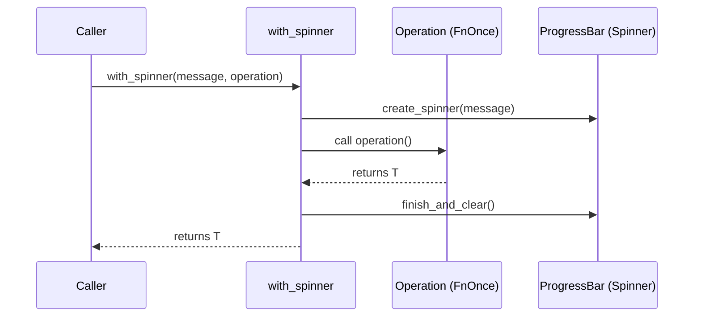

# display\progress.rs Review

## TL;DR

- 目的: 長時間処理の進捗表示を簡潔に扱うためのユーティリティを提供（ProgressBar/Spinner、並列処理向けMultiProgress管理）。
- 主要公開API: create_progress_bar, create_spinner, ProgressTracker（new/add_worker/inc/set_message/finish_with_message/multi）, create_benchmark_progress, with_spinner。
- 潜在的な複雑箇所: MultiProgressと複数スレッドの進捗バー連携、tick頻度による描画負荷。
- 重大リスク: ProgressStyle::template(...).unwrap() によるランタイムpanic可能性、with_spinner内でoperationがpanicした場合にスピナー未クリーンアップの可能性。
- 並行性: ProgressBar/MultiProgressのSend/Sync特性はこのチャンクでは不明。スレッド間共有の安全性は外部クレート(indicatif)の保証に依存。
- メモリ安全性: unsafe未使用。所有権・借用はシンプルで安全だが、外部ライブラリの内部に依存。
- テスト指針: スタイル初期化のpanic防止、tick設定の健全性、with_spinnerのRAII/ドロップ動作、MultiProgress利用時のjoin手順の検証が重要。

## Overview & Purpose

このファイルは、長時間処理の進捗を表示するためのユーティリティ群を提供します。主な用途は以下の通りです。

- ファイル処理やバッチ処理でのバー形式の進捗表示（create_progress_bar、create_benchmark_progress）
- 不定な処理時間の作業に対するスピナー表示（create_spinner、with_spinner）
- 並列作業（ワーカー）をまとめるためのProgressTracker（MultiProgressを内包）

UIはindicatifクレートに依存しており、ターミナルへの描画を行います。進捗バーやスピナーのスタイル（テンプレート、色、tick文字列）を統一的に設定し、簡単なAPIで扱えるようにしています。

## Structure & Key Components

| 種別 | 名前 | 公開範囲 | 責務 | 複雑度 |
|------|------|----------|------|--------|
| Function | create_progress_bar | pub | 合計値付き進捗バー生成とスタイル設定 | Low |
| Function | create_spinner | pub | 不定進捗向けスピナー生成とスタイル設定 | Low |
| Struct | ProgressTracker | pub | MultiProgressでメインバー＋ワーカー管理 | Med |
| Method | ProgressTracker::new | pub | MultiProgress作成とメインバー追加 | Low |
| Method | ProgressTracker::add_worker | pub | ワーカー用スピナーをMultiProgressへ追加 | Low |
| Method | ProgressTracker::inc | pub | メインバーの進捗加算 | Low |
| Method | ProgressTracker::set_message | pub | メインバーのメッセージ更新 | Low |
| Method | ProgressTracker::finish_with_message | pub | メインバーの完了＋メッセージ表示 | Low |
| Method | ProgressTracker::multi | pub | 内部MultiProgressへの参照提供 | Low |
| Function | create_benchmark_progress | pub | ベンチマーク向け簡易バー生成 | Low |
| Function | with_spinner | pub | 一時スピナー表示しつつクロージャ実行 | Low |

### Dependencies & Interactions

- 内部依存
  - ProgressTracker::new → create_progress_bar を使用
  - ProgressTracker::add_worker → create_spinner を使用
  - with_spinner → create_spinner を使用
- 外部依存（クレート/モジュール）
  - indicatif
    - MultiProgress: 複数ProgressBarの描画管理
    - ProgressBar: 進捗バー/スピナー
    - ProgressStyle: スタイル/テンプレート設定
  - std::time::Duration: tick間隔設定
- 被依存推定（このモジュールを使う側）
  - ファイル処理、ETL、ダウンロード、圧縮/展開などの長時間タスク
  - スレッドプール/並列実行フレームワーク（rayon、std::thread等）からのワーカー進捗連携
  - ベンチマーク実行ループでの進捗可視化

## API Surface (Public/Exported) and Data Contracts

| API名 | シグネチャ | 目的 | Time | Space |
|-------|-----------|------|------|-------|
| create_progress_bar | fn create_progress_bar(total: u64, message: &str) -> ProgressBar | 合計付きバーの生成とスタイル設定 | O(1) | O(1) |
| create_spinner | fn create_spinner(message: &str) -> ProgressBar | 不定進捗スピナー生成とスタイル設定 | O(1) | O(1) |
| ProgressTracker | pub struct ProgressTracker | 並列進捗の集約 | - | - |
| ProgressTracker::new | fn new(total: u64, message: &str) -> Self | メインバー付きトラッカー生成 | O(1) | O(1) |
| ProgressTracker::add_worker | fn add_worker(&self, message: &str) -> ProgressBar | ワーカー用スピナー追加 | O(1) | O(1) |
| ProgressTracker::inc | fn inc(&self, delta: u64) | メインバーを増分更新 | O(1) | O(1) |
| ProgressTracker::set_message | fn set_message(&self, message: &str) | メインバーのメッセージ設定 | O(1) | O(1) |
| ProgressTracker::finish_with_message | fn finish_with_message(&self, message: &str) | メインバーを完了 | O(1) | O(1) |
| ProgressTracker::multi | fn multi(&self) -> &MultiProgress | 内部MultiProgress参照取得 | O(1) | O(1) |
| create_benchmark_progress | fn create_benchmark_progress(iterations: u64) -> ProgressBar | ベンチマーク向けバー生成 | O(1) | O(1) |
| with_spinner | fn with_spinner<F, T>(message: &str, operation: F) -> T where F: FnOnce() -> T | 一時スピナー表示＋クロージャ実行 | O(1) + operation | O(1) |

以下、主要APIの詳細。

1) create_progress_bar
- 目的と責務
  - 合計値に基づく進捗バーを生成し、見やすいスタイルとtickを設定する。
- アルゴリズム
  - ProgressBar::new(total)でバー生成
  - ProgressStyle::default_bar()からテンプレートとprogress_charsを設定
  - メッセージ設定と100msのsteady_tick有効化
- 引数

| 名称 | 型 | 説明 |
|------|----|------|
| total | u64 | バーの合計（len） |
| message | &str | 表示メッセージ |

- 戻り値

| 型 | 説明 |
|----|------|
| ProgressBar | 設定済み進捗バー |

- 使用例
```rust
let pb = create_progress_bar(100, "Processing files");
for _ in 0..100 {
    // ... 作業 ...
    pb.inc(1);
}
pb.finish_with_message("Done");
```
- エッジケース
  - total=0のバー（表示の妥当性はindicatifの仕様に依存）
  - 非ASCIIメッセージ（UTF-8 &strのため安全だが、表示幅はターミナル依存）
  - テンプレート不正時のunwrapによるpanic（関数名: create_progress_bar, 行番号不明）

2) create_spinner
- 目的と責務
  - 不定時間の処理向けスピナーの生成
- アルゴリズム
  - ProgressBar::new_spinner()でスピナー生成
  - default_spinnerのテンプレート設定＋tick_stringsをUnicodeブレイルに設定
  - メッセージ設定と80msのsteady_tick有効化
- 引数

| 名称 | 型 | 説明 |
|------|----|------|
| message | &str | スピナーに付与するメッセージ |

- 戻り値

| 型 | 説明 |
|----|------|
| ProgressBar | 設定済みスピナー |

- 使用例
```rust
let spinner = create_spinner("Connecting...");
std::thread::sleep(std::time::Duration::from_secs(2));
spinner.finish_with_message("Connected");
```
- エッジケース
  - テンプレート不正時のunwrapによるpanic（create_spinner, 行番号不明）
  - 非対応端末でのUnicodeスピナー表示乱れ

3) ProgressTracker（new, add_worker, inc, set_message, finish_with_message, multi）
- 目的と責務
  - 複数進捗バー（メイン＋ワーカー）をMultiProgressで一括管理
- アルゴリズム（主なメソッド）
  - new: MultiProgress::new → create_progress_barを追加
  - add_worker: create_spinnerでスピナーを作りmulti.addで登録
  - inc: main_bar.inc(delta)
  - set_message: main_bar.set_message
  - finish_with_message: main_bar.finish_with_message
  - multi: &MultiProgressを返却（外部でjoin等の操作が可能）
- 引数/戻り値（抜粋）
  - new(total: u64, message: &str) -> Self
  - add_worker(&self, message: &str) -> ProgressBar
  - inc(&self, delta: u64)
  - set_message(&self, message: &str)
  - finish_with_message(&self, message: &str)
  - multi(&self) -> &MultiProgress
- 使用例
```rust
let tracker = ProgressTracker::new(10, "Main Task");
let worker1 = tracker.add_worker("Worker 1");
let worker2 = tracker.add_worker("Worker 2");

// ワーカーを別スレッドで実行（Send/Syncはこのチャンクでは不明）
std::thread::spawn({
    let w = worker1.clone(); // ProgressBarがClone可能かは不明
    move || {
        w.set_message("Worker 1: preparing");
        std::thread::sleep(std::time::Duration::from_millis(200));
        w.finish_with_message("Worker 1: done");
    }
});

std::thread::spawn({
    let w = worker2.clone();
    move || {
        std::thread::sleep(std::time::Duration::from_millis(300));
        w.finish_with_message("Worker 2: done");
    }
});

// メイン進捗
for _ in 0..10 {
    std::thread::sleep(std::time::Duration::from_millis(100));
    tracker.inc(1);
}
tracker.finish_with_message("All done");

// 必要なら外部でmulti.join()を呼ぶ（ProgressTracker::multi参照）。joinの必要性/効果は不明。
```
- エッジケース
  - deltaがtotalを超えるインクリメント
  - Workerバーがfinishされないままドロップ
  - multi()で外部が危険な操作（不明）をする可能性

4) create_benchmark_progress
- 目的と責務
  - ベンチマーク用の簡易的な進捗バー生成
- アルゴリズム
  - ProgressBar::new(iterations) → default_bar → テンプレート設定 → メッセージ設定（"Running benchmark"）
- 引数/戻り値

| 名称 | 型 | 説明 |
|------|----|------|
| iterations | u64 | イテレーション回数（len） |

| 型 | 説明 |
|----|------|
| ProgressBar | ベンチマークバー |

- 使用例
```rust
let pb = create_benchmark_progress(1000);
for i in 0..1000 {
    // ベンチマーク単位作業
    pb.inc(1);
}
pb.finish_with_message("Benchmark complete");
```
- エッジケース
  - iterations=0
  - テンプレート不正のunwrapによるpanic（create_benchmark_progress, 行番号不明）

5) with_spinner
- 目的と責務
  - 指定されたoperation（FnOnce）を実行する間だけ一時的にスピナーを表示し、終了後にクリア
- アルゴリズム
  - create_spinner(message)でスピナー生成
  - operation()呼び出し
  - spinner.finish_and_clear() でスピナー消去
  - operationの戻り値を返す
- 引数/戻り値

| 名称 | 型 | 説明 |
|------|----|------|
| message | &str | スピナーのメッセージ |
| operation | F where F: FnOnce() -> T | 実行するクロージャ |

| 型 | 説明 |
|----|------|
| T | operationの戻り値 |

- 使用例
```rust
let result = with_spinner("Loading resources...", || {
    // 重い処理
    std::thread::sleep(std::time::Duration::from_secs(1));
    42
});
assert_eq!(result, 42);
```
- エッジケース
  - operationがpanicした場合、finish_and_clearが呼ばれずスピナーが残る可能性（このチャンクでは処理なし）

## Walkthrough & Data Flow

- create_progress_bar/create_spinner/create_benchmark_progress
  - 入力: total/iterations、message。
  - 出力: スタイル・tickが設定されたProgressBar。
  - データフロー: ProgressStyleテンプレート → ProgressBarへ適用 → メッセージ文字列の所有化（to_string） → tick間隔設定。

- ProgressTracker
  - new: MultiProgress生成 → create_progress_barでmain_bar生成 → multi.addで管理対象に登録。
  - add_worker: create_spinnerでワーカースピナー生成 → multi.addで登録 → ProgressBar返却（呼び出し側が進捗操作）。
  - inc/set_message/finish_with_message: main_barへの操作委譲。
  - multi: 内部のMultiProgress参照を公開（joinなどの高度な操作は利用側に委ねる）。

- with_spinner
  - スピナー生成 → operation()実行 → スピナーをfinish_and_clear → operation結果返却。

Mermaidシーケンス図（アクター: Caller, with_spinner, Operation, ProgressBar）。上記の図は`with_spinner`関数の主要フロー（行番号不明）を示す。



## Complexity & Performance

- 時間計算量
  - すべてのAPIは初期化/更新がO(1)。with_spinnerはO(1) + operationの時間。
- 空間計算量
  - 各ProgressBarとスタイル、内部状態保持がO(1)。
- ボトルネック/スケール限界
  - enable_steady_tickによる描画更新がスレッド/ターミナルI/O負荷の源泉。ワーカー数が多い場合（例: 100+スピナー）で80ms/100ms tickは高頻度描画になり、端末の描画性能やロック競合で遅延が生じうる。
- 実運用負荷
  - 主にI/O（ターミナル出力）。CPU負荷は低いが、出力の整列やロックによりスループットが影響する可能性あり。

## Edge Cases, Bugs, and Security

詳細エッジケース表

| エッジケース | 入力例 | 期待動作 | 実装 | 状態 |
|-------------|--------|----------|------|------|
| total=0のバー | total=0 | エラーなく表示（仕様依存） | create_progress_bar | 不明 |
| deltaがtotal超過 | delta=100, total=10 | 表示上オーバーまたは飽和（仕様依存） | ProgressTracker::inc | 不明 |
| 空メッセージ | "" | メッセージなしで描画 | 全APIのmessage | OK |
| 非ASCIIメッセージ | "日本語🚀" | 正しく表示（端末依存） | set_message各所 | 不明 |
| 長文メッセージ | 数百文字 | 折返し/切詰め（端末依存） | set_message各所 | 不明 |
| テンプレート不正 | 無効テンプレ | 安全に失敗 | .template(...).unwrap() | 潜在panic |
| with_spinner中のpanic | operationがpanic | スピナーを確実に消去 | finish_and_clear未到達 | 潜在問題 |
| MultiProgress未join | join不要か不明 | 正常表示 | ProgressTracker::multi | 不明 |
| スピナー大量作成 | 100+ | 高負荷・ちらつき | enable_steady_tick(80ms/100ms) | パフォーマンス懸念 |

セキュリティチェックリスト
- メモリ安全性
  - Buffer overflow: 該当なし（Rust安全APIのみ）
  - Use-after-free: 該当なし
  - Integer overflow: inc/delta/totalはu64で表示用途のため副作用なし
- インジェクション
  - SQL/Command/Path traversal: 該当なし
  - 端末制御コード: メッセージに制御文字が含まれると表示が乱れる可能性（ログインジェクション的挙動）。メッセージのサニタイズは未実装。
- 認証・認可
  - 該当なし
- 秘密情報
  - Hard-coded secrets: なし
  - Log leakage: メッセージに機密情報を入れると端末に出力されるリスク
- 並行性
  - Race condition/Deadlock: このチャンクでは同期原語不使用。indicatif内部の同期に依存。Send/Syncの保証は不明。

Rust特有の観点
- 所有権/借用
  - &selfメソッドのみで、所有権移動はない。messageはto_stringで所有化。
- ライフタイム
  - 明示的ライフタイムは不要。
- unsafe境界
  - unsafe未使用（ファイル全体）。
- 並行性・非同期
  - Send/Sync: ProgressBar/MultiProgressのトレイト境界はこのチャンクに現れないため不明。
  - データ競合: 共有状態はindicatif内部で管理。外部公開のmulti()での誤用可能性あり。
  - await境界/キャンセル: 非async、キャンセル未対応。
- エラー設計
  - unwrap/expectの使用: ProgressStyle::template(...).unwrap() によりpanic可能。Resultにすべき。
  - Result vs Option: 現状すべて成功前提のAPI設計。

重要な主張の根拠（行番号）
- ProgressStyle::template(...).unwrap() の使用: create_progress_bar / create_spinner / create_benchmark_progress（行番号不明、このチャンクの行番号情報は提供されていないため）

## Design & Architecture Suggestions

- unwrapの排除
  - ProgressStyle設定で発生しうるエラーを返すAPIに変更。
  - 例: fn create_progress_bar(...) -> Result<ProgressBar, StyleError> など。
- RAIIガードの導入
  - with_spinnerでpanic時にも必ずクリアするため、Dropでfinish_and_clearするSpinnerGuard構造体を追加。
- Builderパターン
  - バー/スピナーのテンプレート、tick間隔、色などを柔軟に変更できるBuilderを用意。
- MultiProgress操作のラップ
  - ProgressTrackerにjoinメソッドを追加して、利用者が適切な終端手順を選択できるようにする。
- APIのInto<String>導入
  - メッセージ引数を impl Into<String> にして to_stringの重複を減らす。
- tick間隔の構成可能性
  - 80ms/100msをハードコードせず、引数または設定から調整可能に。

## Testing Strategy (Unit/Integration) with Examples

- ユニットテスト
  - スタイル設定のpanicを検知（現在のコードではpanicテスト）。
  - with_spinnerが戻り値を正しく返すこと。
  - inc/set_message/finish_with_messageの呼び出しでpanicしないこと。

```rust
#[test]
fn test_with_spinner_returns_value() {
    let r = with_spinner("Testing...", || 7);
    assert_eq!(r, 7);
}

#[test]
fn test_progress_tracker_basic_usage_no_panic() {
    let tracker = ProgressTracker::new(3, "Main");
    let w = tracker.add_worker("Worker");
    w.set_message("working");
    tracker.inc(1);
    tracker.set_message("Main update");
    tracker.finish_with_message("Main done");
    w.finish_with_message("Worker done");
    // multi参照を取得できる
    let _m = tracker.multi();
}

#[test]
fn test_create_benchmark_progress_no_panic() {
    let pb = create_benchmark_progress(5);
    for _ in 0..5 { pb.inc(1); }
    pb.finish_with_message("OK");
}
```

- 統合テスト（端末描画を避ける工夫）
  - 可能であればindicatifの描画ターゲットを「hidden」に設定し出力を抑制（このチャンクではAPI露出なし、方法は不明）。
  - スレッドでadd_workerしたProgressBarに対してfinishまで実行し、デッドロックしないことを検証。

- 失敗系テスト案
  - テンプレート設定が失敗するケース（現状はunwrapでpanic）。エラーを返す設計に変更後に検証。

## Complexity & Performance

- Big-OはすべてO(1)で、性能はターミナルI/O依存。
- 潜在ボトルネック
  - スピナー/バーのsteady_tickによる高頻度描画。
  - MultiProgressの内部ロック競合（外部ライブラリに依存）。
- スケール限界
  - 多数のバー/スピナーを同時表示する場合、描画が追いつかずちらつき・遅延が発生しうる。
- 対策
  - tick間隔の調整を可能にする。
  - 大量ワーカー時はバー表示を抑制（集約メトリクスのみ表示）や、ログ出力と併用。

## Edge Cases, Bugs, and Security

上記「Edge Cases, Bugs, and Security」セクションに記載済み。

## Design & Architecture Suggestions

上記「Design & Architecture Suggestions」セクションに記載済み。

## Testing Strategy (Unit/Integration) with Examples

上記「Testing Strategy」セクションに記載済み。

## Refactoring Plan & Best Practices

- エラー処理
  - ProgressStyleテンプレート設定のResultを返すようAPI設計変更。
  - with_spinnerにSpinnerGuard（Dropでfinish_and_clear）を導入。
- API改善
  - Into<String>採用でメッセージ設定の利便性向上。
  - ProgressTrackerにjoin/clear/all_finishなどの高レベル操作を追加。
- 柔軟性
  - tick間隔、bar長、色、テンプレートを設定可能に。
- ドキュメント
  - MultiProgressの利用方法（joinの要否、典型パターン）をREADME/注釈に明記。
- ベストプラクティス
  - 大量スピナーの描画抑制（INFOログ併用など）。
  - panicに強いRAIIパターン採用。

## Observability (Logging, Metrics, Tracing)

- ロギング
  - 進捗バー生成/完了時にdebugログをオプションで出す（feature flag）。
- メトリクス
  - 進捗更新回数、処理時間（elapsed）をメトリクスに送出するフック（利用側でwrap）。
- トレーシング
  - with_spinner開始/終了にspanを付与（tracingクレート、featureで任意）。

## Risks & Unknowns

- indicatifの内部仕様（Send/Sync、描画ターゲット、joinの必要性）はこのチャンクでは不明。
- 端末環境（Windows/古い端末）ではUnicodeスピナーや色表示が乱れる可能性。
- unwrapに依存したテンプレート設定がライブラリ更新で失敗するリスク。
- with_spinnerでのpanic時クリーンアップ未保証。RAII導入が望ましい。