## error.rs Review

## TL;DR

- このモジュールは、thiserrorに基づく構造化エラー型を提供し、主要な公開APIは**IndexError**, **ParseError**, **StorageError**, **McpError**、および補助APIの**IndexError::status_code**, **IndexError::recovery_suggestions**, **ErrorContext**です。
- コアロジックは、エラー分類（status_code）とリカバリ提案（recovery_suggestions）、さらにResult拡張（ErrorContext）による文脈付与です。いずれも時間・空間計算量はO(1)。
- 重大なリスクは、**UnsupportedFileType**のエラーメッセージとrecovery_suggestionsの内容が矛盾（多言語対応 vs Rustのみ）している点と、**General(String)**による型情報の喪失でプログラム的ハンドリングが弱くなること。
- 並行性面では、**Box<dyn Error + Send + Sync>**の採用や**MutexPoisoned**の分類で配慮はあるものの、PoisonErrorからの変換（From）不足など、取り込み改善余地がある。
- テストは、Displayの整合性、status_codeの網羅性、recovery_suggestionsの分岐検証、ErrorContext拡張の動作保証を優先すべき。

## Overview & Purpose

このファイルは「コードベースインテリジェンス」システムの共通エラー型群を提供し、上位層（インデクシング、パース、ストレージ、MCP）の操作で一貫した表現とハンドリングを可能にします。thiserrorにより**Display**と**Debug**を自動派生し、ユーザ向けの分かりやすいメッセージと開発者向けの原因（source）保全を両立します。さらに、**IndexError::status_code**で安定したコード識別子を返し、**IndexError::recovery_suggestions**で具体的な再試行や復旧の指針を提示します。**ErrorContext**拡張により、任意のResultにコンテキスト文言やパス情報を付加して**IndexError**へ昇格できます。

根拠: IndexError, ParseError, StorageError, McpError の宣言（行番号: 不明）、IndexError::status_code（行番号: 不明）、IndexError::recovery_suggestions（行番号: 不明）、ErrorContextトレイトとResultへの実装（行番号: 不明）

## Structure & Key Components

| 種別 | 名前 | 公開範囲 | 責務 | 複雑度 |
|------|------|----------|------|--------|
| Enum | IndexError | pub | インデクシング全般のドメインエラーを分類 | Low |
| Impl | IndexError::status_code | pub | エラーを安定コードへマッピング | Low |
| Impl | IndexError::recovery_suggestions | pub | エラーに対する復旧提案を返却 | Low |
| Enum | ParseError | pub | パース段階のエラー分類（構文、UTF-8など） | Low |
| Enum | StorageError | pub | ストレージ層（Tantivy、DB、ドキュメント欠如）のエラー | Low |
| Enum | McpError | pub | MCPサーバ/クライアント/ツール引数のエラー | Low |
| TypeAlias | IndexResult<T> | pub | Result<T, IndexError> | Low |
| TypeAlias | ParseResult<T> | pub | Result<T, ParseError> | Low |
| TypeAlias | StorageResult<T> | pub | Result<T, StorageError> | Low |
| TypeAlias | McpResult<T> | pub | Result<T, McpError> | Low |
| Trait | ErrorContext<T> | pub | Resultに文脈文字列やパスを付加してIndexErrorへ | Low |
| Impl | ErrorContext for Result<T, E> | pub | 任意のResult<E>をIndexError::Generalへ変換 | Low |

### Dependencies & Interactions

- 内部依存
  - IndexResult/ParseResult/StorageResult/McpResult はそれぞれのエンム型に依存。
  - ErrorContext の Result 実装は IndexError::General を生成（ErrorContext::context/with_path → IndexError::General）。根拠: impl<T, E> ErrorContext<T> for Result<T, E>（行番号: 不明）
  - IndexError::FileNotFound は crate::FileId を使用。IndexError::SymbolNotFound は名前文字列。StorageError::DocumentNotFound は crate::SymbolId を使用。
  - IndexError::PersistenceError/LoadError は Box<dyn Error + Send + Sync> を保持。

- 外部依存（使用クレート・モジュール）
  | 依存 | 用途 | 備考 |
  |------|------|------|
  | thiserror::Error | エラー型のderive（Display/Debug/Fromなどの補助） | 全enumに適用 |
  | std::path::PathBuf | ファイルシステム関連のパス保持 | IndexErrorのFileRead/FileWriteなど |
  | std::error::Error | 動的エラー型（Box化） | Persistence/Loadで原因保持 |
  | tantivy::TantivyError | ストレージ層の具体エラー | StorageErrorに#[from] |
  | crate::{FileId, SymbolId} | ドメイン固有ID型 | IndexError/StorageErrorで使用 |

- 被依存推定
  - インデクサ（ファイル走査・解析）、シンボルリゾルバ、ストレージ管理（Tantivyインデックス維持）、CLI/MCPサーバ実装がこのエラー型群を利用する可能性が高い。
  - Web API層/JSONレスポンス作成部が status_code を用いてプログラム的ハンドリングを行う見込み。

## API Surface (Public/Exported) and Data Contracts

| API名 | シグネチャ | 目的 | Time | Space |
|-------|-----------|------|------|-------|
| IndexError | enum IndexError | インデクシング全般のエラー分類 | O(1) | O(1) |
| IndexError::status_code | fn status_code(&self) -> String | 安定コード識別子の取得 | O(1) | O(1) |
| IndexError::recovery_suggestions | fn recovery_suggestions(&self) -> Vec<&'static str> | 復旧提案の提供 | O(1) | O(k) |
| ParseError | enum ParseError | パース段階のエラー分類 | O(1) | O(1) |
| StorageError | enum StorageError | ストレージ層のエラー分類 | O(1) | O(1) |
| McpError | enum McpError | MCP関連エラー分類 | O(1) | O(1) |
| IndexResult | type IndexResult<T> = Result<T, IndexError> | 共通Result型 | O(1) | O(1) |
| ParseResult | type ParseResult<T> = Result<T, ParseError> | パース用Result型 | O(1) | O(1) |
| StorageResult | type StorageResult<T> = Result<T, StorageError> | ストレージ用Result型 | O(1) | O(1) |
| McpResult | type McpResult<T> = Result<T, McpError> | MCP用Result型 | O(1) | O(1) |
| ErrorContext | trait ErrorContext<T> { fn context(...); fn with_path(...) } | Resultに文脈付加してIndexErrorへ変換 | O(1) | O(1) |
| ErrorContext impl | impl<T,E> ErrorContext<T> for Result<T,E> where E: Error + Send + Sync + 'static | blanket実装 | O(1) | O(1) |

以下、主要APIの詳細を記載します。

1) IndexError::status_code
- 目的と責務
  - 各IndexErrorバリアントに対する安定した文字列コードを返し、JSONレスポンスやロギングのキーとして利用可能にする。
  - 根拠: IndexError::status_code（行番号: 不明）
- アルゴリズム
  - match self で各バリアントに対応する固定文字列を返し、最後に to_string()。
- 引数
  | 名前 | 型 | 説明 |
  |------|----|------|
  | self | &IndexError | 対象エラー |
- 戻り値
  | 型 | 説明 |
  |----|------|
  | String | 安定コード（例: "FILE_READ_ERROR"） |
- 使用例
  ```rust
  use crate::error::{IndexError};

  fn log_error(e: &IndexError) {
      let code = e.status_code();
      eprintln!("error_code={} msg={}", code, e);
  }
  ```
- エッジケース
  - General(String) は "GENERAL_ERROR" でまとめられるため、細かい分類が失われる。
  - 返却が String のため毎回割り当てが発生（パフォーマンス微小影響）。&'static str返却に改善余地あり。

2) IndexError::recovery_suggestions
- 目的と責務
  - エラーに対して、ユーザが試すべき手順（再試行、再構築、権限確認など）をガイドする。
  - 根拠: IndexError::recovery_suggestions（行番号: 不明）
- アルゴリズム
  - match self でバリアントごとに &'static str の Vec を返却。その他は空 vec。
- 引数
  | 名前 | 型 | 説明 |
  |------|----|------|
  | self | &IndexError | 対象エラー |
- 戻り値
  | 型 | 説明 |
  |----|------|
  | Vec<&'static str> | 復旧提案のリスト |
- 使用例
  ```rust
  use crate::error::IndexError;

  fn show_hints(e: &IndexError) {
      for hint in e.recovery_suggestions() {
          println!("hint: {}", hint);
      }
  }
  ```
- エッジケース
  - UnsupportedFileType に対する提案が「Rustのみ対応」と記載され、IndexError::UnsupportedFileType のメッセージの「複数言語対応」と矛盾。後述「Bugs」で要修正。
  - General、SymbolNotFoundなど一部バリアントは提案が空（必要なら追加検討）。

3) ErrorContext::context
- 目的と責務
  - 任意の Result<T, E> に、与えたメッセージを付加して IndexError::General へ変換し、上位へ伝播しやすくする。
  - 根拠: ErrorContext トレイトおよびそのimpl（行番号: 不明）
- アルゴリズム
  - Result::map_err で E を String 化して "{msg}: {e}" の **IndexError::General** にラップ。
- 引数
  | 名前 | 型 | 説明 |
  |------|----|------|
  | self | Result<T, E> | 元の結果 |
  | msg | &str | 付加する文脈メッセージ |
- 戻り値
  | 型 | 説明 |
  |----|------|
  | Result<T, IndexError> | 成功時は値、失敗時は General へ変換 |
- 使用例
  ```rust
  use crate::error::{ErrorContext, IndexResult};

  fn read_text(path: &std::path::Path) -> IndexResult<String> {
      std::fs::read_to_string(path).context("Failed to read text")
  }
  ```
- エッジケース
  - E の型情報が失われ、IndexError::General でまとめられるため、status_code が GENERAL_ERROR になりがちで機械的ハンドリングが弱まる。
  - E に Send+Sync+'static 境界が必要。非境界なエラーでは利用できない。

4) ErrorContext::with_path
- 目的と責務
  - エラー発生時にファイルパスを含むコンテキスト文言を追加し、**IndexError::General** として返す。
- アルゴリズム
  - Result::map_err で "Error processing '{path}': {e}" を作成し General にラップ。
- 引数
  | 名前 | 型 | 説明 |
  |------|----|------|
  | self | Result<T, E> | 元の結果 |
  | path | &std::path::Path | 文脈として付加するパス |
- 戻り値
  | 型 | 説明 |
  |----|------|
  | Result<T, IndexError> | 成功時は値、失敗時は General へ変換 |
- 使用例
  ```rust
  use crate::error::{ErrorContext, IndexResult};

  fn process(path: &std::path::Path) -> IndexResult<Vec<u8>> {
      std::fs::read(path).with_path(path)
  }
  ```
- エッジケース
  - path.display() による可読表現だが、機械的解析用には元PathBuf保持のバリアント（FileRead/FileWrite）を使う方が適切な場合あり。

データ契約（主なバリアント抜粋）
- IndexError
  - FileRead/FileWrite: { path: PathBuf, source: io::Error }
  - ParseError: { path: PathBuf, language: String, reason: String }
  - UnsupportedFileType: { path: PathBuf, extension: String }
  - PersistenceError/LoadError: { path: PathBuf, source: Box<dyn Error + Send + Sync> }
  - SymbolNotFound: { name: String }
  - FileNotFound: { id: FileId }
  - FileIdExhausted / SymbolIdExhausted: フラグ系
  - ConfigError: { reason: String }
  - TantivyError: { operation: String, cause: String }
  - TransactionFailed: { operations: Vec<String>, cause: String }
  - MutexPoisoned, IndexCorrupted: 各種メッセージ系
  - General(String): 任意の文字列
- StorageError
  - TantivyError(#[from] tantivy::TantivyError)
  - DatabaseError(String)
  - DocumentNotFound { id: SymbolId }
- ParseError
  - ParserInit { language, reason }
  - SyntaxError { line: u32, column: u32, reason }
  - InvalidUtf8
- McpError
  - ServerInitError, ClientError, InvalidArguments

## Walkthrough & Data Flow

- 典型フロー（インデクシング）
  - ファイルI/O: 読み込み失敗 → IndexError::FileRead を生成。
  - パース: 構文不正 → ParseError::SyntaxError を返却。上位で IndexResult と合流する場合は変換レイヤが必要（このチャンクには現れない）。
  - ストレージ永続化: Tantivy操作失敗 → StorageError::TantivyError（#[from]）で生成し、上位でIndexError::PersistenceErrorへ変換する設計も可能（このチャンクには現れない）。
  - 例外フローの共通化: ErrorContext により、型特有のバリアントがない場合でも General として文脈情報を付加。

- status_code の分岐構造（分岐数が多いため図示）

```mermaid
flowchart TD
  A[IndexError] --> B{match variant}
  B --> C1["FileRead -> FILE_READ_ERROR"]
  B --> C2["FileWrite -> FILE_WRITE_ERROR"]
  B --> C3["ParseError -> PARSE_ERROR"]
  B --> C4["UnsupportedFileType -> UNSUPPORTED_FILE_TYPE"]
  B --> C5["PersistenceError -> PERSISTENCE_ERROR"]
  B --> C6["LoadError -> LOAD_ERROR"]
  B --> C7["SymbolNotFound -> SYMBOL_NOT_FOUND"]
  B --> C8["FileNotFound -> FILE_NOT_FOUND"]
  B --> C9["FileIdExhausted -> FILE_ID_EXHAUSTED"]
  B --> C10["SymbolIdExhausted -> SYMBOL_ID_EXHAUSTED"]
  B --> C11["ConfigError -> CONFIG_ERROR"]
  B --> C12["TantivyError -> TANTIVY_ERROR"]
  B --> C13["TransactionFailed -> TRANSACTION_FAILED"]
  B --> C14["MutexPoisoned -> MUTEX_POISONED"]
  B --> C15["IndexCorrupted -> INDEX_CORRUPTED"]
  B --> C16["General -> GENERAL_ERROR"]
```

上記の図は`IndexError::status_code`関数（行番号: 不明）の主要分岐を示す。

## Complexity & Performance

- 時間計算量
  - status_code, recovery_suggestions, ErrorContextメソッド: O(1)
- 空間計算量
  - status_code: String生成によりO(1)だが割り当てあり
  - recovery_suggestions: 固定長Vec作成でO(k)（kは提案数、最大2程度）
- ボトルネック/スケール限界
  - 現状、マッチ分岐は固定で小規模。性能問題は実質なし。
  - String割り当てを避けるため、status_codeは &'static str を返す設計の方がわずかに効率的。
- 実運用負荷要因
  - I/O/ネットワーク/DBの負荷はこのファイルの責務外。ここではメッセージ整形のみ。

## Edge Cases, Bugs, and Security

- バグ/不整合
  - UnsupportedFileTypeのエラーメッセージは「Supported types: .rs, .go, .py, .js, .ts, .java」（IndexError::UnsupportedFileType、行番号: 不明）。一方で recovery_suggestions では「Currently only Rust files (.rs) are supported」（IndexError::recovery_suggestions、行番号: 不明）。内容が矛盾。要修正。
  - StorageError に「DatabaseError(String)」が残存するが、コメントで「Tantivy-only architecture」とあり設計の方向性と齟齬。実体DBが無い場合は削除か具体ソース型へ移行すべき。

- セキュリティチェックリスト
  - メモリ安全性
    - Buffer overflow / Use-after-free / Integer overflow: 該当なし（thiserror/標準型のみ）。unsafe未使用。
  - インジェクション
    - SQL/Command/Path traversal: 実行系はなく、メッセージ整形のみ。Pathを表示するが操作はしないため問題なし。
  - 認証・認可
    - 権限チェック漏れ: エラー型のみで認可処理は該当なし。
    - セッション固定: 該当なし。
  - 秘密情報
    - Hard-coded secrets: なし。
    - Log leakage: path や operation 名はログに出る可能性があるが、高機密情報は含まない前提。必要に応じてフィルタリング指針を追加。
  - 並行性
    - Race condition / Deadlock: 該当なし。本ファイルの責務外。
    - MutexPoisoned: バリアントあり。PoisonErrorからの変換実装（From）が無く、利用箇所で手動マッピングが必要。

- Edge Cases詳細化

| エッジケース | 入力例 | 期待動作 | 実装 | 状態 |
|-------------|--------|----------|------|------|
| FileRead失敗 | PermissionDenied | "FILE_READ_ERROR"コードと原因表示 | IndexError::FileRead | OK |
| FileWrite失敗 | DiskFull | "FILE_WRITE_ERROR"コードと原因表示 | IndexError::FileWrite | OK |
| UnsupportedFileType | .md | 明確な対応不可通知 | IndexError::UnsupportedFileType | 要修正（提案と矛盾） |
| Persistence失敗 | Tantivy commit失敗 | "PERSISTENCE_ERROR"コード、suggestion返却 | IndexError::PersistenceError | OK |
| Load失敗 | インデックス壊れ | "LOAD_ERROR"コード、修復提案 | IndexError::LoadError | OK |
| MutexPoisoned | 他スレッドpanic後ロック取得 | "MUTEX_POISONED"コード、再起動提案 | IndexError::MutexPoisoned | OK（From不足） |
| General化による型喪失 | 任意E | GENERAL_ERRORで集約される | ErrorContext::context/with_path | 注意 |
| DocumentNotFound | 不明SymbolId | StorageError返却 | StorageError::DocumentNotFound | OK |

- Rust特有の観点（詳細チェックリスト）
  - 所有権
    - PathBuf, String は各バリアントが所有。sourceは所有（io::Error, Box<dyn Error>)。移動/借用の問題なし。
  - 借用
    - recovery_suggestions は &'static str を返し、ライフタイム安全。
  - ライフタイム
    - Persistence/Load の source は 'static ではなく Box<dyn Error + Send + Sync>（所有）。ErrorContext の境界では E: 'static を要求しているため、文脈付加時は静的化必要。これは安全性/送信境界のため妥当。
  - unsafe境界
    - unsafe 未使用。該当なし。
  - 並行性・非同期
    - Send/Sync: Persistence/Load のエラー原因は Send+Sync 境界。スレッド間で安全に扱える。
    - データ競合: 共有状態保持なし。該当なし。
    - await境界/キャンセル: 非同期APIなし。該当なし。
  - エラー設計
    - Result vs Option: すべてResult。適切。
    - panic箇所: unwrap/expect 未使用。安全。
    - エラー変換: StorageError::TantivyErrorに#[from]あり。MutexPoisonedやio::Error系へのFromの追加余地あり。

## Design & Architecture Suggestions

- 一貫性の改善
  - UnsupportedFileType のメッセージと recovery_suggestions の矛盾を解消。例: 両方「現在サポート: .rs, .go, .py, .js, .ts, .java」に統一。
- エラーコードの最適化
  - status_code は &'static str の返却に変更して不要な割り当てを削減。
  - 別途 ErrorCode enum を用意してDisplay/Serialize実装で文字列化する設計も良い。
- General の縮小
  - ErrorContext から General を返すのではなく、可能ならより具体的なバリアントへマッピング（例: with_pathで FileRead/FileWrite に寄せる）を検討。ただし失敗種類の判定がないため、最低限 General でもメタデータ（原因型名）を含める。
- 変換実装の追加
  - From<std::sync::PoisonError<T>> for IndexError を追加して MutexPoisoned を自動生成。
  - From<std::io::Error> を文脈（読み/書き）付きで生成する補助関数を用意。
- StorageError の整理
  - Tantivy-only 方針であれば DatabaseError を削除または具体的な発生源型へ置換。
- リカバリガイドの拡充
  - recovery_suggestions にバリアントごとの再現性の高い手順やドキュメントURLを追加。CLI名（codanna）に依存する文言は設定から供給可能に。

## Testing Strategy (Unit/Integration) with Examples

- ユニットテスト項目
  - Displayの整合性: メッセージ文字列が期待通り。
  - status_codeの網羅性: 全バリアントに対するコードが期待通り。
  - recovery_suggestionsの分岐: 対応バリアントは適切な提案、非対応は空。
  - ErrorContext拡張: context/with_path が General を返し、メッセージ文言が含まれる。
  - StorageError #[from]: tantivy::TantivyError からの自動変換が機能。

- 例: status_code のテスト
```rust
#[cfg(test)]
mod tests {
    use super::*;
    use std::io;

    #[test]
    fn status_code_mapping() {
        let e = IndexError::FileRead { path: PathBuf::from("a.txt"), source: io::Error::from(io::ErrorKind::NotFound) };
        assert_eq!(e.status_code(), "FILE_READ_ERROR");

        let e = IndexError::UnsupportedFileType { path: PathBuf::from("a.md"), extension: "md".into() };
        assert_eq!(e.status_code(), "UNSUPPORTED_FILE_TYPE");

        let e = IndexError::General("oops".into());
        assert_eq!(e.status_code(), "GENERAL_ERROR");
    }

    #[test]
    fn recovery_suggestions_present() {
        let e = IndexError::TantivyError { operation: "commit".into(), cause: "disk full".into() };
        let hints = e.recovery_suggestions();
        assert!(hints.iter().any(|h| h.contains("index --force")));
    }

    #[test]
    fn error_context_adds_message() {
        use crate::error::ErrorContext;
        let path = std::path::Path::new("b.txt");
        let res: Result<String, std::io::Error> = Err(std::io::Error::from(std::io::ErrorKind::PermissionDenied));
        let err = res.with_path(path).unwrap_err();
        match err {
            IndexError::General(msg) => {
                assert!(msg.contains("Error processing"));
                assert!(msg.contains("b.txt"));
            }
            _ => panic!("expected General"),
        }
    }
}
```

- 例: StorageError #[from] のテスト（tantivyをモック/直接生成可能なら）
```rust
#[cfg(test)]
mod storage_tests {
    use super::*;

    #[test]
    fn storage_from_tantivy() {
        // tantivy::TantivyError の生成方法が限定される場合は、テスト用の代表ケースで検証
        // ここでは型存在確認程度
        fn takes_storage_error(_: StorageError) {}
        // コンストラクタが無ければコンパイルテストのみ（このチャンクには具象生成方法は現れない）
        // 不明
    }
}
```

## Refactoring Plan & Best Practices

- 矛盾修正: UnsupportedFileType と recovery_suggestions の内容を統一。
- status_code の返却型を &'static str に変更し、to_string() を排除。
- ErrorContext の役割再検討:
  - General の乱用を避け、必要に応じて具体バリアントに導く補助APIを設計（例: ioエラー種別に応じてFileRead/FileWrite）。
- 変換の充実:
  - PoisonError → MutexPoisoned の From 実装。
  - tantivy::TantivyError → IndexError::TantivyError の From 実装（現在は StorageError 側のみ）。
- ドキュメントと契約:
  - 各バリアントに「利用シーン」「期待されるハンドリング」をdocコメントで明文化。
- 可観測性との連携:
  - エラーコード・原因・パスなどを統一的にログ出力できるヘルパー関数を追加。

## Observability (Logging, Metrics, Tracing)

- ロギング
  - status_code と Display（thiserror由来）を組み合わせて構造化ログを出力。
  ```rust
  use tracing::error;
  use crate::error::IndexError;

  fn log_index_error(e: &IndexError) {
      error!(code = %e.status_code(), msg = %e.to_string(), "index operation failed");
  }
  ```
- メトリクス
  - エラーコードごとのカウンタをインクリメント（例: Prometheusのcounter）。
- トレーシング
  - スパンに error.code, error.kind, path をタグ付け。Tantivy操作時は operation をタグ。
- 注意
  - General の場合は具体情報が不足する可能性。原因型名（type_name）を含める工夫が有効。

## Risks & Unknowns

- 行番号情報はこのチャンクには現れないため、根拠の行番号は「不明」とした。
- crate::FileId および SymbolId の定義・範囲はこのチャンクには現れない。
- tantivy::TantivyError の具体生成方法はこのチャンクには現れない（テストでの直接生成は不明）。
- recovery_suggestions に含まれる CLI 名「codanna」の仕様/有効性はこのチャンクでは不明。設定可能にする方が堅牢。