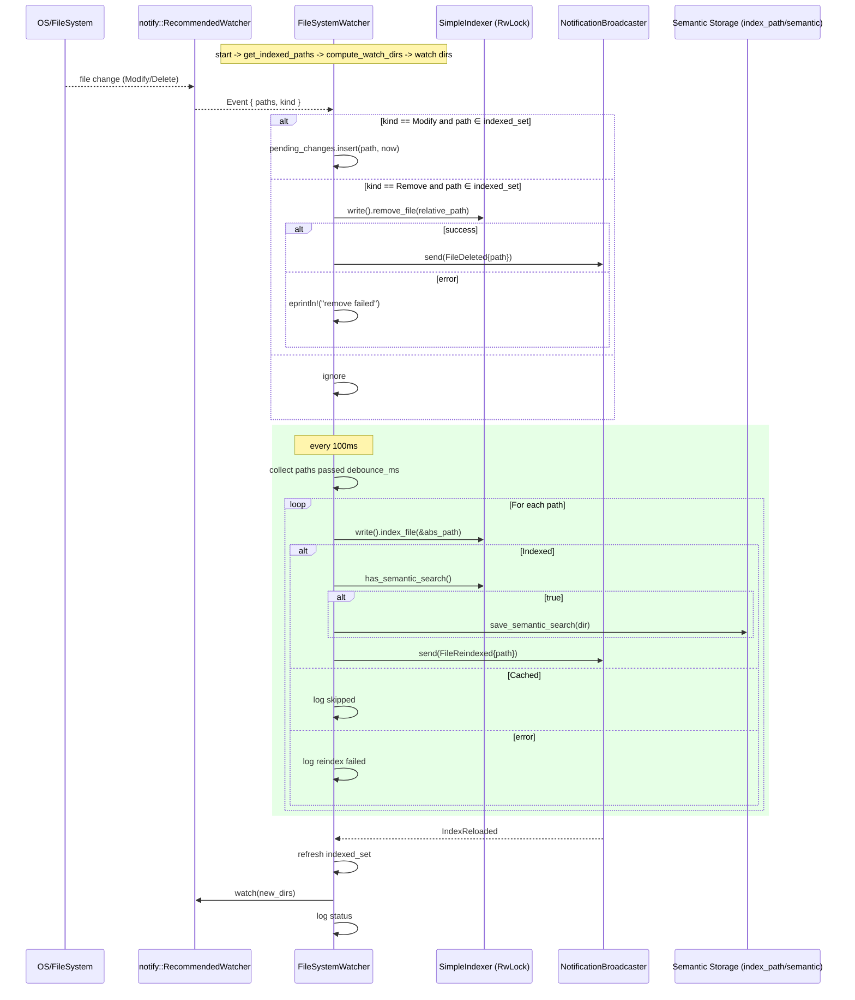

# indexing/fs_watcher.rs Review

## TL;DR

- 目的: 既にインデックス済みのファイルのみを監視し、変更・削除に応じて再インデックスや削除を行う（新規ファイルの自動インデックスは実施しない）。
- 主要公開API: 
  - **FileSystemWatcher::new**（初期化）
  - **FileSystemWatcher::with_broadcaster**（通知ブロードキャスタ設定）
  - **FileSystemWatcher::watch**（監視メインループ）
  - **FileWatchError / WatchError**（エラー型のエクスポート）
- 複雑箇所: 非同期イベントループ（notify→mpsc→tokio::select）とデバウンス処理、パスの相対/絶対整合、インデックスリロード時の差分適用。
- 重大リスク:
  - 削除イベント後に**indexed_setを更新しない**ため、再作成された同一パスを事実上「自動再インデックス」してしまう可能性（方針に矛盾の恐れ）。
  - 削除時の相対パス化に**current_dirを使用**しており、workspace_rootと異なる場合に誤削除の恐れ。
  - **watchディレクトリの重複・未解除**（IndexReloaded後に重複watch追加、未unwatch）によるイベント重複・資源リーク。
  - notifyコールバックで**blocking_send**を使用し、チャネル満杯時にバックプレッシャーでブロックする可能性。
- 並行性と安全性: unsafeは不使用。Arc<RwLock<SimpleIndexer)>による共有。writeロック保持中に重い処理（ファイルI/O・セマンティック保存）を実行しておりスループット低下の懸念。

## Overview & Purpose

このモジュールは「インデックスしたものだけを監視する（watch what you indexed）」という設計方針に基づき、既にインデックスに登録されているファイルの変更・削除のみを監視して、以下を行います。

- 親ディレクトリ単位でwatchを設定しつつ、イベント対象ファイルがインデックスされた集合に含まれる場合のみ処理。
- 変更イベントはデバウンス後に**再インデックス**（ハッシュ比較を前提とした差分再取り込み）。
- 削除イベントは**インデックスから削除**。
- 新規ファイルの自動インデックスは行わない（監視対象外）。

通知（MCP）に対応し、再インデックスや削除発生時に**NotificationBroadcaster**経由で**FileChangeEvent**を配信可能。

## Structure & Key Components

| 種別 | 名前 | 公開範囲 | 責務 | 複雑度 |
|------|------|----------|------|--------|
| Struct | FileSystemWatcher | pub | インデックス済みファイルの監視・デバウンス・再インデックス/削除・通知配信 | High |
| Enum | FileWatchError | pub | ファイル監視固有のエラー分類 | Low |
| Type Alias (re-export) | WatchError | pub | FileWatchErrorの再公開 | Low |
| Method | FileSystemWatcher::new | pub | notifyウォッチャとmpscチャネルの初期化 | Low |
| Method | FileSystemWatcher::with_broadcaster | pub | MCP通知ブロードキャスタの設定 | Low |
| Method | FileSystemWatcher::watch | pub | 非同期イベントループ、デバウンス、インデックス操作 | High |
| Method | FileSystemWatcher::get_indexed_paths | private | インデックス済みパスの取得（ログ出力含む） | Low |
| Function | FileSystemWatcher::compute_watch_dirs | private | パスから一意な親ディレクトリ集合を抽出 | Low |

### Dependencies & Interactions

- 内部依存
  - FileSystemWatcher::watch → 
    - get_indexed_paths（監視対象ファイル集合獲得）
    - compute_watch_dirs（watchするディレクトリ集合算出）
    - indexer.read()/write() 経由で SimpleIndexer の
      - get_all_indexed_paths
      - remove_file
      - index_file
      - has_semantic_search
      - save_semantic_search
    - broadcaster.subscribe()/send（FileChangeEvent）
- 外部依存（主なもの）

| 依存 | 用途 | 重要度 |
|-----|------|--------|
| notify::{Event, EventKind, RecursiveMode, Watcher, recommended_watcher} | ファイルシステム監視 | High |
| tokio::sync::{RwLock, mpsc} | 共有状態、イベントチャネル | High |
| tokio::time::{sleep, Duration} | デバウンス・タイムアウト | High |
| thiserror::Error | エラー実装 | Low |
| std::{collections, path, sync::Arc, time::Instant} | 基本ユーティリティ | High |
| crate::{IndexError, IndexResult, SimpleIndexer} | インデックス操作・結果型 | High |
| crate::mcp::notifications::{FileChangeEvent, NotificationBroadcaster} | MCP通知 | Medium |

- 被依存推定（このモジュールを使う側）
  - CLIやサーバ起動時に、**インデクサ（SimpleIndexer）**と一緒に構築されバックグラウンドで監視を開始するコンポーネント（MCPサーバ、インデクサ管理モジュールなど）。

## API Surface (Public/Exported) and Data Contracts

| API名 | シグネチャ | 目的 | Time | Space |
|-------|------------|------|------|-------|
| FileSystemWatcher::new | pub fn new(indexer: Arc<RwLock<SimpleIndexer>>, debounce_ms: u64, mcp_debug: bool, index_path: &Path) -> IndexResult<FileSystemWatcher> | ウォッチャの構築（notifyセットアップ、mpscチャネル生成） | O(1) | O(1) |
| FileSystemWatcher::with_broadcaster | pub fn with_broadcaster(self, broadcaster: Arc<NotificationBroadcaster>) -> Self | MCP通知ブロードキャスタの設定（ビルダー） | O(1) | O(1) |
| FileSystemWatcher::watch | pub async fn watch(self) -> IndexResult<()> | インデックス済みファイル監視、デバウンス再インデックス、削除、通知 | 周期処理: O(P)+I/O | O(F+P) |
| FileWatchError | pub enum FileWatchError | 監視固有エラーの分類 | - | - |
| WatchError | pub use FileWatchError as WatchError | FileWatchError の別名エクスポート | - | - |

凡例: F=監視対象ファイル数、P=保留中変更数（pending_changes数）

---

詳細:

1) FileSystemWatcher::new
- 目的と責務
  - notify::recommended_watcher を作成し、イベントを tokio::mpsc::Sender にブリッジ（blocking_send）する。
  - Indexerと設定値を保持する watcher を返す。
- アルゴリズム（主要ステップ）
  - mpsc::channel(100) 作成
  - recommended_watcher(|res| tx.blocking_send(res)) 構築
  - self構築（broadcasterはNone）
- 引数

| 引数 | 型 | 必須 | 説明 |
|-----|----|------|------|
| indexer | Arc<RwLock<SimpleIndexer>> | Yes | 共有インデクサ |
| debounce_ms | u64 | Yes | デバウンス時間（ミリ秒） |
| mcp_debug | bool | Yes | デバッグログの詳細制御 |
| index_path | &Path | Yes | セマンティックサーチ永続化ディレクトリのベース |

- 戻り値

| 型 | 説明 |
|----|------|
| IndexResult<FileSystemWatcher> | 初期化に成功すれば Ok(Self)、notify初期化失敗で Err(IndexError::General) |

- 使用例
```rust
use std::sync::Arc;
use std::path::PathBuf;
use tokio::sync::RwLock;

// indexer は既に構築済みとする
let watcher = FileSystemWatcher::new(
    Arc::new(RwLock::new(indexer)),
    300,        // 300msデバウンス
    true,       // 詳細ログ
    PathBuf::from(".codanna/index").as_path()
)?.with_broadcaster(broadcaster.clone());
```

- エッジケース
  - notifyの初期化失敗（リソース/権限）→ Err(IndexError::General)
  - チャネル作成は軽量で通常失敗しない

2) FileSystemWatcher::with_broadcaster
- 目的と責務
  - MCP通知先を設定し、メソッドチェーン可能にする（ビルダー）。
- アルゴリズム
  - self.broadcaster = Some(broadcaster); self を返す
- 引数・戻り値は上表の通り
- 使用例
```rust
let watcher = watcher.with_broadcaster(broadcaster.clone());
```
- エッジケース
  - Noneに戻す機能はない（必要なら別API追加を検討）

3) FileSystemWatcher::watch
- 目的と責務
  - 監視対象決定、notifyへwatch設定、イベント受信→フィルタ→デバウンス→再インデックス/削除、IndexReloaded通知の反映、MCP通知送信。
- アルゴリズム（主な流れ）
  1. get_indexed_paths() で対象ファイル取得
  2. compute_watch_dirs() で親ディレクトリ集合を算出し、RecursiveMode::NonRecursive で watch 登録
  3. indexed_set（絶対パス化）と pending_changes（Path→Instant）を準備
  4. broadcaster があれば subscribe()
  5. tokio::select! ループで:
     - event_rx.recv(): Modify→pending登録、Remove→indexer.remove_file(...)と通知
     - timeout(100ms): pending からデバウンス経過分を index_file(&path) で処理、必要なら save_semantic_search と通知
     - broadcast: IndexReloaded→indexed_set の差分適用（追加分のディレクトリをwatchに登録）
- 引数・戻り値

| 型 | 説明 |
|----|------|
| IndexResult<()> | 内部エラー時は Err(IndexError::...)。通常はループ継続/終了で Ok(()) |

- 使用例（タスク起動）
```rust
let watcher = FileSystemWatcher::new(indexer, 300, false, Path::new(".codanna/index"))?
    .with_broadcaster(broadcaster);
tokio::spawn(async move {
    if let Err(e) = watcher.watch().await {
        eprintln!("Watcher exited with error: {e}");
    }
});
```

- エッジケース
  - indexed_pathsが空: 警告ログのみで継続（将来のIndexReloadedに期待）
  - 巨大な変更バースト: pending_changesが膨らむ可能性
  - 削除イベント: 現実装はindexed_set更新なし（改善余地、後述）

4) FileWatchError / WatchError
- 目的と責務
  - 監視固有の文脈（Watcher初期化失敗、Path監視失敗、イベントエラー、インデックス照会失敗、再インデックス失敗）を表す。
- 注意
  - 現行実装では関数の戻り値にこの型を使っていない（IndexResultを返す）。API整合性の観点で統一を推奨。

データ契約（主な構造）
- Event（notify）: paths(Vec<PathBuf>), kind(EventKind)
- FileChangeEvent（MCP側）:
  - FileReindexed { path: PathBuf }
  - FileDeleted { path: PathBuf }
  - IndexReloaded
- SimpleIndexer:
  - get_all_indexed_paths(): Vec<PathBuf>（相対/絶対混在の可能性に留意）
  - index_file(&Path) -> IndexingResult
  - remove_file(&Path) -> Result<...>

根拠: 上記API・構造はファイル内に定義/使用（関数名:行番号はコード表示に行番号がないため不明）

## Walkthrough & Data Flow

1. 起動時
   - new() が notify watcher と mpscチャネルを構築し、watch() が監視を開始。
   - get_indexed_paths() → compute_watch_dirs() → notify::watch(NonRecursive) で親ディレクトリのみ登録。

2. イベント処理
   - notifyからのイベントは mpsc 経由で watch() の tokio::select! に到達。
   - paths内の各Pathについて indexed_set（絶対パス）に含まれるもののみ処理。
     - Modify: pending_changes[Path] = now
     - Remove: indexer.remove_file(relative_path) → Broadcaster.send(FileDeleted{path})
       - relative_pathは現実装でcurrent_dir基準に変換

3. デバウンス
   - 100msごとにpendingを走査し、debounce_ms経過したパスを集めて index_file() で再インデックス。
   - 結果がIndexedの場合、has_semantic_search()→save_semantic_search(index_path/semantic) を実行し通知。

4. IndexReloaded通知
   - broadcasterからIndexReloadedを受信すると、get_indexed_paths()で新集合を取得。
   - 差分（added/removed）を計算し、addedの親ディレクトリを新規watchに登録。indexed_setを置き換え。

以下の図は watch 関数（行番号不明、このチャンクには行番号が含まれていません）の主要フローとアクター間の相互作用を示します。



## Complexity & Performance

- compute_watch_dirs(paths): 時間 O(n)、空間 O(k)（k=一意な親ディレクトリ数）
- イベント処理（1イベントあたり）
  - pathsの走査: O(m)（イベントに含まれるパス数）
  - indexed_set.contains: ハッシュセット平均 O(1)
  - Modify: pending_changes更新 O(1)
  - Remove: indexer.remove_file: 依存先I/OとDB次第（支配）
- デバウンスチェック（100msごと）
  - pending_changes.retain: O(P)（P=保留数）
  - index_file(&path): 依存先I/Oとハッシュ計算が支配
  - save_semantic_search: 依存先I/Oが支配
- メモリ
  - O(F + D + P): F=indexed_setサイズ、D=watchディレクトリ数、P=保留変更数
- 実運用負荷
  - I/O（ファイル読み込み、インデックス更新、セマンティック保存）と通知配信。
  - 大量変更時は pending_changes が膨らみ、100ms周期のバッチ規模が拡大。
  - recommended_watcher→blocking_send はカレントのnotifyスレッドをブロックしうるため、イベント集中時の遅延/バックプレッシャーに注意。

## Edge Cases, Bugs, and Security

セキュリティチェックリスト
- メモリ安全性: unsafe未使用。所有権/借用はArc<RwLock>により明確。Buffer overflow/Use-after-free/Integer overflowの懸念なし。
- インジェクション: 外部入力をコマンド/SQLに渡す処理なし。Path traversalはnotify発の絶対パスを扱うが、書き込みは自分のインデックス領域のみ（問題低）。
- 認証・認可: 該当なし（ファイル監視ローカル機能）。
- 秘密情報: ハードコード秘密なし。ログにパスは出力されるが機密は含まない想定（慎重さは必要）。
- 並行性: RwLockのwrite中に重いI/Oを実行。blocking_sendによる潜在的ブロック。watchディレクトリ集合の重複管理なし（リソースリークの恐れ）。

エッジケース一覧

| エッジケース | 入力例 | 期待動作 | 実装 | 状態 |
|-------------|--------|----------|------|------|
| インデックス空 | indexed_paths = [] | 警告して待機継続 | 実装あり（eprintln） | OK |
| 相対/絶対の不一致（削除時） | workspace_root=/repo, current_dir=/home | workspace_root基準で相対化 | current_dir基準でstrip_prefix | バグの可能性 |
| 削除後のindexed_set更新 | Remove(event) | indexed_setから即時除外 | 更新なし | 改善要 |
| IndexReloaded後の重複watch | 既にwatch中のディレクトリを再watch | 重複回避 | 既存watch集合の管理なし | 改善要 |
| チャネル満杯 | 100件超のburst発生 | 非ブロッキングで落ちずに遅延処理 | blocking_send | リスク |
| 大量変更でpending膨張 | 多数Modify | デバウンスでバッチ処理 | 実装あり | 要監視 |
| Windowsの大文字小文字/シンボリックリンク | C:\Repo vs c:\repo | 正規化して一致判定 | 正規化なし | 改善要 |
| セマンティック保存の重さ | 大ファイル/多数再インデックス | ロック時間最小化 | writeロック保持中に実行 | リスク |
| notifyイベント経路のエラー | Err(e) from event_rx | ログ出力と継続/復旧 | eprintlnのみ | 改善要（再試行/監視） |

Rust特有の観点（詳細）
- 所有権
  - FileSystemWatcherは**selfを所有**してwatch()にmove（watch: selfの所有権消費）。notify::RecommendedWatcherをstructに保持してライフ保持。
- 借用/ライフタイム
  - indexer: Arc<RwLock<...>>でread()/write().awaitのスコープ内のみ借用。明示的ライフタイムは不要。
- unsafe境界
  - なし。
- 並行性・非同期
  - Send/Sync: FileSystemWatcher全体のSend性はnotify::RecommendedWatcherに依存。tokio::spawnで使う場合は要Send。現在のコードはspawn例外ではなく直接await想定。必要に応じてスレッド境界を意識。
  - データ競合: インデクサはRwLockで保護。writeロック保持時間が長くなりうる（I/Oを含むため）。
  - await境界: write().await後は同期メソッドを呼ぶだけでawaitは挟まないが、CPU/I/Oブロッキングがイベントループ遅延を招く。
  - キャンセル: watch()はループを抜ける条件が限定（チャネルclose時）。明示的なシャットダウン手段がない。
- エラー設計
  - FileWatchError定義ありだが未使用。戻り値はIndexResultで一般化。エラー整合性が分散。
  - unwrap/expect: テスト以外では使用なし。イベントループはeprintlnで通知が中心。From/Intoの変換設計は不足。

根拠: 関数名・処理は当ファイル内実装。行番号はこのチャンクに含まれないため併記不能。

## Design & Architecture Suggestions

1. パス正規化の統一
   - 常に**workspace_root基準**での相対/絶対変換を行うユーティリティを導入（canonicalize + relative_to）。
   - 削除時の相対化にcurrent_dirを用いず、workspace_rootを使用。

2. indexed_setメンテナンス
   - Remove処理成功時に**indexed_setからも除去**し、方針（「新規ファイル自動インデックスしない」）の一貫性を担保。

3. watchディレクトリの重複管理とunwatch
   - 現在watch中のディレクトリ集合（HashSet<PathBuf>）を保持し、IndexReloaded差分適用時に**追加のみwatch、不要になったものはunwatch**。

4. notify→mpscの送信戦略
   - blocking_sendの代わりに**try_send→失敗時に落ち着くまでdropping**か**bounded+backpressureロギング**を検討。
   - あるいは専用スレッドでの非同期送信/バッファリング戦略。

5. ロック縮小
   - writeロック保持中にI/Oを避ける設計（例: ファイル読み込み・ハッシュ計算はロック外で、インデックス更新のみロック内）。

6. エラー型の統一
   - 監視APIは**Result<_, WatchError>**を返すように整理し、呼び出し側で扱いやすく。

7. シャットダウン対応
   - 停止用の**CancellationToken**や停止チャネルを導入して優雅にループ終了。

8. OS差異対応
   - Windowsのケース無視やシンボリックリンク解決をオプション化（設定で制御）。

## Testing Strategy (Unit/Integration) with Examples

単体テスト
- compute_watch_dirs: 既存テストあり。追加で
  - ルート直下ファイル（親ディレクトリ空）ケース
  - 相対パス/絶対パス混在ケース
```rust
#[test]
fn compute_watch_dirs_handles_root_and_mixed_paths() {
    let paths = vec![PathBuf::from("file.rs"), PathBuf::from("/abs/dir/x.rs")];
    let dirs = FileSystemWatcher::compute_watch_dirs(&paths);
    assert!(dirs.contains(&PathBuf::from(".")));
    assert!(dirs.contains(&PathBuf::from("/abs/dir")));
}
```

結合テスト（実ファイルI/O + notify）
- 変更のデバウンス
  - 小さいdebounce_ms（例えば50ms）でファイルを複数回連続で書き換え、再インデックスが1回に集約されることを確認。
- 削除処理
  - ファイル削除で remove_file が呼ばれ、MCP通知(FileDeleted)が送信されることを検証。
- IndexReloaded処理
  - ブロードキャスタからIndexReloadedを送信し、indexed_setが更新され、追加ディレクトリがwatchされることを検証。

例（擬似的・概略）
```rust
#[tokio::test]
async fn reindex_on_modify_after_debounce() {
    let temp = tempfile::tempdir().unwrap();
    let file = temp.path().join("a.rs");
    std::fs::write(&file, "fn main() {}").unwrap();

    let settings = crate::Settings { index_path: temp.path().join(".idx"), ..Default::default() };
    let mut indexer = SimpleIndexer::with_settings(Arc::new(settings));
    indexer.index_file(&file).unwrap();

    let indexer = Arc::new(RwLock::new(indexer));
    let broad = Arc::new(NotificationBroadcaster::new()); // 具体実装は本チャンク外（不明）
    let watcher = FileSystemWatcher::new(indexer.clone(), 50, false, temp.path()).unwrap()
        .with_broadcaster(broad.clone());

    let handle = tokio::spawn(async move { watcher.watch().await });

    // 連続変更
    std::fs::write(&file, "fn main(){println!(\"1\");}").unwrap();
    std::fs::write(&file, "fn main(){println!(\"2\");}").unwrap();

    tokio::time::sleep(std::time::Duration::from_millis(200)).await;
    // ここで broad に FileReindexed が1回届いていることを検証（実装は不明）

    // 終了処理は現実装に停止APIがないため、handleのキャンセル等が必要
    handle.abort();
}
```

プロパティテスト
- 任意のパス集合に対し、compute_watch_dirsの結果が「入力の親ディレクトリ集合の重複なし」になること。

負荷試験
- 多数のModifyイベント（>100）を短時間に投下し、blocking_sendによる遅延/ドロップ/重複がないか観測（現状はブロックするため測定が重要）。

## Refactoring Plan & Best Practices

段階的計画
1. パス正規化ユーティリティの導入
```rust
impl FileSystemWatcher {
    fn to_workspace_abs(&self, p: &Path, workspace_root: &Path) -> PathBuf {
        if p.is_absolute() { p.to_path_buf() } else { workspace_root.join(p) }
    }
    fn to_workspace_rel(&self, p: &Path, workspace_root: &Path) -> PathBuf {
        p.strip_prefix(workspace_root).unwrap_or(p).to_path_buf()
    }
}
```
- Remove処理では current_dir ではなく workspace_root を使用。

2. 削除時indexed_set更新
```rust
// Remove成功後
indexed_set.remove(path); // absパスで保持しているためそのまま除去
```

3. watchディレクトリ集合管理とunwatch
```rust
// structに追記
watched_dirs: HashSet<PathBuf>,

// 追加時
for d in new_dirs {
    if watched_dirs.insert(d.clone()) {
        self._watcher.watch(&d, RecursiveMode::NonRecursive)?;
    }
}
// 不要時（差分で消えたもの）
for d in removed_dirs {
    if watched_dirs.remove(&d) {
        self._watcher.unwatch(&d)?;
    }
}
```

4. 非ブロッキング送信
```rust
let _ = tx.try_send(res).or_else(|_| {
    // 必要ならログだけ出して破棄 or バックオフ
    eprintln!("Watcher channel full; dropping event");
    Ok(())
});
```

5. ロック縮小
- index_fileのための入出力をロック外で行えるよう、**インデクサAPIの再設計**（例: 事前にファイル内容/メタを読み込んでから短時間でインデックス反映）。

6. エラー統一
- watch() 等の戻り値を Result<_, WatchError> にし、通知系エラー/インデックスエラーを適切に分類。

7. シャットダウン
- CancellationTokenを引数またはselfに持たせ、select!でキャンセルを待つ分岐を追加。

## Observability (Logging, Metrics, Tracing)

- ログ
  - eprintln!を**tracing**に置き換え（info/debug/warn/error）。mcp_debugはレベル制御に委譲。
  - パスや件数はstructured fieldで出す: file=..., debounce_ms=...

- メトリクス
  - 監視中ファイル数、保留変更数、再インデックス成功/失敗カウンタ、デバウンスにより結合された変更数。
  - チャネルの使用率（深さ）を観測。

- トレーシング
  - イベント→再インデックス→セマンティック保存→通知送信を**span**で関連付け。pathごとのspanを発行。

- アラート
  - 連続エラー（EventError、ReindexFailed）の一定回数超過で警告。

## Risks & Unknowns

- OS/プラットフォーム差異
  - notifyのbackend（inotify/FSEvents/ReadDirectoryChangesW等）差異により、絶対パス/大文字小文字/シンボリックリンクの挙動が異なる可能性。
- SimpleIndexerの詳細が不明
  - index_file/ remove_file/ save_semantic_search のコストやスレッドセーフ性、内部でのブロッキング状況がこのチャンクでは不明。
- NotificationBroadcasterの仕様不明
  - subscribe()/send の具体APIやチャンネル容量、バックプレッシャーが不明（落ちる/ブロックする条件の把握が必要）。
- リソースリーク
  - 現状unwatchしない設計により、長寿命プロセスで監視ディレクトリが増加し続ける可能性。
- 停止手段不在
  - Ctrl+C以外で優雅に停止するAPIがないため、組込み環境やサービス運用では課題。

以上の指摘はすべて当該ファイルの実装内容に基づく（関数名:行番号はこのチャンクに含まれていないため併記不可）。