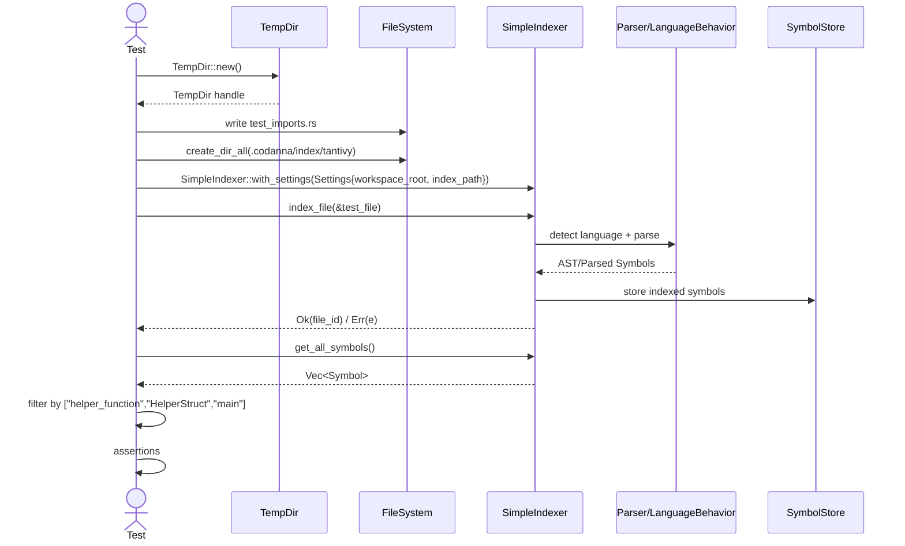

# indexing/import_resolution_proof.rs Review

## TL;DR

- 目的: **Rust の import（use）解決ロジック**が言語固有のルールに従って正しく動作するかを、単体（RustBehavior）と統合（SimpleIndexer）で検証するテスト。
- 公開API: このファイル自体の**公開APIは無し**（テストのみ）。ただし外部の公開APIを使用（RustBehavior::import_matches_symbol、SimpleIndexer::{with_settings,index_file,get_all_symbols}）。
- コアロジック: テーブル駆動のテストで**相対/絶対パス、ネスト、標準ライブラリ**の一致を検証。統合テストでは**一時ファイルをインデックス化してシンボル抽出**を確認。
- 重要な複雑箇所: 統合テストの**設定（workspace_root/index_path）とファイルシステム**の相互作用。インデクサ内部の動作は外部依存でこのチャンクには現れない。
- 重大リスク: テスト内の**unwrap/panic**による脆弱性（テスト失敗時の診断性低下）、**パス結合規約の暗黙的依存**、**外部APIの動作不明**。
- Rust安全性/並行性: **unsafeなし**、**同期のみ**。所有権・借用は文字列リテラル中心で安全。外部型（Arc、SimpleIndexer）の**Send/Syncは不明**（このチャンクには現れない）。
- 追加検証推奨: `self/super/crate`の相対指定、**glob import**、**エイリアス/再エクスポート**、**可視性**の分離テスト。

## Overview & Purpose

このファイルは、インデクシング機能のうち**Rust の import 解決（パス一致）**が期待どおりに動作することを検証する**テストモジュール**です。2つの側面で検証します。

1. 単体テスト: `RustBehavior::import_matches_symbol` の**純粋な一致判定**を、各種パターンで確認。
2. 統合テスト: 一時ディレクトリに Rust ファイルを生成し、`SimpleIndexer` でインデックス化。抽出されたシンボルに**期待する関数・構造体**が含まれるかを確認。

注記（コード頭コメントに基づく）:
- 本テストは**パス一致**に焦点。**可視性（is_symbol_visible_from_file）**は別途扱いで、このチャンクには現れない。

## Structure & Key Components

| 種別 | 名前 | 公開範囲 | 責務 | 複雑度 |
|------|------|----------|------|--------|
| Module | tests | private (`#[cfg(test)]`) | パス一致単体・インデクサ統合テスト群 | Med |
| Function | test_import_matching_logic | private (`#[test]`) | RustBehavior の import パス一致検証（テーブル駆動） | Low |
| Function | test_import_resolution_with_indexer | private (`#[test]`) | 一時ファイルをインデックス化し抽出シンボルを検証 | Med |
| External Struct | RustBehavior | external | 言語固有ロジックの実装（import パス一致） | 不明 |
| External Trait | LanguageBehavior | external | 言語抽象の振る舞いインタフェース | 不明 |
| External Struct | SimpleIndexer | external | インデクシングとシンボル抽出の高水準API | 不明 |
| External Struct | Settings | external | インデクサ設定（workspace_root, index_path など） | 不明 |
| External Struct | TempDir | external | テスト用一時ディレクトリ作成 | Low |

### Dependencies & Interactions

- 内部依存
  - `test_import_matching_logic` と `test_import_resolution_with_indexer` は**互いに独立**。
- 外部依存（このファイルから参照）
  | 依存名 | 種別 | 用途 |
  |--------|------|------|
  | crate::parsing::rust::RustBehavior | 構造体 | import パス一致メソッドの呼び出し |
  | crate::parsing::LanguageBehavior | トレイト | 言語振る舞いの抽象（RustBehavior が実装想定） |
  | crate::indexing::SimpleIndexer | 構造体 | ファイルインデックス化とシンボル取得 |
  | crate::config::Settings | 構造体 | インデクサの設定投入 |
  | tempfile::TempDir | 構造体 | テスト用ディレクトリ管理 |
  | std::sync::Arc | 構造体 | 設定共有（参照カウント） |
  | std::fs, std::path::PathBuf | モジュール | テストファイル作成、パス操作 |
- 被依存推定
  - このテストモジュールを直接**使用する外部箇所はない**（テスト専用）。
  - テストが間接的に検証するため、**RustBehavior**と**SimpleIndexer**を利用するプロダクションコード全般の信頼性に寄与。

## API Surface (Public/Exported) and Data Contracts

このファイルの公開API: 該当なし（テストのみ）。

外部APIの利用（推定シグネチャと契約。実体はこのチャンクには現れない）:

| API名 | シグネチャ（推定） | 目的 | Time | Space |
|-------|---------------------|------|------|-------|
| RustBehavior::new | fn new() -> RustBehavior | Rust言語振る舞いインスタンス生成 | O(1) | O(1) |
| RustBehavior::import_matches_symbol | fn import_matches_symbol(import: &str, symbol_path: &str, importing_module: Option<&str>) -> bool | import パスがシンボルのモジュール絶対パスに一致するか | O(k)（文字列長に比例, 推定） | O(1) |
| SimpleIndexer::with_settings | fn with_settings(settings: Arc<Settings>) -> SimpleIndexer | インデクサの生成 | O(1)（初期化） | O(1) |
| SimpleIndexer::index_file | fn index_file(path: &Path) -> Result<FileId, Error> | 1ファイルのインデックス化（パース・抽出・保存） | O(n)（ファイルサイズ/トークン数, 推定） | O(n)（抽出構造に依存, 推定） |
| SimpleIndexer::get_all_symbols | fn get_all_symbols(&mut self) -> Vec<Symbol> | 抽出済みシンボル一覧取得 | O(m)（シンボル数, 推定） | O(m) |

注意:
- シグネチャ・型（FileId, Symbol など）は**不明**。使用方法（println/debug, フィルタリング）からの推定。
- エビデンス: 関数呼び出しは `test_import_matching_logic` と `test_import_resolution_with_indexer` 内の該当箇所に現れるが、**行番号はこのチャンクには現れない**。

各APIの詳細（外部APIでありこのファイルには定義がないため、使用され方に基づく要約）:

1) RustBehavior::import_matches_symbol
- 目的と責務: import パス（相対/絶対/標準ライブラリ）と対象シンボルの**絶対モジュールパス**が一致するか判定。
- アルゴリズム（推定）
  1. importing_module が `Some` の場合、`helpers::...` のような相対パスを `importing_module` を基準に**正規化**。
  2. `crate::...` 始まりは**絶対**として比較。
  3. `std::...` は**標準ライブラリ**として**完全一致**比較。
  4. 正規化済みパスと `symbol_path` の**文字列比較**で一致可否を返す。
- 引数
  | 名前 | 型（推定） | 説明 |
  |------|------------|------|
  | import | &str | use/import句で指定されたパス |
  | symbol_path | &str | シンボルの絶対モジュールパス |
  | importing_module | Option<&str> | インポート元モジュールの絶対パス |
- 戻り値
  | 型 | 説明 |
  |----|------|
  | bool | 一致すれば true |
- 使用例（本ファイルより）
  ```rust
  let rust_behavior = RustBehavior::new();
  let result = rust_behavior.import_matches_symbol(
      "helpers::helper_function",
      "crate::examples::rust::import_resolution_test::helpers::helper_function",
      Some("crate::examples::rust::import_resolution_test"),
  );
  assert!(result);
  ```
- エッジケース（推定）
  - `importing_module` が None の相対インポート
  - `self::`/`super::`/`crate::` の混在
  - `use helpers::*` のような**glob import**
  - `use helpers as h` の**エイリアス**
  - `pub use` による**再エクスポート**
  - パス末尾が**型/関数名**で一致しても中間モジュールが異なるケース

2) SimpleIndexer::with_settings, index_file, get_all_symbols
- 目的と責務: 設定に基づきインデクサを構築し、ファイルから**シンボル抽出**とインデックス化を行う。
- アルゴリズム（推定）
  1. with_settings: 設定（workspace_root, index_path）を保持。
  2. index_file: ファイル読み込み→言語判定→パース→シンボル抽出→インデックス保存。
  3. get_all_symbols: 抽出済みのシンボル集合を返却。
- 使用例（本ファイルより抜粋）
  ```rust
  use crate::config::Settings;
  use std::sync::Arc;

  let settings = Settings {
      workspace_root: Some(temp_dir.path().to_path_buf()),
      index_path: std::path::PathBuf::from(".codanna/index"),
      ..Default::default()
  };
  let mut indexer = SimpleIndexer::with_settings(Arc::new(settings));
  match indexer.index_file(&test_file) {
      Ok(_) => {
          let symbols = indexer.get_all_symbols();
          /* ... 省略 ... */
      }
      Err(e) => panic!("Failed to index file: {e:?}"),
  }
  ```

## Walkthrough & Data Flow

1) test_import_matching_logic の流れ
- 概要: **テーブル駆動**で import とシンボルパスの一致を検証。
- 主要処理
  ```rust
  #[test]
  fn test_import_matching_logic() {
      let rust_behavior = RustBehavior::new();
      let test_cases = vec![
          ("helpers::helper_function",
           "crate::examples::rust::import_resolution_test::helpers::helper_function",
           Some("crate::examples::rust::import_resolution_test"),
           true, "Relative import should match full path"),
          /* ... 省略（他5ケース） ... */
      ];
      for (import_path, symbol_path, importing_module, expected, description) in test_cases {
          let result = rust_behavior.import_matches_symbol(import_path, symbol_path, importing_module);
          assert_eq!(result, expected, "Failed: {description}");
      }
  }
  ```
- データフロー
  - 入力: 各タプル（import_path, symbol_path, importing_module, expected, description）
  - 処理: RustBehavior により**パス正規化+一致判定**（推定）
  - 出力: `bool` 結果を `expected` と比較

2) test_import_resolution_with_indexer の流れ
- 概要: **一時ファイル生成→インデックス化→シンボル抽出→期待確認**。
- 主要処理
  ```rust
  #[test]
  fn test_import_resolution_with_indexer() {
      let temp_dir = TempDir::new().unwrap();
      let test_file = temp_dir.path().join("test_imports.rs");
      std::fs::write(&test_file, r#"
      mod helpers {
          pub fn helper_function() -> String { "Helper".to_string() }
          pub struct HelperStruct { pub value: i32 }
      }
      use helpers::helper_function;
      use helpers::HelperStruct;
      fn main() {
          let result = helper_function();
          let s = HelperStruct { value: 42 };
          println!("Result: {}", result);
      }
      "#).unwrap();

      // Settings と Indexer の準備
      let index_path = temp_dir.path().join(".codanna").join("index").join("tantivy");
      std::fs::create_dir_all(&index_path).unwrap();

      let settings = Settings {
          workspace_root: Some(temp_dir.path().to_path_buf()),
          index_path: std::path::PathBuf::from(".codanna/index"),
          ..Default::default()
      };
      let mut indexer = SimpleIndexer::with_settings(Arc::new(settings));

      // インデックス化
      match indexer.index_file(&test_file) {
          Ok(file_id) => {
              let symbols = indexer.get_all_symbols();
              let our_symbols: Vec<_> = symbols.into_iter().filter(|s| {
                  let name = s.name.to_string();
                  name == "helper_function" || name == "HelperStruct" || name == "main"
              }).collect();
              assert!(our_symbols.iter().any(|s| s.name.as_ref() == "helper_function"));
              assert!(our_symbols.iter().any(|s| s.name.as_ref() == "HelperStruct"));
              assert!(our_symbols.iter().any(|s| s.name.as_ref() == "main"));
          }
          Err(e) => panic!("Failed to index file: {e:?}"),
      }
  }
  ```
- データフロー
  - 入力: テストファイルのソースコード（helpers モジュールと use 宣言、main 関数）
  - 処理: SimpleIndexer により**パース→シンボル抽出**（外部依存）
  - 出力: シンボル集合から対象名をフィルタして**存在確認**

### Mermaid Sequence Diagram

以下は `test_import_resolution_with_indexer` 関数の主要な呼び出し・協調を示すシーケンス図（行番号はこのチャンクには現れない）。



上記の図は`test_import_resolution_with_indexer`関数の主要分岐を示す。

## Complexity & Performance

- test_import_matching_logic
  - 時間計算量: O(t · k) 推定（t=テストケース数=6、k=文字列長の比較/正規化）
  - 空間計算量: O(1) 〜 O(t)（テーブルデータ）
  - ボトルネック: なし（軽量文字列演算）
- test_import_resolution_with_indexer
  - 時間計算量: O(n + m) 推定（n=ファイルサイズ/パースコスト、m=抽出シンボル数）
  - 空間計算量: O(m)（シンボル格納）
  - 実運用負荷要因: I/O（ファイル読み書き）、パースとインデックス保存（Tantivy がある場合はディスクI/O）。
- スケール限界: テストは単一ファイル・小規模。大量ファイル/大規模プロジェクトでの挙動は**このチャンクには現れない**。

## Edge Cases, Bugs, and Security

セキュリティチェックリスト評価:

- メモリ安全性
  - Buffer overflow / Use-after-free / Integer overflow: 該当なし（標準安全Rust、文字列リテラル中心）。
  - 所有権/借用: 文字列リテラル（'static）の使用で安全。`symbols.into_iter()` でムーブ→`our_symbols` に所有権移転。
  - ライフタイム: 明示的パラメータ不要。Option<&str> もリテラルで 'static のため問題なし。
- インジェクション
  - SQL/Command/Path traversal: 該当なし。本テストは固定文字列・一時ディレクトリのみを扱う。
- 認証・認可
  - 該当なし。
- 秘密情報
  - Hard-coded secrets: なし。
  - Log leakage: `println!` にシンボル名・モジュールパス・ファイルパスを出力。問題となる秘密情報は含まれない。
- 並行性
  - Race condition / Deadlock: 該当なし（同期テストのみ）。
  - Send/Sync: `Arc<Settings>` は共有可能だが、SimpleIndexer の Send/Sync は**不明**（このチャンクには現れない）。

Rust特有の観点（詳細チェック）:

- 所有権
  - `symbols.into_iter()` により `symbols` の所有権がイテレータへ移動（`test_import_resolution_with_indexer`）。
- 借用
  - `s.name.as_ref()` は内部データへの借用参照。可変借用は使用していない。
- ライフタイム
  - 文字列リテラルの Option<&str> は 'static。関数スコープ内のみで使用し安全。
- unsafe境界
  - unsafe ブロックの使用: なし。
- 並行性・非同期
  - 非同期処理や await は使用なし。
- エラー設計
  - `unwrap()` が複数箇所に存在。テスト用途とはいえ、失敗時の診断性向上のため `expect()` メッセージ付与推奨。
  - `index_file` の `Err(e)` を `panic!` へ変換。より詳細なエラーの表示や分類は外部API依存。

エッジケース一覧（このテストでの網羅状況と不足）:

| エッジケース | 入力例 | 期待動作 | 実装 | 状態 |
|-------------|--------|----------|------|------|
| 相対パス一致 | "helpers::helper_function" + importing_module=Some("...::import_resolution_test") | 一致 | あり | ✅ |
| ネスト一致 | "helpers::nested::nested_function" | 一致 | あり | ✅ |
| 標準ライブラリ | "std::collections::HashMap" | 完全一致 | あり | ✅ |
| 誤モジュール | "helpers::helper_function" vs other_helpers | 不一致 | あり | ✅ |
| crate絶対 | "crate::config::Config" | 完全一致 | あり | ✅ |
| crate相対 | "config::Config" + importing_module="crate" | 一致 | あり | ✅ |
| importing_module=None | None + 相対パス | 不明（推定: 不一致 or ルート解決） | なし | ❌ |
| self/super指定 | "self::x", "super::y" | 正規化一致 | なし | ❌ |
| glob import | "helpers::*" | 名前一致で許容 | なし | ❌ |
| エイリアス | "use helpers as h; h::f()" | エイリアス解決 | なし | ❌ |
| 再エクスポート | "pub use a::b::C; use C;" | 再エクスポート解決 | なし | ❌ |

既知/潜在的バグ:
- `unwrap()` の多用により**環境要因の失敗**（ディレクトリ作成/ファイル作成失敗）で**テストがパニック**する。
- `index_path` の指定が `.codanna/index`（相対）である一方、事前に作成するディレクトリは `temp_dir/.codanna/index/tantivy`。設計次第で**パス不整合**の可能性（ただし多くの実装では workspace_root + index_path を基底として問題なし）。

## Design & Architecture Suggestions

- エラーハンドリング強化
  - `unwrap()` を `expect("context")` に変更し、**失敗理由のコンテキスト**を付与。
- 設定一貫性
  - `index_path` の事前作成と設定値を**同一規約**（相対/絶対）に統一。
  - 例: `Settings { index_path: temp_dir.path().join(".codanna/index") }` とし、`tantivy` 下位の作成はインデクサ側に委任。
- テストヘルパー導入
  - 一時ワークスペース初期化、インデクサ生成、ファイル作成を**共通関数**化して重複削減・可読性向上。
- ケース拡張（import解決）
  - `self`, `super`, `crate` の相対指定、`glob`、`alias`、再エクスポートを含む**包括的テスト**に拡張。
- 可視性テストの分離
  - コメントにあるとおり、**可視性**は別モジュールで独立検証。ここでは**純粋なパス一致**に注力。

## Testing Strategy (Unit/Integration) with Examples

- 単体テスト強化（import_matches_symbol）
  - 相対指定の特殊ケースと None ケース:
    ```rust
    #[test]
    fn test_import_matches_symbol_relative_none() {
        let rb = RustBehavior::new();
        assert_eq!(
            rb.import_matches_symbol("helpers::helper_function",
                                     "crate::helpers::helper_function",
                                     None),
            /* 期待: 不一致 or ルート解決。実装に依存 */ false
        );
    }
    ```
  - self/super/crate/glob/alias:
    ```rust
    #[test]
    fn test_import_matches_symbol_self_super_glob_alias() {
        let rb = RustBehavior::new();
        // self/super
        assert!(rb.import_matches_symbol("self::helper_function",
              "crate::examples::rust::import_resolution_test::helpers::helper_function",
              Some("crate::examples::rust::import_resolution_test::helpers")));
        assert!(rb.import_matches_symbol("super::helper_function",
              "crate::examples::rust::import_resolution_test::helpers::helper_function",
              Some("crate::examples::rust::import_resolution_test::helpers::nested")));
        // glob（実装が対応している場合）
        assert!(rb.import_matches_symbol("helpers::*",
              "crate::examples::rust::import_resolution_test::helpers::helper_function",
              Some("crate::examples::rust::import_resolution_test")));
        // alias（実装が対応している場合）
        assert!(rb.import_matches_symbol("h::helper_function",
              "crate::examples::rust::import_resolution_test::helpers::helper_function",
              Some("crate::examples::rust::import_resolution_test")));
    }
    ```
    これらの期待値は**実装仕様に依存**。現行仕様が未対応なら不一致とすべき。
- 統合テスト拡張（インデクサ）
  - 再エクスポートと use エイリアスの解決検証:
    ```rust
    #[test]
    fn test_indexer_resolves_reexports_and_alias() {
        let td = TempDir::new().unwrap();
        let f = td.path().join("lib.rs");
        std::fs::write(&f, r#"
        mod m1 { pub fn f(){} pub struct S; }
        pub use m1::f as g;
        use g as h;
        fn main(){ h(); let _ = m1::S; }
        "#).unwrap();
        // ... Settings/Indexer setup 同様 ...
        // indexer.index_file(&f) -> シンボル "main", "m1::f", "m1::S" の抽出と、
        // 呼び出しが g/h 経由でも f へ解決されるかを検証（仕様に依存）
    }
    ```

## Refactoring Plan & Best Practices

- 失敗時の診断性改善
  - `unwrap()` を `expect("TempDir::new failed")`, `expect("write test file failed")`, `expect("create_dir_all failed")` に置換。
- 設定生成の共通化
  ```rust
  fn make_indexer_with_temp_root() -> (TempDir, SimpleIndexer) {
      let td = TempDir::new().expect("TempDir failed");
      let settings = Settings {
          workspace_root: Some(td.path().to_path_buf()),
          index_path: td.path().join(".codanna/index"),
          ..Default::default()
      };
      std::fs::create_dir_all(settings.index_path.join("tantivy"))
          .expect("index dir create failed");
      let indexer = SimpleIndexer::with_settings(Arc::new(settings));
      (td, indexer)
  }
  ```
- テーブル駆動の共通アサート
  - 一致判定テストの**ループ処理**をヘルパー化し、説明・失敗メッセージを一元管理。
- ログの標準化
  - `println!` から `tracing` へ移行（テスト時は `tracing_subscriber` を簡易初期化）。

## Observability (Logging, Metrics, Tracing)

- ログ
  - `tracing` クレート導入で**構造化ログ**にし、どの import がどのシンボルへ**解決されたか**を属性として記録。
- メトリクス
  - テスト時でも、パース時間、抽出シンボル数などの簡易メトリクスを計測可能に（`index_file` の計測は外部実装次第）。
- トレーシング
  - `import_matches_symbol` の**正規化ステップ**を span で可視化（言語振る舞い側の実装に追加が必要）。

## Risks & Unknowns

- 外部API仕様不明
  - `RustBehavior::import_matches_symbol` の**仕様詳細**（self/super/glob/alias対応）はこのチャンクには現れない。
  - `SimpleIndexer` の内部動作（Tantivy インデックス構造、パフォーマンス特性）は不明。
- パス規約の前提
  - `symbol_path` が `"crate::...::..."` 形式であることに**強く依存**。表記揺れ（例: leading `::`）への耐性は不明。
- 環境依存
  - ファイルシステム（パス区切り、権限）や OS による差異はテストでは十分にカバーされない。
- 可視性の扱い
  - 本テストは**可視性**を扱わない設計だが、実運用では import 解決と可視性が絡むため**総合的な検証**が必要。

以上を踏まえ、このファイルは import 解決の**コアロジック検証の起点**として有益ですが、より広範な言語仕様とインデクサ内部の挙動を網羅するためには、**テストケースの拡張**と**診断性・一貫性の改善**が効果的です。