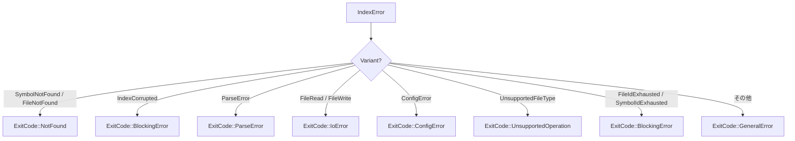

# io/exit_code.rs Review

## TL;DR

- 目的: CLIの終了コードを**Unix慣習**と**Claude Codeセマンティクス**に合わせて標準化し、エラー種別に応じた機械可読なコードを返す
- 主な公開API: **ExitCode**列挙、**from_error**、**from_retrieve_result**、**is_success**、**is_blocking**、**description**、および**From<ExitCode> for i32**
- 複雑箇所: **IndexError→ExitCode**のマッピング（多岐の分岐によるポリシー表現）
- 重大リスク: 未知のIndexErrorは**GeneralError**にフォールバックするため、深刻度の見落としの可能性（分類漏れ）
- 安全性: **unsafeなし**、所有権/借用は単純、パニックなし、並行性なし（純粋関数）
- パフォーマンス: すべての関数は**O(1)**、メモリも**O(1)**
- テスト: 退出コード値、成功/ブロッキング判定、取得結果マッピングはテスト済。IndexError各バリアントの網羅テストは拡充余地あり

## Overview & Purpose

このモジュールはCLI操作における**終了コード**を定義し、アプリケーション内の結果オブジェクトやエラー型（IndexError）を**意味論的**なExitCodeへ変換します。以下の目的を持ちます。

- 操作成功/失敗/回復可能/自動化停止（ブロッキング）の区別を、**数値コード**と**人間可読説明**で提供
- スクリプトやCI/CD等の**自動化パイプライン**が、戻り値から迅速に分岐できるよう支援
- エラー分類ポリシーを**集中管理**し、コードベース全体で一貫性を担保

ExitCodeは**repr(u8)**でOSの慣習に合わせた0〜255の範囲、主に下記を定義しています。

- 0: Success（成功）
- 1: GeneralError（一般エラー）
- 2: BlockingError（自動化停止が必要な重大エラー）
- 3: NotFound（対象が見つからないがコマンド自体は成功）
- 4: ParseError（解析失敗）
- 5: IoError（入出力失敗）
- 6: ConfigError（設定不備）
- 7: IndexCorrupted（インデックス破損）
- 8: UnsupportedOperation（非対応操作）

## Structure & Key Components

| 種別 | 名前 | 公開範囲 | 責務 | 複雑度 |
|------|------|----------|------|--------|
| Enum | ExitCode | pub | CLIの終了コード定義（Unix/Claudeセマンティクス） | Low |
| Trait Impl | From<ExitCode> for i32 | pub | OS/標準ライブラリとの整合のため数値へ変換 | Low |
| Fn (assoc) | ExitCode::from_retrieve_result | pub | Option結果から成功/未検出を判定 | Low |
| Fn (assoc) | ExitCode::from_error | pub | IndexErrorからExitCodeへのポリシーマッピング | Med |
| Fn (assoc) | ExitCode::is_blocking | pub | 自動化停止要否の判定 | Low |
| Fn (assoc) | ExitCode::is_success | pub | 成功判定 | Low |
| Fn (assoc) | ExitCode::description | pub | 人間可読説明の提供 | Low |
| Mod (test) | tests | private(cfg) | 基本的な値/判定のテスト | Low |

### Dependencies & Interactions

- 内部依存
  - ExitCode::from_error → IndexErrorの各バリアントに依存して分岐
  - ExitCode::from_retrieve_result → 標準のOptionに依存
  - is_blocking/is_success/description → ExitCode自身のバリアント判定

- 外部依存（このチャンクに現れるもの）
  | 依存 | 用途 |
  |------|------|
  | crate::error::IndexError | エラー→終了コードのマッピング対象 |

- 被依存推定（このモジュールを使用しうる箇所）
  - CLIのmainやコマンドハンドラ（プロセス終了コードの決定）
  - バッチ/CIツール呼び出し部
  - エラー処理の共通レイヤ（IndexErrorを受け取りExitCodeに変換）

## API Surface (Public/Exported) and Data Contracts

| API名 | シグネチャ | 目的 | Time | Space |
|-------|-----------|------|------|-------|
| ExitCode | pub enum ExitCode { … } | 終了コードの型とバリアント定義 | O(1) | O(1) |
| From<ExitCode> for i32 | fn from(ExitCode) -> i32 | OSへ渡す数値コードへ変換 | O(1) | O(1) |
| from_retrieve_result | pub fn from_retrieve_result<T>(result: &Option<T>) -> Self | Optionの有無でSuccess/NotFoundを決定 | O(1) | O(1) |
| from_error | pub fn from_error(error: &IndexError) -> Self | IndexError種別に応じたExitCodeへマッピング | O(1) | O(1) |
| is_blocking | pub fn is_blocking(&self) -> bool | 自動化停止が必要かの判定 | O(1) | O(1) |
| is_success | pub fn is_success(&self) -> bool | 成功かの判定 | O(1) | O(1) |
| description | pub fn description(&self) -> &str | 人間可読の説明を返す | O(1) | O(1) |

詳細:

1) 目的と責務
- ExitCode: CLIの結果を意味付けし、スクリプトが機械的に解釈可能にする
- From<ExitCode> for i32: OS互換の戻り値に変換
- from_retrieve_result: 検索系操作の結果の有無からSuccess/NotFoundを選定
- from_error: エラー分類ポリシーの中心。IndexError→ExitCodeを確定
- is_blocking: 自動化停止判断の補助
- is_success: 成功判定の補助
- description: ログ/ユーザ向けの説明文

2) アルゴリズム（ステップ分解）
- from_retrieve_result
  - 入力: Option<T>参照
  - Some(_)ならSuccess、NoneならNotFound
- from_error
  - 入力: IndexError参照
  - バリアントに応じて以下へマップ:
    - SymbolNotFound/FileNotFound → NotFound
    - IndexCorrupted → BlockingError
    - ParseError → ParseError
    - FileRead/FileWrite → IoError
    - ConfigError → ConfigError
    - UnsupportedFileType → UnsupportedOperation
    - FileIdExhausted/SymbolIdExhausted → BlockingError
    - その他 → GeneralError
- is_blocking/is_success
  - matches!で対応バリアントを判定
- description
  - バリアントごとに固定文字列を返却

3) 引数

| 関数 | 引数名 | 型 | 必須 | 説明 |
|------|--------|----|------|------|
| from_retrieve_result | result | &Option<T> | 必須 | 検索結果の有無 |
| from_error | error | &IndexError | 必須 | エラーインスタンス |
| is_blocking | self | &ExitCode | 必須 | 対象のExitCode |
| is_success | self | &ExitCode | 必須 | 対象のExitCode |
| description | self | &ExitCode | 必須 | 対象のExitCode |
| from (trait impl) | code | ExitCode | 必須 | 変換元のExitCode |

4) 戻り値

| 関数 | 型 | 説明 |
|------|----|------|
| from_retrieve_result | ExitCode | SuccessまたはNotFound |
| from_error | ExitCode | エラー種別に応じた終了コード |
| is_blocking | bool | BlockingErrorならtrue |
| is_success | bool | Successならtrue |
| description | &str | 人間可読説明 |
| from (trait impl) | i32 | OSへ渡す整数コード |

5) 使用例

```rust
use crate::io::exit_code::ExitCode;
use crate::error::IndexError;

fn main() {
    // 検索の例
    let result: Option<&str> = None;
    let code = ExitCode::from_retrieve_result(&result);
    // OSへ終了コードを返す
    std::process::exit(i32::from(code));
}

fn handle_error(e: &IndexError) {
    let code = ExitCode::from_error(e);
    eprintln!("{}: {}", code as u8, code.description());
    std::process::exit(i32::from(code));
}

fn classify(code: ExitCode) {
    if code.is_blocking() {
        // ⚠️ パイプライン停止推奨
    } else if code.is_success() {
        // ✅ 成功
    } else {
        // ℹ️ 回復可能または一般エラー
    }
}
```

6) エッジケース
- from_retrieve_result
  - NoneならNotFound、Some(_)ならSuccess（Tの中身が空文字でもSomeならSuccess）
- from_error
  - 未知/将来追加のIndexErrorバリアントはGeneralErrorにフォールバック
  - 重大系（IndexCorrupted/IdExhausted）はBlockingErrorへ
  - I/O系はIoError、解析系はParseError、設定系はConfigError、非対応はUnsupportedOperation
- description
  - 固定文字列。ローカライズは現状なし

## Walkthrough & Data Flow

- 典型フロー（検索系）
  1. 検索を実行してOption<T>を得る
  2. ExitCode::from_retrieve_resultでSuccess/NotFoundを決定
  3. is_successで分岐、ログ出力
  4. i32へ変換してプロセス終了

- 典型フロー（エラー処理）
  1. IndexErrorを捕捉
  2. ExitCode::from_errorで終了コードへマップ
  3. is_blockingでパイプライン停止要否を判定
  4. descriptionで説明文を添えログ
  5. i32へ変換して終了

Mermaid（from_errorの分岐図。上記の図は`from_error`関数の主要分岐を示す（行番号: 不明））:



## Complexity & Performance

- 時間計算量: すべてのAPIは**O(1)**（単一マッチ/分岐のみ）
- 空間計算量: **O(1)**（追加メモリ割当なし）
- ボトルネック: なし（I/Oやネットワーク、DB操作なし）
- スケール限界: 分岐数が増えると可読性低下の恐れはあるが、実行性能にはほぼ影響なし

## Edge Cases, Bugs, and Security

セキュリティチェックリスト評価:
- メモリ安全性: 
  - Buffer overflow / Use-after-free / Integer overflow → 該当なし（enumのrepr(u8)→i32変換は安全、unsafe未使用）
- インジェクション:
  - SQL / Command / Path traversal → 該当なし（I/Oや外部入力を扱わない）
- 認証・認可:
  - 権限チェック漏れ / セッション固定 → 該当なし（認証機構を扱わない）
- 秘密情報:
  - Hard-coded secrets / Log leakage → 該当なし（固定説明文のみ）
- 並行性:
  - Race condition / Deadlock → 該当なし（共有可変状態なし、同期なし）

詳細エッジケース表:

| エッジケース | 入力例 | 期待動作 | 実装 | 状態 |
|-------------|--------|----------|------|------|
| 検索で結果なし | None | NotFound | from_retrieve_result | ✅ 対応済 |
| 検索で結果ありだが空文字 | Some("") | Success | from_retrieve_result | ✅ 対応済（値の有無のみで判定） |
| IndexErrorが未知の新バリアント | UnknownVariant | GeneralError | from_error | ⚠️ フォールバック（深刻度判定の見落としリスク） |
| 重大な破損 | IndexCorrupted | BlockingError | from_error | ✅ 対応済 |
| ID枯渇 | FileIdExhausted/SymbolIdExhausted | BlockingError | from_error | ✅ 対応済 |
| I/O失敗 | FileRead/FileWrite | IoError | from_error | ✅ 対応済 |
| 解析失敗 | ParseError | ParseError | from_error | ✅ 対応済 |
| 設定不備 | ConfigError | ConfigError | from_error | ✅ 対応済 |
| 非対応ファイル種別 | UnsupportedFileType | UnsupportedOperation | from_error | ✅ 対応済 |

既知のバグ/懸念:
- 未知IndexErrorの一律GeneralErrorフォールバックにより、**重大度の誤認**の可能性（このチャンクにはIndexError全定義がないため、包括的把握は不明）

Rust特有の観点:
- 所有権/借用: 
  - 全関数は引数を**参照**で受け取り、値の移動はなし（行番号: 不明）
- ライフタイム: 
  - `description(&self) -> &str`は**静的リテラル**返却で安全（行番号: 不明）
- unsafe境界: 
  - **unsafe未使用**（行番号: 不明）
- 並行性/非同期:
  - Send/Sync判定不要。共有状態なし、同期/awaitなし（行番号: 不明）
- エラー設計:
  - Result/Optionの使い分け妥当（from_retrieve_resultはOption前提、from_errorは純粋変換）
  - panicなし（unwrap/expect未使用）（行番号: 不明）
  - エラー変換: IndexError→ExitCodeの**関数変換**でFrom/Intoは未提供（設計提案参照）

## Design & Architecture Suggestions

- ExitCodeの表示を**fmt::Display**で提供
  - descriptionの文字列をDisplayで返し、`format!("{}", code)`で利用可能に
- IndexError→ExitCodeの**From/Into**実装
  - `impl From<&IndexError> for ExitCode`により変換をより直感的に
- **分類の拡張可能性**の明示
  - 未知バリアントをGeneralErrorに落とす設計の意図をドキュメント化
- **API補助**: `is_error()`（Success以外をtrue）を追加し、分岐の簡素化
- **std::process::ExitCode**（利用環境に応じて）へのブリッジ関数提供
  - 例: `fn to_process_exit(self) -> std::process::ExitCode`（このチャンクには未実装）
- 設定可能な**ポリシー表**の抽象化検討
  - マッピングが拡大する場合、テーブル駆動（HashMap）よりも列挙のままが高速・安全だが、構成可能性を考えるなら層分け

## Testing Strategy (Unit/Integration) with Examples

現状テスト:
- 値の確認（Success=0など）
- from_retrieve_resultの挙動
- is_success/is_blockingの判定

追加推奨ユニットテスト:
- from_errorの全バリアント網羅テスト（IndexErrorの定義に依存、行番号: 不明）
- descriptionの文字列一致（バリアントごとの固定文言）
- フォールバック（未知バリアント）テスト
- 結合テスト: 実際のCLIハンドラで`std::process::exit(i32::from(code))`が期待コードで終了するか

例（疑似コード、IndexError各バリアントを想定）:

```rust
#[test]
fn test_from_error_mapping() {
    use crate::error::IndexError;

    // Recoverable NotFound
    let e = IndexError::FileNotFound { path: "a.rs".into() };
    assert_eq!(ExitCode::from_error(&e), ExitCode::NotFound);

    // Blocking corruption
    let e = IndexError::IndexCorrupted { reason: "crc mismatch".into() };
    assert_eq!(ExitCode::from_error(&e), ExitCode::BlockingError);

    // Parse
    let e = IndexError::ParseError { file: "a.rs".into(), msg: "syntax".into() };
    assert_eq!(ExitCode::from_error(&e), ExitCode::ParseError);

    // IO
    let e = IndexError::FileRead { path: "a.rs".into(), msg: "perm".into() };
    assert_eq!(ExitCode::from_error(&e), ExitCode::IoError);

    // Config
    let e = IndexError::ConfigError { key: "foo".into(), msg: "missing".into() };
    assert_eq!(ExitCode::from_error(&e), ExitCode::ConfigError);

    // Unsupported
    let e = IndexError::UnsupportedFileType { ext: "bin".into() };
    assert_eq!(ExitCode::from_error(&e), ExitCode::UnsupportedOperation);

    // ID exhausted
    let e = IndexError::FileIdExhausted;
    assert_eq!(ExitCode::from_error(&e), ExitCode::BlockingError);
}
```

## Refactoring Plan & Best Practices

- ステップ1: `impl fmt::Display for ExitCode`を追加（descriptionの委譲）
- ステップ2: `impl From<&IndexError> for ExitCode`追加（API一貫性向上）
- ステップ3: ヘルパー `fn is_error(&self) -> bool` 追加（Success判定の逆）
- ステップ4: ドキュメント強化
  - 未知バリアント時のGeneralErrorフォールバック方針、BlockingErrorの意味付け（自動化停止）を明記
- ステップ5: テスト拡充（from_errorの全ケース網羅）
- ベストプラクティス
  - enumに**repr(u8)**を付けOS互換を明示（既存）
  - 変換は**From**を優先し、`i32::from(code)`で明瞭化（既存）
  - 返却文字列は**&'static str**で所有コスト最小化（既存）

## Observability (Logging, Metrics, Tracing)

- ログ:
  - `description()`と数値コードを併記したログ出力が有用（例: `eprintln!("{}: {}", code as u8, code.description())`）
- メトリクス:
  - 退出コードごとのカウンタがあると運用分析に有効（Success/NotFound/Blockingなど）
- トレーシング:
  - from_errorを呼ぶ箇所でエラー原因（IndexError詳細）を構造化ログ出力
- このチャンク内でのログ/計測/トレース実装: なし（設計上モジュールは純粋変換）

## Risks & Unknowns

- IndexErrorの全バリアント定義は**このチャンクには現れない**ため、未知バリアントの存在や深刻度の妥当性は**不明**
- Unixシェルの終了コード扱いの違い（255超の折り返しなど）は環境依存だが、このモジュールの`repr(u8)`設計は慣習に沿っている
- 多言語メッセージやローカライズ要求が将来発生する場合、`description()`の固定英語文言は**拡張要**（i18n設計は不明）
- CI/CDやスクリプトがNotFoundを**成功として扱うか**は運用ポリシーに依存（本モジュールの定義は「コマンド実行は成功、結果はゼロ件」）