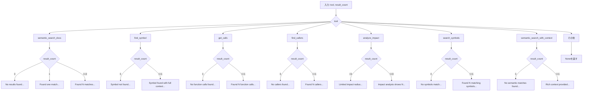
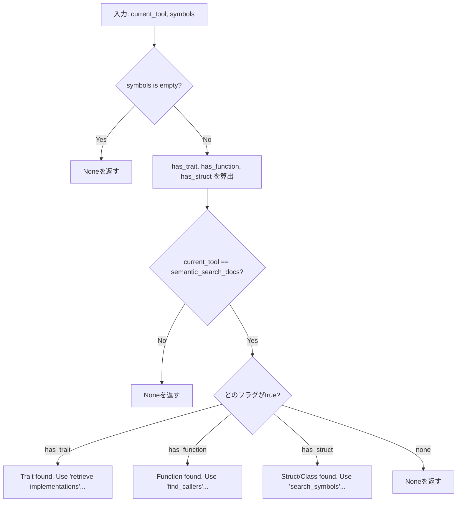

# io\guidance.rs Review

## TL;DR

- 目的: AIアシスタントがコードベース探索時に次の行動指針を得られるよう、ツール名と結果数、および見つかったシンボル種別に基づく**ガイダンス文字列**を生成する。
- 公開API: **generate_guidance** と **suggest_next_action** の2関数。前者はツール固有のガイダンス、後者は見つかったシンボルに応じた次の操作提案。
- 複雑箇所: generate_guidanceはツール種別ごとに分岐し、さらに結果数で細かい分岐を持つ（条件分岐多数）。suggest_next_actionはシンボル種別とツール名の組合せで分岐。
- 重大リスク: ツール識別が**文字列リテラル**であるためタイポに弱く、未知ツールはNoneを返すのみ。メッセージ中の「retrieve implementations」ツール名がファイル内に未定義で整合性不明。_query引数が未使用。
- Rust安全性: unsafeなし、所有権・借用は問題なし、純関数で**並行安全**。Optionで「ガイダンスなし」を表現。
- パフォーマンス: generate_guidanceはO(1)。suggest_next_actionはシンボル配列を最大3回走査するためO(n)だがnはシンボル数で通常軽量。
- セキュリティ: 外部入力のコマンド実行やIOなしで低リスク。ハードコード秘密・インジェクションの懸念なし。

## Overview & Purpose

このファイルは、AIアシスタントがコード探索（マルチホップ、複数ツール呼び出し）を行う際に、状況に応じたヒントや次アクションの提案を生成するための**ガイダンスロジック**を提供する。

- generate_guidance: ツール名と結果件数から、すぐに役立つヒント文を返す。
- suggest_next_action: 検索結果として得られたシンボル群の種類（Trait/Function/Structなど）と現在のツールに基づいて、次に使うべきツールを提案する。

このガイダンスは、探索効率の向上、無駄なツール呼び出し削減、探索経路の合理化を目的とする。

## Structure & Key Components

| 種別 | 名前 | 公開範囲 | 責務 | 複雑度 |
|------|------|----------|------|--------|
| Function | generate_guidance | pub | ツールと結果数に応じたガイダンスメッセージ生成 | Med |
| Function | suggest_next_action | pub | シンボル種別と現在ツールに基づく次アクション提案 | Low |
| External Type | Symbol (crate::symbol) | - | シンボル（関数/型/トレイトなど）を表す | 不明 |
| External Enum | SymbolKind (crate::types) | - | シンボルの種類区別（Trait/Function/Method/Struct/Class等） | 不明 |

### Dependencies & Interactions

- 内部依存
  - なし（両関数は互いに独立）

- 外部依存（このチャンクに型定義は現れないため詳細は不明）
  | 依存 | 用途 | 備考 |
  |------|------|------|
  | crate::symbol::Symbol | suggest_next_actionの引数型 | フィールドkindを参照 |
  | crate::types::SymbolKind | シンボル種別判定 | Trait/Function/Method/Struct/Classを使用 |

- 被依存推定（このモジュールを利用しそうな箇所）
  - ツールオーケストレーション層
  - UI層（アシスタントにヒントを表示）
  - 検索/解析サービスのレスポンス組み立て

## API Surface (Public/Exported) and Data Contracts

| API名 | シグネチャ | 目的 | Time | Space |
|-------|-----------|------|------|-------|
| generate_guidance | `pub fn generate_guidance(tool: &str, _query: Option<&str>, result_count: usize) -> Option<String>` | ツール名と結果件数に応じたヒント文生成 | O(1) | O(1) |
| suggest_next_action | `pub fn suggest_next_action(current_tool: &str, symbols: &[Symbol]) -> Option<String>` | シンボル種別と現在ツールから次アクション提案 | O(n) | O(1) |

### generate_guidance

1) 目的と責務
- 指定ツールと結果件数に基づき、ユーザが次に行うべき具体的な行動（別ツールの利用やクエリ改善）を簡潔な文字列で返す。未知ツールの場合はガイダンスなし（None）。

2) アルゴリズム（ステップ分解）
- 入力のtool文字列でmatch
- 各ツール分岐の中でresult_countに応じてメッセージ分岐
  - 例: semantic_search_docsは0件/1件/複数件で別メッセージ
- 適切な文字列をSomeで返す。該当しなければNone

3) 引数

| 名前 | 型 | 必須 | 説明 |
|------|----|------|------|
| tool | &str | はい | 現在使ったツール名 |
| _query | Option<&str> | いいえ | クエリ文字列（現状未使用） |
| result_count | usize | はい | ツールの結果件数 |

4) 戻り値

| 型 | 説明 |
|----|------|
| Option<String> | ガイダンス文字列（該当なしはNone） |

5) 使用例

```rust
use crate::io::guidance::generate_guidance;

let msg = generate_guidance("semantic_search_docs", None, 0);
assert_eq!(msg, Some("No results found. Try broader search terms or check if the codebase is indexed.".to_string()));

let msg2 = generate_guidance("find_symbol", None, 1);
assert!(msg2.unwrap().contains("Symbol found with full context."));
```

6) エッジケース
- 未知のtool文字列はNone（フォールバックなし）
- result_countはusizeのため負数なし
- 非常に大きいresult_countでもフォーマット可能（String生成のみ）

根拠: generate_guidance（行番号: 不明）matchの`_ => None`分岐、および各分岐内のresult_count条件。

### suggest_next_action

1) 目的と責務
- 取得済みシンボル配列の種別と現在のツールから、次に利用すべきツールを簡潔なメッセージで提案。

2) アルゴリズム（ステップ分解）
- symbolsが空ならNone
- symbolsにTrait/Function/Method/Struct/Classが含まれるかをanyで判定（3種のフラグ）
- current_toolが`semantic_search_docs`のときだけ、含有フラグに応じて異なる提案文をSomeで返す
- その他のcurrent_toolはNone

3) 引数

| 名前 | 型 | 必須 | 説明 |
|------|----|------|------|
| current_tool | &str | はい | 現在利用中のツール名 |
| symbols | &[Symbol] | はい | 見つかったシンボル一覧（種別判定に使用） |

4) 戻り値

| 型 | 説明 |
|----|------|
| Option<String> | 次アクション提案（該当なしはNone） |

5) 使用例

```rust
use crate::io::guidance::suggest_next_action;
use crate::types::SymbolKind;
use crate::symbol::Symbol;

// テスト用にSymbol生成の詳細はこのチャンクでは不明。以下は概念例。
fn create_symbol(kind: SymbolKind) -> Symbol {
    // 実装詳細は不明。プロジェクト側のファクトリ関数/Builder等に合わせて実装してください。
    unimplemented!("Symbolの構築方法はこのチャンクには現れない");
}

let symbols = vec![/* create_symbol(SymbolKind::Function) */];
let msg = suggest_next_action("semantic_search_docs", &symbols);
assert!(msg.is_some());
```

6) エッジケース
- symbols空配列はNone
- current_toolがsemantic_search_docs以外はNone
- Trait/Function/Structのいずれも含まれない配列はNone

根拠: suggest_next_action（行番号: 不明）先頭の`if symbols.is_empty(){ return None; }`、match分岐の`_ => None`。

## Walkthrough & Data Flow

### generate_guidance の主要分岐フロー



上記の図は`generate_guidance`関数（行番号: 不明）の主要分岐を示す。

### suggest_next_action の主要分岐フロー



上記の図は`suggest_next_action`関数（行番号: 不明）の主要分岐を示す。

## Complexity & Performance

- generate_guidance
  - 時間: O(1)（文字列比較と定数分岐のみ）
  - 空間: O(1)（固定長文字列/フォーマット生成）
  - ボトルネック: なし
- suggest_next_action
  - 時間: O(n)（`symbols.iter().any(...)`を3回呼ぶため最大3n。ただしanyは短絡評価のため最悪時のみ）
  - 空間: O(1)
  - スケール限界: nが非常に大きい場合、3回走査が重くなる可能性。ひとつの走査で3種フラグを同時に判定すればO(n)の定数係数を削減可能。

実運用負荷要因:
- I/O/ネットワーク/DBアクセスなし。CPUのみで軽量。

## Edge Cases, Bugs, and Security

### エッジケース詳細

| エッジケース | 入力例 | 期待動作 | 実装 | 状態 |
|-------------|--------|----------|------|------|
| 未知ツール | tool="unknown", result_count=5 | Noneを返す | `_ => None` | OK |
| 0件結果(semantic_search_docs) | tool="semantic_search_docs", result_count=0 | 「No results found...」 | if 0 | OK |
| 1件結果(semantic_search_docs) | tool="semantic_search_docs", result_count=1 | 「Found one match...」 | else if 1 | OK |
| 複数件結果(semantic_search_docs) | tool="semantic_search_docs", result_count=10 | 「Found 10 matches...」 | else | OK |
| 0件(get_calls) | tool="get_calls", result_count=0 | 「No function calls found...」 | if 0 | OK |
| 空シンボル配列 | current_tool="semantic_search_docs", symbols=[] | Noneを返す | `symbols.is_empty()` | OK |
| semantic_search_docs以外 | current_tool="find_symbol", symbols=[Function] | Noneを返す | `match _ => None` | OK |
| Traitのみ含む | current_tool="semantic_search_docs", symbols=[Trait] | 「Trait found. Use 'retrieve implementations'...」 | `has_trait` | OK |
| 複数種含む | current_tool="semantic_search_docs", symbols=[Trait, Function] | 優先順位なし。has_traitがtrueならTraitの文言 | `match順序でTrait/Function/Structのいずれかに一致` | OK |
| 非対応kind | SymbolKindに未知の値 | 何もヒットせずNone | any判定に含まれない | OK |

### バグ/不整合の可能性

- メッセージに現れるツール名「retrieve implementations」は、このファイル内の他分岐やgenerate_guidanceのツール名に存在せず、実際のツール可用性がこのチャンクには現れない。整合性不明のため、誤誘導の可能性あり。
- `_query`引数が未使用。パラメータ命名にアンダースコアが付き意図的未使用を示すが、将来の拡張意図がないなら削除/ドキュメント化すべき。
- `SymbolKind::Class`を参照しているが、Rust固有では“Class”概念なし。多言語対応のためかもしれないが、定義の有無はこのチャンクでは不明。

### セキュリティチェックリスト

- メモリ安全性
  - Buffer overflow: なし（RustのString/format使用のみ）
  - Use-after-free: なし（所有権/借用に問題なし）
  - Integer overflow: なし（result_countはusizeだが演算ほぼなし）
- インジェクション
  - SQL/Command/Path traversal: なし（外部コマンド実行やパス操作なし）
- 認証・認可
  - 権限チェック漏れ: 該当なし（メッセージ生成のみ）
  - セッション固定: 該当なし
- 秘密情報
  - ハードコード秘密: なし（文言のみ）
  - Log leakage: ログ出力なし
- 並行性
  - Race condition: なし（不変データのみ、純関数）
  - Deadlock: なし

## Design & Architecture Suggestions

- ツール名を**enum Tool**にして、`match Tool`で分岐。文字列タイポや未知値を型で防止。
- 次アクションを**enum NextAction**や構造化データで表現し、UI層でローカライズ/レンダリング。国際化（i18n）を考慮しメッセージテンプレートを外部化。
- `suggest_next_action`のシンボル走査は1回に集約し、3種フラグを同時に設定して定数係数を削減。
- `_query`の用途を定義（例: ガイダンス文にクエリのキーワードを差し込む）するか、不要なら引数削除。
- 「retrieve implementations」ツール名の整合性確認。存在しない場合は`find_implementations`等、実ツールに合わせて修正。
- `SymbolKind::Class`の必要性を確認。マルチ言語混在ならその設計方針をドキュメント化。

## Testing Strategy (Unit/Integration) with Examples

テスト方針:
- generate_guidanceは各ツール分岐×代表的なresult_count（0/1/複数）を網羅。
- 未知ツール入力でNoneを返すことを検証。
- suggest_next_actionは空配列、semantic_search_docs以外、Trait/Function/Structの各ケースを検証。
- シンボルを複数含む場合の優先結果（現在のコード順）を検証。

例（概念的コード。Symbolの構築方法はこのチャンクには現れない）:

```rust
#[cfg(test)]
mod tests {
    use super::*;
    use crate::types::SymbolKind;
    use crate::symbol::Symbol;

    // テスト用ヘルパ: 実際のSymbolの生成方法は不明。
    fn mk_symbol(_kind: SymbolKind) -> Symbol {
        unimplemented!("Symbolの具体的な構築はこのチャンクには現れない");
    }

    #[test]
    fn test_generate_guidance_semantic_search_docs_0() {
        let msg = generate_guidance("semantic_search_docs", None, 0);
        assert_eq!(msg, Some("No results found. Try broader search terms or check if the codebase is indexed.".to_string()));
    }

    #[test]
    fn test_generate_guidance_semantic_search_docs_1() {
        let msg = generate_guidance("semantic_search_docs", None, 1);
        assert!(msg.unwrap().contains("Found one match"));
    }

    #[test]
    fn test_generate_guidance_unknown_tool() {
        let msg = generate_guidance("unknown_tool", None, 3);
        assert!(msg.is_none());
    }

    #[test]
    fn test_suggest_next_action_empty_symbols() {
        let msg = suggest_next_action("semantic_search_docs", &[]);
        assert!(msg.is_none());
    }

    #[test]
    fn test_suggest_next_action_trait() {
        // 実装依存
        let symbols = vec![/* mk_symbol(SymbolKind::Trait) */];
        let msg = suggest_next_action("semantic_search_docs", &symbols);
        // ツール整合性の確認を促す
        assert!(msg.unwrap().contains("Trait found"));
    }

    #[test]
    fn test_suggest_next_action_non_semantic_tool() {
        let symbols = vec![/* mk_symbol(SymbolKind::Function) */];
        let msg = suggest_next_action("find_symbol", &symbols);
        assert!(msg.is_none());
    }
}
```

統合テスト（概念）:
- 実際の検索パイプラインでsemantic_search_docs → find_symbol → get_callsのシーケンスを模擬し、各段階でgenerate_guidance/suggest_next_actionが期待メッセージを返すか確認。

## Refactoring Plan & Best Practices

- ステップ1: ツール名をenum化（Tool）し、`FromStr`/`Display`を実装。既存文字列入力との互換保持。
- ステップ2: ガイダンス文をテンプレートテーブルに移し、`result_count`に応じたフォーマッタ関数で生成。
- ステップ3: suggest_next_actionの走査を単回に変更し、Trait/Function/Structフラグを一度に判定。
- ステップ4: 使用されない`_query`の扱いを決定（削除または活用）。ドキュメント更新。
- ベストプラクティス:
  - マジックストリングの排除
  - ログ/メトリクスを用いた観測性の強化
  - ユニットテストで各分岐を網羅
  - メッセージのi18n対応

## Observability (Logging, Metrics, Tracing)

- ログ
  - 未知ツール名が渡された際に`debug`ログを出すと運用時の誤入力検知に有用。
- メトリクス
  - ツール別のガイダンス生成回数、None率（フォールバック率）をメトリクス化。
  - result_count分布を計測すれば検索チューニングに役立つ。
- トレーシング
  - 上位層のリクエスト/ツール呼び出しに紐づくスパンIDを受け取り、メッセージ生成のコンテキストにアノテーション（このチャンクには現れない）。

## Risks & Unknowns

- Symbol/SymbolKindの詳細構造がこのチャンクには現れないため、`SymbolKind::Class`の存在有無やSymbolの生成方法は不明。
- メッセージに含まれる「retrieve implementations」ツールがプロジェクト内で定義されているか不明。存在しない場合はユーザを誤誘導するリスク。
- `_query`未使用の設計意図が不明。将来の拡張予定があるのか、単なる残骸なのかの確認が必要。
- ユーザ言語（ローカリゼーション）要件が不明。英語固定メッセージのまま運用するのか、i18n対応が必要かは要確認。