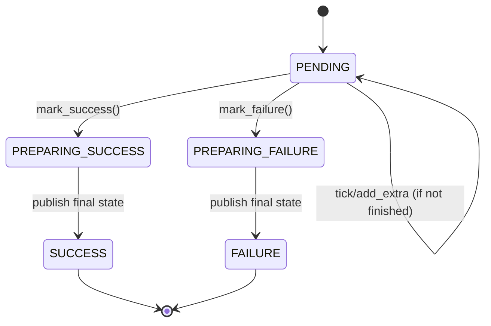
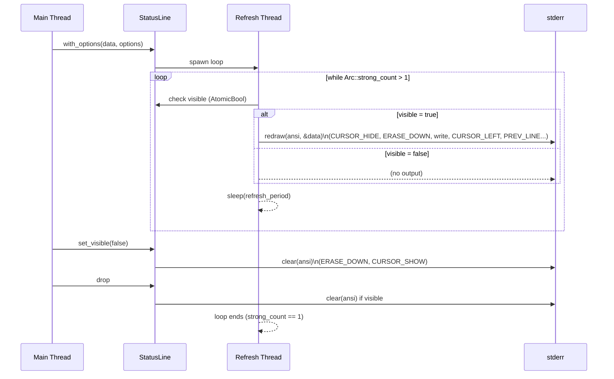

# io\status_line.rs Review

## TL;DR

- 目的: 標準エラーに対するステータスラインの周期的表示（カーソル非表示制御含む）と、スレッドセーフな進捗ウィジェット（ProgressBar/Spinner）を提供。
- 主要公開API: StatusLine::{new,with_options,refresh,set_visible,is_visible}, ProgressBar::{new,with_options,with_extras,inc,add_extra1,add_extra2,reset_total}, Spinner::{new,with_options,with_frame_period,tick,add_extra,mark_success,mark_failure,is_finished,current_exit_code}.
- 複雑箇所: Spinnerの状態機械（PENDING→PREPARING→SUCCESS/FAILURE）、ANSI制御列の描画（カーソル隠蔽/復帰、複数行のカーソル位置復元）。
- 並行性: StatusLineはバックグラウンドスレッドで定期描画、ProgressBar/Spinnerは内部Atomicでロックレス更新。D型のSend+Sync制約により安全。
- 重大リスク: stderrへのwrite!().unwrap()によるパニック、カーソル非表示状態の取り残し（パニック時や非整合終了時）、非TTYでの大量ログ出力。
- パフォーマンス: フォーマットは進捗バー幅に比例（O(width)）、描画は内容長に比例（O(n)）。スピナーはO(1)。
- セキュリティ/堅牢性: unsafeなし、Mutexは短時間保持のみ。I/O失敗時の復旧なし、ExitCodeの外部依存の詳細は不明。

## Overview & Purpose

このモジュールは、CLI上で進捗や状態を分かりやすく表示するためのステータスライン表示機能を提供します。ANSI制御列を用い、表示中はカーソルを隠し、消去時にカーソルを復帰させ、表示のちらつきを軽減します。進捗ウィジェットとして、累積カウンタに基づく水平ProgressBarと、作業の進捗状態（成功/失敗）を明示的に示すSpinnerを提供し、どちらも複数スレッドから安全に更新可能です。StatusLineはバックグラウンドスレッドで定期的にDisplay実装を描画します。

## Structure & Key Components

| 種別 | 名前 | 公開範囲 | 責務 | 複雑度 |
|------|------|----------|------|--------|
| Function | redraw | private | ANSI制御列付きで内容を再描画、カーソルを隠す | Med |
| Function | clear | private | 表示の消去とカーソル表示の復帰 | Low |
| Struct | State<D> | private | 内部状態（データと可視性フラグ）の保持 | Low |
| Struct | Options | pub | ステータスラインのリフレッシュ周期/初期可視性/ANSI有効化設定 | Low |
| Struct | StatusLine<D: Display> | pub | バックグラウンドでの周期描画制御、可視性管理 | Med |
| Enum | ProgressBarStyle | pub | 進捗バーのセル文字スタイルの定義 | Low |
| Struct | ProgressBarOptions | pub | ProgressBarのスタイル/幅/追加情報表示設定 | Low |
| Struct | ProgressBar | pub | 原子カウンタに基づく水平進捗バーのレンダリング | Med |
| Struct | SpinnerOptions | pub | スピナーのフレーム周期設定 | Low |
| Struct | Spinner | pub | 原子カウンタ/状態機械に基づくスピナー表示、ExitCode連携 | High |

### Dependencies & Interactions

- 内部依存:
  - StatusLine -> redraw/clear（周期描画・可視性切替）
  - ProgressBar/Spinner -> Display（フォーマット文字列を構築）
  - Spinner -> super::ExitCode（終了コードの取得・説明文の表示）

- 外部依存（推定・このチャンクに現れるもの）:

| 依存 | 用途 |
|------|------|
| is_terminal::is_terminal | TTY判定によるデフォルトリフレッシュ周期/ANSI有効化選定 |
| std::sync::{Arc,Mutex}, std::sync::atomic::{AtomicBool, AtomicU64, AtomicU8, Ordering} | 共有状態と原子更新 |
| std::thread, std::time::{Duration, Instant} | バックグラウンドスレッド、時間計測 |

- 被依存推定:
  - CLIアプリケーションの進捗表示層
  - 長時間処理のユーザ通知
  - バッチ処理/ダウンロード等の進捗可視化

## API Surface (Public/Exported) and Data Contracts

| API名 | シグネチャ | 目的 | Time | Space |
|-------|-----------|------|------|-------|
| Options::default | fn default() -> Options | TTYに応じた周期/ANSI設定のデフォルト生成 | O(1) | O(1) |
| StatusLine::new | fn new<D: Display+Send+Sync+'static>(data: D) -> StatusLine<D> | デフォルト設定で背景描画スレッドを起動 | O(1) | O(1) |
| StatusLine::with_options | fn with_options<D: Display+Send+Sync+'static>(data: D, options: Options) -> StatusLine<D> | カスタム設定で背景描画スレッドを起動 | O(1) | O(1) |
| StatusLine::refresh | fn refresh(&self) | 即時再描画 | O(n) | O(1) |
| StatusLine::set_visible | fn set_visible(&self, visible: bool) | 可視/不可視の切替（不可視時クリア） | O(n) | O(1) |
| StatusLine::is_visible | fn is_visible(&self) -> bool | 現在の可視性取得 | O(1) | O(1) |
| ProgressBarStyle::filled_cell | fn filled_cell(self) -> &'static str | 埋めセル文字取得 | O(1) | O(1) |
| ProgressBarStyle::empty_cell | fn empty_cell(self) -> &'static str | 空きセル文字取得 | O(1) | O(1) |
| ProgressBarOptions::new | fn new(style: ProgressBarStyle, width: usize) -> Self | 初期設定生成（幅は1以上に丸め） | O(1) | O(1) |
| ProgressBarOptions::{with_style,with_width,show_rate,show_elapsed} | fn ... -> Self | オプションの流暢な構築 | O(1) | O(1) |
| ProgressBar::new | fn new(total: u64, label: &'static str) -> Self | デフォルト設定で進捗バー生成 | O(1) | O(1) |
| ProgressBar::with_options | fn with_options(total: u64, label: &'static str, extra1_label: &'static str, extra2_label: &'static str, options: ProgressBarOptions) -> Self | 拡張カウンタ・カスタム設定付き生成 | O(1) | O(1) |
| ProgressBar::with_extras | fn with_extras(total: u64, label: &'static str, extra1_label: &'static str, extra2_label: &'static str, style: ProgressBarStyle) -> Self | スタイル指定のみ簡易生成 | O(1) | O(1) |
| ProgressBar::set_options | fn set_options(&mut self, options: ProgressBarOptions) | オプション更新（幅は1以上） | O(1) | O(1) |
| ProgressBar::set_width | fn set_width(&mut self, width: usize) | 幅だけ更新（幅は1以上） | O(1) | O(1) |
| ProgressBar::inc | fn inc(&self) | 現在値を1増加 | O(1) | O(1) |
| ProgressBar::add_extra1 | fn add_extra1(&self, n: u64) | 補助カウンタ1を増加 | O(1) | O(1) |
| ProgressBar::add_extra2 | fn add_extra2(&self, n: u64) | 補助カウンタ2を増加 | O(1) | O(1) |
| ProgressBar::reset_total | fn reset_total(&mut self, total: u64) | 合計の再設定とカウンタ/時間リセット | O(1) | O(1) |
| SpinnerOptions::new | fn new(frame_period: Duration) -> Self | フレーム周期設定（0→1msに補正） | O(1) | O(1) |
| SpinnerOptions::with_frame_period | fn with_frame_period(self, frame_period: Duration) -> Self | 周期の流暢な更新 | O(1) | O(1) |
| Spinner::new | fn new(label: &'static str, extra_label: &'static str) -> Self | デフォルト設定でスピナー生成 | O(1) | O(1) |
| Spinner::with_options | fn with_options(label: &'static str, extra_label: &'static str, options: SpinnerOptions) -> Self | カスタム設定でスピナー生成 | O(1) | O(1) |
| Spinner::with_frame_period | fn with_frame_period(label: &'static str, extra_label: &'static str, frame_period: Duration) -> Self | 周期のみ指定で生成 | O(1) | O(1) |
| Spinner::set_options | fn set_options(&self, options: SpinnerOptions) | 周期を動的更新 | O(1) | O(1) |
| Spinner::tick | fn tick(&self) | メインカウンタ増加（終了後は巻き戻し） | O(1) | O(1) |
| Spinner::add_extra | fn add_extra(&self, n: u64) | 補助カウンタ増加（終了後は巻き戻し） | O(1) | O(1) |
| Spinner::mark_success | fn mark_success(&self) | 成功への遷移（✓表示） | O(1) | O(1) |
| Spinner::mark_failure | fn mark_failure(&self, code: ExitCode, message: impl Into<String>) | 失敗への遷移（✗表示、コード/メッセージ設定） | O(1) | O(1) |
| Spinner::is_finished | fn is_finished(&self) -> bool | 終了状態判定 | O(1) | O(1) |
| Spinner::current_exit_code | fn current_exit_code(&self) -> ExitCode | 現在の終了コード取得 | O(1) | O(1) |

以下、主要APIの詳細（代表的なもののみ。すべて列挙しきれないものは「不明」または省略を明記）:

### StatusLine::with_options

1. 目的と責務
   - 任意のDisplay可能なデータDを指定オプションでステータスラインとして描画。バックグラウンドスレッドを起動し、周期的に描画する。

2. アルゴリズム（ステップ）
   - State<D>をArcで包む
   - visibleをinitially_visibleで初期化
   - 別スレッドをspawn
     - Arc::strong_count > 1の間ループ
     - visibleならredraw(enable_ansi_escapes, &data)
     - sleep(refresh_period)
   - StatusLineを返す

3. 引数

| 名前 | 型 | 説明 |
|------|----|------|
| data | D: Display+Send+Sync+'static | 表示対象 |
| options | Options | リフレッシュ周期/初期可視性/ANSI設定 |

4. 戻り値

| 型 | 説明 |
|----|------|
| StatusLine<D> | 管理インスタンス |

5. 使用例
```rust
use std::time::Duration;
let pb = ProgressBar::new(100, "Downloading");
let sl = StatusLine::with_options(pb, Options {
    refresh_period: Duration::from_millis(100),
    initially_visible: true,
    enable_ansi_escapes: true,
});
```

6. エッジケース
- initially_visible=falseの場合、起動直後は非表示（set_visibleで切替）
- 非TTY環境ではenable_ansi_escapes=falseが推奨（デフォルト対応）

### StatusLine::set_visible

1. 目的と責務
   - 表示のオン/オフ切替。オフ時にclearでカーソル復帰。

2. アルゴリズム
   - AtomicBoolをswap
   - 可視→不可視ならclear、不可視→可視なら即時redraw

3. 引数

| 名前 | 型 | 説明 |
|------|----|------|
| visible | bool | trueで表示、falseで非表示 |

4. 戻り値

| 型 | 説明 |
|----|------|
| () | なし |

5. 使用例
```rust
sl.set_visible(false); // 一旦隠す
sl.set_visible(true);  // 再表示
```

6. エッジケース
- 連続で同一値を設定しても不要な描画/消去は行わない

### ProgressBar::fmt (Display)

1. 目的と責務
   - 現在値、割合、バー、補助カウンタ、レート、経過時間の整形出力（2行）

2. アルゴリズム
   - ratio = current/total（clamp 0..1）
   - filled/emptyセル数算出、スタイル文字でバー生成
   - rate = current/elapsed（elapsed>0時）
   - 1行目: Progress: [bar] pct%
   - 2行目: current/total label (+extras, rate, elapsed)

3. 引数: 標準fmtの引数（不明）

4. 戻り値

| 型 | 説明 |
|----|------|
| fmt::Result | フォーマット結果 |

5. 使用例
```rust
let pb = ProgressBar::new(10, "Items");
pb.inc();
let s = format!("{}", pb);
```

6. エッジケース
- total=0時はratio=0、pct=0
- rateはelapsed=0時0.0
- extraラベルはカウント>0かつラベル非空時のみ表示

### Spinner::mark_failure

1. 目的と責務
   - スピナーを失敗状態へ遷移、ExitCodeとエラーメッセージを設定

2. アルゴリズム
   - outcome_stateをPENDINGからPREPARING_FAILUREへcompare_exchange
   - exit_code設定
   - error_messageをMutexでセット
   - outcome_stateをFAILUREへ

3. 引数

| 名前 | 型 | 説明 |
|------|----|------|
| code | ExitCode | 終了コード（外部型） |
| message | impl Into<String> | 任意メッセージ |

4. 戻り値

| 型 | 説明 |
|----|------|
| () | なし |

5. 使用例
```rust
let spinner = Spinner::new("Indexing", "files");
spinner.mark_failure(ExitCode::IoError, "disk full");
```

6. エッジケース
- 既に終了状態の場合は何もしない（compare_exchange失敗）
- メッセージはOption<String>に保存、表示時に":"付きで追加

その他API（ProgressBarOptions, SpinnerOptionsのbuilder系、ProgressBar::inc/add_extra*、Spinner::tick/add_extraなど）は同様にO(1)で原子更新するため詳細は省略。

## Walkthrough & Data Flow

- StatusLineのデータフロー
  - コンストラクタでArc<State<D>>を生成し、背景スレッドがArcの参照数を監視。可視性フラグがtrueの間はredrawでDisplay出力。
  - set_visibleで可視性を切替。不可視時はclearを呼び出しカーソル復帰。

- ProgressBarのデータフロー
  - current/extra1/extra2はAtomicU64でインクリメントされ、Display実装内で読み取り、幅に応じてバー文字列生成。

- Spinnerのデータフロー
  - count/extra1はAtomicU64、frame_period_msはAtomicU64で動的変更可能。
  - outcome_stateはAtomicU8で状態機械を表現。成功/失敗はcompare_exchangeで初回のみ確定。
  - error_messageはMutex<Option<String>>で短時間ロック、表示時にクローンして組み込み。

Mermaid図（Spinnerの状態機械）。上記の図は`Spinner::{tick, mark_success, mark_failure, fmt}`の主要遷移を示す（行番号はこのチャンクでは不明）。



Mermaid図（StatusLineの描画ループと可視性切替）。上記の図は`StatusLine::with_options`, `set_visible`, `Drop`の相互作用を示す（行番号はこのチャンクでは不明）。



## Complexity & Performance

- redraw/clear（内部）: O(n) 時間（nは出力文字数）。空間O(1)（固定バッファ書き込み）。
- StatusLine描画ループ: 各周期でO(n)の描画。refresh_periodに比例してI/O負荷。
- ProgressBar::fmt: バー幅wに対してO(w)（filled/emptyのrepeat）、その他は定数時間。空間はO(w)の一時文字列。
- Spinner::fmt: O(1)（固定フレーム、定数長文字列フォーマット）。

ボトルネック/スケール限界:
- 非TTY環境でenable_ansi_escapes=falseの場合、毎回新しい行に出力するためログが急増しやすい。
- バー幅が非常に大きい場合（w≫）、repeatによる文字列生成コストが増大。
- stderrロックは出力時に取得するが、短時間で解放。高頻度のrefresh_periodでI/Oが飽和する可能性。

実運用負荷要因:
- I/O（stderr）帯域に依存。リフレッシュ周期の短縮は負荷増。
- 多数のStatusLineインスタンスを同時運用するとスレッド数・I/O競合が増える。

## Edge Cases, Bugs, and Security

セキュリティチェックリスト評価:
- メモリ安全性: unsafe未使用。所有権/借用はArc/Atomic/Mutexにより安全。Buffer overflow/Use-after-free/Integer overflowの懸念は低い（AtomicU64加算は桁あふれの可能性はあるが安全にラップするわけではないため論理的オーバーフローには注意）。
- インジェクション: 端末出力のみ。SQL/Command/Path traversal該当なし。
- 認証・認可: 該当なし。
- 秘密情報: ログへの漏えいは利用側次第。ハードコード秘密はなし。
- 並行性: Race conditionに対するAtomic使用。error_messageのMutexは短期間ロックでデッドロックリスク低。Spinlockなし。

既知/潜在バグ・リスク:
- write!().unwrap()（redraw/clear）によりI/O失敗時にパニック。EPIPE等で崩壊する可能性。
- カーソル非表示の取り残し: redrawは毎回CURSOR_HIDEを出し、通常はclearでCURSOR_SHOWするが、パニックやプロセスabort時にはカーソルが復帰しない可能性。
- 非TTYでの大量出力: enable_ansi_escapes=false時、リフレッシュ毎に改行出力されログが膨張。
- Spinner::fmtのunreachable!("invalid spinner state"): outcome_stateが不正値になればパニック。ただし同ファイル内の遷移のみで不正値は発生しない設計。
- AtomicU64の加算は桁あふれの可能性（超長時間/膨大カウント）。機能上許容かは要件次第。

エッジケース詳細:

| エッジケース | 入力例 | 期待動作 | 実装 | 状態 |
|-------------|--------|----------|------|------|
| total=0のProgressBar | total=0 | 比率0%、rate計算は0 | fmtでratio=0、pct=0（ProgressBar::fmt） | 対応済み |
| widthが0で設定 | set_width(0) | 最低1セルに丸め | with_options/set_widthでmax(1) | 対応済み |
| Spinnerの周期0ms | SpinnerOptions::new(Duration::ZERO) | 1msに補正 | new/with_frame_periodでmax(1)ms | 対応済み |
| 終了後のtick/add_extra | mark_success()後tick() | カウント増加を抑止（巻き戻し） | is_finished検査と巻き戻し | 対応済み |
| 非TTYで大量出力 | enable_ansi_escapes=false | 毎回新行出力でログ肥大 | writeln!で都度改行 | 設計上 |
| stderr書き込み失敗 | パイプ切断 | パニックせず安全に継続 | unwrapで即パニック | 問題あり |
| Spinnerのメッセージ | messageに改行 | そのまま出力、見た目崩れ | 文字列連結のみ | 注意 |

重要な主張の根拠: 関数名は示したが行番号はこのチャンクには現れないため「不明」。

## Design & Architecture Suggestions

- I/Oエラー処理改善
  - redraw/clearのunwrapを取り除き、Resultを無視またはログ出力に留める（カーソル表示復帰をbest-effortで行う）。例: write!(...).ok();
- カーソル復帰のフェイルセーフ
  - パニックフック（std::panic::set_hook）でCURSOR_SHOWを出す仕組み（グローバルで）を検討。
- 背景スレッドの終了同期
  - 現状Arc::strong_countに依存して自動終了。Dropで可視ならclearを呼ぶが、スレッドjoinは無し。JoinHandleを保ち、Dropで早期終了シグナル＋joinする設計も検討（ただし現在のループ設計は軽量）。
- ログモード（非TTY）の扱い
  - 非TTY時の出力頻度を制限または単一行のみ（rate/elapsedを上書き）にするオプションを追加。
- 進捗バー性能
  - 非常に大きなwidthに対し、書き込みをバッファリング（小さな固定テンプレートを使うなど）して効率化。

## Testing Strategy (Unit/Integration) with Examples

- 単体テスト（Displayフォーマット）
  - ProgressBar::fmtがtotal=0、width=1、extraラベル有無、rate/elapsed表示の組み合わせで正しくフォーマットされるか検証。
```rust
#[test]
fn progress_bar_basic_format() {
    let mut pb = ProgressBar::with_extras(10, "items", "ok", "fail", ProgressBarStyle::FullBlock);
    pb.inc();
    pb.add_extra1(2);
    let s = format!("{}", pb);
    assert!(s.contains("Progress: ["));
    assert!(s.contains("items"));
    assert!(s.contains("2 ok"));
}
```

- スピナー状態遷移
  - mark_success/mark_failureが一度しか反映されない（compare_exchange成功時のみ）こと、tick/add_extraが終了後に巻き戻されることを検証。
```rust
#[test]
fn spinner_transitions_and_counters() {
    let sp = Spinner::new("Indexing", "files");
    sp.tick();
    assert!(!sp.is_finished());
    sp.mark_success();
    assert!(sp.is_finished());
    let before = sp.current_exit_code();
    sp.tick(); // should not increase due to rollback
    assert_eq!(before, ExitCode::Success);
    let s = format!("{}", sp);
    assert!(s.contains("✓"));
}
```

- OptionsのTTY依存デフォルト
  - is_terminalの戻りに応じてrefresh_period/enable_ansi_escapesの値が想定通り（環境依存のため、単体では注入可能なラッパーでテストするのが理想。ここでは不明）。

- StatusLineの可視性切替
  - set_visible(false)でclearが呼ばれることの検証（直接stderrに依存するため、redraw/clearを抽象化するなら容易。現状は出力副作用のため集約テスト向け）。

- 競合・並行性
  - 複数スレッドでProgressBar::inc/Spinner::tickを高頻度呼び出ししてもpanicせず整合性が保たれることの確認。
```rust
#[test]
fn progress_bar_concurrent_inc() {
    use std::thread;
    let pb = ProgressBar::new(1000, "items");
    let mut handles = vec![];
    for _ in 0..4 {
        let pb_ref = &pb;
        handles.push(thread::spawn(move || {
            for _ in 0..250 {
                pb_ref.inc();
            }
        }));
    }
    for h in handles { h.join().unwrap(); }
    let s = format!("{}", pb);
    assert!(s.contains("1000/items")); // 簡易確認（厳密にはパース）
}
```

## Refactoring Plan & Best Practices

- I/Oエラー耐性
  - redraw/clearのunwrap削除、Resultを適切に無視またはログ。カーソル復帰を必ず試みる。
- 可視性APIの明確化
  - StatusLine::refreshは可視性がfalseでも描画する仕様だが、ドキュメント上で明示。またオプションで「非可視時refreshは何もしない」モードを追加検討。
- Spinnerのエラー保持
  - error_messageのMutexを短時間保持しているが、文字列生成を最小限にするためにArc<str>などに最適化検討。
- ExitCodeの拡張
  - current_exit_codeのマッピング（0..8以外はGeneralError）をテーブル駆動/From<u8>実装に整理（このチャンク外にあるため「不明」）。
- APIドキュメントの補強
  - 非TTY時の振る舞い、カーソル制御のフェイルセーフ、長時間稼働時のAtomicカウンタあふれに関する注意点を明記。

## Observability (Logging, Metrics, Tracing)

- 現状、内部ログはなし。stderrへの描画のみ。
- 追加提案:
  - 描画エラー（I/O）を計数するメトリクス（AtomicU64で失敗数）を保持し、必要時に取得可能にする。
  - スピナーの終了時（成功/失敗）に簡易イベントフックを用意して外部トレースへ通知（このチャンクには現れない）。

## Risks & Unknowns

- ExitCode型の詳細（variants, description()の実装）はこのチャンクには現れないため不明。
- is_terminalのTTY判定のプラットフォーム差異（Windows旧環境、CI環境）によりANSI制御列が効かない可能性。
- パニック時のカーソル復帰保証はなし。フェイルセーフが未実装。
- 複数StatusLineの同時運用時のカーソル制御競合は考慮されていない（先にclearしたインスタンスがカーソルを表示する可能性）。設計上、単一インスタンス運用が前提に近い。

以上により、このファイルは堅牢な進捗表示を提供しますが、I/Oエラー処理とフェイルセーフ、非TTY環境でのログ挙動の改善が運用上の信頼性をさらに高めます。