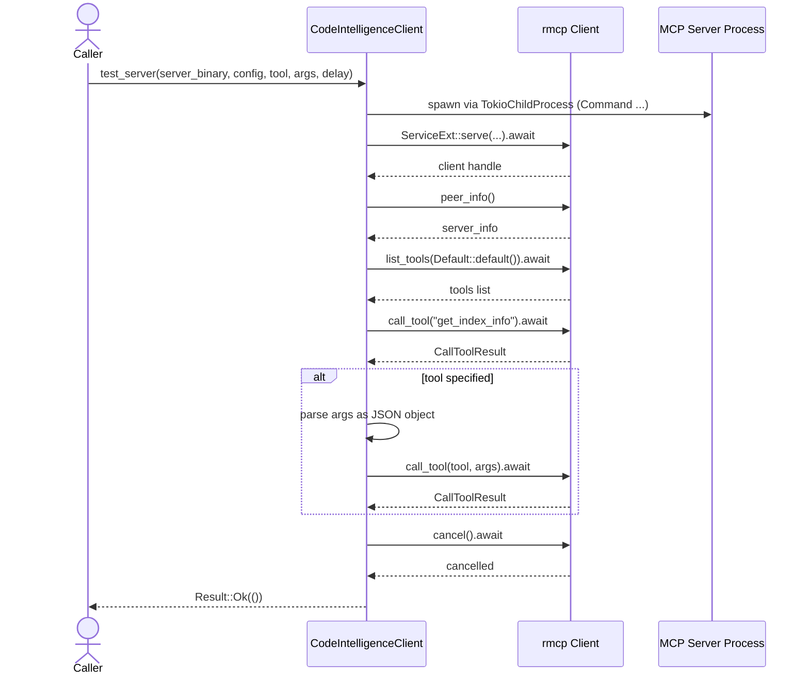

# mcp/client.rs Review

## TL;DR

- 目的: 外部の MCP（Model Context Protocol）コードインテリジェンスサーバーを子プロセスとして起動し、接続・基本的な疎通確認・ツール実行・シャットダウンまでを一括で行う薄いテストクライアント。
- 主な公開API: CodeIntelligenceClient::test_server(server_binary, config_path, tool, args, delay) → Result<()>（非同期）。
- コアロジック: TokioChildProcessでサーバー起動→rmcpクライアントで接続→tools列挙→get_index_info実行→（任意で指定ツール）→cancelで終了。
- 複雑箇所: 外部プロセス起動と非同期I/O、任意引数のJSONパース、MCPツール応答の異種（非テキスト）ハンドリング。
- エラー/安全性: unsafeなし。外部プロセス・ネットワークI/O・JSONパースのエラーをanyhowで集約して伝播。シェルインジェクションは避けられている（Commandに引数を分離渡し）。
- 並行性: 非同期await境界は複数。単一タスク内で完結しデータ競合要素なし。キャンセル(client.cancel)の終了保証はrmcp依存で挙動は不明。
- 重大リスク: get_index_infoツールが未実装の場合に即失敗。標準出力への生ログ出力による秘匿情報漏洩リスク。プロセス終了の確実性・タイムアウト未設定。

## Overview & Purpose

本ファイルは、MCP対応のコードインテリジェンスサーバーに対して、最小限の疎通確認（ツール一覧取得、get_index_info実行、任意ツールの呼び出し）を行うためのクライアント実装を提供します。外部サーバーバイナリを子プロセスとして起動し、rmcpクレートを介して接続およびRPC的なツール呼び出しを実施します。目的はあくまで「テスト」であり、インデックスロードなどの高機能は行いません（コメントに“thin client - no index loading”と明記）。

## Structure & Key Components

| 種別 | 名前 | 公開範囲 | 責務 | 複雑度 |
|------|------|----------|------|--------|
| Struct | CodeIntelligenceClient | pub | MCPサーバーテスト用クライアント（状態なしのユニット構造体） | Low |
| Function | CodeIntelligenceClient::test_server | pub | サーバー起動・接続・ツール列挙・get_index_info実行・任意ツール実行・シャットダウン | Med |
| Function | CodeIntelligenceClient::print_tool_output | private | ツール実行結果の標準出力整形出力 | Low |

### Dependencies & Interactions

- 内部依存
  - test_server → print_tool_output（ツール結果の表示に利用）
- 外部依存（代表）
  - rmcp
    - model::{CallToolRequestParam, JsonObject, CallToolResult, RawContent}
    - service::ServiceExt（.serve拡張）
    - transport::{ConfigureCommandExt, TokioChildProcess}
  - tokio
    - process::Command（子プロセス起動）
    - time::{sleep, Duration}
  - serde_json::{Value, from_str}（任意引数JSONのパース）
  - anyhow::{Result, anyhow}（エラー集約）
  - std::path::PathBuf（パス管理）

| 依存名 | 用途 | 備考 |
|-------|------|------|
| rmcp::service::ServiceExt | 子プロセスに対するMCPセッション確立 | .serve(...).await? |
| rmcp::transport::TokioChildProcess | Tokioでの子プロセスハンドリング | Commandと連携 |
| tokio::process::Command | サーバーバイナリ起動 | シェルを介さず安全 |
| serde_json | --argsのJSONパース | オブジェクト限定で検証 |
| anyhow | エラー伝播 | 失敗時の文脈付与 |

- 被依存推定
  - CLIツールやテストハーネスからの呼び出しが想定されます（このチャンクには呼び出し元は現れない）。

## API Surface (Public/Exported) and Data Contracts

| API名 | シグネチャ | 目的 | Time | Space |
|-------|-----------|------|------|-------|
| CodeIntelligenceClient::test_server | async fn test_server(server_binary: PathBuf, config_path: Option<PathBuf>, tool: Option<String>, args: Option<String>, delay_before_tool_secs: Option<u64>) -> anyhow::Result<()> | MCPサーバーを子プロセスで起動し、基本動作をテスト | O(T + N + C) | O(S + A) |

- 記号説明
  - T: ツール数（list_toolsの返却件数）に比例する出力処理
  - N: 返却コンテンツ件数（print_tool_outputのループ）
  - C: 外部I/O待ち（プロセス起動・ネットワーク/IPC）
  - S: 応答内容の一時保持
  - A: --args文字列とJSON中間表現のサイズ

詳細:

1) 目的と責務
- 外部MCPサーバーバイナリの起動、接続、ツール一覧取得、get_index_info検証、任意ツール呼び出し、セッションキャンセルまでを自動化。
- CLI的操作のロジックをライブラリレベルで提供。

2) アルゴリズム（主要ステップ）
- Commandでserver_binaryを起動。config_pathがあれば"--config <path>"を付与し、"serve"を引数に追加。
- rmcpのServiceExt::serveで接続確立しクライアントを取得。
- peer_infoを取得して接続確認。
- list_toolsで登録ツール一覧を取得し表示。
- call_tool(get_index_info)でインデックスの可用性を検証し、結果をprint_tool_outputで表示。
- toolがSomeなら、argsをJSONとしてパース（オブジェクトのみ許可）。call_tool(tool)実行・出力表示。
- client.cancel()でセッションを終了。

3) 引数

| 引数名 | 型 | 必須 | 役割 |
|-------|----|------|------|
| server_binary | PathBuf | Yes | 起動するMCPサーバーバイナリのパス |
| config_path | Option<PathBuf> | No | サーバーへ渡す設定ファイルパス（--config） |
| tool | Option<String> | No | 追加で呼び出すツール名 |
| args | Option<String> | No | ツール引数（JSON文字列）。オブジェクトのみ許容 |
| delay_before_tool_secs | Option<u64> | No | 任意ツール呼び出し前の遅延秒数 |

4) 戻り値

| 戻り値 | 説明 |
|--------|------|
| Ok(()) | 一連のテスト手順が成功 |
| Err(e) | サーバー起動/接続/ツール列挙/JSONパース/ツール実行/キャンセルのいずれかで失敗（anyhow） |

5) 使用例

```rust
use std::path::PathBuf;
use mcp::client::CodeIntelligenceClient; // 実際のパスに合わせて修正

#[tokio::main]
async fn main() -> anyhow::Result<()> {
    CodeIntelligenceClient::test_server(
        PathBuf::from("./my-mcp-server"),
        Some(PathBuf::from("./server.toml")),
        Some("search".to_string()),
        Some(r#"{"query":"hello","limit":5}"#.to_string()),
        Some(2),
    ).await?;
    Ok(())
}
```

6) エッジケース
- --argsが不正JSON、またはオブジェクト以外: Errとして戻す。
- 指定ツールが存在しない/失敗: call_toolがErrを返すためそのまま伝播。
- 非テキストコンテンツ: "(Non-text content)"と表示のみ。
- delayが0またはNone: 待機なし。

データ契約:
- --argsはJSONオブジェクトのみを許可（Value::Object）。配列・数値・文字列単体は拒否。
- get_index_infoツール名は固定文字列を使用。サーバー側に対応が必要。

注: 行番号はこのチャンクに含まれないため「関数名:行番号」は不明（test_server:行番号不明）。

## Walkthrough & Data Flow

1. 子プロセス起動
   - tokio::process::Commandでserver_binaryを起動
   - config_pathがあれば"--config <path>"を付与
   - "serve"サブコマンドを追加

2. セッション確立
   - rmcp::transport::TokioChildProcessでラップし、ServiceExt::serve(...).awaitでrmcpクライアントを確立
   - client.peer_info()で接続確認

3. ツール列挙と検証
   - client.list_tools(...).awaitでツール一覧
   - client.call_tool(get_index_info).awaitで基本的な機能可用性確認
   - print_tool_outputで標準出力整形

4. 任意ツール（オプション）
   - delay_before_tool_secsがあればsleep
   - argsがあればserde_jsonでパース（オブジェクト検証）
   - client.call_tool(tool).await → print_tool_output

5. 終了処理
   - client.cancel().awaitでセッションキャンセル（サーバープロセス終了を期待）

Mermaidシーケンス図（test_serverの主要フロー。該当関数: test_server、行番号:不明）



## Complexity & Performance

- 時間計算量
  - プロセス起動・RMCP接続はI/O待ちで支配的（O(C)）
  - ツール一覧の表示はO(T)
  - ツール結果の出力はコンテンツ数Nに対してO(N)
  - JSONパースは--argsサイズに線形（O(|args|)）
- 空間計算量
  - 受信レスポンスと一時JSON保持に比例（概ねO(S + A)）
- ボトルネック
  - 外部プロセス起動とIPC/ネットワークI/O
  - 大量のツール/大量のレスポンスコンテンツ表示時の標準出力I/O
- スケール限界
  - 本実装は単発テスト用途。大量並行接続や高頻度呼び出しには非最適
- 実運用負荷要因
  - サーバーの初期化時間（インデックス構築が裏で走る場合）
  - ツール実行時間（リポジトリスキャンや検索など）

Rust特有の観点（パフォーマンス・安全性）
- unsafeブロックなし（不使用）
- 所有権/借用
  - server_binaryは参照でCommand::new(&server_binary)。config_pathはクロージャ内で&config_pathとして借用し、短期間で消費。ムーブ/ライフタイムの問題は見当たらない（test_server:行番号不明）
- 非同期await境界
  - serve, list_tools, call_tool, sleep, cancelでawait。単一タスクでありデータ競合なし

## Edge Cases, Bugs, and Security

セキュリティチェックリスト
- メモリ安全性: unsafe未使用。Buffer overflow/Use-after-free/Integer overflowの懸念なし
- インジェクション:
  - コマンド: tokio::process::Commandで引数を分離渡ししており、シェルインジェクションの懸念は低い
  - SQL/パス: 本ファイルには該当なし
- 認証・認可: 本ファイルには該当なし（サーバー側の実装次第）
- 秘密情報: peer_infoやツール出力をprintlnで生出力するため、機密情報漏洩の可能性あり。ログレベル制御・マスキングが望ましい
- 並行性: 単一非同期タスクでデータレースの懸念はなし。Deadlockも該当なし

潜在バグ/懸念
- get_index_info前提: サーバーがget_index_infoを未実装の場合、早期に失敗する
- プロセス終了保証: client.cancel().await後のプロセス完全終了保証はrmcp側の実装依存（不明）
- タイムアウト未設定: 外部I/Oがハングした場合、永続待機の可能性
- 出力フォーマット限定: 非テキストコンテンツは"(Non-text content)"としか表示せず、情報が失われる

エッジケース詳細

| エッジケース | 入力例 | 期待動作 | 実装 | 状態 |
|-------------|--------|----------|------|------|
| サーバーバイナリ不存在 | server_binary=不正パス | プロセス起動失敗のErr | TokioChildProcess::new(...)? → 伝播 | 確認可 |
| config_path不正 | config_path=Some(不正パス) | サーバー側が失敗しErr | serve.await? でErrになる可能性 | 確認可 |
| get_index_info未実装 | サーバーに該当ツールなし | call_toolでErr | .await? でErr伝播 | 確認可 |
| 指定ツール不存在 | tool=Some("unknown") | call_toolでErr | .await? でErr伝播 | 確認可 |
| --argsが不正JSON | args=Some("{") | Err(パース失敗) | serde_json::from_str → anyhow化 | 確認可 |
| --argsがオブジェクト以外 | args=Some("[1,2]") | Err(型不一致) | Value::Object以外でErrにする | 確認可 |
| 遅延0または未指定 | delay=None/Some(0) | 待機なし | sleepしない分岐あり | 確認可 |
| 非テキスト応答 | result.contentに非Text | "(Non-text content)"表示 | matchで分岐 | 確認可 |
| cancel失敗 | server側が応答不可 | Err | client.cancel().await? | 確認可 |
| 大量ツール/大量出力 | toolsやcontentが巨大 | 時間/ログ量増大 | 逐次println | パフォーマンス懸念 |

Rust特有の観点（詳細）
- 所有権: 引数は値所有（PathBuf, String）。クロージャでは&config_pathを借用（短命）。ムーブは問題なし（test_server:行番号不明）
- 借用: 可変借用はcmd引数内のみでスコープ閉鎖。借用期間はconfigure呼出し中のみ
- ライフタイム: 明示的ライフタイム不要
- unsafe境界: なし
- Send/Sync: 型パラメータなし。TokioのawaitポイントはSend境界不問（本関数自体はSend制約を課していない）
- await境界: serve, list_tools, call_tool, sleep, cancelで待機。キャンセル伝播はrmcp依存
- キャンセル: 明示的にclient.cancel().awaitを呼ぶが、タイムアウト未設定
- エラー設計: anyhow::Resultで統一。unwrap/expect不使用。エラー変換は?とmap_err(anyhow!)で実装

## Design & Architecture Suggestions

- タイムアウト導入
  - serve/list_tools/call_tool/cancelにtokio::time::timeoutを適用し、ハングを防止
- ロギング/レベル
  - println!ではなくtracingでレベル・フィールド付きログを出力
  - サーバー情報やツール出力に含まれる機微情報のマスキング/省略
- API分割
  - サーバー起動/接続部分とツール呼び出しロジックを分離
  - Builderパターンでオプション（config, delay）を設定可能に
- 引数の型安全化
  - args: Option<String>ではなく、呼び出し側がJsonObjectや型付き構造体を渡せるオーバーロード/ジェネリクスを提供
- 非テキストコンテンツ対応
  - RawContent::Text以外の型に対して、型名や概要をダンプするなど、デバッグ性向上
- エラーメッセージ改善
  - 失敗箇所の文脈（どのツール・どのステップか）をanyhow::Contextで追加
- プロセス終了保証
  - cancel後に子プロセスの終了待機（wait）や明示的killのフォールバック実装を検討（rmcpの契約次第）
- 設定の拡張
  - 環境変数の注入、作業ディレクトリ指定、ログディレクトリの分離など

## Testing Strategy (Unit/Integration) with Examples

- Unit（純粋関数相当）
  - JSON引数パース部分の切り出し（関数化）とテスト
  - print_tool_outputの出力検証（非テキスト分岐を含む）。標準出力をキャプチャ

```rust
#[test]
fn test_parse_args_object_only() {
    let raw = r#"{"key":"value"}"#;
    let v: serde_json::Value = serde_json::from_str(raw).unwrap();
    assert!(matches!(v, serde_json::Value::Object(_)));
}

#[test]
fn test_parse_args_non_object_error() {
    let raw = r#"[1,2]"#;
    let v: serde_json::Value = serde_json::from_str(raw).unwrap();
    assert!(!matches!(v, serde_json::Value::Object(_)));
}
```

- Integration（Tokio + 実サーバー or スタブ）
  - 正常系: サーバーを実起動し、get_index_infoが成功すること
  - 失敗系: ツール不存在、JSON不正、cancel失敗（スタブサーバーで再現）
  - タイムアウト系: サーバー応答遅延に対してtimeoutが正しく発火すること（設計拡張後）

```rust
#[tokio::test]
async fn test_server_happy_path() -> anyhow::Result<()> {
    // 事前にテスト用MCPサーバーバイナリを用意すること
    let bin = std::path::PathBuf::from("./tests/bin/mcp-server-mock");
    CodeIntelligenceClient::test_server(
        bin, None, Some("get_index_info".into()), None, Some(0)
    ).await?;
    Ok(())
}
```

- モック化
  - rmcpのクライアント境界にトレイトを導入し、スタブ実装でserve/list_tools/call_tool/cancelを差し替え可能に（本ファイルには未実装）

## Refactoring Plan & Best Practices

- 構造化
  - parse_tool_args関数を抽出してテスト容易性を向上
  - run_tool(client, name, args)関数を抽出
- エラーハンドリング強化
  - anyhow::Contextを用いて失敗点を明確化
- ロギング
  - tracing::instrumentで関数にスパンを付与、フィールド（server_binary, tool, delay）を記録
- API設計
  - CodeIntelligenceClientをステートフルにし、接続の再利用/複数ツール呼び出しが可能なインターフェースに拡張
  - Result型をライブラリ固有Error列挙に置換し、呼び出し側の分岐を明確化
- タイムアウト/リトライ
  - 重要I/O箇所にtimeout、必要に応じて指数バックオフでリトライ
- 出力の非同期化
  - 大量出力時にバックプレッシャーを考慮し、必要ならバッファリングやログレベルで抑制

## Observability (Logging, Metrics, Tracing)

- ログ
  - tracingでinfo/debug/errorレベルを使い分け、機微情報はredact
- メトリクス
  - ツール呼出し成功/失敗カウント、応答時間ヒストグラム、プロセス起動時間
- トレーシング
  - serve, list_tools, call_tool, cancelにspanを付与
  - OpenTelemetryで分散トレース統合（サーバー側と合わせて可観測性を向上）

計測例（擬似コード）

```rust
use tracing::{instrument, info, warn};
use tokio::time::Instant;

#[instrument(fields(server = %server_binary.display(), tool = ?tool))]
async fn test_server(...) -> anyhow::Result<()> {
    let start = Instant::now();
    // ...
    info!("connected in {:?}", start.elapsed());
    // ...
}
```

## Risks & Unknowns

- rmcpライブラリの契約
  - cancel()の振る舞い（プロセスの確実な終了保証、リソース解放タイミング）は不明（このチャンクには現れない）
  - peer_info, list_tools, call_toolの戻り型詳細（内部フィールド）は不明
- サーバー実装依存
  - get_index_infoの存在と意味（仕様）は不明。未実装時はテストが恒常的に失敗
- 行番号
  - 本チャンクには行番号情報がないため、厳密な行参照は不明
- 権限/環境依存
  - 実行環境の権限不足やPATH設定、configファイル内容の妥当性は外部要因で不明
- 出力仕様
  - 非テキストのRawContent詳細仕様は不明。どの型が想定されるかはこのチャンクには現れない