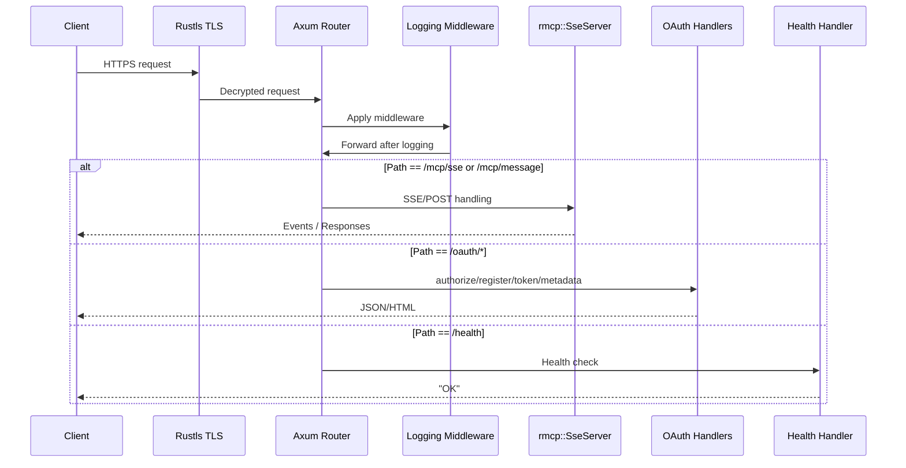

# mcp\https_server.rs Review

## TL;DR

- ✅ 目的: **TLS**付きの**HTTPS**サーバで**MCP**を**SSE**（Server-Sent Events）経由で提供し、インデックスのホットリロードと簡易OAuth風エンドポイントを備える
- 📤 公開API: **serve_https(config, watch, bind)**（feature="https-server"時のみ）。未コンパイル時は同名関数がエラー出力後にプロセスを終了
- 🔁 複雑箇所: インデクサ共有（Arc<RwLock<...>）の**並行更新**、複数**ウォッチャー**の起動と**CancellationToken**での停止、**SSE**サービス登録と**Axum**ルーター統合、**自己署名証明書**の生成と保管
- ⚠️ 重大リスク: OAuthエンドポイントが実質**無認証**で、ヘッダーの**生ログ出力**、`oauth_authorize`の**HTML組み込み**に伴う潜在的XSS、**自己署名証明書**による信頼性警告、`std::process::exit(1)`による**強制終了**
- 🔒 Rust安全性: **unsafeなし**、共有状態は**Arc<RwLock>**で保護、非同期停止は**CancellationToken**で制御。`expect`による**panic**可能箇所あり（`shutdown_signal`）
- 📈 パフォーマンス: 起動はO(1)、SSE/ウォッチャーは常時稼働。**単一RwLock**による書き込み時の待ちがボトルネックになり得る
- 🔬 テスト: ハンドラ（`oauth_*`, `health_check`）の**単体テスト**は容易、`serve_https`は**統合テスト**でポート＆TLS扱いが必要。自己署名のため**クライアント設定**が必須

## Overview & Purpose

このファイルは、MCP（Model Context Protocol）のサーバを**HTTPS**（TLS）上で提供するための実装です。**SSE**トランスポート（Claude Code互換）により、クライアントと継続的なイベントストリーム通信を行い、ローカルのコードインデックスをホットリロード可能にします。以下を含みます（このチャンクに現れる範囲）:

- 公開API `serve_https`（feature `"https-server"`時）: サーバ起動・ルーター構築・TLS設定・ウォッチャー起動・優雅な終了
- OAuth風の補助エンドポイント（ダミー）: `oauth_register`, `oauth_token`, `oauth_authorize`, メタデータ
- ヘルスチェック: `health_check`
- 自己署名証明書生成: `get_or_create_certificate`
- ローカルIP取得ヘルパ: `local_ip_address::local_ip`
- リクエストログミドルウェア: `log_requests`

なお、**CodeIntelligenceServer**や**SimpleIndexer**等の内部詳細はこのチャンクには現れず（不明）、本レビューではインタフェースの使われ方に基づく考察を行います。

## Structure & Key Components

| 種別 | 名前 | 公開範囲 | 責務 | 複雑度 |
|------|------|----------|------|--------|
| Function | serve_https (feature="https-server") | pub | HTTPS+TLSサーバ起動、SSE統合、ウォッチャー起動、優雅なシャットダウン | High |
| Function | serve_https (feature未有効) | pub | ビルド設定不足時の通知とプロセス終了 | Low |
| Function | health_check | private | ヘルスチェック応答 | Low |
| Function | oauth_register | private | ダミーOAuthクライアント登録応答 | Low |
| Function | oauth_token | private | ダミーOAuthトークン発行（authorization_codeのみ） | Med |
| Function | oauth_authorize | private | ダミー認可コード付与とリダイレクトHTML生成 | Med |
| Function | shutdown_signal | private | Ctrl+Cの受信待機 | Low |
| Function | get_or_create_certificate | private | 自己署名証明書生成/保存/読み込み | Med |
| Module | local_ip_address | private | ローカルIP推定（UDPソケット経由） | Low |
| Function | log_requests | private | リクエストログ出力ミドルウェア | Low |

### Dependencies & Interactions

- 内部依存（関数/構造体間）
  - `serve_https` → `get_or_create_certificate`, `shutdown_signal`, `health_check`, `oauth_*`, `log_requests`
  - `get_or_create_certificate` → `local_ip_address::local_ip`（0.0.0.0バインド時）
- 外部依存（このチャンクに現れるもの）

| クレート/モジュール | 用途 |
|--------------------|------|
| axum | ルーター、ハンドラ、ミドルウェア |
| axum_server::tls_rustls | RustlsのTLSサーバ起動 |
| rmcp::transport::SseServer | SSEサーバ・ルーティング統合 |
| tokio, tokio_util::sync::CancellationToken | 非同期実行、キャンセル制御、RwLock |
| anyhow | エラーラップ/コンテキスト |
| rcgen | 自己署名証明書生成 |
| dirs | 証明書保存ディレクトリ決定 |
| serde_json, serde_urlencoded | JSON/フォームURLエンコード処理 |
| std (net, path, sync, time) | ベースライブラリ |

- 被依存推定（このモジュールを使用する側）
  - CLI/サーバエントリポイント（不明）
  - MCPクライアント（例: Claude Code）がこのサーバの**/mcp/sse**と**/mcp/message**に接続（データ契約の詳細はこのチャンクには現れない）

## API Surface (Public/Exported) and Data Contracts

| API名 | シグネチャ | 目的 | Time | Space |
|-------|-----------|------|------|-------|
| serve_https | `pub async fn serve_https(config: crate::Settings, watch: bool, bind: String) -> anyhow::Result<()>` | HTTPS+TLSでSSE MCPサーバを起動し、必要なウォッチャーとOAuth風エンドポイントを提供する | 起動O(1), 実行は長時間 | O(1) |

詳細（公開API）

1) serve_https

1. 目的と責務
   - 設定に基づき**SSE**付き**HTTPS/TLS**サーバを起動し、インデックスの**ホットリロード**のための各種ウォッチャーを起動、**優雅なシャットダウン**を行う

2. アルゴリズム（大まかなステップ）
   - デバッグログ開始
   - 通知ブロードキャスタと共有**インデクサ**（`Arc<RwLock<...>>`）を用意
   - 永続化されたインデックスがあれば読み込み
   - バインドアドレス解析（`SocketAddr`）
   - **CancellationToken**作成
   - ファイルシステム/設定ファイルウォッチャー起動（条件付き）、インデックスウォッチャー起動（`watch`時）
   - **SSEサーバ設定**と**サービス登録**（共有`CodeIntelligenceServer`インスタンス）
   - OAuthメタデータハンドラ、リクエストログミドルウェア作成
   - **Axum Router**へOAuth・ヘルス・SSEルートを統合
   - **自己署名証明書**を取得/生成し**Rustls**設定
   - **axum_server**でTLSサーバ開始。`tokio::select!`でサーバ完了 or `Ctrl+C`を待ち、キャンセル発行して停止

3. 引数

| 名前 | 型 | 説明 |
|------|----|------|
| config | `crate::Settings` | サーバとインデクサの設定（詳細はこのチャンクには現れない） |
| watch | `bool` | インデックスウォッチャー（ポーリング）の起動可否 |
| bind | `String` | `host:port`形式のバインド先（例: `"127.0.0.1:8443"`） |

4. 戻り値

| 型 | 意味 |
|----|-----|
| `anyhow::Result<()>` | 起動成功/エラー（起動中はブロックし、終了時にOk） |

5. 使用例

```rust
#[tokio::main]
async fn main() -> anyhow::Result<()> {
    let settings = load_settings()?; // 設定ロード（このチャンクには現れない）
    // ローカルで8443をTLSで待ち受け、ファイル/設定ウォッチャーも起動
    mcp::https_server::serve_https(settings, true, "127.0.0.1:8443".to_string()).await
}
```

6. エッジケース
- `bind`が不正で`SocketAddr`にパース不能
- 証明書ディレクトリの作成/読み込み/書き込みに失敗
- ポート競合、TLS設定失敗
- feature未有効時は別実装が**プロセス終了**（`std::process::exit(1)`）
- 自己署名証明書のためクライアント側で**信頼設定が必要**
- ウォッチャー起動失敗時は**継続**（ログのみ）

データ契約（このファイルで返却/期待する主なHTTPペイロード）
- OAuthメタデータ（`GET /.well-known/oauth-authorization-server`）
  - 返却JSON例（抜粋）: `issuer`, `authorization_endpoint`, `token_endpoint`, `scopes_supported`, `grant_types_supported`など
- OAuth登録（`POST /oauth/register`）
  - 入力: `application/json`（`redirect_uris`, `client_name`など任意）
  - 出力: ダミー登録情報（`client_id`, `client_secret=""` など）
- OAuthトークン（`POST /oauth/token`）
  - 入力: `application/x-www-form-urlencoded`（`grant_type`, `code`など）
  - 出力: `authorization_code`かつ`code="dummy-auth-code"`時のみアクセストークン、他はエラー
- 認可（`GET /oauth/authorize`）
  - 入力: クエリ（`redirect_uri`, `state`）
  - 出力: 認可コードを付加した**HTML**（`<script>window.location.href=...`で自動遷移）
- SSE（`/mcp/sse`）, POST（`/mcp/message`）
  - rmcpのSSE実装に準拠（詳細はこのチャンクには現れない）

## Walkthrough & Data Flow

主要フロー（serve_httpsの起動から停止まで）
- 設定・インデクサ初期化
- 永続インデックスロード（存在時）
- CancellationToken用意
- ウォッチャー起動（ファイル、設定、インデックス）
- SSEサーバ作成・サービス登録（共有`CodeIntelligenceServer`）
- ミドルウェア（ログ）追加
- ルーター構築（OAuth, Health, SSE）
- 証明書取得/生成・Rustls設定
- TLSサーバ起動・`Ctrl+C`で優雅に停止

コード抜粋（SSE設定とサービス登録、serve_https 内・行番号不明）

```rust
// Create SSE server configuration
let sse_config = SseServerConfig {
    bind: addr,
    sse_path: "/mcp/sse".to_string(),
    post_path: "/mcp/message".to_string(),
    ct: ct.clone(),
    sse_keep_alive: Some(Duration::from_secs(15)),
};

// Create SSE server
let (sse_server, sse_router) = SseServer::new(sse_config);

// Create a shared service instance
let shared_service =
    CodeIntelligenceServer::new_with_indexer(indexer_for_service, config_for_service);

// Register the service with SSE server
sse_server.with_service(move || {
    // 同一インデクサを共有するクローンを渡す
    shared_service.clone()
});
```

ミドルウェア（ログ、行番号不明）

```rust
async fn log_requests(
    req: axum::extract::Request,
    next: axum::middleware::Next,
) -> Result<axum::response::Response, axum::http::StatusCode> {
    let path = req.uri().path();
    eprintln!("Request to: {path}");

    // Debug: Print all headers
    eprintln!("Headers received:");
    for (name, value) in req.headers() {
        if let Ok(v) = value.to_str() {
            eprintln!("  {name}: {v}");
        }
    }

    Ok(next.run(req).await)
}
```

Mermaidシーケンス図（リクエストの通過経路）
上記の図は`serve_https`関数と`log_requests`関数（行番号不明）の主要経路を示す



Mermaidフローチャート（serve_https主要分岐）
上記の図は`serve_https`関数（行番号不明）の主要分岐を示す

```mermaid
flowchart TD
    A[Start serve_https] --> B{config.mcp.debug}
    B -->|true| B1[Debug logs]
    B -->|false| C
    A --> C[Init broadcaster + indexer]
    C --> D{persistence.exists()?}
    D -->|true| E[Try load index]
    D -->|false| F[Fresh index]
    E -->|Ok| G[Replace indexer]
    E -->|Err| F
    G --> H[Parse bind as SocketAddr]
    F --> H
    H --> I[Create CancellationToken]
    I --> J{watch || file_watch.enabled?}
    J -->|true| K[Start FS & Config watchers]
    J -->|false| L
    I --> M{watch?}
    M -->|true| N[Start Index watcher]
    M -->|false| O
    K --> P[Build SseServerConfig]
    N --> P
    O --> P
    P --> Q[Create SseServer + Router]
    Q --> R[Register shared CodeIntelligenceServer]
    R --> S[Build OAuth handlers + logging]
    S --> T[Merge routers]
    T --> U[Get or create cert]
    U --> V[Configure Rustls]
    V --> W[axum_server::bind_rustls(...)]
    W --> X{server completed or Ctrl+C}
    X -->|Ctrl+C| Y[ct.cancel()]
    X -->|completed| Z[Return Ok]
```

## Complexity & Performance

- 起動フェーズ: O(1) で初期化（設定読み込み、ルーター構築、証明書生成/読込）
- 実行中:
  - SSE接続・POST処理はリクエスト数に比例（O(R)）
  - ウォッチャーはイベント駆動/ポーリングで継続稼働（I/O待機）
  - インデクサ更新時は`RwLock`のwriteロックが発生。読取との**競合**で待ち時間増大
- 空間計算量: サーバ状態とインデクサのサイズにほぼ比例（O(1)〜O(n)、n=シンボル数）
- ボトルネック・スケール限界
  - **単一`RwLock`**でインデクサ全体を保護する設計は、書き込み時に読取りをブロックしやすい
  - 連続した**eprintln**は高レイテンシのI/Oであり、負荷時に劣化
  - **自己署名TLS**はハンドシェイク時にクライアント側の警告・接続拒否の要因
- 実運用負荷要因
  - ウォッチャーのイベント頻度、SSE接続数、インデックス更新頻度、ディスクI/O（証明書/永続化）

## Edge Cases, Bugs, and Security

エッジケース一覧

| エッジケース | 入力例 | 期待動作 | 実装 | 状態 |
|-------------|--------|----------|------|------|
| 不正バインド | "abc" | Err(parse) | `bind.parse().context(...)` | OK |
| ポート競合 | "127.0.0.1:8443"(使用中) | Err(bind) | axum_server起動時エラー | 不明（エラー伝播） |
| 証明書ディレクトリ作成失敗 | 権限なし | Err(fs) | `create_dir_all(...).context(...)` | OK |
| 証明書読込失敗 | ファイル破損 | 再生成 or Err | 現在は新規生成（存在しないと生成） | 不明（破損時の扱いは読込エラー） |
| 0.0.0.0バインド | "0.0.0.0:8443" | SANにローカルIP追加 | 実装済み | OK |
| Ctrl+C不可 | シグナル設定失敗 | Errで停止 | `expect("failed...")`でpanic | 改善余地 |
| feature未有効 | - | エラー復帰 | `exit(1)`でプロセス終了 | 要改善 |
| OAuth refresh_token | grant_type=refresh_token | エラー返却 | 明示拒否 | OK |
| OAuth authorizeのXSS | `redirect_uri`に悪意の文字列 | サニタイズしてリダイレクト | 文字列をそのままHTML/JSに挿入 | 要対策 |
| ログに秘密情報 | Authorizationヘッダ | マスクして出力 | 全ヘッダを生出力 | 要対策 |
| 無認証SSE | - | 認可必須 | TLSのみで無認証 | 要対策 |

セキュリティチェックリスト
- メモリ安全性
  - Buffer overflow / Use-after-free / Integer overflow: Rust安全性・このチャンクでは**unsafe無し**（不明: 他箇所）
- インジェクション
  - SQL/Command/Path traversal: 該当なし（このチャンクには現れない）
  - HTML/JS（XSS）: `oauth_authorize`で`redirect_uri`/`state`を**HTML/JSに埋め込み**（エスケープ無し）リスク
- 認証・認可
  - SSE/MCPエンドポイントは**無認証**（TLSのみ）。**権限チェック無し**
  - OAuth風エンドポイントはダミーで**誰でも通過可能**（`token_endpoint_auth_methods_supported: ["none"]`）
- 秘密情報
  - ログに**全ヘッダ**を出力するため、**Authorization**やクッキーの漏洩リスク
  - **ハードコード**された秘密は無し（`client_secret`は空文字）
- 並行性
  - Arc<RwLock>による共有データ保護で**データ競合防止**
  - 書込みロック獲得時に**読取りブロック**（スループット劣化）
  - **CancellationToken**でウォッチャー停止を制御。死活停止は優雅（デッドロックの兆候なし）

Rust特有の観点
- 所有権/借用
  - `Arc<RwLock<...>>`でインデクサ共有。`indexer.write().await`のスコープで一時的に所有権を取り替え（serve_https:行番号不明）
  - 設定は`Arc::new(config.clone())`で共有
- ライフタイム
  - 明示的ライフタイムパラメータ不要。非同期タスク内で`Arc`クローンを使用
- unsafe境界
  - **unsafeブロックは存在しない**
- 並行性・非同期
  - `tokio::spawn`でウォッチャー起動。`select!`で**キャンセル**を待つ
  - `Send/Sync`要件: `CodeIntelligenceServer: Clone`かつ内部に`Arc<RwLock>`、Axumのサービスとして扱える設計（詳細はこのチャンクには現れないため不明）
- await境界
  - ファイルI/O（証明書）とロック、ウォッチャー起動、サーバ待機で適切に`await`使用
- エラー設計
  - `anyhow::Context`で文脈追加。致命箇所の`expect`（`shutdown_signal`）は**panic**し得る
  - フォームパースは`unwrap_or_default`でデフォルト処理（エラー握り潰し）

改善提案（セキュリティ観点）
- **redirect_uriのバリデーションとエスケープ**（HTML/JSに生挿入しない）
- **ログのマスキング**（認証ヘッダやクッキーは伏字）
- **SSE/MCPへの認可**（トークン検証など）または**バインド制限**（localhost限定）
- `shutdown_signal`の`expect`を**戻り値エラー**に（panic回避）
- feature未有効時は**Errを返す**（`exit(1)`はライブラリ利用では危険）

## Design & Architecture Suggestions

- 認証/認可
  - 現在は**TLSのみ**で、MCP/SSEは**無認可**。最低限の**トークンチェック**や**IP制限**を導入
- OAuth風エンドポイント
  - 実運用では**ダミー**ではなく標準準拠のフローと**CSRF/state検証**、`redirect_uri`の**ホワイトリスト**必須
- ルーティング/ミドルウェア
  - `eprintln`ではなく**tracing**（`tracing` + `tracing_subscriber`）による構造化ログとレベル制御
  - **ヘッダのフィルタリング**レイヤを導入
- 共有インデクサ設計
  - `RwLock`の**スコープ細分化**または**シャーディング**、**コピーオンライト**による読取り優先のチューニング
- TLS証明書
  - **Let's Encrypt**等の実証明書取得機構（自動更新）や**SAN**の柔軟設定
- 設定
  - SSEパス（`/mcp/sse`）やkeep-alive間隔の**設定化**

## Testing Strategy (Unit/Integration) with Examples

- 単体テスト（ハンドラ中心）
  - `oauth_token`（成功/失敗）
  - `oauth_register`（入力に応じた返却）
  - `oauth_authorize`（HTML生成と`code`/`state`付与）
  - `health_check`（"OK"）
  - `get_or_create_certificate`（一時ディレクトリに保存する差分は現在関数内部固定のため難。抽象化推奨）

- 統合テスト（サーバ）
  - `serve_https`を**動的ポート**（例: 127.0.0.1:0）で起動できるように改修し、`hyper`/`reqwest`でHTTPSアクセス（自己署名許容設定）
  - SSE接続とイベント受信確認（rmcpのクライアントが必要。詳細はこのチャンクには現れない）

例1: `oauth_token`成功/失敗テスト

```rust
#[tokio::test]
async fn test_oauth_token_success() {
    let body = "grant_type=authorization_code&code=dummy-auth-code";
    let resp = super::oauth_token(body.to_string()).await;
    let v = resp.0;
    assert_eq!(v["access_token"], "mcp-access-token-dummy");
    assert_eq!(v["token_type"], "Bearer");
    assert_eq!(v["scope"], "mcp");
}

#[tokio::test]
async fn test_oauth_token_failure() {
    let body = "grant_type=authorization_code&code=wrong";
    let resp = super::oauth_token(body.to_string()).await;
    let v = resp.0;
    assert_eq!(v["error"], "invalid_grant");
}

#[tokio::test]
async fn test_oauth_token_reject_refresh() {
    let body = "grant_type=refresh_token&code=dummy-auth-code";
    let resp = super::oauth_token(body.to_string()).await;
    let v = resp.0;
    assert_eq!(v["error"], "unsupported_grant_type");
}
```

例2: `oauth_authorize`のHTML断片検証

```rust
#[tokio::test]
async fn test_oauth_authorize_html_contains_code_and_state() {
    use axum::extract::Query;
    let mut params = std::collections::HashMap::new();
    params.insert("redirect_uri".into(), "http://localhost/cb".into());
    params.insert("state".into(), "xyz".into());

    let html = super::oauth_authorize(Query(params)).await.into_response();
    let body = hyper::body::to_bytes(html.into_body()).await.unwrap();
    let s = String::from_utf8(body.to_vec()).unwrap();
    assert!(s.contains("code=dummy-auth-code"));
    assert!(s.contains("state=xyz"));
}
```

例3: ミドルウェア動作（ログは目視だが、通過を検証）

```rust
#[tokio::test]
async fn test_log_requests_pass_through() {
    use axum::{http::Request, middleware::Next, response::Response};
    async fn next_fn(_req: Request) -> Response {
        Response::new(axum::body::Body::from("ok"))
    }
    let req = Request::builder().uri("/test").body(axum::body::Body::empty()).unwrap();
    let resp = super::log_requests(req, Next::new(next_fn)).await.unwrap();
    assert_eq!(hyper::body::to_bytes(resp.into_body()).await.unwrap(), "ok");
}
```

## Refactoring Plan & Best Practices

- **エラー処理**
  - `shutdown_signal`の`expect`排除。`Result`返却に
  - feature未有効時の`serve_https`は`Err(anyhow!(...))`返却に変更（ライブラリとして安全）
- **入力バリデーション**
  - `oauth_authorize`の`redirect_uri`を**厳格に検証**（スキーム/ホスト/ホワイトリスト）、HTML/JSへの埋込を**エスケープ**
- **ログ**
  - `eprintln`から**tracing**へ移行。**ヘッダのマスキング**（例: Authorization, Cookie）
- **リソース共有**
  - インデクサ更新の**粒度調整**（部分更新/差分適用）や**ロック時間短縮**
- **再利用性**
  - 二重の`addr`パースを1箇所に集約
  - ルートパス・keep_aliveなど**設定化**
- **テスト容易性**
  - 証明書出力先を注入可能に（テスト時に**一時ディレクトリ**へ）

## Observability (Logging, Metrics, Tracing)

- ログ
  - 現状: 全ヘッダを`eprintln`で出力。機密漏洩リスク
  - 推奨: **tracing**でレベル制御、**機密ヘッダをマスク**、構造化フィールド（path, method, status, latency）
- メトリクス
  - 接続数（SSE）、イベント送信数、ウォッチャーイベント数、ロック待機時間
- トレーシング
  - リクエストID/セッションIDをコンテキストに付与し、SSEメッセージと関連付け

## Risks & Unknowns

- Unknown（このチャンクには現れない）
  - `CodeIntelligenceServer`の具体的API/スレッド安全性/エラーモデル
  - `SimpleIndexer`/`IndexPersistence`の内部実装（I/O、メモリフットプリント）
  - `FileSystemWatcher`/`ConfigFileWatcher`/`IndexWatcher`の詳細挙動（バックオフ、エラー復旧）

- リスク
  - **無認可SSE**により、`0.0.0.0`バインド時はLAN上の他者からアクセス可能
  - **自己署名証明書**はユーザ操作を必要とし、**誤設定時にMITM**のリスク
  - **HTML/JSインジェクション**の可能性（`oauth_authorize`）
  - **強制終了**（feature未有効時）により、上位アプリ全体へ影響

---

付録：関数引用（短小/重要部分のみ）

`health_check`（行番号不明）

```rust
async fn health_check() -> &'static str {
    eprintln!("Health check endpoint called");
    "OK"
}
```

`oauth_register`（行番号不明）

```rust
async fn oauth_register(
    axum::Json(payload): axum::Json<serde_json::Value>,
) -> axum::Json<serde_json::Value> {
    eprintln!("OAuth register endpoint called with: {payload:?}");
    axum::Json(serde_json::json!({
        "client_id": "dummy-client-id",
        "client_secret": "",
        "client_id_issued_at": 1234567890,
        "grant_types": ["authorization_code", "refresh_token"],
        "response_types": ["code"],
        "redirect_uris": payload.get("redirect_uris").unwrap_or(&serde_json::json!([])).clone(),
        "client_name": payload.get("client_name").unwrap_or(&serde_json::json!("MCP Client")).clone(),
        "token_endpoint_auth_method": "none"
    }))
}
```

`oauth_token`（重要部分、行番号不明）

```rust
async fn oauth_token(body: String) -> axum::Json<serde_json::Value> {
    let params: std::collections::HashMap<String, String> =
        serde_urlencoded::from_str(&body).unwrap_or_default();

    let grant_type = params.get("grant_type").cloned().unwrap_or_default();
    let code = params.get("code").cloned().unwrap_or_default();

    if grant_type == "refresh_token" {
        return axum::Json(serde_json::json!({
            "error": "unsupported_grant_type",
            "error_description": "only authorization_code is supported"
        }));
    }

    if grant_type == "authorization_code" && code == "dummy-auth-code" {
        axum::Json(serde_json::json!({
            "access_token": "mcp-access-token-dummy",
            "token_type": "Bearer",
            "expires_in": 3600,
            "scope": "mcp"
        }))
    } else {
        axum::Json(serde_json::json!({
            "error": "invalid_grant",
            "error_description": "Invalid authorization code or grant type"
        }))
    }
}
```

`oauth_authorize`（重要部分、行番号不明）

```rust
async fn oauth_authorize(
    axum::extract::Query(params): axum::extract::Query<std::collections::HashMap<String, String>>,
) -> impl axum::response::IntoResponse {
    // redirect_uri/stateをそのまま使用（XSSリスク）
    let redirect_uri = params
        .get("redirect_uri")
        .cloned()
        .unwrap_or_else(|| "http://localhost:3118/callback".to_string());
    let state = params.get("state").cloned().unwrap_or_default();

    let callback_url = format!("{redirect_uri}?code=dummy-auth-code&state={state}");

    let html = format!(r#"<!DOCTYPE html>/* ... 省略 ... */ window.location.href = "{callback_url}"; /* ... 省略 ... */"#);
    axum::response::Html(html)
}
```

`shutdown_signal`（行番号不明）

```rust
async fn shutdown_signal() {
    tokio::signal::ctrl_c()
        .await
        .expect("failed to listen for ctrl+c");
    eprintln!("Received shutdown signal");
}
```

`get_or_create_certificate`（重要部分、行番号不明）

```rust
async fn get_or_create_certificate(bind: &str) -> anyhow::Result<(Vec<u8>, Vec<u8>)> {
    // 証明書保存先決定と作成
    let cert_dir = dirs::config_dir().context("Failed to get config directory")?
        .join("codanna").join("certs");

    // 既存なら読み込み
    // ... 省略 ...

    // SAN候補（localhost, 127.0.0.1, ::1）
    let mut subject_alt_names = vec!["localhost".to_string(), "127.0.0.1".to_string(), "::1".to_string()];

    // 0.0.0.0ならローカルIPを追加
    if bind.starts_with("0.0.0.0") {
        if let Ok(local_ip) = local_ip_address::local_ip() {
            subject_alt_names.push(local_ip.to_string());
        }
    }

    // 自己署名証明書生成
    let cert = rcgen::generate_simple_self_signed(subject_alt_names.clone())
        .context("Failed to generate self-signed certificate")?;

    let cert_pem = cert.cert.pem().into_bytes();
    let key_pem = cert.signing_key.serialize_pem().into_bytes();

    // PEMを保存
    tokio::fs::write(cert_dir.join("server.pem"), &cert_pem).await?;
    tokio::fs::write(cert_dir.join("server.key"), &key_pem).await?;

    Ok((cert_pem, key_pem))
}
```

`local_ip_address::local_ip`（行番号不明）

```rust
pub fn local_ip() -> Result<IpAddr, Box<dyn std::error::Error>> {
    let socket = UdpSocket::bind("0.0.0.0:0")?;
    socket.connect("8.8.8.8:80")?;
    let addr = socket.local_addr()?;
    Ok(addr.ip())
}
```

feature未有効時の`serve_https`（行番号不明）

```rust
pub async fn serve_https(
    _config: crate::Settings,
    _watch: bool,
    _bind: String,
) -> anyhow::Result<()> {
    eprintln!("HTTPS server support is not compiled in.");
    eprintln!("Please rebuild with: cargo build --features https-server");
    std::process::exit(1);
}
```