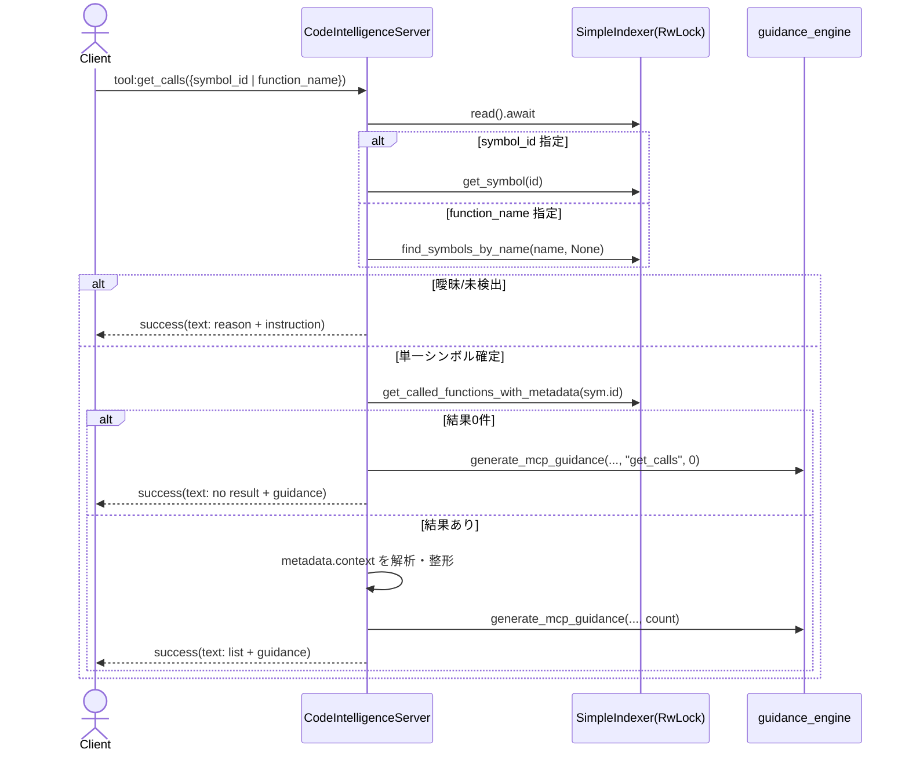

# mcp\mod.rs Review

## TL;DR

- このファイルは、コードインテリジェンス向けの **MCP (Model Context Protocol) サーバ**の中核実装。エクスポートされる主要ツールAPIは: **find_symbol / get_calls / find_callers / analyze_impact / search_symbols / semantic_search_docs / semantic_search_with_context / get_index_info**。
- コア依存は **SimpleIndexer**（検索・関係解析・セマンティック検索）と **rmcp**（MCPプロトコルとツールルータ）。非同期実行と共有状態は **Arc + tokio::RwLock/Mutex** で安全に管理。
- 複雑箇所は以下の分岐・整形ロジック: 1) シンボル特定（ID vs 名前/曖昧性処理）、2) コール関係メタデータのパース（receiver/staticの解析）、3) セマンティック検索無効時の診断、4) 出力のガイダンス付与。
- 重大リスク/注意点: 
  - MCPツール関数での「存在しない/曖昧」の扱いが多く成功メッセージ扱い（プロトコル上はエラーにしても良い）。 
  - 読み取りロックを保持したまま結果整形を行う箇所があり、**長時間の`RwLock`読取保持**によるスループット低下の恐れ。
  - `eprintln!` によるデバッグ出力は運用時のログ方針と不整合の恐れ。`notify_logging_message` との統一・構造化が望ましい。
  - セマンティック検索の可否に外部ファイル存在チェックを混在利用しており、状態不整合時の説明が複雑化しやすい。

## Overview & Purpose

- 本モジュールは、AIアシスタントからコードベースのインデックスに対してクエリを発行し、**記号検索・関係解析・セマンティック検索**を提供する **MCPサーバ**の実装。
- 実行モード:
  - スタンドアロン: `cargo run -- serve`（標準入出力、インデックス常駐）
  - 埋め込み: CLI 内で直接呼び出し（最小メモリ）
- ツール群はすべて **rmcp** の **#[tool]** 注釈によりMCPツールとして公開され、**ToolRouter** に登録される。
- 中核データアクセスは **SimpleIndexer** に委譲。検索/関係/セマンティック情報はこのインデクサのAPIを使用。

## Structure & Key Components

| 種別 | 名前 | 公開範囲 | 責務 | 複雑度 |
|------|------|----------|------|--------|
| Module | client / http_server / https_server / notifications / watcher | pub | 周辺機能（クライアント・HTTP(S)・通知・監視）へのエントリーポイント | 不明 |
| Struct | FindSymbolRequest 他7種 | pub | MCPツールの入力DTO（Deserialize/Serialize/JsonSchema） | Low |
| Struct | CodeIntelligenceServer | pub | MCPサーバ本体。インデクサとルータ、Peer保持 | Med |
| Function | format_relative_time | pub | Unix秒→相対時間文字列 | Low |
| Method | new / from_indexer / new_with_indexer / get_indexer_arc | pub | サーバ生成・外部管理用ハンドル取得 | Low |
| Method | notify_file_reindexed | pub async | ファイル再インデックス通知をPeerへ配信 | Low |
| Tool | find_symbol | pub async | 記号名検索＋概要・関係の短縮表示 | Med |
| Tool | get_calls | pub async | 関数が呼び出す先の列挙＋メタ解析 | Med |
| Tool | find_callers | pub async | 逆向きに呼び出し元の列挙＋メタ解析 | Med |
| Tool | analyze_impact | pub async | 影響半径（全関係）を深さ制限で集約 | Med/High |
| Tool | get_index_info | pub async | インデックスの統計とセマンティック情報 | Low |
| Tool | search_symbols | pub async | 文字列（ファジー）検索 | Med |
| Tool | semantic_search_docs | pub async | セマンティック検索（ドキュメント） | Med |
| Tool | semantic_search_with_context | pub async | セマンティック検索＋関係文脈を合成 | High |
| Trait Impl | ServerHandler(get_info, initialize) | crate内公開（rmcp経由） | MCPハンドシェイクと能力公開 | Low |

### Dependencies & Interactions

- 内部依存（このモジュール内の関係）
  - CodeIntelligenceServer → `SimpleIndexer` 読取/参照
  - CodeIntelligenceServer → `generate_mcp_guidance`（ガイダンス生成）
  - Toolメソッド群 → `ToolRouter`（#[tool_router] マクロが束ねる）
  - `notify_file_reindexed` → `peer.notify_*` 経由で通知送信

- 外部依存（主要クレート/モジュール）
  | 依存 | 用途 | 備考 |
  |------|------|------|
  | rmcp | MCPプロトコル（ServerHandler, ToolRouter, CallToolResult, Content 等） | プロトコル/ツール公開の基盤 |
  | tokio (RwLock/Mutex) | 非同期同期原語 | 読み多・書き少の想定で RwLock |
  | serde/serde_json/schemars | DTOシリアライゼーション/スキーマ | MCPツールI/Fのデータ契約 |
  | chrono | 相対時間整形 | format_relative_time |
  | crate::{Settings, SimpleIndexer, Symbol, SymbolKind, SymbolId} | コア機能 | 実装はこのチャンクにない |
  | crate::io::guidance_engine | ガイダンス生成 | 実装はこのチャンクにない |

- 被依存推定（このモジュールを使う側）
  - CLI埋め込みクライアント（Embedded Mode）
  - HTTP/HTTPSサーバ（http_server / https_server モジュール）
  - ファイル監視（watcher）→ 再インデックス時の通知
  - 外部MCPクライアント（AIアシスタント等）

## API Surface (Public/Exported) and Data Contracts

| API名 | シグネチャ | 目的 | Time | Space |
|-------|-----------|------|------|-------|
| CodeIntelligenceServer::new | fn new(indexer: SimpleIndexer) -> Self | インデクサからサーバ生成 | O(1) | O(1) |
| CodeIntelligenceServer::from_indexer | fn from_indexer(Arc<RwLock<SimpleIndexer>>) -> Self | 既存Arcインデクサを利用 | O(1) | O(1) |
| CodeIntelligenceServer::new_with_indexer | fn new_with_indexer(Arc<RwLock<SimpleIndexer>>, Arc<Settings>) -> Self | HTTPサーバ用（現状未使用のsettings） | O(1) | O(1) |
| CodeIntelligenceServer::get_indexer_arc | fn get_indexer_arc(&self) -> Arc<RwLock<SimpleIndexer>> | インデクサ共有ハンドルを返す | O(1) | O(1) |
| CodeIntelligenceServer::notify_file_reindexed | async fn notify_file_reindexed(&self, file_path: &str) | 再インデックス通知をPeerへ送る | O(1) | O(1) |
| find_symbol | async fn find_symbol(Parameters<FindSymbolRequest>) -> Result<CallToolResult, McpError> | 記号名検索＋短い文脈 | O(N) or index依存 | O(K) |
| get_calls | async fn get_calls(Parameters<GetCallsRequest>) -> Result<CallToolResult, McpError> | ある関数が呼ぶ先を列挙 | O(D) | O(D) |
| find_callers | async fn find_callers(Parameters<FindCallersRequest>) -> Result<CallToolResult, McpError> | ある関数を呼ぶ側を列挙 | O(D) | O(D) |
| analyze_impact | async fn analyze_impact(Parameters<AnalyzeImpactRequest>) -> Result<CallToolResult, McpError> | 全関係の影響分析 | O(R) | O(R) |
| get_index_info | async fn get_index_info(Parameters<GetIndexInfoRequest>) -> Result<CallToolResult, McpError> | インデックス統計 | O(N) | O(U) |
| search_symbols | async fn search_symbols(Parameters<SearchSymbolsRequest>) -> Result<CallToolResult, McpError> | 文字列（ファジー）検索 | O(logN〜N) | O(K) |
| semantic_search_docs | async fn semantic_search_docs(Parameters<SemanticSearchRequest>) -> Result<CallToolResult, McpError> | セマンティック検索 | O(logN〜N) | O(K) |
| semantic_search_with_context | async fn semantic_search_with_context(Parameters<SemanticSearchWithContextRequest>) -> Result<CallToolResult, McpError> | セマンティック検索＋関係文脈 | O(logN〜N + D + R) | O(K + D + R) |
| format_relative_time | pub fn format_relative_time(timestamp: u64) -> String | 相対時間整形 | O(1) | O(1) |
| ServerHandler::get_info | fn get_info(&self) -> ServerInfo | MCPサーバ情報/指示文 | O(1) | O(1) |
| ServerHandler::initialize | async fn initialize(...) -> Result<InitializeResult, McpError> | 接続初期化。Peer保存 | O(1) | O(1) |

注:
- N = 総シンボル数、D = 出入次数（関係の数）、R = 影響半径内シンボル数、K = 返却件数
- 実際の計算量は **SimpleIndexerの実装依存**（このチャンクには現れない）。上記は保守的な見積もり。

### Data Contracts（リクエスト型）

- FindSymbolRequest { name: String, lang: Option<String> }
- GetCallsRequest { function_name: Option<String>, symbol_id: Option<u32> }
- FindCallersRequest { function_name: Option<String>, symbol_id: Option<u32> }
- AnalyzeImpactRequest { symbol_name: Option<String>, symbol_id: Option<u32>, max_depth: u32=3 }
- SearchSymbolsRequest { query: String, limit: u32=10, kind: Option<String>, module: Option<String>, lang: Option<String> }
- SemanticSearchRequest { query: String, limit: u32=10, threshold: Option<f32>, lang: Option<String> }
- SemanticSearchWithContextRequest { query: String, limit: u32=5, threshold: Option<f32>, lang: Option<String> }
- GetIndexInfoRequest {}

各型は serdeのSerialize/Deserialize と schemars::JsonSchema を実装済み。デフォルト値は `default_depth`/`default_limit`/`default_context_limit` による。

### 各APIの詳細

以下は代表的API（公開ツール）中心に詳細化。それ以外のユーティリティ（new/notify/format…）は省略版。

#### find_symbol

1) 目的と責務
- 記号名と任意の言語フィルタで **SimpleIndexer.find_symbols_by_name** を呼び出し、見つかったシンボルの位置・署名・ドキュメントのプレビュー、可能なら関係のサマリ（実装/定義/呼び出し元）を整形して返す。件数に応じてガイダンスも追記。

2) アルゴリズム（簡略）
- RwLock読み取り → 検索 → 0件時: ガイダンス付きで「見つからない」 → N件時: 各シンボルについて context 取得（可能な場合）→ 情報整形 → 件数に応じてガイダンス付与。

3) 引数
| 名 | 型 | 必須 | 説明 |
|---|---|---|---|
| name | String | 必須 | 検索するシンボル名 |
| lang | Option<String> | 任意 | 言語フィルタ（"rust" 等） |

4) 戻り値
| 型 | 説明 |
|---|---|
| Result<CallToolResult, McpError> | 成功時は Content::text を含む success、エラー時は McpError |

5) 使用例
```rust
// MCP client pseudo: tool "find_symbol" with JSON params
{
  "name": "analyze_impact",
  "lang": "rust"
}
```

6) エッジケース
- 同名多数存在（多数の出力）
- コンテキスト取得不可時は基本情報のみ
- ドキュメント長い場合は3行プレビュー

重要箇所根拠: find_symbol関数（行番号不明、当チャンク内）。

#### get_calls

1) 目的と責務
- 指定関数が「呼び出す先」を列挙。ID優先、名前は曖昧性を検知して利用者にID指定を促す。メタ情報から receiver/static を解析して呼び先の表示名と呼出位置行を改善。

2) アルゴリズム（ステップ）
- RwLock読み取り
- symbol_idあれば直参照、なければ名前検索→0件/多件処理→単一決定
- indexer.get_called_functions_with_metadata
- 0件→ガイダンス付きで「なし」
- 各要素について metadata.context を解析（"receiver:..,static:.."）し、`A::f` or `a.f` を表示。行番号は meta.line + 1 があれば優先。
- ガイダンス付与

3) 引数
| 名 | 型 | 必須 | 説明 |
|---|---|---|---|
| function_name | Option<String> | 条件付き | symbol_id がない場合に必須 |
| symbol_id | Option<u32> | 条件付き | 優先的に利用（曖昧性回避） |

4) 戻り値
| 型 | 説明 |
|---|---|
| Result<CallToolResult, McpError> | テキスト整形済みの結果 |

5) 使用例
```rust
// 曖昧名の場合の挙動改善
{ "function_name": "process" }
// もしくは推奨: ID指定
{ "symbol_id": 1234 }
```

6) エッジケース
- symbol_id 不存在 → 「Symbol not found」
- 名前検索 0件/多件 → 案内と候補列挙（最大10）
- メタ情報なし → 定義行を利用

重要箇所根拠: get_calls関数（行番号不明、当チャンク内）。

#### find_callers

- get_calls の逆向き。`indexer.get_calling_functions_with_metadata` を用いる点のみ異なる。receiver/static を解析して「誰がどう呼ぶか」を補足表示。
- 曖昧性処理、行番号選択、ガイダンス付与などは get_calls と同等の流れ。

重要箇所根拠: find_callers関数（行番号不明、当チャンク内）。

#### analyze_impact

- 指定シンボルに対して **全関係（呼/被呼、型使用、構成/レンダリングなど）** を対象に、`indexer.get_impact_radius(id, Some(max_depth))` を実行し結果を種類別に要約。
- まず対象シンボルの場所と直接呼出し元数を ContextIncludes::CALLERS で取得し表示。その後、影響対象を `SymbolKind` 単位でグルーピングして列挙。
- 曖昧性処理、ガイダンス付与あり。

重要箇所根拠: analyze_impact関数（行番号不明、当チャンク内）。

#### get_index_info

- 総シンボル数/ファイル数/関係数と、`get_all_symbols` を1パスで集計して種別別の個数を出力。
- セマンティック検索のメタデータ (`get_semantic_metadata`) を表示し、相対時間は **format_relative_time** を利用。

重要箇所根拠: get_index_info関数（行番号不明、当チャンク内）。

#### search_symbols

- `indexer.search(query, limit, kind_filter, module, lang)` の結果を整形出力。kindフィルタは文字列→`SymbolKind` に手動マッピング。
- 0件時のガイダンス付与あり。

重要箇所根拠: search_symbols関数（行番号不明、当チャンク内）。

#### semantic_search_docs

- セマンティック検索可否を `indexer.has_semantic_search()` で確認。無効なら診断情報付きで `CallToolResult::error` を返却（ただし関数のResultはOkとして返している点に注意）。
- 有効時、しきい値有無で `semantic_search_docs_with_threshold_and_language` / `semantic_search_docs_with_language` を使い分け。
- ヒットのドキュメント先頭数行と署名をプレビュー。ガイダンス付与あり。

重要箇所根拠: semantic_search_docs関数（行番号不明、当チャンク内）。

#### semantic_search_with_context

- 上記の検索に加え、各結果について `get_calls`/`find_callers` 相当のロジックを直接呼び、さらに `get_impact_radius`(深さ2固定) を集計して複合文脈を構築。
- 最も重い処理であり、結果ごとに多数のインデクサクエリを実行。

重要箇所根拠: semantic_search_with_context関数（行番号不明、当チャンク内）。

#### ユーティリティ

- format_relative_time(timestamp: u64) -> String
  - 60秒/1時間/1日/1週以上で表記を分岐。`chrono` を使用し、古い日時は `YYYY-MM-DD` で返す。

- notify_file_reindexed(&self, file_path: &str) -> ()
  - `peer.notify_resource_updated` と `peer.notify_logging_message` を非同期で送信（双方のResultは無視）。

- new / from_indexer / new_with_indexer / get_indexer_arc
  - サーバインスタンスの生成・取得アダプタ。

- ServerHandler::get_info / initialize
  - MCPハンドシェイク用メソッド。initialize では `peer` を保存。

## Walkthrough & Data Flow

以下は代表関数の主分岐とデータフロー。

```mermaid
flowchart TD
  A[Client Request] --> B{get_calls: symbol_id あり?}
  B -- Yes --> C[Indexer.get_symbol(id)]
  C -->|None| E[Return success(text: 'Symbol not found')]
  C -->|Some(sym)| F[identifier = symbol_id:...]
  B -- No --> D{function_name あり?}
  D -- No --> E2[Return success(text: 'Error: Either function_name or symbol_id must be provided')]
  D -- Yes --> G[Indexer.find_symbols_by_name]
  G -->|0件| H[Return success(text: 'Function not found')]
  G -->|>1件| I[Return success(text: 'Ambiguous...' + 候補列挙)]
  G -->|1件| J[identifier = name]
  F --> K[Indexer.get_called_functions_with_metadata(sym.id)]
  J --> K
  K -->|空| L[Return success(text: '...doesn't call any functions' + 💡guidance)]
  K -->|非空| M[metadata.context解析(receiver/static) + 行番号補正]
  M --> N[テキスト整形 + 💡guidance + Return success]
```

上記の図は`get_calls`関数の主要分岐を示す（行番号不明、当チャンク内）。



上記の図は`get_calls`関数のアクター間シーケンスを示す（行番号不明、当チャンク内）。

## Complexity & Performance

- 時間計算量（概算、Index実装依存）
  - find_symbol: O(N)（インデックス済なら O(log N + K) もあり得る）
  - get_calls / find_callers: O(D)（対象ノードの出入次数）
  - analyze_impact: O(R)（影響半径内の探索。深さ max_depth）
  - search_symbols: O(logN〜N)（検索構造次第）
  - semantic_search_*: 埋め込み探索の形に依存（ベクトル近傍探索なら O(logN + K) 期待。線形類似度なら O(N)）
  - get_index_info: O(N)（1パス集計）

- 空間計算量
  - 返却文字列の構築分 O(K + D + R)。semantic_search_with_context は最も肥大化しやすい。

- ボトルネック/スケール限界
  - 長いテキスト整形を **RwLock読み取りガードを保持したまま** 行っている箇所が多く、**高負荷時の同時リクエストでスループット低下**の恐れ。
  - semantic_search_with_context は検索結果ごとに複数の関係クエリを発行し、重くなりやすい。Kを小さめ（デフォルト5）に抑制しているが、設定に依存。
  - I/O: セマンティック検索の可否判定でファイル存在チェックを行うが高頻度ではない。通知は非同期でFailureを無視。

- 実運用負荷要因
  - 検索と関係走査のコスト（インデックス実装・規模依存）
  - セマンティック近傍探索の計算コスト
  - 多数同時実行時の RwLock 競合

## Edge Cases, Bugs, and Security

- エッジケース一覧

| エッジケース | 入力例 | 期待動作 | 実装 | 状態 |
|-------------|--------|----------|------|------|
| シンボル未検出（get_calls） | {"symbol_id": 999999} | 見つからない旨の応答 | success(text)で返却 | 実装済 |
| function_name未指定 & symbol_id未指定 | {} | エラーを返す | success(text: "Either...") | 実装済 |
| 曖昧一致（複数ヒット） | {"function_name":"foo"} | 候補列挙しID指定を促す | success(text: "Ambiguous...") | 実装済 |
| セマンティック検索無効 | {"query":"..."} | 明確なエラー＋診断 | CallToolResult::error を Ok 包装 | 実装済 |
| メタデータ欠落（receiver解析不可） | 呼び関係にcontextなし | フォールバック表示 | 実装済 | 実装済 |
| ドキュメント長文 | 長いdoc | 冒頭数行に省略 | 実装済 | 実装済 |

- セキュリティチェックリスト
  - メモリ安全性: 
    - unsafe使用なし（このチャンクには現れない）。
    - 標準的な所有権/借用。非同期で `Arc<RwLock<_>>` と `Arc<Mutex<_>>` を使用し **UAF/二重解放なし**。
    - 整数オーバーフロー: `line + 1` 等はusize→usize加算、オーバーフローの恐れは低いが入力に依存。Rustのreleaseビルドではチェックされない点に留意。
  - インジェクション:
    - SQL/Command/Path Traversal 該当なし。`file_path` は出力文字列に含めるのみ。外部コマンドやファイル読み書きなし。
  - 認証・認可:
    - このモジュール内に認可なし。MCP接続の認証は上位層に依存（このチャンクには現れない）。
  - 秘密情報:
    - **eprintln!** によるデバッグ出力/診断文字列に環境情報（cwd, index path）が出力される箇所あり。開発時には有益だが、本番では情報露出リスク。`settings.mcp.debug` で制御しているが、無効時にもセマンティック無効診断でcwdを返す箇所あり（semantic_search_docs: エラー時のDEBUG INFOにcwd含む）。本番での露出抑制が望ましい。
  - 並行性:
    - `RwLock` は読者多数に適する。読み取りロックが文字列整形中も保持されているため、**長時間保持**が競合の温床に。`Mutex` で守る `peer` は短時間ロックで安全。
    - デッドロック箇所は見当たらない（`RwLock`と`Mutex`のネストが限定的かつ順序固定）。
  
- 既知/潜在バグ
  - セマンティック無効時の診断: `metadata.json` / `segment_0.vec` の存在チェックを行うが、判定と `has_semantic_search()` の結果が一致しない場合の説明が冗長化。ユーザメッセージを簡潔にし、内部詳細はDEBUG専用にすべき。
  - エラー語彙の不統一: 「曖昧」「見つからない」を success(text) で返すAPIと、CallToolResult::errorを使うAPIが混在。クライアント側のハンドリングが一貫しにくい。

## Design & Architecture Suggestions

- 出力整形とデータ取得の分離
  - 取得系（indexer呼び出し）→ ロック解除 → 整形系 という段階分離で **RwLockの保持時間を最小化**。
  - 例: `let data = { ...インデックス参照で必要最小のデータをclone... }; drop(read_guard); // ここから整形`

- シンボル解決の共通化
  - 「symbol_id優先・名前→曖昧処理」という解決手順は `get_calls`, `find_callers`, `analyze_impact` で重複。**helper関数**（例: `resolve_symbol(&indexer, id_opt, name_opt, tool_name) -> Result<Resolved, CallToolResult>`）に抽出。

- メタデータ解析（receiver/static）の共通化
  - context="receiver:...,static:..." 文字列パースが複数箇所で重複。**構造化型**にパースするヘルパーを導入。

- 返却の構造化
  - 現状は全て `Content::text` のフラットなテキスト。**構造化JSON**を `Content::from_object` 等で併送（rmcpの表現機能に依存）すれば、クライアントでの機械処理が容易に。

- エラー方針の一貫化
  - 「見つからない/曖昧」など、ユーザ操作で解決可能なものは `error` ではなく `success` としているが、**ガイダンスを付与したerror**に統一する選択肢も検討（クライアントが再入力フローに乗りやすい）。

- 観測性の標準化
  - `eprintln!`ではなく**tracing**で構造化ログ・spanを付与。MCP通知のログと整合を取る。

- セマンティック検索の状態管理
  - `has_semantic_search()` と「ファイル存在チェック」の二重管理を避け、**単一のソース**を信頼する。

## Testing Strategy (Unit/Integration) with Examples

- 単体テスト（非同期）
  - `tokio::test` を利用。`SimpleIndexer` を小さなモック/テスト用インデクサで差し替え。
  - 典型ケース: 
    - 存在するsymbol_idで `get_calls` を呼び、呼出先が期待通り。
    - 名前曖昧（2件以上）でアンビギュアス応答を検証。
    - セマンティック検索無効時に `CallToolResult::error` が返ること。

- 統合テスト
  - `ServerHandler::initialize` → `ToolRouter` 経由で各ツールを呼び、**エンドツーエンド**の文字列出力とガイダンス付与を検証。

- テスト例（概念）
```rust
#[tokio::test]
async fn test_get_calls_by_id_not_found() {
    use std::sync::Arc;
    use tokio::sync::RwLock;

    // Arrange: 空のインデクサ（モック化想定）
    let indexer = SimpleIndexer::empty_for_test(); // このチャンクには現れない: モックAPI例
    let server = CodeIntelligenceServer::from_indexer(Arc::new(RwLock::new(indexer)));

    // Act
    let params = GetCallsRequest { function_name: None, symbol_id: Some(999999) };
    let res = server.get_calls(rmcp::handler::server::wrapper::Parameters(params)).await.unwrap();

    // Assert
    let text = res.contents()[0].as_text().unwrap(); // 擬似API
    assert!(text.contains("Symbol not found"));
}
```

```rust
#[tokio::test]
async fn test_semantic_search_docs_disabled() {
    let indexer = SimpleIndexer::without_semantic_for_test(); // このチャンクには現れない: モックAPI例
    let server = CodeIntelligenceServer::from_indexer(Arc::new(RwLock::new(indexer)));

    let params = SemanticSearchRequest { query: "parse config".into(), limit: 5, threshold: None, lang: None };
    let res = server.semantic_search_docs(rmcp::handler::server::wrapper::Parameters(params)).await.unwrap();

    assert!(res.is_error()); // 擬似API: CallToolResultのエラー判定
}
```

- エッジケーステスト
  - 極端に長いドキュメントの省略挙動
  - `metadata.context` が不正フォーマットな場合のフォールバック
  - `max_depth=0` / 大きな値での `analyze_impact` の境界

注: 上記モック/擬似APIはこのチャンクには現れないため、実プロジェクトのテスト補助APIに合わせて調整が必要。

## Refactoring Plan & Best Practices

- 共有ヘルパーの抽出
  - `resolve_symbol`（ID/名前統一処理）、`format_call_metadata`（receiver/static解析）、`append_guidance`（ガイダンス付与）をモジュール内プライベート関数化。
- ロックの粒度縮小
  - 取得した `Symbol` や結果ベクタを clone で逃がし、**readガードを早期Drop** → その後に文字列整形。
- 返却の二重化（テキスト + 構造化）
  - `Content::text` と並行して `Content::from_object(json!{ ... })`（可能なら）で機械可読形式を添付。
- ロギング/トレース
  - `tracing` を導入し、ツール名/件数/経過時間（metrics）を計測。
- エラーポリシー
  - ユーザ修正可能なエラーを `error` で返すか、`success`で返すかを**ガイドライン化**して統一。

## Observability (Logging, Metrics, Tracing)

- 現状
  - `eprintln!`（debugフラグ時）と `notify_logging_message` を併用。初期化時に `peer` を保存し、通知を送信可能。
- 推奨
  - **tracing**で`info!`/`debug!`/`error!`、`#[instrument]`でツール毎のspanを付与。
  - 計測値（検索件数、結果件数、処理時間）をメトリクス出力。負荷監視やSLO管理に有用。
  - セマンティック無効診断はPRODでは簡潔に、詳細はDEBUGレベルのみに。

サンプル（概念）:
```rust
#[tracing::instrument(name="mcp.get_calls", skip(self))]
pub async fn get_calls(...) -> Result<CallToolResult, McpError> {
    let start = std::time::Instant::now();
    // ...
    tracing::info!(result_count = result_count, elapsed_ms = start.elapsed().as_millis() as u64);
    Ok(...)
}
```

## Risks & Unknowns

- `SimpleIndexer` の内部実装が不明（このチャンクには現れない）
  - 検索の計算量・メモリ消費・セマンティック検索の近傍探索方式
  - `get_impact_radius` の関係網の定義（「型使用」「構成」の網羅性）
- `rmcp` の `CallToolResult` / `Content` の表現能力
  - 構造化添付の可否/標準化は不明
- `Peer<RoleServer>` のスレッド安全性・再接続時の挙動
  - initialize後のPeer生存期間・切断時の例外はこのチャンクには現れない
- マルチ言語サポートの深度
  - `lang` フィルタの精度・辞書の整備状況は不明

以上の不明点は、外部モジュールやランタイムの実装に依存する。設計選択や最適化の前提として、メトリクスとプロファイリングによる実測を推奨。