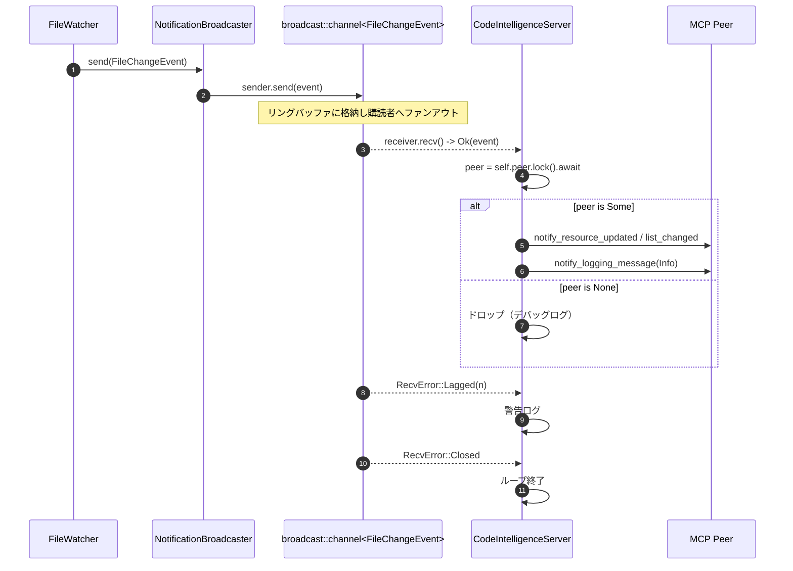

# notifications.rs Review

## TL;DR

- 目的: ファイル変更イベントをTokioのbroadcastチャネルで配信し、複数のMCPサーバー（CodeIntelligenceServer）へ通知を転送するためのユーティリティ。
- 公開API: FileChangeEvent、NotificationBroadcaster::{new, with_debug, send, subscribe}、CodeIntelligenceServer::start_notification_listener。
- コアロジック: broadcast::Receiverでイベントを受信し、MCP Peerへresource_updated / resource_list_changed / logging_messageを送信。
- 重大リスク: 非同期ロック(self.peer.lock().await)を保持したままawaitしており、コンテンド/デッドロックの温床。Windows等でのfile://URI生成の不正確さ。
- エラー設計: sendはResultを返さず握りつぶし、MCP通知もlet _ =で無視。最低限のログのみ。
- 並行性: broadcastでのメッセージ喪失(Lagged)はログのみで回復策なし。キャンセル/シャットダウン制御が不足。
- パフォーマンス: 送信はO(1)だが、イベントを一度cloneしており軽微なオーバーヘッド。通知処理はネットワークI/O支配。

## Overview & Purpose

このモジュールは、ファイル監視などのプロデューサから発生するファイル変更イベントを複数のMCPサーバーインスタンスに配信する仕組みを提供します。内部的にはTokioのbroadcastチャネルを使い、各サーバーはReceiverでイベントを購読し、受信したイベントに応じてMCPプロトコル上の通知をPeerへ転送します。

- イベント種別: 再インデックス完了、ファイル作成、ファイル削除、インデックス再読み込み
- サーバー側処理: イベント種別に応じてresource_updated、resource_list_changed、logging_messageを送信

この設計により、1プロデューサ→Nコンシューマのスケールが容易になります。

## Structure & Key Components

| 種別 | 名前 | 公開範囲 | 責務 | 複雑度 |
|------|------|----------|------|--------|
| Enum | FileChangeEvent | pub | ファイル変更イベントのデータ契約 | Low |
| Struct | NotificationBroadcaster | pub | broadcast送信の管理（Sender保持、購読生成、送信、デバッグ） | Low |
| Method | NotificationBroadcaster::new | pub | チャネル容量指定で新規作成 | Low |
| Method | NotificationBroadcaster::with_debug | pub | デバッグ出力の有効化 | Low |
| Method | NotificationBroadcaster::send | pub | イベントのブロードキャスト送信 | Low |
| Method | NotificationBroadcaster::subscribe | pub | Receiverの発行 | Low |
| Method | CodeIntelligenceServer::start_notification_listener | pub | 受信ループでMCP通知へ橋渡し | Med |

### Dependencies & Interactions

- 内部依存
  - start_notification_listenerはFileChangeEventを受信し、種別に応じて分岐。
  - NotificationBroadcasterはtokio::sync::broadcast::Sender<FileChangeEvent>を保持し、Receiverを生成。
- 外部依存

| ライブラリ/モジュール | 使用箇所 | 目的/機能 | 備考 |
|----------------------|----------|-----------|------|
| tokio::sync::broadcast | 全体 | 非同期Broadcastチャネル | Lagged/Closedエラーで分岐 |
| rmcp::model | start_notification_listener | MCP通知の型（LoggingLevel, ...Param） | 実体は本チャンク外 |
| serde_json::json | start_notification_listener | logging_messageのdata生成 | JSON構築 |
| std::path::PathBuf | FileChangeEvent | パスの保持 | Clone可能 |

- 被依存推定
  - ファイルウォッチャーやインデクサがNotificationBroadcaster::sendを利用。
  - MCPサーバー起動時にsubscribeし、start_notification_listenerをタスクとして起動。

## API Surface (Public/Exported) and Data Contracts

| API名 | シグネチャ | 目的 | Time | Space |
|-------|------------|------|------|-------|
| FileChangeEvent | enum FileChangeEvent { FileReindexed{path}, FileCreated{path}, FileDeleted{path}, IndexReloaded } | イベントのデータ契約 | - | - |
| NotificationBroadcaster::new | pub fn new(capacity: usize) -> Self | broadcastチャネル生成 | O(1) | O(capacity) |
| NotificationBroadcaster::with_debug | pub fn with_debug(self, debug: bool) -> Self | デバッグ出力切替 | O(1) | O(1) |
| NotificationBroadcaster::send | pub fn send(&self, event: FileChangeEvent) | イベント送信 | O(L)※ | O(1) |
| NotificationBroadcaster::subscribe | pub fn subscribe(&self) -> broadcast::Receiver<FileChangeEvent> | Receiver生成 | O(1) | O(1) |
| CodeIntelligenceServer::start_notification_listener | pub async fn start_notification_listener(&self, receiver: broadcast::Receiver<FileChangeEvent>, mcp_debug: bool) | 受信してMCP通知転送 | O(1)/msg + I/O | O(1) |

※L=パス文字列長。送信時にevent.clone()を行うため。

### 各APIの詳細

1) FileChangeEvent
- 目的と責務
  - ファイル変更に関するイベント種別を表現するデータ契約。
- アルゴリズム
  - データのみ。ロジックなし。
- 引数/戻り値
  - 該当なし。
- 使用例
```rust
use std::path::PathBuf;
let ev = FileChangeEvent::FileCreated { path: PathBuf::from("src/lib.rs") };
```
- エッジケース
  - パスが非UTF-8: path.display().to_string()で不可逆な文字置換の可能性。
  - Windowsパス: file://URI整形時に注意が必要（後述）。

2) NotificationBroadcaster::new
- 目的と責務
  - 指定容量(capacity)のbroadcastチャネルを生成して送信者(Sender)を保持。
- アルゴリズム
  - broadcast::channel(capacity)を呼び出すだけ。
- 引数
  | 引数 | 型 | 説明 |
  |------|----|------|
  | capacity | usize | リングバッファ容量（古いメッセージは上書きされ得る） |
- 戻り値
  | 型 | 説明 |
  |----|------|
  | Self | Broadcasterインスタンス |
- 使用例
```rust
let broadcaster = NotificationBroadcaster::new(1024);
```
- エッジケース
  - capacityが小さいとReceiverのLagが発生しやすい。

3) NotificationBroadcaster::with_debug
- 目的と責務
  - デバッグログ(eprintln!)の有効/無効設定。
- アルゴリズム
  - フィールドフラグをセットしてselfを返却。
- 引数
  | 引数 | 型 | 説明 |
  |------|----|------|
  | debug | bool | デバッグ出力を有効にするか |
- 戻り値
  | 型 | 説明 |
  |----|------|
  | Self | 設定済みのSelf（ビルダー的使い方） |
- 使用例
```rust
let broadcaster = NotificationBroadcaster::new(256).with_debug(true);
```
- エッジケース
  - 該当なし。

4) NotificationBroadcaster::send
- 目的と責務
  - イベントを全購読者へブロードキャスト。
- アルゴリズム
  - event.clone()してSenderへ送信。
  - Ok(count): デバッグ時は送信数をログ。
  - Err(_): 購読者不在→デバッグ時のみログ。
- 引数
  | 引数 | 型 | 説明 |
  |------|----|------|
  | event | FileChangeEvent | 送信するイベント |
- 戻り値
  | 型 | 説明 |
  |----|------|
  | () | 返り値なし（エラーは握りつぶし） |
- 使用例
```rust
use std::path::PathBuf;
let broadcaster = NotificationBroadcaster::new(128).with_debug(true);
broadcaster.send(FileChangeEvent::FileDeleted { path: PathBuf::from("README.md") });
```
- エッジケース
  - 購読者ゼロ: Errだが「正常系」とみなしログのみ。
  - 高頻度送信: Receiver側でLagが起き得る（本APIは未検知）。

5) NotificationBroadcaster::subscribe
- 目的と責務
  - 新しいReceiverを発行。
- アルゴリズム
  - sender.subscribe()を返すのみ。
- 引数/戻り値
  | 戻り値 | 説明 |
  |--------|------|
  | broadcast::Receiver<FileChangeEvent> | 非同期受信用Receiver |
- 使用例
```rust
let rx = broadcaster.subscribe();
```
- エッジケース
  - None。

6) CodeIntelligenceServer::start_notification_listener
- 目的と責務
  - 受信ループを起動し、受けたイベントをMCP Peerへ転送。
- アルゴリズム（主要ステップ）
  1. 初期ログ（mcp_debug時）。
  2. 無限ループでreceiver.recv().await。
  3. Ok(event): self.peerロック→Some(peer)ならイベント種別で分岐してMCP通知をawait送信。Noneならドロップログ。
  4. Err(Lagged(n)): 警告ログ。
  5. Err(Closed): ログ後break。
- 引数
  | 引数 | 型 | 説明 |
  |------|----|------|
  | receiver | broadcast::Receiver<FileChangeEvent> | イベント受信用 |
  | mcp_debug | bool | MCP処理のデバッグ出力フラグ |
- 戻り値
  | 型 | 説明 |
  |----|------|
  | () | 終了しない（チャネルCloseで終了） |
- 使用例（非ブロッキング起動推奨）
```rust
// 例: サーバープロセス起動時にspawnする
let mut rx = broadcaster.subscribe();
let server = /* CodeIntelligenceServer の取得 */;
tokio::spawn(async move {
    server.start_notification_listener(rx, true).await;
});
```
- エッジケース
  - 受信Lag: メッセージ喪失。ログのみ。
  - Peer未準備: イベントは破棄される（ログのみ）。
  - チャネルClose: ループ終了。

## Walkthrough & Data Flow

- 典型フロー
  1. ファイル監視がFileChangeEventを生成。
  2. NotificationBroadcaster::sendでbroadcast送信。
  3. 各CodeIntelligenceServerがsubscribeしたReceiverでrecv().await。
  4. 受信したイベントに応じてMCP Peerに通知を発行。

Mermaid: シーケンス図

上記の図はstart_notification_listener関数の主要分岐を示す（行番号: 不明。このチャンクには行番号情報が含まれない）。

Mermaid: 受信ループ分岐フローチャート
```mermaid
flowchart TD
    A[Start listener] --> B[recv().await]
    B -->|Ok(event)| C{peer available?}
    C -->|Yes| D{match event}
    D -->|FileReindexed| E[notify_resource_updated + logging_message]
    D -->|FileCreated/Deleted/IndexReloaded| F[notify_resource_list_changed]
    C -->|No| G[drop with debug log]
    B -->|Lagged(n)| H[warn log: lagged by n]
    B -->|Closed| I[debug log: closed] --> J[break]
```
上記の図はstart_notification_listener関数のループ分岐を示す（行番号: 不明）。

参考抜粋（要所のみ）
```rust
loop {
    match receiver.recv().await {
        Ok(event) => {
            let peer_guard = self.peer.lock().await;
            if let Some(peer) = peer_guard.as_ref() {
                match event {
                    FileChangeEvent::FileReindexed { path } => {
                        let path_str = path.display().to_string();
                        let _ = peer.notify_resource_updated(
                            ResourceUpdatedNotificationParam { uri: format!("file://{path_str}") }
                        ).await;
                        let _ = peer.notify_logging_message(
                            LoggingMessageNotificationParam {
                                level: LoggingLevel::Info,
                                logger: Some("codanna".to_string()),
                                data: serde_json::json!({
                                    "action": "re-indexed", "file": path_str
                                }),
                            }
                        ).await;
                    }
                    FileChangeEvent::FileCreated { .. }
                    | FileChangeEvent::FileDeleted { .. }
                    | FileChangeEvent::IndexReloaded => {
                        let _ = peer.notify_resource_list_changed().await;
                    }
                }
            }
        }
        Err(broadcast::error::RecvError::Lagged(_)) => { /* log */ }
        Err(broadcast::error::RecvError::Closed) => break,
    }
}
```

## Complexity & Performance

- NotificationBroadcaster::send
  - 時間: O(1)（broadcastへの書込み）+ O(L)（event.cloneでのPathBuf Clone）
  - 空間: O(1)一時領域。チャネル側はO(capacity × sizeof(FileChangeEvent))相当のリングバッファ。
- NotificationBroadcaster::subscribe
  - 時間/空間: O(1)
- start_notification_listener（1イベントあたり）
  - 時間: O(1) + I/O（MCP通知awaitが支配的）
  - 空間: O(1)
- ボトルネック
  - MCP通知（ネットワークI/O）
  - Receiver遅延でのメッセージ喪失（Lagged）
- スケール限界
  - 高頻度イベント時にはLagged増加。capacity調整・集約通知が必要。
  - 送信側のevent.cloneは軽微だが、巨大パスや大量イベントで影響し得る。

## Edge Cases, Bugs, and Security

| エッジケース | 入力例 | 期待動作 | 実装 | 状態 |
|-------------|--------|----------|------|------|
| 購読者なし | send(ev) | エラーではなく無視/ログ | Err(_)でデバッグログ | OK |
| Receiver遅延 | capacity小/高頻度 | ロスト検知と適切な回復/再同期 | Lagged(n)で警告ログのみ | 改善余地 |
| チャネルClose | Receiver drop | ループ終了 | Closedでbreak | OK |
| Peer未準備 | self.peer=None | 待機/再試行/キューイング等 | ドロップしてログ | 改善余地 |
| WindowsパスURI | C:\foo bar\baz.txt | file:///C:/foo%20bar/baz.txt | "file://{path_str}" | バグの可能性 |
| 非UTF-8パス | OS依存パス | 適切エンコード | display().to_string() | 不正確の可能性 |
| ロック越しawait | peerロック中 | 低レイテンシ/デッドロック回避 | ロック保持のままawait | リスク |

セキュリティチェックリスト
- メモリ安全性
  - unsafe未使用。所有権/借用はRustの型システムで保護。Buffer overflow / UAFの懸念なし。
- インジェクション
  - SQL/Command/Path traversalなし。file://URI構築はエスケープ未対応だが、外部プロセス呼出しなし。
- 認証・認可
  - 本モジュールでの権限チェックは「該当なし」。Peer側に委譲。
- 秘密情報
  - eprintln!でパスを標準エラーに出すため、運用ログへの漏洩に注意（デバッグフラグで制御）。
- 並行性
  - tokio::Mutexガードを保持したままawaitしており、潜在的に他タスクをブロック。デッドロックの可能性はPeer実装次第でゼロではない。

Rust特有の観点
- 所有権
  - NotificationBroadcaster::sendでevent.clone()。元eventは以後も参照（デバッグログ）するためcloneが必要という設計だが、最適化可能（後述）。
- 借用/ライフタイム
  - peer_guard.as_ref()でOption<&Peer>を取得し、その参照を使ってawaitするため、ガードのライフタイムを越えて待機が発生（ロック保持延長）。
- unsafe境界
  - 該当なし。
- Send/Sync
  - FileChangeEventはPathBufを含みSend。broadcastで安全に共有可能。
- 非同期/await境界
  - await中にロック保持。改善余地。
- エラー設計
  - Resultを返さず無視。unwrap/expectは未使用でpanicは発生しないが、障害検知が困難。

## Design & Architecture Suggestions

- ロックのスコープ短縮（重要）
  - peerのクローン可能なハンドル（Arcなど）を取得してからロック解放→その後await実行。
  - 例（疑似）:
    ```rust
    // peer: Arc<...> などClone可能であることが前提（このチャンクには現れない）
    let peer = {
        let guard = self.peer.lock().await;
        guard.clone()
    };
    if let Some(peer) = peer { /* await通知 */ }
    ```
- URI構築の正確化
  - url::Url::from_file_path(path).expect(...) を用いるなどしてOS依存の不正確さを解消。
- sendの戻り値
  - 送信結果を返すインターフェイスへ変更（Result<usize, SendError>）。少なくともデバッグ時のみcloneするなど最適化:
    ```rust
    pub fn send(&self, event: FileChangeEvent) {
        let for_log = if self.debug { Some(event.clone()) } else { None };
        match self.sender.send(event) {
            Ok(count) => if let Some(ev) = for_log { eprintln!("... {count} ... {ev:?}") },
            Err(_) => if let Some(ev) = for_log { eprintln!("... no subs ... {ev:?}") },
        }
    }
    ```
- バックプレッシャ/再同期戦略
  - Lagged発生時にIndexReloadedをトリガーする、あるいは完全再同期をスケジュール。
- シャットダウン/キャンセル
  - 明示的なshutdownシグナル（watch channel/CancelToken）に対応し、Closed以外でも終了可能に。
- ロギング/監視
  - eprintln!からtracingへ移行（構造化ログ + レベル + span/trace）。
- APIの起動方法
  - start_notification_listenerは無限ループのため、spawn専用のAPI（JoinHandle返却）を別途用意すると誤用を防げる。

## Testing Strategy (Unit/Integration) with Examples

ユニットテスト（NotificationBroadcaster）
```rust
#[tokio::test]
async fn broadcaster_send_and_receive() {
    use std::path::PathBuf;

    let broadcaster = NotificationBroadcaster::new(8);
    let mut rx = broadcaster.subscribe();

    broadcaster.send(FileChangeEvent::FileCreated { path: PathBuf::from("a.txt") });

    let ev = rx.recv().await.expect("should receive");
    match ev {
        FileChangeEvent::FileCreated { path } => assert_eq!(path, PathBuf::from("a.txt")),
        _ => panic!("unexpected event"),
    }
}

#[tokio::test]
async fn broadcaster_no_subscribers_is_ok() {
    use std::path::PathBuf;

    let broadcaster = NotificationBroadcaster::new(8).with_debug(true);
    // 購読者ゼロでもパニックやエラーを返さないこと（ログのみ）
    broadcaster.send(FileChangeEvent::FileDeleted { path: PathBuf::from("b.txt") });
}
```

遅延（Lagged）の観察テスト（ログのみで挙動確認）
```rust
#[tokio::test]
async fn receiver_lagged_logs_warning() {
    use std::path::PathBuf;

    let broadcaster = NotificationBroadcaster::new(1).with_debug(true); // 小容量
    let mut rx = broadcaster.subscribe();

    // 受信せず連続送信してLag発生を誘発
    broadcaster.send(FileChangeEvent::FileCreated { path: PathBuf::from("x") });
    broadcaster.send(FileChangeEvent::FileCreated { path: PathBuf::from("y") });

    // Laggedが起きてもrecv側でErr(Lagged(_))となる
    match rx.recv().await {
        Ok(_) => {} // 先頭か末尾のいずれか
        Err(tokio::sync::broadcast::error::RecvError::Lagged(n)) => {
            assert!(n >= 1);
        }
        Err(e) => panic!("unexpected error: {e}"),
    }
}
```

統合テスト（start_notification_listener）
- このチャンクにはsuper::CodeIntelligenceServerやPeer型の詳細がないため、実コードに対する完全な統合テストは「不明」。代替として、Peerをモック化し、通知呼び出しを記録するスタブを用意し、CodeIntelligenceServer相当のテスト用型で同ロジックを検証するのが望ましい（このチャンクには現れない）。

テスト観点
- FileReindexedでresource_updatedとlogging_messageの両方が送出されること
- FileCreated/Deleted/IndexReloadedでresource_list_changedのみが送出されること
- PeerがNoneの場合にイベントがドロップされてもパニックしないこと
- チャネルCloseでループが終了すること

## Refactoring Plan & Best Practices

- ロックの粒度改善
  - peerを取得したら速やかにロック解放し、awaitはロック外で実行。
- URL生成の堅牢化
  - Url::from_file_pathでfile://URIを構築（OS差異を吸収）。
- sendの最適化と結果通知
  - デバッグ時のみclone。戻り値で送信先数/エラーを返す。
- ログ/監視の標準化
  - tracing + OpenTelemetry導入。eprintln!を廃止し、ログレベル制御・メタデータを活用。
- エラーハンドリング
  - MCP通知の失敗をwarn以上で記録し、場合により再試行/フォールバック（例: resource_updated失敗時にlist_changedへフォールバック）を検討。
- シャットダウン制御
  - 明示的な停止トリガーを追加し、タスクリーク防止。

## Observability (Logging, Metrics, Tracing)

- ロギング
  - eprintln! → tracing::{debug, info, warn, error}。イベントID、パス、サブスクライバ数などを構造化フィールドで付与。
- メトリクス
  - counter.notifications_sent{type=reindexed/created/...}
  - counter.notifications_failed
  - counter.receiver_lagged
  - gauge.subscriber_count（sendの戻り値から推定可能）
  - histogram.notification_latency（MCP通知往復時間を計測）
- トレーシング
  - span: "notification_listener"（event_id/pathなどのタグ）
  - 子span: "notify_resource_updated", "notify_resource_list_changed", "notify_logging_message"

## Risks & Unknowns

- super::CodeIntelligenceServerの詳細（フィールド型、peerのClone可否、Send/Sync保証）は「不明」。
- rmcp::modelの各通知APIのエラー詳細および再試行要件は「不明」。
- 運用時のイベント頻度、必要なチャネル容量、遅延許容度は「不明」。
- file://URI の受け手（MCP Peer）がどの程度厳密なURI仕様を要求するかは「不明」。

以上の点を踏まえ、特に「ロック越しawaitの解消」「URI生成の厳密化」「エラー/ログの強化」を優先度高めに改善することを推奨します。