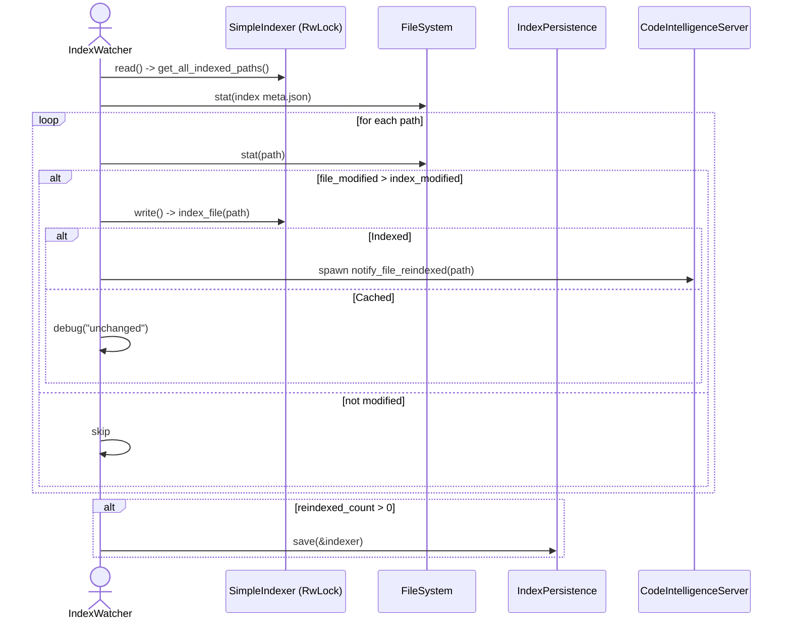

# mcp\watcher.rs Review

## TL;DR

- 目的: インデックスのメタファイル変更を定期的に検知し、検索インデックスをホットリロードする。必要に応じてソースファイルも再インデックス。
- 公開API: IndexWatcher のビルダー系メソッド（new/with_*）、監視開始（watch）、統計取得（get_stats）、および IndexStats 構造体。
- 複雑箇所: check_and_reload における再読み込み判定、セマンティック検索の復元、通知送信、I/O（同期 fs）と非同期 tokio の混在。
- 並行性: Arc<RwLock<SimpleIndexer)> による共有と書き換え、tokio::time::interval による周期監視、tokio::spawn による通知の並列化。ロック保持範囲と大量タスク発行に注意。
- 重大リスク: meta.json 不在時のエラー伝搬による連続エラーログ、同期ファイルI/Oの非同期コンテキストでのブロッキング、再インデックス時の長時間書きロック保持、再インデックス判定が meta.json 依存で None の場合 reindex されない。
- セキュリティ: 外部入力を直接処理しないため重大なインジェクションの可能性は低いが、ログにパス情報が出力される点と権限管理不在は注意。
- テスト観点: ファイル更新の疑似化、ホットリロード成否、セマンティック復元、通知発行、ロックの競合、キャンセル未対応の監視ループの健全性。

## Overview & Purpose

このモジュールは、MCP（CodeIntelligenceServer）環境で検索インデックスを自動的にホットリロードするためのファイルウォッチャを提供します。具体的には、指定のインデックスパス内の Tantivy メタデータ（meta.json）の更新時刻を定期的にチェックし、変更が検知されれば IndexPersistence から SimpleIndexer を再ロードします。さらに設定が有効な場合、インデックス済みのソースファイルの更新を検知して再インデックスします。リロード後には通知ブロードキャスタや MCP サーバへイベント通知を行い、クライアントへ変更を伝えます。

## Structure & Key Components

| 種別 | 名前 | 公開範囲 | 責務 | 複雑度 |
|------|------|----------|------|--------|
| Struct | IndexWatcher | pub | インデックスの変更監視・ホットリロード・ソース再インデックス・通知発火 | High |
| Struct | IndexStats | pub | 現在のインデックス統計（件数、最終更新、パス） | Low |
| Fn (impl) | IndexWatcher::new | pub | 初期化（パス・持続化・初期更新時刻の取得） | Low |
| Fn (impl) | IndexWatcher::with_mcp_server | pub | MCPサーバの設定（ビルダー） | Low |
| Fn (impl) | IndexWatcher::with_broadcaster | pub | 通知ブロードキャスタの設定（ビルダー） | Low |
| Fn (impl) | IndexWatcher::watch | pub | 周期監視ループの開始 | Med |
| Fn (impl) | IndexWatcher::get_stats | pub | 統計の取得（読み取りロック） | Low |
| Fn (impl) | IndexWatcher::check_and_reload | private | メタ更新検知・インデックス再ロード・セマンティック復元・通知 | High |
| Fn (impl) | IndexWatcher::check_and_reindex_source_files | private | ソースファイル更新検知・再インデックス・永続化・通知 | Med |

### Dependencies & Interactions

- 内部依存
  - IndexWatcher → IndexPersistence（存在確認、ロード、セーブ）
  - IndexWatcher → SimpleIndexer（書きロックで差し替え、ファイル再インデックス、統計取得）
  - IndexWatcher → Settings（file_watch/mcp.debug/debug フラグ、パス）
  - IndexWatcher → NotificationBroadcaster（IndexReloaded 通知送信）
  - IndexWatcher → CodeIntelligenceServer（ファイル再インデックス通知）

- 外部依存（このチャンクに現れる使用先）
  | クレート/モジュール | 用途 |
  |--------------------|------|
  | std::fs / std::path / std::time | メタデータ取得、パス管理、時刻 |
  | tokio::sync::RwLock | 共有インデックスの排他制御 |
  | tokio::time::interval | 周期的チェック |
  | tokio::spawn | 非同期通知の並列発行 |
  | tracing | 構造化ログ出力 |
  | super::notifications | FileChangeEvent、NotificationBroadcaster |
  | super::CodeIntelligenceServer | MCP通知 |
  | crate::{IndexPersistence, Settings, SimpleIndexer, IndexingResult} | インデックス永続化・設定・インデクサ・インデックス結果 |

- 被依存推定
  - 検索クエリ処理モジュール（SimpleIndexer を参照）
  - MCP サーバの起動時初期化コード（IndexWatcher の生成・watch 呼び出し）
  - UI/フロントエンドやクライアント通知層（NotificationBroadcaster による反映）

## API Surface (Public/Exported) and Data Contracts

| API名 | シグネチャ | 目的 | Time | Space |
|-------|-----------|------|------|-------|
| IndexWatcher::new | fn new(indexer: Arc<RwLock<SimpleIndexer>>, settings: Arc<Settings>, check_interval: Duration) -> Self | ウォッチャの初期化 | O(1) + 1回のfsメタ取得 | O(1) |
| IndexWatcher::with_mcp_server | fn with_mcp_server(self, server: Arc<CodeIntelligenceServer>) -> Self | MCPサーバ通知設定（ビルダー） | O(1) | O(1) |
| IndexWatcher::with_broadcaster | fn with_broadcaster(self, broadcaster: Arc<NotificationBroadcaster>) -> Self | 通知ブロードキャスタ設定（ビルダー） | O(1) | O(1) |
| IndexWatcher::watch | async fn watch(self) | 周期監視ループ開始 | 各tick O(1)＋I/O依存 | O(1) |
| IndexWatcher::get_stats | async fn get_stats(&self) -> IndexStats | 統計情報の取得 | O(1) | O(1) |

### IndexWatcher::new

1) 目的と責務
- IndexWatcher のインスタンスを作成し、監視対象のインデックスパス、永続化ハンドラ、初期の meta.json 更新時刻を取得します。

2) アルゴリズム（ステップ）
- settings.index_path を複製して保持。
- IndexPersistence を index_path で作成。
- index_path/tantivy/meta.json のメタデータを取得し、modified() を last_modified に記録（失敗は None）。

3) 引数
| 引数 | 型 | 説明 |
|-----|----|------|
| indexer | Arc<RwLock<SimpleIndexer>> | 共有インデクサ（読み書きロックで差し替え） |
| settings | Arc<Settings> | 設定（監視・デバッグ・インデックスパス） |
| check_interval | Duration | 監視tick間隔 |

4) 戻り値
| 型 | 説明 |
|----|------|
| Self | 初期化済みウォッチャ |

5) 使用例
```rust
use std::sync::Arc;
use std::time::Duration;

# fn main() {}
# async fn run() {
#   // プレースホルダ型: 実際の型構築はこのチャンクには現れない
#   let indexer: Arc<tokio::sync::RwLock<crate::SimpleIndexer>> = unimplemented!();
#   let settings: Arc<crate::Settings> = unimplemented!();

let watcher = IndexWatcher::new(indexer.clone(), settings.clone(), Duration::from_secs(2));
# }
```

6) エッジケース
- settings.index_path が存在しない/不正でも生成は成功しうるが、後続の監視でエラーが出る可能性。
- meta.json がない場合、last_modified は None。

### IndexWatcher::with_mcp_server

1) 目的と責務
- MCP サーバ（CodeIntelligenceServer）を設定し、再インデックス時に通知できるようにします。

2) アルゴリズム
- self.mcp_server に Arc を格納して self を返す。

3) 引数
| 引数 | 型 | 説明 |
|-----|----|------|
| server | Arc<CodeIntelligenceServer> | MCP通知先 |

4) 戻り値
| 型 | 説明 |
|----|------|
| Self | 同じインスタンス（ビルダー） |

5) 使用例
```rust
# use std::sync::Arc;
# fn main() {}
# async fn build(w: IndexWatcher) {
#   let server: Arc<super::CodeIntelligenceServer> = unimplemented!();
let w = w.with_mcp_server(server);
# }
```

6) エッジケース
- None（設定しない場合は通知されない）。

### IndexWatcher::with_broadcaster

1) 目的と責務
- NotificationBroadcaster を設定し、インデックス再ロードのイベント通知を行えるようにします。

2) アルゴリズム
- self.broadcaster に Arc を格納して self を返す。

3) 引数
| 引数 | 型 | 説明 |
|-----|----|------|
| broadcaster | Arc<NotificationBroadcaster> | ブロードキャスタ |

4) 戻り値
| 型 | 説明 |
|----|------|
| Self | 同じインスタンス（ビルダー） |

5) 使用例
```rust
# use std::sync::Arc;
# fn main() {}
# async fn build(w: IndexWatcher) {
#   let broadcaster: Arc<super::notifications::NotificationBroadcaster> = unimplemented!();
let w = w.with_broadcaster(broadcaster);
# }
```

6) エッジケース
- None（設定しない場合は IndexReloaded 通知が出ない）。

### IndexWatcher::watch

1) 目的と責務
- 非同期の監視ループを開始し、check_and_reload を周期的に実行します。

2) アルゴリズム
- tokio::time::interval(check_interval) で ticker を作成し、MissedTickBehavior::Skip に設定。
- 無限ループで tick を await。
- check_and_reload を await 実行、エラーは logging（error）して継続。

3) 引数
| 引数 | 型 | 説明 |
|-----|----|------|
| self | Self | 所有権移動（mut self） |

4) 戻り値
| 型 | 説明 |
|----|------|
| () | なし（無限ループ） |

5) 使用例
```rust
# use std::sync::Arc;
# use std::time::Duration;
# #[tokio::main]
# async fn main() {
#   let indexer: Arc<tokio::sync::RwLock<crate::SimpleIndexer>> = unimplemented!();
#   let settings: Arc<crate::Settings> = unimplemented!();
#   let server: Arc<super::CodeIntelligenceServer> = unimplemented!();
#   let broadcaster: Arc<super::notifications::NotificationBroadcaster> = unimplemented!();
IndexWatcher::new(indexer, settings, Duration::from_secs(3))
  .with_mcp_server(server)
  .with_broadcaster(broadcaster)
  .watch()
  .await;
# }
```

6) エッジケース
- 監視終了の手段がない（キャンセルやシャットダウンシグナル未対応）。
- 長時間のブロッキングI/Oで interval スレッドが足りなくなる可能性。

### IndexWatcher::get_stats

1) 目的と責務
- 現在のインデックス統計（件数、最終更新時刻、パス）を取得します。

2) アルゴリズム
- indexer の読みロックを取り symbol_count を取得。
- last_modified と index_path を返却。

3) 引数
| 引数 | 型 | 説明 |
|-----|----|------|
| &self | &Self | 参照 |

4) 戻り値
| 型 | 説明 |
|----|------|
| IndexStats | 統計 |

5) 使用例
```rust
# async fn fetch_stats(w: &IndexWatcher) {
let stats = w.get_stats().await;
println!("symbols: {}, last_modified: {:?}", stats.symbol_count, stats.last_modified);
# }
```

6) エッジケース
- last_modified が None（初期取得できなかった/未リロード）。

### Data Contracts: IndexStats

```rust
#[derive(Debug, Clone)]
pub struct IndexStats {
    pub symbol_count: usize,
    pub last_modified: Option<std::time::SystemTime>,
    pub index_path: std::path::PathBuf,
}
```

- symbol_count: インデックスされたシンボル数
- last_modified: meta.json の最終更新時刻（取得できなければ None）
- index_path: 監視対象のインデックスパス

## Walkthrough & Data Flow

- 周期監視（watch）
  - interval(check_interval) で tick。
  - 各 tick ごとに check_and_reload を呼び出し、エラーはログに残して継続。

- ホットリロード判定・処理（check_and_reload）
  1. file_watch.enabled が true の場合、check_and_reindex_source_files を先に実行。
  2. persistence.exists() が false ならデバッグログを出して何もしない。
  3. index_path/tantivy/meta.json の modified() を取得。
  4. last_modified と比較し、None なら初回としてリロード、Some なら差分判定。
  5. リロードが必要なら IndexPersistence::load_with_settings(settings.clone(), false) を実行。
  6. 成功したら indexer.write() の書きロックを取得し、インデクサを差し替え、last_modified 更新。
  7. セマンティック検索が失われていたら index_path/semantic/metadata.json の存在を確認し、load_semantic_search を試行。
  8. symbol_count, has_semantic をログ出力。
  9. broadcaster が設定されていれば FileChangeEvent::IndexReloaded を送信。
  10. 失敗時は warn ログとともに ErrorKind::Other でラップして返す。

- ソースファイル再インデックス（check_and_reindex_source_files）
  1. indexer.read() で全インデックス済みパス（Vec<PathBuf）取得。
  2. index_path/tantivy/meta.json の modified() を取得（失敗なら None）。
  3. 各ファイルの modified() を取得し、index の modified より新しければ対象に追加。
  4. 対象があれば indexer.write() の書きロックを取り、index_file を順次実行。
     - 成功（Indexed）時に reindexed_count を増加。MCPサーバがあれば tokio::spawn で notify_file_reindexed を並列発行。
     - Cached（ハッシュ一致）ならスキップ。
     - 失敗は warn ログ。
  5. reindexed_count > 0 なら IndexPersistence::save(&indexer) で永続化。

### Flowchart: check_and_reload の主要分岐

```mermaid
flowchart TD
    T[Tick] --> FW{settings.file_watch.enabled?}
    FW -- Yes --> RE(check_and_reindex_source_files)
    FW -- No --> SkipRE[skip]
    RE --> Exists{persistence.exists()?}
    SkipRE --> Exists
    Exists -- No --> Done[return Ok(())]
    Exists -- Yes --> Meta[read tantivy/meta.json modified()]
    Meta --> LM{last_modified is Some?}
    LM -- No --> ReloadNeeded[reload = true]
    LM -- Yes --> Compare{current > last_modified?}
    Compare -- No --> Done
    Compare -- Yes --> DoReload[load_with_settings(...)]
    DoReload -- Ok --> Replace[write lock; replace indexer]
    Replace --> Semantic{has_semantic_search?}
    Semantic -- Yes --> NotifyB[broadcaster?]
    Semantic -- No --> SemMeta{semantic/metadata.json exists?}
    SemMeta -- Yes --> LoadSem[load_semantic_search]
    SemMeta -- No --> NotifyB
    LoadSem --> NotifyB
    NotifyB -- Yes --> SendIndexReloaded
    NotifyB -- No --> Final[Ok(())]
```

上記の図は `check_and_reload` 関数の主要分岐を示します（行番号はこのチャンクには現れないため関数名のみを明示）。

### Sequence: ソースファイル再インデックスと通知



上記の図は `check_and_reindex_source_files` 関数の主要フローを示します（行番号はこのチャンクには現れないため関数名のみを明示）。

## Complexity & Performance

- 時間計算量
  - watch: 各 tick で O(1) の処理＋ファイルメタデータ取得（I/O）。file_watch.enabled=true の場合は O(N)（N=インデックス済みファイル数）で stat を走査。再インデックスの実処理はファイルサイズに依存。
  - check_and_reload: stat 2回（meta.json）、ロードが成功すれば差し替え（O(size of index)）＋セマンティックの再ロード（存在すれば追加I/O）。
  - check_and_reindex_source_files: O(N) で stat、対象に対して index_file を逐次（各ファイルサイズに比例）。

- 空間計算量
  - 監視自体は O(1)。files_to_reindex のベクタが O(M)（M=変更検知ファイル数）。

- ボトルネック
  - 非同期コンテキストでの std::fs::metadata など同期I/Oが tokio スレッドをブロックしうる。
  - 再インデックス中に write ロックを長時間保持するため、他の読み取り（検索等）がブロックされる可能性。
  - 多数の変更時に tokio::spawn をパスごとに発行し、通知がスパイクする可能性（外部サービスへのバックプレッシャ不在）。

- スケール限界・実運用負荷
  - 大規模コードベースでのファイル数増加に伴う stat の O(N) が負荷増。
  - ネットワーク／MCP 通知のスパイク、永続化（save）時のディスクI/Oピーク。
  - 秒単位の監視間隔が小さい場合、FS や CPU に負荷。

## Edge Cases, Bugs, and Security

- 既知/推定されるバグ・仕様上の懸念
  - meta.json 不在時の挙動:
    - new では last_modified = None とするが、check_and_reload では std::fs::metadata(meta.json)? に失敗すると Err を返して watch が error ログを毎 tick 出力し続ける。persistence.exists() が true でも meta.json が欠損しているケースのハンドリングが不足。
  - 再インデックス判定の基準:
    - index_modified_time が None（meta.json の modified 取得失敗）だと全てのソースファイルを reindex しない（if let Some(index_time) によってスキップ）。安全側に倒すなら reindex 対象にすべき場合も。
  - ログの一貫性:
    - tracing と eprintln を混在使用（settings.debug と settings.mcp.debug の2種類のフラグも混在）。運用ログが標準出力に漏れる可能性。
  - ロック保持時間:
    - check_and_reindex_source_files のループでは write ロックを保持したまま各ファイルをインデックス。検索トラフィックと競合しやすい。
  - 無限ループのキャンセル不在:
    - watch に停止シグナル受信ロジックなし。タスクの正常終了・シャットダウンが困難。
  - 通知スパイク:
    - 多数のファイルで tokio::spawn を連発。リソース制限がなく、外部への通知で輻輳が起きる可能性。

- セキュリティチェックリスト
  - メモリ安全性
    - Buffer overflow / Use-after-free / Integer overflow: Rust安全なAPIのみ使用。unsafe 不使用。このチャンクには現れない。
    - 所有権/借用/ライフタイム: Arc<RwLock<...>> による共有。書き換えは write().await 範囲で安全に行われる。明示的ライフタイム不要。このチャンクには unsafe 境界は現れない。
  - インジェクション
    - SQL/Command/Path traversal: ユーザ入力を直接扱わない。パスは indexer と settings 由来で内部管理。外部コマンド未使用。
  - 認証・認可
    - 権限チェック: このチャンクには現れない。通知先の認可は外部コンポーネント依存。
    - セッション固定: 該当なし。
  - 秘密情報
    - ハードコードされたシークレット: 該当なし。
    - ログ漏れ: ファイルパスや件数などが eprintln や tracing に出る。機密パスが含まれる環境ではログレベル管理が必要。
  - 並行性
    - Race condition: RwLock により indexer の差し替え・更新は保護されている。
    - Deadlock: 単一の RwLock のみで再入なし。現状では懸念は低い。
    - 大量の tokio::spawn によるスレッド飽和・タスク輻輳の懸念あり。

### エッジケース詳細

| エッジケース | 入力例 | 期待動作 | 実装 | 状態 |
|-------------|--------|----------|------|------|
| meta.json 不在 | index_path/tantivy/meta.json が削除 | リロード不要/再生成の試行または穏当なスキップ | metadata()? に失敗すると Err で watch がエラーログを出し続ける | 改善余地 |
| index 不存在 | persistence.exists() == false | デバッグログのみでスキップ | 既存通り | 良好 |
| last_modified 未設定 | 初期起動時 | 最初の変更チェックでリロード | None -> should_reload=true | 良好 |
| index_modified_time 取得失敗 | NFS等で stat 失敗 | 安全側で reindex するか、明示的に警告 | None の場合 reindex スキップ | 改善余地 |
| 多数ファイル変更 | 1,000件 | バックプレッシャ/バッチ処理 | 逐次 index_file、通知は spawn 連発 | 要対策 |
| 長時間インデックス | 大容量ファイル | 読み取リクエストへの影響を最小化 | write ロック中に全ファイルを処理 | 改善余地 |

## Design & Architecture Suggestions

- 停止シグナルの導入
  - CancellationToken や tokio::select! によるシャットダウン対応。
- 非同期I/Oへの移行
  - std::fs::metadata の代わりに tokio::fs::metadata を利用し、ブロッキング回避（ただしメタデータは現状 blocking でも比較的軽量。運用環境次第）。
- ログの一元化
  - eprintln を廃止し tracing のレベルと target に統一。settings.debug と settings.mcp.debug の統合。
- 再インデックス時のロック粒度改善
  - 各ファイル毎に短く write ロックを取得（内部の indexer がスレッドセーフである必要あり）。あるいはバッファに対象リストを集めて、インデックス作成部分を分割。
- 通知のレート制御
  - tokio::spawn を制限（Semaphore/限度付きコンカレンシ）、またはまとめてバッチ通知。
- meta.json 欠損の救済
  - persistence.exists() が true でも meta.json が欠損のときは警告ログ＋スキップ、または再生成の試行（IndexPersistence にAPIがあれば）。
- reindex 基準の改善
  - index_modified_time が None の場合は安全側で「全て変更扱い」や「明示警告して完全スキャン」を選択可能に。

## Testing Strategy (Unit/Integration) with Examples

- ユニットテスト（可能な限りインデクサ/永続化をスタブ化）
  - 初期 last_modified の設定確認（meta.json が存在/不在での new の結果）。
  - persistence.exists() が false の場合に check_and_reload がスキップする。
  - meta.json の modified を進めてリロードが発生し indexer が差し替わる。
  - セマンティック復元ロジック：has_semantic_search=false で metadata.json が存在する場合に load_semantic_search が呼ばれる。
  - broadcaster/send の呼び出し有無。
  - file_watch.enabled=true で check_and_reindex_source_files が呼ばれる。

- 統合テスト（テンポラリディレクトリ）
  - 実ファイルを用意して meta.json のタイムスタンプを更新→リロード検証。
  - ソースファイルの更新→再インデックスと notify_file_reindexed が呼ばれること。
  - 大量の変更→通知が制限されるべき（将来の設計に合わせたベンチ/ストレス）。

- 非同期タスクの健全性
  - watch のループがパニックせず継続する（エラーが出ても続く）。
  - RwLock の競合を検出（並行で get_stats を呼び出す）。

- 例（簡易モックを用いたテストの骨子。実際の SimpleIndexer/IndexPersistence の詳細はこのチャンクには現れないため擬似化）

```rust
#[tokio::test]
async fn test_reload_on_meta_change() {
    use std::{sync::Arc, time::Duration};
    use tokio::sync::RwLock;

    // モック/スタブの用意（このチャンクには詳細が現れないため擬似コード）
    let indexer = Arc::new(RwLock::new(unimplemented!("SimpleIndexer mock")));
    let settings = Arc::new(unimplemented!("Settings mock with index_path & file_watch=false"));
    let watcher = IndexWatcher::new(indexer.clone(), settings.clone(), Duration::from_millis(10));

    // 事前: meta.json を古い時刻に設定
    // fs 操作で mtime を更新（擬似コード）
    // touch_meta_json(settings.index_path.clone(), old_time);

    // 別スレッドで watch 実行（短時間）
    tokio::spawn(async move {
        watcher.watch().await;
    });

    // meta.json のタイムスタンプを更新してホットリロードを誘発
    // touch_meta_json(settings.index_path.clone(), new_time);

    // 適切な待機後、get_stats の結果で last_modified が更新され、symbol_count が新インデクサに一致することを確認
    // assert!(watcher.get_stats().await.last_modified.is_some());
}
```

## Refactoring Plan & Best Practices

- API
  - watch(self) は self の所有権を消費するため、必要に応じて &self 版の提供や停止制御の追加。
- エラー設計
  - check_and_reload / check_and_reindex_source_files の戻り値をカスタムエラー型に統一（Box<dyn Error> よりも型安全）。
  - meta.json 欠損時は recoverable warning にして Ok(()) を返すなど連続エラーログを防止。
- 非同期/並行性
  - tokio::fs の採用、spawn のレート制限（Semaphore）、バックプレッシャの実装。
  - write ロックの縮小：インデックス更新はできるだけ短くロックする。内部での計算はロック外で準備。
- ログ/可観測性
  - tracing のみを使用、構造化フィールド（index_path, reindexed_count, symbol_count）を添付。
  - メトリクス（reindex_count、reload_count、reload_failures、notification_count）を追加。

## Observability (Logging, Metrics, Tracing)

- 現状
  - tracing の debug/info/warn/error と eprintln によるデバッグ出力。通知時にログあり。
- 推奨
  - 全て tracing に統一。eprintln は削除。
  - メトリクス:
    - counter: index_reload_total、index_reload_failed_total
    - counter: source_reindexed_total、source_reindex_failed_total
    - gauge: symbol_count、semantic_embedding_count
    - histogram: reload_duration、reindex_duration per file
  - トレース:
    - スパン: "watch_tick"（tick毎）、"check_and_reload"、"check_and_reindex_source_files"
    - フィールド: index_path、files_to_reindex.len、restored_semantic、has_semantic_search

## Risks & Unknowns

- このチャンクには現れない詳細
  - SimpleIndexer の内部仕様（index_file のコスト、has_semantic_search の定義、load_semantic_search の安全性）。
  - IndexPersistence の exists/load_with_settings/save の完全な契約と失敗時の復旧パス。
  - Settings 構造（file_watch.enabled、debug、mcp.debug、index_path の正確な型/意味）。
  - CodeIntelligenceServer::notify_file_reindexed の実行コストや失敗ハンドリング。
  - NotificationBroadcaster::send の戻り値や信頼性。

- リスク
  - 同期I/Oによる tokio ワーカのブロッキング。
  - 大量のファイル変更で通知/再インデックスがスパイク。
  - 永続化(save)の失敗時にインメモリとオンディスクの乖離が生じる可能性。
  - 長時間の write ロックにより検索レスポンス悪化。

上述のポイントを踏まえ、キャンセル対応、ロック粒度改善、I/Oの非同期化、ログ/メトリクスの整備を行うことで、実運用時の安定性と可観測性を高められます。