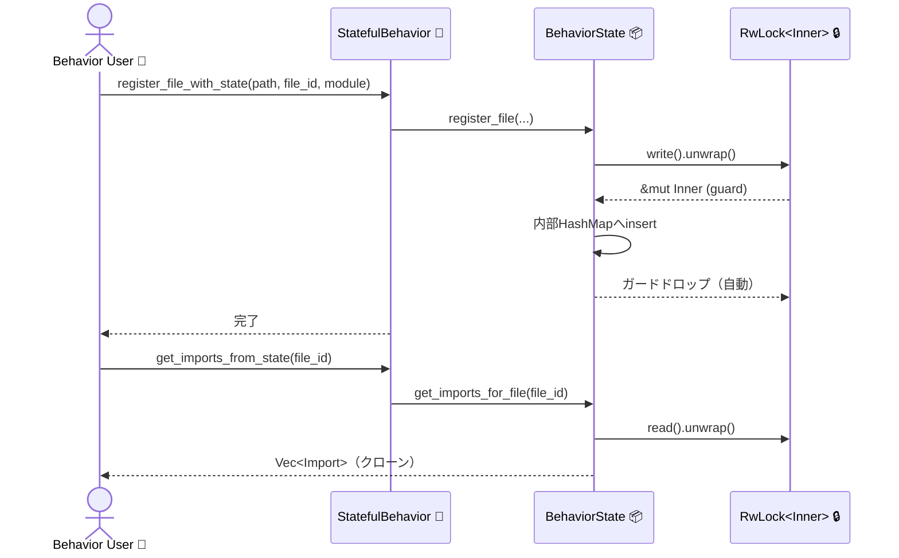
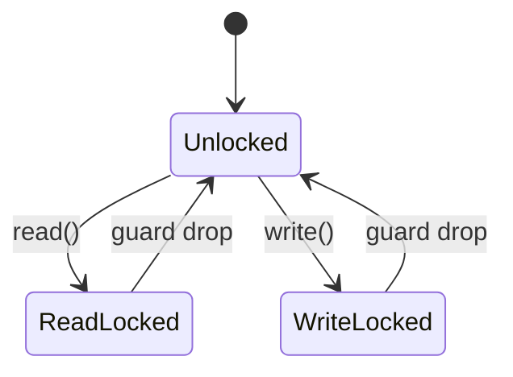

# behavior_state.rs Review

## TL;DR

- 目的: 言語ごとの**状態管理**（インポート、ファイル-モジュール対応、プロジェクトルート等）を**スレッド安全**に提供する。
- 主要公開API: BehaviorState の CRUD 系メソッド（register_file, add_import, get_imports_for_file 等）と、利用側向けの **StatefulBehavior** トレイト。
- 複雑箇所: **RwLock** による並行アクセス制御、`get_file_path` の O(n) ルックアップ、`unwrap()` による**ロック毒化時のパニック**。
- 重大リスク: ロック毒化に対するエラー処理不足、重複や競合登録時の一貫性検証なし、APIの返却値が全てクローンでコスト増大。
- 設計提案: `file_id_to_path` の追加で O(1) 参照化、`Result` ベースのロック取得、重複検知・整合性チェック、メトリクス/ログ追加。
- 並行性: 読み多/書き少で有利な設計（RwLock）が採用。重書き負荷では**同時更新競合**の待ち時間増大が懸念。
- テスト: 多スレッドでの登録/参照、毒化シナリオ、重複登録と整合性、クリア操作の直後参照等を網羅。

## Overview & Purpose

このモジュールは、言語別の振る舞い（パーサやインデクサ等）が使用する**状態コンテナ**を提供し、ファイルごとのインポート、モジュールパス、ファイルID、プロジェクトルートを**スレッド安全**に管理します。内部実装は `Arc<RwLock<BehaviorStateInner>>` を用い、読み取り並列性を確保しつつ、更新は排他で行います。

主な利用者は、各言語の「Behavior」実装（具体型）であり、`StatefulBehavior` トレイトのデフォルトメソッド経由で状態操作を簡略化できます。

## Structure & Key Components

| 種別 | 名前 | 公開範囲 | 責務 | 複雑度 |
|------|------|----------|------|--------|
| Struct | BehaviorState | pub | スレッド安全な状態コンテナ（Arc<RwLock<...>>のラッパ） | Med |
| Struct | BehaviorStateInner | private | 実データ保持（各種 HashMap キャッシュ） | Low |
| Trait | StatefulBehavior | pub | 状態操作の拡張（デフォルト実装の委譲） | Low |
| Function | BehaviorState::new | pub | 空状態の生成 | Low |
| Function | BehaviorState::register_file | pub | ファイル/モジュール/ID の相互マッピング登録 | Med |
| Function | BehaviorState::add_import | pub | インポートの追加 | Low |
| Function | BehaviorState::get_imports_for_file | pub | ファイルIDに紐づくインポート取得 | Low |
| Function | BehaviorState::get_module_path | pub | FileId→モジュールパス取得 | Low |
| Function | BehaviorState::resolve_module_to_file | pub | モジュールパス→ファイルパス解決 | Low |
| Function | BehaviorState::get_file_id | pub | ファイルパス→FileId 取得 | Low |
| Function | BehaviorState::get_file_path | pub | FileId→ファイルパス取得（線形探索） | Med |
| Function | BehaviorState::set_project_root | pub | FileId→プロジェクトルート設定 | Low |
| Function | BehaviorState::get_project_root | pub | FileId→プロジェクトルート取得 | Low |
| Function | BehaviorState::clear | pub | 状態の全クリア | Low |
| Function | StatefulBehavior::state | pub | 状態コンテナ参照を取得（実装側提供必須） | Low |
| Function | StatefulBehavior::register_file_with_state | pub | register_file に委譲 | Low |
| Function | StatefulBehavior::add_import_with_state | pub | add_import に委譲 | Low |
| Function | StatefulBehavior::get_imports_from_state | pub | get_imports_for_file に委譲 | Low |

### Dependencies & Interactions

- 内部依存
  - `StatefulBehavior` のデフォルトメソッドは `BehaviorState` の各メソッドに委譲。
  - `BehaviorState` の各メソッドは `inner: Arc<RwLock<BehaviorStateInner>>` を read/write ロックして HashMap を操作。

- 外部依存（標準/クレート）
  | 依存 | 用途 |
  |------|------|
  | std::sync::{Arc, RwLock} | スレッド安全な共有所有権と読み書きロック |
  | std::collections::HashMap | 各種インデックス/キャッシュ |
  | std::path::{Path, PathBuf} | ファイルパス管理 |
  | crate::FileId | ファイルIDの型（詳細不明） |
  | crate::parsing::Import | インポートの表現（詳細不明） |

- 被依存推定
  - 言語ごとのパーサ/インデクサ（例: Rust/C/JS のモジュール解決ロジック）がこのモジュールを利用し、解析中の**増分状態**を更新。
  - 上位の解析パイプライン/インデックス構築フェーズが**参照**（モジュール→ファイル解決、インポート列挙など）。

## API Surface (Public/Exported) and Data Contracts

| API名 | シグネチャ | 目的 | Time | Space |
|-------|-----------|------|------|-------|
| BehaviorState::new | `pub fn new() -> Self` | 空状態の生成 | O(1) | O(1) |
| BehaviorState::register_file | `pub fn register_file(&self, path: PathBuf, file_id: FileId, module_path: String)` | 各種相互マップ更新 | 平均O(1) | +O(1) |
| BehaviorState::add_import | `pub fn add_import(&self, import: Import)` | インポート追加 | 平均O(1) | +O(1) |
| BehaviorState::get_imports_for_file | `pub fn get_imports_for_file(&self, file_id: FileId) -> Vec<Import>` | ファイルIDのインポート取得 | O(k) | O(k) |
| BehaviorState::get_module_path | `pub fn get_module_path(&self, file_id: FileId) -> Option<String>` | FileId→モジュールパス | O(1) | O(1) |
| BehaviorState::resolve_module_to_file | `pub fn resolve_module_to_file(&self, module_path: &str) -> Option<PathBuf>` | モジュール→パス解決 | O(1) | O(1) |
| BehaviorState::get_file_id | `pub fn get_file_id(&self, path: &Path) -> Option<FileId>` | パス→FileId 取得 | O(1) | O(1) |
| BehaviorState::get_file_path | `pub fn get_file_path(&self, file_id: FileId) -> Option<PathBuf>` | FileId→パス取得（線形走査） | O(n) | O(1) |
| BehaviorState::set_project_root | `pub fn set_project_root(&self, file_id: FileId, project_root: PathBuf)` | ルート設定 | 平均O(1) | +O(1) |
| BehaviorState::get_project_root | `pub fn get_project_root(&self, file_id: FileId) -> Option<PathBuf>` | ルート取得 | O(1) | O(1) |
| BehaviorState::clear | `pub fn clear(&self)` | 全クリア | O(m) | -m |
| StatefulBehavior::state | `fn state(&self) -> &BehaviorState` | 状態参照取得（実装必須） | O(1) | O(1) |
| StatefulBehavior::register_file_with_state | `fn register_file_with_state(&self, path: PathBuf, file_id: FileId, module_path: String)` | 委譲 | 同上 | 同上 |
| StatefulBehavior::add_import_with_state | `fn add_import_with_state(&self, import: Import)` | 委譲 | 同上 | 同上 |
| StatefulBehavior::get_imports_from_state | `fn get_imports_from_state(&self, file_id: FileId) -> Vec<Import>` | 委譲 | 同上 | 同上 |

注:
- k は対象ファイルのインポート数、n は `path_to_file_id` の登録件数、m は全マップ合計件数。
- 行番号の明示はこのチャンクには現れない（関数名のみ根拠として記載）。

各API詳細:

1) BehaviorState::register_file
- 目的と責務
  - パス、FileId、モジュールパスの**双方向マッピング**を更新。後続の高速解決を可能にする。
- アルゴリズム
  1. write ロック取得（`RwLock::write().unwrap()`）
  2. `file_to_module[path] = module_path`
  3. `module_to_file[module_path] = path`
  4. `path_to_file_id[path] = file_id`
  5. `file_id_to_module[file_id] = module_path`
- 引数
  | 名 | 型 | 意味 |
  |----|----|------|
  | path | PathBuf | ファイルの絶対/相対パス |
  | file_id | FileId | システム内での一意ID |
  | module_path | String | 言語ごとのモジュールパス表現 |
- 戻り値
  | 型 | 説明 |
  |----|------|
  | () | なし |
- 使用例
  ```rust
  struct MyLang { state: BehaviorState }
  impl StatefulBehavior for MyLang {
      fn state(&self) -> &BehaviorState { &self.state }
  }
  let lang = MyLang { state: BehaviorState::new() };
  lang.register_file_with_state(PathBuf::from("src/lib.rs"), FileId(1), "crate::lib".to_string());
  ```
- エッジケース
  - 同じ `module_path` を別 `path` で再登録すると上書きされる（整合性崩壊の可能性）。
  - 同じ `path` を別 `file_id` で再登録すると上書きされる。

2) BehaviorState::add_import
- 目的と責務
  - ファイルIDに紐づくインポート列を追加管理。
- アルゴリズム
  1. write ロック取得
  2. `imports_by_file[file_id].push(import)`
- 引数
  | 名 | 型 | 意味 |
  |----|----|------|
  | import | Import | インポート情報（詳細不明） |
- 戻り値
  | 型 | 説明 |
  |----|------|
  | () | なし |
- 使用例
  ```rust
  let import = Import { /* フィールド不明 */ file_id: FileId(1) };
  lang.add_import_with_state(import);
  ```
- エッジケース
  - 重複インポートの蓄積（重複排除なし）。
  - `file_id` 未登録でも追加可能（孤立データの可能性）。

3) BehaviorState::get_imports_for_file
- 目的と責務
  - 指定ファイルIDのインポート一覧取得。返却はクローン。
- アルゴリズム
  1. read ロック取得
  2. `imports_by_file.get(&file_id).cloned().unwrap_or_default()`
- 引数/戻り値
  | 名 | 型 | 意味 |
  |----|----|------|
  | file_id | FileId | 対象ファイル |
  | 戻り値 | Vec<Import> | 既知のインポート一覧 |
- 使用例
  ```rust
  let imports = lang.get_imports_from_state(FileId(1));
  ```
- エッジケース
  - 未登録IDは空ベクタを返す。

4) BehaviorState::get_module_path / resolve_module_to_file / get_file_id / get_file_path
- 目的と責務
  - 双方向に近い形での解決関数群。`get_file_path` は線形探索。
- アルゴリズム
  - `get_module_path`: read ロック→`file_id_to_module.get(&file_id).cloned()`
  - `resolve_module_to_file`: read ロック→`module_to_file.get(module_path).cloned()`
  - `get_file_id`: read ロック→`path_to_file_id.get(path).copied()`
  - `get_file_path`: read ロック→`path_to_file_id` を走査して一致 ID のパスを返す
- 引数/戻り値（省略形）
  - すべて Option で返却。存在しなければ None。
- 使用例
  ```rust
  if let Some(path) = lang.state().resolve_module_to_file("crate::lib") {
      // path を利用
  }
  ```
- エッジケース
  - `get_file_path` は件数 n に比例。大規模プロジェクトでボトルネック。

5) BehaviorState::set_project_root / get_project_root / clear
- 目的と責務
  - ルートキャッシュ管理と全クリア。
- 使用例
  ```rust
  lang.state().set_project_root(FileId(1), PathBuf::from("/workspace"));
  let root = lang.state().get_project_root(FileId(1));
  lang.state().clear();
  ```

データ契約:
- FileId: 不明（このチャンクには現れない）。比較可能で HashMap キーとして利用可能であることが前提。
- Import: 不明（このチャンクには現れない）。`file_id` フィールドを持つことがコードから推測される。
- パス/モジュールパスは任意の文字列/PathBuf。正規化要件はこのチャンクには現れない。

## Walkthrough & Data Flow

全体フロー:
- 書き込み系（register_file, add_import, set_project_root, clear）は `RwLock::write()` により**単一スレッド**が占有。
- 読み取り系（get_*）は `RwLock::read()` により**複数スレッド並行**でアクセス可能。

主要な呼び出しシーケンス（利用者→トレイト→状態）:



上記の図は `register_file` と `get_imports_for_file` の呼び出し経路の主要ステップを示す（行番号:不明。このチャンクには行番号情報がない）。

ロック状態の遷移（概念的な状態機械）:



上記の図は `BehaviorState` 内の各メソッドにおける `RwLock` ガード取得/解放の状態遷移を示す（該当関数: 各 read/write ロック使用メソッド、行番号:不明）。

## Complexity & Performance

- 時間計算量
  - 登録/設定系（insert）は平均 O(1)。
  - 取得系はほぼ O(1) だが、`get_file_path` は O(n)（`path_to_file_id` 全走査）。
  - `get_imports_for_file` はリストのクローンで O(k)。
  - `clear` は各マップ全クリアで O(m)。

- 空間計算量
  - 各 insert は +O(1)、`imports_by_file` はファイルごとにインポート数に比例。
  - クリアで解放されるが、アロケータの挙動によっては即時解放しない可能性あり（一般的注意）。

- ボトルネック
  - `get_file_path` の線形探索。
  - 大量のインポートのクローンコスト（返却が `Vec<Import>` の所有権）。
  - ライトロック競合（大量登録/一括クリア時）。

- スケール限界
  - 数十万件のファイルID/インポートで `get_file_path` が顕著に遅くなる。
  - 書き込みが集中するフェーズ（インデキシング初回）でロック待ちが増える。

- 実運用負荷要因
  - I/O/ネットワーク/DBはこのモジュールには登場しない（計算内、メモリ主体）。
  - CPUキャッシュの観点では HashMap の散逸アクセスでミス率上昇。

## Edge Cases, Bugs, and Security

セキュリティチェックリスト評価:

- メモリ安全性
  - Buffer overflow / Use-after-free / Integer overflow: Rust安全機構により回避（unsafe未使用）。問題なし。
  - ただし `unwrap()` による**ロック毒化時のパニック**はプロセス健全性の観点でリスク。

- インジェクション
  - SQL/Command/Path traversal: 本モジュールはパス/文字列を保持するのみ。外部実行やファイル操作なし。直接的な脅威はなし。

- 認証・認可
  - 権限チェック/セッション: 対象外。このモジュールには現れない。

- 秘密情報
  - ハードコード秘密/ログ漏洩: 対象外。このモジュールには現れない。ログ出力も未実装。

- 並行性
  - Race condition: `RwLock` により保護。ネストロックなし。
  - Deadlock: 単一ロックのみで入れ子なし、現状リスクは低い。
  - ロック毒化: `write()/read()` の `unwrap()` により毒化時パニックの可能性。

具体的なエッジケース一覧:

| エッジケース | 入力例 | 期待動作 | 実装 | 状態 |
|-------------|--------|----------|------|------|
| モジュールパス競合 | 同一module_pathに別path | Err(Conflict) などで検知 | 上書き（検知なし） | 課題 |
| ファイルID競合 | 同一pathに別file_id | Err(Conflict) | 上書き（検知なし） | 課題 |
| 未登録ID参照 | 未登録file_idでget_imports | 空返却 | 空ベクタ返却 | OK |
| 大量インポート | kが非常に大 | 低コピー/イテレータ返却 | Vecのクローン | 課題 |
| FileId→Path解決 | nが非常に大 | O(1)で取得 | O(n)走査 | 課題 |
| ロック毒化 | 別スレッドでpanic後 | エラー返却/復旧 | unwrapでpanic | 課題 |
| クリア直後の参照 | clear後にget_* | None/空 | 期待通り | OK |
| 不正なパス | 無効なPathBuf | 格納拒否/正規化 | そのまま格納 | 注意 |

根拠（関数名:行番号）:
- `register_file`: 上書き挙動（insert）による競合未検知。行番号:不明（このチャンクには行番号情報がない）。
- `get_file_path`: `path_to_file_id` の反復走査。行番号:不明。
- `RwLock::write/read().unwrap()`: 毒化時にpanicの可能性。行番号:不明。

## Design & Architecture Suggestions

- 整合性強化
  - **競合検知**: `register_file` で既存値と異なる対応がある場合は `Result` で返すかログ警告。例: 異なる `path` に同一 `module_path` が割り当てられた場合。
  - **双方向完全マップ**: `file_id_to_path: HashMap<FileId, PathBuf>` を追加し、`get_file_path` を O(1) に。

- エラー設計
  - **ロック取得の結果化**: `unwrap()` をやめて、`Result<_, PoisonError<_>>` を利用して呼び出し側に伝播、あるいは回復戦略（`into_inner()`を検討）を導入。
  - APIの戻りに `Result` を導入（登録時のバリデーション/競合を報告）。

- パフォーマンス
  - インポート返却でクローンを避けたい場合、イテレータや `Arc<Vec<Import>>` の採用を検討（ただしライフタイムとロック期間に注意）。
  - 書き込み頻繁なワークロードでは **DashMap**（ロック分割）や**sharded lock**の検討。

- APIデザイン
  - `set_*` 系に「存在確認」や新規/更新の別メソッドを提供すると可読性/安全性向上。
  - パス/モジュールの正規化（ケース、区切り、拡張子）ポリシーを定義（現状は不明）。

- 並行性
  - 大規模プロジェクト向けに**read-mostly**特性を活かす設計は妥当だが、初期インデックス時の書き込み集中に備え**バッチ登録**APIを提供するのも有効。

## Testing Strategy (Unit/Integration) with Examples

推奨テスト項目:

- ユニットテスト
  1. 登録と取得の往復
     ```rust
     #[test]
     fn register_and_resolve_roundtrip() {
         let s = BehaviorState::new();
         let fid = FileId(1);
         let path = PathBuf::from("a/b.rs");
         s.register_file(path.clone(), fid, "crate::ab".to_string());

         assert_eq!(s.get_file_id(&path), Some(fid));
         assert_eq!(s.get_module_path(fid).as_deref(), Some("crate::ab"));
         assert_eq!(s.resolve_module_to_file("crate::ab"), Some(path));
     }
     ```
  2. インポートの蓄積と取得
     ```rust
     #[test]
     fn imports_accumulate() {
         let s = BehaviorState::new();
         let fid = FileId(2);
         s.add_import(Import { file_id: fid /* 他フィールド不明 */ });
         s.add_import(Import { file_id: fid /* 他フィールド不明 */ });
         let v = s.get_imports_for_file(fid);
         assert_eq!(v.len(), 2);
     }
     ```
  3. クリアの動作
     ```rust
     #[test]
     fn clear_resets_state() {
         let s = BehaviorState::new();
         let fid = FileId(3);
         let p = PathBuf::from("mod.rs");
         s.register_file(p.clone(), fid, "crate::mod".to_string());
         s.clear();
         assert!(s.get_file_id(&p).is_none());
         assert!(s.get_module_path(fid).is_none());
     }
     ```

- 並行性テスト（統合）
  - 多スレッドでの登録＋同時参照（整合性とパフォーマンス）
    ```rust
    use std::thread;
    #[test]
    fn concurrent_register_and_read() {
        let s = BehaviorState::new();
        let handles: Vec<_> = (0..100).map(|i| {
            let s = s.clone();
            thread::spawn(move || {
                let fid = FileId(i);
                let p = PathBuf::from(format!("f{i}.rs"));
                s.register_file(p.clone(), fid, format!("crate::{i}"));
                assert_eq!(s.get_file_id(&p), Some(fid));
            })
        }).collect();
        for h in handles { h.join().unwrap(); }
        // 読み取りも並行実行
        let s2 = s.clone();
        thread::spawn(move || {
            for i in 0..100 {
                assert!(s2.get_module_path(FileId(i)).is_some());
            }
        }).join().unwrap();
    }
    ```
  - ロック毒化シナリオ（故意panic→その後の `unwrap()` が panic することを確認）。注意: 実運用では回避推奨。

- エッジケース
  - 重複登録（同一キーに異なる値）→ 現状上書き。期待仕様の文書化/検証。
  - 大規模データ（n/k/m のスケール）で `get_file_path` の遅延を測定。

## Refactoring Plan & Best Practices

- 追加インデックス
  - `file_id_to_path: HashMap<FileId, PathBuf>` を追加し、`get_file_path` を O(1) に改善。`register_file` と `clear` で同期更新。

- エラー/結果設計
  - すべてのロック取得を `map_err` で `Result<_, PoisonError<_>>` に変換し、公開APIを `Result` 返却に。
  - 登録系で `Conflict` を表すエラー型（例: `enum RegisterError { Conflict, ... }`）を導入。

- 返却ポリシー
  - 大量データ返却（インポート）でのクローン削減策（`Arc<Vec<_>>` や `Cow` の検討）。ただしロック寿命と借用の設計に配慮。

- ログ/メトリクス
  - 競合、クリア、登録件数、ロック待ち時間などを計測し、運用監視へ。

- コードスタイル
  - `Default` 実装は `new` に委譲済みで良好。
  - コメントで「一貫性不変条件」（例: すべてのマップは同時に更新される）を明記。

## Observability (Logging, Metrics, Tracing)

- ログ
  - 登録時に競合検知（同一キーで異なる値）を**警告ログ**。
  - `clear` 実行を**infoログ**。
- メトリクス
  - マップサイズ（件数）、`get_*` ヒット/ミス率、インポート総数。
  - ロック待ち時間/取得回数（read/write）を**ヒストグラム**で収集。
- トレーシング
  - `register_file`/`add_import` にスパンを設け、バッチ処理時のボトルネック解析に活用。

このチャンクにはロギングやメトリクスのコードは現れないため、上記は提案ベース。

## Risks & Unknowns

- Import/FileId の詳細は不明（このチャンクには現れない）。`Send/Sync` 特性やサイズ、クローンコストが未知。
- モジュールパスの正規化・一意性ポリシーが不明。競合時の期待仕様が未定義。
- `RwLock` 毒化時のリカバリ戦略不在。現状 `unwrap()` によりプロセスが簡単にパニックし得る。
- 大規模プロジェクトで `get_file_path` がボトルネック化する可能性。
- `BehaviorState` が `Send/Sync` であることは型構成上ほぼ自明だが、厳密には `Import` 等の型特性に依存（このチャンクには現れない）。