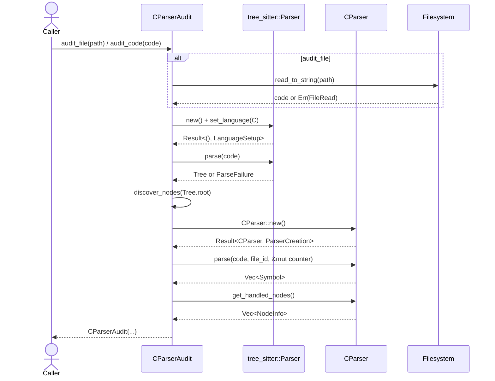
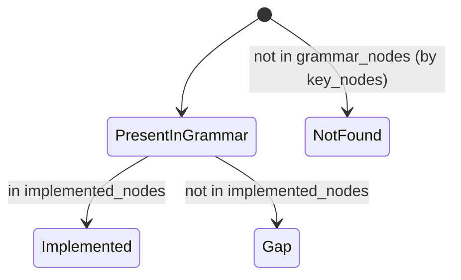

# audit.rs Review

## TL;DR

- 目的: tree-sitterで抽出できるC ASTノードと、社内Cパーサーが実際に処理したノード・抽出できたシンボルを比較し、カバレッジを可視化する監査ツール。
- 公開API: CParserAudit::{audit_file, audit_code, coverage_percentage, generate_report} とエラー型 AuditError。
- コアロジック: audit_codeでtree-sitterによるAST走査→CParserによる抽出→両者の差分集計→generate_reportでMarkdownレポート生成。
- 重大リスク: FileId::new(1).unwrap() によるpanic可能性、extracted_symbol_kindsがDebug表現に依存し不安定、未使用import NodeTracker、HashMapの非決定順序によるレポートの非安定性。
- 安全性: unsafe無しでメモリ安全。I/Oエラーと言語設定エラーはthiserrorで網羅。並行性要素はなし。
- 複雑箇所: generate_reportでの状態分類（implemented/gap/not found）の整合とキー集合の維持、AST全走査の再帰（深いASTでのスタック消費）。
- 運用視点: 入力ソースのサイズに比例した計算。I/Oと2回のパース（tree-sitterと社内CParser）がボトルネック。

## Overview & Purpose

本モジュールはCコードに対するパーサーの実装カバレッジを定量化するための監査機能を提供する。tree-sitter-cで得られるAST（ファイル中で実際に現れたノード種別）を列挙し、同時に社内のCParserが処理済みと記録しているノード種別および抽出できたシンボル種別を集計する。結果はカバレッジ率（実装済みノード/観測ノード）やギャップ一覧、推奨アクションを含むMarkdownレポートとして出力できる。

用途:
- 実装ギャップの発見（grammarに存在するが未処理のノード）。
- 回帰監査（新しいC構文やpreprocノードの見逃し検知）。
- シンボル抽出の網羅状況把握。

## Structure & Key Components

| 種別 | 名前 | 公開範囲 | 責務 | 複雑度 |
|------|------|----------|------|--------|
| Enum | AuditError | pub | 監査処理で発生するI/O/言語設定/パース/パーサ生成エラーの表現 | Low |
| Struct | CParserAudit | pub | 監査結果の保持（grammar_nodes, implemented_nodes, extracted_symbol_kinds）と監査実行/レポート生成 | Med |
| Function | CParserAudit::audit_file | pub | ファイルパスからソース読み込み→監査実行 | Low |
| Function | CParserAudit::audit_code | pub | ソース文字列に対する監査本体（tree-sitter解析とCParser解析） | Med |
| Function | CParserAudit::coverage_percentage | pub | 実装済みノード/観測ノードの割合計算 | Low |
| Function | CParserAudit::generate_report | pub | 監査結果からMarkdownレポート構築 | Med |
| Function | discover_nodes | private | ASTを再帰走査しノード種別名→kind_idのレジストリを作成 | Low |

### Dependencies & Interactions

- 内部依存
  - super::CParser: 監査対象の社内Cパーサー。new(), parse(), get_handled_nodes() を利用。
  - crate::io::format::format_utc_timestamp: レポートの生成時刻埋め込み。
  - crate::types::FileId: CParser.parseに渡すファイル識別子。FileId::new(1).unwrap() を使用（panicリスク）。
  - crate::types::SymbolCounter: CParser.parseの副作用カウンター。ここでは未使用のまま渡す。
  - crate::parsing::NodeTracker: インポートされているが本ファイルでは未使用（保守上の警告対象）。

- 外部依存

| クレート/モジュール | 用途 |
|---------------------|------|
| thiserror::Error | AuditErrorのderiveとエラーメッセージ定義 |
| tree_sitter::Parser | ソースコードからAST構築 |
| tree_sitter_c::LANGUAGE | C言語のtree-sitter言語定義 |
| std::fs, std::collections | ファイル読み込み、HashMap/HashSet |

- 被依存推定
  - CLI/開発ツールやCIジョブでのカバレッジ監査コマンド。
  - 回帰テストでの統計収集。
  - ドキュメント生成パイプラインの一部としてのレポート出力。
  - 具体的な呼び出し元は不明（このチャンクには現れない）。

## API Surface (Public/Exported) and Data Contracts

| API名 | シグネチャ | 目的 | Time | Space |
|-------|------------|------|------|-------|
| CParserAudit::audit_file | fn audit_file(file_path: &str) -> Result<CParserAudit, AuditError> | ファイルパスから監査を実行 | O(L + A + S) | O(U + K) |
| CParserAudit::audit_code | fn audit_code(code: &str) -> Result<CParserAudit, AuditError> | ソース文字列から監査を実行 | O(L + A + S) | O(U + K) |
| CParserAudit::coverage_percentage | fn coverage_percentage(&self) -> f64 | 実装済みノード割合の算出 | O(1) | O(1) |
| CParserAudit::generate_report | fn generate_report(&self) -> String | Markdownレポートの生成 | O(K + G) | O(R) |
| 型: AuditError | enum AuditError | エラー種別の表現 | - | - |
| 型: CParserAudit | struct CParserAudit { grammar_nodes, implemented_nodes, extracted_symbol_kinds } | 監査結果のデータ契約 | - | - |

Timeの記号説明:
- L: ソース文字列長（tree-sitterの字句・構文解析）
- A: ASTノード数（discover_nodesの走査）
- S: CParserによるシンボル抽出処理コスト
- U: ユニークなノード種別数
- K: key_nodesの長さ（generate_reportの分類）
- G: grammar_nodesの出力分（現実装ではkey_nodesのみ）
- R: 生成されるレポート文字列サイズ

データ契約:
- CParserAudit.grammar_nodes: HashMap<String, u16>。キーはノード種別名、値はtree-sitterのkind_id。件数は「ファイルに現れたユニーク種別」の数。
- CParserAudit.implemented_nodes: HashSet<String>。CParserが「処理済み」と自己申告したノード種別名。
- CParserAudit.extracted_symbol_kinds: HashSet<String>。抽出シンボルのkindのDebug文字列表現。安定APIではない点に注意。

以下、各API詳細。

### CParserAudit::audit_file

1) 目的と責務
- ファイルパスからUTF-8文字列としてソースを読み込み、audit_codeに委譲。

2) アルゴリズム
- std::fs::read_to_string(file_path)で読み込み。
- 読み込みエラーはAuditError::FileReadで伝播。
- audit_code(&code)を呼び出し、結果を返す。

3) 引数

| 名前 | 型 | 必須 | 説明 |
|-----|----|------|------|
| file_path | &str | 必須 | 監査対象Cファイルのパス |

4) 戻り値

| 型 | 説明 |
|----|------|
| Result<CParserAudit, AuditError> | 監査結果またはエラー |

5) 使用例
```rust
let audit = CParserAudit::audit_file("tests/fixtures/sample.c")?;
println!("Coverage: {:.2}%", audit.coverage_percentage());
println!("{}", audit.generate_report());
```

6) エッジケース
- 空ファイル: 解析は成功するが、grammar_nodesが少ない/ゼロになり得る。
- 非UTF-8: read_to_stringがErr、AuditError::FileReadに変換。
- パス不存在/権限なし: AuditError::FileRead。

（根拠: audit_file:行番号 不明）

### CParserAudit::audit_code

1) 目的と責務
- Cソース文字列を入力に、AST種別の観測、CParserの処理種別、抽出シンボル種別を取得し、CParserAuditを構築。

2) アルゴリズム（ステップ）
- tree_sitter::Parserを生成。
- C言語をセット（失敗時AuditError::LanguageSetup）。
- codeをパース（Noneの場合AuditError::ParseFailure）。
- discover_nodesでAST全体を走査し、grammar_nodesを構築。
- CParser::new（失敗時AuditError::ParserCreation）。
- SymbolCounterを作成（ここでは副作用用）。
- FileId::new(1).unwrap()でファイルID作成（panicリスク）。
- c_parser.parse(code, file_id, &mut symbol_counter)でシンボル抽出。
- 抽出シンボルのkindをDebug文字列化し、extracted_symbol_kindsに格納。
- c_parser.get_handled_nodes()から実装済みノード名を収集し、implemented_nodesに格納。
- CParserAuditを返却。

3) 引数

| 名前 | 型 | 必須 | 説明 |
|-----|----|------|------|
| code | &str | 必須 | Cソース文字列（UTF-8） |

4) 戻り値

| 型 | 説明 |
|----|------|
| Result<CParserAudit, AuditError> | 監査結果またはエラー |

5) 使用例
```rust
let code = r#"
typedef int i32;
int add(int a, int b) { return a + b; }
"#;
let audit = CParserAudit::audit_code(code)?;
assert!(audit.grammar_nodes.contains_key("function_definition"));
```

6) エッジケース
- 空文字列: tree-sitterは空のtranslation_unitを返す可能性あり。coverage_percentageは0またはNaN回避済み（0.0返却）。
- シンタックスエラー: tree-sitterはエラーノードを含むASTを返すため、基本的にParseFailureにはならない。
- 言語設定失敗: set_languageの失敗時にAuditError::LanguageSetup。
- FileId::new(1).unwrap(): newが失敗する仕様ならpanic。エラー伝播に置換すべき。

（根拠: audit_code, discover_nodes:行番号 不明）

### CParserAudit::coverage_percentage

1) 目的と責務
- 実装済みノード数 / 観測ノード数 を百分率で返す。

2) アルゴリズム
- grammar_nodesが空なら0.0。
- len(implemented_nodes) / len(grammar_nodes) * 100.0。

3) 引数: なし（&self）

4) 戻り値

| 型 | 説明 |
|----|------|
| f64 | カバレッジ率（0.0〜100.0） |

5) 使用例
```rust
let pct = audit.coverage_percentage();
println!("{pct:.1}%");
```

6) エッジケース
- grammar_nodes空: 0.0返却（NaN回避）。
- 実装が0件: 0.0%。

（根拠: coverage_percentage:行番号 不明）

### CParserAudit::generate_report

1) 目的と責務
- Markdownのカバレッジレポートを生成。要約、カバレッジ表（key_nodesに対するimplemented/gap/not found）、凡例、推奨アクションを含む。

2) アルゴリズム
- ヘッダとタイムスタンプ挿入。
- Summary: grammar_nodes/implemented_nodes/extracted_symbol_kinds の件数。
- Coverage Table: 固定のkey_nodes配列を走査し、
  - grammar_nodesに存在し、implemented_nodesに存在 → implemented
  - grammar_nodesに存在し、implemented_nodesに不存在 → gap
  - grammar_nodesに不存在 → not found
- Legend, Recommended Actionsを追記。gaps/missingの有無に応じてメッセージ分岐。

3) 引数: なし（&self）

4) 戻り値

| 型 | 説明 |
|----|------|
| String | Markdownテキスト |

5) 使用例
```rust
let md = audit.generate_report();
assert!(md.contains("# C Parser Coverage Report"));
println!("{md}");
```

6) エッジケース
- grammar_nodesが空: Summaryの件数は0。Coverage Tableはkey_nodesに基づき「not found」が多くなる。
- implemented_nodesが空: 多くが「gap」になる。
- extracted_symbol_kindsが空: Summaryの件数は0。

（根拠: generate_report:行番号 不明）

### AuditError

- FileRead(std::io::Error)
- LanguageSetup(String)
- ParseFailure
- ParserCreation(String)

この列挙型はthiserrorでメッセージ定義済み。外部エラーからの変換はFileReadに対して#[from]で自動。

（根拠: AuditError:行番号 不明）

## Walkthrough & Data Flow

- audit_file
  - ファイルを読み込み、audit_codeへ委譲。
- audit_code
  - tree-sitter Parserを作成・言語設定→AST構築。
  - discover_nodesでAST全走査し、ノード種別名とkind_idを収集。
  - CParserを初期化し、parseで抽出シンボル一覧を取得。
  - extracted_symbol_kindsとimplemented_nodesを構築。
  - CParserAuditにまとめて返却。
- generate_report
  - 固定のkey_nodesに対して、grammar_nodesおよびimplemented_nodesとの集合演算で分類しMarkdown出力。

Mermaidシーケンス図（監査の全体フロー）

上記の図はaudit_code関数とaudit_file関数の主要フロー（行番号: 不明）を示す。

Mermaid状態図（generate_reportのノード分類）

上記の図はgenerate_report関数の主要な分類ロジック（行番号: 不明）を示す。

該当コード抜粋（分類部分）
```rust
let status = if let Some(id) = self.grammar_nodes.get(node_name) {
    if self.implemented_nodes.contains(node_name) {
        format!("{id} | ✅ implemented")
    } else {
        gaps.push(node_name);
        format!("{id} | ⚠️ gap")
    }
} else {
    missing.push(node_name);
    "- | ❌ not found".to_string()
};
```

## Complexity & Performance

- audit_file
  - 時間: O(L) ただし実際はaudit_codeのコストが支配的
  - 空間: O(L)（コード文字列）

- audit_code
  - 時間: O(L + A + S)
    - tree-sitterパース: おおむねO(L)
    - discover_nodes: ASTノード数Aに線形
    - CParser.parse: 実装に依存（概ね入力サイズに線形）
  - 空間: O(U + K)
    - grammar_nodes: ユニーク種別数U
    - extracted_symbol_kinds/implemented_nodes: 種別数に比例
    - レポート生成用一時文字列

- generate_report
  - 時間: O(K)（key_nodesの走査）
  - 空間: O(R)（生成文字列）

ボトルネックとスケール限界:
- 2回の構文解析（tree-sitterとCParser）が累積コスト。大規模ソースではCPU時間が支配的。
- 深いASTに対する再帰discover_nodesはスタック消費（Cコードは通常実用範囲）。
- HashMap/HashSetは順序非決定でありレポートの並び安定性に欠ける（CI差分に影響）。

I/O/ネットワーク/DB:
- I/Oはaudit_fileでの単一ファイル読み込みのみ。ネットワーク/DBは不使用。

## Edge Cases, Bugs, and Security

セキュリティチェックリスト観点での評価:

- メモリ安全性
  - unsafe未使用。所有権/借用はローカルなスコープ内に限定。再帰は安全だが極端に深いASTでスタック使用増加。
- インジェクション
  - SQL/Command/Path traversalなし。file_pathは読み込みにのみ使用し、外部コマンド等は呼ばない。
- 認証・認可
  - 不要。ローカルファイルアクセスのみ。
- 秘密情報
  - ハードコードされた秘密は無し。レポートは時刻と解析統計のみを出力。
- 並行性
  - マルチスレッドなし。tree-sitter::Parserはスレッド境界越えで共有されない設計が一般的だが本コードでは単一スレッド使用。

バグ/設計上の懸念:
- unwrapによるpanic
  - FileId::new(1).unwrap() は失敗時にpanic（audit_code:行番号 不明）。エラーパスに統一するべき。
- 未使用import
  - use crate::parsing::NodeTracker; が未使用（このチャンクのみの判断）。クリーンアップ推奨。
- extracted_symbol_kindsの不安定性
  - format!("{:?}", symbol.kind) はDebug表現依存で将来的変更に脆弱。安定IDやDisplay/ToStringの安定化が望ましい。
- カバレッジの定義
  - grammar_nodesは「ファイルに現れた種別」であり「文法全体」ではない。ファイルに依存したカバレッジである点の明確化が必要。
- 非決定順序
  - HashMap/HashSetの列挙順は非決定。レポートはkey_nodesの順序に依存しているため大勢に影響はないが、他の箇所で順序に依存した比較をしないよう注意。
- エラーメッセージの情報量
  - LanguageSetup/ParserCreationでto_string()を使い詳細が失われる可能性。元エラー型の情報を保持できるよう改善余地。

エッジケース詳細表:

| エッジケース | 入力例 | 期待動作 | 実装 | 状態 |
|-------------|--------|----------|------|------|
| 空文字列 | "" | 解析成功、coverage 0.0、レポート生成可 | audit_codeはparse→Tree、coverage_percentageは0.0 | OK |
| 非UTF-8ファイル | バイナリ | FileReadエラーで返却 | audit_fileで#[from]により変換 | OK |
| 言語設定失敗 | 異常LANGUAGE | LanguageSetupエラー | set_languageでmap_err | OK |
| tree-sitter parse失敗 | 非常に長い入力等 | ParseFailure | parser.parseのNoneでErr | OK |
| FileId生成失敗 | FileId::new(1)==None | panic回避しErrにすべき | unwrap使用 | 要修正 |
| 抽出シンボル0件 | 宣言のみ等 | extracted_symbol_kindsは空、レポートに0件表示 | 実装通り | OK |
| 深いネストのAST | 巨大マクロ等 | discover_nodes再帰でスタック増 | 再帰実装 | 注意 |

## Design & Architecture Suggestions

- エラー伝播の一貫性
  - FileId::new(1).unwrap()を廃止し、失敗時はAuditErrorに新Variant（例: FileIdCreation）を追加して伝播、またはResultに変換。
  - CParser::parseが失敗し得るならResultを返し、監査側でもエラーを表現する。

- 安定したシンボル種別表現
  - extracted_symbol_kindsはDebug出力ではなく、安定した列挙名や文字列（Display実装）を用いる。あるいはSymbolKindにto_static_str()のような関数を用意。

- 出力の安定性
  - レポート内で順序が意味を持つ箇所はBTreeSet/BTreeMapやsortを使用して決定的な並びにする。

- 構成可能なkey_nodes
  - key_nodesをconstまたは設定引数で外部から差し替え可能にし、言語拡張や方針変更に対応しやすくする。

- 統計の拡充
  - grammar_nodesの値をkind_idだけでなく「出現回数」にして重み付きカバレッジ（出現頻度で重み付け）を出せるようにする。
  - implemented_nodesとの差集合を列挙して未実装の具体的ノードを一覧化。

- APIのカプセル化
  - CParserAuditのフィールドをpubから非公開にし、getterを提供して不変条件を守る（将来の内部表現変更に強くなる）。

- 未使用import削除
  - crate::parsing::NodeTracker の未使用なら削除。

## Testing Strategy (Unit/Integration) with Examples

ユニットテスト（audit_code/generate_reportの基本動作）:
```rust
#[test]
fn audit_on_simple_code() {
    let code = r#"
        typedef int i32;
        int add(int a, int b) { return a + b; }
    "#;
    let audit = CParserAudit::audit_code(code).expect("audit ok");
    assert!(audit.grammar_nodes.contains_key("function_definition"));
    assert!(audit.extracted_symbol_kinds.len() >= 0);
    let rep = audit.generate_report();
    assert!(rep.contains("# C Parser Coverage Report"));
    assert!(rep.contains("Summary"));
}

#[test]
fn coverage_percentage_bounds() {
    // 最小ケース: grammar_nodesが空の時は0.0
    let audit = CParserAudit {
        grammar_nodes: std::collections::HashMap::new(),
        implemented_nodes: std::collections::HashSet::new(),
        extracted_symbol_kinds: std::collections::HashSet::new(),
    };
    assert_eq!(audit.coverage_percentage(), 0.0);
}
```

ファイルI/Oエラーの伝播（integration）:
```rust
#[test]
fn audit_file_not_found() {
    let err = CParserAudit::audit_file("no/such/file.c").unwrap_err();
    match err {
        AuditError::FileRead(_) => {}
        _ => panic!("expected FileRead"),
    }
}
```

エッジ構文（プリプロセス、列挙、構造体等）:
```rust
#[test]
fn audit_cover_key_nodes() {
    let code = r#"
        #define X 1
        #include <stdio.h>
        typedef struct { int x; } S;
        enum E { A, B };
        int main(void) { if (X) { return 0; } else { return 1; } }
    "#;
    let audit = CParserAudit::audit_code(code).unwrap();
    // 最低限、表に現れるいくつかのノードが観測される
    assert!(audit.grammar_nodes.contains_key("function_definition"));
    assert!(audit.grammar_nodes.contains_key("if_statement"));
}
```

プロパティテスト（順序の非依存性）
- generate_reportの出力がkey_nodesの並びに依存することを前提に、grammar_nodesの挿入順をランダム化してもレポートの要点が不変であることを確認。

回帰テスト
- リポジトリ内の「包括的サンプル」Cファイルに対するレポートをスナップショットテスト（順序の揺らぎを避けるため正規化や並び替えを行う）。

## Refactoring Plan & Best Practices

- panic排除
  - FileId::new(1).unwrap()を次のように置換:
```rust
let file_id = FileId::new(1).ok_or_else(|| AuditError::ParserCreation("invalid FileId".into()))?;
```
  - あるいは専用エラーVariantを追加。

- 安定表示の導入
  - extracted_symbol_kinds: SymbolKindにDisplayを実装または明示的なto_str()を導入し、Debug依存を解消。

- 出力順の決定化
  - レポートの表を生成する前にgaps/missing等のリストをsort()。

- 未使用import削除
```rust
// use crate::parsing::NodeTracker; // 未使用なら削除
```

- discover_nodesの迭代実装（必要なら）
  - 極端に深いASTへの対処として手続き的スタックまたはBFSに変更（現実問題としては優先度低）。

- APIカプセル化
  - CParserAuditのフィールドを非公開にし、必要なgetterのみ提供（将来の互換性維持）。

- key_nodesの外部化
  - const KEY_NODES: &[&str] を定義し、設定から上書き可能に。

## Observability (Logging, Metrics, Tracing)

- ログ
  - 監査開始/終了、解析対象サイズ、ASTノード数、抽出シンボル数、ギャップ数をinfoで出力。
  - エラー時にどのステップで失敗したか（言語設定/parse/CParser生成/parse）をwarn/errorで記録。

- メトリクス
  - coverage_percentageをゲージで記録。
  - grammar_nodes.len(), implemented_nodes.len(), extracted_symbol_kinds.len()をメトリクスに。
  - ギャップ（gap）の件数を重要指標として監視。

- トレーシング
  - audit_codeの主要ステップをspan化（parse_ts, discover_nodes, parse_cparser, collect_kinds）。
  - シンボル件数やASTノード数をspanの属性に。

## Risks & Unknowns

- CParserの詳細不明
  - get_handled_nodesの整合性・網羅性やparseの失敗挙動は不明（このチャンクには現れない）。導出されるimplemented_nodesの信頼度に影響。
- SymbolCounterの役割
  - 現状未使用（外部でのカウントや統計が必要かは不明）。
- tree-sitter-cのバージョン差異
  - kind_idやノード名の変更が将来あり得る。レポート/比較の互換性に影響。
- 監査対象の「文法全体」 vs 「ファイルに現れた種別」
  - 本実装は後者であり、一般的なカバレッジ（文法網羅）と認識されると誤解が生じる可能性。複数ファイル/サンプル群での集計が望ましい。
- 行番号
  - このチャンクには行番号情報がないため、精緻な参照は不明と記載。

## Walkthrough & Data Flow（コード抜粋）

discover_nodesの全体（短いので全文）
```rust
fn discover_nodes(node: tree_sitter::Node, registry: &mut HashMap<String, u16>) {
    registry.insert(node.kind().to_string(), node.kind_id());

    let mut cursor = node.walk();
    for child in node.children(&mut cursor) {
        discover_nodes(child, registry);
    }
}
```

この処理はAST全ノードを一度ずつ訪問し、種別名→kind_idを登録する。既存キーに再挿入して上書きされても値は同じ（kind_idのため）であり、HashMapはユニーク種別集合として機能する。