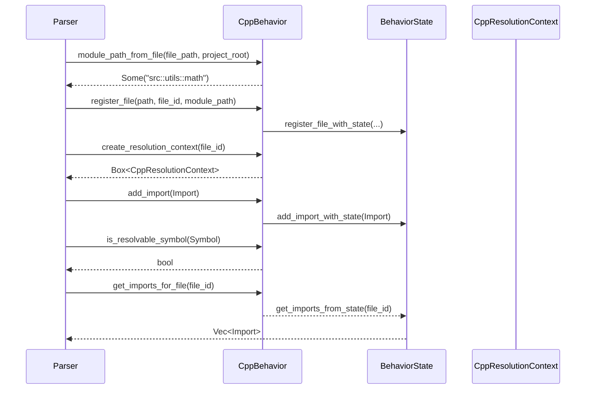

# parsing\cpp\behavior.rs Review

## TL;DR

- 目的: C++向けの言語振る舞い（LanguageBehavior）を実装し、モジュールパス整形・可視性解析・継承/関係マッピング・ファイル/インポート登録・解決コンテキスト生成などを提供する。
- 公開API: **CppBehavior::new**（構築子）と、**LanguageBehavior**/**StatefulBehavior**の各メソッド群（トレイト実装として利用されるインターフェース）。
- 複雑箇所: **is_resolvable_symbol**の分岐ロジック（scope_contextとkind/visibilityの併用）、**module_path_from_file**のパス→モジュール変換（拡張子除去・区切り変換）。
- 重大リスク: Windowsパス区切りに非対応（'/'のみ置換）、**parse_visibility**の文字列探索の簡易性、関係マッピングで"inherits"→Implementsの不整合、C++の呼び出し表記を'.'固定にしている点。
- Rust安全性: unsafeなし、所有権問題なし。内部状態（BehaviorState）更新は&self経由のため、内部可変性の同期機構が前提（詳細はこのチャンクに現れない）。
- エラー設計: Option/Bool中心で詳細なエラー型なし。失敗理由の可観測性が低い（例: module_path_from_fileのNoneなど）。
- 並行性: **BehaviorState**の実装に依存（このチャンクには現れない）。並行アクセス時の競合/ロック戦略は不明。

## Overview & Purpose

このファイルは、C++専用の言語振る舞いを提供する**CppBehavior**構造体と、それに対する**LanguageBehavior**および**StatefulBehavior**トレイトの実装で構成される。役割は以下。

- Tree-sitterのC++言語オブジェクトを保持・提供。
- モジュールパス（ファイルパス→"::"区切り）生成、メソッド呼び出し表記、可視性判定（public/protected/private）などC++文脈の規則を実装。
- 記号（Symbol）解決のための解決コンテキスト（CppResolutionContext）と継承解決器（GenericInheritanceResolver）を生成。
- ファイル登録やインポート管理を**BehaviorState**に委譲する呼び出しを提供（StatefulBehaviorのヘルパー使用）。
- 言語固有の関係文字列→汎用RelationKindへのマッピング。

このモジュールは、解析パイプライン中でC++ソースを扱う際の動作方針を確立し、他コンポーネント（解決器、状態管理、関係モデル）との橋渡しを行う。

## Structure & Key Components

| 種別 | 名前 | 公開範囲 | 責務 | 複雑度 |
|------|------|----------|------|--------|
| Struct | CppBehavior | pub | C++言語振る舞いの実体。Tree-sitter言語と状態を保持。 | Med |
| Impl | StatefulBehavior for CppBehavior | 非公開（トレイト実装） | 内部状態（BehaviorState）へのアクセス（state()）。ヘルパー利用の前提を提供。 | Low |
| Impl | LanguageBehavior for CppBehavior | 非公開（トレイト実装） | モジュールパス整形、可視性解析、呼び出し表記、関係マッピング、記号可視性/解決可能性判定、ファイル/インポート登録等。 | Med |
| Struct | BehaviorState | 不明（このチャンクには現れない） | ファイル/モジュール/インポートの状態管理（内部可変性が想定）。 | Med |
| Struct | CppResolutionContext | 非公開（別モジュール） | 記号解決のためのC++専用コンテキスト。 | Med |
| Struct | GenericInheritanceResolver | 非公開（別モジュール） | 一般的な継承解決ロジックの提供。 | Low |

### Dependencies & Interactions

- 内部依存
  - CppBehavior → BehaviorState（state()経由でregister_file_with_state, add_import_with_state, get_imports_from_state, get_module_path）
  - CppBehavior → CppResolutionContext（create_resolution_context）
  - CppBehavior → GenericInheritanceResolver（create_inheritance_resolver）
  - CppBehavior → tree_sitter_cpp::LANGUAGE（get_language）

- 外部依存（推奨表）

| 依存 | 用途 |
|------|------|
| tree_sitter::Language | Tree-sitter言語ハンドル |
| tree_sitter_cpp::LANGUAGE | C++のTree-sitter言語定義 |
| crate::parsing::behavior_state::{BehaviorState, StatefulBehavior} | 状態管理とヘルパー |
| crate::parsing::{LanguageBehavior, ResolutionScope} | 言語振る舞いトレイトと解決スコープ |
| crate::parsing::resolution::{CppResolutionContext, GenericInheritanceResolver} | C++の解決コンテキスト/継承解決器 |
| crate::{FileId, Visibility} | ファイルID/可視性の表現 |
| crate::Symbol, crate::SymbolKind, crate::symbol::ScopeContext | 記号の種別とスコープ文脈 |
| crate::relationship::RelationKind | 関係種別（Implements, Uses, Calls等） |

- 被依存推定
  - C++解析パイプライン（パーサ、シンボル抽出器、関係グラフ構築器）
  - 解決器（名前解決/参照解決）
  - 可視性/アクセス制御の評価モジュール
  - グラフ出力/ドキュメント化ツール

## API Surface (Public/Exported) and Data Contracts

公開（exports=2）:
- Struct: CppBehavior
- Function: CppBehavior::new()

加えて、LanguageBehavior/StatefulBehaviorのトレイトメソッドは、CppBehaviorをLanguageBehaviorとして利用する際の外部インターフェースとなる。

| API名 | シグネチャ | 目的 | Time | Space |
|-------|-----------|------|------|-------|
| CppBehavior::new | pub fn new() -> Self | C++振る舞いインスタンスの生成 | O(1) | O(1) |
| state | fn state(&self) -> &BehaviorState | 状態への参照提供（StatefulBehavior） | O(1) | O(1) |
| format_module_path | fn format_module_path(&self, base_path: &str, symbol_name: &str) -> String | "base::symbol"形式へ整形 | O(n) | O(n) |
| parse_visibility | fn parse_visibility(&self, signature: &str) -> Visibility | C++の可視性を文字列から推定 | O(n) | O(1) |
| module_separator | fn module_separator(&self) -> &'static str | モジュール区切り文字列提供（"::"） | O(1) | O(1) |
| supports_traits | fn supports_traits(&self) -> bool | トレイト相当機能のサポート有無 | O(1) | O(1) |
| supports_inherent_methods | fn supports_inherent_methods(&self) -> bool | 固有メソッドのサポート有無 | O(1) | O(1) |
| get_language | fn get_language(&self) -> Language | Tree-sitter言語ハンドル取得 | O(1) | O(1) |
| module_path_from_file | fn module_path_from_file(&self, file_path: &Path, project_root: &Path) -> Option<String> | ファイル→モジュールパス変換 | O(L) | O(L) |
| create_resolution_context | fn create_resolution_context(&self, file_id: FileId) -> Box<dyn ResolutionScope> | C++解決コンテキスト生成 | O(1) | O(1) |
| create_inheritance_resolver | fn create_inheritance_resolver(&self) -> Box<dyn crate::parsing::InheritanceResolver> | 継承解決器生成 | O(1) | O(1) |
| is_resolvable_symbol | fn is_resolvable_symbol(&self, symbol: &crate::Symbol) -> bool | 記号が解決対象か判定 | O(1) | O(1) |
| format_method_call | fn format_method_call(&self, receiver: &str, method: &str) -> String | メソッド呼び出し表記生成 | O(n) | O(n) |
| inheritance_relation_name | fn inheritance_relation_name(&self) -> &'static str | 継承関係の言語名（"inherits"） | O(1) | O(1) |
| map_relationship | fn map_relationship(&self, language_specific: &str) -> crate::relationship::RelationKind | 言語固有関係→汎用関係種別 | O(1) | O(1) |
| register_file | fn register_file(&self, path: PathBuf, file_id: FileId, module_path: String) | ファイル登録（State経由） | O(1) | O(1) |
| add_import | fn add_import(&self, import: crate::parsing::Import) | インポート登録（State経由） | O(1) | O(1) |
| get_imports_for_file | fn get_imports_for_file(&self, file_id: FileId) -> Vec<crate::parsing::Import> | ファイルのインポート取得 | O(k) | O(k) |
| is_symbol_visible_from_file | fn is_symbol_visible_from_file(&self, symbol: &crate::Symbol, from_file: FileId) -> bool | 他ファイルから見えるか判定 | O(1) | O(1) |
| get_module_path_for_file | fn get_module_path_for_file(&self, file_id: FileId) -> Option<String> | Stateからモジュールパス取得 | O(1) | O(1) |
| import_matches_symbol | fn import_matches_symbol(&self, import_path: &str, symbol_module_path: &str, _importing_module: Option<&str>) -> bool | インポートと記号の一致判定 | O(n) | O(1) |

各APIの詳細説明（抜粋。行番号はこのチャンクに含まれないため「行番号不明」）:

1) CppBehavior::new
- 目的と責務: Tree-sitter C++言語ハンドルと新規BehaviorStateを初期化。
- アルゴリズム: tree_sitter_cpp::LANGUAGE.into()でLanguage生成、BehaviorState::new()をセット。
- 引数: なし
- 戻り値: CppBehavior（新規インスタンス）
- 使用例:
  ```rust
  let cpp = CppBehavior::new();
  ```
- エッジケース:
  - なし（panicやエラーなし）

2) state(&self) -> &BehaviorState
- 目的と責務: StatefulBehaviorの契約に従って内部状態参照を返す。
- アルゴリズム: フィールド参照返却。
- 引数/戻り値: 省略（明白）
- 使用例:
  ```rust
  let st = cpp.state();
  ```
- エッジケース:
  - なし

3) format_module_path
- 目的: ベースパスとシンボル名を"base::symbol"で結合。
- ステップ:
  - format!("{base_path}::{symbol_name}")
- 引数:
  | 名 | 型 | 説明 |
  |----|----|------|
  | base_path | &str | モジュール基底 |
  | symbol_name | &str | シンボル名 |
- 戻り値:
  | 型 | 説明 |
  |----|------|
  | String | "::"区切りのモジュールパス |
- 使用例:
  ```rust
  assert_eq!(cpp.format_module_path("a::b", "C"), "a::b::C");
  ```
- エッジケース:
  - base_path末尾が"::"でも重複する（防止なし）

4) parse_visibility
- 目的: 署名文字列からC++の可視性を推定。
- ステップ:
  - "public:"を含む→Public
  - "protected:"を含む→Module
  - "private:"を含む→Private
  - それ以外→Public（グローバル関数想定）
- 引数:
  | 名 | 型 | 説明 |
  |----|----|------|
  | signature | &str | 宣言文字列 |
- 戻り値:
  | 型 | 説明 |
  |----|------|
  | Visibility | 可視性（Public/Module/Private） |
- 使用例:
  ```rust
  assert!(matches!(cpp.parse_visibility("public:\nvoid f();"), Visibility::Public));
  ```
- エッジケース:
  - "public"末尾にコロンがない場合非検出
  - クラススコープ未検出時にPublicへフォールバック（C++のデフォルトprivateには非対応）

5) module_separator
- 目的: モジュール区切り文字列を提供。
- 使用例:
  ```rust
  assert_eq!(cpp.module_separator(), "::");
  ```

6) supports_traits / supports_inherent_methods
- 目的: 機能サポートフラグ提供。
- 備考: C++には「trait」はないが、内部モデル上の対応可否をtrueとしている。

7) get_language
- 目的: Tree-sitterのLanguageを返す（Clone）。
- 使用例:
  ```rust
  let lang = cpp.get_language();
  ```

8) module_path_from_file
- 目的: プロジェクト相対パス→"::"区切りモジュールパスへ変換。
- ステップ:
  - file_path.strip_prefix(project_root)?
  - to_str()?
  - 既知拡張子（cpp/hpp/cc/cxx/hxx）をstrip_suffixで除去
  - '/'を"::"へ置換
  - 空なら"root"
- 引数:
  | 名 | 型 | 説明 |
  |----|----|------|
  | file_path | &Path | ファイルの絶対/相対パス |
  | project_root | &Path | プロジェクトルート |
- 戻り値:
  | 型 | 説明 |
  |----|------|
  | Option<String> | 変換成功ならSome、失敗ならNone |
- 使用例:
  ```rust
  use std::path::Path;
  let p = Path::new("/proj/src/utils/math.hpp");
  let root = Path::new("/proj");
  assert_eq!(cpp.module_path_from_file(p, root), Some("src::utils::math".into()));
  ```
- エッジケース:
  - Windowsの'\'は置換対象外（未対応）
  - 未知拡張子は除去されない

9) create_resolution_context
- 目的: C++専用の解決スコープコンテキスト生成。
- 使用例:
  ```rust
  let ctx = cpp.create_resolution_context(FileId(1)); // FileId型はこのチャンクに定義なし（想定）
  ```

10) create_inheritance_resolver
- 目的: 汎用継承解決器の生成。
- 使用例:
  ```rust
  let inh = cpp.create_inheritance_resolver();
  ```

11) is_resolvable_symbol
- 目的: 記号が解決対象かを、scope_context優先で判定。
- ステップ:
  - scope_contextがSomeなら分岐
    - Module/Global/Package → true
    - Local/Parameter → false
    - ClassMember → kindがMethodまたはvisibilityがPublicならtrue
  - Noneならfallbackでkindが関数/メソッド/構造体/クラス/列挙/定数 → true
- 引数:
  | 名 | 型 | 説明 |
  |----|----|------|
  | symbol | &crate::Symbol | 記号 |
- 戻り値:
  | 型 | 説明 |
  |----|------|
  | bool | 解決対象ならtrue |
- 使用例（疑似。Symbol型詳細はこのチャンクに現れない）:
  ```rust
  // 擬似コード: 実際のSymbol構築はこのチャンクには現れない
  // let sym = make_symbol(...);
  // assert!(cpp.is_resolvable_symbol(&sym));
  ```
- エッジケース:
  - scope_context未設定時に過検出/過少検出の可能性

12) format_method_call
- 目的: 受け手とメソッド名から"recv.method"文字列を生成。
- 注意: C++のポインタ呼び出し'->'は非対応。
- 使用例:
  ```rust
  assert_eq!(cpp.format_method_call("obj", "doWork"), "obj.doWork");
  ```

13) inheritance_relation_name
- 目的: 継承関係名を返す（"inherits"）。

14) map_relationship
- 目的: 言語固有関係名→汎用RelationKindマッピング。
- マッピング:
  - "inherits" → Implements（疑義あり）
  - "uses"→Uses, "calls"→Calls, "defines"→Defines, "references"→References, それ以外→References
- 使用例:
  ```rust
  use crate::relationship::RelationKind;
  assert!(matches!(cpp.map_relationship("calls"), RelationKind::Calls));
  ```

15) register_file / add_import / get_imports_for_file / get_module_path_for_file
- 目的: **BehaviorState**に委譲したファイル/インポート状態管理。
- 使用例:
  ```rust
  use std::path::PathBuf;
  // file登録
  cpp.register_file(PathBuf::from("/proj/src/a.cpp"), FileId(1), "src::a".into());
  // import登録
  // let imp = crate::parsing::Import { /* このチャンクに構造不明 */ };
  // cpp.add_import(imp);
  // 取得
  // let imps = cpp.get_imports_for_file(FileId(1));
  ```

16) is_symbol_visible_from_file
- 目的: C++規則に基づくファイル間可視性判定。
- ステップ:
  - 同一ファイルならtrue
  - Visibility: Public/Crate→true, Module/Private→false
- 注意: "Crate"はRust特有でC++に非対応だがtrue扱い。
- 使用例:
  ```rust
  // 擬似: symbol/file_idはこのチャンクに定義なし
  ```

17) import_matches_symbol
- 目的: インポートパスと記号モジュールパスの一致を厳密比較。
- 使用例:
  ```rust
  assert!(cpp.import_matches_symbol("a::b::C", "a::b::C", None));
  assert!(!cpp.import_matches_symbol("a::b", "a::b::C", None));
  ```

## Walkthrough & Data Flow

- モジュールパス生成
  1. プロジェクトルートとファイルパスから相対パスを抽出。
  2. 拡張子（cpp/hpp/cc/cxx/hxx）を除去。
  3. '/'を"::"へ変換（Windows未対応）。
  4. 空なら"root"。

- 可視性解析
  1. シグネチャ文字列に"public:"等が含まれるかチェック。
  2. 見つかった場合に対応するVisibilityを返す。
  3. 見つからなければPublic。

- 記号の解決可能性
  1. scope_contextがあれば優先。
  2. なければkind/visibilityで判定。

- 関係マッピング
  1. 言語固有文字列をRelationKindへ変換。"inherits"はImplementsにマップ（再検討余地）。

- 状態管理
  1. register_file/add_importはStatefulBehaviorのヘルパーを通じてBehaviorStateを更新。
  2. get_imports_for_file/get_module_path_for_fileはBehaviorStateからO(1)/O(k)で取得（このチャンクには内部詳細が現れない）。

Mermaid（条件分岐が4つ以上）:

```mermaid
flowchart TD
    A[is_resolvable_symbol(symbol)] --> B{scope_context is Some?}
    B -- Yes --> C{ScopeContext}
    C -- Module/Global/Package --> D[return true]
    C -- Local/Parameter --> E[return false]
    C -- ClassMember --> F{kind==Method OR visibility==Public}
    F -- Yes --> D
    F -- No --> E
    B -- No --> G{SymbolKind}
    G -- Function/Method/Struct/Class/Enum/Constant --> D
    G -- Others --> E
```

上記の図は`is_resolvable_symbol`関数の主要分岐を示す（行番号不明）。

```mermaid
flowchart TD
    A[parse_visibility(signature)] --> B{"public:" in signature?}
    B -- Yes --> C[Public]
    B -- No --> D{"protected:" in signature?}
    D -- Yes --> E[Module]
    D -- No --> F{"private:" in signature?}
    F -- Yes --> G[Private]
    F -- No --> H[Public (default)]
```

上記の図は`parse_visibility`関数の主要分岐を示す（行番号不明）。

シーケンス（アクター3以上）:



上記の図は解析時の主要なやり取りを示す（関数各所、行番号不明）。

## Complexity & Performance

- 時間計算量
  - ほぼO(1)。例外は文字列長Lに依存する操作（format_module_path, parse_visibility, module_path_from_file, import_matches_symbol）。
  - get_imports_for_fileはインポート数kに比例。
- 空間計算量
  - ほぼO(1)（返却文字列分O(n)、インポート返却でO(k)）。
- ボトルネック
  - module_path_from_fileの文字列生成・置換（L依存）
  - 大量インポート時のget_imports_for_file（k依存）
- スケール限界
  - 巨大プロジェクト（ファイル数/インポート数が多い）ではBehaviorStateの格納/検索戦略次第（このチャンクには現れない）。
- 実運用負荷要因
  - I/Oなし（純粋な文字列/メモリ操作）
  - Tree-sitterのLanguageは軽量なハンドルであり取得はO(1)

## Edge Cases, Bugs, and Security

セキュリティ/安全性チェックリスト評価:
- メモリ安全性: unsafe未使用、所有権/借用は単純。Buffer overflow/Use-after-free/Integer overflowの懸念なし。
- インジェクション: SQL/Command/Path traversalを実行しない（文字列比較のみ）。Pathは標準API経由。
- 認証・認可: 該当なし。
- 秘密情報: Hard-coded secretsなし。ログ出力なし。
- 並行性: &selfで状態更新を行うため、BehaviorStateの内部可変性（Mutex/RwLock等）が必要。競合/デッドロックの有無は不明（このチャンクには現れない）。

詳細なエッジケース一覧:

| エッジケース | 入力例 | 期待動作 | 実装 | 状態 |
|-------------|--------|----------|------|------|
| Windows区切りのパス | "src\\utils\\math.hpp" | "src::utils::math" | '/'のみ置換 | 問題あり |
| 未知拡張子 | "file.xyz" | "file"（拡張子除去） | 除去対象外 | 問題あり（仕様未対応） |
| ルート直下空パス | ""（strip後） | "root" | "root"へフォールバック | OK |
| 署名に"public"だがコロンなし | "public void f()" | Public検出 | "public:"のみ検出 | 問題あり |
| クラスメンバのデフォルト可視性 | "class C { void f(); }" | private判定 | デフォルトPublic（グローバル想定） | 問題あり |
| ポインタ呼び出し表記 | receiverがポインタ | "obj->method" | '.'固定 | 問題あり |
| inheritsのマッピング | "inherits" | Extends/Inherits相当 | Implementsへマップ | 問題あり |
| scope_context未設定 | Symbol.scope_context=None | 安全なフォールバック | kindに依存 | 想定通りだが過検出可能性 |
| Crate可視性 | Visibility::Crate | C++に対応する動作 | trueにしている | 仕様不整合の可能性 |

Rust特有の観点（このファイルに現れる部分）:
- 所有権/借用: フィールド取得/Cloneのみ。Languageをcloneして返すため所有権移動は発生しない。
- ライフタイム: 明示的ライフタイムは不要。参照は短命で安全。
- unsafe境界: なし。
- 並行性/非同期: 非同期なし。&selfで状態変更するメソッドが存在するため、内部可変性の同期（Send/Syncの境界、Mutex/RwLockの採用）が必須（BehaviorStateの実装は不明）。
- エラー設計: Result不使用。Option/Boolで戻す設計が中心。失敗理由（なぜNoneか）が不透明。

## Design & Architecture Suggestions

- クロスプラットフォーム対応
  - module_path_from_fileはPathのcomponents()で区切りを取得し、'::'でjoinする。文字列replace('/')依存を排除し、'\'対応を確保。
- 拡張子処理の拡張
  - 既知拡張子一覧を外部設定化、またはstd::path::Path::extension()を使って拡張子除去ロジックを汎化。
- 可視性解析の強化
  - 文字列containsベースではなく、AST（Tree-sitter）ノードからクラス/アクセス指定子を解析して正確化。クラスメンバのデフォルトprivate/structのデフォルトpublicを考慮。
- 関係マッピングの整合
  - "inherits"はRelationKind::Extends（または新設Inherits）へマップすべき。"Implements"はインターフェイス型に対するもの。
- メソッド呼び出し表記
  - format_method_callはポインタ/参照有無に応じ'->'/' .'を選択する（型情報がないため難しいが、オプション引数で明示するなど）。
- エラー伝播/診断
  - module_path_from_fileがNoneとなる理由を返すためにResult<_, Error>を検討（例: ルート外、UTF-8不正、拡張子不明）。
- Visibility::Crateの取り扱い
  - C++では不要。Publicへ正規化するか、C++固有の可視性モデルに限定する。

## Testing Strategy (Unit/Integration) with Examples

- ユニットテスト方針
  - parse_visibility: public/protected/private/その他のパターン
  - module_path_from_file: Unix/Windowsパス、既知/未知拡張子、ルート直下
  - import_matches_symbol: 一致/不一致
  - is_resolvable_symbol: scope_contextが各種のケース（このチャンクにはSymbol定義がないため擬似/モック化が必要）

- 統合テスト方針
  - register_file→get_module_path_for_fileの整合性
  - add_import→get_imports_for_fileのラウンドトリップ

例（ユニットテスト、コンパイル補助のため擬似的）:

```rust
#[cfg(test)]
mod tests {
    use super::CppBehavior;
    use crate::Visibility;
    use std::path::Path;

    #[test]
    fn test_parse_visibility_public() {
        let cpp = CppBehavior::new();
        assert!(matches!(cpp.parse_visibility("public:\nvoid f();"), Visibility::Public));
    }

    #[test]
    fn test_parse_visibility_protected() {
        let cpp = CppBehavior::new();
        assert!(matches!(cpp.parse_visibility("protected:\nint x;"), Visibility::Module));
    }

    #[test]
    fn test_parse_visibility_private() {
        let cpp = CppBehavior::new();
        assert!(matches!(cpp.parse_visibility("private:\nvoid f();"), Visibility::Private));
    }

    #[test]
    fn test_module_path_unix() {
        let cpp = CppBehavior::new();
        let project_root = Path::new("/proj");
        let file_path = Path::new("/proj/src/utils/math.hpp");
        assert_eq!(
            cpp.module_path_from_file(file_path, project_root),
            Some("src::utils::math".to_string())
        );
    }

    #[test]
    fn test_import_match_exact() {
        let cpp = CppBehavior::new();
        assert!(cpp.import_matches_symbol("a::b::C", "a::b::C", None));
        assert!(!cpp.import_matches_symbol("a::b", "a::b::C", None));
    }
}
```

注意:
- Windowsパスのテストは現状失敗する可能性（置換ロジックが'/'限定）。改善後に追加。

## Refactoring Plan & Best Practices

1. module_path_from_fileの再実装
   - Path::components()でセパレータ非依存化。
   - Path::file_stem()/extension()で拡張子除去を汎化。
2. parse_visibilityのAST化
   - Tree-sitterからアクセス指定子ノードを読み取り、クラス/structのデフォルトも考慮。
3. map_relationshipの修正
   - "inherits"→RelationKind::Extends（または追加）。
4. format_method_callの拡張
   - 受け手がポインタかどうかのオプション引数追加、あるいは二種類のAPIを用意。
5. エラー型の導入
   - module_path_from_fileにResultを導入して原因透過性を向上。
6. C++可視性モデルの再定義
   - Visibility::CrateをC++では使用しない方針に。

## Observability (Logging, Metrics, Tracing)

- ログ
  - module_path_from_fileでNoneを返すケース（strip_prefix失敗、to_str失敗）にdebugログを入れる。
  - map_relationshipで未知の関係語に遭遇した際にwarnログ。
- メトリクス
  - ファイル登録/インポート登録の件数、解決可能シンボル率。
- トレーシング
  - 記号解決フェーズのspanで、scope_contextの有無や判定結果をタグ化。

## Risks & Unknowns

- BehaviorStateの実装不明（このチャンクには現れない）
  - 内部可変性の同期戦略（Mutex/RwLock/Atomic等）、O(1)参照の保証、メモリ使用量。
- CppResolutionContext/GenericInheritanceResolverの詳細不明
  - 名前解決/継承解決の具体的アルゴリズム、スケール特性。
- Symbol/Visibilityモデルの他言語との互換
  - Visibility::Crateの意味付け、C++のaccess specifierとの整合性。
- Windowsパス対応
  - 現状replace('/')のみ。クロスプラットフォーム不整合。
- AST依存の可視性判定
  - 文字列containsによる過誤判定の可能性。AST利用へ移行すべき。