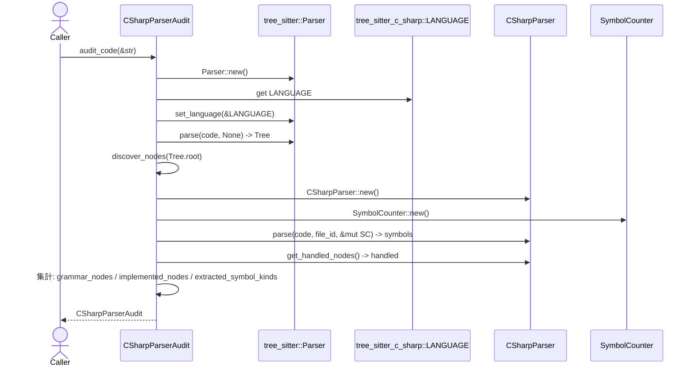

# parsing/csharp/audit.rs Review

## TL;DR

- 目的: Tree-sitterで検出できるC# ASTノードと自前のC#パーサが実際に処理したノード/抽出したシンボルを比較し、カバレッジギャップを可視化するツール。
- 主要公開API: CSharpParserAudit::audit_file, audit_code, generate_report とエラー型 AuditError。
- コアロジック: 同一コードを「tree-sitter（生AST探索）」と「自前C#パーサ（シンボル抽出とハンドル済みノード計測）」で二重解析し、差分をMarkdownレポートとして生成。
- 複雑箇所: 二重パースに伴うオーバーヘッド、実例依存のカバレッジ判断（ファイルに現れないノードは “not found”）、ノード検出の再帰実装。
- 重大リスク: FileId::new(1).unwrap() による潜在的なpanic、未使用インポート（NodeTracker）、非常に深いASTでの再帰によるスタック消費、二重パースによる性能コスト。
- Rust安全性/エラー: unsafeなし、エラーはthiserrorで定義済み、unwrapの削減余地あり。並行性は非対応（同期コード）。
- セキュリティ: ファイル読み取りのみで外部コマンド起動等なし。入力サイズ/パス検証は呼び出し側責務。

## Overview & Purpose

本モジュールは、C#パーサの実装網羅性を監査するための補助モジュール。tree-sitter-c-sharpで得られるAST上のノード種別（grammar_nodes）と、自前のCSharpParserが実際にハンドルしたノード名（implemented_nodes）・抽出したシンボル種別（extracted_symbol_kinds）を比較し、未実装の可能性がある箇所や実例に未登場のノードをMarkdownレポートで報告する。

用途:
- カバレッジの定点観測（CIでのレポート生成）
- 実装ギャップの優先度付け
- サンプルコードの充実度確認（“not found” ノード）

非目的:
- 構文エラーの詳細解析や意味解析
- 解析結果の永続化やDB入出力

## Structure & Key Components

| 種別 | 名前 | 公開範囲 | 責務 | 複雑度 |
|------|------|----------|------|--------|
| Enum | AuditError | pub | 監査処理における失敗要因の列挙（ファイルIO、言語設定、パース、パーサ作成） | Low |
| Struct | CSharpParserAudit | pub | 監査結果（grammar_nodes/implemented_nodes/extracted_symbol_kinds）保持と監査API/レポート生成 | Med |
| Fn | CSharpParserAudit::audit_file | pub | ファイルパス入力で監査実行（読み取り→audit_code） | Low |
| Fn | CSharpParserAudit::audit_code | pub | 文字列コード入力で監査実行（tree-sitter検出＋自前パーサ解析） | Med |
| Fn | CSharpParserAudit::generate_report | pub | カバレッジレポートをMarkdownで生成 | Low |
| Fn | discover_nodes | private | ASTをDFSで走査し、ノード種別→kind_idを記録 | Low |
| Mod | tests | private | 単体テスト（基本的なC#インタフェース/クラス検出） | Low |

### Dependencies & Interactions

- 内部依存
  - CSharpParserAudit::audit_file → CSharpParserAudit::audit_code
  - CSharpParserAudit::audit_code → discover_nodes, CSharpParser（外部モジュールだが自家製）
  - CSharpParserAudit::generate_report → format_utc_timestamp（時刻整形）

- 外部依存（主要）
  | クレート/モジュール | 用途 |
  |--------------------|------|
  | tree_sitter | 汎用パーサフレームワーク（AST生成、Node/walk） |
  | tree_sitter_c_sharp | C#文法の言語定義 |
  | thiserror | エラー型の派生 |
  | std::fs | ファイル読み取り |
  | std::collections::{HashMap, HashSet} | 結果集計 |
  | crate::io::format::format_utc_timestamp | レポートの生成時刻表示 |
  | crate::types::{FileId, SymbolCounter} | 自前パーサ入力ID/抽出カウント |
  | super::CSharpParser | 自前のC#パーサ本体 |

- 被依存推定
  - CIジョブ（監査レポート生成）
  - ドキュメント生成パイプライン
  - ローカル検証ツール/CLI

補足: crate::parsing::NodeTracker はimportされているが、このファイル内では直接未使用（コンパイル警告の可能性）。

## API Surface (Public/Exported) and Data Contracts

| API名 | シグネチャ | 目的 | Time | Space |
|-------|-----------|------|------|-------|
| CSharpParserAudit::audit_file | fn audit_file(file_path: &str) -> Result<Self, AuditError> | ファイルのC#コードを読み取り、監査を実行 | O(F + P) | O(U) |
| CSharpParserAudit::audit_code | fn audit_code(code: &str) -> Result<Self, AuditError> | 文字列コードに対して監査を実行 | O(P) | O(U) |
| CSharpParserAudit::generate_report | fn generate_report(&self) -> String | 監査結果のMarkdownレポート生成 | O(K) | O(K) |
| 型: AuditError | enum AuditError | 監査処理での失敗通知（thiserror） | - | - |
| 型: CSharpParserAudit | struct CSharpParserAudit { grammar_nodes, implemented_nodes, extracted_symbol_kinds } | 監査結果保持のデータコンテナ | - | O(U) |

注:
- F: ファイル読み出し時間、P: パース時間（tree-sitter + 自前パーサ）、K: キーターゲットノード数（generate_reportの表）、U: ユニークなノード種別/シンボル種別数

データコントラクト:
- CSharpParserAudit
  - grammar_nodes: HashMap<String, u16> … ファイル内で検出されたASTノード種別→kind_id（ユニーク）
  - implemented_nodes: HashSet<String> … 自前パーサ側で「処理済み」とトラッキングされたノード名
  - extracted_symbol_kinds: HashSet<String> … 自前パーサが抽出したシンボルの種別（Debug表現）

---

以下、各API詳細。

1) CSharpParserAudit::audit_file
- 目的と責務
  - 指定パスのファイルを読み取り、audit_codeを呼び出して監査結果を返す。
- アルゴリズム
  1. std::fs::read_to_string(file_path) でコード読み取り
  2. audit_code(&code) を呼ぶ
- 引数
  | 引数 | 型 | 必須 | 説明 |
  |------|----|------|------|
  | file_path | &str | Yes | C#ソースファイルのパス |
- 戻り値
  | 戻り値 | 型 | 説明 |
  |--------|----|------|
  | Ok | CSharpParserAudit | 監査結果 |
  | Err | AuditError | FileRead等の失敗 |
- 使用例
  ```rust
  let audit = CSharpParserAudit::audit_file("src/MyClass.cs")?;
  println!("{}", audit.generate_report());
  ```
- エッジケース
  - ファイルが存在しない/権限なし → AuditError::FileRead
  - ファイルが巨大 → 解析時間/メモリ増大（性能セクション参照）

2) CSharpParserAudit::audit_code
- 目的と責務
  - 文字列コードを、tree-sitterと自前C#パーサで解析し、ノード網羅/実装/シンボル抽出の3軸で結果を集約する。
- アルゴリズム（主要ステップ）
  1. tree_sitter::Parser を生成し、tree_sitter_c_sharp の言語をセット
  2. parser.parse(code, None) でTree生成し、DFSで discover_nodes を実行して grammar_nodes を構築
  3. 自前 CSharpParser::new() → parse(code, file_id, &mut symbol_counter)
  4. symbols から extracted_symbol_kinds（シンボル種別）を抽出
  5. cs_parser.get_handled_nodes() から implemented_nodes を収集
  6. CSharpParserAudit を返却
- 引数
  | 引数 | 型 | 必須 | 説明 |
  |------|----|------|------|
  | code | &str | Yes | C#ソースコード本文 |
- 戻り値
  | 戻り値 | 型 | 説明 |
  |--------|----|------|
  | Ok | CSharpParserAudit | 監査結果（grammar/implemented/extracted） |
  | Err | AuditError | LanguageSetup/ParseFailure/ParserCreation 等 |
- 使用例
  ```rust
  let code = "namespace N { public class C { } }";
  let audit = CSharpParserAudit::audit_code(code)?;
  assert!(audit.grammar_nodes.contains_key("class_declaration"));
  ```
- エッジケース
  - codeが空文字列 → tree-sitter上は極端に小さいツリー（場合によってはParseFailureは発生しない）。結果が極小になる。
  - 自前パーサの初期化失敗（ParserCreation） → Err
  - tree-sitter言語設定の失敗（LanguageSetup） → Err
  - 非常に深いネスト → 再帰DFSによりスタック消費増

3) CSharpParserAudit::generate_report
- 目的と責務
  - 監査結果をMarkdownで要約、カバレッジ表、レジェンド、推奨アクション付きで出力。
- アルゴリズム
  1. 生成時刻をヘッダに表示
  2. Summary（ユニークノード数/実装ノード数/シンボル種別数）
  3. Keyノード群について implemented/gap/not found を判定・表化
  4. ギャップ/ミッシングの推奨アクションを列挙
- 引数
  | 引数 | 型 | 必須 | 説明 |
  |------|----|------|------|
  | self | &CSharpParserAudit | Yes | 集計済み結果 |
- 戻り値
  | 戻り値 | 型 | 説明 |
  |--------|----|------|
  | レポート | String | Markdown文字列 |
- 使用例
  ```rust
  let audit = CSharpParserAudit::audit_code("public class C {}")?;
  let md = audit.generate_report();
  println!("{md}");
  ```
- エッジケース
  - grammar_nodesが空 → カバレッジ表は全て “not found”
  - implemented_nodesが空 → 多くが “gap” になり推奨アクションが冗長化

データ型: AuditError
- 目的: 監査プロセスの失敗要因を明確化
- バリアント
  - FileRead(std::io::Error) … ファイル読み込み失敗
  - LanguageSetup(String) … 言語設定失敗
  - ParseFailure … tree-sitterがTreeを返せないケース
  - ParserCreation(String) … 自前パーサの初期化失敗

データ型: CSharpParserAudit
- フィールド
  - grammar_nodes: HashMap<String, u16>
  - implemented_nodes: HashSet<String>
  - extracted_symbol_kinds: HashSet<String>

## Walkthrough & Data Flow

処理全体のシーケンス（audit_code中心）



上記の図は `audit_code` 関数の主要フローを示す（行番号: 不明。該当コードは本チャンク内に存在）。

核心的なデータフロー:
- 入力: &str code
- 出力: CSharpParserAudit
- 中間:
  - tree-sitter 解析結果から grammar_nodes を構築（ユニークな種類のみ）
  - 自前パーサ結果から symbols（→ extracted_symbol_kinds）と handled_nodes（→ implemented_nodes）を構築

generate_report は、上記3セットをもとにキーノード群に対して3値（implemented/gap/not found）を付与する直線的な構成。

## Complexity & Performance

- audit_file
  - 時間: O(F + P)（F: ファイル読み込み、P: 解析全体）
  - 空間: O(U)
- audit_code
  - 時間: O(P) ≒ O(N) ただし「二重パース」構成
    - tree-sitterパース: O(N)
    - 自前パーサパース: O(N)（内部でtree-sitterを再利用している場合も実質同程度）
  - 空間: O(U)（ユニークノード種別/シンボル種別数）
- generate_report
  - 時間: O(K)（キーターゲットノード数）
  - 空間: O(K)

ボトルネック:
- 二重パースによるCPUコスト増（大規模ファイルでは顕著）
- discover_nodes の再帰DFSは深いネストでスタック消費

スケール限界:
- 非常に大きなC#ファイル（数MB〜）でレイテンシ増
- 再帰深度が極端に深いコードでの潜在的スタック枯渇

実運用負荷要因:
- I/O: audit_fileのファイル読み込み（多数ファイルを連続監査する場合は影響）
- CPU: tree-sitter＋自前パーサの二重解析

## Edge Cases, Bugs, and Security

エッジケース一覧

| エッジケース | 入力例 | 期待動作 | 実装 | 状態 |
|-------------|--------|----------|------|------|
| 空コード | "" | 小さなツリー／解析結果ほぼ空、レポートはnot foundが多数 | audit_code | OK |
| 存在しないファイル | "nope.cs" | FileReadエラー | audit_file | OK |
| 言語設定失敗 | 異常なLANGUAGE | LanguageSetupエラー | audit_code | OK |
| パース失敗(None) | 非常に稀な内部失敗 | ParseFailureエラー | audit_code | OK |
| FileId生成失敗 | FileId::new(1)が失敗 | 戻り値で扱う | audit_code（unwrap） | 要改善 |
| 非常に深いAST | 深いネストのコード | 処理継続（望ましい） | discover_nodes（再帰） | 要検討 |
| 大容量ファイル | 数MB〜 | 許容時間内で解析 | 二重パース | 要最適化 |

潜在バグ/懸念:
- panicの可能性: FileId::new(1).unwrap()（関数名: audit_code, 行番号不明）
  - 期待としてはinfallibleだが、仕様不明のためpanicリスク。expectで理由を明示、またはResult連鎖へ。

- 未使用インポート: crate::parsing::NodeTracker（このチャンクでは直接未使用）
  - 警告発生の可能性。不要なら削除推奨。

- “not found” の解釈:
  - grammar_nodesに現れない＝例示コードに出ていない、であり、文法未対応を意味しない。レポートの文言ではその旨明示済みだが、利用者が誤解しないようドキュメントで補足推奨。

メモリ安全性:
- unsafe未使用。所有権/借用は標準的。Nodeの走査はtree-sitterのAPIに従ったイテレーションで安全。

インジェクション:
- SQL/Command/Path traversalなし。ファイルパスは呼び出し側提供だが、単純読み取りのみ。

認証・認可:
- 該当なし。

秘密情報:
- ハードコードされた秘密情報なし。ログ出力はテスト内のみのprintln。

並行性:
- 同期API。共有ミュータブル状態なし。データ競合の懸念なし。

Rust特有の観点:
- 所有権/借用: 一時的なStringやコレクションのみ。関数間移動も明快。
- ライフタイム: 明示的パラメータ不要。
- unsafe境界: なし。
- エラー設計: Resultで表現、thiserror活用。unwrapの一点のみ改善余地。
- panic箇所: FileId::new(1).unwrap() のみ確認（audit_code）。
- エラー変換: std::io::Errorは#[from]でFileReadに自動変換。他は文字列化。

## Design & Architecture Suggestions

- 二重パースの解消
  - 可能なら自前パーサに「既存のTreeを渡す」APIを追加し、tree-sitterのパースを一度に。
  - 代替: audit用に「自前パーサからrootノード/言語を借用」してdiscover_nodesを行う。

- ノード頻度の計測
  - 現在はユニーク種別のみ記録（HashMap<String, u16>）。カバレッジの重み付けに「出現回数」も有用。値をu16→構造体（{kind_id, count}）に拡張。

- 安全なFileId生成
  - FileId::new(1).unwrap() を Resultに伝搬 or expect("...infallible...") に変更。
  - 監査系では固定IDかつin-memoryで良いなら、明示的な「DUMMY_FILE_ID」的な安全APIを用意。

- レポート強化
  - 実装/未実装ノードの割合（%）表示
  - 代表的な未実装ノードTop-N
  - extracted_symbol_kindsの内訳一覧

- 依存の整理
  - 未使用のNodeTracker importを削除して警告抑制。
  - BTreeMapでgrammar_nodesを保持し、レポートの安定した並び順を確保。

- 大規模入力への耐性
  - discover_nodesの再帰を手動スタック（Vec<Node>）で反復処理に変換。

## Testing Strategy (Unit/Integration) with Examples

既存テスト要約:
- test_audit_simple_csharp
  - interface/class/method/namespaceを含むコードで、grammar_nodes/extracted_symbol_kinds/implemented_nodesの基本検証。
  - 期待どおり“Interface”“Class”シンボル種別が抽出されることを確認。

追加すべきテスト（提案）:
- 単体テスト
  - 空文字・空namespace
  - さまざまなキーノード（record_declaration, enum_declaration, delegate_declaration, operator_declaration 等）を網羅する短小例
  - generate_reportの整形確認（表ヘッダ、Legend、推奨アクション）
  - FileId生成のエラー経路（もし発生しうる仕様なら）

- プロパティテスト
  - 入力コードに対して、report内の件数が論理整合（gap+implemented+not found = key_nodes数）

- 統合テスト
  - 複数ファイルに対し audit_file を回す軽量スモークテスト
  - 大きめのC#ファイルでタイムアウトしないことの確認（ベンチに近い）

- 回帰テスト
  - get_handled_nodesの仕様変更に備え、implemented_nodesの意味が変わった場合に検出

サンプル（短縮抜粋）:
```rust
#[test]
fn test_generate_report_empty() {
    let audit = CSharpParserAudit {
        grammar_nodes: HashMap::new(),
        implemented_nodes: HashSet::new(),
        extracted_symbol_kinds: HashSet::new(),
    };
    let md = audit.generate_report();
    assert!(md.contains("# C# Parser Coverage Report"));
    assert!(md.contains("Coverage Table"));
}
```

## Refactoring Plan & Best Practices

- unwrapの排除
  - FileId::new(1).unwrap() → FileId::new(1).map_err(|e| AuditError::ParserCreation(...)) もしくは expect("in-memory audit file id")。

- discover_nodesの反復化
  - 再帰をVec<Node>でのループに変更し、スタック枯渇を防止。

- 未使用インポート削除
  - use crate::parsing::NodeTracker; を削除（このファイルでは未使用）。

- パース回数の削減
  - 自前パーサのparseがtree-sitterベースであれば、Tree共有/再利用を設計上検討。

- 出力の安定化
  - grammar_nodesの並び安定のためBTreeMap採用やsortして出力。

- データモデルの拡張
  - grammar_nodesのvalueを { kind_id, count } にして出現回数も収集。

## Observability (Logging, Metrics, Tracing)

- Logging
  - debug: パース開始/終了、検出ユニークノード数、実装ノード数、抽出シンボル数
  - trace: discover_nodesでの訪問数（大量出力注意）

- Metrics
  - gauge: ユニークノード種別数、実装ノード種別数、抽出シンボル種別数
  - histogram: 解析時間（tree-sitter単体、自前パーサ単体、合計）
  - counter: “gap”件数、“not found”件数

- Tracing
  - span: audit_code全体、tree-sitter解析、自前パーサ解析、レポート生成

- テスト下ではprintlnではなくlog::info!/debug!で統一（環境に応じた抑制が可能）

## Risks & Unknowns

- CSharpParserのAPI詳細は本チャンク外で不明
  - parseの計算量/エラー条件、get_handled_nodesの返却構造（名前の安定性、件数の意味）などは不明。

- FileIdの仕様
  - FileId::new(1) が失敗しない前提か不明。DUMMYを使えるか、from_path等があるかはこのチャンクには現れない。

- tree-sitterのParseFailure発生条件
  - 通常はNoneが返らないケースが多いが、どの条件でNoneになるかはtree-sitter内部仕様に依存。

- “key_nodes” リストの網羅性
  - 手動メンテ。C#言語拡張（新構文）に追随が必要。自動生成/同期手段は不明。

- NodeTrackerの役割
  - importされているが本ファイル内で未使用。このモジュール外との結合度が不明。

以上により、API利用者は「レポートの“gap”/“not found”解釈」が入力ファイル依存である点を理解し、十分なサンプル群に対して実行することが推奨される。