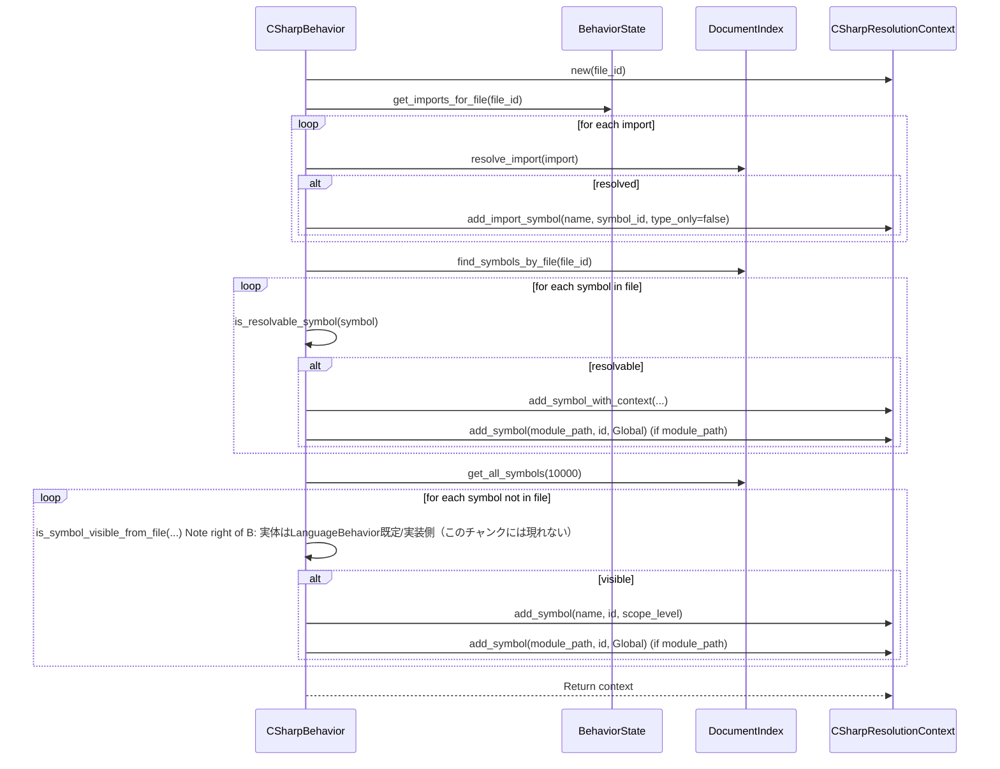

# parsing\csharp\behavior.rs Review

## TL;DR

- 目的: C#向けの言語固有ビヘイビア（名前空間/using/可視性/関係マッピング）を提供し、インデクシングと参照解決を支援
- 主要公開API: CSharpBehavior::new、LanguageBehavior/StatefulBehaviorの実装（configure_symbol、module_path_from_file、parse_visibility、build_resolution_context、create_external_symbol など）
- 核心ロジック: using解決（resolve_import, resolve_external_call_target）、解決コンテキスト構築（build_resolution_context）、外部シンボル生成（create_external_symbol）
- 複雑箇所: build_resolution_context と resolve_import が DocumentIndex を広範に走査（get_all_symbols(10000)）しがちで、性能ボトルネックになりうる
- Rust安全性: unsafeなし、unwrap/expectなし（unwrap_orは安全）、共有状態（BehaviorState）のスレッド安全性は実装外部に依存（不明）
- 重大リスク: 名前空間/using解決の簡略化（alias/qualified/unqualified以外のC#言語機能未対応）、大規模プロジェクトでの O(N) 走査、可視性の近似（protected/internal→Module）が解析精度に影響
- セキュリティ: コマンド/SQL/パスインジェクションはなし。外部ファイルパス生成は固定ディレクトリ配下で安全性は高いが、パス正規化の明示があるとより堅牢

## Overview & Purpose

このモジュールは、パーサ全体の抽象化（LanguageBehavior）に対して、C#特有の規則（名前空間、usingディレクティブ、可視性、継承/実装関係、呼び出し解決）を提供する実装です。インデクシング時にファイルごとのモジュールパス（名前空間相当）を決定し、ファイル間での参照解決を補助するための状態（BehaviorState）と DocumentIndex を活用します。

主な責務:
- モジュールパス/名前空間の整形・設定
- using の登録/解決（エイリアス/非エイリアス）
- 可視性のパースと共通の Visibility へのマッピング
- 参照解決コンテキスト（ResolutionScope）の構築
- 外部（未定義）シンボルの生成とインデクシング

## Structure & Key Components

| 種別 | 名前 | 公開範囲 | 責務 | 複雑度 |
|------|------|----------|------|--------|
| Struct | CSharpBehavior | pub | C#ビヘイビアの状態と実装本体 | Low |
| Field | state: BehaviorState | private | ファイル/インポート状態の保持 | Low |
| Impl | impl CSharpBehavior | public new()/Default | インスタンス生成 | Low |
| Trait Impl | StatefulBehavior for CSharpBehavior | public (trait) | 状態アクセス/状態付きヘルパ活用 | Low |
| Trait Impl | LanguageBehavior for CSharpBehavior | public (trait) | C#特有の解析ロジック | High |
| Fn | configure_symbol | trait公開 | シンボルのmodule_path設定 | Low |
| Fn | module_path_from_file | trait公開 | ファイルパス→名前空間推定 | Med |
| Fn | parse_visibility | trait公開 | C#修飾子→Visibility | Low |
| Fn | resolve_external_call_target | trait公開 | 呼び出し先推定（using/alias/qualified） | Med |
| Fn | create_external_symbol | trait公開 | 外部シンボル生成・インデクス登録 | Med |
| Fn | build_resolution_context | trait公開 | 解決コンテキスト構築（imports/visibility/範囲） | High |
| Fn | resolve_import | private相当（trait内） | using解決（alias/namespace） | Med |
| Fn | is_resolvable_symbol | private相当（trait内） | 参照可能シンボル判定 | Low |
| Fn | import_matches_symbol | trait公開 | 名前空間包含マッチ | Low |
| Fn | get_module_path_for_file | trait公開 | 状態からモジュールパス取得 | Low |

### Dependencies & Interactions

- 内部依存
  - register_file → register_file_with_state（StatefulBehaviorのヘルパ）
  - add_import → add_import_with_state（同上）
  - get_imports_for_file → get_imports_from_state（同上）
  - build_resolution_context → resolve_import, is_resolvable_symbol, state.get_module_path
  - resolve_external_call_target → get_imports_for_file
  - create_external_symbol → DocumentIndex（ID割当/格納/検索）

- 外部依存（主要）

| 依存 | 用途 | 備考 |
|-----|-----|-----|
| crate::parsing::LanguageBehavior | トrait境界 | 解析フレームの契約 |
| crate::parsing::behavior_state::{BehaviorState, StatefulBehavior} | 状態管理/ヘルパ | スレッド安全性は実装依存（不明） |
| crate::parsing::resolution::ResolutionScope | 解決スコープIF | 具象はCSharpResolutionContext |
| super::resolution::CSharpResolutionContext | C#解決コンテキスト | imports/シンボル登録/検索 |
| crate::storage::DocumentIndex | 検索/格納/ID発行 | Tantivyラッパ想定 |
| tree_sitter_c_sharp::LANGUAGE | パーサ言語ID | tree-sitter連携 |
| crate::{Symbol, SymbolId, SymbolKind, Visibility, Range} | シンボル定義 | 共通ドメインモデル |

- 被依存推定
  - C#パーサ/インデクサ、クロスリファレンス解決、関係抽出器。正確な呼び出し元はこのチャンクには現れない。

## API Surface (Public/Exported) and Data Contracts

| API名 | シグネチャ | 目的 | Time | Space |
|-------|-----------|------|------|-------|
| CSharpBehavior::new | fn new() -> Self | インスタンス生成 | O(1) | O(1) |
| Default::default | fn default() -> Self | 既定生成 | O(1) | O(1) |
| configure_symbol | fn configure_symbol(&self, symbol: &mut Symbol, module_path: Option<&str>) | module_path設定 | O(n) | O(n) |
| format_module_path | fn format_module_path(&self, base_path: &str, _symbol_name: &str) -> String | C#のモジュール表記整形 | O(n) | O(n) |
| get_language | fn get_language(&self) -> Language | C#言語ID取得 | O(1) | O(1) |
| module_separator | fn module_separator(&self) -> &'static str | 名前空間区切り "." | O(1) | O(1) |
| module_path_from_file | fn module_path_from_file(&self, file_path: &Path, project_root: &Path) -> Option<String> | パス→名前空間推定 | O(L) | O(L) |
| parse_visibility | fn parse_visibility(&self, signature: &str) -> Visibility | C#可視性→Visibility | O(L) | O(1) |
| supports_traits | fn supports_traits(&self) -> bool | interface対応 | O(1) | O(1) |
| supports_inherent_methods | fn supports_inherent_methods(&self) -> bool | メンバメソッド対応 | O(1) | O(1) |
| create_resolution_context | fn create_resolution_context(&self, file_id: FileId) -> Box<dyn ResolutionScope> | 空のC#解決CTX | O(1) | O(1) |
| inheritance_relation_name | fn inheritance_relation_name(&self) -> &'static str | 継承名 "inherits" | O(1) | O(1) |
| map_relationship | fn map_relationship(&self, language_specific: &str) -> RelationKind | 関係語→標準種別 | O(1) | O(1) |
| register_file | fn register_file(&self, path: PathBuf, file_id: FileId, module_path: String) | ファイル登録（状態） | O(1) | O(1) |
| add_import | fn add_import(&self, import: Import) | using登録（状態） | O(1) | O(1) |
| get_imports_for_file | fn get_imports_for_file(&self, file_id: FileId) -> Vec<Import> | ファイルのusing取得 | O(I) | O(I) |
| resolve_external_call_target | fn resolve_external_call_target(&self, to_name: &str, from_file: FileId) -> Option<(String, String)> | 呼び出し先推定 | O(I) | O(1) |
| create_external_symbol | fn create_external_symbol(&self, index: &mut DocumentIndex, module_path: &str, symbol_name: &str, language_id: LanguageId) -> IndexResult<SymbolId> | 外部シンボル作成 | 依存 | 依存 |
| build_resolution_context | fn build_resolution_context(&self, file_id: FileId, index: &DocumentIndex) -> IndexResult<Box<dyn ResolutionScope>> | 解決CTX構築 | O(I+S) | O(S) |
| is_resolvable_symbol | fn is_resolvable_symbol(&self, symbol: &Symbol) -> bool | 解決対象か判定 | O(1) | O(1) |
| resolve_import | fn resolve_import(&self, import: &Import, index: &DocumentIndex) -> Option<SymbolId> | using→Symbol解決 | O(S) | O(1) |
| get_module_path_for_file | fn get_module_path_for_file(&self, file_id: FileId) -> Option<String> | 状態から取得 | O(1) | O(1) |
| import_matches_symbol | fn import_matches_symbol(&self, import_path: &str, symbol_module_path: &str, _importing_module: Option<&str>) -> bool | 名前空間前方一致 | O(N) | O(1) |

注: I=import数、S=シンボル数、L=文字列長。DocumentIndexの複雑度は実装依存で、このチャンクには現れない。

以下、主要APIを詳細化。

1) configure_symbol
- 目的と責務: シンボルにC#名前空間（module_path）を設定
- アルゴリズム:
  - module_pathがSomeなら format_module_path(base, symbol.name) を用いず base をそのまま設定（名前も含めない）
- 引数:
  - symbol: 書き換え対象
  - module_path: Option<&str>
- 戻り値: なし（副作用で symbol.module_path を設定）
- 使用例:
```rust
let mut sym = Symbol::new(id, "Console".into(), SymbolKind::Class, file_id, Range::new(0,0,0,0));
behavior.configure_symbol(&mut sym, Some("System"));
assert_eq!(sym.module_path.as_deref(), Some("System"));
```
- エッジケース:
  - module_path=None → 変更しない
  - 既存module_path上書き

2) module_path_from_file
- 目的: ファイルパスからディレクトリ構造ベースの名前空間を推定
- アルゴリズム:
  - project_rootからの相対パスに変換（strip_prefix失敗時は元パス）
  - "./", "src/", "lib/" を前方から削除
  - 拡張子 ".cs" ".csx" を除去
  - 区切り(/, \)を "." に置換
- 引数/戻り値:
  - file_path, project_root
  - Option<String>（UTF-8でないパスはNone）
- 例:
```rust
let ns = behavior.module_path_from_file(Path::new("src/Services/UserService.cs"), Path::new(".")).unwrap();
assert_eq!(ns, "Services.UserService");
```
- エッジケース:
  - 非UTF-8パス → None
  - Windows区切り（\）も対応

3) parse_visibility
- 目的: C#シグネチャ文字列から可視性判定
- アルゴリズム: "public"/"private"/"protected"/"internal" の包含チェック（優先順位あり）
- 仕様: protected/internal を Visibility::Module に近似
- 例:
```rust
assert!(matches!(behavior.parse_visibility("public class A"), Visibility::Public));
assert!(matches!(behavior.parse_visibility("internal class A"), Visibility::Module));
assert!(matches!(behavior.parse_visibility("class A"), Visibility::Private)); // デフォルト保守的にprivate
```
- エッジケース:
  - 複合 "protected internal" は Module に丸め込み
  - コメント中のキーワード誤検知の可能性（このチャンクには正規化処理なし）

4) resolve_external_call_target
- 目的: メンバ呼び出し to_name を using/alias 情報で (モジュール, メンバ) に解決
- ロジック:
  - imports取得
  - "A.B.C" 形式なら qualifier="A.B", member="C"
    - alias一致 → alias先のimport.pathを返す
    - import.pathが修飾子と一致/後方一致 → import.pathを返す
  - 非修飾名なら、非glob非aliasのusingを1つ選んで Namespace.Symbol で返す
- 例:
```rust
// using System;
let r = behavior.resolve_external_call_target("Console.WriteLine", file_id);
// Some(("System".into(), "WriteLine".into()))
```
- エッジケース:
  - importsが空 → None
  - 複数候補がある場合、最初にマッチしたものを返す（曖昧さ解消なし）

5) create_external_symbol
- 目的: インデックス外の外部シンボルを仮想ファイル配下に作成・登録
- アルゴリズム:
  - 既存同名同モジュールを検索→存在すれば再利用
  - .codanna/external/<module_path>.cs を仮想パスとして file_info を作成（なければ）
  - 新規 SymbolId を発行し Symbol を Public/Class として登録
  - MetadataKey::SymbolCounter を更新
- 例:
```rust
let id = behavior.create_external_symbol(&mut index, "System", "Console", LanguageId::CSharp)?;
```
- エッジケース:
  - 既存ファイル/シンボルがある場合は重複生成しない
  - DocumentIndexのエラーは IndexError::TantivyError にラップ

6) build_resolution_context
- 目的: 1ファイルの解決コンテキストを構築（imports・自身のシンボル・可視シンボル）
- アルゴリズム（概要）:
  - CSharpResolutionContext を作成
  - 状態由来のimportsを解決し add_import_symbol
  - 当該ファイルのシンボルを登録（名前/モジュール名）
  - 全シンボルを走査し、可視性に応じてグローバル/モジュールスコープに登録
- 例:
```rust
let ctx = behavior.build_resolution_context(file_id, &index)?;
```
- エッジケース:
  - get_all_symbols(10000) による切り捨ての可能性
  - 可視性の近似があるため厳密なC#のアクセス規則とは異なる

7) import_matches_symbol
- 目的: using の対象とシンボルのモジュールが一致/包含するかを判定
- 仕様: 完全一致 or import_path + "." で前方一致
- 例:
```rust
assert!(behavior.import_matches_symbol("System", "System.Console", None));
```

データ契約（主要型）
- Symbol: name, kind, file_id, Range, module_path, visibility, scope_context, language_id
- Import: path(String), alias(Option<String>), is_glob(bool) 等（詳細はこのチャンクには現れない）
- DocumentIndex: ID発行/検索/格納APIを提供（実装詳細はこのチャンクには現れない）

## Walkthrough & Data Flow

高レベルフロー（ファイル解析→参照解決）:
- register_file: ファイルと対応するモジュールパスを状態に登録
- add_import: usingディレクティブを状態に登録
- build_resolution_context:
  - resolve_import で using を DocumentIndex のシンボルにひも付け
  - 同一ファイルのシンボルと、可視性に応じた他ファイルのシンボルを登録
- resolve_external_call_target: 呼び出し文字列を using 情報で解決
- create_external_symbol: 足りない外部型を補完しインデックスへ

Mermaidフローチャート: resolve_external_call_target（行番号: 不明、関数: resolve_external_call_target）

```mermaid
flowchart TD
  A[Start: to_name, from_file] --> B{get_imports_for_file is empty?}
  B -- Yes --> Z[Return None]
  B -- No --> C{to_name contains '.'?}
  C -- Yes --> D[Split qualifier, member]
  D --> E{Any import alias == qualifier?}
  E -- Yes --> F[Return (import.path, member)]
  E -- No --> G{Any import.path == qualifier OR endsWith('.'+qualifier)?}
  G -- Yes --> H[Return (import.path, member)]
  G -- No --> I[Continue search or fallback]
  C -- No --> J{Any import where !is_glob && alias is None?}
  J -- Yes --> K[Return (import.path, to_name)]
  J -- No --> Z[Return None]
```

上記の図は resolve_external_call_target 関数の主要分岐を示す（関数: resolve_external_call_target, 行番号: 不明）。

Mermaidシーケンス: build_resolution_context（行番号: 不明、関数: build_resolution_context）



上記の図は build_resolution_context 関数の主要処理を示す（関数: build_resolution_context, 行番号: 不明）。

## Complexity & Performance

- configure_symbol, import_matches_symbol, get_language など: O(1)〜O(n) の文字列操作のみ
- module_path_from_file: O(L)（パス文字列長）
- parse_visibility: O(L)（単純な contains チェック）
- resolve_external_call_target: O(I)（importsの線形走査）。importsが多いと遅延
- resolve_import:
  - aliasあり: find_symbols_by_name(alias) のコスト依存（通常 log N 期待だが実装依存）
  - aliasなし: get_all_symbols(10000) を全走査 → O(S)。10k制限のハードカットがあり精度/性能両面でリスク
- build_resolution_context: O(I + S) だが get_all_symbols(10000) の全件走査がボトルネック
- create_external_symbol: 複数回のインデックスI/O（find/store/get_next_*）。I/O律速で遅さが顕著になり得る

スケール限界・ボトルネック:
- get_all_symbols(10000) の固定上限と全走査
- resolve_external_call_target の曖昧解決（最初一致）による誤結合と再試行の必要性
- 大規模リポジトリでは DocumentIndex 呼び出し数増加に伴うI/O遅延

I/O/DB負荷:
- create_external_symbol と build_resolution_context は DocumentIndex へのアクセスが多い
- キャッシュ/インデックス（名前空間→シンボルの逆引き）を導入すると改善見込み

## Edge Cases, Bugs, and Security

エッジケース一覧

| エッジケース | 入力例 | 期待動作 | 実装 | 状態 |
|-------------|--------|----------|------|------|
| 非UTF-8パス | file_pathが非UTF-8 | Noneを返す | module_path_from_file | 対応済 |
| protected internal | "protected internal class A" | Module相当 | parse_visibility | 対応済（近似） |
| コメント内キーワード誤検知 | "/* public */ class A" | 可視性はclass Aの規定に従う | parse_visibility | 潜在不具合 |
| using alias解決 | using L = System.Collections.Generic.List; to "L.Add" | ("System.Collections.Generic.List", "Add") | resolve_external_call_target | 対応済 |
| 非修飾名の解決 | using System; "Console" | ("System", "Console") | resolve_external_call_target | 対応済（最初のusing採用） |
| 複数候補の曖昧性 | using System; using My.System; "Console" | 最適候補に決定 | resolve_external_call_target | 曖昧（最初一致） |
| get_all_symbols上限 | >10,000シンボル | 取りこぼしなく解決 | build_resolution_context/resolve_import | 潜在不具合 |
| 外部シンボル重複 | 既存同名同モジュールあり | 既存再利用 | create_external_symbol | 対応済 |
| Windowsパス | "src\\A\\B.cs" | "A.B"に変換 | module_path_from_file | 対応済 |

セキュリティチェックリスト
- メモリ安全性
  - Buffer overflow / Use-after-free / Integer overflow: 該当なし（safe Rustのみ、明示的unsafeなし）
  - 文字列操作は標準APIのみ。unwrap/expectは未使用、unwrap_orは安全側
- インジェクション
  - SQL/Command: 該当なし
  - Path traversal: 外部シンボルは ".codanna/external/" 配下固定で module_path を "/" 置換して使用。ユーザ入力ではなくC#名前空間由来のため安全性は高いが、パス正規化/禁止文字検査があるとより堅牢
- 認証・認可: 該当なし
- 秘密情報
  - Hard-coded secrets: なし
  - Log leakage: ログ出力自体がない
- 並行性
  - BehaviorState のスレッド安全性はこのチャンクには現れない。不明
  - &self メソッドから状態更新ヘルパ（register_file_with_state 等）を呼ぶため、内部でSync/Mutex等が必要（実装依存）
- Rust特有の観点
  - 所有権: 文字列/PathBufはmove/cloneが明示（例: register_fileはPathBuf, Stringを所有権移動）
  - 借用: DocumentIndex への &mut と & の使い分けが明確（create_external_symbolのみ &mut）
  - ライフタイム: 明示的ライフタイムは不要
  - unsafe境界: 使用なし
  - Send/Sync: CSharpBehavior自体はClone可能。Stateの実装に依存（不明）
  - データ競合: 状態操作の内部同期に依存（不明）
  - await/非同期: 非同期コードは登場しない
  - エラー設計: IndexResult/IndexErrorでI/O失敗を伝播。その他はOptionで欠落/未解決を表現。panic系なし

潜在バグ/改善点
- parse_visibility は単純な substring 検索で、コメント/識別子の一部を誤検知しうる
- resolve_import は aliasなしのケースで get_all_symbols(10000) を全走査して最初のPublicシンボルを返すため、狙った型に結び付かない可能性がある
- resolve_external_call_target の「非修飾名→最初のusing採用」は曖昧性解消がない
- build_resolution_context の is_symbol_visible_from_file 呼び出し実装はこのチャンクには現れないため、可視性の正確性は依存/不明

## Design & Architecture Suggestions

- インデックス強化
  - 名前空間→直下シンボルのインデックス（prefix検索可能なフィールド）を用意し、resolve_import で get_all_symbols 全走査をやめる
  - alias（型エイリアス）専用の逆引きマップを導入
- 解決の曖昧性低減
  - resolve_external_call_target で複数候補時のスコアリング（同一アセンブリ優先、より具体的な名前空間優先）
  - C#の using static / global using / using alias for namespace vs type を考慮（このチャンクには対応なし）
- 可視性モデル
  - protected, internal の近似（Module）を状況で出し分け（クラスメンバ vs トップレベル）
- パフォーマンス
  - build_resolution_context で get_all_symbols(10000) を避け、必要範囲のクエリに限定
  - ドキュメント単位キャッシュ（ファイル→使用可能シンボル）を導入
- API明確化
  - module_path_from_file の規則（src/lib 前置削除）を設定化できるように（プロジェクトにより異なる）

## Testing Strategy (Unit/Integration) with Examples

ユニットテスト例（擬似/簡略化）

1) module_path_from_file
```rust
#[test]
fn test_module_path_from_file() {
    let b = CSharpBehavior::new();
    assert_eq!(
        b.module_path_from_file(Path::new("src/Services/UserService.cs"), Path::new(".")),
        Some("Services.UserService".into)
    );
    assert_eq!(
        b.module_path_from_file(Path::new("lib\\Core\\Util.cs"), Path::new(".")),
        Some("Core.Util".into)
    );
}
```

2) parse_visibility
```rust
#[test]
fn test_parse_visibility() {
    let b = CSharpBehavior::new();
    assert!(matches!(b.parse_visibility("public class A"), Visibility::Public));
    assert!(matches!(b.parse_visibility("private void M()"), Visibility::Private));
    assert!(matches!(b.parse_visibility("protected internal void M()"), Visibility::Module));
    assert!(matches!(b.parse_visibility("class A"), Visibility::Private));
}
```

3) import_matches_symbol
```rust
#[test]
fn test_import_matches_symbol() {
    let b = CSharpBehavior::new();
    assert!(b.import_matches_symbol("System", "System.Console", None));
    assert!(b.import_matches_symbol("System.Collections", "System.Collections.Generic", None));
    assert!(!b.import_matches_symbol("System.Text", "System.IO", None));
}
```

4) resolve_external_call_target（モックimports）
```rust
#[test]
fn test_resolve_external_call_target_alias_and_ns() {
    let b = CSharpBehavior::new();
    // 状態にimports登録（StatefulBehaviorのヘルパが必要）
    b.add_import(Import { path: "System".into(), alias: None, is_glob: false /* ... */ });
    b.add_import(Import { path: "System.Collections.Generic.List".into(), alias: Some("L".into()), is_glob: false /* ... */ });

    // qualified
    let q = b.resolve_external_call_target("L.Add", file_id);
    assert_eq!(q, Some(("System.Collections.Generic.List".into(), "Add".into())));

    // unqualified
    let u = b.resolve_external_call_target("Console", file_id);
    assert_eq!(u, Some(("System".into(), "Console".into())));
}
```

5) create_external_symbol（インテグレーション）
```rust
#[test]
fn test_create_external_symbol_roundtrip() -> IndexResult<()> {
    let mut idx = setup_index(); // テスト用の空DocumentIndex
    let b = CSharpBehavior::new();

    let sid1 = b.create_external_symbol(&mut idx, "System", "Console", LanguageId::CSharp)?;
    let sid2 = b.create_external_symbol(&mut idx, "System", "Console", LanguageId::CSharp)?;
    assert_eq!(sid1, sid2, "should reuse existing external symbol");

    // パスが登録されていること
    let info = idx.get_file_info(".codanna/external/System.cs")?.unwrap();
    assert_eq!(info.0, sid1.file_id());
    Ok(())
}
```

6) build_resolution_context（可視性）
```rust
#[test]
fn test_build_resolution_context_visibility() -> IndexResult<()> {
    let mut idx = setup_index_with_symbols(); // 異なる可視性のシンボルを含める
    let b = CSharpBehavior::new();
    let ctx = b.build_resolution_context(file_id, &idx)?;
    // ctx内にPublicシンボルがGlobal, ModuleなものがModuleスコープで登録されていることを検証
    Ok(())
}
```

注意: DocumentIndex/CSharpResolutionContext のテスト用モックが必要。このチャンクには現れない。

## Refactoring Plan & Best Practices

- import解決の強化
  - DocumentIndexに「module_path prefixで検索」「エイリアス名→完全修飾」インデックスを追加
  - resolve_importでの get_all_symbols 全走査を廃止
- あいまい解決のポリシー化
  - resolve_external_call_target の候補選定に優先順位（最短完全一致 > より長いprefix > 最初一致）
- 可視性判定の堅牢化
  - parse_visibilityでトークン化/正規表現などによりコメント/識別子誤検知を回避
- 設定可能性
  - module_path_from_file の src/lib 除去や拡張子、プロジェクトルート処理を設定化
- I/O最小化
  - build_resolution_context で必要なシンボルのみ問い合わせるフィルタAPIをDocumentIndexに追加
  - キャッシュ（ファイルID→解決済みimports→シンボル集合）を導入

## Observability (Logging, Metrics, Tracing)

- Logging
  - resolve_import/resolve_external_call_target の解決過程（インポート数、候補数、選択理由）を debug ログ
  - build_resolution_context での登録件数や get_all_symbols の呼び出し回数・取得件数
- Metrics
  - 参照解決のヒット率、曖昧性発生率、解決時間
  - create_external_symbol の呼び出し回数（外部補完の頻度）
- Tracing
  - ファイル単位のコンテキスト構築にspanを張り、DocumentIndex呼び出しをchild span化

## Risks & Unknowns

- BehaviorState の実装（同期/内部構造）がこのチャンクには現れないため、並行実行時の安全性は不明
- is_symbol_visible_from_file の正確な規則はこのチャンクには現れない（可視性近似の影響が解決精度に影響）
- DocumentIndex の検索性能/上限（get_all_symbols(10000)）がボトルネックになる可能性
- C#最新機能（global using, file-scoped namespace, using static, record/required等）への対応状況は不明
- パス→名前空間の規則がプロジェクトによって異なるため、現実のコードベースで誤った名前空間推定になる可能性あり（設定化が望ましい）