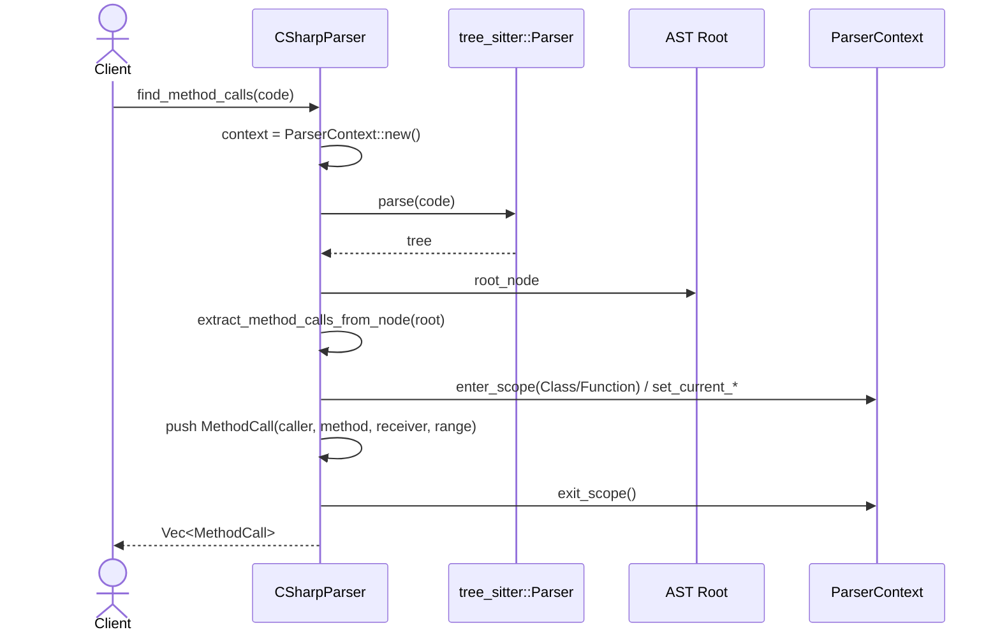

# parsing\csharp\parser.rs Review

## TL;DR

- 目的: **tree-sitter**でC#コードを解析し、**シンボル抽出**・**メソッド呼び出し検出**・**インターフェイス実装**・**using取り込み**などのコードインテリジェンスを提供
- 公開API: **CSharpParser::new**, **CSharpParser::parse**, および**LanguageParser**トレイトの各メソッド（find_calls, find_method_calls, find_implementations, find_variable_types, find_imports など）
- 複雑箇所: 深い**AST再帰走査**と**スコープ管理（ParserContext）**、シグネチャ抽出のための**本文除外**ロジック
- 安全性: **unsafe未使用**、文字列スライスのライフタイムを明示的に管理（戻り値はStringまたは&strで安全）。ただし**eprintln!**によるエラー処理は改善余地あり
- 重大リスク: **インターフェイス推定**が「先頭I」のヒューリスティック依存、**モジュールパスのネスト結合**が未考慮、**スコープ型の不整合**（ScopeType::Function vs ScopeType::function()）
- パフォーマンス: 全体は**O(N)**だが、**監査トラッキング**のための再帰登録が重複走査を増やす可能性。大規模ファイルでの**メモリ使用（HashSet）**に注意
- 未実装: **find_uses**と**find_defines**は未実装

## Overview & Purpose

本モジュールは、tree-sitter-c-sharp（ABI-14, 0.23.1）を用いてC#のASTを走査し、以下を抽出/検出します。

- シンボル抽出: クラス・インターフェイス・構造体・列挙・メソッド・プロパティ・フィールド・イベント・デリゲート・レコード
- メソッド呼び出し検出: 呼び出し元メソッド/クラスを正しく追跡するための**スコープ管理**を実装
- インターフェイス実装検出: base_listからインターフェイス名を抽出（ヒューリスティックあり）
- usingディレクティブ抽出: nameフィールドがない場合のフォールバック走査も実装
- ドキュメンテーションコメント: 直前の連続する「///」コメントを収集

制約:
- 型使用関係（find_uses）・定義関係（find_defines）は未実装
- フレームワーク外参照（System.Consoleなど）は特別扱いが必要（このチャンクには詳細なし）

## Structure & Key Components

| 種別 | 名前 | 公開範囲 | 責務 | 複雑度 |
|------|------|----------|------|--------|
| Struct | CSharpParser | pub | C#パーサの本体（Parser, ParserContext, NodeTrackingState保持） | Med |
| Trait impl | NodeTracker for CSharpParser | crate内公開（不明） | ノード監査用のkind/kind_id登録と参照 | Low |
| Trait impl | LanguageParser for CSharpParser | pub（トレイト経由） | 汎用解析API群（parse/find_*）の提供 | Med |
| Fn | create_symbol | private | Symbol生成（署名・doc・可視性・モジュールパス・スコープ） | Low |
| Fn | parse（inherent） | pub | 木全体の解析とシンボル列挙 | Med |
| Fn | extract_symbols_from_node | private | ASTマッチでシンボルを抽出（再帰） | High |
| Fn | extract_method_calls_from_node | private | スコープ管理を用いたメソッド呼出抽出 | Med |
| Fn | extract_calls_recursive | private | 文字列スライスベースの簡易呼出抽出 | Med |
| Fn | extract_implementations_from_node | private | base_listからの実装抽出 | Low |
| Fn | extract_imports_from_node | private | usingディレクティブ抽出 | Low |
| Fn | determine_visibility | private | 修飾子解析（public/private/protected/internal） | Low |
| Fn | extract_*_signature | private | 該当bodyノード手前までの署名切り出し | Low |
| Fn | find_variable_types_in_node | private | ローカル/宣言の型束縛抽出（再帰） | Med |
| Fn | extract_variable_bindings | private | var/明示型からの束縛抽出 | Med |
| Fn | extract_simple_type_name | private | qualified/generic対応の単純型名抽出 | Low |

Dependencies & Interactions

- 内部依存
  - parse → parser.parse → extract_symbols_from_node → process_*（class/interface/struct/enum/record/delegate/method/property/event/constructor/variable）→ create_symbol
  - extract_symbols_from_node → context.enter_scope/exit_scope → extract_*_members → process_*
  - find_method_calls → parser.parse → extract_method_calls_from_node（ParserContext使用）
  - find_calls → parser.parse → extract_calls_recursive（関数名コンテキストのみ）
  - find_implementations → parser.parse → extract_implementations_from_node
  - find_variable_types → parser.parse → find_variable_types_in_node → extract_variable_bindings → extract_type_from_initializer → extract_simple_type_name
  - find_imports → parser.parse → extract_imports_from_node
- 外部依存（主要）
  - tree_sitter::Parser, tree_sitter::Language, tree_sitter::Node（AST生成/走査）
  - tree_sitter_c_sharp::LANGUAGE（C#言語定義）
  - crate::parsing::{LanguageParser, ParserContext, ScopeType, NodeTrackingState, NodeTracker, MethodCall, Import}
  - crate::{FileId, Range, Symbol, SymbolKind, Visibility}
  - crate::types::SymbolCounter
- 被依存推定
  - コードインテリジェンスや関係グラフ生成モジュール（コールグラフ、実装関係）
  - ドキュメント/ナレッジ抽出（シンボル一覧、署名、可視性）
  - IDE支援機能（ジャンプ/参照/定義）におけるバックエンド

## API Surface (Public/Exported) and Data Contracts

| API名 | シグネチャ | 目的 | Time | Space |
|-------|-----------|------|------|-------|
| CSharpParser::new | `pub fn new() -> Result<Self, String>` | tree-sitterをC#言語で初期化 | O(1) | O(1) |
| CSharpParser::parse | `pub fn parse(&mut self, code: &str, file_id: FileId, symbol_counter: &mut SymbolCounter) -> Vec<Symbol>` | コードからシンボル抽出 | O(N) | O(S) |
| LanguageParser::parse | `fn parse(&mut self, code: &str, file_id: FileId, counter: &mut SymbolCounter) -> Vec<Symbol>` | トレイト経由のシンボル抽出 | O(N) | O(S) |
| LanguageParser::find_calls | `fn find_calls<'a>(&mut self, code: &'a str) -> Vec<(&'a str, &'a str, Range)>` | 関数名コンテキスト付きの呼出抽出（簡易） | O(N) | O(K) |
| LanguageParser::find_method_calls | `fn find_method_calls(&mut self, code: &str) -> Vec<MethodCall>` | スコープ/レシーバ情報つき呼出抽出 | O(N) | O(K) |
| LanguageParser::find_implementations | `fn find_implementations<'a>(&mut self, code: &'a str) -> Vec<(&'a str, &'a str, Range)>` | インターフェイス実装関係抽出 | O(N) | O(M) |
| LanguageParser::find_uses | `fn find_uses<'a>(&mut self, _code: &'a str) -> Vec<(&'a str, &'a str, Range)>` | 型使用関係抽出（未実装） | O(1) | O(1) |
| LanguageParser::find_defines | `fn find_defines<'a>(&mut self, _code: &'a str) -> Vec<(&'a str, &'a str, Range)>` | 定義関係抽出（未実装） | O(1) | O(1) |
| LanguageParser::find_variable_types | `fn find_variable_types<'a>(&mut self, code: &'a str) -> Vec<(&'a str, &'a str, Range)>` | ローカル変数→型の束縛抽出 | O(N) | O(B) |
| LanguageParser::find_imports | `fn find_imports(&mut self, code: &str, file_id: FileId) -> Vec<Import>` | usingディレクティブ抽出 | O(N) | O(U) |
| LanguageParser::extract_doc_comment | `fn extract_doc_comment(&self, node: &Node, code: &str) -> Option<String>` | 直前のXML docコメント収集 | O(L) | O(L) |
| LanguageParser::language | `fn language(&self) -> crate::parsing::Language` | 言語ID取得（CSharp） | O(1) | O(1) |
| LanguageParser::as_any | `fn as_any(&self) -> &dyn Any` | ダウンキャスト補助 | O(1) | O(1) |

注: N=ASTノード数, S=抽出シンボル数, K=呼出数, M=実装関係数, B=抽出束縛数, U=using数。exports=3は「CSharpParser」「new」「parse」を示唆。

各APIの詳細

1) CSharpParser::new
- 目的と責務
  - tree-sitter Parserの生成と言語設定（C#）
- アルゴリズム
  - Parser::new → LANGUAGE取得 → set_language → ParserContext/NodeTrackingState初期化
- 引数
  | 名前 | 型 | 説明 |
  |------|----|------|
  | なし | - | - |
- 戻り値
  | 型 | 説明 |
  |----|------|
  | Result<CSharpParser, String> | 初期化成功/失敗の文字列エラー |
- 使用例
  ```rust
  let mut parser = CSharpParser::new().expect("Failed to create parser");
  ```
- エッジケース
  - 言語設定失敗（set_languageエラー）→ Err(String)

2) CSharpParser::parse（inherent）
- 目的と責務
  - コードをAST化し、シンボル抽出
- アルゴリズム
  - ParserContextをリセット
  - parser.parse(code, None)
  - root_nodeからextract_symbols_from_nodeを再帰呼び出し
- 引数
  | 名前 | 型 | 説明 |
  |------|----|------|
  | code | &str | C#ソースコード |
  | file_id | FileId | ファイル識別子 |
  | symbol_counter | &mut SymbolCounter | シンボルID割当 |
- 戻り値
  | 型 | 説明 |
  |----|------|
  | Vec<Symbol> | 抽出されたシンボル群 |
- 使用例
  ```rust
  let file_id = FileId::new(1).unwrap();
  let mut counter = SymbolCounter::new();
  let symbols = parser.parse("class Foo { void Bar() {} }", file_id, &mut counter);
  ```
- エッジケース
  - 解析失敗（None）→ eprintln!で警告、空Vec返却

3) LanguageParser::find_calls
- 目的と責務
  - 関数名コンテキストを保持しつつ、呼び出しを抽出（簡易、レシーバ情報は限定）
- アルゴリズム
  - AST構築 → extract_calls_recursive(root, code, None, &mut calls)
- 引数
  | 名前 | 型 | 説明 |
  |------|----|------|
  | code | &'a str | C#コード |
- 戻り値
  | 型 | 説明 |
  |----|------|
  | Vec<(&'a str, &'a str, Range)> | (caller, callee, 範囲) |
- 使用例
  ```rust
  let calls = parser.find_calls(code);
  for (from, to, range) in calls { /* ... */ }
  ```
- エッジケース
  - メソッド名が取得できない場合 "Unknown"や空文字でのコンテキストになり得る

4) LanguageParser::find_method_calls
- 目的と責務
  - ParserContextによる厳密なスコープ追跡、レシーバ（this/obj）も付加
- アルゴリズム
  - ParserContextをリセット → AST構築 → extract_method_calls_from_node再帰
- 引数
  | 名前 | 型 | 説明 |
  |------|----|------|
  | code | &str | C#コード |
- 戻り値
  | 型 | 説明 |
  |----|------|
  | Vec<MethodCall> | caller, method_name, receiver, range |
- 使用例
  ```rust
  let calls = parser.find_method_calls(code);
  assert!(calls.iter().any(|c| c.caller == "Process" && c.method_name == "Save"));
  ```
- エッジケース
  - プロパティアクセサ内呼出が「プロパティ名」をcallerとする可能性

5) LanguageParser::find_implementations
- 目的と責務
  - class/struct/recordのbase_listから「インターフェイス実装」関係を抽出
- アルゴリズム
  - AST構築 → extract_implementations_from_node（識別子/generic名・先頭Iヒューリスティック）
- 引数/戻り値は表の通り
- 使用例
  ```rust
  let impls = parser.find_implementations(code);
  assert!(impls.iter().any(|(c,i,_)| *c == "ConsoleLogger" && *i == "ILogger"));
  ```
- エッジケース
  - 「I」始まりヒューリスティック誤検出/見落とし

6) LanguageParser::find_variable_types
- 目的と責務
  - ローカル/宣言の変数名→型名の束縛抽出（new/明示型のみ）
- アルゴリズム
  - AST構築 → find_variable_types_in_node → extract_variable_bindings（initializer優先→明示型）
- 使用例
  ```rust
  let bindings = parser.find_variable_types(code);
  // ("helper", "Helper", range) 等が得られる
  ```
- エッジケース
  - `var x = 5`などは型推論不可→スキップ

7) LanguageParser::find_imports
- 目的と責務
  - using_directiveの抽出（nameフィールド/qualified_nameフォールバック）
- 使用例
  ```rust
  let imports = parser.find_imports(code, file_id);
  assert!(imports.iter().any(|i| i.path == "System"));
  ```

8) LanguageParser::extract_doc_comment, language, as_any
- extract_doc_commentは内部メソッド委譲（連続「///」抽出）
- languageは固定でCSharp
- as_anyはダウンキャスト用途

データ契約（Symbolの構築）
- create_symbolは以下のフィールドを設定
  - id, name, kind, file_id, range
  - signature（任意）, doc_comment（任意）, module_path（任意）
  - visibility
  - scope_context = current_scope_context（ParserContext由来）

## Walkthrough & Data Flow

- シンボル抽出の流れ
  1. CSharpParser::parseがcontextをリセットし、AST構築
  2. root_nodeからextract_symbols_from_nodeが**match**でノード種別に応じた処理
  3. namespaceでmodule_pathを更新し、子を再帰処理
  4. class/interface/struct/record/enum/delegateなどをprocess_*でSymbol化
  5. メソッド/コンストラクタ/プロパティ/イベント/フィールド/ローカル変数にも対応
  6. class/struct/recordでは**スコープに入って**メンバー抽出し、終了時に**スコープから退出**
- メソッド呼び出し抽出
  - find_calls: 呼出元関数名（識別子）を推移させながらinvocation_expressionを捕捉
  - find_method_calls: ParserContextを用い、callerはcurrent_functionまたはcurrent_class、member_accessのreceiverを抽出（this/obj）
- 変数型束縛
  - find_variable_types: variable_declaration/local_declaration_statementを再帰探索。initializerがobject_creation_expressionなら型ノードから単純型名抽出。なければ明示型を使用（varは除外）

Mermaid図（主要分岐: extract_symbols_from_node）

```mermaid
flowchart TD
  A[extract_symbols_from_node(node)] --> B{node.kind}
  B -->|namespace_declaration / file_scoped_namespace_declaration| NS[extract_namespace_name → 再帰処理 with module_path]
  B -->|class_declaration| C[register_node_recursively → process_class → enter Class scope → extract_class_members → exit]
  B -->|interface_declaration| I[register_node_recursively → process_interface → enter Class scope → extract_interface_members → exit]
  B -->|struct_declaration| S[register_node_recursively → process_struct → enter Class scope → extract_class_members → exit]
  B -->|enum_declaration| E[register_node_recursively → process_enum → extract_enum_members]
  B -->|record_declaration| R[register_node_recursively → process_record → enter Class scope → extract_class_members → exit]
  B -->|delegate_declaration| D[register_node_recursively → process_delegate]
  B -->|method_declaration| M[register_node_recursively → process_method → enter Function scope → extract_method_body → exit]
  B -->|local_function_statement| LF[process_local_function]
  B -->|field_declaration| FD[process_field_declaration]
  B -->|property_declaration| PD[process_property]
  B -->|event_*| EV[process_event]
  B -->|constructor_declaration| CT[process_constructor]
  B -->|variable_declaration / local_declaration_statement| VD[process_variable_declaration]
  B -->|default| DEF[register_handled_node → 子を再帰]
```

上記の図は`extract_symbols_from_node`関数（行番号不明）の主要分岐を示す。

Mermaid図（シーケンス: find_method_calls）



上記の図は`find_method_calls`関数（行番号不明）の主要ステップを示す。

## Complexity & Performance

- 時間計算量
  - parse（シンボル抽出）: O(N)（ASTノード総数）
  - find_calls: O(N)
  - find_method_calls: O(N)
  - find_implementations: O(N)
  - find_variable_types: O(N)
  - find_imports: O(N)
- 空間計算量
  - シンボル抽出: O(S)（見つかったシンボル数）
  - 呼出/実装/束縛/インポート結果: O(K/M/B/U)
  - NodeTrackingState（HashSet）: O(H)（登録ノード数）
- ボトルネック・スケール限界
  - register_node_recursivelyをタイプ宣言ごとに呼び出すため、同一サブツリーを複数回登録する可能性→大規模クラスでオーバーヘッド増
  - 文字列抽出で度々to_string/trimを行う→多数の割り当て
  - eprintln!ベースのエラー処理（非構造）→本番でノイズ、再試行・フォールバック戦略なし
- 実運用負荷要因
  - I/Oなし（メモリ内処理）が中心だが、大ファイルではAST走査がCPU負荷
  - tree-sitterのパーサ（同期）をスレッド共有する設計ではない。並列化はインスタンス分離で対処が必要

## Edge Cases, Bugs, and Security

エッジケース一覧

| エッジケース | 入力例 | 期待動作 | 実装 | 状態 |
|-------------|--------|----------|------|------|
| ネームスペース名がフィールドにない | `namespace { ... }` | 無名は空module_pathで継続 | extract_namespace_nameのフォールバック | 部分 |
| メソッド識別子欠落 | `void (int x) {}` | "Unknown"扱いまたはスキップ | extract_method_calls_from_nodeで"Unknown"にフォールバック | 部分 |
| invocation_expressionの複合式 | `(a?.b())` | callee抽出・receiverの安全化 | member_access_expression対応、その他は生テキスト | 部分 |
| varだが型推論不可 | `var x = 5` | 束縛を作成しない | extract_variable_bindingsでvarをスキップ | 実装済 |
| qualified/generic型名 | `System.A.B<T>` | 単純型名は`B`、明示型は全文 | extract_simple_type_name / 明示型は全文 | 実装済 |
| ドキュメントコメント前に非docコメント | `// ...\n/// ...\nclass ...` | 「///」連続のみ収集、非docで打ち切り | extract_doc_comment | 実装済 |
| protected internal | `protected internal ...` | Visibilityの正確な表現 | protected/internalはVisibility::Moduleへ近似 | 部分 |
| レコード | `record Person(...)` | クラス相当で抽出 | process_recordでSymbolKind::Class | 実装済 |
| usingのname不整合 | `using A.B;`（name無） | qualified_name/identifierで抽出 | extract_imports_from_nodeフォールバック | 実装済 |
| メソッドのローカル関数 | `void M(){ void L(){} }` | ローカル関数をFunctionとして抽出 | process_local_function | 実装済 |

セキュリティチェックリスト

- メモリ安全性
  - Buffer overflow: 文字列スライスはtree-sitterのbyte_rangeに依存→Rustの範囲チェックで安全
  - Use-after-free: なし（&strはcodeのライフタイムに束縛）
  - Integer overflow: 行/列はu32/u16にキャスト。極端な行/列でのオーバーフローは可能性低（tree-sitterの位置型に準拠）
- インジェクション
  - SQL/Command/Path traversal: 該当なし（解析のみ）
- 認証・認可
  - 該当なし
- 秘密情報
  - Hard-coded secrets: なし
  - Log leakage: eprintln!にコード断片は出力しないが、運用では抑制・構造化ログ推奨
- 並行性
  - Race condition / Deadlock: 該当なし（同期処理）
  - ParserのSend/Sync境界: 不明（tree_sitter::ParserのSyncは一般に保証されないことが多い）。共有は避け、スレッドごとにインスタンス化を推奨

Rust特有の観点（詳細）

- 所有権
  - Symbol生成時にnameやsignature/docをString化し所有権移動（create_symbol: 行番号不明）
- 借用/ライフタイム
  - find_calls, find_variable_typesなどは`Vec<(&'a str, &'a str, Range)>`の形でcodeライフタイムに紐付け。呼び出し側がcodeの生存を保証すれば安全
- unsafe境界
  - unsafe未使用
- 並行性・非同期
  - 非同期処理なし。ParserやContextは可変参照で使用、共有状態はCSharpParserインスタンス内に閉じる
- エラー設計
  - newはResult返却で適切
  - parse失敗時はeprintln!のみでResult非返却→改善余地
  - unwrap/expectはテストでのみ使用

既知/潜在バグ

- インターフェイス実装検出のヒューリスティック
  - `I`始まりのみをインターフェイスとするのは誤検出・漏れの可能性が高い（extract_implementations_from_node）
- スコープ型の不整合
  - `ScopeType::Function { hoisting: false }`と`ScopeType::function()`の二系統呼び出しが混在（extract_symbols_from_nodeとextract_method_calls_from_node）→ API不整合の可能性（このチャンクではScopeType詳細は不明）
- モジュールパスのネスト結合
  - 複数namespaceの入れ子時に結合が行われず（例: A内のBは"A.B"にする必要）現状は上書き（extract_symbols_from_node）→ 改善余地
- 監査の重複走査
  - register_node_recursivelyを宣言ごとに呼ぶため、同サブツリーの複数回登録がコスト増に繋がる可能性
- 可視性近似
  - `protected`/`internal`をVisibility::Moduleに丸めるため正確性に欠ける（要求仕様次第）

## Design & Architecture Suggestions

- 可視性モデルの拡張
  - Visibilityに`Protected`/`Internal`/`ProtectedInternal`/`PrivateProtected`を導入し、C#に忠実な表現へ
- スコープAPIの統一
  - ScopeType::Function/ScopeType::function() の統一、enter/exitのペア保証（RAII-style guard）
- モジュールパスのネスト結合
  - `module_path`に対して親子namespaceを`.`で連結（例: A内Bは"A.B"）
- インターフェイス検出の精度向上
  - base_listでクラス（class）とインターフェイスを構文的に区別（tree-sitterの型ノード種別を利用）。名前先頭のヒューリスティック依存を排除
- 署名抽出の改善
  - extract_signature_excluding_bodyでコメント・属性・トリビア（空白）の取り扱い改善、正規化（スペース正規化）
- エラー処理
  - eprintln!ではなくResult/専用Error型で返却し、上位層でハンドリング（ログ・再試行）
- パフォーマンス
  - register_node_recursivelyの呼び出し頻度削減 or NodeTrackingStateを必要箇所のみに限定
  - 文字列割り当ての削減（可能なら&str維持、Symbolが参照を許容する設計に変更）

## Testing Strategy (Unit/Integration) with Examples

- 既存テスト
  - インターフェイス実装検出、メソッド呼出（簡易/厳密）、enum抽出、docコメント抽出
- 追加ユニットテスト提案
  - ネストnamespace
    ```rust
    #[test]
    fn nested_namespace_module_path() {
        let code = r#"namespace A { namespace B { class C{} } }"#;
        // 期待: Cのmodule_pathが"A.B"
        // 実装: 現状は最後のnamespaceのみ → 改善後テスト
    }
    ```
  - protected/internal/複合可視性
    ```rust
    #[test]
    fn visibility_protected_internal() {
        let code = r#"class X { protected internal void M(){} }"#;
        // 期待: ProtectedInternal
    }
    ```
  - レコード・ジェネリック
    ```rust
    #[test]
    fn record_generic_signature() {
        let code = r#"public record Box<T>(T Value);"#;
        // 署名からrecord_body除外の確認
    }
    ```
  - メンバーアクセスのreceiver抽出
    ```rust
    #[test]
    fn method_calls_with_receiver() {
        let code = r#"class A { void M(){ obj.Do(); this.Run(); } void Do(){} void Run(){} }"#;
        let calls = parser.find_method_calls(code);
        assert!(calls.iter().any(|c| c.method_name=="Do" && c.receiver=="obj"));
        assert!(calls.iter().any(|c| c.method_name=="Run" && c.receiver=="this"));
    }
    ```
  - 変数型束縛（var + new, 明示型）
    ```rust
    #[test]
    fn variable_type_bindings() {
        let code = r#"void M(){ var h = new Helper(); IService s = factory.Create(); }"#;
        let bindings = parser.find_variable_types(code);
        assert!(bindings.iter().any(|(n,t,_)| *n=="h" && *t=="Helper"));
        assert!(bindings.iter().any(|(n,t,_)| *n=="s" && *t=="IService"));
    }
    ```
- 統合テスト
  - 大規模ファイルでのパフォーマンステスト（ノード数ベースの時間計測）
  - 解析結果の関係グラフ生成（コール→実装→シンボル整合性）

## Refactoring Plan & Best Practices

- スコープガード導入
  - enter_scope/exit_scopeをRAIIガードで安全化（panic時でも退出保証）
- Symbol Builder
  - create_symbolの責務拡張とビルダーパターン適用でフィールド設定の一貫性確保
- 文字列扱いの最適化
  - 可能箇所は&strを維持、必要時のみString化
- クエリ利用
  - tree-sitterのQueryを使い、特定パターン抽出（メソッド呼出・base_listなど）を宣言的に
- エラー型
  - `thiserror`など導入してエラー階層化（ParseError, LanguageSetErrorなど）
- ロギング
  - eprintln!を`log`/`tracing`に変更
- 可視性型の拡張
  - C#対応の詳細バリアントを導入

## Observability (Logging, Metrics, Tracing)

- ログ
  - 解析開始/終了、ノード総数、抽出シンボル数、失敗時のエラー詳細を`log`で記録
- メトリクス
  - 処理時間（parse/find_*ごと）
  - ノード種別別のカウント（NodeTrackerのHashSetを活用し集計）
  - 再帰深さの最大値（check_recursion_depthの閾値ヒット数）
- トレーシング
  - `tracing`でスパン（parse → extract_symbols_from_node → process_*）を付与し、ホットスポットを可視化

## Risks & Unknowns

- Grammar更新リスク
  - tree-sitter-c-sharp（ABI-14）のノード/フィールド変更で抽出ロジック破綻の可能性
- ScopeTypeのAPI不整合
  - `ScopeType::Function { hoisting: false }`と`ScopeType::function()`の混在（このチャンクには詳細定義なし）。将来的な破壊的変更の可能性
- インターフェイス検出ヒューリスティック
  - 先頭I問題による誤検出/漏れ（フレームワーク型との衝突）
- モジュールパスの階層化未対応
  - 入れ子namespaceの正確なパス確立が必要
- 送受信境界
  - tree_sitter::ParserのSend/Syncは不明。並列処理設計時に考慮必須
- 未実装機能
  - find_uses, find_definesの仕様が曖昧（このチャンクには現れない）。導入時の関係モデル調整が必要

コード抜粋（短関数）

```rust
fn determine_visibility(&self, node: Node, code: &str) -> Visibility {
    let mut cursor = node.walk();
    for child in node.children(&mut cursor) {
        if child.kind() == "modifier" {
            let modifier_text = &code[child.byte_range()];
            if modifier_text.contains("public") {
                return Visibility::Public;
            } else if modifier_text.contains("private") {
                return Visibility::Private;
            } else if modifier_text.contains("protected") {
                return Visibility::Module; // Closest approximation
            } else if modifier_text.contains("internal") {
                return Visibility::Module;
            }
        }
    }

    match self.context.current_scope_context() {
        crate::symbol::ScopeContext::ClassMember => Visibility::Private,
        _ => Visibility::Module,
    }
}
```

改善提案: `protected`, `internal`の厳密な区別（Protected, Internal, ProtectedInternal, PrivateProtected）をVisibilityに追加。