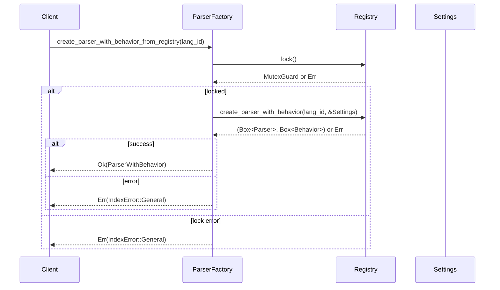

# factory.rs Review

## TL;DR

- 目的: 言語レジストリと設定に基づいて、言語ごとのパーサーと振る舞いを生成する工場クラスを提供
- 公開API: ParserFactoryの10メソッド（registry系/legacy系）、ParserWithBehavior構造体
- 複雑箇所: 多分岐のmatch（legacy）、グローバルレジストリのMutexロック取得と有効判定、エラーの整形・ラップ
- 重大リスク:
  - legacyのTypeScript未実装とbehavior付きでは実装済みという不整合
  - enabled_languagesがCSharp/Kotlinを含まず、create_parserでは対応済みという不整合
  - registryロックでunwrap使用箇所あり（パニックリスク）
  - 異なるロック失敗時の扱い（false/None返却 vs エラー変換）の不整合
- スレッド安全性: Arc<Settings>で共有し、レジストリはMutex保護。戻り値のBox<dyn LanguageParser>にSend/Sync境界はなく、並行利用設計は「不明」
- エラー設計: IndexError::ConfigError 及び Generalの汎用ラップが中心。詳細原因の喪失懸念あり

## Overview & Purpose

このファイルは、設定（Settings）とグローバル言語レジストリを用いて、各言語のパーサー（LanguageParser）とその特性挙動（LanguageBehavior）を生成・提供するための工場（ParserFactory）を定義します。目的は以下の通りです。

- 言語有効/無効の設定に基づく安全なインスタンシエーション
- レジストリベースの拡張可能な生成経路と、既存のlegacy経路の並行提供
- ファイル拡張子から言語IDを逆引きする機能
- 振る舞い（Behavior）だけの生成
- 有効言語リストの取得（ただし現実装は静的で一部不整合あり）

この設計により、ハードコードされた言語分岐から、レジストリ定義に基づく柔軟な運用へ段階的移行する意図が読み取れます（根拠: ParserFactoryのregistry系メソッド群、コメント「migration」; 行番号: 不明）。

## Structure & Key Components

| 種別 | 名前 | 公開範囲 | 責務 | 複雑度 |
|------|------|----------|------|--------|
| Struct | ParserWithBehavior | pub | パーサーと対応する言語挙動のペアを保持 | Low |
| Struct | ParserFactory | pub | 設定を保持し、レジストリ/legacy経路でパーサーと挙動を生成 | Med |
| Function | ParserFactory::new | pub | Settings（Arc）からファクトリ生成 | Low |
| Function | create_parser_from_registry | pub | レジストリで言語IDからパーサー生成 | Med |
| Function | create_parser_with_behavior_from_registry | pub | レジストリでパーサー+挙動のペア生成 | Med |
| Function | is_language_enabled_in_registry | pub | レジストリと設定で言語の有効判定 | Low |
| Function | get_language_for_extension | pub | 拡張子から対応言語IDの取得（設定の有効性も確認） | Med |
| Function | create_parser | pub | legacy: Language列挙体でパーサー生成（有効判定あり） | High |
| Function | is_language_enabled | pub | legacy: 設定mapから有効判定 | Low |
| Function | create_parser_with_behavior | pub | legacy: パーサー+挙動のペア生成（有効判定あり） | High |
| Function | create_behavior_from_registry | pub | レジストリから挙動のみ生成（ロックunwrap） | Low |
| Function | enabled_languages | pub | 静的配列から有効言語リスト生成（設定に基づくフィルタ） | Low |

### Dependencies & Interactions

- 内部依存
  - ParserFactoryはArc<Settings>を保持し、全メソッドで参照
  - registry系メソッドはget_registry() → Mutexロック → 定義からcreate_*を呼ぶ
  - legacy系メソッドはLanguageのmatchで各言語のParser/BehaviorをnewしてBox詰め

- 外部依存（推奨: 表）
  | 依存名 | 種別 | 用途 |
  |--------|------|------|
  | super::{...多言語Parser/Behavior...} | モジュール | 各言語の具体的Parser/Behavior型 |
  | super::{Language, LanguageId, LanguageParser, LanguageBehavior} | モジュール | 抽象インターフェース・列挙・ID |
  | super::get_registry | 関数 | グローバル言語レジストリアクセス（Mutex） |
  | crate::{IndexError, IndexResult, Settings} | 型/エラー | 設定/結果型/エラー |
  | std::sync::Arc | 標準 | 設定共有のための参照カウント型 |

- 被依存推定
  - インデクサ/解析パイプラインの初期化コード
  - ファイル拡張子→言語判定を行う事前処理
  - 言語別ルール（Behavior）に基づく構造化抽出/リンク生成部分

## API Surface (Public/Exported) and Data Contracts

| API名 | シグネチャ | 目的 | Time | Space |
|-------|------------|------|------|-------|
| ParserWithBehavior | struct { parser: Box<dyn LanguageParser>, behavior: Box<dyn LanguageBehavior> } | パーサーと挙動のペア | O(1) | O(1) |
| ParserFactory::new | fn new(settings: Arc<Settings>) -> Self | 工場の生成 | O(1) | O(1) |
| create_parser_from_registry | fn create_parser_from_registry(&self, language_id: LanguageId) -> IndexResult<Box<dyn LanguageParser>> | レジストリベースでパーサー生成 | O(1) + lock | O(1) |
| create_parser_with_behavior_from_registry | fn create_parser_with_behavior_from_registry(&self, language_id: LanguageId) -> IndexResult<ParserWithBehavior> | レジストリでパーサー+挙動生成 | O(1) + lock | O(1) |
| is_language_enabled_in_registry | fn is_language_enabled_in_registry(&self, language_id: LanguageId) -> bool | レジストリ+設定で有効判定 | O(1) + lock | O(1) |
| get_language_for_extension | fn get_language_for_extension(&self, extension: &str) -> Option<LanguageId> | 拡張子から言語ID取得（有効性フィルタ） | O(1) 〜 不明 | O(1) |
| create_parser | fn create_parser(&self, language: Language) -> IndexResult<Box<dyn LanguageParser>> | legacy: Languageでパーサー生成（有効判定） | O(1) | O(1) |
| is_language_enabled | fn is_language_enabled(&self, language: Language) -> bool | legacy: 設定mapで有効判定 | O(1) | O(1) |
| create_parser_with_behavior | fn create_parser_with_behavior(&self, language: Language) -> IndexResult<ParserWithBehavior> | legacy: パーサー+挙動生成（有効判定） | O(1) | O(1) |
| create_behavior_from_registry | fn create_behavior_from_registry(&self, language_id: LanguageId) -> Box<dyn LanguageBehavior> | レジストリから挙動のみ生成（言語未登録時はデフォルト） | O(1) + lock | O(1) |
| enabled_languages | fn enabled_languages(&self) -> Vec<Language> | 静的配列を設定でフィルタした有効言語列挙 | O(n)（n=静的配列長） | O(n) |

注意: get_language_for_extensionの計算量はレジストリ実装に依存（HashMapならO(1)、線形探索ならO(n)）。このチャンクにはレジストリ内部実装がないため「不明」。

以下、主要APIごとの詳細です。

### ParserFactory::new

1. 目的と責務
   - 設定（Arc<Settings>）を受け取り、スレッド間共有可能なファクトリを生成します。
2. アルゴリズム
   - 引数を構造体フィールドに代入するのみ。
3. 引数
   | 名前 | 型 | 説明 |
   |------|----|------|
   | settings | Arc<Settings> | 共有設定 |
4. 戻り値
   | 型 | 説明 |
   |----|------|
   | Self | 新しいファクトリ |
5. 使用例
   ```rust
   use std::sync::Arc;
   let settings = Arc::new(Settings::default());
   let factory = ParserFactory::new(settings);
   ```
6. エッジケース
   - 特になし（O(1)、所有権はArcのクローン）

### create_parser_from_registry

1. 目的と責務
   - レジストリから言語定義を取得し、設定に基づいてパーサーを生成。
2. アルゴリズム
   - get_registry() → lock() → create_parser(language_id, &settings) → エラーをIndexError::Generalへ変換
3. 引数
   | 名前 | 型 | 説明 |
   |------|----|------|
   | language_id | LanguageId | 言語ID（例: "rust"） |
4. 戻り値
   | 型 | 説明 |
   |----|------|
   | IndexResult<Box<dyn LanguageParser>> | 成功時パーサー、失敗時IndexError |
5. 使用例
   ```rust
   let rust_id = LanguageId::new("rust");
   let parser = factory.create_parser_from_registry(rust_id)?;
   ```
6. エッジケース
   - レジストリロック失敗 → IndexError::Generalで返却
   - 未登録言語 → レジストリ側のエラーをGeneralにラップ

### create_parser_with_behavior_from_registry

1. 目的と責務
   - レジストリからパーサーと挙動をペアで生成。
2. アルゴリズム
   - get_registry() → lock() → create_parser_with_behavior(language_id, &settings) → 両者をParserWithBehaviorに詰める
3. 引数・戻り値
   | 名前/型 | 説明 |
   |---------|------|
   | language_id: LanguageId | 言語ID |
   | IndexResult<ParserWithBehavior> | 成功時ペア、失敗時IndexError |
5. 使用例
   ```rust
   let python_id = LanguageId::new("python");
   let pair = factory.create_parser_with_behavior_from_registry(python_id)?;
   ```
6. エッジケース
   - ロック失敗、未登録言語 → Generalにラップ

### is_language_enabled_in_registry

1. 目的と責務
   - レジストリと設定の両方を用いて有効判定。
2. アルゴリズム
   - get_registry() → lock() → is_enabled(language_id, &settings)
   - ロック失敗ならfalse
3. 引数・戻り値
   | 名前/型 | 説明 |
   |---------|------|
   | language_id: LanguageId | 言語ID |
   | bool | 有効/無効 |
5. 使用例
   ```rust
   assert!(factory.is_language_enabled_in_registry(LanguageId::new("rust")));
   ```
6. エッジケース
   - ロック失敗時はfail-closed（false）

### get_language_for_extension

1. 目的と責務
   - 拡張子から言語IDを取得し、設定で有効なもののみ返却。
2. アルゴリズム
   - get_registry() → lock() → get_by_extension(ext) → def.is_enabled(&settings)ならSome(def.id())
   - ロック失敗時はNone
3. 引数・戻り値
   | 名前/型 | 説明 |
   |---------|------|
   | extension: &str | ファイル拡張子（例: "rs"） |
   | Option<LanguageId> | 判定結果 |
5. 使用例
   ```rust
   assert_eq!(factory.get_language_for_extension("rs"), Some(LanguageId::new("rust")));
   ```
6. エッジケース
   - 未知拡張子 → None
   - ロック失敗 → None

### create_parser（legacy）

1. 目的と責務
   - Language列挙で分岐し、設定で有効ならパーサーを生成。無効ならConfigError。
2. アルゴリズム
   - settings.languages.get(lang.config_key())でenabled確認
   - match language { Rust/Python/Php/Go/C/Cpp/CSharp/Gdscript/Kotlin: new()、JavaScript/TypeScript: Err(未実装) }
3. 引数・戻り値
   | 名前/型 | 説明 |
   |---------|------|
   | language: Language | 言語列挙 |
   | IndexResult<Box<dyn LanguageParser>> | 成否 |
5. 使用例
   ```rust
   let parser = factory.create_parser(Language::Rust)?;
   ```
6. エッジケース
   - 無効言語 → ConfigError（明示）
   - JavaScript/TypeScript → General(未実装)（不整合あり、後述）

### is_language_enabled（legacy）

1. 目的と責務
   - 設定mapから言語有効を取得。未登録はfalse。
2. アルゴリズム
   - settings.languages.get(key).map(|c| c.enabled).unwrap_or(false)
3. 引数・戻り値
   | 名前/型 | 説明 |
   |---------|------|
   | language: Language | 言語列挙 |
   | bool | 有効/無効 |
5. 使用例
   ```rust
   if factory.is_language_enabled(Language::Python) { /* ... */ }
   ```
6. エッジケース
   - 未登録 → false（fail-safe）

### create_parser_with_behavior（legacy）

1. 目的と責務
   - 言語有効判定の後、パーサーと挙動をペア生成。
2. アルゴリズム
   - enabledチェック → matchで各言語のParser/Behavior new & Box詰め
3. 引数・戻り値
   | 名前/型 | 説明 |
   |---------|------|
   | language: Language | 言語列挙 |
   | IndexResult<ParserWithBehavior> | 成否 |
5. 使用例
   ```rust
   let pair = factory.create_parser_with_behavior(Language::Php)?;
   assert_eq!(pair.behavior.module_separator(), "\\");
   ```
6. エッジケース
   - 無効言語 → ConfigError
   - JavaScript → General(未実装)
   - TypeScript → 実装済み（legacy create_parserとの不整合）

### create_behavior_from_registry

1. 目的と責務
   - レジストリから挙動のみ生成。未登録ならRustBehaviorを返す。
2. アルゴリズム
   - get_registry().lock().unwrap() → get(language_id) → Someならcreate_behavior()、NoneならRustBehavior
3. 引数・戻り値
   | 名前/型 | 説明 |
   |---------|------|
   | language_id: LanguageId | 言語ID |
   | Box<dyn LanguageBehavior> | 挙動 |
5. 使用例
   ```rust
   let behavior = factory.create_behavior_from_registry(LanguageId::new("rust"));
   ```
6. エッジケース
   - ロック失敗時はunwrapによりpanic（重大）

### enabled_languages

1. 目的と責務
   - 静的配列（Rust/Python/JavaScript/TypeScript/Php/Go/C/Cpp/Gdscript）を設定に基づきフィルタ。
2. アルゴリズム
   - vec![...] → filter(|lang| is_language_enabled(lang)) → collect()
3. 引数・戻り値
   | 型 | 説明 |
   |----|------|
   | () | 引数なし |
   | Vec<Language> | 有効言語一覧 |
5. 使用例
   ```rust
   let enabled = factory.enabled_languages();
   ```
6. エッジケース
   - 設定未登録の言語は除外。CSharp/Kotlinが静的配列に無く、他のAPIと不整合。

## Walkthrough & Data Flow

- レジストリ経路（例: create_parser_with_behavior_from_registry）
  1. get_registry()でグローバルレジストリの参照を取得
  2. Mutexをlock
  3. registry.create_parser_with_behavior(language_id, &settings)を呼ぶ
  4. (parser, behavior)タプルを受け取り、ParserWithBehaviorへ詰めて返却

- legacy経路（例: create_parser）
  1. language.config_key()でキーを取得
  2. settings.languagesからenabledを確認
  3. enabled=falseならIndexError::ConfigErrorを返す
  4. match languageで各Parser::new()を呼び、Box<dyn LanguageParser>に包んで返却
  5. 未実装言語（JavaScript/TypeScript）ではGeneralエラーを返却

### Mermaid（条件分岐が多いlegacy関数）

```mermaid
flowchart TD
    A[create_parser(language)] --> B{settings.languages[config_key].enabled?}
    B -- false --> E[Err(ConfigError: disabled)]
    B -- true --> C{match language}
    C -- Rust --> R[Ok(Box<RustParser>)]
    C -- Python --> P[Ok(Box<PythonParser>)]
    C -- Php --> H[Ok(Box<PhpParser>)]
    C -- Go --> G[Ok(Box<GoParser>)]
    C -- C --> CC[Ok(Box<CParser>)]
    C -- Cpp --> CP[Ok(Box<CppParser>)]
    C -- CSharp --> CS[Ok(Box<CSharpParser>)]
    C -- Gdscript --> GD[Ok(Box<GdscriptParser>)]
    C -- Kotlin --> K[Ok(Box<KotlinParser>)]
    C -- JavaScript --> J[Err(General: not implemented)]
    C -- TypeScript --> T[Err(General: not implemented)]
```

上記の図は`create_parser`関数の主要分岐を示す（行番号: 不明）。

```mermaid
flowchart TD
    A[create_parser_with_behavior(language)] --> B{enabled?}
    B -- false --> E[Err(ConfigError)]
    B -- true --> C{match language}
    C -- Rust --> R[[Box<RustParser>, Box<RustBehavior>]]
    C -- Python --> P[[Box<PythonParser>, Box<PythonBehavior>]]
    C -- Php --> H[[Box<PhpParser>, Box<PhpBehavior>]]
    C -- TypeScript --> TS[[Box<TypeScriptParser>, Box<TypeScriptBehavior>]]
    C -- JavaScript --> J[Err(General)]
    C -- Go --> G[[Box<GoParser>, Box<GoBehavior>]]
    C -- C --> Cc[[Box<CParser>, Box<CBehavior>]]
    C -- Cpp --> Cp[[Box<CppParser>, Box<CppBehavior>]]
    C -- CSharp --> Cs[[Box<CSharpParser>, Box<CSharpBehavior>]]
    C -- Gdscript --> Gd[[Box<GdscriptParser>, Box<GdscriptBehavior>]]
    C -- Kotlin --> Ko[[Box<KotlinParser>, Box<KotlinBehavior>]]
```

上記の図は`create_parser_with_behavior`関数の主要分岐を示す（行番号: 不明）。

### Mermaid（3アクターのシーケンス：レジストリ経路）



上記の図は`create_parser_with_behavior_from_registry`関数の主なデータフローを示す（行番号: 不明）。

## Complexity & Performance

- 時間計算量
  - ほぼ全APIはO(1)。レジストリロック取得はO(1)ですが、スレッド競合で待機が発生しうる。
  - get_language_for_extensionの内部はレジストリ実装依存（HashMapならO(1)、配列線形検索ならO(n)）。このチャンクには現れない。
- 空間計算量
  - 返却するBox/Vec程度でO(1)〜O(n)（enabled_languagesはn=静的配列長）。
- ボトルネック
  - グローバルレジストリのMutexロック。高頻度なcreate_*呼び出しでコンテンドが起きうる。
- スケール限界
  - 多言語追加時、legacyのmatch拡張が保守負荷に。レジストリ移行が推奨。
- 実運用負荷要因
  - I/Oなし。主に同期ロック待機が影響し得る。

## Edge Cases, Bugs, and Security

- 既知/推定エッジケース（詳細表）

| エッジケース | 入力例 | 期待動作 | 実装 | 状態 |
|-------------|--------|----------|------|------|
| 言語が設定で無効 | Language::Rust (enabled=false) | ConfigErrorでエラー | create_parser / create_parser_with_behaviorで明示チェック | OK |
| 未登録拡張子 | "unknown" | None返却 | get_language_for_extensionでNone | OK |
| レジストリロック失敗（poison） | 任意 | Err/None/falseで安全に失敗 | registry系で場所によりGeneral/false/None | 改善余地（不統一） |
| レジストリロックunwrapによるpanic | 任意 | パニック回避し、安全にエラー返却 | create_behavior_from_registryでunwrap | 不具合（高） |
| legacyのTypeScript不整合 | Language::TypeScript | 実装済み/未実装の一貫性 | create_parserは未実装、create_parser_with_behaviorは実装済み | 不具合（中） |
| enabled_languagesの不整合 | CSharp/Kotlin | 有効言語列挙に含まれるべき | 静的配列に欠落 | 不具合（中） |
| JavaScriptの未実装 | Language::JavaScript | 実装なければ明確なエラー | legacyでGeneral(未実装) | 要対応 |
| レジストリ未登録言語の挙動 | language_id未登録 | 明確なエラー | 挙動のみ生成でRustBehaviorにフォールバック | 設計上疑問（中） |
| エラー詳細の喪失 | 各new()/registryエラー | 原因を保全 | e.to_string()でGeneralへラップ | 改善余地 |

- セキュリティチェックリスト
  - メモリ安全性: unsafeブロックは「該当なし」。Box/Arc使用は安全。
  - インジェクション: SQL/Command/Pathは「該当なし」。
  - 認証・認可: 「該当なし」。
  - 秘密情報: ハードコードシークレット/ログ漏えい「該当なし」。
  - 並行性: Mutexロックpoison時のunwrapパニック、lockエラーの扱い不統一。レースやデッドロックは「不明」（このチャンクには現れない）。

- Rust特有の観点（詳細チェックリスト）
  - 所有権: Box<dyn Trait>を返却することで所有権の移動が明確（create_*系; 行番号: 不明）。
  - 借用: &selfの不変借用のみ。可変借用は「該当なし」。
  - ライフタイム: 明示ライフタイムは不要。Arc<Settings>は'staticでなくとも参照カウントで安全。
  - unsafe境界: unsafe使用「無し」。
  - Send/Sync: LanguageParser/LanguageBehaviorのSend/Sync境界はこのチャンクに現れない。並行パイプラインで共有するなら境界追加の検討が必要。
  - データ競合: レジストリはMutexで保護。
  - await境界/非同期: 非async。「該当なし」。
  - キャンセル: 「該当なし」。
  - エラー設計:
    - Resultを返す箇所で適切に使用。Optionは有無判定（拡張子→言語）に限定。
    - panic箇所: create_behavior_from_registryのunwrap（改善要）。
    - エラー変換: e.to_string()によるGeneralラップが多く、情報喪失。専用エラー型/thiserror導入推奨。

## Design & Architecture Suggestions

- レジストリ移行の完了
  - legacyメソッド（create_parser, create_parser_with_behavior, is_language_enabled, enabled_languages）を段階的に非推奨化し、最終的に削除。
- エラー扱いの統一
  - Mutexロック失敗時の扱いを統一（すべてIndexError::Generalにする、または専用LockErrorを導入）。
  - e.to_string()によるラップを廃止し、エラー型を保持（thiserror/anyhow活用）。
- 不整合修正
  - TypeScript: legacyのcreate_parserでも実装を追加するか、未実装ならbehavior側も合わせて未実装に。
  - enabled_languages: CSharp/Kotlinを含めるか、レジストリから動的列挙に切替。
- フォールバック設計
  - create_behavior_from_registryの未登録時RustBehaviorフォールバックをやめ、明確なエラーかNone/Resultを返却。
- スレッド境界
  - LanguageParser/BehaviorのSend/Syncを必要に応じて明確化。戻り値型に境界を付与すると安全。
- API契約
  - #[must_use]属性はcreate_parser_with_behavior_from_registryにも付与済み。必要なら他のResult返却メソッドにも均一に付与。

## Testing Strategy (Unit/Integration) with Examples

- 現在のテスト
  - レジストリ経路の成功/有効判定/拡張子逆引き（test_registry_based_parser_creation）
  - Language⇔LanguageIdの変換（test_language_to_language_id_conversion）
  - レジストリとlegacyの結果整合性（test_registry_legacy_parity: Rustのみ）
  - legacyでの個別生成（Rust/Python/Php/Gdscript）とbehaviorの検証
  - 無効化時のConfigError検証（Rust）
  - enabled_languagesの動作検証

- 追加推奨テスト
  - レジストリロックpoison時の挙動（panicしないことの検証、unwrap除去後）
  - TypeScriptの不整合検証（legacyとregistryの双方で同じ結果になること）
  - enabled_languagesにCSharp/Kotlinを追加した場合の回帰検証
  - create_behavior_from_registryの未登録ID時の期待挙動（エラー/Noneを返すよう変更後）

- 使用例（単体）
  ```rust
  use std::sync::Arc;

  // 設定初期化
  let mut s = Settings::default();
  // すべての言語を有効化（例）
  for (_, cfg) in s.languages.iter_mut() { cfg.enabled = true; }
  let factory = ParserFactory::new(Arc::new(s));

  // レジストリ経路：Rustパーサー
  let rust = LanguageId::new("rust");
  let parser = factory.create_parser_from_registry(rust)?;
  assert_eq!(parser.language(), Language::Rust);

  // レガシー経路：Pythonのペア
  let pair = factory.create_parser_with_behavior(Language::Python)?;
  assert_eq!(pair.behavior.module_separator(), ".");
  ```

## Refactoring Plan & Best Practices

1. 不整合修正（優先度高）
   - legacyのTypeScript分岐を実装 or 明示的に非サポート化して整合を取る。
   - enabled_languagesをレジストリ由来に刷新し、CSharp/Kotlinを含める。
2. パニック除去
   - create_behavior_from_registryのlock().unwrap()をエラー変換に変更。
3. エラー型整理
   - IndexErrorにLockError/RegistryErrorを追加し、General乱用を抑制。元エラーをsourceとして保持。
4. レジストリ経路の全面適用
   - legacyメソッドをdeprecatedにし、呼び出し元をregistry経路へ移行。
5. スレッド安全性の明確化
   - LanguageParser/BehaviorにSend/Sync（必要なら）を付与し、並行パイプラインで安全に扱う。
6. ドキュメント/契約
   - #[must_use]の付与統一、未実装言語の明確なドキュメント。

## Observability (Logging, Metrics, Tracing)

- ロギング
  - レジストリロック失敗、未登録言語、未実装分岐でwarnログを出す。
  - 生成成功時はdebugログ（言語ID、オプション）を記録。
- メトリクス
  - 言語別パーサー生成回数/失敗回数、ロック待機時間（Histogram）を収集。
- トレーシング
  - create_*メソッドにspanを付与し、language_id/languageをタグ化。エラー時にspanに記録。
- テスト内のeprintln!は運用ログとは別管理。ロガー（env_logger/tracing）を使う。

## Risks & Unknowns

- レジストリの内部実装（拡張子検索の計算量、データ構造）は不明（このチャンクには現れない）。
- LanguageParser/BehaviorのSend/Sync境界は不明。並行実行時の安全性は設計上の要確認事項。
- 未実装言語（JavaScript）とTypeScriptの不整合が運用時に例外を増やす可能性。
- enabled_languagesの静的一覧が将来の言語追加に追随しないリスク。コメント「レジストリから動的に〜」というテストの期待と非整合。
- レジストリロックが高負荷時にボトルネック化する可能性（複数スレッドで大量生成要求がある場合）。