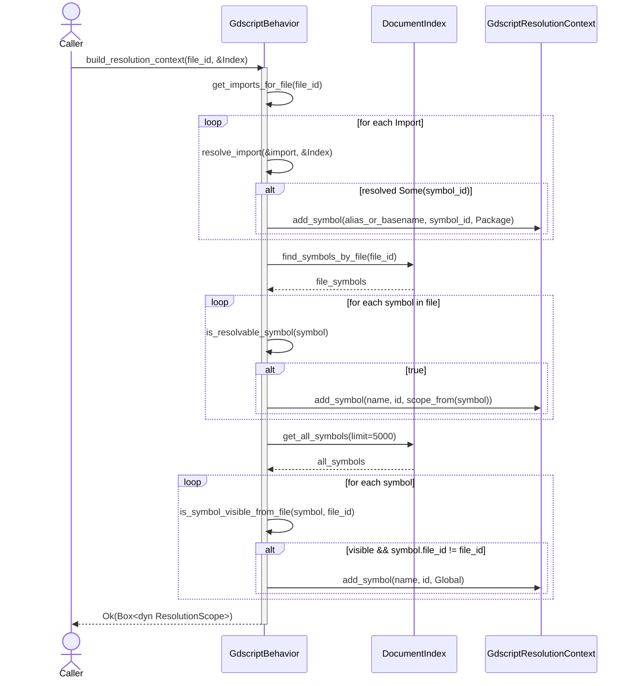

# behavior.rs Review

## TL;DR

- 本ファイルは、GDScript用の言語振る舞いを提供するコア実装で、LanguageBehavior/StatefulBehaviorの実装を通じてシンボルの可視性、モジュールパス、インポート解決、解決コンテキスト構築を担う。
- 主要公開APIは GdscriptBehavior::new、LanguageBehavior の各メソッド（configure_symbol, parse_visibility, module_path_from_file, import_matches_symbol, build_resolution_context, resolve_import など）。
- コアロジックは「相対インポート解決」「シンボル可視性（先頭アンダースコアでPrivate）」「解決コンテキスト構築（インポート、ファイル内、グローバルの順）」。
- 重大リスク: Godot 4 のアノテーション（@onready 等）を extract_identifier が考慮していないため、parse_visibility が誤判定する可能性が高い。build_resolution_context が「全シンボル最大5000件」をグローバルに取り込む実装で、パフォーマンスと誤解決のリスクがある。
- メモリ安全性: unsafeなし。借用は短命の&strのみで明確。並行性は BehaviorState の内部実装に依存（本チャンクでは不明）。
- パフォーマンス: 文字列操作中心は軽いが、build_resolution_context の全件走査と find_symbols_by_name の候補探索がボトルネック。
- セキュリティ: パス/インジェクション/秘密情報の扱いは本ファイル範囲では限定的だが、ログや外部入力整形は追加の堅牢化余地あり。

## Overview & Purpose

GdscriptBehavior は、Godot GDScript のための言語特有の振る舞いを定義するコンポーネント。シンボルのモジュールパス整形、可視性の推定、GDScript の相対インポート（./, ../）の正規化、そしてドキュメントインデックスへ問い合わせて解決コンテキストを構築する責務を負う。tree-sitter による言語定義（tree_sitter_gdscript::LANGUAGE）を保持し、StatefulBehavior を介したファイル・インポート状態の管理も行う。

## Structure & Key Components

| 種別 | 名前 | 公開範囲 | 責務 | 複雑度 |
|------|------|----------|------|--------|
| Struct | GdscriptBehavior | pub | GDScript 言語振る舞いのエントリポイント（LanguageBehavior 実装、状態保持） | Med |
| Impl | impl GdscriptBehavior | crate | new(), ヘルパ関数（extract_identifier, resolve_gdscript_relative_import） | Low |
| Trait Impl | impl StatefulBehavior for GdscriptBehavior | crate | state() の提供（BehaviorState 参照） | Low |
| Trait Impl | impl Default for GdscriptBehavior | pub | Default::default() = new() | Low |
| Trait Impl | impl LanguageBehavior for GdscriptBehavior | crate | シンボル設定、解決コンテキスト構築、可視性/モジュール/インポート判定、言語取得など | High |

- 重要なプライベート関数
  - extract_identifier(signature: &str) -> Option<&str>: 署名文字列から最初の識別子を抽出（キーワードをスキップ）。Godot 4 注釈「@...」未対応の懸念あり。
  - resolve_gdscript_relative_import(&self, import_path: &str, from_module: &str) -> String: ./, ../ を含む GDScript の相対インポートを res:// 形式に解決。

### Dependencies & Interactions

- 内部依存
  - stateful API: register_file_with_state, add_import_with_state, get_imports_from_state（本ファイル内では宣言なし、StatefulBehavior トレイト経由）
  - import_matches_symbol, resolve_import_path_with_context を通じたインポート解決
  - parse_visibility が extract_identifier に依存
- 外部依存（代表）

| 依存 | 用途 |
|------|------|
| crate::parsing::{LanguageBehavior, ResolutionScope} | 言語振る舞いのトレイト、解決スコープ |
| crate::parsing::behavior_state::{BehaviorState, StatefulBehavior} | 状態管理 |
| crate::parsing::{Import, InheritanceResolver} | インポート要素、継承解決 |
| crate::{FileId, Symbol, SymbolKind, Visibility, SymbolId} | 基本型 |
| crate::parsing::gdscript::{GdscriptResolutionContext, GdscriptInheritanceResolver} | GDScript 専用の解決/継承 |
| crate::storage::DocumentIndex | インデックス照会 |
| crate::error::{IndexError, IndexResult} | エラー型 |
| tree_sitter::{Language} / tree_sitter_gdscript::LANGUAGE | パーサ言語 |
| std::path::{Path, PathBuf} | パス処理 |

- 被依存推定
  - パーサ/インデクサのパイプライン
  - 言語非依存の解決フレームワーク（dyn LanguageBehavior を通じて）

## API Surface (Public/Exported) and Data Contracts

- 公開/エクスポート（推定）
  - pub struct GdscriptBehavior
  - impl Default for GdscriptBehavior（default()）
  - impl LanguageBehavior for GdscriptBehavior（トレイト経由で外部から利用）
  - impl StatefulBehavior for GdscriptBehavior（crate 内部での状態操作）

| API名 | シグネチャ | 目的 | Time | Space |
|-------|-----------|------|------|-------|
| new | fn new() -> Self | 振る舞いインスタンス生成 | O(1) | O(1) |
| default | fn default() -> Self | new() の委譲 | O(1) | O(1) |
| state | fn state(&self) -> &BehaviorState | 状態参照取得 | O(1) | O(1) |
| configure_symbol | fn configure_symbol(&self, symbol: &mut Symbol, module_path: Option<&str>) | シンボルのモジュールパス/可視性設定 | O(n) 署名長 | O(1) |
| create_resolution_context | fn create_resolution_context(&self, file_id: FileId) -> Box<dyn ResolutionScope> | 空の解決コンテキスト生成 | O(1) | O(1) |
| create_inheritance_resolver | fn create_inheritance_resolver(&self) -> Box<dyn InheritanceResolver> | 継承解決器生成 | O(1) | O(1) |
| format_module_path | fn format_module_path(&self, base_path: &str, _symbol_name: &str) -> String | GDScript のモジュールパス整形（素通し） | O(n) | O(n) |
| parse_visibility | fn parse_visibility(&self, signature: &str) -> Visibility | 署名から Public/Private 推定 | O(n) | O(1) |
| module_separator | fn module_separator(&self) -> &'static str | セパレータ "/" を返す | O(1) | O(1) |
| module_path_from_file | fn module_path_from_file(&self, file_path: &Path, project_root: &Path) -> Option<String> | ファイルパス→res:// パス | O(n) | O(n) |
| get_language | fn get_language(&self) -> Language | tree-sitter 言語取得 | O(1) | O(1) |
| register_file | fn register_file(&self, path: PathBuf, file_id: FileId, module_path: String) | ファイル登録（状態へ委譲） | 依存 | 依存 |
| add_import | fn add_import(&self, import: Import) | インポート登録（状態へ委譲） | 依存 | 依存 |
| get_imports_for_file | fn get_imports_for_file(&self, file_id: FileId) -> Vec<Import> | ファイルのインポート一覧取得 | 依存 | O(k) |
| get_module_path_for_file | fn get_module_path_for_file(&self, file_id: FileId) -> Option<String> | ファイルのモジュールパス解決 | 依存 | O(1) |
| import_matches_symbol | fn import_matches_symbol(&self, import_path: &str, symbol_module_path: &str, importing_module: Option<&str>) -> bool | インポートとシンボルのモジュール一致判定 | O(n) | O(1) |
| is_resolvable_symbol | fn is_resolvable_symbol(&self, symbol: &Symbol) -> bool | 解決対象シンボル種別の判定 | O(1) | O(1) |
| is_symbol_visible_from_file | fn is_symbol_visible_from_file(&self, symbol: &Symbol, from_file: FileId) -> bool | 可視性（ファイル間/アンダースコア）判定 | O(1) | O(1) |
| build_resolution_context | fn build_resolution_context(&self, file_id: FileId, document_index: &DocumentIndex) -> IndexResult<Box<dyn ResolutionScope>> | 解決コンテキスト構築（インポート、ファイル内、グローバル） | O(I+F+A)+索引 | O(I+F+A) |
| resolve_import | fn resolve_import(&self, import: &Import, document_index: &DocumentIndex) -> Option<SymbolId> | 単一インポート解決 | O(C) | O(1) |
| resolve_import_path_with_context | fn resolve_import_path_with_context(&self, import_path: &str, importing_module: Option<&str>, document_index: &DocumentIndex) -> Option<SymbolId> | パスと呼出元モジュールを用いた解決 | O(C) | O(1) |

注: 依存=BehaviorState/DocumentIndex 実装次第。I=インポート数, F=ファイル内シンボル数, A=グローバル候補件数, C=候補件数。

以下は主要APIの詳細。

1) configure_symbol
- 目的と責務
  - モジュールパスの整形設定、可視性の推定、モジュールシンボル名の可読化（ファイル名末尾を採用）
- アルゴリズム
  - module_path が Some の場合 format_module_path で整形し設定
  - signature があれば parse_visibility で Visibility を設定
  - kind==Module のとき module_path の末尾を .gd 除去して symbol.name に設定
- 引数
  - symbol: &mut Symbol
  - module_path: Option<&str>
- 戻り値
  - なし（in-place 更新）
- 使用例
```rust
let mut sym = Symbol { /* ... */ signature: Some("func _ready():".into()), kind: SymbolKind::Function, ..Default::default() };
let behavior = GdscriptBehavior::new();
behavior.configure_symbol(&mut sym, Some("res://scripts/player.gd"));
assert_eq!(sym.visibility, Visibility::Private);
assert_eq!(sym.module_path.as_deref(), Some("res://scripts/player.gd"));
```
- エッジケース
  - module_path の末尾が .gd でない場合もそのまま採用
  - signature が Godot 4 の "@onready var x" 等だと可視性の推定が誤る可能性（後述）

2) parse_visibility
- 目的と責務: 署名先頭の識別子を抽出し、先頭が '_' なら Private、それ以外 Public。
- アルゴリズム
  - extract_identifier でトークン化し、キーワードを除外した最初のトークンを取得
  - starts_with('_') で Private 判定、そうでなければ Public
- 引数
  - signature: &str
- 戻り値
  - Visibility::{Private, Public}
- 使用例
```rust
let b = GdscriptBehavior::new();
assert_eq!(b.parse_visibility("func _ready(): pass"), Visibility::Private);
assert_eq!(b.parse_visibility("var health := 100"), Visibility::Public);
```
- エッジケース
  - "@onready var _x" → extract_identifier が "@onready" を拾い Public と誤判定する恐れ

3) module_path_from_file
- 目的と責務: プロジェクトルートからの相対ファイルパスを res:// に正規化し、.gd を除去
- アルゴリズム
  - project_root を prefix として strip、区切りを '/' に統一、末尾の .gd を除去し、"res://{path}" を生成
- 引数
  - file_path: &Path, project_root: &Path
- 戻り値
  - Option<String>（project_root に属さない場合 None）
- 使用例
```rust
let b = GdscriptBehavior::new();
let p = Path::new("/proj/scripts/player.gd");
let root = Path::new("/proj");
assert_eq!(b.module_path_from_file(p, root), Some("res://scripts/player".to_string()));
```
- エッジケース
  - 非UTF-8パスは to_string_lossy() により代替文字化の可能性

4) import_matches_symbol
- 目的と責務: import_path と symbol_module_path が同一モジュールを指すか判定
- アルゴリズム
  - 1) 完全一致
  - 2) 相対パス("./", "../")は resolve_gdscript_relative_import で解決し比較（res:// 接頭辞、.gd 拡張の正規化）
  - 3) 双方を正規化（res:// 削除、.gd 除去）し比較
- 引数
  - import_path: &str, symbol_module_path: &str, importing_module: Option<&str>
- 戻り値
  - bool
- 使用例
```rust
let b = GdscriptBehavior::new();
assert!(b.import_matches_symbol("res://a/b/player.gd", "res://a/b/player", None));
assert!(b.import_matches_symbol("../common/utils.gd", "res://pkg/common/utils", Some("res://pkg/game/main")));
```
- エッジケース
  - importing_module が None の相対パス → 2) は実行されず 3) のみで判定（基本は不一致）

5) build_resolution_context
- 目的と責務: ファイルに対する解決スコープを構築（インポート、ファイル内、グローバル）
- アルゴリズム
  - a) 状態からインポート一覧を取得 → resolve_import → alias かファイル名ベースの名前で context に追加（ScopeLevel::Package）
  - b) 同ファイルのシンボルを DocumentIndex から取得 → is_resolvable_symbol でフィルタ → scope_context に応じた ScopeLevel で追加
  - c) 全シンボル（上限5000）を取得 → 他ファイルかつ Public のみ Global スコープに追加
- 引数
  - file_id: FileId, document_index: &DocumentIndex
- 戻り値
  - IndexResult<Box<dyn ResolutionScope>>
- 使用例
```rust
let ctx = behavior.build_resolution_context(file_id, &document_index)?;
// ctx から参照解決を行う上位コンポーネントが利用
```
- エッジケース
  - 全シンボル5000件の固定上限 → 見落とし/性能低下の可能性

6) resolve_import_path_with_context
- 目的と責務: import_path に対応するシンボルを DocumentIndex から解決
- アルゴリズム
  - import_path の末尾要素から拡張子 .gd を除去した名前で find_symbols_by_name
  - 候補について module_path と import_path の一致を import_matches_symbol で判定
- 引数
  - import_path: &str, importing_module: Option<&str>, document_index: &DocumentIndex
- 戻り値
  - Option<SymbolId>
- 使用例
```rust
let sym_id = behavior.resolve_import_path_with_context("res://actors/Player.gd", Some("res://game/main"), &document_index);
```
- エッジケース
  - ファイル名と class_name が異なる場合、名前検索により候補漏れの可能性（module_path による直接検索のほうが堅牢）

## Walkthrough & Data Flow

- configure_symbol
  - 入力: Symbol（可変参照）, Optional module_path
  - 出力: Symbol 更新（module_path 設定、visibility 設定、Module の name 整形）
  - データフロー: signature → extract_identifier → parse_visibility → symbol.visibility へ

- 相対インポート解決（resolve_gdscript_relative_import）
  - from_module からファイル名部分を除去しディレクトリ基準へ
  - import_path の ./ と ../ を解釈 → ディレクトリ階層を移動
  - 末尾の .gd を除去したうえで path を連結 → "res://{...}" を返す

- インポート判定（import_matches_symbol）
  - 1) 完全一致チェック
  - 2) 相対パスは from_module を使い絶対化して比較
  - 3) res:// 前置と .gd 拡張を除去して正規化比較

- 解決コンテキスト構築（build_resolution_context）
  - ステップ:
    - a) インポートの解決結果を Package スコープで登録
    - b) 同ファイルの解決可能シンボルをスコープに応じて登録
    - c) 他ファイルの Public シンボルを Global スコープに登録（最大5000件）

Mermaid（シーケンス図）

上記の図は build_resolution_context 関数の主要フローを示す（行番号: 不明、単一チャンクのため）。

## Complexity & Performance

- 文字列処理（parse_visibility, import_matches_symbol, module_path_from_file）は O(n) 程度（n=文字列長）。ほぼ無視可能。
- 解決系
  - build_resolution_context: O(I + F + A) + インデックス検索コスト
    - I: インポート数、F: ファイル内シンボル数、A: get_all_symbols(5000) の件数
    - ボトルネック: get_all_symbols(5000) による大域的走査、find_symbols_by_name の候補列挙
  - resolve_import_path_with_context: O(C)（候補 C に対する比較）
- スケール限界
  - 大規模プロジェクトでは「全シンボル最大5000件」収集が遅延や精度低下（漏れ）に直結
  - 名前検索（ファイル名基準）が class_name と乖離するとミスマッチ増加
- 実運用負荷
  - I/O/ネットワーク/DB は本ファイルでは未発生。DocumentIndex（おそらく Tantivy ベース）クエリが主要負荷

## Edge Cases, Bugs, and Security

| エッジケース | 入力例 | 期待動作 | 実装 | 状態 |
|-------------|--------|----------|------|------|
| Godot 4 注釈付き可視性 | "@onready var _x" | _x を識別し Private | extract_identifier が "@onready" を拾う | 要修正 |
| 相対パス多段上位 | "../../../x.gd" from "res://a/b/c/d" | ルート手前で止まる or 正確に上位へ | parts が空なら pop しないためルートで安定 | OK |
| import と module_path の拡張子差異 | "res://a/b.gd" vs "res://a/b" | 一致判定 true | 正規化で .gd 除去 | OK |
| import 相対 + importing_module None | "../x.gd", None | 文脈不足として不一致 | 2)をスキップし3)のみ | 想定通り |
| module_path_from_file Win区切り | "a\\b\\c.gd" | "res://a/b/c" | '\\' を '/' に置換 | OK |
| 非UTF-8パス | OS依存バイト列 | 劣化表示でも落ちない | to_string_lossy | OK（注意） |
| グローバル追加過多 | 大量のPublicシンボル | class_name のみ追加 | 可視性のみで追加 | 要修正 |
| 全シンボル上限 | >5000件 | すべて考慮 | 5000固定 | 要修正 |

セキュリティチェックリスト
- メモリ安全性
  - Buffer overflow / UAF / Int overflow: 該当なし（標準ライブラリと安全な文字列操作のみ）
- インジェクション
  - SQL/Command/Path traversal: OSパスではなく論理モジュールパス（res://）の処理中心。traversal 相当は resolve_gdscript_relative_import が ../ を正規化しており、安全側。ただし上位層で外部入力を信頼しないこと。
- 認証・認可
  - 該当なし（言語解析コンポーネント）
- 秘密情報
  - Hard-coded secrets / Log leakage: 該当なし（ログ出力なし）
- 並行性
  - Race/Deadlock: BehaviorState の内部同期に依存（本チャンクでは不明）。本ファイルでは共有可変状態への直接アクセスなし。

Rust特有の観点
- 所有権/借用/ライフタイム
  - extract_identifier の戻り値 Option<&str> は signature 由来の短命参照で、parse_visibility 内で即時使用。ライフタイム妥当。
  - 文字列の unwrap_or による &str の選択は同一所有元（引数）からの派生で安全。
- unsafe 境界
  - unsafe なし。
- 並行性・非同期
  - Send/Sync 要件: 明示の境界は本ファイルに登場しない（不明）。
  - 非同期/await なし。キャンセル対応なし。
- エラー設計
  - Result と Option の使い分け良好（Index 連携は Result、探索失敗は Option）。
  - unwrap/expect 未使用。unwrap_or の利用は安全側のフォールバック。

## Design & Architecture Suggestions

- 可視性推定の強化
  - extract_identifier で '@' から始まる注釈トークンをスキップ（Godot 4 対応）。split 区切りに '@' を追加、あるいは先頭 '@' を除去。
  - キーワードリストに "class_name" は既に含むが、将来の GDScript キーワード追加へ備え、正規式/トークナイザ方式への移行も検討。
- グローバル登録シンボルの厳密化
  - build_resolution_context のグローバル取り込みは「Public かつ他ファイル」では粗い。class_name 宣言等に限定するフラグ（メタ情報）を Symbol に付与してフィルタ。
  - get_all_symbols 固定上限を廃止し、索引のフィルタ（kind==Class && is_global==true 等）で必要最小限を取得。
- ルールの一元化
  - パス正規化（res:// 接頭、.gd 拡張、ケース処理）を helper に集約（normalize_module_path, normalize_import_path）。
  - resolve_import_path_with_context は名前検索でなく module_path ベースの検索を優先（DocumentIndex が対応していれば）。
- 型安全性
  - ModulePath 新型（newtype）で res:// 不変条件（接頭あり/拡張子なし）を型で保証。
- パフォーマンス
  - キャッシュ: import_matches_symbol の正規化結果をキャッシュ（LRU）化。
  - build_resolution_context の段階的/遅延ロード（必要時に DocumentIndex を引く）。

## Testing Strategy (Unit/Integration) with Examples

ユニットテスト例（抜粋）

1) parse_visibility（Godot 3/4）
```rust
#[test]
fn test_parse_visibility_basic() {
    let b = GdscriptBehavior::new();
    assert_eq!(b.parse_visibility("func _ready(): pass"), Visibility::Private);
    assert_eq!(b.parse_visibility("var health := 100"), Visibility::Public);
    assert_eq!(b.parse_visibility("const MAX_HP = 100"), Visibility::Public);
}

#[test]
fn test_parse_visibility_with_annotation() {
    let b = GdscriptBehavior::new();
    // 現状の実装では Public と誤判定しうることを明示
    assert_eq!(b.parse_visibility("@onready var _x = 1"), Visibility::Public); // 期待: Private
    // 将来: extract_identifier が '@' をスキップするよう修正後に Private を期待
}
```

2) resolve_gdscript_relative_import
```rust
#[test]
fn test_relative_import_resolution() {
    let b = GdscriptBehavior::new();
    let from = "res://pkg/game/main";
    assert_eq!(
        b.resolve_gdscript_relative_import("./utils.gd", from),
        "res://pkg/game/utils"
    );
    assert_eq!(
        b.resolve_gdscript_relative_import("../common/utils.gd", from),
        "res://pkg/common/utils"
    );
    assert_eq!(
        b.resolve_gdscript_relative_import("../../core/input.gd", from),
        "res://pkg/core/input"
    );
}
```

3) import_matches_symbol
```rust
#[test]
fn test_import_matches_symbol() {
    let b = GdscriptBehavior::new();
    // 拡張子差異の吸収
    assert!(b.import_matches_symbol("res://a/b/player.gd", "res://a/b/player", None));
    // 相対インポート
    assert!(b.import_matches_symbol("../util/math.gd", "res://lib/util/math", Some("res://lib/app/main")));
    // 文脈なし相対 → 不一致
    assert!(!b.import_matches_symbol("../util/math.gd", "res://lib/util/math", None));
}
```

4) module_path_from_file
```rust
#[test]
fn test_module_path_from_file() {
    let b = GdscriptBehavior::new();
    let root = std::path::Path::new("/p");
    assert_eq!(
        b.module_path_from_file(std::path::Path::new("/p/a/b/c.gd"), root),
        Some("res://a/b/c".to_string())
    );
    assert_eq!(
        b.module_path_from_file(std::path::Path::new("/x/a.gd"), root),
        None
    );
}
```

インテグレーション
- DocumentIndex をモック化し、build_resolution_context の a/b/c 各段の追加件数・重複・可視性フィルタを検証。
- 名前不一致（class_name != ファイル名）時に resolve_import_path_with_context が失敗すること、およびモジュールパス検索の代替手段があれば成功することを検証。

プロパティテスト
- ランダムな "../" の連鎖を与え、resolve_gdscript_relative_import の結果がルートを超えないことを検証。

## Refactoring Plan & Best Practices

- 短期
  - extract_identifier: '@' 先頭のトークンをスキップ、または分割文字に '@' を追加。
  - build_resolution_context: グローバル追加対象を厳密に限定（class_name のみ）。get_all_symbols の上限/取得法を改善。
  - 正規化ヘルパ: normalize_module_path/import_path の実装と import_matches_symbol の簡素化。
- 中期
  - resolve_import_path_with_context: module_path 直接検索ルートを追加（名前に依存しない）。
  - Symbol に「グローバル登録（class_name）」メタを付与し、フィルタリングで使用。
  - ModulePath newtype の導入で不変条件（res:// 先頭、.gd なし）を型で保証。
- 長期
  - 構文解析由来のメタデータ（注釈、可視性、登録種別）を一元管理し、可視性推定を文字列処理から脱却。
  - 解決処理に観測可能性（ログ/メトリクス/トレース）を追加し、運用でのトラブルシュートを容易化。

## Observability (Logging, Metrics, Tracing)

- ログ
  - build_resolution_context: 追加されたシンボル件数（import/file/global）、フィルタ理由（非可視/種別外）を debug レベルで。
  - resolve_import/resolve_import_path_with_context: 候補件数、マッチ成功/失敗理由（パス不一致など）。
- メトリクス
  - インポート解決成功率、候補数分布、get_all_symbols 呼び出し回数と取得件数。
- トレース
  - リクエストID/ファイルID をスパンに含め、各ステップの所要時間を計測。

## Risks & Unknowns

- BehaviorState の内部同期・スレッド安全性（Send/Sync）はこのチャンクには現れない。併用箇所が多スレッドで使う場合の整合性は不明。
- DocumentIndex の検索特性（フィルタリングの可用性、大小文字の扱い、クエリコスト）の詳細は不明。
- class_name の検出方法と Symbol への反映仕様がこのチャンクには現れないため、グローバル登録の正確な条件は不明。
- パスの大文字小文字の正規化方針（OS 依存か Godot の論理パス準拠か）は不明。現状は単純比較であり、プラットフォーム差異の影響がありうる。