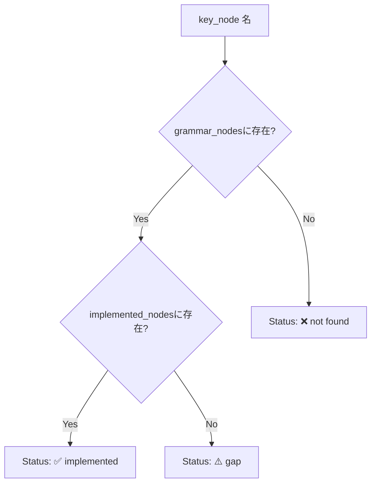

# parsing\go\audit.rs Review

## TL;DR

- 目的: **Goパーサのシンボル抽出カバレッジ**を可視化し、未実装ノードのギャップを検出する。
- 公開API: **GoParserAudit::audit_file**, **GoParserAudit::audit_code**, **GoParserAudit::generate_report**, **AuditError**（エラー型）。
- コアロジック: Tree-sitterで**ASTノード種別を収集**し、プロジェクトの**GoParser**から抽出された**シンボル種別**と**処理済みノード**を突き合わせて**レポート生成**。
- 複雑箇所: レポートの**ノード分類（implemented / gap / not found）**、再帰的な**AST探索**。
- 重大リスク: ① `grammar_nodes`が**種別IDのみ**保持（出現数統計なし）、② `FileId(1)`の**固定化による衝突**懸念、③ `use crate::parsing::NodeTracker;` の**未使用インポート**、④ 超深いASTでの**再帰スタック**懸念。
- Rust安全性/非同期: **unsafeなし**、**同期処理のみ**、`Result`中心の**エラー設計**で安全。テストでは`unwrap`使用。
- パフォーマンス: 時間計算量は**ASTノード数に線形**、レポート生成は**キー一覧に線形**で軽量。

## Overview & Purpose

このモジュールは、Go言語のソースコードを対象に、Tree-sitterから得られる**ASTノード種別**と、プロジェクト内の**GoParser**が実際に**処理・シンボル抽出**しているノードを比較し、抽出カバレッジをレポートとして提示します。これにより、**シンボル抽出の不足（gap）**や**サンプル不足（not found）**を体系的に把握できます。

主な目的:
- ファイル内の**ASTノード種別一覧**を収集
- プロジェクトの**GoParserがハンドルしているノード**を収集
- 実際に**抽出されたシンボル種別**の集合を記録
- それらを用いて**レポート文字列**を生成（サマリ、テーブル、推奨アクション）

## Structure & Key Components

| 種別 | 名前 | 公開範囲 | 責務 | 複雑度 |
|------|------|----------|------|--------|
| Enum | AuditError | pub | 監査処理で発生しうるエラー種別の表現（IO/言語設定/パース失敗/パーサ生成失敗） | Low |
| Struct | GoParserAudit | pub | 監査結果の保持（grammar_nodes, implemented_nodes, extracted_symbol_kinds） | Low |
| Impl Fn | GoParserAudit::audit_file | pub | ファイル読み取り→監査 | Low |
| Impl Fn | GoParserAudit::audit_code | pub | 文字列コードをTree-sitterで解析→自前GoParserで抽出→集合構築 | Med |
| Impl Fn | GoParserAudit::generate_report | pub | カバレッジレポート文字列の生成 | Med |
| Fn | discover_nodes | private | AST再帰走査でノード種別→IDを収集 | Low |
| Test | tests::test_audit_simple_go | private | 単体テスト：基本ノード検出とFunctionシンボル抽出の確認 | Low |

### Dependencies & Interactions

- 内部依存
  - `GoParserAudit::audit_code` → `Parser`（Tree-sitter）でAST生成 → `discover_nodes`で**ノード種別**収集 → `GoParser::new` / `GoParser::parse`で**シンボル抽出** → `GoParser::get_handled_nodes`で**実装済みノード名**収集 → 集合を構築。
  - `GoParserAudit::generate_report` → `format_utc_timestamp`で**UTC時刻** → `grammar_nodes`・`implemented_nodes`の照合 → テーブル出力。
- 外部依存（推奨表）
  | 依存 | 用途 | 備考 |
  |------|------|------|
  | tree_sitter::{Node, Parser} | AST生成と走査 | 安全なパースAPI |
  | tree_sitter_go::LANGUAGE | Go言語定義 | 言語設定に使用 |
  | thiserror::Error | エラー定義 | `#[derive(Error)]`でカスタムエラー |
  | crate::io::format::format_utc_timestamp | レポート生成日時 | 文字列整形 |
  | crate::types::{FileId, SymbolCounter} | パーサ入力のファイル識別・抽出統計 | `FileId(1)`固定使用 |
  | super::GoParser | 自前Goコードパーサ | シンボル抽出・ノード追跡 |
  | crate::parsing::NodeTracker | 未使用 | インポートされるが本ファイルでは未使用 |
- 被依存推定
  - CLIや開発者向けツールで**監査レポート出力**に使用される可能性が高い（詳細は不明）。

## API Surface (Public/Exported) and Data Contracts

| API名 | シグネチャ | 目的 | Time | Space |
|-------|-----------|------|------|-------|
| AuditError | `pub enum AuditError` | 監査時のエラー型 | O(1) | O(1) |
| GoParserAudit::audit_file | `pub fn audit_file(file_path: &str) -> Result<Self, AuditError>` | ファイルを読み込み監査実行 | O(n + t) | O(u + v + w) |
| GoParserAudit::audit_code | `pub fn audit_code(code: &str) -> Result<Self, AuditError>` | コード文字列から監査実行 | O(t) | O(u + v + w) |
| GoParserAudit::generate_report | `pub fn generate_report(&self) -> String` | カバレッジレポート生成 | O(k) | O(1) |

注:
- n=ファイルバイト長、t=ASTノード数（Tree-sitter走査）、k=キーとなるノード一覧数（約22）、u/v/w=集合サイズ（ノード種別/実装済みノード/抽出シンボル種別）。

### 各API詳細

1) GoParserAudit::audit_file
- 目的と責務
  - ファイルパスから文字列を読み込み、`audit_code`を呼び出して監査を行う。
- アルゴリズム（ステップ）
  1. `std::fs::read_to_string(file_path)`でコード取得。
  2. `Self::audit_code(&code)`を呼び出し。
- 引数
  | 名前 | 型 | 説明 |
  |------|----|------|
  | file_path | &str | 読み取り対象Goファイルのパス |
- 戻り値
  | 型 | 説明 |
  |----|------|
  | Result<GoParserAudit, AuditError> | 監査成功時は結果、失敗時はエラー |
- 使用例
  ```rust
  let audit = GoParserAudit::audit_file("examples/comprehensive.go")?;
  println!("{}", audit.generate_report());
  ```
- エッジケース
  - ファイルが存在しない/読み取り不可 → `AuditError::FileRead`
  - 読み込みは成功したが中身が空 → 監査自体は成功、結果はノード少数

2) GoParserAudit::audit_code
- 目的と責務
  - 文字列コードからASTを生成し、ノード種別・実装済みノード・抽出シンボル種別を収集して返す。
- アルゴリズム（ステップ分解）
  1. `Parser::new()`を生成。
  2. `set_language(&tree_sitter_go::LANGUAGE.into())`で言語設定。
  3. `parser.parse(code, None)`でAST取得（失敗で`ParseFailure`）。
  4. `discover_nodes(root, &mut grammar_nodes)`で**全ノード種別→kind_id**を収集。
  5. `GoParser::new()`→`parse(code, file_id, &mut symbol_counter)`で**シンボル抽出**。
  6. `extracted_symbol_kinds`へ`symbol.kind`の`Debug`文字列を格納。
  7. `get_handled_nodes()`から**実装済みノード名**集合を構築。
- 引数
  | 名前 | 型 | 説明 |
  |------|----|------|
  | code | &str | 監査対象のGoコード文字列 |
- 戻り値
  | 型 | 説明 |
  |----|------|
  | Result<GoParserAudit, AuditError> | 監査結果（ノード種別・実装済み・抽出シンボル種別） |
- 使用例
  ```rust
  let code = r#"package main; func main(){ println("hi") }"#;
  let audit = GoParserAudit::audit_code(code)?;
  assert!(audit.extracted_symbol_kinds.contains("Function"));
  ```
- エッジケース
  - 言語設定失敗 → `AuditError::LanguageSetup`
  - パース失敗（`None`） → `AuditError::ParseFailure`
  - `GoParser::new()`失敗 → `AuditError::ParserCreation`
  - 巨大/深いコード → 再帰走査のスタック増加

3) GoParserAudit::generate_report
- 目的と責務
  - 監査結果から**人間可読なテキストレポート**（Markdown風）を生成。
- アルゴリズム（ステップ分解）
  1. ヘッダと生成日時の挿入（`format_utc_timestamp`）。
  2. サマリ数値の出力（ユニークノード種別数・実装済みノード数・抽出シンボル種別数）。
  3. キーノード一覧を走査し、`implemented`/`gap`/`not found`に分類。
  4. 凡例と推奨アクション（ギャップと不足サンプル）を出力。
- 引数
  | 名前 | 型 | 説明 |
  |------|----|------|
  | &self | &GoParserAudit | 監査済みの結果 |
- 戻り値
  | 型 | 説明 |
  |----|------|
  | String | レポート文字列 |
- 使用例
  ```rust
  let report = audit.generate_report();
  println!("{report}");
  ```
- エッジケース
  - `key_nodes`に存在しないノード名 → `not found`扱い
  - `grammar_nodes`は**種別IDのみ**保持のため出現回数をレポートできない
  - 実装済みノード名集合が不足している場合 → 多数が`gap`になる

4) AuditError
- 目的と責務
  - 監査で起こりうる失敗を型で表現し、エラー文言を**thiserror**で整備。
- バリアント
  | 名前 | 説明 |
  |------|------|
  | FileRead(std::io::Error) | ファイル読み取り失敗 |
  | LanguageSetup(String) | Tree-sitter言語設定失敗 |
  | ParseFailure | パース結果がNone |
  | ParserCreation(String) | `GoParser::new()`失敗 |

## Walkthrough & Data Flow

1. 入力（file_pathまたはcode文字列）を取得。
2. Tree-sitter `Parser`で言語設定後、`parse(code, None)`でAST生成。
3. `discover_nodes(root, &mut grammar_nodes)`が再帰走査し、`kind()`名→`kind_id()`を`HashMap<String,u16>`へ登録。
4. 自前`GoParser`を起動し、`parse(code, FileId(1), &mut symbol_counter)`でシンボル抽出。
5. 抽出シンボルの`kind`を`Debug`文字列化し、`extracted_symbol_kinds: HashSet<String>`へ登録。
6. `get_handled_nodes()`から**処理済みノード名**一覧を取得し、`implemented_nodes: HashSet<String>`へ登録。
7. `generate_report()`で上記3集合を元に、サマリとキー種別の実装状況テーブル、推奨アクションを文字列化。

Mermaid（ノード分類ロジックの主要分岐）

上記の図は`generate_report`関数のキー種別分類ロジック（行番号: 不明）の主要分岐を示す。

分類ロジック抜粋:
```rust
for node_name in key_nodes {
    let status = if let Some(id) = self.grammar_nodes.get(node_name) {
        if self.implemented_nodes.contains(node_name) {
            format!("{id} | ✅ implemented")
        } else {
            gaps.push(node_name);
            format!("{id} | ⚠️ gap")
        }
    } else {
        missing.push(node_name);
        "- | ❌ not found".to_string()
    };
    report.push_str(&format!("| {node_name} | {status} |\n"));
}
```

再帰走査関数全体:
```rust
fn discover_nodes(node: Node, registry: &mut HashMap<String, u16>) {
    registry.insert(node.kind().to_string(), node.kind_id());

    let mut cursor = node.walk();
    for child in node.children(&mut cursor) {
        discover_nodes(child, registry);
    }
}
```

## Complexity & Performance

- audit_file: O(n + t) 時間（ファイル読み込み＋ASTパース・走査）、空間は`HashMap/HashSet`のサイズに依存（O(u + v + w)）
- audit_code: O(t) 時間（ASTパース＋走査＋シンボル抽出）、空間は3集合分
- generate_report: O(k) 時間（キー種別の件数）、空間は出力文字列分

主なボトルネック:
- Tree-sitterの**パース**と**AST走査**（tに比例）
- 文字列生成による**割り当て**（レポート、`format!("{:?}", ...)`）

スケール限界:
- 非常に大きくかつ非常に深いASTで**再帰**がスタックに負荷。
- `FileId(1)`固定は大規模監査の**ID衝突**・統計誤計算の可能性。

実運用負荷要因:
- I/O（ファイル読み込み）
- CPU（Tree-sitterパース、再帰走査）
- メモリ（ノード種別・シンボル・実装済みノードの集合）

## Edge Cases, Bugs, and Security

エッジケース表:
| エッジケース | 入力例 | 期待動作 | 実装 | 状態 |
|-------------|--------|----------|------|------|
| 空文字列 | `""` | 監査成功（ノードほぼなし、シンボルなし） | `audit_code`でパース→走査 | OK |
| 無効なGoコード | `package ;` 等 | Tree-sitterはエラーを内包したツリーを返すことが多いが、`None`なら`ParseFailure` | `parser.parse`結果`None`でエラー | OK |
| 超大規模/深いAST | 大量のネスト | 再帰で処理完了。深すぎる場合はスタック懸念 | `discover_nodes`は再帰 | 要監視 |
| 非UTF-8ファイル | バイナリ含む | 読み取り時に`FileRead`エラー | `read_to_string`が失敗時`FileRead` | OK |
| `FileId`衝突 | 複数ファイル監査 | 一意なIDが望ましい | `FileId(1)`固定 | 要改善 |
| 出現回数の欠落 | ノード頻度表示 | 出現回数も報告したい | `grammar_nodes`は`kind_id`のみ | 要改善 |
| 未使用インポート | `NodeTracker` | 警告、不要依存 | 使われていない | 要修正 |

セキュリティチェックリスト:
- メモリ安全性: 再帰による**スタック消費**を除き、所有権・借用は適正。`unsafe`無し。
- インジェクション: SQL/Command/Path traversalの入力は無し。ファイルパスは外部入力だが**読み取りのみ**。
- 認証・認可: 該当なし。
- 秘密情報: ハードコード秘密なし。ログ出力なし（漏えいなし）。
- 並行性: 並列処理無し。**レース/デッドロックの懸念なし**。

Rust特有の観点（詳細チェックリスト）:
- 所有権: 文字列`code`は借用（`&str`）で渡され、`Parser`/`GoParser`は**一時的使用**のみ（具体境界は`audit_code`内）。
- 借用/ライフタイム: `Node`/`cursor`はスコープ内で完結。明示ライフタイム不要。
- unsafe境界: **unsafe未使用**。
- 並行性・非同期: `Send/Sync`境界に言及不要（同期コードのみ）。共有状態なし、`Mutex/RwLock`不要。
- await境界/キャンセル: 非async。
- エラー設計: すべて`Result`で返却。`Option`はTree-sitterパース結果のみ。`panic`はテスト中の`unwrap`に限定。`thiserror`利用でメッセージ整備済み。`From`は`std::io::Error`→`AuditError::FileRead`に実装（derive）。

## Design & Architecture Suggestions

- `grammar_nodes`の値を**出現回数も含む構造体**に変更（例: `HashMap<String, NodeStat { id: u16, count: u32 }>`）。レポートの粒度向上。
- `FileId`を引数化または**一意生成**（ハッシュ/インクリメント）し、監査間の衝突を回避。
- `key_nodes`を**設定可能**に（関数引数/外部設定）して、対象ノードの柔軟性を確保。
- レポート生成を**構造化（JSON/CSV）**でも出力できるオプションを追加し、外部ツール連携を容易化。
- `implemented_nodes`のソースである`get_handled_nodes()`の**スキーマ保証**（名前/IDなど）を明文化。
- `NodeTracker`未使用インポートの削除で**クリーン化**。
- レポートのテーブル並び安定化のため**`BTreeMap`**や**ソート**を導入。

## Testing Strategy (Unit/Integration) with Examples

既存テスト:
```rust
#[test]
fn test_audit_simple_go() {
    let code = r#"
package main

import "fmt"

func main() {
    fmt.Println("Hello")
}
"#;

    let audit = GoParserAudit::audit_code(code).unwrap();

    // Should find these nodes in the code
    assert!(audit.grammar_nodes.contains_key("package_clause"));
    assert!(audit.grammar_nodes.contains_key("import_declaration"));
    assert!(audit.grammar_nodes.contains_key("function_declaration"));

    // Should extract Function symbol
    assert!(audit.extracted_symbol_kinds.contains("Function"));
}
```

追加テスト提案:
- 無効コードのエラーハンドリング
  ```rust
  #[test]
  fn test_audit_invalid_code() {
      // 極端に不完全なコード。parse(None)になるケースを想定
      let code = "package ;";
      let res = GoParserAudit::audit_code(code);
      // Tree-sitterの挙動によるが、失敗ならParseFailureを期待
      if res.is_err() {
          match res.unwrap_err() {
              AuditError::ParseFailure | AuditError::LanguageSetup(_) => (),
              e => panic!("unexpected error: {e:?}"),
          }
      }
  }
  ```
- 大規模コードでの安定性（疑似的に多数の関数/宣言を生成）
- レポート分類の妥当性（`implemented_nodes`に故意に存在しないノードを含め、`gap`/`not found`が期待通りになる）
- `audit_file`のファイル読み取りエラー（存在しないパスで`FileRead`）

## Refactoring Plan & Best Practices

- 未使用インポート削除: `use crate::parsing::NodeTracker;` を削除。
- `grammar_nodes`拡張: `NodeStat`構造体導入で**ID+出現回数**を保持。
- `FileId`生成: 監査呼び出しごとに**一意なID**を割り当て（例: ハッシュやランダム）。
- 文字列生成最適化: `report.reserve()`で**容量予約**、`std::fmt::Write`の利用により**効率化**。
- ステータスの型安全化: `enum NodeStatus { Implemented(u16), Gap(u16), NotFound }`で分類し、レンダリング層で表示整形。
- 安定順序: キー種別/辞書を**ソート**して再現性あるレポート作成。
- API拡張: `audit_code_with_config(code, key_nodes: &[&str])`で**外部制御**可能に。

## Observability (Logging, Metrics, Tracing)

- ロギング: `tracing`や`log`で監査開始/終了、ノード数、実装済み数、シンボル数を**構造化ログ**。
- メトリクス: 
  - カウンタ: `total_node_kinds`, `implemented_node_kinds`, `extracted_symbol_kinds`
  - ゲージ/率: `coverage_ratio = implemented / total`
- トレーシング: ファイル単位の`span`を設け、Tree-sitterパース時間と自前パース時間を**タイミング計測**。

## Risks & Unknowns

- `GoParser`の内部仕様（`parse`が返すシンボル種別、`get_handled_nodes`の構造体内容）はこのチャンクには現れないため**不明**。
- `tree_sitter_go::LANGUAGE.into()`の必要性/型は環境依存であり**不明**（直接`LANGUAGE`を渡せる場合もある）。
- `SymbolCounter`の意味・利用目的は**不明**（ここでは用途なし）。
- `format_utc_timestamp`のフォーマット仕様は**不明**。
- ASTのノード種別名（例: `type_alias`, `method_elem`）が実際のGo grammarに一致するかどうかは**不明**。誤記があると`not found`が増える。

コード引用（短い関数は全体引用、長い関数は主要部分のみ抜粋）:
```rust
pub fn audit_file(file_path: &str) -> Result<Self, AuditError> {
    let code = std::fs::read_to_string(file_path)?;
    Self::audit_code(&code)
}
```
```rust
fn discover_nodes(node: Node, registry: &mut HashMap<String, u16>) {
    registry.insert(node.kind().to_string(), node.kind_id());

    let mut cursor = node.walk();
    for child in node.children(&mut cursor) {
        discover_nodes(child, registry);
    }
}
```