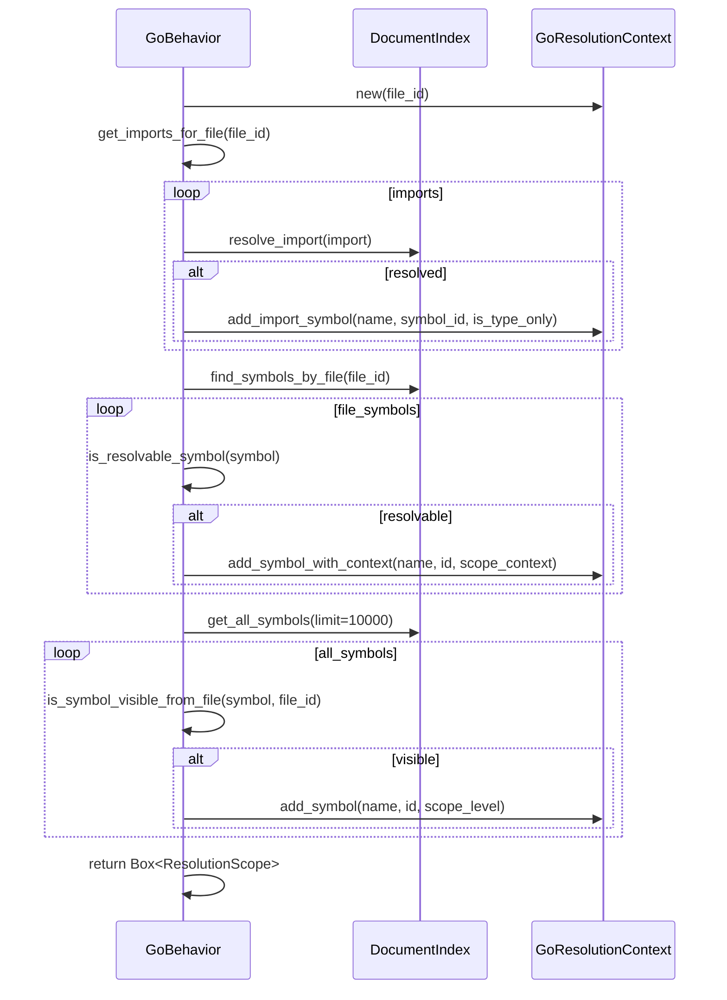

# behavior.rs Review

## TL;DR

- 目的: Go向けの言語挙動を定義し、パッケージ/インポート/可視性/解決コンテキストの扱いを統一するための実装（GoBehavior）。
- 主要公開API: GoBehavior（pub）、LanguageBehavior/StatefulBehaviorトレイト実装。特に、build_resolution_context・resolve_import・parse_visibility・module_path_from_file・configure_symbolがコア。
- 複雑箇所: resolve_importの多段分岐（相対・vendor・標準ライブラリ・モジュール・フォールバック）、build_resolution_contextのスコープと可視性の統合、is_resolvable_symbolのスコープ判断。
- 重大リスク: resolve_importで暫定のFileId::new(1).unwrapを使用する点、Windowsパスや非UTF-8パスの取り扱い、DocumentIndexへの広範クエリによる潜在的I/O/パフォーマンス負荷。
- Rust安全性: unsafe未使用。Option/Resultによるエラー伝播あり。unwrapの使用箇所あり（panicリスク）。
- 並行性: BehaviorStateの実装詳細はこのチャンクに現れないため安全性は不明。共有状態の競合に注意。
- セキュリティ: 外部入力のコマンド/SQLは扱わないが、パス処理の堅牢性とログへの秘密情報漏洩に留意。

## Overview & Purpose

GoBehaviorは、Goコードをインデックス・解析するための言語固有ロジックを提供するコンポーネント。主な責務は以下。

- モジュールパス（Goパッケージ）抽出と整形（module_path_from_file, format_module_path）
- 可視性の判定（parse_visibility；識別子の先頭大文字/小文字）
- インポートの追跡と解決（register_file/add_import/get_imports_for_file/resolve_import）
- 記号解決コンテキスト構築（build_resolution_context）
- 継承（Goではinterface実装）および関係種別のマッピング（create_inheritance_resolver, map_relationship）

この実装は、LanguageBehaviorおよびStatefulBehaviorトレイトを満たし、DocumentIndexと連携してシンボルの解決・スコープ化・可視性の計算を行う。

## Structure & Key Components

| 種別 | 名前 | 公開範囲 | 責務 | 複雑度 |
|------|------|----------|------|--------|
| Struct | GoBehavior | pub | Go言語固有の挙動（LanguageBehavior/StatefulBehavior実装） | Med |
| Struct | BehaviorState | 不明（外部） | ファイル登録・インポート・プロジェクトルートなどの状態管理 | Med |
| Trait Impl | LanguageBehavior for GoBehavior | 外部から利用（トレイト経由） | 解析・解決の主要API群 | High |
| Trait Impl | StatefulBehavior for GoBehavior | 外部から利用（トレイト経由） | 状態アクセス/操作の委譲 | Low |
| Struct | GoResolutionContext | 不明（外部） | Go特有の解決スコープモデル（パッケージ/インポート） | Med |
| Struct | GoInheritanceResolver | 不明（外部） | Goのインターフェース実装関係の解決 | Low |

### Dependencies & Interactions

- 内部依存
  - GoBehavior → BehaviorState（ファイル登録・インポート・モジュールパス・プロジェクトルートのキャッシュ）
  - GoBehavior → GoResolutionContext（解決スコープ構築とインポート解決補助）
  - GoBehavior → GoInheritanceResolver（関係名“implements”に対応する解決）
  - GoBehavior → DocumentIndex（シンボル検索、全シンボル取得、パス一覧）
  - GoBehavior → crate::relationship::RelationKind（関係種別マッピング）
  - GoBehavior → crate::{Symbol, SymbolKind, Visibility}（可視性/スコープ判定・設定）

- 外部依存（クレート・モジュール）
  | 依存 | 用途 |
  |------|------|
  | tree_sitter_go::LANGUAGE | Goのパーシング言語オブジェクト |
  | tree_sitter::Language | LanguageBehavior.get_languageの戻り値型 |
  | crate::parsing::LanguageBehavior | トレイト実装 |
  | crate::parsing::behavior_state::{BehaviorState, StatefulBehavior} | 状態管理・ヘルパ |
  | crate::parsing::resolution::{InheritanceResolver, ResolutionScope} | 解決器のインターフェイス |
  | super::resolution::{GoInheritanceResolver, GoResolutionContext} | Go固有の解決器 |
  | crate::storage::DocumentIndex | インデックス照会 |
  | crate::types::FileId | ファイル識別子 |
  | crate::{SymbolId, Visibility} | シンボル識別/可視性 |

- 被依存推定
  - 言語レジストリ（crate::parsing::registry）からGoBehaviorが選択・利用される
  - インデクサ/パーサ（ソース解析時）でLanguageBehavior経由のAPIが呼ばれる
  - 関係可視化やコードナビゲーションで解決コンテキストが参照される

## API Surface (Public/Exported) and Data Contracts

| API名 | シグネチャ | 目的 | Time | Space |
|-------|-----------|------|------|-------|
| GoBehavior::new | fn new() -> Self | インスタンス生成 | O(1) | O(1) |
| Default::default | fn default() -> Self | 既定インスタンス生成 | O(1) | O(1) |
| StatefulBehavior::state | fn state(&self) -> &BehaviorState | 状態への参照取得 | O(1) | O(1) |
| format_module_path | fn format_module_path(&self, base_path: &str, _symbol_name: &str) -> String | Goのモジュールパス整形（シンボル名非付加） | O(n) | O(n) |
| get_language | fn get_language(&self) -> Language | tree-sitter言語取得 | O(1) | O(1) |
| module_separator | fn module_separator(&self) -> &'static str | 区切り文字（"/"） | O(1) | O(1) |
| module_path_from_file | fn module_path_from_file(&self, file_path: &Path, project_root: &Path) -> Option<String> | ファイルからGoパッケージパス導出 | O(len(path)) | O(1) |
| parse_visibility | fn parse_visibility(&self, signature: &str) -> Visibility | 大文字/小文字で可視性判定 | O(len(signature)) | O(1) |
| supports_traits | fn supports_traits(&self) -> bool | Goはtraits非対応（interfacesのみ） | O(1) | O(1) |
| supports_inherent_methods | fn supports_inherent_methods(&self) -> bool | 型メソッド対応の報告 | O(1) | O(1) |
| create_resolution_context | fn create_resolution_context(&self, file_id: FileId) -> Box<dyn ResolutionScope> | Go解決コンテキスト生成 | O(1) | O(1) |
| create_inheritance_resolver | fn create_inheritance_resolver(&self) -> Box<dyn InheritanceResolver> | interface実装関係の解決器 | O(1) | O(1) |
| inheritance_relation_name | fn inheritance_relation_name(&self) -> &'static str | 関係名の取得（"implements"） | O(1) | O(1) |
| map_relationship | fn map_relationship(&self, language_specific: &str) -> RelationKind | 言語固有→共通関係種別にマップ | O(1) | O(1) |
| register_file | fn register_file(&self, path: PathBuf, file_id: FileId, module_path: String) | 状態にファイル/モジュール登録 | O(1) | O(1) |
| add_import | fn add_import(&self, import: crate::parsing::Import) | 状態にインポート追加 | O(1) | O(1) |
| get_imports_for_file | fn get_imports_for_file(&self, file_id: FileId) -> Vec<crate::parsing::Import> | ファイルのインポート取得 | O(k) | O(k) |
| build_resolution_context | fn build_resolution_context(&self, file_id: FileId, document_index: &DocumentIndex) -> IndexResult<Box<dyn ResolutionScope>> | 解決コンテキスト構築（インポート/シンボル統合） | O(I + F + G) | O(I + F + G) |
| is_resolvable_symbol | fn is_resolvable_symbol(&self, symbol: &crate::Symbol) -> bool | シンボルの前方参照/スコープ可否判定 | O(1) | O(1) |
| resolve_import | fn resolve_import(&self, import: &crate::parsing::Import, document_index: &DocumentIndex) -> Option<SymbolId> | Goインポート解決（相対/vendor/stdlib/module/基本） | 依存先次第 | O(1) |
| get_module_path_for_file | fn get_module_path_for_file(&self, file_id: FileId) -> Option<String> | 状態からモジュールパス取得 | O(1) | O(1) |
| configure_symbol | fn configure_symbol(&self, symbol: &mut crate::Symbol, module_path: Option<&str>) | モジュールパス/可視性設定 | O(len(signature)) | O(1) |
| import_matches_symbol | fn import_matches_symbol(&self, import_path: &str, symbol_module_path: &str, importing_module: Option<&str>) -> bool | インポートパス一致判定（相対含む） | O(seg) | O(1) |
| get_current_package_path_for_file | fn get_current_package_path_for_file(&self, file_id: FileId) -> Option<String> | ファイルに紐づくパッケージパス取得 | O(1) | O(1) |
| get_project_root_for_file | fn get_project_root_for_file(&self, file_id: FileId, document_index: &DocumentIndex) -> Option<String> | go.mod探索によるプロジェクトルート特定 | O(d) | O(1) |

注: トレイト実装のメソッドは型のpubとトレイトの公開性により外部から呼び出されます。行番号はこのチャンクには現れないため「不明」とします。

以下、コアAPIの詳細。

1) 目的と責務
- build_resolution_context
  - 目的: 指定ファイルに対する解決コンテキスト（スコープ）を構築。インポート、同一ファイルのシンボル、外部ファイルの可視シンボルを統合。
- resolve_import
  - 目的: GoのインポートパスをシンボルIDに解決。相対、vendor、標準ライブラリ、モジュールパスを順に評価。
- module_path_from_file
  - 目的: ファイルパスからGoパッケージパス（ディレクトリ）を導出。
- parse_visibility
  - 目的: シグネチャ文字列から可視性（Public/Private）を判定。
- configure_symbol
  - 目的: シンボルのモジュールパス設定と可視性反映（Go規則）。
- import_matches_symbol
  - 目的: インポートパスがシンボルのモジュールパスと一致するか判定。相対パスをコンテキストに基づいて再解決。

2) アルゴリズム（ステップ分解）
- build_resolution_context
  1. GoResolutionContextを生成。
  2. 状態で追跡しているインポートを列挙、resolve_importでSymbolIdに解決、必要に応じてエイリアス名で登録（type-onlyを別扱い）。
  3. DocumentIndex.find_symbols_by_fileで当該ファイルのシンボルを取得し、is_resolvable_symbolに応じてadd_symbol_with_contextで登録（scope_context尊重）。
  4. DocumentIndex.get_all_symbols(10000)で他ファイルのシンボルを取得し、is_symbol_visible_from_file（このチャンクには現れない）で可視性を確認し、Visibilityに応じてGlobal/Moduleスコープへ追加。
- resolve_import
  1. 仮のGoResolutionContextを生成。
  2. 相対パスなら現在パッケージ（BehaviorState）を取得しresolve_relative_importで解決、解決できなければフォールバック。
  3. vendorディレクトリ優先でresolve_vendor_importを試行。
  4. 標準ライブラリ判定is_standard_library_packageなら直接解決。
  5. go.modベースのモジュールパス変換handle_go_module_pathsを試行。
  6. 最終フォールバックとしてresolve_import_pathを使用。
- module_path_from_file
  1. project_rootからの相対Pathを得る（strip_prefix）。
  2. 拡張子.goを除去、ディレクトリ親を取得。
  3. 空なら"."、それ以外はディレクトリ文字列。
- parse_visibility
  1. "func " / "type " / "var " / "const "の各プレフィックスを探す。
  2. 該当形式に応じて識別子名を抽出（レシーバ有無、括弧分割など）。
  3. 先頭文字が大文字ならPublic、そうでなければPrivate。
- configure_symbol
  1. module_pathが渡されればsymbol.module_pathに設定（Goはシンボル名を結合しない）。
  2. signatureがあればparse_visibilityでvisibilityを更新。
  3. module_pathが未設定なら"."（現在パッケージ）を設定。
- import_matches_symbol
  1. 完全一致ならtrue。
  2. importing_moduleがある場合、"./" または "../" から始まる相対パスをimporting_module基準でresolve。
  3. 解決後の文字列とsymbol_module_pathの一致を確認。

3) 引数

| 関数 | 引数 | 型 | 説明 |
|------|------|----|------|
| build_resolution_context | file_id | FileId | 対象ファイルID |
| build_resolution_context | document_index | &DocumentIndex | シンボル・パス問い合わせ |
| resolve_import | import | &crate::parsing::Import | インポート定義（path, alias, file_id等） |
| resolve_import | document_index | &DocumentIndex | 解決のためのインデックス |
| module_path_from_file | file_path | &Path | 対象ファイルパス |
| module_path_from_file | project_root | &Path | プロジェクトルート |
| parse_visibility | signature | &str | Goシグネチャ文字列 |
| configure_symbol | symbol | &mut crate::Symbol | 対象シンボル（可視性/パス設定先） |
| configure_symbol | module_path | Option<&str> | 設定するモジュールパス |
| import_matches_symbol | import_path | &str | インポートパス（相対/絶対） |
| import_matches_symbol | symbol_module_path | &str | シンボル側モジュールパス |
| import_matches_symbol | importing_module | Option<&str> | 発呼側モジュールパス（相対解決用） |
| get_project_root_for_file | file_id | FileId | ファイルID |
| get_project_root_for_file | document_index | &DocumentIndex | パス探索フォールバック用 |

4) 戻り値

| 関数 | 戻り値 | 型 | 説明 |
|------|--------|----|------|
| build_resolution_context | 解決スコープ | IndexResult<Box<dyn ResolutionScope>> | 成功時スコープ、失敗時IndexError |
| resolve_import | シンボルID | Option<SymbolId> | 解決成功ならSome |
| module_path_from_file | パッケージパス | Option<String> | UTF-8でないパス等はNone |
| parse_visibility | 可視性 | Visibility | Public/Private |
| configure_symbol | なし | () | 変更は参照で反映 |
| import_matches_symbol | 一致 | bool | true/false |
| get_project_root_for_file | ルート文字列 | Option<String> | go.mod探索結果 |

5) 使用例

- parse_visibility
```rust
let behavior = GoBehavior::new();
assert_eq!(behavior.parse_visibility("func PublicFunction()"), Visibility::Public);
assert_eq!(behavior.parse_visibility("func privateFunction()"), Visibility::Private);
assert_eq!(behavior.parse_visibility("type PublicStruct struct{}"), Visibility::Public);
```

- module_path_from_file
```rust
let behavior = GoBehavior::new();
let root = std::path::Path::new("/home/user/project");
let file = std::path::Path::new("/home/user/project/pkg/utils/helper.go");
assert_eq!(behavior.module_path_from_file(file, root), Some("pkg/utils".to_string));
```

- import_matches_symbol（相対解決）
```rust
let behavior = GoBehavior::new();
assert!(behavior.import_matches_symbol("./utils", "pkg/utils", Some("pkg")));
assert!(behavior.import_matches_symbol("../shared", "pkg/shared", Some("pkg/api")));
```

- build_resolution_context（基本呼び出し）
```rust
let behavior = GoBehavior::new();
let settings = crate::config::Settings::default();
let index_dir = std::path::Path::new("/tmp/index");
let doc_index = crate::storage::DocumentIndex::new(index_dir.into(), &settings).unwrap();
let file_id = crate::types::FileId::new(42).unwrap();

let scope = behavior.build_resolution_context(file_id, &doc_index).unwrap();
// scope内にインポート/同一ファイルシンボル/外部可視シンボルが登録される
```

6) エッジケース
- parse_visibility
  - レシーバありメソッド（"func (r *T) Name(...)"）
  - ジェネリクス（"func Name[T any](...)"）
  - 先頭が非アルファベット（"__helper"等）：フォールバックで除外されPrivateに傾きやすい
- module_path_from_file
  - ルート直下のファイル（main.go）→ "."
  - 非UTF-8パス → None
  - プロジェクト外の絶対パス → 親ディレクトリ文字列を返すが意味的整合性不明
- resolve_import
  - 多段"../"相対 → ルートより上へ上がるとサイレントに無視して続行
  - vendor優先 → project_root推定失敗時はスキップ
  - 標準ライブラリ判定 → 未収載パッケージは通常解決へフォールバック
- configure_symbol
  - signatureなし → visibility更新されず、module_path未設定なら"."となる

根拠（関数名:行番号）：行番号は不明（このチャンクのみ）。

## Walkthrough & Data Flow

- 高レベルフロー（build_resolution_context）
  - 入力: file_id, DocumentIndex
  - 出力: ResolutionScope（GoResolutionContext）
  - データ流れ:
    1. 状態からインポート取得 → 各インポートをresolve_import → コンテキストへ登録（エイリアス/タイプ専用考慮）
    2. DocumentIndexから当該ファイルシンボル（find_symbols_by_file）→ is_resolvable_symbolでフィルタ → scope_contextに合わせて登録
    3. DocumentIndexから全シンボル（最大10000件）→ is_symbol_visible_from_fileで可視性確認 → Global/Moduleスコープへ登録

- シーケンス図（3アクター: Behavior, DocumentIndex, GoResolutionContext）

上記の図は`build_resolution_context`関数の主要フローを示す（行番号：不明、このチャンクのみ）。

- 分岐図（resolve_import）
```mermaid
flowchart TD
  A[resolve_import] --> B{相対パス? (./ or ../)}
  B -- Yes --> C[現在パッケージ取得→相対解決]
  C --> D{解決成功?}
  D -- Yes --> E[resolve_import_path(resolved)]
  D -- No --> F[resolve_import_path(import.path)]
  B -- No --> G{vendorに存在?}
  G -- Yes --> H[resolve_vendor_import→SymbolId]
  G -- No --> I{標準ライブラリ?}
  I -- Yes --> J[resolve_import_path(import.path)]
  I -- No --> K{go.modモジュールパス?}
  K -- Yes --> L[handle_go_module_paths→resolve_import_path(resolved)]
  K -- No --> M[resolve_import_path(import.path)]
  E --> N[Some(SymbolId)]
  F --> O[Option<SymbolId>]
  H --> P[Some(SymbolId)]
  J --> Q[Option<SymbolId)]
  L --> R[Option<SymbolId)]
  M --> S[Option<SymbolId)]
```
上記の図は`resolve_import`関数の主要分岐を示す（行番号：不明、このチャンクのみ）。

## Complexity & Performance

- 個別関数のBig-O
  - parse_visibility: 時間O(n)（シグネチャ長）、空間O(1)
  - module_path_from_file: 時間O(len(path))、空間O(1)
  - build_resolution_context: 時間O(I + F + G)（I=インポート数、F=当該ファイルのシンボル数、G=取得上限10000）、空間O(I + F + G)
  - resolve_import: パス文字列処理はO(seg)、DocumentIndexアクセスは実装依存（I/O）
  - import_matches_symbol: 時間O(seg)（'/'分割数）、空間O(seg)

- ボトルネック・スケール限界
  - get_all_symbols(10000)は大量フェッチでI/O/メモリ負荷が懸念。プロジェクトの規模次第でCPU/メモリ/ディスクの負担が増える。
  - get_project_root_for_fileはディレクトリを親方向に走査し、ファイルシステムI/Oが発生。キャッシュありだが初回コストは無視できない。
  - resolve_importは複数フェーズでDocumentIndexに問い合わせ（vendor、標準、モジュール、フォールバック）。インデックス実装により遅延要因。

- 実運用負荷要因
  - I/O: ファイルシステム（go.mod探索）、インデックス（Tantivy等）クエリ
  - ネットワーク: このチャンクではなし
  - DB: DocumentIndex内部が検索エンジン/DBならI/O発生

## Edge Cases, Bugs, and Security

- エッジケース詳細

| エッジケース | 入力例 | 期待動作 | 実装 | 状態 |
|-------------|--------|----------|------|------|
| ルート直下Goファイル | "/project/main.go" | "."を返す | module_path_from_file | OK |
| 非UTF-8パス | OS依存非UTF-8 | None | module_path_from_file | OK |
| 相対インポート多段 | "../../x" from "a/b/c" | 上位に上がり続ける | resolve_import/import_matches_symbol | OK（過剰上昇は静粛処理） |
| vendor優先 | "vendor/github.com/u/p" | vendorを先に解決 | resolve_import | OK（project_root必要） |
| 標準ライブラリ判定 | "fmt" | 直接解決 | resolve_import | OK |
| レシーバ付きメソッド可視性 | "func (r *T) Name()" | 先頭大文字でPublic | parse_visibility | OK |
| ジェネリクス関数 | "func Name[T any]()" | 先頭大文字でPublic | parse_visibility | OK（'('分割の影響なし） |
| 先頭非アルファ識別子 | "__helper" | Private | parse_visibility | OK（フォールバックでalphabeticのみ） |

- バグ/脆弱性候補
  - 暫定FileId利用: resolve_importで`FileId::new(1).unwrap()`を使用（関数名:行番号不明）。ファイルコンテキスト依存の解決（相対/vendor）に影響しうる。インポートのfile_id（import.file_id）でコンテキストを生成すべき。
  - Windowsパス: Goのインポートは'/'だが、module_path_from_fileはOSパス→文字列処理の混在により、Windowsでの相対/絶対の扱いで予期せぬ結果の可能性。
  - プロジェクト外ファイル: project_rootに含まれないファイルを与えると、絶対パスの親ディレクトリ文字列を返し、パッケージ意味論と不整合の可能性。
  - インポート一致の過不足: import_matches_symbolは絶対パスで部分一致を行わず完全一致のみ。エイリアスパッケージや複合パスに対する柔軟性は意図的だが、特殊なlayoutでの誤判定に注意。
  - unwrap使用: `FileId::new(1).unwrap()`は理論上panic可能（現在の実装では1は有効想定）。安全設計の観点では避けたい。
  - 非UTF-8 to_str: to_strがNoneを返すケースではNoneを返却するが、後続の処理がこのNoneに非対応だと不整合。現実装はNoneで早期returnのため良好。

- セキュリティチェックリスト
  - メモリ安全性: unsafe未使用。Buffer overflow/Use-after-free/Integer overflowの懸念は低い。
  - インジェクション: SQL/Command/Path traversalの直接な入力は扱わない。相対パスの処理はあるが、ファイルアクセスはgo.mod存在確認のみ。
  - 認証・認可: 該当なし。
  - 秘密情報: Hard-coded secretsなし。ログ出力なし（漏洩リスク低）。
  - 並行性: BehaviorStateのスレッド安全性（Send/Sync/内部ロック）はこのチャンクには現れないため不明。複数スレッドからのregister_file/add_import同時実行で競合の可能性。

- Rust特有の観点
  - 所有権/借用: &selfでの読み取り中心。configure_symbolで&mutを適切に使用。
  - ライフタイム: 明示ライフタイム不要。Box<dyn Trait>の動的ディスパッチ。
  - unsafe境界: なし。
  - 並行性・非同期: 非同期/awaitなし。Send/Sync境界は不明。
  - エラー設計: IndexResult, Optionで表現。unwrap使用はテスト以外にもresolve_importに1箇所存在（改善推奨）。

## Design & Architecture Suggestions

- コンテキスト整合性の確保
  - resolve_importで仮の`FileId::new(1)`をやめ、`import.file_id`に基づくGoResolutionContextを生成する。
- パスユーティリティの共通化
  - 相対解決（../処理）、文字列→Pathの橋渡しを専用ユーティリティにまとめ、OS依存の差異を吸収。
- グローバルシンボル取得の最適化
  - build_resolution_contextの`get_all_symbols(10000)`を、必要な可視モジュールのみ絞り込むクエリに変更（パッケージ単位フィルタ）。
- エラー/Resultの一貫性
  - get_project_root_for_fileの探索失敗理由を返せるResult型に拡張し、診断性を向上。
- 可視性判定の堅牢化
  - parse_visibilityにおいて、識別子抽出ロジックをより堅牢に（正規表現やtree-sitterノードベース）することで誤検知を低減。
- 遅延ロード/キャッシュ戦略
  - vendor/標準ライブラリ/モジュール解決結果をキャッシュ（BehaviorState）し、繰り返し解決のコストを削減。

## Testing Strategy (Unit/Integration) with Examples

- 既存テストは以下をカバー
  - module_separator、module_path_from_file、format_module_path、parse_visibility、traitsサポート、import_matches_symbol、プロジェクトルートキャッシュ、configure_symbol

- 追加ユニットテスト提案
  - resolve_importの分岐網羅
    - vendor優先パス存在/非存在
    - 標準ライブラリ判定の境界（"net/http"など複合）
    - go.modベースのモジュールパス変換
  - module_path_from_fileのOS差異
    - Windowsパス（"C:\\proj\\pkg\\u\\x.go"）で期待結果が"/"区切りの"pkg/u"になるか、仕様明確化
  - parse_visibilityのエッジ
    - 識別子が数字開始（"var 1value int"）→フォールバックでPrivate
    - メソッド名がUnicode（"func (r *T) Ünicode()"）→is_uppercaseの国際化検証
  - import_matches_symbolの多段相対
    - "../../../core" from "a/b" → "core"に解決（上位越えは切り捨て）

- 統合テスト提案
  - 小規模Goプロジェクト（go.modあり、internal/vendor/stdlib使用）を用意してDocumentIndexに投入
  - build_resolution_contextで期待するシンボル解決スコープが構築されるか検証

- サンプルテストコード（resolve_importのvendorパス）
```rust
#[test]
fn test_resolve_import_vendor_priority() {
    let behavior = GoBehavior::new();
    // setup: DocumentIndexが vendor/github.com/user/repo/pkg のシンボルを返せるようにモック
    // ここでは擬似コード: モック作成はこのチャンクには現れない
    let import = crate::parsing::Import {
        path: "github.com/user/repo/pkg".to_string(),
        alias: None,
        file_id: crate::types::FileId::new(10).unwrap(),
        is_type_only: false,
        // その他フィールドはこのチャンクには現れない
    };
    let settings = crate::config::Settings::default();
    let doc_index = crate::storage::DocumentIndex::new(std::path::Path::new("/tmp/index").into(), &settings).unwrap();

    let symbol = behavior.resolve_import(&import, &doc_index);
    // vendor優先の解決を期待（モック準備に依存）
    assert!(symbol.is_some());
}
```

## Refactoring Plan & Best Practices

- ステップ1: resolve_importのコンテキスト初期化を`GoResolutionContext::new(import.file_id)`に変更し、unwrap排除。
- ステップ2: パス解決関数を共通化し、Windows/非UTF-8ケースを明示的に扱う。import_matches_symbolの相対解決をPathベースに再実装。
- ステップ3: build_resolution_contextの全シンボル取得をパッケージ境界やVisibilityで事前フィルタ可能なインデックスクエリに変更。
- ステップ4: parse_visibilityをより構造的に（tree-sitterノードから識別子名抽出）実装し、シグネチャ文字列依存を低減。
- ステップ5: get_project_root_for_fileの結果や探索方法をBehaviorStateにキャッシュ/共有、テストでI/O依存をモック化。

ベストプラクティス
- unwrap/expectの排除、明示的なエラー処理。
- 外部I/Oの結果をキャッシュし、再利用。
- トレイト境界の明確化（Send/Syncが必要なら明示）。
- ログ/トレースの追加による運用診断性の向上。

## Observability (Logging, Metrics, Tracing)

- 現状、ログ/メトリクス/トレースはなし。
- 推奨:
  - build_resolution_contextの各フェーズ（インポート解決数、ファイルシンボル数、外部シンボル適用数）をDebugログ/メトリクスに記録。
  - resolve_importの分岐選択（relative/vendor/stdlib/module/fallback）をトレース属性で可視化。
  - get_project_root_for_fileで探索深度・キャッシュ命中をメトリクス化。

## Risks & Unknowns

- BehaviorStateの内部実装がこのチャンクには現れないため、スレッド安全性、キャッシュの整合性、インポート格納構造は不明。
- DocumentIndexの検索コスト/制約（エラーハンドリング含む）は外部依存であり、パフォーマンス/信頼性は実装に依存。
- is_symbol_visible_from_fileの具体仕様がこのチャンクには現れないため、外部シンボルの取り込み条件が不透明。
- Windows環境や非UTF-8ファイル名の取り扱いは未検証。
- go.mod検出戦略（複数go.modがあるモノレポ構成）への対応は限定的で、最初に見つかった1件のみを採用しているため不正確になりうる。

以上の点を踏まえ、resolve_importのコンテキスト改善、I/O最適化、テスト拡充、可観測性強化が優先度高の改善項目となる。