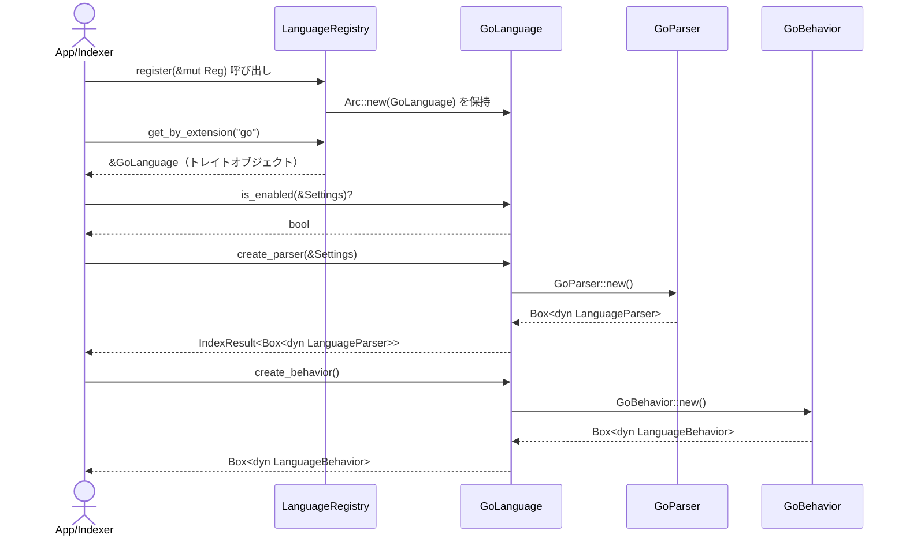

# parsing\go\definition.rs Review

## TL;DR

- このファイルは、Go 言語の言語定義を提供する単一の公開型 **GoLanguage** と、レジストリ登録用の関数を含む。公開APIの中心は **LanguageDefinition トレイト実装**（id/name/extensions/create_parser/create_behavior/default_enabled/is_enabled）。
- コアロジックは簡潔で、設定 `Settings.languages["Go"].enabled` による有効化判定、`GoParser::new()` によるパーサ生成、`GoBehavior::new()` による挙動生成、拡張子 `"go"` の関連付けが要点。
- 重大リスク: 設定キーの大文字小文字や ID/表示名の不一致（"Go" vs "go"）により `is_enabled` が意図通り動かない可能性。エラーを `IndexError::General(String)` に潰すため詳細損失。
- Rust安全性: unsafe や危険な所有権操作はなし。`Arc` によるレジストリ登録はスレッド安全な所有権共有を示唆。ただし `Send/Sync` のトレイト境界はこのチャンクでは不明。
- パフォーマンスはほぼ O(1)。パーサ生成の内部コスト（Tree-sitter 初期化等）は不明だがファクトリ呼び出し頻度が低ければ実務上問題小。
- テストは基本カバレッジ良好（ID/Name/Extensions/Default Enabled/Registry/Parser/Behavior）。ただしエラーパス（`GoParser::new()` 失敗）や設定キーの不一致ケースは未検証。

## Overview & Purpose

このモジュールは Codanna の **Go 言語サポートの定義と登録**を担う。`LanguageDefinition` トレイトを実装する `GoLanguage` により、以下を提供する。

- 言語識別子とメタ情報（ID "go"、表示名 "Go"、拡張子 ["go"]）
- パーサと振る舞い（ビヘイビア）のファクトリ
- 設定ベースの有効・無効判定
- レジストリへの登録ユーティリティ（`register`）

Tree-sitter-go を使用するパーサやシンボル抽出ロジックそのものは別モジュール（`super::{GoParser, GoBehavior}`）にあり、このファイルはそれらのエントリポイントをまとめている。

## Structure & Key Components

| 種別 | 名前 | 公開範囲 | 責務 | 複雑度 |
|------|------|----------|------|--------|
| Struct | GoLanguage | pub | LanguageDefinition の実装体（Go 言語の定義） | Low |
| Trait impl | impl LanguageDefinition for GoLanguage | n/a | ID/Name/Extensions/Parser/Behavior/Enable 判定の提供 | Low |
| Function | register | pub(crate) | 言語レジストリへの GoLanguage 登録 | Low |
| Test mod | tests | cfg(test) | 単体テスト（識別、拡張子、登録、ファクトリ） | Low |

### Dependencies & Interactions

- 内部依存
  - `GoLanguage::create_parser()` → `GoParser::new()`（super）
  - `GoLanguage::create_behavior()` → `GoBehavior::new()`（super）
  - `GoLanguage::is_enabled()` → `Settings.languages.get("Go")` の参照
  - `register()` → `LanguageRegistry::register(Arc<dyn LanguageDefinition>)`
- 外部依存

| 依存先 | 用途 |
|-------|------|
| crate::parsing::{LanguageBehavior, LanguageDefinition, LanguageId, LanguageParser, LanguageRegistry} | トレイト・型定義とレジストリ |
| crate::{IndexError, IndexResult, Settings} | 統一エラー/結果型と設定 |
| super::{GoBehavior, GoParser} | Go 固有のパーサと振る舞い |
| std::sync::Arc | レジストリへの共有ポインタ登録 |

- 被依存推定
  - 言語検出とパイプライン初期化（ファイル拡張子 "go" による言語選択）
  - インデクシング/解析フェーズで `LanguageParser` と `LanguageBehavior` を必要とする上位モジュール

## API Surface (Public/Exported) and Data Contracts

| API名 | シグネチャ | 目的 | Time | Space |
|-------|-----------|------|------|-------|
| GoLanguage（型） | pub struct GoLanguage; | Go 言語定義の具象型 | O(1) | O(1) |
| id | fn id(&self) -> LanguageId | 言語 ID を返す（"go"） | O(1) | O(1) |
| name | fn name(&self) -> &'static str | 表示名を返す（"Go"） | O(1) | O(1) |
| extensions | fn extensions(&self) -> &'static [&'static str] | 拡張子を返す（["go"]） | O(1) | O(1) |
| create_parser | fn create_parser(&self, settings: &Settings) -> IndexResult<Box<dyn LanguageParser>> | Go パーサ生成 | O(1) | O(1) |
| create_behavior | fn create_behavior(&self) -> Box<dyn LanguageBehavior> | Go ビヘイビア生成 | O(1) | O(1) |
| default_enabled | fn default_enabled(&self) -> bool | 既定有効フラグ（true） | O(1) | O(1) |
| is_enabled | fn is_enabled(&self, settings: &Settings) -> bool | 設定に基づく有効判定 | O(1) | O(1) |
| register | pub(crate) fn register(registry: &mut LanguageRegistry) | レジストリへ登録 | O(1) | O(1) |

以下、主要 API の詳細。

1) id
- 目的と責務
  - 言語の一意な **ID** を返す。ここでは `"go"`。
- アルゴリズム
  - `LanguageId::new("go")` を返すのみ。
- 引数

| 名前 | 型 | 説明 |
|------|----|------|
| self | &GoLanguage | 受け取りのみ |

- 戻り値

| 型 | 説明 |
|----|------|
| LanguageId | "go" の識別子 |

- 使用例
```rust
let lang = GoLanguage;
assert_eq!(lang.id().as_str(), "go");
```
- エッジケース
  - 不明（定数返却のため）。

2) name
- 目的と責務
  - 人間可読な **表示名** を返す。ここでは `"Go"`。
- アルゴリズム
  - `"Go"` を返却。
- 引数/戻り値: 同上（`&'static str`）
- 使用例
```rust
let lang = GoLanguage;
assert_eq!(lang.name(), "Go");
```
- エッジケース
  - 不明。

3) extensions
- 目的と責務
  - 対応する **ファイル拡張子** の列挙（ここでは `["go"]`）。
- アルゴリズム
  - 静的スライス参照返却。
- 引数/戻り値
  - 戻り値: `&'static [&'static str]`
- 使用例
```rust
let lang = GoLanguage;
assert!(lang.extensions().contains(&"go"));
```
- エッジケース
  - 将来複数拡張子に拡張される可能性（このチャンクでは 1 個固定）。

4) create_parser
- 目的と責務
  - **Tree-sitter** ベースの Go パーサを生成し `Box<dyn LanguageParser>` として返す。
- アルゴリズム
  - `GoParser::new()` を呼び出し、失敗時は `IndexError::General(e.to_string())` に写像。
- 引数

| 名前 | 型 | 説明 |
|------|----|------|
| self | &GoLanguage | 受け取りのみ |
| settings | &Settings | 現状未使用（将来の拡張余地） |

- 戻り値

| 型 | 説明 |
|----|------|
| IndexResult<Box<dyn LanguageParser>> | 成功時パーサ、失敗時 IndexError |

- 使用例
```rust
let settings = Settings::default();
let parser = GoLanguage.create_parser(&settings)?.into_boxed();
```
- エッジケース
  - `GoParser::new()` が失敗する環境（ネイティブ資産のロード失敗など）。エラー型が文字列化され詳細損失（改善余地）。

5) create_behavior
- 目的と責務
  - Go 特有の **言語挙動**（モジュールセパレータ、メソッド/インターフェイス対応など）を提供するオブジェクトを生成。
- アルゴリズム
  - `GoBehavior::new()` を呼び出し、`Box<dyn LanguageBehavior>` を返す。
- 引数/戻り値
  - 引数なし、戻り値 `Box<dyn LanguageBehavior>`
- 使用例
```rust
let behavior = GoLanguage.create_behavior();
assert_eq!(behavior.module_separator(), "/");
```
- エッジケース
  - 不明（単純なファクトリ）。

6) default_enabled
- 目的と責務
  - 既定で **有効** とするポリシー（true）を返す。
- アルゴリズム
  - `true` を返却。
- 使用例
```rust
assert!(GoLanguage.default_enabled());
```

7) is_enabled
- 目的と責務
  - `Settings` による **有効化判定**。`languages["Go"].enabled` を優先し、未設定なら `default_enabled()`。
- アルゴリズム
  - `settings.languages.get("Go").map(|c| c.enabled).unwrap_or(true)`
- 引数

| 名前 | 型 | 説明 |
|------|----|------|
| self | &GoLanguage | 受け取りのみ |
| settings | &Settings | 言語ごとの有効設定 |

- 戻り値

| 型 | 説明 |
|----|------|
| bool | 有効なら true |

- 使用例
```rust
let mut settings = Settings::default();
// 例: settings.languages.insert("Go".into(), LanguageConfig { enabled: false, ..Default::default() });
assert_eq!(GoLanguage.is_enabled(&settings), true); // デフォルト true

// "Go" キーを設定した場合
// settings.languages.get_mut("Go").unwrap().enabled = false;
// assert_eq!(GoLanguage.is_enabled(&settings), false);
```
- エッジケース
  - 設定キーが `"go"`（小文字 ID）になっている場合は無視される → 期待と不一致の可能性（⚠️）。

8) register
- 目的と責務
  - `LanguageRegistry` に **Go 言語定義を登録**。
- アルゴリズム
  - `registry.register(Arc::new(GoLanguage))`
- 引数/戻り値

| 名前 | 型 | 説明 |
|------|----|------|
| registry | &mut LanguageRegistry | レジストリ |

- 使用例
```rust
let mut registry = LanguageRegistry::new();
register(&mut registry);
assert!(registry.get(LanguageId::new("go")).is_some());
```
- エッジケース
  - 同一 ID の多重登録時の扱いはレジストリ次第（このチャンクでは不明）。

## Walkthrough & Data Flow

- 典型的フロー
  1. アプリ起動時に `register(&mut registry)` で `GoLanguage` を登録（Arc に包んで共有）。
  2. レジストリは拡張子 `"go"` の問い合わせに `GoLanguage` を返却。
  3. 上位は `create_parser(&settings)` で `LanguageParser` を取得、ツリー構築やシンボル抽出に使用。
  4. 振る舞いが必要な場面で `create_behavior()` を呼び、モジュール区切りや Go 特有ロジックを参照。
  5. 有効/無効判定は `is_enabled(&settings)` により実施。

- 主要分岐
```rust
fn is_enabled(&self, settings: &Settings) -> bool {
    settings
        .languages
        .get("Go")
        .map(|config| config.enabled)
        .unwrap_or(self.default_enabled())
}
```

- シーケンス図（register → 利用 → parser/behavior 生成）



上記の図は `register` 関数と `LanguageDefinition` 実装（`create_parser`, `create_behavior`, `is_enabled`）の主要フローに対応（行番号はこのチャンクでは不明）。

## Complexity & Performance

- 時間計算量
  - すべての API は基本 O(1)。
  - `create_parser()` の内部（`GoParser::new()`）コストは定数時間想定だが、初回のネイティブリソースロードがある場合は環境依存の定数コスト。
- 空間計算量
  - O(1)。`Box`/`Arc` の小さなヒープ割り当て程度。
- ボトルネック
  - 初回パーサ生成時の初期化コスト（不明）。
- スケール限界/運用負荷
  - 言語定義の作成/登録は起動時/初期化時のみのため、運用スループットには寄与小。
  - I/O/ネットワーク/DB の関与なし。

## Edge Cases, Bugs, and Security

- 既知/想定エッジケース

| エッジケース | 入力例 | 期待動作 | 実装 | 状態 |
|-------------|--------|----------|------|------|
| 設定未指定 | settings.languages に "Go" 不在 | default_enabled() にフォールバック | `unwrap_or(true)` | OK |
| 設定キーの大文字小文字不一致 | settings.languages["go"] = false | "go" でも反映 | "Go" 固定キーのみ参照 | ⚠️ バグ/仕様検討 |
| パーサ生成失敗 | GoParser::new() で Err | 詳細なエラーで伝播 | IndexError::General(e.to_string()) | ⚠️ 詳細損失 |
| 多重登録 | register を複数回 | 二重登録防止 or 上書きの定義 | レジストリの仕様依存 | 不明 |
| Behavior/Parser の Send/Sync | 並列解析 | Send/Sync で安全 | トレイト境界不明 | 不明 |

- セキュリティチェックリスト
  - メモリ安全性: unsafe 不使用。所有権/借用は単純（`Arc`, `Box` の移動のみ）。
  - インジェクション: 関連なし（外部入力処理なし）。
  - 認証・認可: 関連なし。
  - 秘密情報: ハードコード秘密なし。ログ出力なし（情報漏えいの懸念なし）。
  - 並行性: `Arc` の使用からマルチスレッド共有を想定。`LanguageParser`/`LanguageBehavior` の `Send + Sync` 境界はこのチャンクでは不明。レジストリのロック戦略も不明。

- Rust特有の観点
  - 所有権: `register()` で `GoLanguage` 値を `Arc::new(GoLanguage)` にムーブしレジストリに登録（関数: register）。
  - 借用/ライフタイム: すべて `'static` の参照/スライスを返すのみ。明示的ライフタイム不要。
  - unsafe境界: なし。
  - 並行性・非同期: 非同期なし、`await` 境界なし。データ競合はレジストリの実装頼り（不明）。
  - エラー設計: `IndexResult` を使用。`create_parser` でエラーを `General(String)` に変換しており型情報を失う。`unwrap`/`expect` はテスト以外で不使用。

## Design & Architecture Suggestions

- 設定キーの正規化
  - is_enabled で `"Go"` 固定キーではなく、**ID ("go") を優先**するか、名前/ID の双方を照合（大文字小文字非依存）。例:
```rust
fn is_enabled(&self, settings: &Settings) -> bool {
    let by_id = settings.languages.get(self.id().as_str()).map(|c| c.enabled);
    let by_name = settings.languages.get(self.name()).map(|c| c.enabled);
    by_id.or(by_name).unwrap_or(self.default_enabled())
}
```
- 定数の導入
  - `const LANG_ID: &str = "go"; const LANG_NAME: &str = "Go";` として重複/表記揺れ防止。
- エラーの型安全化
  - `GoParser::Error` → `IndexError` への `From` 実装で **詳細を保持**。`General(String)` への文字列化を回避。
- トレイト境界の明示
  - `LanguageParser`/`LanguageBehavior` に `Send + Sync` を課すことで **並行解析**を安全化（レジストリも同様）。
- ロギングと監視
  - 登録、生成成功/失敗を軽量ログで可視化し、統計（メトリクス）収集を推奨。

## Testing Strategy (Unit/Integration) with Examples

- 既存テストは良好だが、以下の追加を推奨（🧪）:
  1) 設定キー不一致の検証（"Go" vs "go"）
```rust
#[test]
fn test_is_enabled_key_mismatch() {
    let go_lang = GoLanguage;
    let mut settings = Settings::default();
    // 仮: 設定が ID をキーにしている場合
    settings.languages.insert("go".into(), Default::default()); // enabled のデフォルトが false と仮定するなら適宜
    assert_eq!(go_lang.is_enabled(&settings), true, "IDキー 'go' が無視され既定にフォールバック");
}
```
  2) 無効化設定の反映
```rust
#[test]
fn test_is_enabled_disabled() {
    let go_lang = GoLanguage;
    let mut settings = Settings::default();
    let mut cfg = crate::LanguageConfig::default();
    cfg.enabled = false;
    settings.languages.insert("Go".into(), cfg);
    assert!(!go_lang.is_enabled(&settings));
}
```
  3) パーサ生成失敗のエラーパス
     - 直結は難しいため、`GoParser::new()` を DI できるようにしてテスト用フックを差し込む、または feature flag で失敗を誘発。
```rust
// 例: コンストラクタを関数ポインタにして切替可能にする（設計変更が必要）
```
  4) 多重登録時の挙動（レジストリ仕様に依存）
```rust
#[test]
fn test_register_twice_behavior() {
    let mut registry = LanguageRegistry::new();
    register(&mut registry);
    register(&mut registry);
    // get("go") が一つであること、または last-write-wins などの仕様検証（仕様が決まっていれば）
}
```
  5) Send/Sync（境界がある場合）
```rust
#[test]
fn test_parser_send_sync_bounds() {
    // コンパイル時アサーション（`where` 制約で確認）
    fn assert_send_sync<T: Send + Sync>() {}
    assert_send_sync::<Box<dyn LanguageParser>>();
}
```

## Refactoring Plan & Best Practices

- ステップ
  1) 定数 LANG_ID/LANG_NAME の導入、`id()`/`name()`/`is_enabled()` 内で使用。
  2) `is_enabled()` を ID 優先 + フォールバックに変更（大小文字非依存も検討）。
  3) `GoParser::Error` → `IndexError` の `From` 実装追加。`create_parser()` は `map_err(Into::into)` に変更。
  4) トレイト境界に `Send + Sync` を付与（ライブラリ全体の整合性に注意）。
  5) 監視（ログ/メトリクス）フックを最小限に追加。
- ベストプラクティス
  - エラーは文字列化せず **型付き** で扱う。
  - 設定キーは **一貫した識別子**（ID）を用いる。
  - 公開 API の振る舞いは単体テストで **エッジケース** まで網羅。

## Observability (Logging, Metrics, Tracing)

- ログ
  - info: 言語登録成功（言語 ID/名前）
  - debug: パーサ/ビヘイビア生成開始・成功・失敗
  - warn/error: パーサ生成失敗（型付エラー）
- メトリクス
  - counter: parser_created_total{language="go"}
  - counter: parser_create_errors_total{language="go"}
  - gauge: languages_registered{language="go"}（起動時 1）
- トレーシング
  - スパン: language.register, language.create_parser, language.create_behavior

サンプル（擬似コード）
```rust
log::info!("Registering language: id={}, name={}", LANG_ID, LANG_NAME);
log::debug!("Creating Go parser");
```

## Risks & Unknowns

- `LanguageParser`/`LanguageBehavior` の `Send + Sync` サポートが不明。並行解析での安全性は外部トレイト定義に依存。
- `LanguageRegistry` の重複登録時の挙動・スレッド安全性はこのチャンクからは不明。
- `GoParser::new()` の失敗条件やコストは不明（ネイティブライブラリのロード有無など）。
- 設定モデル（`Settings.languages` のキー仕様: ID/名前/大文字小文字）の正式仕様が不明。仕様により `is_enabled` 実装の正否が変わる。