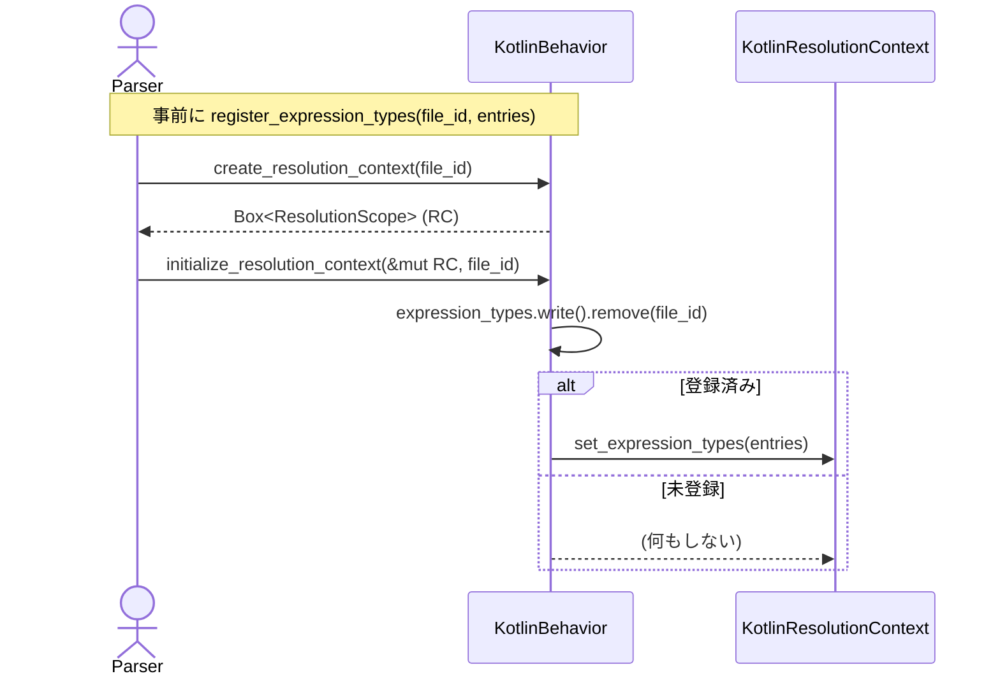
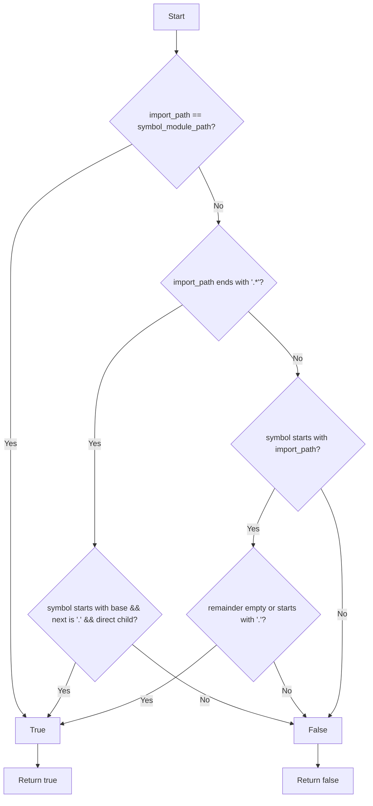

# parsing\kotlin\behavior.rs Review

## TL;DR

- 目的: Kotlin向けの言語固有振る舞いを提供し、汎用パーサに対してモジュールパス構築、可視性判定、インポート解決、式タイプ移送を行う。
- 主要公開API: KotlinBehavior::new, LanguageBehavior実装（configure_symbol, module_path_from_file, import_matches_symbol, is_symbol_visible_from_file など）。
- コアロジック: import_matches_symbolのワイルドカード・部分一致処理、module_path_from_fileのパス正規化、parse_visibilityの修飾子パース、式タイプの一時保持と解放。
- 複雑箇所: import_matches_symbolの分岐、式タイプの並行アクセス(RwLock)と初期化時の移譲(remove)。
- Rust安全性: unsafe不使用、Arc<RwLock<...>>でスレッドセーフ。writeロックの競合と多重初期化レースに注意。
- 重大リスク: Kotlinの可視性(especially protected/internal)とGradleモジュール境界の過度な寛容判定、importエイリアス非対応、KTSファイル名のドット扱い、同一file_idへの式タイプ登録/初期化の競合。
- スケーリング: 式タイプ登録でグローバルwriteロックによりスループット低下の可能性。DashMapやシャーディングで改善可。

## Overview & Purpose

本ファイルは、Kotlinコード解析のために、汎用のLanguageBehaviorトレイトに準拠した「KotlinBehavior」を提供する。主な責務は以下:

- モジュールパスの構築と整形（format_module_path, module_path_from_file）
- シンボルの基本設定（configure_symbol: 可視性・モジュールパス）
- インポート解決のマッチング（import_matches_symbol）
- 可視性判定（parse_visibility, is_symbol_visible_from_file）
- 解決コンテキストの作成と初期化（create_resolution_context, initialize_resolution_context）
- 型推論結果（式→型）の一時登録・移譲（register_expression_types → initialize_resolution_context）
- 継承解析のリゾルバ作成（create_inheritance_resolver）
- Kotlinがインタフェース(=traits)をサポートする旨の通知（supports_traits）

この振る舞いにより、Kotlinソースのシンボル解決や可視性判定、インポート処理がエンジンに統合される。

## Structure & Key Components

| 種別 | 名前 | 公開範囲 | 責務 | 複雑度 |
|------|------|----------|------|--------|
| Struct | KotlinBehavior | pub | Kotlin固有のLanguageBehavior実装（モジュール/可視性/インポート/型移送） | Med |
| Field | language: tree_sitter::Language | private | Kotlin用tree-sitter言語ハンドル | Low |
| Field | state: BehaviorState | private | インポート等の状態管理（StatefulBehaviorに準拠） | Med |
| Field | expression_types: Arc<RwLock<HashMap<FileId, HashMap<String, String>>>> | private | 式の型マッピング一時保管（ファイル単位） | Med |
| Trait impl | StatefulBehavior for KotlinBehavior | crate内 | state()提供 | Low |
| Trait impl | Default for KotlinBehavior | pub | new()委譲のデフォルト生成 | Low |
| Trait impl | LanguageBehavior for KotlinBehavior | crate内/推定pub | Kotlin固有の解析API群の実装 | Med |

内部の主なメソッド（抜粋）:

- configure_symbol: シンボルのモジュールパス設定、可視性設定、モジュール名の調整
- format_module_path: base_pathとsymbol_nameからフルモジュールパスを構築
- parse_visibility: シグネチャ文字列から可視性を決定
- module_path_from_file: ファイルパスからモジュールパス文字列へ変換
- import_matches_symbol: importパスとシンボルのモジュールパスの一致判定
- is_resolvable_symbol: 解決対象とすべきシンボル種別の判定
- is_symbol_visible_from_file: ファイル境界をまたぐ可視性の簡易判定
- register_expression_types / initialize_resolution_context: 型情報の一時登録と解決コンテキストへの移譲

### Dependencies & Interactions

- 内部依存
  - configure_symbol → format_module_path, parse_visibility
  - register_file/add_import/get_imports_for_file → StatefulBehaviorが提供する with_state系ヘルパ（register_file_with_state, add_import_with_state, get_imports_from_state）
  - initialize_resolution_context → expression_types.remove(file_id) → KotlinResolutionContext.set_expression_types
- 外部依存（このチャンクで参照）

| 依存 | 用途 |
|------|------|
| tree_sitter_kotlin::language() | KotlinのLanguageハンドル取得 |
| tree_sitter::Language | ツリーシッターの言語型 |
| parking_lot::RwLock | 高速なRWロックによる並行アクセス保護 |
| std::sync::Arc | 共有所有権（KotlinBehaviorはClone可能） |
| std::collections::HashMap | 各種マッピング（式→型など） |
| std::path::{Path, PathBuf} | パス処理 |
| crate::parsing::{LanguageBehavior, ResolutionScope, Import, InheritanceResolver} | パーサ・解決トレイト群 |
| crate::parsing::behavior_state::{BehaviorState, StatefulBehavior} | 状態管理およびwith_stateヘルパ |
| crate::{FileId, Symbol, SymbolKind, Visibility} | 型ID・シンボル表現・可視性 |
| crate::types::compact_string | 名前圧縮（軽量文字列化） |
| crate::config::is_global_debug_enabled | デバッグ出力の制御 |

- 被依存推定
  - Kotlinファイルのパース/解決フェーズで、パイプライン上の「言語固有ハンドラ」として利用される。
  - シンボルの可視性/解決判定、インポートの一致判定、解決コンテキストの初期化で呼び出される。
  - 上流（AST→シンボル抽出）と下流（解決/参照連結）の橋渡し。

## API Surface (Public/Exported) and Data Contracts

このファイルで外部に提供される主なAPIは、pub struct KotlinBehaviorおよびLanguageBehavior/StatefulBehaviorの実装メソッド群。以下に主要APIを一覧化する（行番号はこのチャンクには現れないため不明）。

| API名 | シグネチャ | 目的 | Time | Space |
|-------|-----------|------|------|-------|
| KotlinBehavior::new | fn new() -> Self | Kotlin向け振る舞いの生成 | O(1) | O(1) |
| Default::default | fn default() -> Self | new()と同等 | O(1) | O(1) |
| StatefulBehavior::state | fn state(&self) -> &BehaviorState | 内部状態の参照 | O(1) | O(1) |
| configure_symbol | fn configure_symbol(&self, symbol: &mut Symbol, module_path: Option<&str>) | シンボルのモジュールパス/可視性/名称調整 | O(L) | O(1) |
| create_resolution_context | fn create_resolution_context(&self, file_id: FileId) -> Box<dyn ResolutionScope> | Kotlin解決コンテキスト生成 | O(1) | O(1) |
| create_inheritance_resolver | fn create_inheritance_resolver(&self) -> Box<dyn InheritanceResolver> | 継承リゾルバ生成 | O(1) | O(1) |
| format_module_path | fn format_module_path(&self, base_path: &str, symbol_name: &str) -> String | モジュールパス整形 | O(B+S) | O(B+S) |
| parse_visibility | fn parse_visibility(&self, signature: &str) -> Visibility | 可視性修飾子の抽出 | O(L) | O(1) |
| module_separator | fn module_separator(&self) -> &'static str | モジュール区切り文字 | O(1) | O(1) |
| module_path_from_file | fn module_path_from_file(&self, file_path: &Path, project_root: &Path) -> Option<String> | ファイルパス→モジュールパス | O(P) | O(P) |
| get_language | fn get_language(&self) -> Language | ツリーシッター言語取得 | O(1) | O(1) |
| supports_traits | fn supports_traits(&self) -> bool | Kotlinのtrait(=interface)サポート有無 | O(1) | O(1) |
| register_file | fn register_file(&self, path: PathBuf, file_id: FileId, module_path: String) | 状態へのファイル登録 | O(1) | O(1) |
| add_import | fn add_import(&self, import: Import) | 状態へのインポート追加 | O(1) | O(1) |
| get_imports_for_file | fn get_imports_for_file(&self, file_id: FileId) -> Vec<Import> | ファイル単位のインポート取得 | O(k) | O(k) |
| get_module_path_for_file | fn get_module_path_for_file(&self, file_id: FileId) -> Option<String> | ファイルのモジュールパス取得 | O(1) | O(M) |
| register_expression_types | fn register_expression_types(&self, file_id: FileId, entries: &[(String, String)]) | 式→型の一時登録 | O(n) | O(n) |
| initialize_resolution_context | fn initialize_resolution_context(&self, context: &mut dyn ResolutionScope, file_id: FileId) | 解決CTXへの型移譲 | O(n) | O(1) |
| import_matches_symbol | fn import_matches_symbol(&self, import_path: &str, symbol_module_path: &str, _importing_module: Option<&str>) -> bool | importとシンボルの一致判定 | O(I+S) | O(1) |
| is_resolvable_symbol | fn is_resolvable_symbol(&self, symbol: &Symbol) -> bool | 解決対象種別の判定 | O(1) | O(1) |
| is_symbol_visible_from_file | fn is_symbol_visible_from_file(&self, symbol: &Symbol, from_file: FileId) -> bool | ファイル間可視性の簡易判定 | O(1) | O(1) |

凡例: L=signature長, P=パス長, B/S=base_path/symbol_name長, k=import数, M=モジュールパス長, n=entries数, I/S=文字列長。

各APIの詳細（抜粋）:

1) configure_symbol
- 目的と責務: シンボルにモジュールパスと可視性を設定。モジュール（ファイルモジュール想定）の場合、名前をモジュールパスの末尾に揃える。
- アルゴリズム:
  - module_pathがあれば format_module_path でフルパスを設定
  - signatureがあれば parse_visibility で可視性を設定
  - kindがModuleなら module_pathの末尾セグメントでsymbol.nameを上書き
- 引数:
  | 名称 | 型 | 説明 |
  |------|----|------|
  | symbol | &mut Symbol | 設定対象のシンボル |
  | module_path | Option<&str> | ベースのモジュールパス |
- 戻り値: なし
- 使用例:
  ```rust
  let mut sym = Symbol::new(/* ... */);
  let behavior = KotlinBehavior::new();
  behavior.configure_symbol(&mut sym, Some("com.example"));
  ```
- エッジケース:
  - module_pathが空("")の場合、format_module_pathがsymbol_nameだけを返す
  - kind==Moduleでmodule_pathがNoneなら名前変更は起きない

2) format_module_path
- 目的: base_pathとsymbol_nameを結合。symbol_nameが"<file>"の場合はbase_pathをそのまま返す。
- コード:
  ```rust
  fn format_module_path(&self, base_path: &str, symbol_name: &str) -> String {
      if base_path.is_empty() {
          symbol_name.to_string()
      } else if symbol_name == "<file>" {
          base_path.to_string()
      } else {
          format!("{base_path}.{symbol_name}")
      }
  }
  ```
- エッジケース:
  - base_path=="" → symbol_nameのみ
  - symbol_name=="<file>" → base_path

3) parse_visibility
- 目的: シグネチャ文字列から可視性（private/protected/internal/public/デフォルト）を抽出。
- コード:
  ```rust
  fn parse_visibility(&self, signature: &str) -> Visibility {
      let trimmed = signature.trim();
      if trimmed.contains("private") {
          Visibility::Private
      } else if trimmed.contains("protected") {
          Visibility::Module
      } else if trimmed.contains("internal") {
          Visibility::Crate
      } else {
          Visibility::Public
      }
  }
  ```
- エッジケース:
  - "public"明示は特別扱いせず、デフォルトと同じPublic
  - 単純な部分一致のため、将来のシグネチャ表現に依存

4) module_path_from_file
- 目的: ファイルパスからKotlinのパッケージ風モジュールパス文字列に変換（.kt/.kts拡張子切り落とし、よくあるsrcディレクトリ接頭辞の除去、'/'→'.'置換）
- 使用例:
  ```rust
  let p = PathBuf::from("project/src/main/kotlin/com/example/My.kt");
  let root = Path::new("project");
  let behavior = KotlinBehavior::new();
  let mp = behavior.module_path_from_file(&p, root);
  assert_eq!(mp.as_deref(), Some("com.example.My"));
  ```

5) import_matches_symbol
- 目的: importパスとシンボルのモジュールパスが一致するか判定
- ロジック:
  - 完全一致
  - ワイルドカード末尾 ".*" は直下の子のみ一致（ネストは不可）
  - importが親で、シンボルがその子孫（ドットで区切られる）であれば一致
- 使用例:
  ```rust
  let b = KotlinBehavior::new();
  assert!(b.import_matches_symbol("com.example.*", "com.example.MyClass", None));
  assert!(!b.import_matches_symbol("com.example.*", "com.example.sub.MyClass", None));
  assert!(b.import_matches_symbol("com.example.MyClass", "com.example.MyClass.Inner", None));
  ```

6) register_expression_types / initialize_resolution_context
- 目的: ファイル単位で集めた式タイプマップを、解決コンテキスト初期化時に移譲（remove）してセット
- 重要事項: initialize時にRwLockのwriteでremoveするため、同一file_idに対する複数回初期化では最初の1回のみ移譲される

その他のAPIは表に準ずる。

## Walkthrough & Data Flow

典型的なフロー:
1) KotlinBehavior生成（new/default）
2) ファイルパス→モジュールパス生成（module_path_from_file）
3) ファイル登録・インポート追加（register_file, add_import）
4) シンボル抽出時にconfigure_symbolでモジュールパス/可視性設定
5) 式タイプを抽出しregister_expression_typesで一時登録
6) create_resolution_contextでKotlinResolutionContext生成
7) initialize_resolution_contextで式タイプマップを移譲（remove→set）
8) 参照解決時にimport_matches_symbolやis_resolvable_symbol/is_symbol_visible_from_fileで判定

Mermaidシーケンス（式タイプの移譲。上記の図は initialize_resolution_context 関数（行番号不明）の主要やり取りを示す）:


Mermaidフローチャート（import_matches_symbolの分岐。上記の図は import_matches_symbol 関数（行番号不明）の主要分岐を示す）:


## Complexity & Performance

- 全体: 文字列処理中心でCPU負荷は低い。I/Oなし。主要コストは文字列生成/比較とHashMap操作。
- register_expression_types: O(n)でentriesをクローンしてHashMap化。グローバルRwLockのwriteを取得するため、並列登録が多いと待機時間が発生しうる。
- initialize_resolution_context: RwLock writeでremove(O(1))し、contextへ移譲。二重初期化時は2回目以降がデータ無し。
- module_path_from_file: パス正規化と置換でO(P)。長大なパス/多数ファイルのバッチ処理でも線形。
- import_matches_symbol: 文字列の接頭辞/接尾辞判定でO(I+S)。
- スケール限界/ボトルネック:
  - Arc<RwLock<...>>への集中writeがホットスポットに。多数スレッドが並列にregister_expression_typesするとスループットが低下。
  - 文字列の反復生成（format_module_path, module_path_from_file）が蓄積するとGC圧/ヒープ割当が増大。

## Edge Cases, Bugs, and Security

セキュリティチェックリスト:
- メモリ安全性: unsafe未使用。所有権/借用はRust型システムで保護。Buffer overflow/Use-after-freeのリスクは見当たらない。
- インジェクション: 外部I/Oやコマンド実行、SQLはなし。パスは表示用変換のみでリスク低。
- 認証・認可: 該当なし。
- 秘密情報: eprintlnによるデバッグ出力でfile_idと件数を表示する可能性。機密は含まれない想定だが、デバッグ有効時のログ過多に注意。
- 並行性: Arc<RwLock>運用でデータ競合は防止。ただし、式タイプの登録/初期化の順序競合（レース）や多重初期化による取りこぼしに注意。

エッジケース詳細:

| エッジケース | 入力例 | 期待動作 | 実装 | 状態 |
|-------------|--------|----------|------|------|
| 空のbase_path | base_path=""、symbol_name="My" | "My" | format_module_path | OK |
| <file>特例 | base_path="com.ex", symbol_name="<file>" | "com.ex" | format_module_path | OK |
| 公開明示 | "public fun f()" | Public | parse_visibility（デフォルト） | OK |
| 複合修飾子 | "private internal fun f()" | もっとも制限的に解釈 | parse_visibilityは"private"優先 | OK |
| 署名に単語埋め込み | "fun privately()" | 誤検知しない | contains("private")のため誤検知の可能性（署名表現次第） | 要確認 |
| KTSのドット含み | "build.gradle.kts" | "build.gradle"（パッケージではない） | module_path_from_file | グレー |
| ワイルドカードの直下判定 | "com.example.*" vs "com.example.sub.C" | false | import_matches_symbol | OK |
| エイリアスimport | "import a.b.C as D" | Dに一致 | import_matches_symbolは非対応 | 欠落 |
| internal/protected可視性 | Kotlinの厳密ルール | 厳密に準拠 | is_symbol_visible_from_fileは常にtrue寄り | 過度に寛容 |
| 式タイプ多重初期化 | 同一file_idでinitを複数回 | 少なくとも一度は移譲 | removeにより2回目は空 | 要改善 |

Rust特有の観点:
- 所有権: get_languageはLanguageをcloneして返却。register_expression_typesはentriesの(String, String)をHashMapへclone挿入。移譲時（initialize_resolution_context）はHashMapをremoveして所有権を移動。
- 借用: RwLock.write()のスコープ内でのみ可変アクセス。外部へ参照を保持しないため安全。
- ライフタイム: 明示的なライフタイムは不要。
- unsafe境界: なし。
- 並行性/非同期: Send/Sync境界は依存型に準ずる（tree_sitter::Language/parking_lotは一般にSend/Syncを満たす設計）。awaitは登場しない。キャンセル制御なし。
- エラー設計: Option/Bool中心で早期失敗シグナル（module_path_from_fileはprefix不可時None）。panic誘発のunwrap/expectなし。From/Intoによるエラー変換なし。

## Design & Architecture Suggestions

- Kotlin可視性の厳密化:
  - internalは同一Gradleモジュール内のみ可視。from_fileのモジュール境界（プロジェクト/モジュールID）を導入し判定すべき。
  - protectedはサブクラス内のみ。継承関係を参照可能なContextを受け取り厳密化する。
- importエイリアス対応:
  - Importにaliasがある場合の判定（D.メンバ → a.b.Cに解決）をimport_matches_symbolに追加。
- module_path_from_fileの信頼性向上:
  - Kotlinファイル内のpackage宣言を優先してモジュールパスを決定し、ディレクトリ構造はフォールバックに。
  - .ktsの特殊ファイル名に含まれる'.'の扱いを定義（正規化や置換）。
- 式タイプの並行性:
  - DashMap<FileId, ...>やsharded RwLockでwriteロック競合を軽減。もしくは各file_idごとにMutex<HashMap>を分離。
  - initialize_resolution_contextの多重呼び出しを検知し、すでに移譲済ならNOPログ等で可視化。
- ロギング/トレーシング:
  - eprintlnではなくtracingクレートを使用し、file_id/件数/所要時間をspanで計測。
- 文字列割当削減:
  - format_module_pathはString::with_capacityを用いる、またはCow<str>で不要なclone回避。
  - register_expression_typesのキー/値をCompactString等に最適化（crate::types::compact_stringの活用範囲拡大）。

## Testing Strategy (Unit/Integration) with Examples

既存テスト: parse_visibility, format_module_path, import_matches_symbol, module_separator, supports_traits。

追加を推奨するテスト:

- module_path_from_file（Windows/Linux、各種srcパス、.kt/.kts）
```rust
#[test]
fn test_module_path_from_file_variants() {
    let behavior = KotlinBehavior::new();
    let root = Path::new("proj");

    let p1 = Path::new("proj/src/main/kotlin/com/example/My.kt");
    assert_eq!(
        behavior.module_path_from_file(p1, root).as_deref(),
        Some("com.example.My")
    );

    let p2 = Path::new("proj\\src\\test\\java\\org\\acme\\Foo.kt");
    assert_eq!(
        behavior.module_path_from_file(p2, root).as_deref(),
        Some("org.acme.Foo")
    );

    let p3 = Path::new("proj/build.gradle.kts");
    assert_eq!(
        behavior.module_path_from_file(p3, root).as_deref(),
        Some("build.gradle")
    );
}
```

- import_matches_symbol（ネスト・直下・不正ワイルドカード・部分一致境界）
```rust
#[test]
fn test_import_matches_symbol_more_cases() {
    let b = KotlinBehavior::new();

    // 親パスとして一致（ドット境界必須）
    assert!(b.import_matches_symbol("a.b.C", "a.b.C.Inner", None));
    assert!(!b.import_matches_symbol("a.b.C", "a.b.Class", None));

    // 多段ネストはワイルドカード直下では不一致
    assert!(!b.import_matches_symbol("a.b.*", "a.b.c.D", None));

    // 不正: ダブルワイルドカード（現実には出ないが健全性確認）
    assert!(!b.import_matches_symbol("a.*.*", "a.b.C", None));
}
```

- configure_symbol（Module名の末尾セグメント適用）
```rust
#[test]
fn test_configure_symbol_module_name() {
    let b = KotlinBehavior::new();
    let mut sym = Symbol::new(/* ... */);
    sym.kind = SymbolKind::Module;
    sym.name = compact_string("<file>");
    b.configure_symbol(&mut sym, Some("com.example"));
    assert_eq!(sym.name.as_str(), "example"); // 末尾セグメント
    assert_eq!(sym.module_path.as_deref(), Some("com.example.<file>".into().as_str())); // 期待形は実装依存
}
```
注: 上記newやSymbol生成は実際のコンストラクタに合わせ要調整。

- is_resolvable_symbol（各SymbolKindの境界）
```rust
#[test]
fn test_is_resolvable_symbol_kinds() {
    let b = KotlinBehavior::new();
    let mut sym = Symbol::new(/*...*/);

    sym.kind = SymbolKind::Class;
    assert!(b.is_resolvable_symbol(&sym));
    sym.kind = SymbolKind::Module;
    assert!(!b.is_resolvable_symbol(&sym));
}
```

- 並行性（integrationレベル）: 複数スレッドでregister_expression_types → initialize_resolution_contextを同時に実行し、データ競合がないこと、一度のみ移譲されることを検証。

## Refactoring Plan & Best Practices

- 可視性判定強化:
  - is_symbol_visible_from_fileにモジュール境界（Gradle Module ID等）と継承関係をインジェクトし、internal/protectedの正確性を確保。
- importエイリアス:
  - Importにaliasフィールドがあるならimport_matches_symbolで解釈し一致判定に反映。
- コンカレンシー改善:
  - expression_typesをDashMap<FileId, _>へ変更。remove/insertがロックフリーに近くなりスケール。
- ロギング/観測可能性:
  - tracingへ移行。spanでファイル単位の解析フェーズを計測、デバッグフラグ依存の冗長出力を適切なレベルへ。
- 文字列の扱い:
  - format_module_pathやmodule_path_from_fileで必要容量を見積もったString確保を行い再割当を減らす。
  - compact_stringの適用範囲拡張（式タイプキー/値への適用を検討）。
- APIの堅牢性:
  - module_path_from_fileが空文字を返すケースの取り扱いを明示（Noneにするか、呼び出し側で検証）。

## Observability (Logging, Metrics, Tracing)

- 現状: デバッグ時のみeprintlnで式タイプ登録数を出力。
- 改善提案:
  - tracingのspanを導入: "kotlin.resolve"（fields: file_id, entries）で計測。
  - メトリクス: 
    - counter: kotlin_expression_types_registered_total
    - gauge: kotlin_expression_types_pending（RwLock内のfile_id件数）
    - histogram: initialize_resolution_context_duration_seconds
  - ログ粒度: DEBUGで詳細、INFOで集計、ERRORで失敗時（downcast失敗等）。

## Risks & Unknowns

- 不明:
  - KotlinResolutionContext/KotlinInheritanceResolverの具体実装と安全性・Send/Sync境界。
  - BehaviorStateの内部実装（ロック戦略・整合性モデル）。
  - Import構造体にエイリアスやスタティックメンバimport等の表現があるか。
  - Symbol::new等のコンストラクタ、scope_contextの厳密な意味づけ。
- リスク:
  - internal/protectedの過度に寛容な可視性判定により、解決候補が過剰になる可能性。
  - 式タイプの多重初期化や初期化順のレースにより、式タイプがコンテキストに渡らないケース。
  - KTS等の特殊ファイル名に含まれるドットがモジュールパスに混入する設計上の意図不明点。
  - importエイリアス未対応による解決漏れ。

以上、このチャンクには未記載の行番号や他モジュールの詳細は「不明」または「このチャンクには現れない」。