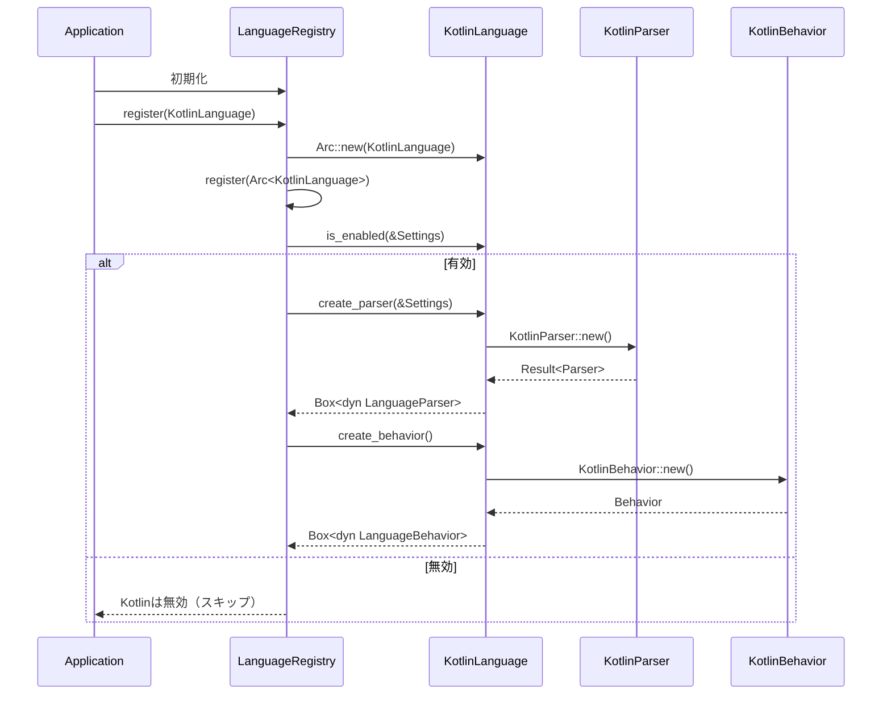

# parsing\kotlin\definition.rs Review

## TL;DR

- 目的: 言語レジストリにKotlin言語を登録するための**メタデータ**と**ファクトリ**（パーサ/ビヘイビア）を提供
- 公開API: **KotlinLanguage（構造体）**と**LanguageDefinitionトレイト実装**が外部から利用可能。補助の**register関数はpub(crate)**で内部登録用
- コアロジック: `create_parser`が`KotlinParser::new()`の失敗を**IndexError::General**に正規化（L33–36）
- 複雑箇所: **is_enabled**の設定参照ロジック（`Settings.languages`からIDベースで有効/無効を決定、L46–52）
- Rust安全性: **unsafeなし**、所有権は単純（Box/Arcの所有移動のみ）、**並行性対応はArcの共有**で十分
- 重大リスク: エラー型を一括で`IndexError::General`へ変換するため、**詳細なエラー原因を失う可能性**（L34）
- テスト: メタデータ/デフォルト有効/パーサ生成の**基本テスト**あり（L64–88）。設定で明示的に無効化するケースのテストが不足

## Overview & Purpose

このファイルは、言語レジストリにおける**Kotlin言語定義**を提供します。外部のパーサ/ビヘイビア実装（`super::{KotlinBehavior, KotlinParser}`）とレジストリの契約（`LanguageDefinition`トレイト）をつなぐ「グルーコード」として機能します。

主な役割:
- 言語ID、表示名、拡張子などの**メタデータ**を提供（L21–31）
- Kotlinパーサ/ビヘイビアの**生成**を提供（L33–40）
- 言語の**デフォルト有効状態**と**設定に基づく有効判定**を提供（L42–52）
- グローバルレジストリへの**登録関数**を提供（pub(crate)、L56–58）

## Structure & Key Components

| 種別 | 名前 | 公開範囲 | 責務 | 複雑度 |
|------|------|----------|------|--------|
| Struct | KotlinLanguage | pub | Kotlin言語のメタデータとファクトリのエントリポイント | Low |
| Const | KotlinLanguage::ID | pub | 安定な言語ID（"kotlin"）を提供（L15–18） | Low |
| Impl | impl LanguageDefinition for KotlinLanguage | -（トレイト実装） | メタデータ・パーサ/ビヘイビア生成・有効判定（L20–52） | Low |
| Fn | register | pub(crate) | レジストリにKotlinLanguageを登録（Arc共有、L56–58） | Low |
| Mod | tests | #[cfg(test)] | 基本的なメタ／有効／パーサ生成テスト（L60–88） | Low |

### Dependencies & Interactions

- 内部依存
  - `create_parser` → `KotlinParser::new()`（L33–36）
  - `create_behavior` → `KotlinBehavior::new()`（L38–40）
  - `is_enabled` → `Settings.languages`から言語設定参照（L46–52）
- 外部依存（表）

| 依存元 | シンボル | 用途 | 備考 |
|--------|---------|------|------|
| std::sync | Arc | 言語定義の共有所有権 | レジストリで共有（L56–58） |
| super | KotlinParser, KotlinBehavior | パーサ/ビヘイビアの具体型 | 実装詳細はこのチャンクには現れない |
| crate::parsing | LanguageBehavior, LanguageDefinition, LanguageId, LanguageParser | レジストリ契約と型 | 公開かは不明だが利用前提 |
| crate | IndexError, IndexResult, Settings | エラー/結果型、設定 | Settings構造はこのチャンクには現れない |

- 被依存推定
  - `crate::parsing::LanguageRegistry`が`register`で使用（L56–58）
  - レジストリ経由で他のモジュールが`LanguageDefinition`トレイトを介して`create_parser`/`create_behavior`/`is_enabled`を呼び出す想定

## API Surface (Public/Exported) and Data Contracts

| API名 | シグネチャ | 目的 | Time | Space |
|-------|-----------|------|------|-------|
| KotlinLanguage（型） | pub struct KotlinLanguage | 言語定義の具象型 | O(1) | O(1) |
| KotlinLanguage::ID | pub const ID: LanguageId | 安定な言語ID | O(1) | O(1) |
| LanguageDefinition::id | fn id(&self) -> LanguageId | ID取得 | O(1) | O(1) |
| LanguageDefinition::name | fn name(&self) -> &'static str | 表示名取得 | O(1) | O(1) |
| LanguageDefinition::extensions | fn extensions(&self) -> &'static [&'static str] | 拡張子一覧取得 | O(1) | O(1) |
| LanguageDefinition::create_parser | fn create_parser(&self, _settings: &Settings) -> IndexResult<Box<dyn LanguageParser>> | パーサ生成 | O(1)※ | O(1)＋Box |
| LanguageDefinition::create_behavior | fn create_behavior(&self) -> Box<dyn LanguageBehavior> | ビヘイビア生成 | O(1) | O(1)＋Box |
| LanguageDefinition::default_enabled | fn default_enabled(&self) -> bool | デフォルト有効判定 | O(1) | O(1) |
| LanguageDefinition::is_enabled | fn is_enabled(&self, settings: &Settings) -> bool | 設定に基づく有効判定 | O(1)平均※ | O(1) |
| register（内部） | pub(crate) fn register(registry: &mut crate::parsing::LanguageRegistry) | レジストリ登録 | O(1) | O(1) |

※ `create_parser`の実際の計算量は`KotlinParser::new()`に依存（このチャンクには現れない）。`is_enabled`の計算量はキー検索のデータ構造に依存（一般にHashMapなら平均O(1)、このチャンクには詳細不明）。

以下、各APIの詳細。

1) LanguageDefinition::id（L21–23）
- 目的と責務: **言語ID**を返す
- アルゴリズム:
  1. `Self::ID`をそのまま返す
- 引数

| 名前 | 型 | 説明 |
|------|----|------|
| self | &Self | 受け取り専用参照 |

- 戻り値

| 型 | 説明 |
|----|------|
| LanguageId | "kotlin"のID |

- 使用例
```rust
let lang = KotlinLanguage;
assert_eq!(lang.id().as_str(), "kotlin");
```
- エッジケース
  - 静的定数のためなし

2) LanguageDefinition::name（L25–27）
- 目的と責務: 表示用の**人間可読名**を返す
- アルゴリズム: "Kotlin"を返す
- 引数/戻り値

| 引数 | 型 | 説明 |
|------|----|------|
| self | &Self | - |

| 戻り値 | 説明 |
|--------|------|
| &'static str | "Kotlin" |

- 使用例
```rust
let lang = KotlinLanguage;
assert_eq!(lang.name(), "Kotlin");
```
- エッジケース: なし

3) LanguageDefinition::extensions（L29–31）
- 目的と責務: 取り扱う**ファイル拡張子**一覧の提供
- アルゴリズム: 静的スライス`&["kt", "kts"]`を返す
- 引数/戻り値

| 引数 | 型 |
|------|----|
| self | &Self |

| 戻り値 | 説明 |
|--------|------|
| &'static [&'static str] | Kotlin/スクリプト |

- 使用例
```rust
let lang = KotlinLanguage;
assert!(lang.extensions().contains(&"kt"));
```
- エッジケース: なし（静的）

4) LanguageDefinition::create_parser（L33–36）
- 目的と責務: Kotlinソースを解析する**パーサ**の生成
- アルゴリズム:
  1. `KotlinParser::new()`を呼ぶ
  2. 失敗時は`map_err(IndexError::General)`で変換
  3. 成功時は`Box<dyn LanguageParser>`に包んで返す
- 引数

| 名前 | 型 | 説明 |
|------|----|------|
| _settings | &Settings | 現状未使用（将来の拡張余地） |

- 戻り値

| 型 | 説明 |
|----|------|
| IndexResult<Box<dyn LanguageParser>> | 成功時パーサ、失敗時IndexError |

- 使用例
```rust
let lang = KotlinLanguage;
let settings = Settings::default();
let parser = lang.create_parser(&settings)?;
```
- エッジケース
  - KotlinParser::new()が**失敗**した場合、エラーが`IndexError::General`に正規化され**詳細を失う**可能性
  - settingsは未使用だが、将来機能追加で意味を持つ可能性

5) LanguageDefinition::create_behavior（L38–40）
- 目的と責務: レジストリが使用する**言語固有のビヘイビア**生成
- アルゴリズム: `KotlinBehavior::new()`を`Box`で返す
- 引数/戻り値

| 引数 | 型 |
|------|----|
| self | &Self |

| 戻り値 | 説明 |
|--------|------|
| Box<dyn LanguageBehavior> | ビヘイビアインスタンス |

- 使用例
```rust
let behavior = KotlinLanguage.create_behavior();
```
- エッジケース: `KotlinBehavior::new()`の失敗は想定していない（戻り値の型上）

6) LanguageDefinition::default_enabled（L42–44）
- 目的と責務: **デフォルトの有効状態**を返す
- アルゴリズム: `true`固定
- 引数/戻り値

| 引数 | 型 |
|------|----|
| self | &Self |

| 戻り値 | 説明 |
|--------|------|
| bool | デフォルトで有効（true） |

- 使用例
```rust
assert!(KotlinLanguage.default_enabled());
```
- エッジケース: なし

7) LanguageDefinition::is_enabled（L46–52）
- 目的と責務: 設定に基づいて**有効/無効を判定**
- アルゴリズム:
  1. `settings.languages.get(self.id().as_str())`で言語設定を検索
  2. 見つかった場合は`config.enabled`を返す
  3. 見つからなければ`default_enabled()`を返す
- 引数/戻り値

| 引数 | 型 | 説明 |
|------|----|------|
| self | &Self | - |
| settings | &Settings | 言語設定を含む |

| 戻り値 | 説明 |
|--------|------|
| bool | 有効ならtrue |

- 使用例
```rust
let settings = Settings::default();
let enabled = KotlinLanguage.is_enabled(&settings);
```
- エッジケース
  - 設定にKotlin項目が**存在しない**場合、デフォルト（true）にフォールバック
  - 設定項目の**enabledがfalse**なら無効

8) register（L56–58, pub(crate)）
- 目的と責務: **レジストリへの登録**（内部API）
- アルゴリズム:
  1. `Arc::new(KotlinLanguage)`で共有可能にする
  2. `registry.register(...)`に渡す
- 引数/戻り値

| 引数 | 型 | 説明 |
|------|----|------|
| registry | &mut crate::parsing::LanguageRegistry | レジストリ |

| 戻り値 | 説明 |
|--------|------|
| () | なし |

- 使用例（コンセプト）
```rust
fn bootstrap(registry: &mut crate::parsing::LanguageRegistry) {
    parsing::kotlin::definition::register(registry); // pub(crate): 同一クレート内で使用
}
```
- エッジケース: なし（共有所有権の付与のみ）

## Walkthrough & Data Flow

典型的な流れ（登録から使用まで）:

1. レジストリ初期化時に`register`が呼ばれ、`Arc<KotlinLanguage>`が登録される（L56–58）
2. レジストリが`Settings`に基づいて`is_enabled`を呼び、有効性を判定（L46–52）
3. 有効な場合、`create_parser`で`Box<dyn LanguageParser>`を取得（L33–36）
4. 同様に`create_behavior`で`Box<dyn LanguageBehavior>`を取得（L38–40）
5. 以後、レジストリはメタ情報（`id`/`name`/`extensions`）を参照しつつ、解析処理にパーサ/ビヘイビアを用いる

Mermaidシーケンス図（アクター数が3以上のため使用）。上記の図は`register`関数（L56–58）と`LanguageDefinition`実装（L21–52）の主要な相互作用を示す。



## Complexity & Performance

- 各メタデータAPI（`id`, `name`, `extensions`, `default_enabled`）: 時間O(1), 空間O(1)
- `is_enabled`: 一般にHashMap検索で平均O(1)（`Settings.languages`の型はこのチャンクには現れないが、典型的にはハッシュ構造）
- `create_parser`/`create_behavior`: ラッパー自体はO(1)。ただし実際の**コストはKotlinParser/KotlinBehaviorの生成**に依存（不明）
- ボトルネック: 現状なし。実運用では**パーサ生成コスト**が支配的になり得る
- スケール限界: ほぼなし。レジストリ内での言語数が増えても本APIは定数時間で動作

I/O/ネットワーク/DB:
- 本チャンクには該当なし。外部I/Oはパーサ側の実装次第（不明）

## Edge Cases, Bugs, and Security

- メモリ安全性
  - Buffer overflow / Use-after-free / Integer overflow: 該当なし（安全なRustのみ、`unsafe`使用なし）
  - 所有権: `create_parser`で`parser`を`Box`に移動して返却（L35）。`register`で`Arc`に包んでレジストリに移譲（L56–58）
- インジェクション（SQL/Command/Path traversal）
  - 該当なし。このチャンクには外部入力や実行なし
- 認証・認可
  - 該当なし
- 秘密情報
  - ハードコードされたシークレット: 該当なし
  - ログ漏えい: ログ処理なし
- 並行性
  - Race condition/Deadlock: 該当なし。`Arc`により共有は安全
  - Send/Sync: `KotlinLanguage`はゼロサイズで不変。Send/Syncの境界は**レジストリ/パーサのトレイト境界に依存**（このチャンクには現れない）

エッジケース詳細

| エッジケース | 入力例 | 期待動作 | 実装 | 状態 |
|-------------|--------|----------|------|------|
| 設定項目なし | `Settings.languages`に"kotlin"キーなし | `default_enabled()`にフォールバック（true） | `unwrap_or(self.default_enabled())`（L51） | テスト未網羅 |
| 明示的に無効 | `Settings.languages["kotlin"].enabled = false` | falseを返す | `.map(|config| config.enabled)`（L50） | テスト未網羅 |
| パーサ生成失敗 | `KotlinParser::new()`がErr | `IndexError::General`でErrを返す | `map_err(IndexError::General)?`（L34） | テスト未網羅 |
| 拡張子問い合わせ | - | `["kt","kts"]`を返す | 静的返却（L29–31） | テスト済（L68–71） |

潜在バグ・懸念:
- エラー正規化: `IndexError::General`への一律変換で**原因の粒度が落ちる**（L34）。デバッグやユーザ通知で不利
- テスト不足: `is_enabled`の分岐（明示的無効）と`create_parser`のErrパスが未テスト

## Design & Architecture Suggestions

- エラー設計の改善
  - `KotlinParser::new()`のエラー型に`From`を実装し、`?`で自動変換することで**詳細保持**を検討（例: `impl From<KotlinParserError> for IndexError`）
  - もしくは`IndexError::ParserCreation { lang: LanguageId, source: ... }`のような**構造化エラー**を導入
- テスト容易性の向上
  - パーサ/ビヘイビア生成を**ファクトリトレイト**に切り出し、DIでテスト時に失敗を注入可能にする
- API明確化
  - `create_parser`の`_settings`が未使用であることは明示的だが、将来的に使用予定なら**ドキュメントコメント**で意図を補足
- 登録関数の一貫性
  - `register`に戻り値は不要だが、失敗可能性がある場合は`Result`化を検討（現状は不要）
- メタデータの拡張性
  - 拡張子一覧の**重複/正規化**（例えば大文字拡張子への対応）をレジストリ側で担保する旨の契約をドキュメント化

## Testing Strategy (Unit/Integration) with Examples

既存テスト（L64–88）に加えて、以下を推奨。

- is_enabled（明示的無効化）のテスト
```rust
// このチャンクにはSettings.languagesの具体型が現れないため擬似コード
#[test]
fn test_is_enabled_explicitly_disabled() {
    let lang = KotlinLanguage;
    let mut settings = Settings::default();
    // settings.languages.insert("kotlin", LanguageConfig { enabled: false, /* ... */ });
    assert_eq!(lang.is_enabled(&settings), false);
}
```

- パーサ生成失敗のテスト
  - 直接は困難（`KotlinParser::new()`のエラー要因不明）。ファクトリ注入や`KotlinParser::new()`を**テスト用に失敗させるフック**があると望ましい

- レジストリ統合テスト
```rust
// コンセプト例（レジストリ型詳細不明のため簡略化）
fn integration_register_and_create() {
    let mut registry = crate::parsing::LanguageRegistry::new(); // このチャンクには現れない
    parsing::kotlin::definition::register(&mut registry); // pub(crate)
    // registryがKotlin言語を認識し、必要に応じてparser/behaviorを生成できることを確認
}
```

## Refactoring Plan & Best Practices

- エラー詳細の保持（前述）
- ドキュメント強化
  - `create_parser`/`create_behavior`に**生成の副作用**（スレッドセーフ性や重さ）の注意書きを追加
- コードスタイル
  - `create_parser`の`_settings`について「未使用は仕様」だとわかるよう**関数コメント**に明記
- Trait境界の明示（必要に応じて）
  - `LanguageParser`/`LanguageBehavior`が`Send+Sync`を要求するなら**トレイト境界を明示**して並行性契約を強化（このチャンクには現れない）

## Observability (Logging, Metrics, Tracing)

- ログ
  - `create_parser`失敗時に**言語IDと原因**をログ出力（例: `log::error!`）。現在は呼び出し側の責務だが、エラー型に情報を持たせることが重要
- メトリクス
  - パーサ/ビヘイビア生成の**回数/失敗数**をカウント
- トレーシング
  - レジストリの言語決定フロー（`is_enabled`→`create_parser`）に**span**を付与するとデバッグが容易

## Risks & Unknowns

- 不明点
  - `KotlinParser`/`KotlinBehavior`の具体実装・生成コスト・エラー型（このチャンクには現れない）
  - `Settings.languages`のデータ構造（HashMap等）と`LanguageConfig`の詳細（このチャンクには現れない）
  - `LanguageRegistry.register`の実装とエラーハンドリング（このチャンクには現れない）
- リスク
  - エラーを`IndexError::General`に集約することによる**診断性の低下**
  - `is_enabled`がデフォルトtrueのため、設定未指定でも**有効化されすぎる**可能性（運用ポリシー次第）