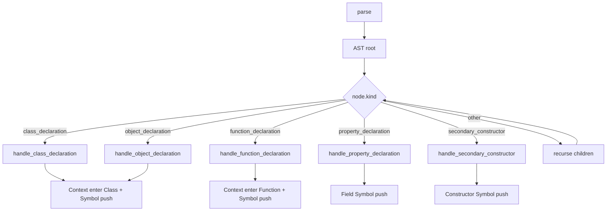

# parsing\kotlin\parser.rs Review

## TL;DR

- 目的: Kotlinコードをtree-sitterによりAST解析し、クラス/オブジェクト/関数/プロパティ等の**シンボル抽出**と各種クエリ（呼び出し・拡張・型使用・輸入・型推定）を提供
- 公開API: **KotlinParser::new**, **KotlinParser::get_handled_nodes**（構造体/メソッド）、および**LanguageParser/NodeTrackerトレイト実装**によるクエリ群（parse, find_calls, find_extends, find_uses, find_imports など）
- コアロジック: **extract_symbols_from_node**の再帰走査と、**handle_***系ハンドラ（class/object/function/property/constructor）でシンボル構築。型推定は**collect_function_signatures → infer_call_expression_type → apply_signature**の連携で行う
- 複雑箇所: Kotlin拡張関数・ジェネリクスの**戻り値型代入（apply_type_substitution）**、**call式の引数型推定**、**スコープ文脈（ParserContext）**管理
- 重大リスク: tree-sitterのノード種別依存による**パーサ堅牢性**、**エラー非伝播**（parseの失敗が空ベクタ）、**正規表現代入のコスト**、**並行性非対応（ParserはSyncでない前提）**
- Rust安全性: **unsafe不使用**、借用はコードスライスに限定。**OnceLock**によるプリミティブ型集合の初期化。戻り値のスライスは**コード文字列のライフタイム**に正しく接続
- セキュリティ: 実行・IO・外部コマンドなしでインジェクションの懸念小。ログはeprintlnのみ。機密情報の取り扱いなし

## Overview & Purpose

このファイルはKotlin言語用の**パーサ実装**で、tree-sitter-kotlinの言語定義を使用してASTを走査し、プロジェクト内の**シンボル（クラス、メソッド、関数、フィールド、列挙値、モジュール）**を抽出します。さらに、以下のような分析クエリを提供します。

- 呼び出し関係の抽出（関数・メソッド）
- 拡張関係（継承/実装）の抽出
- 型使用関係（パラメータ型・戻り値型・プロパティ型）の抽出
- importの抽出
- 変数/式の型推定（リテラル／関数呼び出し、ジェネリクス代入対応）

構造体KotlinParserは**LanguageParser**トレイトを実装し、フレームワーク側から統一的に利用される設計です。安全性（所有権・借用）を保ちながら、再帰の深さチェック（check_recursion_depth）やキャッシュ的な**NodeTrackingState**を用いたハンドリング監査も行います。

## Structure & Key Components

| 種別 | 名前 | 公開範囲 | 責務 | 複雑度 |
|------|------|----------|------|--------|
| Struct | KotlinParser | pub | Kotlin向けASTパーサ本体（tree-sitter初期化・解析・各種クエリ） | Med |
| Type | FunctionSignature<'a> | private | 関数名・ジェネリクス・引数型・戻り値型を表現 | Med |
| Type | GenericParameter<'a> | private | ジェネリック型パラメータ（制約含む） | Low |
| Type alias | FunctionSignatureMap<'a> | private | 関数名→署名のマップ | Low |
| Const | NODE_*（種別多数） | private | ASTノード種別の文字列定数 | Low |
| Static | KOTLIN_PRIMITIVE_TYPES (OnceLock<HashSet<&'static str>>) | private | Kotlinプリミティブ型の集合 | Low |
| Trait impl | LanguageParser for KotlinParser | public API経由 | parse/find_calls/find_extends/find_uses/find_importsなどの公開クエリ | Med |
| Trait impl | NodeTracker for KotlinParser | public API経由 | ハンドリングノード収集API | Low |
| Method | KotlinParser::new() -> Result<Self, String> | pub | tree-sitter-kotlinの言語設定と初期化 | Low |
| Method | KotlinParser::get_handled_nodes(&self) | pub | 監査用ハンドル済みノードの取得 | Low |

### Dependencies & Interactions

- 内部依存
  - parse → extract_symbols_from_node（再帰）→ handle_class_declaration / handle_object_declaration / handle_function_declaration / handle_property_declaration / handle_secondary_constructor
  - find_variable_types → collect_function_signatures → collect_variable_types → infer_call_expression_type → collect_argument_types → apply_signature → build_generic_substitution → apply_type_substitution
  - find_calls → collect_calls
  - find_method_calls → collect_method_calls
  - find_extends → collect_extends
  - find_uses → extract_type_uses_recursive
  - find_defines → extract_method_defines_recursive
  - doc_comment_for → extract_comment_text / peek_comment_text
  - determine_visibility（modifiers）/ extract_signature / extract_function_info（署名構築）
- 外部依存（表）
  | 依存 | 用途 | 備考 |
  |------|------|------|
  | tree_sitter::{Node, Parser} | AST構築・走査 | Parser::parseがOptionで失敗時None |
  | tree_sitter_kotlin::language | Kotlin言語定義 | 初期化時に設定 |
  | regex | 型式文字列へのジェネリクス代入（単語境界置換） | apply_type_substitution |
  | std::sync::OnceLock | プリミティブ型集合の遅延初期化 | スレッド安全な初期化 |
  | crate::parsing::{LanguageParser, NodeTracker, ParserContext, ScopeType, Import, MethodCall, HandledNode} | フレームワークトレイト・文脈管理・メタ型 | 仕様詳細はこのチャンクには現れない |
  | crate::types::{SymbolCounter} | シンボルID採番 | |
  | crate::{FileId, Range, Symbol, SymbolKind, Visibility} | メタデータ型 | |
  | crate::config | グローバルデバッグフラグ | eprintlnでタイプ推定ログ |
  | crate::symbol::ScopeContext | スコープ種別（Module/ClassMember等） | |
- 被依存推定
  - リポジトリ内の解析フレームワーク（LanguageParser利用箇所）
  - シンボルストアやグラフ構築ロジック（symbolsの消費者）
  - メトリクス/監査ツール（get_handled_nodesの利用者）

## API Surface (Public/Exported) and Data Contracts

| API名 | シグネチャ | 目的 | Time | Space |
|-------|-----------|------|------|-------|
| KotlinParser::new | pub fn new() -> Result<Self, String> | パーサ初期化（tree-sitter言語設定） | O(1) | O(1) |
| KotlinParser::get_handled_nodes | pub fn get_handled_nodes(&self) -> &HashSet<HandledNode> | 監査用のハンドル済みノード集合取得 | O(1) | O(1) |
| LanguageParser::parse | fn parse(&mut self, code: &str, file_id: FileId, symbol_counter: &mut SymbolCounter) -> Vec<Symbol> | コードからシンボル抽出 | O(N) | O(S) |
| LanguageParser::as_any | fn as_any(&self) -> &dyn Any | 動的型判定支援 | O(1) | O(1) |
| LanguageParser::extract_doc_comment | fn extract_doc_comment(&self, node: &Node, code: &str) -> Option<String> | ノード直前のドキュメントコメント抽出 | O(k) | O(k) |
| LanguageParser::find_calls | fn find_calls<'a>(&mut self, code: &'a str) -> Vec<(&'a str, &'a str, Range)> | 関数呼び出し一覧 | O(N) | O(C) |
| LanguageParser::find_implementations | fn find_implementations<'a>(&mut self, _code: &'a str) -> Vec<(&'a str, &'a str, Range)> | Kotlinでは該当なし（委譲で表現） | O(1) | O(1) |
| LanguageParser::find_extends | fn find_extends<'a>(&mut self, code: &'a str) -> Vec<(&'a str, &'a str, Range)> | 継承/実装関係抽出 | O(N) | O(E) |
| LanguageParser::find_uses | fn find_uses<'a>(&mut self, code: &'a str) -> Vec<(&'a str, &'a str, Range)> | 型使用（パラメータ/戻り値/プロパティ）抽出 | O(N) | O(U) |
| LanguageParser::find_defines | fn find_defines<'a>(&mut self, code: &'a str) -> Vec<(&'a str, &'a str, Range)> | クラスのメソッド定義抽出 | O(N) | O(D) |
| LanguageParser::find_imports | fn find_imports(&mut self, code: &str, file_id: FileId) -> Vec<Import> | import抽出 | O(N) | O(I) |
| LanguageParser::find_method_calls | fn find_method_calls(&mut self, code: &str) -> Vec<MethodCall> | レシーバ付きメソッド呼び出し抽出 | O(N) | O(M) |
| LanguageParser::find_variable_types | fn find_variable_types<'a>(&mut self, code: &'a str) -> Vec<(&'a str, &'a str, Range)> | 式/変数の型推定（借用） | O(N + F + C) | O(T) |
| LanguageParser::find_variable_types_with_substitution | fn find_variable_types_with_substitution(&mut self, code: &str) -> Option<Vec<(String, String, Range)>> | 型推定（ジェネリクス代入込み、所有） | O(N + F + C + R) | O(T) |
| LanguageParser::language | fn language(&self) -> Language | 言語種別（Kotlin）返却 | O(1) | O(1) |
| NodeTracker::get_handled_nodes | fn get_handled_nodes(&self) -> &HashSet<HandledNode> | ハンドル済みノード取得 | O(1) | O(1) |
| NodeTracker::register_handled_node | fn register_handled_node(&mut self, node_kind: &str, node_id: u16) | ハンドル済みノード登録 | O(1) | O(1) |

凡例: N=ASTノード数, F=関数宣言数, C=関数呼び出し数, E=継承記述数, U=型使用箇所数, D=定義数, I=import数, M=メソッド呼び出し数, T=推定型数, R=正規表現置換件数

以下、主要APIの詳細。

1) 目的と責務: KotlinParser::new
- 目的: tree-sitter Parserの初期化とKotlin言語の設定
- アルゴリズム:
  - Parser::new
  - set_language(&tree_sitter_kotlin::language())
  - 失敗時Err(String)返却
- 引数:
  | 名前 | 型 | 説明 |
  |------|----|------|
  | なし | なし | なし |
- 戻り値:
  | 型 | 説明 |
  |----|------|
  | Result<Self, String> | 初期化成功/失敗 |
- 使用例:
  ```rust
  let mut parser = KotlinParser::new().expect("failed to init kotlin parser");
  ```
- エッジケース:
  - 言語設定失敗: Errで詳細メッセージを返す

2) 目的と責務: LanguageParser::parse
- 目的: シンボル抽出（モジュール/クラス/関数/フィールド/列挙値）
- アルゴリズム:
  1. Parser::parse(code)でツリー取得（Noneなら空Vec）
  2. ルートレンジからファイルシンボル(Module)作成
  3. extract_symbols_from_nodeを再帰呼び出し
     - 種別に応じたhandle_*関数でSymbol作成
     - ParserContextでスコープ管理
- 引数:
  | 名前 | 型 | 説明 |
  |------|----|------|
  | code | &str | ソースコード |
  | file_id | FileId | ファイル識別子 |
  | symbol_counter | &mut SymbolCounter | ID採番器 |
- 戻り値:
  | 型 | 説明 |
  |----|------|
  | Vec<Symbol> | 抽出シンボル |
- 使用例:
  ```rust
  let mut parser = KotlinParser::new().unwrap();
  let mut counter = SymbolCounter::default();
  let symbols = parser.parse(kotlin_code, file_id, &mut counter);
  ```
- エッジケース:
  - ツリー生成失敗: 空Vecを返却（エラー非伝播）

3) 目的と責務: LanguageParser::find_calls
- 目的: 関数呼び出しを列挙（レシーバなし）
- アルゴリズム:
  - AST再帰（collect_calls）
  - call_expressionでcalleeがnavigation_expressionでない場合のみ追加
  - current_function文脈（関数名または<file>）を呼び出し元とする
- 引数/戻り値:
  | 名前 | 型 | 説明 |
  |------|----|------|
  | code | &'a str | ソース |
  | → | Vec<(&'a str, &'a str, Range)> | (caller, callee, range) |
- 使用例:
  ```rust
  let calls = parser.find_calls(code);
  for (caller, callee, range) in calls {
      println!("{caller} -> {callee} @ {:?}", range);
  }
  ```
- エッジケース:
  - navigation_expressionのメソッド呼び出しはスキップ（重複防止）

4) 目的と責務: LanguageParser::find_method_calls
- 目的: レシーバ（receiver）つきのメソッド呼び出し抽出
- アルゴリズム:
  - navigation_expressionを検出
  - child(0)でreceiverテキスト、child(1)のnavigation_suffixでメソッド名抽出
  - 親がcall_expressionならメソッド呼び出し
- 引数/戻り値:
  | 名前 | 型 | 説明 |
  |------|----|------|
  | code | &str | ソース |
  | → | Vec<MethodCall> | receiver付きメソッド呼び出し |
- 使用例:
  ```rust
  let calls = parser.find_method_calls(code);
  for call in calls {
      println!("{} -> {} (recv={})", call.caller, call.method, call.receiver.unwrap_or(""));
  }
  ```
- エッジケース:
  - プロパティアクセス（呼び出し後続なし）は除外

5) 目的と責務: LanguageParser::find_extends
- 目的: 継承/実装関係抽出
- アルゴリズム:
  - クラス/オブジェクトの文脈を追跡
  - delegation_specifierで基底型（コンストラクタ除去）を抽出
- 引数/戻り値:
  | 名前 | 型 | 説明 |
  |------|----|------|
  | code | &'a str | ソース |
  | → | Vec<(&'a str, &'a str, Range)> | (derived, base, range) |

6) 目的と責務: LanguageParser::find_uses
- 目的: 型使用関係の抽出（関数引数/戻り値、プロパティ型）
- アルゴリズム:
  - クラス/関数/プロパティに対し、type_identifier/user_type/type_referenceから型名抽出
  - プリミティブ型はHashSetで除外
- 引数/戻り値:
  | 名前 | 型 | 説明 |
  |------|----|------|
  | code | &'a str | ソース |
  | → | Vec<(&'a str, &'a str, Range)> | (コンテキスト名, 型名, range) |

7) 目的と責務: LanguageParser::find_defines
- 目的: クラス・オブジェクト内のメソッド定義抽出
- アルゴリズム:
  - class_body内のfunction_declarationからsimple_identifier（メソッド名）取得
- 引数/戻り値:
  | 名前 | 型 | 説明 |
  |------|----|------|
  | code | &'a str | ソース |
  | → | Vec<(&'a str, &'a str, Range)> | (class_name, method_name, range) |

8) 目的と責務: LanguageParser::find_imports
- 目的: import宣言の抽出
- アルゴリズム:
  - import_headerのidentifierからパスを抽出
  - 末尾.*または*含む場合はis_glob=true
- 引数/戻り値:
  | 名前 | 型 | 説明 |
  |------|----|------|
  | code | &str | ソース |
  | file_id | FileId | ファイルID |
  | → | Vec<Import> | import情報 |

9) 目的と責務: LanguageParser::find_variable_types
- 目的: 式/変数の型推定（借用スライス）
- アルゴリズム:
  - collect_function_signaturesで関数署名を収集
  - collect_variable_typesでリテラル型→call式の戻り値型（infer_call_expression_type）推定
  - call引数の型はresolve_expression_type → collect_argument_typesで推定
- 引数/戻り値:
  | 名前 | 型 | 説明 |
  |------|----|------|
  | code | &'a str | ソース |
  | → | Vec<(&'a str, &'a str, Range)> | (式テキスト, 型名, range) |
- 使用例:
  ```rust
  let types = parser.find_variable_types(code);
  for (expr, ty, r) in types {
      println!("{} : {} @ {:?}", expr, ty, r);
  }
  ```

10) 目的と責務: LanguageParser::find_variable_types_with_substitution
- 目的: ジェネリクス代入を伴う戻り値型推定（所有String）
- アルゴリズム:
  - collect_function_signatures
  - collect_variable_types_ownedでcall式の戻り値型推定（apply_signatureがOwnedも返せる）
- 引数/戻り値:
  | 名前 | 型 | 説明 |
  |------|----|------|
  | code | &str | ソース |
  | → | Option<Vec<(String, String, Range)>> | (式, 型, range) |

11) 目的と責務: LanguageParser::extract_doc_comment
- 目的: ノード直前のドキュメントコメント抽出
- アルゴリズム:
  - 直前siblingsに対しmultiline_comment/line_commentを収集
  - package_header直前特例あり
  - /** */と///のみに対応（peek/extractを使用）
- 引数/戻り値:
  | 名前 | 型 | 説明 |
  |------|----|------|
  | node | &Node | 対象ノード |
  | code | &str | ソース |
  | → | Option<String> | コメント |

12) 目的と責務: LanguageParser::language
- 目的: 対応言語識別
- 戻り値: Language::Kotlin

13) 目的と責務: KotlinParser::get_handled_nodes（構造体直下）
- 目的: 監査用にハンドル済みノードの集合返却

14) 目的と責務: NodeTracker::register_handled_node（トレイト実装）
- 目的: ノード種別とIDの記録

## Walkthrough & Data Flow

- parseの流れ
  - tree_sitter::ParserでAST生成
  - ルートからModuleシンボルを作成
  - extract_symbols_from_nodeがASTを**深さ制限付き**再帰走査
    - class_declaration → handle_class_declaration
    - object_declaration → handle_object_declaration
    - function_declaration → handle_function_declaration
    - property_declaration → handle_property_declaration
    - secondary_constructor → handle_secondary_constructor
    - その他は子に降りる
  - ParserContextで**Class/Functionスコープ**を入れ替えつつ、Signature/Visibility/Docの抽出
- 型推定の流れ
  - collect_function_signaturesで関数署名（ジェネリクス/引数型/戻り値型）を集約
  - collect_variable_types（または_owned版）でASTを後順走査
    - リテラルに対し型記録
    - call_expressionの戻り値型推定
      - extract_callee_nameで呼び出し対象名抽出
      - collect_argument_typesで引数式の型を推定
      - apply_signatureで戻り値型（Borrowed or Owned）を確定
      - ジェネリクス代入はbuild_generic_substitution→apply_type_substitution


上記の図は`extract_symbols_from_node`関数の主要分岐を示す（行番号は不明、該当コードはこのチャンクに存在）。

```mermaid
flowchart TD
    S[collect_function_signatures] --> T[FunctionSignatureMap]
    U[collect_variable_types(_owned)] --> V[record_literal_type]
    U --> W[call_expression?]
    W --> X[extract_callee_name]
    W --> Y[collect_argument_types]
    Y --> Z[resolve_expression_type]
    W --> AA[apply_signature]
    AA --> AB{generics?}
    AB -->|no| AC[borrowed return type]
    AB -->|yes| AD[build_generic_substitution]
    AD --> AE[apply_type_substitution]
    AE --> AF[owned return type]
```
上記の図は型推定フロー（`collect_function_signatures`と`collect_variable_types`/`infer_call_expression_type`群）の主要処理を示す（行番号は不明、該当コードはこのチャンクに存在）。

## Complexity & Performance

- 全体的な時間計算量は**O(N)**（N=ASTノード数）。各クエリでの追加コストは以下:
  - parse: O(N)（シンボル構築、コメント抽出、可視性・署名抽出）
  - find_calls/find_method_calls/find_extends/find_uses/find_defines/find_imports: いずれもAST全走査でO(N)
  - find_variable_types: O(N + F + C)程度
    - F=関数宣言数（署名収集）
    - C=call式数（引数型推定＋候補マッチ）
  - find_variable_types_with_substitution: 上記に加え、**apply_type_substitutionの正規表現置換**がR件（ジェネリクス数×型式内マッチ）で増加
- 空間計算量
  - シンボルベクタ、各関係ベクタは**出力サイズに比例**（O(S), O(C), O(E), O(U), O(D), O(I), O(T)）
  - FunctionSignatureMapは関数数×オーバーロード数分を保持
- ボトルネック
  - 大規模ファイルでは**正規表現置換**（apply_type_substitution）がホットスポット化
  - コメント抽出のsiblings逆走査は短いが、連続コメントが多い場合に文字列処理が増加
  - call推定は**CALL_INFER_MAX_DEPTH=3**で抑制されるが、ネストの深い式でコスト増
- スケール限界
  - 複数ファイル統合では**関数署名の跨ファイル参照**がなく、**ファイル内のみの推定**に限定されるため、解像度・精度に制限
- 実運用負荷要因
  - I/O/ネットワーク/DB操作はない（パースはメモリ内）
  - ログ（eprintln）は多量出力で標準エラーのボトルネックになり得る（デバッグ時のみ）

## Edge Cases, Bugs, and Security

セキュリティチェックリスト（コードの観点）:
- メモリ安全性
  - Buffer overflow: なし（Rust安全・スライス操作は範囲に基づく）
  - Use-after-free: なし（スライスはcodeのライフタイムに束縛）
  - Integer overflow: なし（行・列はu32/u16、演算ほぼなし）
- インジェクション
  - SQL/Command/Path traversal: なし（外部実行なし）
- 認証・認可
  - 不明（このモジュールは解析のみ）
- 秘密情報
  - Hard-coded secrets: なし
  - Log leakage: eprintlnに式テキスト・型名が出る可能性（config::is_global_debug_enabledがtrue時）。ソースコードに機密がある場合は漏えいし得る
- 並行性
  - Race condition: KotlinParserは内部にtree_sitter::Parser（通常Syncでない）を保持し、&mut selfメソッドで使用。**スレッド共有は避けるべき**
  - Deadlock: なし
  - OnceLock: KOTLIN_PRIMITIVE_TYPESはOnceLockで初期化安全

Rust特有の観点:
- 所有権・借用
  - 多くのAPI（例: find_variable_types）は式テキストと型名を`&'a str`で返す。これらは`code: &'a str`からのスライスであり、**返却ベクタのライフタイムはcodeに束縛**されるため安全
  - Owned版（find_variable_types_with_substitution）はString所有で、ジェネリクス代入にも適合
- ライフタイム
  - `'a`は入力`code`に結び付く。内部の`FunctionSignature<'a>`や`FunctionSignatureMap<'a>`も同様。**明示ライフタイム**の使用は妥当
- unsafe境界
  - **unsafe未使用**
- Send/Sync
  - 構造体はParser/NodeTrackingStateを含み、**Sync/Send保証は明記なし**。並行利用は避けるか、スレッドごとにインスタンスを分けるべき
- 非同期
  - async/awaitなし
- エラー設計
  - newのみResultを返す。parse等は**失敗時に空Vec**を返却しエラーを捨てるため、**診断困難**。Result化やエラーログ提案あり
- panic
  - unwrap/expect不使用
- エラー変換
  - From/Intoの利用はなし（シンプルなResult/Option）

詳細エッジケース（実装/状態テーブル）:

| エッジケース | 入力例 | 期待動作 | 実装 | 状態 |
|-------------|--------|----------|------|------|
| クラス名欠落 | `class { ... }` | 無名ならスキップ | type_identifierが見つからない場合return | 実装済 |
| オブジェクト名欠落 | `object { ... }` | スキップ | 同上 | 実装済 |
| 関数名欠落 | `fun () {}` | スキップ | simple_identifierがNoneならreturn | 実装済 |
| 返り値型不明（記述なし） | `fun f(x: Int) {}` | None扱いで型推定不可 | extract_return_type_annotationがNoneで署名return_type = None | 実装済 |
| 深い再帰 | 非常に深いネスト | スタック過剰防止 | check_recursion_depth(depth, node)で早期終了 | 実装済 |
| call推定深さ超過 | `f(g(h(x)))`深さ>3 | 推定打ち切り | CALL_INFER_MAX_DEPTH=3でNone返却 | 実装済 |
| ジェネリクス戻り型部分代入 | `List<T>` + `T=Int` | `List<Int>` | apply_type_substitution（正規表現） | 実装済 |
| 型引数名が他識別子に部分一致 | `Stream<T>` | `T`のみ置換、`Stream`不変 | 単語境界regexで安全置換 | 実装済 |
| コメント`//`単行 | `// doc` | doc扱い | 現状`///`のみ対応、`//`は非対応 | 要改善 |
| importのglob | `import a.b.*` | is_glob=true | 末尾.*/含む*判定 | 実装済 |
| protected/internal可視性 | Kotlin可視性 | Visibility::Module/Crateへマップ | determine_visibility | 実装済 |
| enum entry可視性 | Kotlinではpublic | Public固定 | handle_enum_entry | 実装済 |

潜在的なバグ/改善点:
- parseの失敗が空Vecで黙殺されるため、**原因追跡が困難**（改善: Result返却またはログ）
- コメント抽出で`//`非対応（KDocや一般コメントの網羅性改善余地）
- **apply_type_substitution**の正規表現コスト（大量ジェネリクス／巨大型式で負荷）
- 署名照合は**名前一致＋arity**のみ。型互換（nullable, 型aliases等）未考慮
- 変数型推定はファイル内のみの関数署名に依存。**外部モジュールの型情報なし**

## Design & Architecture Suggestions

- エラー設計
  - parse/find_*群の戻り値を`Result<_, ParseError>`へ拡張し、Noneの詳細を通知（行/列/原因）
- 型推定の精度向上
  - 関数署名の選択を「arity一致」から「引数型一致（部分一致/サブタイプ/nullable考慮）」へ拡張
  - 外部ファイル/ライブラリのシグネチャ統合（シンボルテーブル共有）を検討
- ジェネリクス代入の最適化
  - apply_type_substitutionでのregex多用を**字句解析ベース**の置換に変更（パーサ式でAST化して置換）
- コメント抽出
  - `//`単行コメントにも対応（行連結、KDoc判別）
- 観測性
  - eprintlnではなく**構成可能なLogger**導入（レベル/対象/フォーマット）
  - NodeTrackingStateから**メトリクス**（処理済みノード数、スキップ数）出力
- スレッド安全性
  - KotlinParserをスレッドローカルに限定するドキュメント化
  - もし並列化が必要なら**Parserインスタンスをスレッドごとに生成**し、Send/Sync要件を満たすラッパ提供

## Testing Strategy (Unit/Integration) with Examples

- ユニットテスト
  - 署名抽出（class/object/function/property/constructor）
    ```kotlin
    // Kotlin sample
    package demo
    class Foo<T>(val x: Int) : Bar(), Baz {
        fun qux(a: String): List<T> { return listOf() }
        enum class E { A, B }
        val p: Double = 0.0
        constructor(y: Int)
    }
    ```
    ```rust
    // Rust test sketch
    let code = r#"package demo
    class Foo<T>(val x: Int) : Bar(), Baz {
        fun qux(a: String): List<T> { return listOf() }
        enum class E { A, B }
        val p: Double = 0.0
        constructor(y: Int)
    }"#;
    let mut parser = KotlinParser::new().unwrap();
    let mut counter = SymbolCounter::default();
    let file_id = FileId::new(1);
    let symbols = parser.parse(code, file_id, &mut counter);
    assert!(symbols.iter().any(|s| s.kind == SymbolKind::Class && s.name == "Foo"));
    assert!(symbols.iter().any(|s| s.kind == SymbolKind::Method && s.name.ends_with(".qux") || s.name == "qux"));
    assert!(symbols.iter().any(|s| s.kind == SymbolKind::Field && s.name == "p"));
    assert!(symbols.iter().any(|s| s.kind == SymbolKind::Constant && s.name == "A"));
    ```
  - 継承/実装抽出
    ```rust
    let exts = parser.find_extends(code);
    assert!(exts.iter().any(|(derived, base, _)| *derived == "Foo" && *base == "Bar"));
    assert!(exts.iter().any(|(_, base, _)| *base == "Baz"));
    ```
  - import抽出
    ```kotlin
    import a.b.C
    import d.e.*
    ```
    ```rust
    let imports = parser.find_imports("import a.b.C\nimport d.e.*", file_id);
    assert_eq!(imports.len(), 2);
    assert!(imports[1].is_glob);
    ```
  - 呼び出し抽出（関数/メソッド）
    ```kotlin
    fun f() { g(1); obj.h(2) }
    ```
    ```rust
    let calls = parser.find_calls("fun f(){ g(1); obj.h(2) }");
    assert!(calls.iter().any(|(caller, callee, _)| *caller == "<file>" || *caller == "f"));
    let mcalls = parser.find_method_calls("fun f(){ g(1); obj.h(2) }");
    assert!(mcalls.iter().any(|m| m.method == "h" && m.receiver.as_deref() == Some("obj")));
    ```
  - 型推定（ジェネリクス代入）
    ```kotlin
    fun <T> id(x: T): T = x
    fun foo(): List<Int> { return listOf(1) }
    fun bar() { val a = id(1); val b = id("s"); val c = id(foo()) }
    ```
    ```rust
    let owned = parser.find_variable_types_with_substitution(code).unwrap();
    // a: Int, b: String, c: List<Int>
    assert!(owned.iter().any(|(_, ty, _)| ty == "Int"));
    assert!(owned.iter().any(|(_, ty, _)| ty == "String"));
    assert!(owned.iter().any(|(_, ty, _)| ty.contains("List<Int>")));
    ```

- 統合テスト
  - 複数ファイルでのparseとfind_*の組み合わせ（ただし本実装はファイル内情報に限定）

## Refactoring Plan & Best Practices

- エラー伝播
  - parse/find_*をResult化し、Option::Noneの理由を返却
- 署名マッチの拡張
  - 型一致（nullable/型別名/受け渡し）を考慮した選択戦略
- コメント抽出の拡張
  - `//`を含めた単行コメント連結・KDoc構造の解析
- 正規表現依存の削減
  - 型式を簡易パーサでトークン化し、ジェネリクス代入を**構文的に**実施
- キャッシュ/再利用
  - FunctionSignatureMapの構築を再利用（複数クエリで使い回し）
  - call→型推定の結果を**式テキストキー**でキャッシュし、重複計算削減
- 並行化対応
  - スレッド毎にKotlinParserインスタンス生成し、**Send/Sync不要の設計を明示**
  - もしくは内部をRefCell/Mutexで包むラッパを検討（ただしParserがSyncでない場合は非推奨）

## Observability (Logging, Metrics, Tracing)

- 現状
  - `config::is_global_debug_enabled()`がtrue時、`infer_call_expression_type`内で`eprintln`により型推定ログを出力
  - NodeTrackingStateによる**handled nodes**監査が利用可能（`get_handled_nodes`）
- 改善案
  - ロギングフレームワーク導入（レベル制御・構造化ログ）
  - メトリクス
    - 解析ノード数、スキップ/深さ制限発生数、抽出シンボル数
    - 型推定成功/失敗、ジェネリクス代入回数
  - トレーシング（関数ごとの解析時間、ホットスポット可視化）

## Risks & Unknowns

- Unknowns
  - `crate::parsing`や`crate::types`の型・トレイト詳細仕様はこのチャンクには現れない
  - `tree_sitter_kotlin::language()`の内部仕様は不明
  - ASTノード種別の網羅性（NODE_*定数に含まれないケース）がコード外でどう扱われるか不明
- Risks
  - tree-sitterの**文法更新**に伴うノード種別変更でマッチ漏れの可能性
  - エラー非伝播による障害時の**サイレント失敗**
  - 正規表現置換のパフォーマンス劣化（大規模ジェネリクス型で顕著）
  - 並行ユース時の**データ競合**（Parser/NodeTrackingStateの共有は避けるべき）