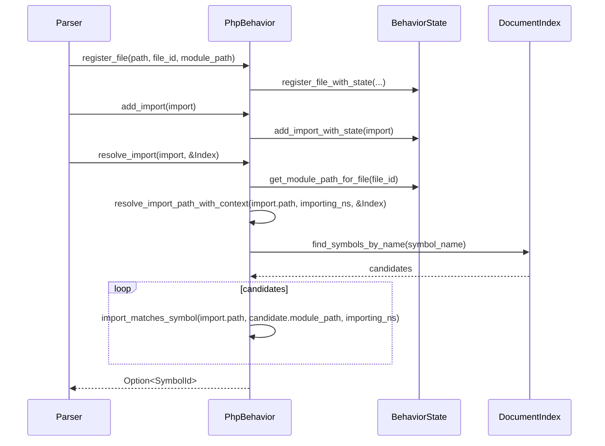

# parsing/php/behavior.rs Review

## TL;DR

- 目的: PHP向けの言語動作を抽象インターフェース（LanguageBehavior/StatefulBehavior）に従って実装し、モジュールパス生成・可視性判定・import解決・状態管理を提供する。
- 主要公開API: Struct **PhpBehavior**（pub）、コンストラクタ **new()**（pub）。その他はトレイト実装経由で外部から利用される（直接pubではない）。
- コアロジック: **module_path_from_file**（PSR-4風のパス→名前空間変換）、**parse_visibility**（修飾子→可視性）、**import_matches_symbol**（PHP固有の相対/絶対名前空間解決）、**resolve_import_path_with_context**（DocumentIndexを用いたシンボル解決）、**is_symbol_visible_from_file**（簡略化された可視性モデル）。
- 重大リスク: Windowsパス区切り非対応の可能性（文字列ベース処理）、protected/privateの可視性の過度な単純化、エイリアス・グループuseの未対応、状態（BehaviorState）の並行アクセス安全性はこのチャンクからは不明。
- パフォーマンス: 名前ベースの候補検索→モジュールパス照合の2段階でO(k)（候補数）だが、DocumentIndexのインデックス効率次第。import比較は軽量。
- テスト: 基本機能は網羅（可視性、モジュールパス、言語分離）だが、相対インポート、エイリアス、Windowsパス、特殊拡張子・グループuse等の追加ケースが必要。

## Overview & Purpose

このファイルは、PHP専用の言語挙動クラス **PhpBehavior** を定義し、既存のパーサーフレームワークのトレイト **LanguageBehavior** および **StatefulBehavior** を実装しています。主な目的は以下です。

- PHPの名前空間区切り（"\"）やPSR-4に近いパス→名前空間の変換ルールに従って、ファイルからモジュールパスを導出する。
- PHPの可視性修飾子（public/protected/private）を解析して内部の Visibility 列挙型へ変換する。
- import（useステートメント）解決のためのパス比較・文脈付き解決を提供する。
- パーサ状態（BehaviorState）を用いたファイル登録・インポート追跡を行い、ドキュメントインデックス（DocumentIndex）を用いてシンボル解決を実施する。

この実装は、PHP言語固有の差異（namespace区切り、traitsの存在、関数の位置付け等）に合わせてフレームワークの共通抽象に適合させる役割を持ちます。

## Structure & Key Components

| 種別 | 名前 | 公開範囲 | 責務 | 複雑度 |
|------|------|----------|------|--------|
| Struct | PhpBehavior | pub | PHP言語動作の実装本体。Language、BehaviorStateを保持。 | Low |
| Impl | Default for PhpBehavior | - | new()の委譲。デフォルト生成。 | Low |
| Impl | StatefulBehavior for PhpBehavior | - | 振る舞い状態（BehaviorState）の参照を提供。インポート登録/取得の委譲（with_stateメソッド経由）。 | Low |
| Impl | LanguageBehavior for PhpBehavior | - | コンテキスト作成、継承解決器作成、モジュールパス生成/解析、可視性解析、import解決、可視性判定等のコアロジック。 | Med |
| Module | tests (cfg(test)) | - | 単体テスト：可視性、機能サポート、区切り、モジュールパス、ノード種別検証。 | Low |

### Dependencies & Interactions

- 内部依存
  - BehaviorState: 状態管理（ファイル登録、インポート追跡、モジュールパス取得）。メソッド呼び出しは `register_file_with_state`、`add_import_with_state`、`get_imports_from_state`、`get_module_path`（行番号: 不明）。
  - LanguageBehavior/StatefulBehavior: トレイト契約に従う。
- 外部依存（表）

  | 依存 | 用途 | 備考 |
  |------|------|------|
  | tree_sitter::Language | 言語ハンドル保持 | `tree_sitter_php::LANGUAGE_PHP` を `.into()` で Language へ |
  | tree_sitter_php | PHPのTS言語定義 | `LANGUAGE_PHP` |
  | crate::parsing::php::PhpResolutionContext | 解決コンテキスト生成 | create_resolution_context |
  | crate::parsing::php::PhpInheritanceResolver | 継承関係解決器 | create_inheritance_resolver |
  | crate::storage::DocumentIndex | シンボルインデックス検索 | resolve_import_path_with_context |
  | crate::{FileId, SymbolId, Visibility} | 各種型 | IDと可視性列挙 |
  | std::path::{Path, PathBuf} | パス操作 | module_path_from_file 等 |

- 被依存推定
  - パーサ/インデクサ基盤が `LanguageBehavior` を通じてこの実装を使用。
  - import解析器、シンボル解決器、コードナビゲーション（Go to definition）、コードインテリジェンス（補完）機能が間接的に依存。
  - ドキュメント登録（ファイル→モジュール）機構が `register_file` を呼び出す。

## API Surface (Public/Exported) and Data Contracts

| API名 | シグネチャ | 目的 | Time | Space |
|-------|-----------|------|------|-------|
| PhpBehavior::new | `pub fn new() -> Self` | PHP動作のインスタンス生成 | O(1) | O(1) |
| Default::default | `fn default() -> Self` | new()の委譲 | O(1) | O(1) |
| create_resolution_context | `fn create_resolution_context(&self, file_id: FileId) -> Box<dyn ResolutionScope>` | 解決スコープ作成 | O(1) | O(1) |
| create_inheritance_resolver | `fn create_inheritance_resolver(&self) -> Box<dyn InheritanceResolver>` | 継承解決器作成 | O(1) | O(1) |
| format_module_path | `fn format_module_path(&self, base_path: &str, _symbol_name: &str) -> String` | PHPのモジュールパス整形（シンボル名無視） | O(n) | O(n) |
| parse_visibility | `fn parse_visibility(&self, signature: &str) -> Visibility` | シグネチャから可視性抽出 | O(n) | O(1) |
| module_separator | `fn module_separator(&self) -> &'static str` | 名前空間区切り返却 | O(1) | O(1) |
| supports_traits | `fn supports_traits(&self) -> bool` | 言語特性（trait）サポート判定 | O(1) | O(1) |
| supports_inherent_methods | `fn supports_inherent_methods(&self) -> bool` | 固有メソッド（inherent）サポート判定 | O(1) | O(1) |
| get_language | `fn get_language(&self) -> Language` | Tree-sitter言語ハンドル取得 | O(1) | O(1) |
| module_path_from_file | `fn module_path_from_file(&self, file_path: &Path, project_root: &Path) -> Option<String>` | ファイルパス→名前空間パス生成 | O(n) | O(n) |
| register_file | `fn register_file(&self, path: PathBuf, file_id: FileId, module_path: String)` | 状態へファイル登録 | O(1) | O(1) |
| add_import | `fn add_import(&self, import: crate::parsing::Import)` | 状態へインポート登録 | O(1) | O(1) |
| get_imports_for_file | `fn get_imports_for_file(&self, file_id: FileId) -> Vec<crate::parsing::Import>` | ファイル単位のインポート列挙 | O(m) | O(m) |
| get_module_path_for_file | `fn get_module_path_for_file(&self, file_id: FileId) -> Option<String>` | 状態からモジュールパス取得 | O(1) | O(1) |
| import_matches_symbol | `fn import_matches_symbol(&self, import_path: &str, symbol_module_path: &str, importing_module: Option<&str>) -> bool` | PHP固有ルールでインポートがシンボルに一致するか | O(1) | O(1) |
| resolve_import_path_with_context | `fn resolve_import_path_with_context(&self, import_path: &str, importing_module: Option<&str>, document_index: &DocumentIndex) -> Option<SymbolId>` | 文脈付きでインポートパスをシンボルIDへ解決 | O(k) | O(1) |
| resolve_import | `fn resolve_import(&self, import: &crate::parsing::Import, document_index: &DocumentIndex) -> Option<SymbolId>` | 1インポートの解決（文脈取得込み） | O(k) | O(1) |
| is_symbol_visible_from_file | `fn is_symbol_visible_from_file(&self, symbol: &crate::Symbol, from_file: FileId) -> bool` | 可視性モデルに基づく参照可能性判定 | O(1) | O(1) |

以下、主要APIの詳細。

### PhpBehavior::new

1. 目的と責務
   - **PhpBehavior**の初期化。PHP用のtree-sitter言語ハンドル設定、状態初期化。

2. アルゴリズム
   - `tree_sitter_php::LANGUAGE_PHP.into()` を `Language` に変換。
   - `BehaviorState::new()` で状態生成。

3. 引数

| 名前 | 型 | 説明 |
|------|----|------|
| なし | - | なし |

4. 戻り値

| 型 | 説明 |
|----|------|
| Self | 初期化済みPhpBehavior |

5. 使用例
```rust
let behavior = PhpBehavior::new();
```

6. エッジケース
- なし（定数初期化のみ）

### parse_visibility

1. 目的と責務
   - PHP関数/メソッド宣言文字列から可視性（Visibility）を決定。

2. アルゴリズム（containsベース）
   - "private " を含めば Private
   - "protected " を含めば Module（内部表現でprotectedをModuleにマップ）
   - "public " を含めば Public
   - それ以外は **Public**（PHPのデフォルト）

3. 引数

| 名前 | 型 | 説明 |
|------|----|------|
| signature | &str | 宣言シグネチャ文字列 |

4. 戻り値

| 型 | 説明 |
|----|------|
| Visibility | 可視性 |

5. 使用例
```rust
assert_eq!(behavior.parse_visibility("protected function baz()"), Visibility::Module);
```

6. エッジケース
- "publications"のような部分一致は避けられる（末尾スペース含む判定）。
- 大文字小文字差異は非対応（"Public"などは検出できない）。
- 複合修飾子（"private static" 等）はOK（"private "が見つかるため）。
- コメント内のキーワード含有で誤検出の可能性（signature処理の責務次第）。行番号: 不明

引用（短い関数全体）:
```rust
fn parse_visibility(&self, signature: &str) -> Visibility {
    if signature.contains("private ") {
        Visibility::Private
    } else if signature.contains("protected ") {
        Visibility::Module
    } else if signature.contains("public ") {
        Visibility::Public
    } else {
        Visibility::Public
    }
}
```

### module_path_from_file

1. 目的と責務
   - プロジェクトルートからの相対パスをPHPの**完全修飾**名前空間（先頭に"\"）へ変換。

2. アルゴリズム（PSR-4風）
   - `strip_prefix(project_root)` で相対化。
   - 文字列へ変換し、"src/","app/","lib/","classes/" の先頭ディレクトリを除去。
   - 拡張子 ".class.php"、".php"、".inc" を除去。
   - "index"、"config"、"."で始まるファイルは非対象（None）。
   - '/' を "\" へ置換し、先頭に "\" を付与。

3. 引数

| 名前 | 型 | 説明 |
|------|----|------|
| file_path | &Path | 対象ファイルの絶対/相対パス |
| project_root | &Path | プロジェクトルート |

4. 戻り値

| 型 | 説明 |
|----|------|
| Option<String> | 変換された名前空間（Noneは特殊ファイル等） |

5. 使用例
```rust
let ns = behavior.module_path_from_file(Path::new("/project/src/App/Controllers/UserController.php"), Path::new("/project"));
assert_eq!(ns, Some("\\App\\Controllers\\UserController".to_string()));
```

6. エッジケース
- Windowsパス区切り（'\'）は非対応の可能性。文字列処理が'/'前提。バグ候補。行番号: 不明
- ルート直下の "index.php","config.php" はNone。
- 非ASCIIパス（to_str()がNone）でNone。
- 先頭ディレクトリのバリエーションは固定（PSR-4の多様なマッピングには対応外）。

引用（主要部分抜粋）:
```rust
fn module_path_from_file(&self, file_path: &Path, project_root: &Path) -> Option<String> {
    let relative_path = file_path.strip_prefix(project_root).ok()?;
    let path_str = relative_path.to_str()?;

    let path_without_src = path_str
        .strip_prefix("src/")
        .or_else(|| path_str.strip_prefix("app/"))
        .or_else(|| path_str.strip_prefix("lib/"))
        .or_else(|| path_str.strip_prefix("classes/"))
        .unwrap_or(path_str);

    let path_without_ext = path_without_src
        .strip_suffix(".class.php")
        .or_else(|| path_without_src.strip_suffix(".php"))
        .or_else(|| path_without_src.strip_suffix(".inc"))
        .unwrap_or(path_without_src);

    if path_without_ext == "index"
        || path_without_ext == "config"
        || path_without_ext.starts_with(".")
    {
        return None;
    }

    let namespace_path = path_without_ext.replace('/', "\\");
    if namespace_path.is_empty() {
        None
    } else {
        Some(format!("\\{namespace_path}"))
    }
}
```

### import_matches_symbol

1. 目的と責務
   - importパス（useステートメント）とシンボルの**モジュールパス**が一致するかをPHPルールで判定。相対/絶対、同名異モジュール等を考慮。

2. アルゴリズム
   - 完全一致を最初にチェック（高速化）。
   - 先頭の'\'除去して正規化、一致チェック。
   - importing_module（現在のモジュール）あり、かつ importが相対（先頭に'\'なし）の場合:
     - importに'\'がある: 兄弟名前空間候補（親を置換）→子候補（現在のNS配下）を試す。
     - importに'\'がない: 同一名前空間内のみ名前一致を許容。

3. 引数

| 名前 | 型 | 説明 |
|------|----|------|
| import_path | &str | use文のパス（例: "App\\Services\\AuthService" あるいは相対） |
| symbol_module_path | &str | シンボルの完全修飾モジュールパス |
| importing_module | Option<&str> | 呼び出し元モジュール（現在の名前空間） |

4. 戻り値

| 型 | 説明 |
|----|------|
| bool | 一致すればtrue |

5. 使用例
```rust
let ok = behavior.import_matches_symbol("Services\\AuthService", "\\App\\Services\\AuthService", Some("\\App\\Controllers"));
assert!(ok); // 兄弟名前空間解決
```

6. エッジケース
- 先頭'\'の有無を両対応（正規化）。
- 相対単一名は同一NS内のみ一致。
- エイリアス（use Foo as Bar）はここでは未対応（add_import側の表現次第）。行番号: 不明

引用（主要部分抜粋）:
```rust
fn import_matches_symbol(&self, import_path: &str, symbol_module_path: &str, importing_module: Option<&str>) -> bool {
    if import_path == symbol_module_path { return true; }
    let import_normalized = import_path.trim_start_matches('\\');
    let symbol_normalized = symbol_module_path.trim_start_matches('\\');
    if import_normalized == symbol_normalized { return true; }

    if let Some(importing_ns) = importing_module {
        let importing_normalized = importing_ns.trim_start_matches('\\');
        if !import_path.starts_with('\\') {
            if import_path.contains('\\') {
                if let Some(parent_ns) = importing_normalized.rsplit_once('\\') {
                    let candidate = format!("{}\\{}", parent_ns.0, import_normalized);
                    if candidate == symbol_normalized { return true; }
                }
                let candidate = format!("{importing_normalized}\\{import_normalized}");
                if candidate == symbol_normalized { return true; }
            } else {
                if let Some((symbol_ns, symbol_name)) = symbol_normalized.rsplit_once('\\') {
                    if symbol_ns == importing_normalized && symbol_name == import_normalized {
                        return true;
                    }
                }
            }
        }
    }
    false
}
```

Mermaid（分岐図）
```mermaid
flowchart TD
    A[Start: import_matches_symbol] --> B{import_path == symbol_module_path?}
    B -- Yes --> Z[return true]
    B -- No --> C{trim leading '\' and compare equal?}
    C -- Yes --> Z
    C -- No --> D{importing_module provided?}
    D -- No --> Y[return false]
    D -- Yes --> E{import_path starts with '\' ?}
    E -- Yes --> Y
    E -- No --> F{import_path contains '\' ?}
    F -- Yes --> G[Try sibling NS: parent(importing) + import]
    G --> H{candidate == symbol?}
    H -- Yes --> Z
    H -- No --> I[Try child NS: importing + import]
    I --> J{candidate == symbol?}
    J -- Yes --> Z
    J -- No --> Y
    F -- No --> K[Split symbol to (ns, name)]
    K --> L{ns == importing && name == import?}
    L -- Yes --> Z
    L -- No --> Y
```
上記の図は `import_matches_symbol` 関数（行番号: 不明）の主要分岐を示す。

### resolve_import_path_with_context

1. 目的と責務
   - importパスを `DocumentIndex` を用いて **SymbolId** に解決。文脈（importing_module）を考慮。

2. アルゴリズム
   - モジュール区切り（"\"）で分割し、末尾セグメント（シンボル名）を抽出。
   - インデックスで同名シンボル候補を取得。
   - 各候補について `import_matches_symbol` でモジュールパス一致判定し、最初に一致したIDを返す。

3. 引数

| 名前 | 型 | 説明 |
|------|----|------|
| import_path | &str | インポートパス |
| importing_module | Option<&str> | 文脈モジュール |
| document_index | &DocumentIndex | 検索用インデックス |

4. 戻り値

| 型 | 説明 |
|----|------|
| Option<SymbolId> | 解決されたシンボルID |

5. 使用例
```rust
let sid = behavior.resolve_import_path_with_context("App\\Models\\User", Some("\\App\\Controllers"), &document_index);
```

6. エッジケース
- 先頭'\'ありの場合、splitの先頭が空セグメントになるが、末尾セグメント取得で問題なし。
- 同名シンボルが複数ある場合、最初に一致した候補のみ返す（決定性はDocumentIndexの順序依存）。行番号: 不明
- エイリアスは未対応の可能性（Import構造の持つpath次第）。行番号: 不明

引用（短い関数全体）:
```rust
fn resolve_import_path_with_context(
    &self,
    import_path: &str,
    importing_module: Option<&str>,
    document_index: &DocumentIndex,
) -> Option<SymbolId> {
    let separator = self.module_separator();
    let segments: Vec<&str> = import_path.split(separator).collect();
    if segments.is_empty() { return None; }
    let symbol_name = segments.last()?;
    let candidates = document_index.find_symbols_by_name(symbol_name, None).ok()?;
    for candidate in &candidates {
        if let Some(module_path) = &candidate.module_path {
            if self.import_matches_symbol(import_path, module_path.as_ref(), importing_module) {
                return Some(candidate.id);
            }
        }
    }
    None
}
```

### resolve_import

1. 目的と責務
   - `Import`の解決。ファイルIDからモジュールパス文脈を取得して `resolve_import_path_with_context` へ委譲。

2. アルゴリズム
   - `get_module_path_for_file(import.file_id)` を取得。
   - 文脈付きで解決。

3. 引数/戻り値
- 引数: `&crate::parsing::Import`, `&DocumentIndex`
- 戻り値: `Option<SymbolId>`

4. 使用例
```rust
if let Some(sym_id) = behavior.resolve_import(&import, &document_index) {
    // resolved
}
```

5. エッジケース
- 文脈なし（モジュールパス未登録）でも解決可（正規化一致など）。行番号: 不明

### is_symbol_visible_from_file

1. 目的と責務
   - シンボルの可視性をファイル境界で判定。

2. アルゴリズム
   - 同一ファイルなら常にtrue。
   - それ以外は **Public** のみ可視。

3. 引数/戻り値
- 引数: `&crate::Symbol`, `FileId`
- 戻り値: `bool`

4. 使用例
```rust
let visible = behavior.is_symbol_visible_from_file(symbol, current_file_id);
```

5. エッジケース
- PHPのprotected/privateは本来クラス階層に依存するが、ここではファイル越しは不可視に簡略化。設計方針の制約。行番号: 不明

### register_file / add_import / get_imports_for_file / get_module_path_for_file

- 目的
  - 状態管理（BehaviorState）を用いてファイル登録、インポート登録、インポート取得、モジュールパス取得を行う。

- 注意
  - メソッド本体は `*_with_state` や `state.get_module_path` に委譲。`BehaviorState`の内部実装/同期安全性はこのチャンクには現れない。

```rust
fn register_file(&self, path: PathBuf, file_id: FileId, module_path: String) {
    self.register_file_with_state(path, file_id, module_path);
}
fn add_import(&self, import: crate::parsing::Import) {
    self.add_import_with_state(import);
}
fn get_imports_for_file(&self, file_id: FileId) -> Vec<crate::parsing::Import> {
    self.get_imports_from_state(file_id)
}
fn get_module_path_for_file(&self, file_id: FileId) -> Option<String> {
    self.state.get_module_path(file_id)
}
```

## Walkthrough & Data Flow

- データフロー（インポート解決）:
  1. ファイル解析時に **register_file** で `file_id` と `module_path` を状態へ登録。
  2. 解析された `use` ステートメントを **add_import** で状態へ登録。
  3. シンボル解決フェーズで、各 **Import** に対し **resolve_import** を呼び出す。
  4. **resolve_import** は **get_module_path_for_file** で文脈（呼び出し元モジュール）を取得。
  5. **resolve_import_path_with_context** が `DocumentIndex` から同名シンボル候補を検索。
  6. 各候補に対し **import_matches_symbol** を適用してモジュールパス一致を判定。最初に一致した候補の **SymbolId** を返却。

Mermaid（インポート解決の流れ）

上記の図は `resolve_import` および `resolve_import_path_with_context`（行番号: 不明）の主要フローを示す。

## Complexity & Performance

- parse_visibility
  - 時間: O(n)（signature長）
  - 空間: O(1)
- module_path_from_file
  - 時間: O(n)（パス長、前後のstrip/replace）
  - 空間: O(n)（新規文字列）
- import_matches_symbol
  - 時間: O(1)（文字列長に比例するが、定数回の操作）
  - 空間: O(1)
- resolve_import_path_with_context
  - 時間: O(k + n)（k=候補数、n=比較文字列長の合計）。`DocumentIndex::find_symbols_by_name` のコストはインデックス設計に依存。
  - 空間: O(1)
- 予想ボトルネック
  - 同名シンボルが多い場合（例: "User"など）、候補走査が増える。
  - `DocumentIndex` の検索が線形に近い場合はスケールでボトルネック。
- スケール限界
  - 非曖昧性のための追加手がかり（import文の別名、グループuse、関数/定数インポート種別）が未活用だと大量候補の中からの最初一致探索に時間を要する。

- 実運用負荷要因
  - I/Oはなし、純粋な文字列処理とインデックス検索のみ。
  - ネットワーク/DBは関与しない。

## Edge Cases, Bugs, and Security

セキュリティチェックリスト評価:
- メモリ安全性: unsafe未使用。Rustの所有権/借用に従うため、Buffer overflow/Use-after-freeは低リスク。
- インジェクション: 外部コマンド/SQLは未使用。パス/文字列のみ。
- 認証・認可: 機能外（このチャンクには現れない）。
- 秘密情報: ハードコード秘密なし。ログ出力なし。
- 並行性: BehaviorStateの内部同期性は不明。&selfでの状態更新は内部可変性前提の可能性（Mutex/RwLock等）。詳細不明。

エッジケース一覧（抜粋）

| エッジケース | 入力例 | 期待動作 | 実装 | 状態 |
|-------------|--------|----------|------|------|
| Windowsパス区切り | "src\App\Models\User.php" | 正しく"\\App\\Models\\User"へ | module_path_from_file | Bugの可能性（'/'前提） |
| 先頭'\'付きimport | "\\App\\Models\\User" | 正規化して一致判定OK | import_matches_symbol | OK |
| 相対単一名import | "User" + importing="\\App\\Models" | 同NS内だけ一致 | import_matches_symbol | OK |
| 兄弟NS相対import | "Services\\AuthService" + importing="\\App\\Controllers" | "App\\Services\\AuthService"と一致 | import_matches_symbol | OK |
| グループuse | "App\\{Model, Controller}" | 個々の展開が必要 | resolve_import/add_import | 未対応（不明） |
| エイリアスuse | "use App\\Models\\User as UserModel" | alias名で解決 | resolve_import/import_matches_symbol | 未対応（不明） |
| 関数/const use | "use function array_map" | 種別区別と解決 | resolve_import | 不明 |
| 非ASCIIパス | パスに日本語 | to_str()がNoneならNone | module_path_from_file | OK（None） |
| protectedの可視性 | 他ファイルからprotected参照 | クラス階層により可視 | is_symbol_visible_from_file | 仕様上不可（簡略化） |
| コメント内キーワード | "/* private */ function f()" | 修飾子誤検出回避 | parse_visibility | 不明（入力前処理次第） |

Rust特有の観点
- 所有権
  - `get_language` が `self.language.clone()` を返す（所有権の移動/借用の明示不要）。Cloneが軽量かは外部型依存。
- 借用/ライフタイム
  - すべて`&self`で不変参照。内部状態更新は `StatefulBehavior` のヘルパーに委譲。
  - 明示的ライフタイムパラメータは不要。
- unsafe境界
  - unsafe未使用。
- 並行性/非同期
  - `BehaviorState`が内部でMutex/RwLock等を使う可能性。`Send/Sync`の保証はこのチャンクには現れない。
  - awaitやキャンセルの概念なし。
- エラー設計
  - `Option`を多用（未解決/非該当）。
  - `Result` → `ok()?` で失敗時Noneへ。unwrap/expectは不使用（panicなし）。
  - エラー型の変換（From/Into）はこのチャンクには現れない。

## Design & Architecture Suggestions

- パス処理の堅牢化
  - 文字列ベースの `'/'` 前提をやめ、`Path`/`PathBuf` の `components()` でOS非依存に。PSR-4のルートディレクトリ除去は `strip_prefix` を `Path` で実施。
  - 拡張子判定は `file_stem()` と `extension()` を用いる。
- importの拡張
  - **エイリアス**（as）サポート：`Import`構造体にalias名を持つなら、`import_matches_symbol`でalias→実パスを考慮。
  - **グループuse**対応：`add_import` 時に展開して複数のImportとして登録。
  - **function/const use**の区別：`DocumentIndex::find_symbols_by_name` に種別フィルタ（関数/定数/クラス）を渡す。
- 可視性モデルの改善
  - protected/privateのクラス階層判定を `InheritanceResolver` と連携して考慮（同一クラス/サブクラス間の可視性）。
- 決定性の向上
  - 複数候補の解決順の安定化（モジュールパス長、近さ、優先度ルール）を導入。
- 言語設定の取得
  - `get_language` は `Clone`で返すが、頻繁利用なら `&Language` を返すAPIも検討。

## Testing Strategy (Unit/Integration) with Examples

- 追加ユニットテスト
  - Windowsパス対応（現状バグ想定）
```rust
#[test]
fn test_module_path_from_file_windows() {
    let behavior = PhpBehavior::new();
    let root = Path::new("C:\\project");
    // 注意: 現実のPath生成はOS依存。ここでは概念的に示す。
    let class_path = Path::new("C:\\project\\src\\App\\Models\\User.php");
    // 期待: Some("\\App\\Models\\User")
    // 現実: 文字列前提のstrip_prefix/replaceでは失敗する可能性
    let ns = behavior.module_path_from_file(class_path, root);
    // 将来的にはassert_eq!(ns, Some("\\App\\Models\\User".to_string()));
}
```
  - エイリアスuse
```rust
#[test]
fn test_import_alias_resolution() {
    let behavior = PhpBehavior::new();
    // Import構造体が alias を保持している場合の解決を追加実装後にテスト
    // 例: use App\\Models\\User as UserModel;
    // resolve_import("UserModel") が "\\App\\Models\\User" へ一致すること
}
```
  - 相対import（兄弟/子）判定
```rust
#[test]
fn test_relative_import_sibling_and_child() {
    let behavior = PhpBehavior::new();
    let importing = Some("\\App\\Controllers");
    assert!(behavior.import_matches_symbol("Services\\AuthService", "\\App\\Services\\AuthService", importing));
    assert!(behavior.import_matches_symbol("Http\\Middleware\\Auth", "\\App\\Controllers\\Http\\Middleware\\Auth", importing));
}
```
  - グループuseの展開
```rust
#[test]
fn test_group_use_expansion() {
    // add_import側の展開ロジック追加後に、
    // "use App\\{Model,Controller};" が2つのImportとして登録されることを検証
}
```
  - protected/privateの可視性（仕様確認）
```rust
#[test]
fn test_visibility_across_files() {
    let behavior = PhpBehavior::new();
    // 別ファイルのprotected/privateは不可視であることを確認（現仕様）
}
```

- 統合テスト
  - `DocumentIndex` を用いて複数ファイル・複数シンボルを登録し、`resolve_import` の結果が期待する SymbolId と一致するか。
  - 競合する同名シンボル（異なるNS）ケースで、相対importが意図した候補を選択するか。

## Refactoring Plan & Best Practices

- Path処理のリファクタリング
  - `module_path_from_file` を `Path`中心の実装へ変更。ディレクトリ除去は `relative.components()` を走査し、先頭に該当するディレクトリをスキップする形で実装。
  - 拡張子処理は `extension()` で厳密化し、`.class.php`の扱いは `file_name()` ベースで行う。
- import解決ルールの整理
  - `import_matches_symbol` を小関数へ分割（絶対一致、相対一致（兄弟/子）、単一名一致の3関数）し、テスト容易性を向上。
- 設計上の明確化
  - Visibility::Module を PHP protected にマップしている旨をドキュメント化。
- エラー扱い
  - `resolve_import_path_with_context` の曖昧解決時に診断用メトリクスやログを追加（後述のObservability）。

## Observability (Logging, Metrics, Tracing)

- 現状: ログ・メトリクス・トレースなし。
- 提案:
  - ログ: import解決失敗時に `debug` ログ（import_path, importing_module, 候補数）。
  - メトリクス: 
    - `php_import_resolve_attempts_total`、`php_import_resolve_failures_total`。
    - `php_import_candidates_count_histogram`。
  - トレース: import解決処理をspanで囲み、候補評価をイベントとして記録。
  - サンプリング: 大規模プロジェクトでの高頻度呼び出しに対しサンプル率調整。

## Risks & Unknowns

- BehaviorStateの内部実装/同期安全性: &selfで状態更新が可能ということは内部可変性（Mutex/RwLock/RefCell等）を伴う。**Send/Sync**の安全性はこのチャンクには現れない。
- DocumentIndexの検索特性: `find_symbols_by_name` の戻り順やフィルタリング（種別、可視性）の詳細は不明。曖昧解決の決定性に影響。
- エイリアス/グループuse/関数・定数use: コメントで存在に言及されているが、本実装での取り扱いは不明（このチャンクには現れない）。
- validate_node_kind: テストが呼び出すが、本チャンクでは実装が見えない（他のトレイト既定実装か別ファイル）。挙動詳細は不明。
- Windowsパス対応: 現実的な環境での動作は未検証。文字列ベースの前提で失敗する可能性。