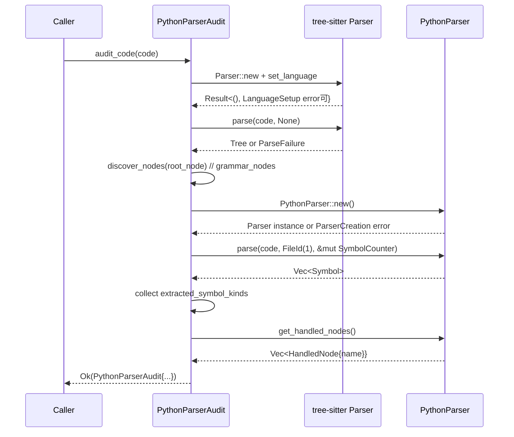

# parsing\python\audit.rs Review

## TL;DR

- 目的: tree-sitterで検出したPython ASTノードと、独自PythonParserが実際に処理したノード・抽出したシンボルを比較し、カバレッジレポートを生成する監査モジュール
- 公開API: PythonParserAudit::audit_file, audit_code, generate_report と公開構造体/エラー型 AuditError・PythonParserAudit（全フィールドpub）
- コアロジック: audit_codeでAST探索（discover_nodes）→独自PythonParserでシンボル抽出→実装済みノード集合と抽出シンボル種集合の生成→generate_reportでギャップの可視化
- 複雑箇所: 再帰的AST探索（discover_nodes）とレポート生成時のステータス判定（grammar_nodes ∋ node_name と implemented_nodes ∋ node_name の二段分岐）
- 重大リスク: SymbolKindの文字列化にDebug表現を使用（format!("{:?}", symbol.kind））しており安定性に懸念、深いASTで再帰スタック枯渇の可能性、固定FileId(1)の利用、未使用インポート(NodeTracker)
- Rust安全性: unsafe不使用、所有権/借用は局所的で安全、同期処理のみでSend/Sync/データ競合問題は発生しない
- スケール: 時間計算量はASTサイズに対してO(N)、メモリはユニークなノード種数に対してO(U)。大規模ファイルでも線形だが再帰により深さ依存のスタック使用

## Overview & Purpose

このモジュールはPythonソースに対し以下を行い、解析カバレッジの可視化を目的とします。

- tree-sitterを用いて、ファイル内で現れるASTノード種（kind）を網羅的に収集
- 独自PythonParserが「実際に処理したノード」と「抽出したシンボル種」を収集
- 両者を比較して、重要なノード種に対する「実装済み」「ギャップ」「未出現」をレポート化

これにより、記号抽出の観点でパーサの未対応箇所を特定し、改善優先順位を提示します。

## Structure & Key Components

| 種別 | 名前 | 公開範囲 | 責務 | 複雑度 |
|------|------|----------|------|--------|
| Enum | AuditError | pub | 監査処理中のエラー表現と伝播 | Low |
| Struct | PythonParserAudit | pub（全フィールドpub） | 収集結果（grammar_nodes/implemented_nodes/extracted_symbol_kinds）を保持 | Med |
| Fn(impl) | PythonParserAudit::audit_file | pub | ファイルから読み込み→audit_codeへ委譲 | Low |
| Fn(impl) | PythonParserAudit::audit_code | pub | AST探索→独自パーサでシンボル抽出→集合化 | Med |
| Fn(impl) | PythonParserAudit::generate_report | pub | 収集データからカバレッジレポート文字列生成 | Med |
| Fn | discover_nodes | private | 再帰でASTを走査しノード種別を登録 | Low |
| Mod | tests | private(cfg) | 単体テスト（簡易ケース） | Low |

### Dependencies & Interactions

- 内部依存（関数/構造体間の呼び出し関係）
  - audit_file → audit_code（委譲）
  - audit_code → discover_nodes（AST走査）
  - audit_code → PythonParser::new / parse / get_handled_nodes（シンボル抽出と動的トラッキング）
  - generate_report → format_utc_timestamp（タイムスタンプ）
- 外部依存（表）
  | 依存名 | 種別 | 用途/備考 |
  |--------|------|-----------|
  | super::PythonParser | crate内部 | 独自Pythonパーサの生成・解析・ノード追跡 |
  | crate::io::format::format_utc_timestamp | crate内部 | レポート生成日時の文字列化 |
  | crate::types::FileId | crate内部 | パーサに渡すファイルID（現状固定値） |
  | crate::types::SymbolCounter | crate内部 | パーサへのシンボル計測器（詳細は不明） |
  | tree_sitter::{Node, Parser} | 外部クレート | AST生成と走査 |
  | tree_sitter_python::LANGUAGE | 外部クレート | Python言語定義 |
  | thiserror::Error | 外部クレート | エラー定義（derive） |
- 被依存推定（このモジュールを使用しうる箇所）
  - CLI/開発ツールの監査コマンド
  - CIの解析カバレッジチェック
  - ドキュメント生成パイプライン
  - 実際の利用箇所はこのチャンクには現れない

## API Surface (Public/Exported) and Data Contracts

| API名 | シグネチャ | 目的 | Time | Space |
|-------|-----------|------|------|-------|
| PythonParserAudit::audit_file | fn audit_file(file_path: &str) -> Result<Self, AuditError> | ファイル読み込みして監査を実行 | O(F + N) | O(U + S) |
| PythonParserAudit::audit_code | fn audit_code(code: &str) -> Result<Self, AuditError> | 文字列ソースで監査を実行 | O(N) | O(U + S) |
| PythonParserAudit::generate_report | fn generate_report(&self) -> String | カバレッジレポートの生成 | O(K + U + I + S) | O(R) |

補足:
- N=ASTノード総数（ファイル内）、U=ユニークノード種数、S=抽出シンボル種数、I=実装済みノード種数、K=キー対象ノード数（本ファイルでは約28）、F=ファイル読み取りコスト、R=生成文字列サイズ

### PythonParserAudit::audit_file

1. 目的と責務
   - 指定パスからPythonコードを読み込み、監査結果（PythonParserAudit）を返す

2. アルゴリズム（ステップ分解）
   - std::fs::read_to_string(file_path)で読み込み
   - 読み込んだ文字列をaudit_codeに委譲
   - エラーはAuditError::FileRead（I/O）またはaudit_codeの戻りに準拠

3. 引数
   | 名前 | 型 | 説明 |
   |------|----|------|
   | file_path | &str | ソースファイルのパス |

4. 戻り値
   | 型 | 説明 |
   |----|------|
   | Result<PythonParserAudit, AuditError> | 成功時監査結果、失敗時エラー |

5. 使用例
   ```rust
   use parsing::python::audit::PythonParserAudit;

   fn run_audit_on_file(path: &str) -> Result<String, Box<dyn std::error::Error>> {
       let audit = PythonParserAudit::audit_file(path)?;
       let report = audit.generate_report();
       Ok(report)
   }
   ```

6. エッジケース
   - ファイル未存在/非UTF-8: FileReadエラー
   - 巨大ファイル: 読み込み/解析時間の増加
   - 読み込み成功だが解析失敗: audit_codeでAuditErrorに変換

### PythonParserAudit::audit_code

1. 目的と責務
   - 渡されたPythonコード文字列を解析し、ASTノード種の検出・独自パーサによる実装ノード集合と抽出シンボル種集合を作成して返す

2. アルゴリズム（ステップ分解）
   - Parser::newでtree-sitterパーサ生成
   - set_language(tree_sitter_python::LANGUAGE)（失敗時AuditError::LanguageSetup）
   - parser.parse(code, None)でAST生成（失敗時AuditError::ParseFailure）
   - discover_nodes(root_node, &mut grammar_nodes)でユニークなノード種を収集
   - PythonParser::new（失敗時AuditError::ParserCreation）
   - file_id=FileId(1)をセット（固定）し、SymbolCounterを初期化
   - python_parser.parse(code, file_id, &mut symbol_counter)でシンボル抽出
   - 抽出シンボルのkindをformat!("{:?}", symbol.kind)で文字列化しHashSetへ
   - python_parser.get_handled_nodes().iter().map(|h| h.name.clone())で実装済みノード集合を生成
   - 上記3集合を持つPythonParserAuditを返す

3. 引数
   | 名前 | 型 | 説明 |
   |------|----|------|
   | code | &str | Pythonソースコード全体 |

4. 戻り値
   | 型 | 説明 |
   |----|------|
   | Result<PythonParserAudit, AuditError> | 収集済みの監査結果か、失敗時エラー |

5. 使用例
   ```rust
   use parsing::python::audit::PythonParserAudit;

   fn audit_snippet() -> Result<(), Box<dyn std::error::Error>> {
       let code = r#"
       class Example:
           def f(self): pass
       "#;
       let audit = PythonParserAudit::audit_code(code)?;
       assert!(audit.grammar_nodes.contains_key("class_definition"));
       println!("{}", audit.generate_report());
       Ok(())
   }
   ```

6. エッジケース
   - 空文字列: 解析成功し得る（ERRORや最低限のルートノードのみ）／ParseFailureの可能性は低い
   - 構文エラーを含むコード: tree-sitterはERRORノードを含むツリーを返すため解析継続
   - 非常に深いAST: discover_nodesの再帰がスタックを圧迫
   - PythonParser側の未対応: symbolsが空、implemented_nodesが空でも正常終了

抜粋（主要部、行番号:不明）
```rust
pub fn audit_code(code: &str) -> Result<Self, AuditError> {
    let mut parser = Parser::new();
    let language = tree_sitter_python::LANGUAGE.into();
    parser
        .set_language(&language)
        .map_err(|e| AuditError::LanguageSetup(e.to_string()))?;

    let tree = parser.parse(code, None).ok_or(AuditError::ParseFailure)?;
    let mut grammar_nodes = HashMap::new();
    discover_nodes(tree.root_node(), &mut grammar_nodes);

    let mut python_parser =
        PythonParser::new().map_err(|e| AuditError::ParserCreation(e.to_string()))?;
    let file_id = FileId(1);
    let mut symbol_counter = crate::types::SymbolCounter::new();
    let symbols = python_parser.parse(code, file_id, &mut symbol_counter);

    let mut extracted_symbol_kinds = HashSet::new();
    for symbol in &symbols {
        extracted_symbol_kinds.insert(format!("{:?}", symbol.kind));
    }

    let implemented_nodes: HashSet<String> = python_parser
        .get_handled_nodes()
        .iter()
        .map(|handled_node| handled_node.name.clone())
        .collect();

    Ok(Self { grammar_nodes, implemented_nodes, extracted_symbol_kinds })
}
```

### PythonParserAudit::generate_report

1. 目的と責務
   - 収集済みデータ（grammar_nodes / implemented_nodes / extracted_symbol_kinds）を基に、定義済みの「キー対象ノード」についてカバレッジテーブルと推奨アクションを含むMarkdownレポートを生成

2. アルゴリズム（ステップ分解）
   - ヘッダと生成時刻を出力
   - Summary: 3つの集合サイズを記載
   - Coverage Table: 各キー対象ノードについて
     - grammar_nodesにあればID表示 + implemented_nodesにあれば「✅ implemented」なければ「⚠️ gap」
     - grammar_nodesに無い場合は「❌ not found」
   - Legend/Recommended Actions: gap/missingに応じた改善提案を追記

3. 引数
   | 名前 | 型 | 説明 |
   |------|----|------|
   | self | &PythonParserAudit | 監査結果 |

4. 戻り値
   | 型 | 説明 |
   |----|------|
   | String | レポートのMarkdown文字列 |

5. 使用例
   ```rust
   let audit = PythonParserAudit::audit_code("def f(): pass").unwrap();
   let report = audit.generate_report();
   println!("{report}");
   ```

6. エッジケース
   - すべて未検出（grammar_nodesが極端に少ない、implemented_nodes空）でもレポートは生成され、推奨アクションが提示される
   - gap/missingいずれも空なら「Excellent coverage!」の文言

抜粋（主要部、行番号:不明）
```rust
// Coverage Tableの判定ロジック（二段分岐）
for node_name in key_nodes {
    let status = if let Some(id) = self.grammar_nodes.get(node_name) {
        if self.implemented_nodes.contains(node_name) {
            format!("{id} | ✅ implemented")
        } else {
            gaps.push(node_name);
            format!("{id} | ⚠️ gap")
        }
    } else {
        missing.push(node_name);
        "- | ❌ not found".to_string()
    };
    report.push_str(&format!("| {node_name} | {status} |\n"));
}
```

### Data Contracts（構造体フィールド）

- PythonParserAudit
  - grammar_nodes: HashMap<String, u16>
    - キーはNode.kind()の文字列、値はkind_id（u16）
    - ユニーク種のみ（重複は上書き）
  - implemented_nodes: HashSet<String>
    - 独自パーサが動的追跡したノード名（handled_node.nameの集合）
  - extracted_symbol_kinds: HashSet<String>
    - 抽出シンボル種別の文字列（Debug表現由来）

- AuditError
  - FileRead(std::io::Error) [From変換あり]
  - LanguageSetup(String)
  - ParseFailure
  - ParserCreation(String)

## Walkthrough & Data Flow

1. 入力（file_path もしくは code文字列）
2. tree-sitterでAST生成（Python言語を設定）
3. discover_nodesでASTを再帰走査し、出現したノード種をgrammar_nodesに登録
4. 独自PythonParserを生成→parseを実行
5. シンボル一覧からkindを文字列化してextracted_symbol_kindsへ
6. python_parser.get_handled_nodes()からname集合をimplemented_nodesに格納
7. generate_reportでキー対象ノードに対するステータス（implemented/gap/not found）を表形式で出力

Mermaid（アクターが3以上のため使用）。上記の図はaudit_code関数の主要フロー（行番号:不明）を示す。


補足コード（再帰走査、行番号:不明）
```rust
fn discover_nodes(node: Node, registry: &mut HashMap<String, u16>) {
    registry.insert(node.kind().to_string(), node.kind_id());

    let mut cursor = node.walk();
    for child in node.children(&mut cursor) {
        discover_nodes(child, registry);
    }
}
```

## Complexity & Performance

- audit_file
  - 時間: O(F + N)（F=読み込み、N=AST構築+走査）
  - 空間: O(U + S)（ユニークノード種と抽出シンボル種の集合）
- audit_code
  - 時間: O(N)（AST走査 + 独自パーサ解析が概ね線形）
  - 空間: O(U + S + I)（3集合）
- generate_report
  - 時間: O(K + U + I + S)（Kはキー対象ノード数）
  - 空間: O(R)（文字列バッファ）

ボトルネックとスケール限界:
- ASTの深さが異常に深い場合、discover_nodesの再帰がスタックに依存し、理論上スタックオーバーフローの可能性
- tree-sitterの解析コストは入力サイズに線形だが、巨大ファイルではメモリとCPUの使用量が増加
- レポート生成は軽量（Kは固定小）でI/Oを伴わない

実運用負荷要因:
- I/O: audit_fileの読み込みのみ
- CPU: tree-sitter解析 + 再帰走査 + 独自パーサ解析
- ネットワーク/DB: 該当なし

## Edge Cases, Bugs, and Security

| エッジケース | 入力例 | 期待動作 | 実装 | 状態 |
|-------------|--------|----------|------|------|
| 空文字列 | "" | 最小ツリーまたはParseFailure、エラー適切伝播 | parser.parseの結果で判断 | OK（最小ツリー想定） |
| 非UTF-8/存在しないファイル | 不正パス | FileReadエラー | read_to_string→? | OK |
| 構文エラー含むコード | "def : ..." | ツリー生成は続行、ERRORノード含む | discover_nodesはERRORも登録 | OK |
| 非常に深いAST | ネスト過多 | 再帰でスタック枯渇の可能性 | 再帰実装 | 潜在問題 |
| SymbolKindの表現の安定性 | バージョン差 | 種別文字列が変動 | Debug表現使用 | 改善余地 |
| 固定FileId使用 | FileId(1) | 複数ファイル監査時に識別不整合の可能性 | 固定値 | 注意 |
| 未使用インポート | use crate::parsing::NodeTracker | コンパイル警告 | 未使用 | 要修正 |

セキュリティチェックリスト:
- メモリ安全性
  - Buffer overflow / Use-after-free: Rust安全なAPI使用、unsafe不使用で可能性低
  - Integer overflow: kind_idはu16、tree-sitter側の制約で問題低
- インジェクション（SQL/Command/Path）
  - 該当なし（外部コマンド/DB未使用）。Pathは文字列から読み込みのみ
- 認証・認可
  - 該当なし（ローカル解析）
- 秘密情報
  - ハードコード秘密なし。ログは生成レポートのみで機密流出の懸念低
- 並行性
  - 同期処理のみ。共有可変状態なし。データ競合・デッドロックなし

Rust特有の観点（詳細チェックリスト）:
- 所有権: Node.kind()の&strをto_stringで所有化してHashMap/HashSetに保存（audit_code:行番号不明）。値は関数スコープ内でmoveされ、Selfに格納されるため安全
- 借用: tree_sitterのCursor借用（discover_nodes:行番号不明）は子走査範囲で限定され安全
- ライフタイム: 明示的ライフタイム不要（すべて所有化済み）
- unsafe境界: unsafeブロックなし
- Send/Sync/非同期: 非async、並行なし。パーサインスタンスはスレッド間共有せず安全
- エラー設計: thiserrorでわかりやすいVariant。unwrap使用はtestsのみで妥当。From<std::io::Error>導入済み。外部エラーはto_stringで包んでおり、詳細保持のためにも新規Variant/透過型の検討余地あり

重要な主張の根拠（関数名:行番号）
- Debug表現の使用: audit_codeでformat!("{:?}", symbol.kind)（行番号:不明）
- 再帰走査: discover_nodes（行番号:不明）
- 二段分岐によるステータス判定: generate_reportのCoverage Table生成ループ（行番号:不明）

## Design & Architecture Suggestions

- SymbolKindの表現安定化
  - DebugではなくDisplayを実装（またはto_stringの安定版）し、将来のフォーマット変更に耐性を持たせる
- 再帰走査の非再帰化
  - 深いASTへの耐性を高めるため、Vec<Node>を使った明示的スタックでDFS/BFSに置換
- FileIdの取り扱い
  - audit_codeにOption<FileId>や生成器を受け取る、またはダミー用途を明示するドキュメントを追加
- 未使用インポート削除
  - use crate::parsing::NodeTrackerは削除（コンパイル警告回避）
- データ構造の拡張
  - grammar_nodesをHashMap<String, NodeInfo>（idと出現回数）に拡張し、頻度に基づく優先度評価を可能に
- レポートの拡張性
  - キー対象ノード一覧を外部設定化（YAML/JSONなど）、言語の拡張やバージョン差に柔軟に対応
- エラー透過性
  - PythonParser::new/parseのエラー型をwrapし詳細保持（source保持）する新Variantを追加

## Testing Strategy (Unit/Integration) with Examples

既存テスト:
- test_audit_simple_python（testsモジュール内、行番号:不明）
  - class_definition / function_definition / assignmentの検出
  - ClassとFunction/Methodシンボル抽出を検証

追加で推奨されるテスト:
- 構文エラーを含むコード
  ```rust
  #[test]
  fn test_audit_syntax_error() {
      let code = "def :\n";
      let audit = PythonParserAudit::audit_code(code).unwrap();
      // ERRORノードが含まれることが多い
      assert!(audit.grammar_nodes.contains_key("ERROR"));
      // 抽出シンボルは空でも許容
  }
  ```
- 大規模/深いネストのコード（パフォーマンス/再帰耐性）
  ```rust
  #[test]
  fn test_audit_deep_nesting() {
      // 深いネストを人工的に作成
      let code = (0..10_000).fold(String::from("x=0\n"), |mut s, _| { s.push_str("x=(x)\n"); s });
      let audit = PythonParserAudit::audit_code(&code).unwrap();
      // 実行時間とpanicがないことを検証
      assert!(audit.grammar_nodes.contains_key("assignment"));
  }
  ```
- 監査レポートの妥当性（ステータス判定）
  ```rust
  #[test]
  fn test_generate_report_statuses() {
      let code = "class C:\n    pass\n";
      let audit = PythonParserAudit::audit_code(code).unwrap();
      let report = audit.generate_report();
      assert!(report.contains("Coverage Table"));
      // 少なくとも class_definition の行が出力される
      assert!(report.contains("class_definition"));
  }
  ```
- エラー伝播（言語設定失敗を模擬）
  - このチャンクには現れない（tree_sitter_python::LANGUAGEが常に有効なため）ため、モックが必要で不明

## Refactoring Plan & Best Practices

- 未使用インポート削除: use crate::parsing::NodeTracker → 削除
- 再帰を反復処理へ変更: discover_nodesをstackベースDFS/BFSに変更
- SymbolKind表現の安定化: Display導入または明示的なto_strメソッドを採用
- audit_codeの柔軟性拡張: FileId引数化/生成器導入、SymbolCounter初期化の抽象化
- エラー型拡張: AuditErrorへ外部エラーの透過（source保持）を追加
- レポートの国際化/構成化: キー対象ノードの設定外出し、テンプレート化で保守性改善
- ドキュメント整備: フィールドの意味（IDかカウントか）を明確化し、期待値の安定性と互換性を保証

## Observability (Logging, Metrics, Tracing)

- ロギング
  - 解析開始/終了、tree-sitter言語設定、parse失敗の詳細をtracingで構造化ログ出力
  - シンボル抽出件数と時間をinfoレベルで
- メトリクス
  - grammar_nodes数（U）、implemented_nodes数（I）、extracted_symbol_kinds数（S）
  - 解析時間（パーサ別）、レポート生成時間
- トレーシング
  - audit_code内の主要ステップにspanを設置、失敗時のエラー原因を紐付け
- 注意点
  - ソース本文はログ出力しない（機密保護）
  - FileIdが固定の場合、識別子をログに含めるなら注意喚起

## Risks & Unknowns

- PythonParserの内部仕様（get_handled_nodesの型やnameの意味、parseの抽出ルール）
  - このチャンクには現れないため不明
- SymbolCounterの具体的な動作／意味
  - このチャンクには現れないため不明
- tree-sitter_python::LANGUAGEの互換性（バージョン差分のノード種名）
  - 実環境依存で不明
- 生成レポートの利用フロー（保存先、CIへの連携）
  - このチャンクには現れないため不明