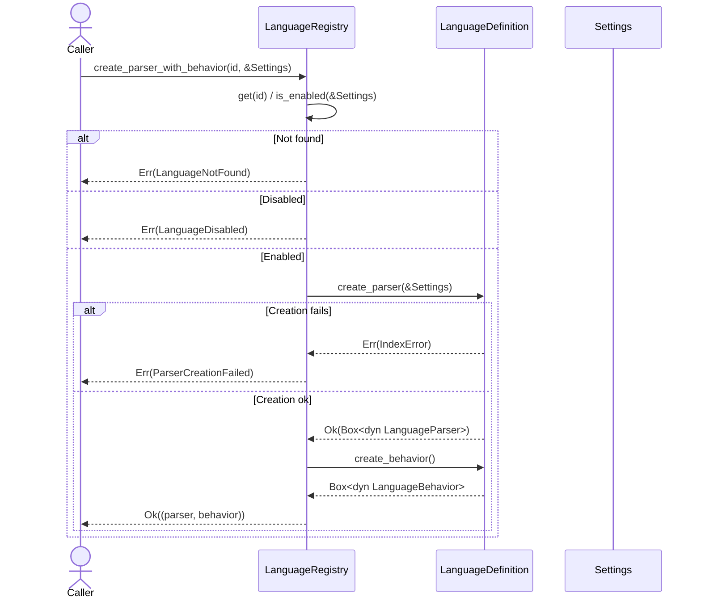

# parsing/registry.rs Review

## TL;DR

- **目的**: 動的な言語検出・管理のためのレジストリ。コンパイル済み（available）と言語設定で有効化（enabled）を分離し、ゼロコスト参照で高速に照会。
- **主要公開API**: LanguageId、LanguageDefinition、LanguageRegistry、RegistryError、get_registry、ParserBehaviorPair。拡張子→言語、ID→定義、パーサ生成の各操作を提供。
- **複雑箇所**: LanguageId の Deserialize で未知の文字列を `'static` 化するための `Box::leak`（永久リーク）。拡張子の衝突（最後に登録した言語が上書き）。
- **並行性**: グローバルレジストリは `LazyLock<Mutex<LanguageRegistry>>` による遅延初期化＋排他。読取主体のため `RwLock` 検討余地あり。再入ロックによるデッドロック懸念は「可能性あり」。
- **重大リスク**: 未知言語を何度もデシリアライズすると漏れ続ける（永続リーク）。拡張子の多重割当を検知しない。`get_by_extension` は有効化状態を無視（呼び出し側でチェック必要）。
- **性能**: 主要ルックアップは O(1)。言語名→ID の探索は O(n)。拡張子→言語も O(1)。大半が読み取りで、ミューテックス競合が潜在的ボトルネック。
- **テスト**: モック言語で登録・イテレーション・グローバル初期化の基本網羅。拡張子衝突と未知言語デシリアライズのリークは未検証。

## Overview & Purpose

このモジュールは、プロジェクトにコンパイル済みの「利用可能（available）」な言語群と、`settings.toml` に基づく「有効化（enabled）」状態を分離し、動的に言語パーサと振る舞い（behavior）を生成・提供します。主な目的は以下です。

- 起動時に全言語を登録し、拡張子マッピングを構築。
- 設定に応じた有効言語の列挙、拡張子からの言語判定。
- 言語IDからパーサ（および振る舞い）の生成と、適切なエラー付与。
- ゼロコスト参照（`&'static str` など）を活用して比較やストレージを効率化。
- 新規言語追加時に中核コードを改変せず拡張可能。

## Structure & Key Components

| 種別 | 名前 | 公開範囲 | 責務 | 複雑度 |
|------|------|----------|------|--------|
| Type Alias | ParserBehaviorPair | pub | パーサとビヘイビアのペア型 | Low |
| Struct | LanguageId | pub | 言語の型安全なID（`&'static str`） | Med |
| Enum | RegistryError | pub | レジストリ操作のエラー種別 | Med |
| Trait | LanguageDefinition | pub | 言語モジュールの定義インターフェース | Med |
| Struct | LanguageRegistry | pub | 言語定義・拡張子マッピング・生成API | Med |
| Static | REGISTRY | private | グローバルレジストリの `LazyLock<Mutex>` | Med |
| Fn | get_registry | pub | グローバルレジストリへのアクセス | Low |
| Fn | initialize_registry | private | 利用可能言語の初期登録 | Low |

### Dependencies & Interactions

- 内部依存
  - LanguageRegistry
    - `definitions: HashMap<LanguageId, Arc<dyn LanguageDefinition>>`
    - `extension_map: HashMap<&'static str, LanguageId>`
    - `register` が `definitions` と `extension_map` を更新
    - `get_by_extension` → `extension_map` → `get` → `definitions`
    - `iter_enabled` → `LanguageDefinition::is_enabled(settings)`
    - `create_parser(_with_behavior)` → `LanguageDefinition::create_parser(settings)` と `create_behavior()`
  - LanguageId
    - `Serialize`/`Deserialize` 実装。未知文字列を `Box::leak` で `'static` 化。

- 外部依存（代表）
  | クレート/モジュール | 用途 |
  |---------------------|------|
  | std::collections::HashMap | 定義・拡張子マップ |
  | std::sync::{Arc, Mutex, LazyLock} | 共有参照・グローバルレジストリの同期 |
  | serde::{Serialize, Serializer, Deserialize, Deserializer} | 言語IDのシリアライズ/デシリアライズ |
  | thiserror::Error | エラー型の定義 |
  | crate::{Settings, IndexResult} | 設定アクセス・エラーラップ |
  | super::{LanguageParser, LanguageBehavior} | パーサ・ビヘイビアの生成 |

- 被依存推定
  - 上位の解析オーケストレーション層が、拡張子から言語→パーサ生成に利用。
  - CLI（例: “codanna list-languages”）が `iter_all()` で列挙。
  - 設定反映機能が `is_enabled()` と `iter_enabled()` を利用。
  - 言語モジュールが `initialize_registry` 内の `register` 呼び出しで自身を登録。

## API Surface (Public/Exported) and Data Contracts

| API名 | シグネチャ | 目的 | Time | Space |
|-------|-----------|------|------|-------|
| ParserBehaviorPair | type ParserBehaviorPair = (Box<dyn LanguageParser>, Box<dyn LanguageBehavior>) | パーサとビヘイビアをまとめて扱う | O(1) | O(1) |
| LanguageId::new | pub const fn new(id: &'static str) -> Self | 静的文字列からID生成 | O(1) | O(1) |
| LanguageId::as_str | pub fn as_str(&self) -> &'static str | 内部文字列の取得 | O(1) | O(1) |
| LanguageId Display/Serialize/Deserialize | impl Display/Serialize/Deserialize | IDの表示/シリアライズ/デシリアライズ | O(1)〜O(k) | O(1) |
| RegistryError | pub enum RegistryError { ... } | 失敗時の詳細なエラー | O(1) | O(1) |
| LanguageDefinition | pub trait LanguageDefinition { ... } | 言語定義の契約 | - | - |
| LanguageRegistry::new | pub fn new() -> Self | 空のレジストリ生成 | O(1) | O(1) |
| LanguageRegistry::register | pub fn register(&mut self, definition: Arc<dyn LanguageDefinition>) | 言語定義の登録＋拡張子マッピング更新 | O(e) | O(e) |
| LanguageRegistry::get | pub fn get(&self, id: LanguageId) -> Option<&dyn LanguageDefinition> | IDから定義を取得 | O(1) | O(1) |
| LanguageRegistry::get_by_extension | pub fn get_by_extension(&self, extension: &str) -> Option<&dyn LanguageDefinition> | 拡張子から定義を取得（有効化は無視） | O(1) | O(1) |
| LanguageRegistry::find_language_id | pub fn find_language_id(&self, name: &str) -> Option<LanguageId> | 文字列から登録済みIDを探索 | O(n) | O(1) |
| LanguageRegistry::iter_all | pub fn iter_all(&self) -> impl Iterator<Item=&dyn LanguageDefinition> | 全言語の反復 | O(n) | O(1) |
| LanguageRegistry::iter_enabled | pub fn iter_enabled(&self, settings: &Settings) -> impl Iterator<Item=&dyn LanguageDefinition> | 有効言語の反復 | O(n) | O(1) |
| LanguageRegistry::enabled_extensions | pub fn enabled_extensions(&self, settings: &Settings) -> impl Iterator<Item=&'static str> | 有効言語の拡張子列挙 | O(sum e) | O(1) |
| LanguageRegistry::is_available | pub fn is_available(&self, id: LanguageId) -> bool | 利用可能判定 | O(1) | O(1) |
| LanguageRegistry::is_enabled | pub fn is_enabled(&self, id: LanguageId, settings: &Settings) -> bool | 有効化判定（未登録は false） | O(1) | O(1) |
| LanguageRegistry::create_parser | pub fn create_parser(&self, id: LanguageId, settings: &Settings) -> Result<Box<dyn LanguageParser>, RegistryError> | パーサ生成（利用可能＆有効化チェック） | O(1)+Lang | O(1) |
| LanguageRegistry::create_parser_with_behavior | pub fn create_parser_with_behavior(&self, id: LanguageId, settings: &Settings) -> Result<ParserBehaviorPair, RegistryError> | パーサ＋ビヘイビアの生成 | O(1)+Lang | O(1) |
| get_registry | pub fn get_registry() -> &'static std::sync::Mutex<LanguageRegistry> | グローバルレジストリ取得 | O(1) | O(1) |

詳細（主要APIのみ抜粋）:

1) LanguageId
- 目的と責務
  - **型安全**な言語IDを提供し、比較・格納を**ゼロコスト**にする（`&'static str`）。
- アルゴリズム
  - new: `&'static str` をラップ。
  - as_str: 内部を返す。
  - Deserialize: 既知キーは同一の `&'static str` にマッピング。未知は `Box::leak` により `'static` に変換。
- 引数
  | 引数 | 型 | 説明 |
  |------|----|------|
  | id | &'static str | 言語の静的キー |
- 戻り値
  | 戻り値 | 型 | 説明 |
  |--------|----|------|
  | Self | LanguageId | 新しいID |
- 使用例
  ```rust
  let rust = LanguageId::new("rust");
  assert_eq!(rust.as_str(), "rust");
  ```
- エッジケース
  - 未知の文字列（例: "custom"）をデシリアライズすると永久リーク（詳細は Edge Cases 参照）。

2) LanguageDefinition（Trait）
- 目的と責務
  - 言語モジュールが満たすべき契約。ID、拡張子、パーサ/ビヘイビア生成、有効化判定の提供。
- アルゴリズム
  - `is_enabled`: 既定は `settings.languages[id].enabled` を参照。
- 引数/戻り値（代表）
  - `create_parser(&self, settings: &Settings) -> IndexResult<Box<dyn LanguageParser>>`
  - `create_behavior(&self) -> Box<dyn LanguageBehavior>`
- 使用例（実装側）
  ```rust
  struct RustDef;
  impl LanguageDefinition for RustDef {
      fn id(&self) -> LanguageId { LanguageId::new("rust") }
      fn name(&self) -> &'static str { "Rust" }
      fn extensions(&self) -> &'static [&'static str] { &["rs"] }
      fn create_parser(&self, settings: &Settings) -> IndexResult<Box<dyn LanguageParser>> { /* ... */ }
      fn create_behavior(&self) -> Box<dyn LanguageBehavior> { /* ... */ }
  }
  ```
- エッジケース
  - 拡張子が重複する場合の扱いはレジストリ依存（最後に登録したものが勝つ）。

3) LanguageRegistry::register
- 目的と責務
  - 言語定義を登録し、拡張子→言語IDのマップを更新。
- アルゴリズム
  - `definitions.insert(id, Arc::clone(&definition))`
  - 各拡張子について `extension_map.insert(ext, id)`（上書きあり）。
- 引数
  | 引数 | 型 | 説明 |
  |------|----|------|
  | definition | Arc<dyn LanguageDefinition> | 登録する言語定義 |
- 戻り値
  | 戻り値 | 型 | 説明 |
  |--------|----|------|
  | なし | - | - |
- 使用例
  ```rust
  let mut registry = LanguageRegistry::new();
  registry.register(Arc::new(RustDef));
  ```
- エッジケース
  - 同一拡張子の多重登録で上書き（衝突検知なし）。

4) LanguageRegistry::get_by_extension
- 目的と責務
  - 拡張子（`.rs` または `rs`）から言語定義を返す。
- アルゴリズム
  - 先頭の `.` を除去後、`extension_map` を照会。
- 引数/戻り値
  | 引数 | 型 | 説明 |
  |------|----|------|
  | extension | &str | 拡張子（ドット有無どちらも可） |
  | 戻り値 | Option<&dyn LanguageDefinition> | 対応言語定義 |
- 使用例
  ```rust
  if let Some(def) = registry.get_by_extension(".rs") {
      assert_eq!(def.id().as_str(), "rust");
  }
  ```
- エッジケース
  - 存在しない拡張子は None。返すのは「利用可能」定義であり「有効化」状態は未考慮。

5) LanguageRegistry::create_parser / create_parser_with_behavior
- 目的と責務
  - 利用可能判定・有効化判定を行い、パーサ（＋ビヘイビア）を生成。失敗時は**提案付き**の `RegistryError`。
- アルゴリズム
  - `get(id)` → None なら `LanguageNotFound`
  - `is_enabled(settings)` → false なら `LanguageDisabled`
  - `create_parser(settings)` → 成功/失敗で `Ok` / `ParserCreationFailed`
  - with_behavior は上記に加えて `create_behavior()` を呼ぶ
- 引数/戻り値
  | 引数 | 型 | 説明 |
  |------|----|------|
  | id | LanguageId | 対象言語 |
  | settings | &Settings | 設定 |
  | 戻り値 | Result<Box<dyn LanguageParser>, RegistryError> | パーサ生成結果 |
  | 戻り値(with_behavior) | Result<ParserBehaviorPair, RegistryError> | パーサ＋ビヘイビア |
- 使用例
  ```rust
  let reg = get_registry().lock().unwrap();
  let parser = reg.create_parser(LanguageId::new("rust"), &settings)?;
  let (parser, behavior) = reg.create_parser_with_behavior(LanguageId::new("rust"), &settings)?;
  ```
- エッジケース
  - 言語が未登録、設定で無効、生成時エラーの各ケースで詳細なメッセージ。

6) get_registry
- 目的と責務
  - グローバルレジストリ（LazyLock + Mutex）への参照を返す。
- 使用例
  ```rust
  let registry = get_registry();
  let guard = registry.lock().unwrap();
  for def in guard.iter_all() { /* ... */ }
  ```

データ契約（Contracts）:
- LanguageId は **`&'static str`** により安定した識別子を要求。
- `LanguageDefinition::is_enabled` の既定は `settings.languages[id].enabled`。設定スキーマは `Settings` に依存（このチャンクには詳細なし）。
- `create_parser` は `IndexResult` を返却（具象型は不明）。失敗時は to_string() で `RegistryError::ParserCreationFailed` にラップ。

## Walkthrough & Data Flow

- レジストリ初期化
  1. `LazyLock` の初回アクセスで `LanguageRegistry::new()` を生成。
  2. `initialize_registry(&mut registry)` が各言語モジュールの `register` を呼び出し、`definitions` と `extension_map` を構築。
  3. `Mutex<LanguageRegistry>` に包んで `REGISTRY` に格納。

- 拡張子から言語の取得（get_by_extension）
  1. 入力拡張子から先頭の `.` を除去。
  2. `extension_map[ext]` を検索 → ID を取得。
  3. `definitions[id]` を参照 → `&dyn LanguageDefinition` を返す。

- パーサ生成（create_parser_with_behavior）
  1. `get(id)` で利用可能か確認。
  2. `is_enabled(settings)` で有効化確認。
  3. `create_parser(settings)` を呼び出し。失敗時は `ParserCreationFailed`。
  4. `create_behavior()` を呼び出し。
  5. `(parser, behavior)` を返す。

Mermaid（デシリアライズの分岐が多数のため図示）:

```mermaid
flowchart TD
    A[Input string s] --> B{match s.as_str()}
    B -->|rust| C[rust -> &'static "rust"]
    B -->|python| D[python -> &'static "python"]
    B -->|javascript| E[javascript -> &'static "javascript"]
    B -->|typescript| F[typescript -> &'static "typescript"]
    B -->|php| G[php -> &'static "php"]
    B -->|go| H[go -> &'static "go"]
    B -->|csharp| I[csharp -> &'static "csharp"]
    B -->|kotlin| J[kotlin -> &'static "kotlin"]
    B -->|_ (unknown)| K[Box::leak(s.into_boxed_str()) -> &'static str]
    C --> L[LanguageId(static_str)]
    D --> L
    E --> L
    F --> L
    G --> L
    H --> L
    I --> L
    J --> L
    K --> L
```

上記の図は `LanguageId::deserialize` 関数（行番号不明）の主要分岐を示す。

Mermaid（アクター数が3以上のためシーケンス図）:



上記の図は `LanguageRegistry::create_parser_with_behavior` 関数（行番号不明）の主要フローを示す。

## Complexity & Performance

- 時間計算量
  - **register**: O(e)（e=登録言語の拡張子数）
  - **get** / **get_by_extension** / **is_available**: 平均 O(1)
  - **find_language_id**: O(n)（n=登録言語数、線形走査）
  - **iter_all** / **iter_enabled**: O(n)（フィルタ含む）
  - **enabled_extensions**: O(Σe)（有効言語の拡張子合計）
  - **create_parser(_with_behavior)**: O(1) + パーサ生成のコスト（言語固有）
  - **deserialize (unknown)**: O(k)（文字列長 k の割り当て・コピー）

- 空間計算量
  - `definitions`: O(n)
  - `extension_map`: O(Σe)
  - 未知言語のデシリアライズによる **永続リーク**: O(k)（呼び出し毎に累積）

- ボトルネック・スケール限界
  - 拡張子衝突時の最後勝ち上書きは曖昧性を生む。
  - 読み取り頻度が高いのに `Mutex` はオーバーシリアライズ。**RwLock** や `parking_lot` で改善可能。
  - `find_language_id` が O(n)。大量言語（仮に数百）ではヒット率悪化。補助マップ（name→id）を持つと良い。
  - 未知IDの頻繁なデシリアライズがリークを招く。**インターンテーブル**で一意化すべき。

- 実運用負荷要因
  - I/O/ネットワーク/DB は本モジュール直接関与なし。主に設定照会とヒープ確保（デシリアライズ時）。

## Edge Cases, Bugs, and Security

セキュリティチェックリスト評価:

- メモリ安全性
  - **Buffer overflow**: 該当なし。
  - **Use-after-free**: 該当なし。
  - **Integer overflow**: 該当なし。
  - **Memory leak**: `LanguageId::deserialize` の未知キーに対する `Box::leak` は**永久リーク**（関数: 行番号不明）。多数回発生すると累積。

- インジェクション
  - **SQL/Command/Path traversal**: 該当なし。
  - エラーメッセージはユーザ入力に言及するが、ログ経由の注入経路は現れない（このチャンクには現れない）。

- 認証・認可
  - 該当なし（このモジュールは構成管理のみ）。

- 秘密情報
  - **ハードコード秘密**: 該当なし。
  - **ログ漏洩**: 詳細ログはなし。エラー文言は提案を含むが秘匿情報なし。

- 並行性
  - **Race condition**: グローバルは `Mutex` 保護。`LanguageRegistry` 自体はスレッドセーフに使用される前提。
  - **Deadlock**: 可能性あり。`create_parser` の内部で言語モジュールが再度 `get_registry()` をロックすると**再入不可の Mutex**がデッドロックの危険。言語モジュール側設計に依存（このチャンクには現れない）。
  - **Send/Sync**: `LanguageDefinition: Send + Sync`。`LanguageParser`/`LanguageBehavior` の境界は不明。

エッジケース一覧:

| エッジケース | 入力例 | 期待動作 | 実装 | 状態 |
|-------------|--------|----------|------|------|
| 未知拡張子 | "unknown" | None or ExtensionNotMapped | `get_by_extension` は None を返す | OK |
| 先頭ドット付き拡張子 | ".rs" | "rs" と同等扱い | `strip_prefix('.')` を使用 | OK |
| 言語未登録 | id="swift" | Err(LanguageNotFound) | `create_parser(_with_behavior)` の分岐 | OK |
| 設定で無効 | id="python"（settingsでdisabled） | Err(LanguageDisabled) | 同上 | OK |
| パーサ生成失敗 | 言語定義が Err(IndexError) | Err(ParserCreationFailed{reason}) | 同上（to_string） | OK |
| 拡張子衝突 | "ts" を複数言語が登録 | 最後に登録した言語が上書き（望ましくない） | `extension_map.insert` で上書き | 要改善 |
| 未知言語のDeserialize | "custom" | `'static` に格上げして LanguageId | `Box::leak` 使用 | 要注意（リーク） |
| 設定に存在しないキー | settings.languages[id] なし | is_enabled=false | 既定実装の unwrap_or(false) | OK |
| グローバル再入ロック | 言語実装内で get_registry 再ロック | デッドロック回避が必要 | レジストリ側では未防止 | 要検討 |

根拠（関数名:行番号不明）

- `LanguageRegistry::register` は `extension_map.insert(ext, id)` により上書き発生。
- `LanguageId::deserialize` は未知で `Box::leak`。
- `LanguageDefinition::is_enabled` 既定は `unwrap_or(false)`。

## Design & Architecture Suggestions

- **拡張子衝突検出**: `register` 時に既存キーをチェックし、警告ログ（または Err）を返す。設定で優先順位を制御可能にする。
- **Unknown ID のインターン**: `Box::leak` の代わりに、モジュール内で `once_cell::sync::Lazy<HashSet<String>>` 等にインターンし、`&'static str` を `leak` する前に重複を避ける。あるいは `Cow<'static, str>` への設計変更。
- **読取最適化**: グローバルは `Mutex` から **`RwLock`** へ変更し、読取り多数・書込み少数に適合。`parking_lot` による軽量ロックも検討。
- **名前→ID マップ**: `find_language_id` を O(1) にするため、`HashMap<&'static str, LanguageId>` を保持。
- **有効化チェックの透過化**: `get_by_extension_enabled` のような補助APIを追加し、拡張子→有効言語のみ返す。
- **初期化の拡張性**: `initialize_registry` をプラグイン方式（feature flag / build script）へ抽象化し、将来の言語追加が容易になるようにする。
- **エラーメッセージの国際化**: エラーに含まれる提案文言をローカライズ可能に。

## Testing Strategy (Unit/Integration) with Examples

- ユニットテスト案
  - 拡張子衝突
    ```rust
    #[test]
    fn test_extension_conflict() {
        struct LangA; struct LangB;
        impl LanguageDefinition for LangA {
            fn id(&self) -> LanguageId { LanguageId::new("A") }
            fn name(&self) -> &'static str { "A" }
            fn extensions(&self) -> &'static [&'static str] { &["x"] }
            fn create_parser(&self, _: &Settings) -> IndexResult<Box<dyn LanguageParser>> { unimplemented!() }
            fn create_behavior(&self) -> Box<dyn LanguageBehavior> { unimplemented!() }
        }
        impl LanguageDefinition for LangB {
            fn id(&self) -> LanguageId { LanguageId::new("B") }
            fn name(&self) -> &'static str { "B" }
            fn extensions(&self) -> &'static [&'static str] { &["x"] } // 同一拡張子
            fn create_parser(&self, _: &Settings) -> IndexResult<Box<dyn LanguageParser>> { unimplemented!() }
            fn create_behavior(&self) -> Box<dyn LanguageBehavior> { unimplemented!() }
        }

        let mut reg = LanguageRegistry::new();
        reg.register(Arc::new(LangA));
        reg.register(Arc::new(LangB)); // 上書き
        let def = reg.get_by_extension("x").unwrap();
        assert_eq!(def.id().as_str(), "B"); // 期待：最後が優先。改善余地あり。
    }
    ```
  - 未知言語デシリアライズリーク（検出は難しいが発生条件の確認）
    ```rust
    #[test]
    fn test_unknown_language_deserialize_leak() {
        let json = "\"custom_lang\"";
        let id: LanguageId = serde_json::from_str(json).unwrap();
        assert_eq!(id.as_str(), "custom_lang");
        // ここではリーク自体は検出しないが、複数回同じ文字列での挙動確認を行う
        let id2: LanguageId = serde_json::from_str(json).unwrap();
        assert_eq!(id2.as_str(), "custom_lang");
        // 実装現状では別の leaked ポインタになる可能性あり（インターン非対応）
    }
    ```
  - 有効化フィルタとパーサ生成の分岐
    ```rust
    #[test]
    fn test_create_parser_branching() {
        // モックで is_enabled を false にし、LanguageDisabled を期待
        // パーサ生成失敗時の ParserCreationFailed を期待
        // LanguageNotFound の分岐も検証
    }
    ```
  - 並行性（初期化一度のみ）
    ```rust
    #[test]
    fn test_global_registry_once() {
        use std::thread;
        let handles: Vec<_> = (0..16).map(|_| {
            thread::spawn(|| {
                let reg = get_registry();
                let guard = reg.lock().unwrap();
                assert!(guard.is_available(LanguageId::new("rust")));
            })
        }).collect();
        for h in handles { h.join().unwrap(); }
    }
    ```

- 統合テスト案
  - `settings.toml` の有効化/無効化に応じた `iter_enabled` の結果確認。
  - 各言語の `register` が拡張子マップを正しく構成することの検証。

## Refactoring Plan & Best Practices

- **Lock戦略の見直し**: `Mutex` → `RwLock`、または `parking_lot::RwLock` に置換。読み取り競合を削減。
- **衝突管理**: `extension_map` 更新時に既存値がある場合は警告ログ＋メトリクスインクリメント。設定で優先順を決められるように拡張。
- **名前→IDインデックス**: `HashMap<&'static str, LanguageId>` を持ち、`find_language_id` を O(1) に。
- **Deserializeの安全化**: `Box::leak` の使用を削減。`Cow<'static, str>` やインターンパターンを導入し、重複リーク防止。
- **APIの明確化**: 有効化済みの言語のみを返すヘルパー（例: `get_enabled_by_extension`）。呼び出し側の誤用を予防。
- **エラー設計の強化**: `IndexResult` の具象化（このチャンクには現れない）と `From` 実装による変換整備。`thiserror` のコンテキスト拡張。

## Observability (Logging, Metrics, Tracing)

- ログ
  - 言語登録時に**情報ログ**（言語ID、拡張子）。
  - 拡張子衝突時に**警告ログ**（従前/新規の両ID）。
  - パーサ生成失敗時に**エラーログ**（`RegistryError::ParserCreationFailed`）。

- メトリクス
  - 登録言語数・有効言語数（ゲージ）。
  - 拡張子衝突回数（カウンタ）。
  - パーサ生成成功/失敗数（カウンタ）。

- トレーシング
  - `create_parser(_with_behavior)` にスパンを追加し、言語ID・設定ハッシュ・結果をタグ付け。

## Risks & Unknowns

- 未知言語デシリアライズの**永続リーク**は低頻度なら許容だが、運用で繰り返すとメモリ消費が増加。
- 言語モジュール実装がグローバルレジストリを再ロックする場合の**デッドロック**可能性（このチャンクには現れない）。
- `LanguageParser` / `LanguageBehavior` の **Send/Sync** 境界不明。非同期利用や並列解析時の安全性は**不明**。
- `IndexResult` の具体的エラー型は**不明**。失敗理由の詳細度・分類は上位で扱う必要あり。
- `Settings` のスキーマ詳細は**このチャンクには現れない**。`is_enabled` の拡張性（条件式）も不明。

【Rust特有の観点（詳細）】

- 所有権/借用
  - `LanguageRegistry::register` は `Arc<dyn LanguageDefinition>` を受け取り、`definitions` に格納（所有権は `Arc` で共有）。`extension_map` は `&'static str` をキーとするためライフタイム安全。
  - `create_parser` は `&Settings` を借用し、言語定義に渡す。借用期間は関数スコープ内に限定。

- ライフタイム
  - `LanguageId` は `&'static str` を保持。`Deserialize` で未知文字列を強制的に `'static` にするため**リーク**に依存する設計。

- unsafe 境界
  - `unsafe` ブロックは使用していない。

- 並行性/非同期
  - グローバルアクセサ `get_registry` は `Mutex<LanguageRegistry>` を返すため、**同時アクセスは直列化**。読取主体なら `RwLock` が望ましい。
  - `Send/Sync` は `LanguageDefinition: Send + Sync` を要求。`LanguageParser` / `LanguageBehavior` は不明。

- await 境界
  - 非同期コードは**このチャンクには現れない**。

- エラー設計
  - **Result vs Option**: 検索系は `Option`、生成系は `Result`。自然な分離。
  - **panic 箇所**: ライブラリコードでは `unwrap/expect` なし（テストでは使用）。
  - **エラー変換**: `IndexResult` → `RegistryError::ParserCreationFailed` に to_string() でメッセージ変換。`From` 実装はない。

コード引用（抜粋: 拡張子上書きの根拠）:

```rust
pub fn register(&mut self, definition: Arc<dyn LanguageDefinition>) {
    let id = definition.id();

    self.definitions.insert(id, definition.clone());

    for ext in definition.extensions() {
        self.extension_map.insert(ext, id); // 既存キーがある場合は上書き
    }
}
```

コード引用（抜粋: 未知言語のリークの根拠）:

```rust
impl<'de> Deserialize<'de> for LanguageId {
    fn deserialize<D>(deserializer: D) -> Result<Self, D::Error>
    where D: Deserializer<'de> {
        let s = String::deserialize(deserializer)?;
        let static_str = match s.as_str() {
            "rust" => "rust",
            /* ...既知... */
            _ => Box::leak(s.into_boxed_str()), // 未知はリークして 'static に
        };
        Ok(LanguageId(static_str))
    }
}
```