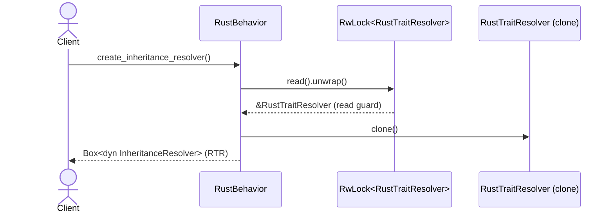

# behavior.rs Review

## TL;DR

- 目的: **Rust**向けの言語挙動を定義し、モジュールパス整形、可視性判定、インポート解決、トレイト/継承解決などのコアロジックを提供
- 公開API: **RustBehavior**（構築: new/default）、**LanguageBehavior**/ **StatefulBehavior** 実装により多数のメソッドが利用可能（例: module_path_from_file, import_matches_symbol, add_trait_impl）
- 複雑箇所: インポート解決の**多段ヒューリスティック**（crate::/super::/相対/再エクスポート）、トレイト解決の**スナップショット**設計（Arc<RwLock>）
- 重大リスク:
  - Windowsパス区切り（\）への非対応により**module_path_from_file**が誤動作
  - **RwLock**のPoisonErrorを**unwrap**でパニック処理（安全性/信頼性リスク）
  - **Visibility**の簡略化（pub(super)を常に不可視）で**誤判定**の可能性
  - **resolve_method_trait**が未実装（ライフタイム問題とAPI設計のズレ）
- パフォーマンス: ほぼ**O(1)**〜**O(n)**の文字列処理中心。resolverのcloneは**O(m)**（状態サイズ）になり得る
- テスト: 多数のユニットテストあり。Windowsパス、pub(in …)、alias/多段superなどは**未網羅**

## Overview & Purpose

このファイルは、Rust言語専用の**LanguageBehavior**と**StatefulBehavior**の実装を提供するモジュールで、主に以下を担います。

- Rust用Tree-sitter **Language**の提供
- モジュールパス整形（ファイルパス -> crateモジュールパス）
- シンボル可視性（pub / pub(crate) / pub(super) / private）の粗い判定
- インポート解決のヒューリスティック（crate::/super::/相対パス/再エクスポート）
- トレイト/インヘリタンス解決の状態管理（Arc<RwLock<RustTraitResolver>）と**スナップショット**取得
- import trackingの**状態管理**（BehaviorState）を使ったファイル登録/インポート取得

全体として、Rustのシンボル解決を**軽量な文字列ベース**で行う補助機能を提供し、厳密なコンパイラレベルの解決ではなく実用的な分析を目指す実装です。

## Structure & Key Components

| 種別 | 名前 | 公開範囲 | 責務 | 複雑度 |
|------|------|----------|------|--------|
| Macro | debug_global! | private | グローバルデバッグフラグに従うeprintln | Low |
| Struct | RustBehavior | pub | Rust言語挙動の提供（LanguageBehavior/StatefulBehavior実装） | Med |
| Field | language: Language | private | Tree-sitter Rust言語ハンドル | Low |
| Field | state: BehaviorState | private | import/モジュール状態を保持 | Med |
| Field | trait_resolver: Arc<RwLock<RustTraitResolver>> | private | トレイト/メソッド解決の共有状態 | Med |
| Impl | impl RustBehavior | pub(new) | 構築子（new） | Low |
| Impl | impl StatefulBehavior for RustBehavior | private | 状態アクセサ（state） | Low |
| Impl | impl Default for RustBehavior | pub | デフォルト構築 | Low |
| Impl | impl LanguageBehavior for RustBehavior | public trait impl | 言語別メソッド群（フォーマット/可視性/解決/インポート） | High |
| Mod | tests | private | ユニットテスト | Low |

### Dependencies & Interactions

- 内部依存
  - BehaviorState（import追跡/モジュールパス記録）
  - RustTraitResolver（トレイトとメソッドの関連づけ）
  - RustResolutionContext（ファイル単位の解決スコープ）
  - crate::Symbol / Visibility / relationship::RelationKind（シンボル/関係種別）
- 外部依存

| クレート/モジュール | 用途 |
|---------------------|------|
| tree_sitter::Language | Tree-sitter言語ハンドル |
| tree_sitter_rust::LANGUAGE | Rust文法 |
| std::sync::{Arc, RwLock} | 共有状態の並行制御 |
| std::path::{Path, PathBuf} | ファイルパス操作 |

- 被依存推定
  - プロジェクト全体のパーサ/解析器が**RustBehavior**を生成し、**LanguageBehavior**として呼び出す
  - 継承/トレイト関連解析で**InheritanceResolver**（CloneしたRustTraitResolver）を使用
  - import追跡（register_file/add_import/get_imports_for_file）で可視性や解決に活用

## API Surface (Public/Exported) and Data Contracts

注: このチャンクでは公開構造体・メソッドの実装が含まれます。Traitのデフォルトメソッド（例: get_abi_version, validate_node_kind）は「このチャンクには現れない」ため詳細は不明です。

| API名 | シグネチャ | 目的 | Time | Space |
|-------|-----------|------|------|-------|
| RustBehavior::new | `pub fn new() -> Self` | RustBehaviorの生成 | O(1) | O(1) |
| Default::default | `fn default() -> Self` | 既定生成（newの委譲） | O(1) | O(1) |
| format_module_path | `fn format_module_path(&self, base: &str, sym: &str) -> String` | `base::sym`形式へ整形 | O(n) | O(n) |
| parse_visibility | `fn parse_visibility(&self, signature: &str) -> Visibility` | pub種別の判別（簡易） | O(n) | O(1) |
| module_separator | `fn module_separator(&self) -> &'static str` | Rustの区切り（"::"） | O(1) | O(1) |
| supports_traits | `fn supports_traits(&self) -> bool` | トレイト対応可否 | O(1) | O(1) |
| supports_inherent_methods | `fn supports_inherent_methods(&self) -> bool` | 固有メソッド対応可否 | O(1) | O(1) |
| get_language | `fn get_language(&self) -> Language` | Tree-sitter言語取得 | O(1) | O(1) |
| module_path_from_file | `fn module_path_from_file(&self, file: &Path, root: &Path) -> Option<String>` | ファイルパスからcrateモジュールパスへ | O(n) | O(n) |
| create_resolution_context | `fn create_resolution_context(&self, file_id: FileId) -> Box<dyn ResolutionScope>` | Rust用解決コンテキスト生成 | O(1) | O(1) |
| create_inheritance_resolver | `fn create_inheritance_resolver(&self) -> Box<dyn InheritanceResolver>` | トレイト解決のスナップショット生成 | O(m) | O(m) |
| is_resolvable_symbol | `fn is_resolvable_symbol(&self, symbol: &crate::Symbol) -> bool` | シンボルが解決対象か判定 | O(1) | O(1) |
| add_trait_impl | `fn add_trait_impl(&self, type_name: String, trait_name: String, file_id: FileId)` | 型が実装するトレイト登録 | O(1)〜O(m) | O(1) |
| add_inherent_methods | `fn add_inherent_methods(&self, type_name: String, methods: Vec<String>)` | 型の固有メソッドを登録 | O(k) | O(k) |
| add_trait_methods | `fn add_trait_methods(&self, trait_name: String, methods: Vec<String>)` | トレイトのメソッド一覧登録 | O(k) | O(k) |
| resolve_method_trait | `fn resolve_method_trait(&self, _type_name: &str, _method: &str) -> Option<&str>` | メソッド→トレイト解決（未実装） | O(1) | O(1) |
| format_method_call | `fn format_method_call(&self, receiver: &str, method: &str) -> String` | `receiver.method`表記へ | O(n) | O(n) |
| inheritance_relation_name | `fn inheritance_relation_name(&self) -> &'static str` | 継承関係名（"implements"） | O(1) | O(1) |
| map_relationship | `fn map_relationship(&self, s: &str) -> RelationKind` | 言語固有→汎用関係種別の対応 | O(1) | O(1) |
| register_file | `fn register_file(&self, path: PathBuf, file_id: FileId, module_path: String)` | ファイル登録（状態へ委譲） | O(1) | O(1) |
| add_import | `fn add_import(&self, import: crate::parsing::Import)` | import登録（状態へ委譲） | O(1) | O(1) |
| get_imports_for_file | `fn get_imports_for_file(&self, file_id: FileId) -> Vec<crate::parsing::Import>` | import一覧取得（状態） | O(n) | O(n) |
| is_symbol_visible_from_file | `fn is_symbol_visible_from_file(&self, symbol: &crate::Symbol, from: FileId) -> bool` | 可視性チェック（簡易） | O(1) | O(1) |
| get_module_path_for_file | `fn get_module_path_for_file(&self, file_id: FileId) -> Option<String>` | ファイルのモジュールパス（状態） | O(1) | O(1) |
| import_matches_symbol | `fn import_matches_symbol(&self, import_path: &str, symbol_module_path: &str, importing_module: Option<&str>) -> bool` | インポート解決のヒューリスティック | O(n) | O(n) |

詳細（主要APIのみ記述。省略は「このチャンクには現れない」または単純ゆえ略）:

1) module_path_from_file
- 目的と責務: ファイルパスから**crate::...**形式のモジュールパスを生成
- アルゴリズム:
  1. `strip_prefix(project_root)`でルート相対へ
  2. 先頭`src/`を除去（なければそのまま）
  3. `to_str()`→`strip_suffix(".rs")`で拡張子除去
  4. `strip_suffix("/mod")`ならディレクトリ名のみ（foo/mod.rs → foo）
  5. `/`を`::`へ置換
  6. 結果が`main`,`lib`,`""`なら`crate`、それ以外は`crate::...`
- 引数:

| 名 | 型 | 説明 |
|----|----|------|
| file_path | &Path | 対象ファイルの絶対パス |
| project_root | &Path | プロジェクトルート |

- 戻り値:

| 型 | 説明 |
|----|------|
| Option<String> | crateモジュールパス（UTF-8に変換不可時はNone） |

- 使用例:
```rust
let behavior = RustBehavior::new();
let root = std::path::Path::new("/project");
let mod_path = std::path::Path::new("/project/src/foo/bar.rs");
assert_eq!(behavior.module_path_from_file(mod_path, root), Some("crate::foo::bar".into()));
```
- エッジケース:
  - 非UTF-8パスはNone
  - Windowsの`\`区切り非対応（詳細は後述）

2) import_matches_symbol
- 目的と責務: 文字列ベースで**importパス**と**シンボルの完全修飾名**が一致するかを多段ヒューリスティックで判定
- アルゴリズム（主な分岐のみ）:
  - Case 1: 完全一致（最初に判定）
  - Case 1b: importが`crate::`、symbolが非`crate::`（逆もあり）→前方`crate::`の正規化
  - Case 1d: **再エクスポート**パターン（末尾名一致 + import接頭辞の下位にsymbolが存在）
  - Case 2: `super::`相対（1階層上の親からの解決）+ 再エクスポートヒューリスティック
  - Case 3: importing_moduleがある場合の相対解決（自身のモジュール配下/兄弟モジュール）
- 引数:

| 名 | 型 | 説明 |
|----|----|------|
| import_path | &str | use/importで指定されたパス文字列 |
| symbol_module_path | &str | シンボルの完全修飾名（例: crate::a::b::Name） |
| importing_module | Option<&str> | importを記述したモジュールの完全修飾名 |

- 戻り値:

| 型 | 説明 |
|----|------|
| bool | マッチしたか |

- 使用例:
```rust
let b = RustBehavior::new();
assert!(b.import_matches_symbol("crate::parsing::LanguageBehavior",
                                "crate::parsing::language_behavior::LanguageBehavior",
                                Some("crate::parsing::rust")));
```
- エッジケース:
  - `super::`は1階層のみ対応（`super::super::`は未対応）
  - `self::`や`in crate::module`の可視性制限は未対応
  - `as`による別名（alias）は未対応（Import構造体側の正規化が必要）

3) is_symbol_visible_from_file
- 目的と責務: シンボルの**可視性**（Visibility）に基づいた**他ファイルからのアクセス可否**を判定（簡略化）
- アルゴリズム:
  - 同一ファイルならtrue
  - Visibility::Public → true
  - Visibility::Crate → 現状常にtrue（同一crateと仮定）
  - Visibility::Module → 現状false（階層解析未実装）
  - Visibility::Private → false
- 引数/戻り値: 略（上記シグネチャ通り）
- エッジケース: `pub(in path)`/`pub(self)`未対応

4) create_inheritance_resolver
- 目的と責務: **RwLock**保護された`RustTraitResolver`から**スナップショット**を取得し、`Box<dyn InheritanceResolver>`として返す
- アルゴリズム:
  - `trait_resolver.read().unwrap()`で読みロック
  - `resolver.clone()`し、Box化
- エッジケース: ロックPoison時にunwrapでパニック

5) add_trait_impl / add_inherent_methods / add_trait_methods
- 目的と責務: 書きロックで`RustTraitResolver`へ登録
- アルゴリズム:
  - `write().unwrap()`→内部メソッド呼び出し
- エッジケース: ロックPoison時にパニック

6) module_separator / format_module_path / format_method_call / map_relationship
- 単純な文字列整形/定数返却のため詳細は割愛

注: `get_abi_version`/`validate_node_kind`はテストで使用されていますが、実装はこのチャンクには現れない（恐らくLanguageBehaviorのデフォルト実装）。戻り値の仕様（ABI=15、node kindの妥当性）はテストから推測されますが、ここでは仕様詳細不明とします。

## Walkthrough & Data Flow

- 状態管理の流れ
  - RustBehaviorは内部に**BehaviorState**を持ち、`StatefulBehavior::state()`で公開
  - `register_file/add_import/get_imports_for_file`は「状態付きのヘルパ（register_file_with_state等）」へ委譲（このチャンクには現れない）
  - `get_module_path_for_file`はBehaviorStateからO(1)参照

- トレイト解決の流れ
  - `add_trait_impl/add_inherent_methods/add_trait_methods`で**RwLock書きロック**を取得し、状態更新
  - `create_inheritance_resolver`は**読みロック→clone**で**スナップショット**を配布
  - `resolve_method_trait`はライフタイム制約により未実装（将来`String`返却に変更予定）

- インポート解決の流れ（ヒューリスティック）
  - 入力: `import_path`, `symbol_module_path`, `importing_module?`
  - 手順: 完全一致 → crate::正規化（両方向） → 末尾名一致＋接頭辞下位の再エクスポート → `super::`相対 → importing_moduleベースの相対/兄弟 → 不一致
  - デバッグ: マッチ時に`debug_global!`でヒット種別を出力

Mermaidフローチャート（import_matches_symbolの主要分岐）:
```mermaid
flowchart TD
  A[Start] --> B{import_path == symbol_module_path?}
  B -- Yes --> Z[Return true]
  B -- No --> C{Normalize crate:: prefix (two-way) match?}
  C -- Yes --> Z
  C -- No --> D{Tail name equal AND symbol starts with import_prefix?}
  D -- Yes --> Z
  D -- No --> E{import starts with super::?}
  E -- Yes --> F{Has importing_module?}
  F -- No --> G[Return false]
  F -- Yes --> H[Resolve parent module + relative_path]
  H --> I{candidate == symbol_module_path?}
  I -- Yes --> Z
  I -- No --> J{Tail name equal under parent (re-export)?}
  J -- Yes --> Z
  J -- No --> K{Has importing_module?}
  K -- No --> G
  K -- Yes --> L{Relative under importing_module?}
  L -- Yes --> Z
  L -- No --> M{Sibling under parent module?}
  M -- Yes --> Z
  M -- No --> G
```
上記の図は`import_matches_symbol`関数（このチャンク内）の主要分岐を示す。

Mermaidシーケンス図（トレイト解決スナップショット生成）:

上記の図は`create_inheritance_resolver`関数（このチャンク内）の主要フローを示す。

## Complexity & Performance

- 文字列処理中心で各APIは概ね**O(n)**（n=文字列長）、メモリも**O(n)**程度
- 重要なボトルネック:
  - `create_inheritance_resolver`の`clone()`は**O(m)**（トレイト解決状態のサイズ）。状態が大きい場合にコスト増
  - `import_matches_symbol`は分岐多数の多回文字列操作で**CPU負荷**が蓄積する可能性あり
- スケール限界/運用負荷:
  - 巨大プロジェクトで**インポート回数×文字列長**が増えると遅延
  - RwLockの競合が高いと待ちが発生（特に頻繁な書き込み時）
- I/O/ネットワーク/DB: 該当なし（このチャンクには現れない）

## Edge Cases, Bugs, and Security

セキュリティチェックリスト評価:
- メモリ安全性: unsafe未使用。RwLockは安全だが**PoisonErrorをunwrap**するためパニックリスク
- インジェクション: 該当なし（外部入力をコマンド/SQLに渡さない）
- 認証・認可: 該当なし
- 秘密情報: ログ出力はeprintlnのみ。秘密情報の取り扱いは**不明**
- 並行性: RwLock採用。**Poison/デッドロック**可能性は低いが例外処理なし。スナップショット設計により**競合を回避**するが整合性は更新タイミング依存

詳細エッジケース一覧:

| エッジケース | 入力例 | 期待動作 | 実装 | 状態 |
|-------------|--------|----------|------|------|
| Windows区切り | "C:\\proj\\src\\foo\\bar.rs" | crate::foo::bar | `/`→`::`変換は`\`に非対応 | 不具合 |
| 非UTF-8パス | OsStr非UTF-8 | Someまたは適切なNone処理 | to_strでNone | 設計通り/要検討 |
| mod.rs検出 | "/project/src/foo/mod.rs" | crate::foo | `strip_suffix("/mod")`依存（`/`固定） | Windowsで不具合 |
| pub(super)可視性 | visibility=Module | 親と兄弟から可視 | 常にfalse返却 | 仕様不足 |
| pub(in x)対応 | "pub(in crate::a)" | 指定範囲のみ可視 | 文字列判定に非対応 | 未対応 |
| alias(use as) | use a::b as c | cで参照可 | import文字列の別名非対応 | 未対応 |
| super多段 | super::super::Name | 2階層上参照可 | 1階層のみ実装 | 未対応 |
| RwLock Poison | panic中にロック保持 | エラー伝播または回復 | unwrapでpanic | 要改善 |
| resolve_method_trait | (type, method) | Some(trait) | 生存期間制約でNone固定 | 未実装 |
| format_method_call | Foo::bar()（関連関数） | "::"が正 | "."固定出力 | 仕様簡略 |

## Design & Architecture Suggestions

- モジュールパス処理の堅牢化
  - Path操作を**Path/Component**ベースに統一（拡張子は`file_path.file_stem()`、ディレクトリは`components()`）
  - 区切り変換は**OS非依存**にする（componentを`::`でjoin）
  - `mod.rs`検出はPathレベルで**ファイル名が"mod.rs"**なら親ディレクトリ名使用

- 可視性解析の強化
  - `pub(super)`を正しく判定できるよう**モジュール階層**（親・兄弟）を**BehaviorState**に保持
  - `pub(in path)`/`pub(self)`の対応

- インポート解決の改善
  - `self::`/`super::super::`/alias（as）などの**正規化**をImport構造体に持たせ、判定を簡略化
  - ヒューリスティックの**スコアリング**または**早期終了**の順序最適化

- トレイト解決APIの再設計
  - `resolve_method_trait`の返り値を**Option<String>**に変更し、**RwLock**からの参照を回避
  - Resolverの**読み取り専用スナップショット**を内部キャッシュとして再利用（cloneコスト削減）

- 並行性/エラー処理
  - RwLockの**PoisonError**を明示的に処理（`read().unwrap_or_else(|e| e.into_inner())`など）し、**panic回避**
  - 高頻度ロックなら**parking_lot**のRwLock採用を検討
  - メソッドを**Result<>**に拡張し、失敗時の扱いを明示

- ロギング/観測可能性
  - `debug_global!`を**log/tracing**に差し替え（レベル制御、構造化ログ）
  - ヒューリスティックに**メトリクス**（ヒット率/ケース別カウント）を追加

## Testing Strategy (Unit/Integration) with Examples

拡充推奨のテスト項目:
- Windowsパス対応
```rust
#[test]
fn test_module_path_from_file_windows() {
    let b = RustBehavior::new();
    let root = std::path::Path::new("C:\\project");
    let p = std::path::Path::new("C:\\project\\src\\foo\\bar.rs");
    // 期待: Some("crate::foo::bar")
    assert_eq!(b.module_path_from_file(p, root), Some("crate::foo::bar".into()));
}
```
- pub(super)/pub(in)可視性
```rust
#[test]
fn test_visibility_pub_super_and_in() {
    let b = RustBehavior::new();
    assert_eq!(b.parse_visibility("pub(super) fn x()"), Visibility::Module);
    assert_eq!(b.parse_visibility("pub(in crate::a) fn x()"), /* 現状Private */ Visibility::Private);
    // 将来対応時はVisibility::Restrictedなどへの拡張を期待
}
```
- super多段・self::・alias
```rust
#[test]
fn test_import_matches_symbol_super_multi_self_alias() {
    let b = RustBehavior::new();
    // super::super::Name のケース（将来対応時）
    assert_eq!(b.import_matches_symbol("super::super::Name",
        "crate::a::Name", Some("crate::a::b::c")), /* 現状false */ false);
    // self::Name のケース（未対応）
    assert_eq!(b.import_matches_symbol("self::Name",
        "crate::a::b::Name", Some("crate::a::b")), false);
    // alias のケース（未対応。Import側の正規化前提）
    // use crate::a::b::Name as Alias; import_path="Alias" などの扱いは要検討
}
```
- PoisonError耐性（設計変更後）
```rust
// 変更後: add_trait_implがResult<()>を返すと仮定
#[test]
fn test_trait_resolver_poison_resilient() {
    let b = RustBehavior::new();
    // テストでPoisonを疑似的に作るのは難しいため、Resultハンドリングの型検査を行う
    // 実環境ではスレッドでpanicを発生させた後の挙動を確認
}
```
- importヒューリスティックの境界テスト（不一致確認）
```rust
#[test]
fn test_import_matches_symbol_no_overmatch() {
    let b = RustBehavior::new();
    assert!(!b.import_matches_symbol("crate::utils::Helper",
        "crate::parsing::utils::Helper", Some("crate::parsing")));
}
```

## Refactoring Plan & Best Practices

- 短期（1-2スプリント）
  - module_path_from_fileをPath APIベースに再実装（Windows対応）
  - RwLockのunwrap除去、PoisonErrorの回復/伝播を実装
  - resolve_method_traitの返却型をOption<String>へ変更（コンパイラエラーの修正含む）
  - import_matches_symbolに`self::`サポート追加

- 中期（3-4スプリント）
  - BehaviorStateに**モジュール階層**を格納し、pub(super)/pub(in)可視性判定を実装
  - alias対応（Import構造体の正規化ロジック追加）
  - cloneの回数削減（InheritanceResolverの内部キャッシュ）

- 長期
  - Tree-sitterノードに基づく**厳密な可視性/解決**（構文木の親子関係活用）
  - 観測可能性強化（tracing + metrics）
  - サブクレート/ワークスペース対応（pub(crate)の境界判断）

ベストプラクティス:
- 文字列ではなく**構造化情報**で解決（パスはcomponents、可視性はAST由来）
- 共有状態へのアクセスは**短期間**にし、cloneのコストを把握
- エラーは**Result**で返し、パニックを避ける
- ログは**レベル制御**と**構造化**で後解析可能に

## Observability (Logging, Metrics, Tracing)

- 現状
  - `debug_global!`でデバッグ時のみ`eprintln`（構造化なし）
  - ヒューリスティックのヒットケースでログ行を出力（import_matches_symbol）
- 推奨
  - `tracing`クレートで`trace/debug/info`のレベル管理
  - import解決の各ケースで**イベントタグ**（case=exact/prefix/reexport/super/relative/sibling）
  - メトリクス:
    - import解決の**成功率**、ケース別**ヒット数**
    - resolverの**clone時間**/サイズ
  - トレースID（ファイルID/モジュール名）をログに付与し**後追い可能**に

## Risks & Unknowns

- Unknowns
  - LanguageBehavior/StatefulBehaviorの**デフォルトメソッド**実装詳細（`register_file_with_state`等、`get_abi_version`/`validate_node_kind`）
  - RustTraitResolverの**内部構造とcloneコスト**
  - BehaviorStateの**データ構造**（HashMapなど）とスレッドセーフ性
- Risks
  - Windowsパス非対応により**誤ったモジュールパス**が多数発生する可能性
  - RwLockのunwrapで**パニック停止**（運用時の信頼性リスク）
  - ヒューリスティックが**過剰/過少マッチ**を生む可能性（誤リンク）
  - 可視性の簡略化により**解析精度低下**（pub(super)/pub(in)）
  - ライフタイム制約で未実装API（resolve_method_trait）が**機能不足**

以上の点を踏まえ、まずは**パス処理のOS非依存化**と**エラー処理の堅牢化**から着手し、次に**可視性/インポート正規化**の強化、最後に**観測可能性**と**性能**改善を進めるのが効果的です。