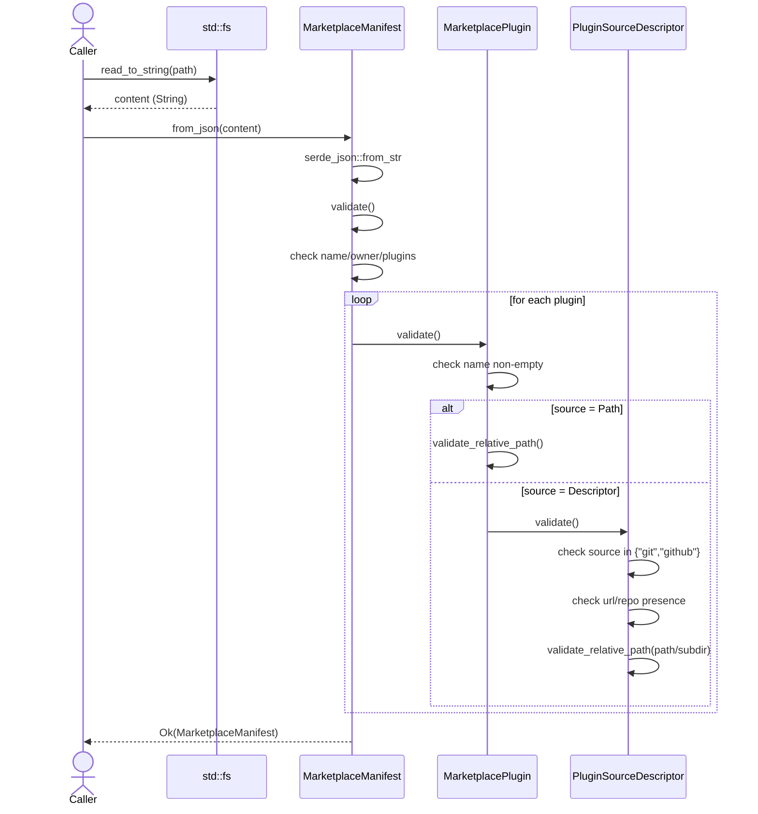
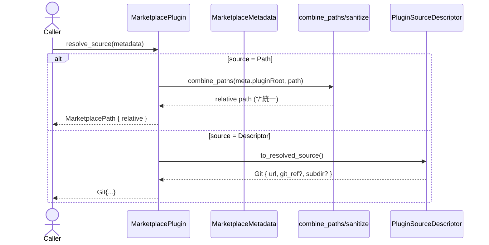

# plugins\marketplace.rs Review

## TL;DR

- 目的: マーケットプレイスのマニフェスト（.claude-plugin/marketplace.json）を読み込み・検証し、各プラグインのソース解決（ローカル相対パス/外部Git/GitHub）と、strict=false時の簡易PluginManifest生成を行う。
- 主要公開API:
  - MarketplaceManifest::{from_file, from_json, validate, find_plugin}
  - MarketplacePlugin::{validate, resolve_source, to_plugin_manifest}
  - データ契約: MarketplaceManifest/Owner/Metadata/Plugin/PluginSource/ResolvedPluginSource
- コアロジック:
  - 重複プラグイン名検出（HashSet）
  - パス検証（絶対パス/..禁止）と正規化（sanitize, combine_paths）
  - Git/GitHubディスクリプタ→fetch可能なURL形へ解決
- 複雑箇所: パスのサニタイズと検証の境界条件、Git/GitHubディスクリプタの妥当性検査、strict=false時のPluginManifest合成。
- 重大リスク/注意:
  - パス検証が「..」の単純包含チェックに依存（過検知の可能性、正規化不備のリスク）
  - GitHub repo文字列をURLへ埋め込むため、下流がシェル呼出しする場合にコマンドインジェクション対策は下流側に依存
  - 型安全性: sourceがString型で種別を表現（"git"/"github"）しており列挙型化の余地
- Rust安全性:
  - unsafeなし、所有権/借用はシンプル、I/Oとserdeデシリアライズのみ
  - 競合状態なし（同期/非同期なし）

## Overview & Purpose

このファイルは、マーケットプレイスリポジトリに置かれる marketplace.json（マーケットプレイスマニフェスト）の読み込み、検証、そしてプラグインエントリごとのソース解決を担う。パスソース（リポジトリ内相対パス）または外部ソース（Git/GitHub）を解決し、場合によってはstrict=false時にPluginManifestをマニフェスト情報から組み立てる。公開されたデータ構造は上位層から直接使われる前提で、serdeのSerialize/DeserializeによりJSONとの相互変換を提供する。

## Structure & Key Components

| 種別 | 名前 | 公開範囲 | 責務 | 複雑度 |
|------|------|----------|------|--------|
| Struct | MarketplaceManifest | pub | マーケットプレイス全体のメタ、所有者、プラグイン一覧 | Low |
| Struct | MarketplaceOwner | pub | 所有者情報(name/email/url) | Low |
| Struct | MarketplaceMetadata | pub | pluginRootなど追加メタ | Low |
| Struct | MarketplacePlugin | pub | プラグインエントリ（name/source/description等） | Med |
| Enum | MarketplacePluginSource | pub | sourceの判別（相対パス or ディスクリプタ） | Med |
| Struct | MarketplacePluginSourceDescriptor | pub | "git"/"github"など詳細ソース記述 | Med |
| Enum | ResolvedPluginSource | pub | fetch/抽出可能な解決済みソース | Low |
| fn | combine_paths | private | pluginRootとchildパス結合 | Low |
| fn | sanitize | private | パスの先頭"./"や"/"除去、空→"." | Low |
| fn | validate_relative_path | private | 相対パス妥当性チェック(".."/絶対/空) | Low |
| impl | MarketplaceManifest | pub fns | from_file/from_json/validate/find_plugin | Med |
| impl | MarketplacePlugin | pub fns | validate/resolve_source/to_plugin_manifest | Med |
| impl | MarketplacePluginSource | private fn | validate（委譲） | Low |
| impl | MarketplacePluginSourceDescriptor | private fns | validate/to_resolved_source | Med |

### Dependencies & Interactions

- 内部依存
  - MarketplaceManifest::from_file → from_json → validate → MarketplacePlugin::validate → MarketplacePluginSource::validate → MarketplacePluginSourceDescriptor::validate
  - MarketplacePlugin::resolve_source → combine_paths / MarketplacePluginSourceDescriptor::to_resolved_source
  - MarketplacePlugin::to_plugin_manifest → PluginManifest::validate（super::plugin; このチャンクには現れない）

- 外部依存（主要）
  | クレート/モジュール | 用途 |
  |--------------------|------|
  | serde/serde_json | JSONのSerialize/Deserialize |
  | std::fs | ファイル読み込み（from_file） |
  | std::path | Path/PathBufとパス操作 |
  | super::error::{PluginError, PluginResult} | 統一エラー型とResult別名（このチャンクには定義なし） |
  | super::plugin::{HookSpec, McpServerSpec, PathSpec, PluginAuthor, PluginManifest} | プラグイン関連データ型（このチャンクには定義なし） |

- 被依存推定
  - マーケットプレイスレポジトリをクローンした後、marketplace.jsonを読み込み、プラグインを列挙/探索/解決する上位のインストーラ/ディスカバリロジック
  - strict=falseのプラグインに対してPluginManifest合成を行う導入処理

## API Surface (Public/Exported) and Data Contracts

| API名 | シグネチャ | 目的 | Time | Space |
|-------|-----------|------|------|-------|
| MarketplaceManifest::from_file | fn from_file(path: &Path) -> PluginResult<Self> | JSONファイルから読み込み→検証 | O(F + P) | O(P) |
| MarketplaceManifest::from_json | fn from_json(json: &str) -> PluginResult<Self> | JSON文字列からパース→検証 | O(L + P) | O(P) |
| MarketplaceManifest::validate | fn validate(&self) -> PluginResult<()> | マニフェスト全体の妥当性検証 | O(P) | O(P) |
| MarketplaceManifest::find_plugin | fn find_plugin(&self, name: &str) -> Option<&MarketplacePlugin> | 名前でプラグイン検索 | O(P) | O(1) |
| MarketplacePlugin::validate | fn validate(&self) -> PluginResult<()> | 個別プラグインとsourceの妥当性検証 | O(1) | O(1) |
| MarketplacePlugin::resolve_source | fn resolve_source(&self, metadata: Option<&MarketplaceMetadata>) -> PluginResult<ResolvedPluginSource> | ソースの解決（相対パス/Git） | O(1) | O(1) |
| MarketplacePlugin::to_plugin_manifest | fn to_plugin_manifest(&self) -> PluginResult<PluginManifest> | strict=false向けのPluginManifest合成 | O(1) | O(1) |

- 記号:
  - F=ファイルサイズ、L=JSON文字列長、P=プラグイン数
  - 検証時のHashSetがO(P)の補助メモリを使用

以下、各API詳細。

1) MarketplaceManifest::from_file
- 目的と責務
  - 指定パスからJSONを読み込み、構造体化し、検証まで行う。I/Oとシリアライズの境界。
- アルゴリズム
  1. std::fs::read_to_stringでファイル読込
  2. from_jsonへ委譲
- 引数
  | 名称 | 型 | 役割 |
  |------|----|------|
  | path | &Path | marketplace.jsonへのパス |
- 戻り値
  | 型 | 意味 |
  |----|------|
  | PluginResult<MarketplaceManifest> | 成功でマニフェスト。失敗でPluginError（I/O or 解析/検証エラー） |
- 使用例
  ```rust
  use std::path::Path;
  use plugins::marketplace::MarketplaceManifest;

  let path = Path::new("/repo/.claude-plugin/marketplace.json");
  let manifest = MarketplaceManifest::from_file(path)?;
  println!("Marketplace: {}", manifest.name);
  ```
- エッジケース
  - ファイルが存在しない/権限なし → I/Oエラー
  - JSON不正 → serde_jsonエラー
  - 検証エラー → PluginError::InvalidMarketplaceManifest

2) MarketplaceManifest::from_json
- 目的と責務
  - JSON文字列をデシリアライズし、validateを実行。
- アルゴリズム
  1. serde_json::from_strでパース
  2. manifest.validate()
- 引数
  | 名称 | 型 | 役割 |
  |------|----|------|
  | json | &str | JSON文字列 |
- 戻り値
  | 型 | 意味 |
  |----|------|
  | PluginResult<MarketplaceManifest> | 成功で構造体 |
- 使用例
  ```rust
  let json = r#"{"name":"m","owner":{"name":"o"},"plugins":[{"name":"p","source":"./p"}]}"#;
  let m = MarketplaceManifest::from_json(json)?;
  assert_eq!(m.plugins.len(), 1);
  ```
- エッジケース
  - JSONキー名のタイプミス → デシリアライズ失敗
  - plugins空 → 検証エラー

3) MarketplaceManifest::validate
- 目的と責務
  - 必須フィールド非空チェック
  - プラグイン重複検出
  - 各プラグインのvalidate呼び出し
- アルゴリズム
  1. name, owner.name, pluginsの基本チェック
  2. HashSetで重複名前の検出
  3. 各プラグインのvalidate()
- 引数
  | 名称 | 型 | 役割 |
  |------|----|------|
  | self | &Self | 対象マニフェスト |
- 戻り値
  | 型 | 意味 |
  |----|------|
  | PluginResult<()> | 妥当ならOk |
- 使用例
  ```rust
  let mut m = MarketplaceManifest::from_json(json)?;
  m.validate()?; // 冪等
  ```
- エッジケース
  - "Duplicate plugin name" → エラー
  - 子プラグイン検証エラー伝播

4) MarketplaceManifest::find_plugin
- 目的と責務
  - 名前による線形検索。
- アルゴリズム
  - Vec::iter().find(|p| p.name == name)
- 引数
  | 名称 | 型 |
  |------|----|
  | name | &str |
- 戻り値
  | 型 | 意味 |
  |----|------|
  | Option<&MarketplacePlugin> | 見つかればSome |
- 使用例
  ```rust
  if let Some(p) = manifest.find_plugin("my-plugin") {
      println!("Found {}", p.name);
  }
  ```
- エッジケース
  - 大文字/小文字は区別（厳密一致）

5) MarketplacePlugin::validate
- 目的と責務
  - name非空
  - sourceのvalidate
- アルゴリズム
  1. name非空チェック
  2. source.validate(&name)
- 引数/戻り値
  | 戻り値 | 意味 |
  |--------|------|
  | PluginResult<()> | 妥当性 |
- 使用例
  ```rust
  let p = &manifest.plugins[0];
  p.validate()?;
  ```
- エッジケース
  - source=Pathのとき: validate_relative_path

6) MarketplacePlugin::resolve_source
- 目的と責務
  - metadata.plugin_rootとsourceからResolvedPluginSourceを構築。
- アルゴリズム
  - Pathの場合: combine_paths(plugin_root, path)
  - Descriptorの場合: to_resolved_source()
- 引数
  | 名称 | 型 | 役割 |
  |------|----|------|
  | metadata | Option<&MarketplaceMetadata> | pluginRootの有無 |
- 戻り値
  | 型 | 意味 |
  |----|------|
  | PluginResult<ResolvedPluginSource> | 解決済みソース |
- 使用例
  ```rust
  let src = p.resolve_source(manifest.metadata.as_ref())?;
  match src {
      ResolvedPluginSource::MarketplacePath{relative} => println!("rel: {relative}"),
      ResolvedPluginSource::Git{url, git_ref, subdir} => println!("git: {url:?}, {git_ref:?} {subdir:?}"),
  }
  ```
- エッジケース
  - plugin_rootやchildが"."や空文字 → combine_pathsが正規化して返す

7) MarketplacePlugin::to_plugin_manifest
- 目的と責務
  - strict=false運用時、marketplace側情報からPluginManifestを組み立てる。
- アルゴリズム
  1. descriptionがなければデフォルト文言を採用（空文字はエラー）
  2. versionがなければ"0.0.0"
  3. authorがなければ"Marketplace"
  4. PluginManifestを構築しmanifest.validate()
- 引数/戻り値
  | 戻り値 | 意味 |
  |--------|------|
  | PluginResult<PluginManifest> | 構築済み |
- 使用例
  ```rust
  // 呼び出し側でp.strict == falseを判断してから呼ぶ前提
  let pm = p.to_plugin_manifest()?;
  ```
- エッジケース
  - description空（かつstrict=false想定）→ InvalidPluginManifestエラー
  - PluginManifest::validateの失敗は透過

データ契約（主なフィールド）
- MarketplaceManifest
  - name: String（必須）
  - owner: MarketplaceOwner（必須）
  - plugins: Vec<MarketplacePlugin>（1件以上）
  - metadata?: MarketplaceMetadata
  - description?: String, url?: String
- MarketplaceOwner
  - name: String（必須）, email?: String, url?: String
- MarketplaceMetadata
  - plugin_root?（JSONキーは"pluginRoot"）
  - description?, version?
- MarketplacePlugin
  - name: String（必須）
  - source: MarketplacePluginSource（必須）
  - description?, version?, author?, homepage?, repository?, license?
  - keywords[], category?, tags[]
  - commands?/agents?/hooks?/scripts?/mcpServers?
  - strict: bool（デフォルトtrue）
- MarketplacePluginSource
  - Path(String) または Descriptor(MarketplacePluginSourceDescriptor)
- MarketplacePluginSourceDescriptor
  - source: "git" or "github"
  - repo?（github用）, url?（git用）, path?, subdir?, ref?（git_ref）
- ResolvedPluginSource
  - MarketplacePath { relative: String } または Git { url, git_ref?, subdir? }

## Walkthrough & Data Flow

シナリオ1: marketplace.jsonの読み込みから検証まで



上記の図は from_file → from_json → validate の主要フローと、プラグイン/ディスクリプタ検証の呼び出し関係を示す。

シナリオ2: プラグインのソース解決



上記の図は resolve_source の主要分岐を示す。

## Complexity & Performance

- MarketplaceManifest::validate: O(P) 時間, O(P) 空間（HashSet）で重複検出。P=プラグイン数。
- from_file/from_json: 解析サイズに比例。I/OとデシリアライズはO(L)（JSON長）。検証でO(P)。
- find_plugin: 線形検索O(P)。
- resolve_source/to_resolved_source: 文字列操作中心でO(1)。
- ボトルネック
  - 超大量プラグイン（数万件）でvalidateとfindがO(P)となる。通常規模では問題軽微。
- スケール限界/負荷要因
  - I/O（巨大JSONファイル）とserdeのデシリアライズコスト。
  - Git URLの解決自体は軽量（実際のクローン/ネットワークはこのチャンクには現れない）。

## Edge Cases, Bugs, and Security

セキュリティチェックリスト
- メモリ安全性: unsafeなし、境界外アクセスなし、整数演算なし → ✅
- インジェクション:
  - パス・トラバーサル: 相対パス検証で".."と絶対パスを拒否 → ✅（ただし簡易）
  - コマンド/SQL: 本チャンクでは未実施。Git URLの使用先がシェル実行なら下流でサニタイズ要 → ⚠️
- 認証・認可: 対象外 → 該当なし
- 秘密情報: ハードコード秘密なし。ログ出力なし → ✅
- 並行性: 共有状態なし。レース/デッドロックなし → ✅

実装のキーユーティリティ（参考）
```rust
fn sanitize(path: &str) -> String {
    let trimmed = path.trim();
    let without_prefix = trimmed.trim_start_matches("./");
    let without_slash = without_prefix.trim_start_matches('/');
    if without_slash.is_empty() {
        ".".to_string()
    } else {
        without_slash.to_string()
    }
}

fn validate_relative_path(plugin_name: &str, path: &str) -> PluginResult<()> {
    if path.contains("..") {
        return Err(PluginError::InvalidMarketplaceManifest {
            reason: format!("Plugin '{plugin_name}' source path cannot contain '..'"),
        });
    }
    if Path::new(path).is_absolute() {
        return Err(PluginError::InvalidMarketplaceManifest {
            reason: format!("Plugin '{plugin_name}' source path must be relative"),
        });
    }
    if path.trim().is_empty() {
        return Err(PluginError::InvalidMarketplaceManifest {
            reason: format!("Plugin '{plugin_name}' source path cannot be empty"),
        });
    }
    Ok(())
}
```

エッジケース一覧

| エッジケース | 入力例 | 期待動作 | 実装 | 状態 |
|-------------|--------|----------|------|------|
| マーケットプレイス名空 | name="" | エラー | MarketplaceManifest::validate | OK |
| オーナー名空 | owner.name="" | エラー | MarketplaceManifest::validate | OK |
| plugins空 | [] | エラー | MarketplaceManifest::validate | OK |
| 重複プラグイン名 | ["a","a"] | エラー | MarketplaceManifest::validate | OK |
| プラグイン名空 | plugin.name="" | エラー | MarketplacePlugin::validate | OK |
| 相対パスに".." | "../x" or "a/../b" | エラー | validate_relative_path | OK（過検知の可能性） |
| 絶対パス | "/abs" or "C:\\abs" | エラー | validate_relative_path | OK |
| 空のパス | " " | エラー | validate_relative_path | OK |
| gitディスクリプタでurl欠落 | {"source":"git"} | エラー | PSD::validate | OK |
| githubディスクリプタでrepo欠落 | {"source":"github"} | エラー | PSD::validate | OK |
| 未対応source種別 | {"source":"svn"} | エラー | PSD::validate | OK |
| path/subdirの相対性 | pathに"/"先頭 | sanitizeで除去→validate_relative_path | PSD::validate | OK |
| strict=falseでdescription空 | strict=false, description="" | エラー | to_plugin_manifest | OK |
| pluginRoot+childが"." | "." + "." | "."を正規化し結合 | combine_paths | OK |

指摘事項/注意点
- パス検証の"..": "file..name"のような合法名も拒否される（過検知）。セキュリティ上は安全側だがUX低下の恐れ。
- to_plugin_manifestはstrictフラグを内部では参照しない。呼び出し側の契約に依存（ドキュメントに従う必要）。

## Design & Architecture Suggestions

- Source種別の型安全化
  - MarketplacePluginSourceDescriptor.sourceをStringではなく、serdeでタグ付けした列挙型に（例: enum SourceType { #[serde(rename="git")] Git, #[serde(rename="github")] Github }）。不正値を型で防止。
- 受け入れJSONの厳密化
  - #[serde(deny_unknown_fields)]の付与で未知フィールドを拒否し、タイポを早期検出。
- パス検証の堅牢化
  - Pathの正規化（余分な連続スラッシュの除去）や、".."検出をセグメント単位で行う（split('/')して".."が要素として現れる場合のみ拒否）。これにより過検知回避。
- URL/Repoのバリデーション
  - urlクレート/正規表現でURL/リポジトリ書式チェックを強化。将来の下流処理（Gitクライアント呼出し）がシェルを介する場合でも安全性を高める。
- find_pluginの効率化
  - 参照マップ（HashMap<String, usize>）をキャッシュする設計（規模が増えた場合のみ検討）。
- strictフローの明示
  - to_plugin_manifest呼出し時にdebugログやアサートでstrict==falseを要求するか、メソッド側でstrictを検査して不一致ならエラーにする設計。

## Testing Strategy (Unit/Integration) with Examples

既存テスト
- 正常パース、空plugins拒否、重複名拒否、find_plugin確認。

追加推奨ユニットテスト
- パス検証
  ```rust
  #[test]
  fn path_validation_rejects_parent_and_abs() {
      assert!(validate_relative_path("p", "../x").is_err());
      assert!(validate_relative_path("p", "/abs").is_err());
      assert!(validate_relative_path("p", "C:\\abs").is_err());
      assert!(validate_relative_path("p", " ").is_err());
      assert!(validate_relative_path("p", "./ok").is_ok());
  }
  ```
- sanitize/combine_paths
  ```rust
  #[test]
  fn combine_and_sanitize_paths() {
      assert_eq!(super::sanitize(" ./a "), "a");
      assert_eq!(super::sanitize("/"), ".");
      assert_eq!(super::combine_paths(Some("."), "./p").unwrap(), "p");
      assert_eq!(super::combine_paths(Some("root"), "child").unwrap(), "root/child");
  }
  ```
- Git/GitHubディスクリプタ妥当性
  ```rust
  #[test]
  fn github_descriptor_validates_and_resolves() {
      let d = MarketplacePluginSourceDescriptor {
          source: "github".into(),
          repo: Some("owner/repo".into()),
          url: None, path: Some("sub/dir".into()),
          subdir: None, git_ref: Some("v1".into()),
      };
      d.validate("p").unwrap();
      match d.to_resolved_source().unwrap() {
          ResolvedPluginSource::Git{ url, git_ref, subdir } => {
              assert!(url.ends_with(".git"));
              assert_eq!(git_ref.as_deref(), Some("v1"));
              assert_eq!(subdir.as_deref(), Some("sub/dir"));
          }
          _ => panic!("expected Git"),
      }
  }
  ```
- strict=false用マニフェスト合成
  ```rust
  #[test]
  fn to_plugin_manifest_requires_non_empty_description_when_strict_false() {
      let p = MarketplacePlugin {
          name: "p".into(),
          source: MarketplacePluginSource::Path("./p".into()),
          description: Some("".into()), // 空文字
          version: None, author: None, homepage: None, repository: None,
          license: None, keywords: vec![], category: None, tags: vec![],
          commands: None, agents: None, hooks: None, scripts: None,
          mcp_servers: None, strict: false,
      };
      assert!(p.to_plugin_manifest().is_err());
  }
  ```
- シリアライズ/デシリアライズの往復（round-trip）
  - serde_jsonで出力→再入力→等価性（Optionのskip_serializing_ifの挙動確認）

統合テスト（推奨）
- 実際のmarketplace.json（fixtures）を読み込み、プラグインを列挙し、resolve_sourceで正しいResolvedPluginSourceが得られることの確認。

## Refactoring Plan & Best Practices

- SourceTypeの列挙型化とserdeタグ付け（Descriptor.sourceのString排除）
- #[serde(deny_unknown_fields)]の追加（すべての公開構造体に検討）
- validate_relative_pathの改良
  - セグメント毎に".."を検出；正規化ヘルパを導入（余分なスラッシュ除去）
- URL/Repo検証の強化（urlクレート、軽量Regex）
- エラー文言にコンテキスト追加
  - anyhow/eyreではなく現状のPluginErrorを拡張して、どのフィールドが不正かを一貫したフォーマットで提示
- find_pluginの最適化（必要時）
  - 変更頻度が低いなら、初期化時にHashMapを構築し参照を保持

## Observability (Logging, Metrics, Tracing)

- ログ
  - validate失敗時にキー情報（プラグイン名、フィールド名）をdebugで出すと調査容易（ただし現在はエラー文字列に含まれる）
  - resolve_sourceで解決結果（MarketplacePath/Git URL）をtraceログ
- メトリクス
  - プラグイン数、エラー発生率、source種別（Path/Git/GitHub）の分布
- トレース
  - from_file→from_json→validate→resolve_sourceのスパン（tracingクレート等）

## Risks & Unknowns

- PluginError/PluginResult, PluginManifest/Hooks/McpServerSpec等の詳細はこのチャンクには現れない。エラー変換やPluginManifest::validateの仕様は不明。
- resolve_source後の実処理（Git操作、ファイル探索）の責務分担や実行環境は不明。
- GitHub repo文字列のバリデーション基準（owner/nameの許容文字など）は不明。
- 名前の一意性判定が大文字小文字を区別する現状が仕様通りか不明（必要なら正規化方針の合意が必要）。
- Windows環境でのパス取り扱い（例: UNCパス、デバイスパス）のハンドリングは簡易検知に依存しており境界条件は未検証。