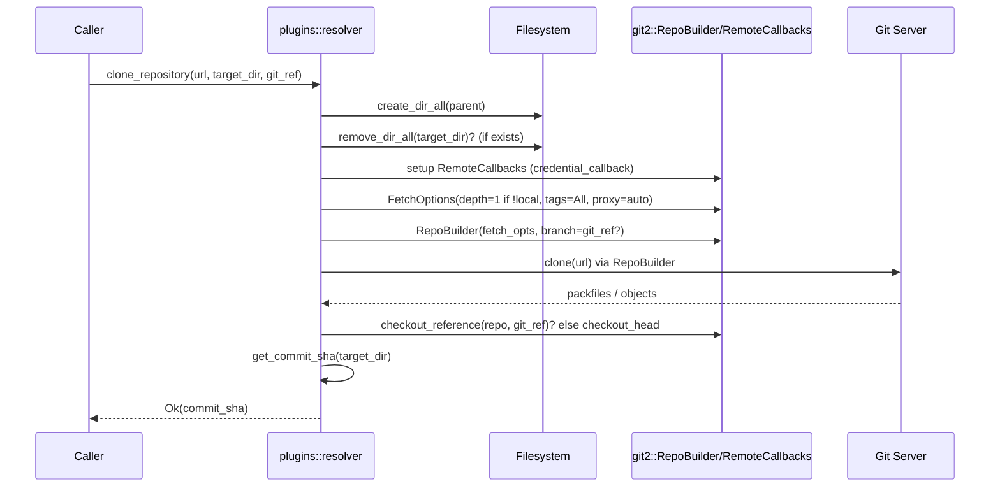

# plugins/resolver.rs Review

## TL;DR

- 目的: Gitリポジトリからプラグインを取得するための操作（クローン、参照解決、検証、サブディレクトリ抽出）を、libgit2（git2 crate）で行うユーティリティ。
- 主要公開API: **clone_repository**, **get_commit_sha**, **resolve_reference**, **validate_repository**, **extract_subdirectory**。
- 複雑箇所: 認証コールバックと浅いクローン設定、参照解決（タグ/ブランチ/コミット）、HEAD設定の妥当性。
- 重大リスク: タグ参照時のHEAD設定不整合・SHA取得の誤り、サブディレクトリ抽出時のパス・トラバーサル、シンボリックリンク未対応、エラー分類の文字列依存。
- 安全性: unsafe未使用。所有権/借用はシンプル。非同期/並行なし。ただしファイル削除/コピーは他プロセスとの競合可能。
- パフォーマンス: ネットワーク/I/Oボトルネック中心。浅いクローン対応だがタグ取得は全取得設定。
- テスト: ネットワーク依存テストは`#[ignore]`。ローカルの抽出テストあり。追加の単体/統合テストを提案。

## Overview & Purpose

このファイルは、プラグインをGitリポジトリから取得・検証・参照解決するためのヘルパー関数群を提供します。libgit2（git2 crate）を用い、浅いクローン（depth=1）、認証（SSHエージェント/デフォルト/ユーザ名・パスワード）、プロキシ自動設定、リモート参照の列挙などを行います。プラグインの実体がリポジトリ内のサブディレクトリにある場合の抽出にも対応します。

期待される利用者は「プラグイン解決器」や「マーケットプレイスからの取得ロジック」です。公開APIは主に以下の用途に対応します。

- clone_repository: 指定リポジトリを浅くクローンし、任意の参照をチェックアウトして、そのコミットSHAを返す。
- get_commit_sha: 既存リポジトリのHEADコミットSHAを取得。
- resolve_reference: クローンせずにリモート参照のOID（意図としてコミットSHA）を取得。
- validate_repository: 接続してURLの妥当性を検証。
- extract_subdirectory: クローン済みリポジトリから特定サブディレクトリを取り出す。

## Structure & Key Components

| 種別 | 名前 | 公開範囲 | 責務 | 複雑度 |
|------|------|----------|------|--------|
| Function | clone_repository | pub | 浅いクローン＋参照チェックアウト＋コミットSHA返却 | Med |
| Function | get_commit_sha | pub | リポジトリのHEADコミットSHA取得 | Low |
| Function | resolve_reference | pub | クローンせずリモート参照のOID取得 | Med |
| Function | validate_repository | pub | リポジトリURLの接続検証 | Low |
| Function | extract_subdirectory | pub | サブディレクトリ内容の抽出コピー | Med |
| Function | credential_callback | private | 認証情報（SSHエージェント/デフォルト/環境変数）提供 | Med |
| Function | checkout_reference | private | 参照（ブランチ/タグ/コミット）のチェックアウト＋HEAD設定 | Med |
| Function | copy_dir_contents | private | ディレクトリの再帰コピー | Med |
| Module | tests | private | ネットワーク/抽出のテスト | Low |

### Dependencies & Interactions

- 内部依存
  - clone_repository → credential_callback（認証）/ checkout_reference（参照適用）/ get_commit_sha（SHA取得）
  - resolve_reference → credential_callback（認証）
  - validate_repository → credential_callback（認証）
  - extract_subdirectory → copy_dir_contents（再帰コピー）
- 外部依存（主要）
  | クレート/モジュール | 用途 |
  |---------------------|------|
  | git2 | リポジトリ操作（クローン、参照、認証、リモート接続、チェックアウト） |
  | std::fs / std::path | ファイル/ディレクトリ操作、パス結合 |
  | std::env | 認証情報の環境変数取得 |
  | tempfile（tests） | 一時ディレクトリ作成 |
- 被依存推定
  - プラグイン管理モジュール（マーケットプレイスからの取得、プラグインのインストール/更新機能）
  - リファレンス解決を事前検証する導線（UI/APIでのバリデーション）

## API Surface (Public/Exported) and Data Contracts

| API名 | シグネチャ | 目的 | Time | Space |
|-------|-----------|------|------|-------|
| clone_repository | fn clone_repository(repo_url: &str, target_dir: &Path, git_ref: Option<&str>) -> PluginResult<String> | 浅いクローン＋参照チェックアウト＋コミットSHA取得 | O(R+F)※ | O(R) |
| get_commit_sha | fn get_commit_sha(repo_dir: &Path) -> PluginResult<String> | HEADコミットSHA取得 | O(1) | O(1) |
| resolve_reference | fn resolve_reference(repo_url: &str, git_ref: &str) -> PluginResult<String> | リモート参照（ブランチ/タグ）のOID取得 | O(M) | O(1) |
| validate_repository | fn validate_repository(repo_url: &str) -> PluginResult<()> | URL接続検証（認証/プロキシ考慮） | O(1)※ | O(1) |
| extract_subdirectory | fn extract_subdirectory(repo_dir: &Path, subdir: &str, target_dir: &Path) -> PluginResult<()> | サブディレクトリの抽出コピー | O(N+B) | O(1) |

※ O(R+F): リポジトリデータ量Rとファイル数Fへの依存。ネットワーク/ディスクI/Oに支配される。
※ validate_repositoryはネットワーク往復（ハンドシェイク）に依存。

---

### clone_repository

1) 目的と責務
- 指定URLからリポジトリをクローン（浅いクローン対応）し、任意の参照（ブランチ/タグ/コミット）をワークツリーに反映、最後にコミットSHAを返す。

2) アルゴリズム（ステップ分解）
- repo_urlがローカルか判定（file://または存在パス）
- target_dir親の作成、既存target_dirの削除
- RemoteCallbacksにcredential_callbackを設定
- FetchOptionsを設定（depth=1の浅いクローン、タグダウンロード、プロキシ自動）
- RepoBuilderを構成し、git_refがあればbranch設定
- clone実行（エラーをPluginError::GitOperationFailedへ変換）
- git_refがあればcheckout_referenceを呼ぶ。なければcheckout_head(None)
- 最後にget_commit_sha(target_dir)でSHAを取得して返す

3) 引数
| 名前 | 型 | 意味 | 制約 |
|------|----|------|------|
| repo_url | &str | GitリポジトリURL（https/ssh/file等） | 空文字不可（git2がエラー） |
| target_dir | &Path | クローン先ディレクトリ | 親ディレクトリ作成可、既存なら削除 |
| git_ref | Option<&str> | チェックアウト対象（ブランチ/タグ/コミット） | Noneの場合はデフォルトブランチ |

4) 戻り値
| 型 | 意味 |
|----|------|
| PluginResult<String> | 成功時はコミットSHA（40桁）。失敗時はPluginError |

5) 使用例
```rust
use std::path::Path;
use plugins::resolver::clone_repository;

fn run() -> Result<(), Box<dyn std::error::Error>> {
    let target = Path::new("/tmp/rustlings");
    let sha = clone_repository(
        "https://github.com/rust-lang/rustlings.git",
        target,
        Some("main"),
    )?;
    println!("Cloned at commit {sha}");
    Ok(())
}
```

6) エッジケース
- repo_urlがローカルパスの場合（浅いクローン深度は適用されない）
- 既存のtarget_dirがあると削除される（データ損失の危険）
- git_refがタグの場合、現在の実装ではHEAD設定が不十分（後述のバグ参照）
- 認証が必要で環境変数が未設定/SSHエージェント未稼働
- プロキシ環境下（ProxyOptions::autoで対応）

---

### get_commit_sha

1) 目的と責務
- 与えられたリポジトリディレクトリのHEAD参照からコミットにpeelして、コミットIDを取得。

2) アルゴリズム
- Repository::open(repo_dir)でリポジトリを開く
- repo.head()でHEAD参照取得
- head.peel_to_commit()でコミットを得る
- commit.id().to_string()を返す

3) 引数
| 名前 | 型 | 意味 |
|------|----|------|
| repo_dir | &Path | リポジトリのディレクトリ（.git含む） |

4) 戻り値
| 型 | 意味 |
|----|------|
| PluginResult<String> | HEADコミットのSHA |

5) 使用例
```rust
use std::path::Path;
use plugins::resolver::get_commit_sha;

let sha = get_commit_sha(Path::new("/tmp/rustlings"))?;
assert_eq!(sha.len(), 40);
```

6) エッジケース
- HEADが存在しない/壊れている場合（GitOperationFailedに変換）
- リポジトリが開けないパス（権限/存在しない）

---

### resolve_reference

1) 目的と責務
- クローンを行わずにリモートの参照一覧を取得し、指定の参照（完全名または短縮名）に一致するOIDを返す。

2) アルゴリズム
- RemoteCallbacksにcredential_callback設定
- git2::Remote::create_detached(repo_url)で一時リモート作成
- remote.connect_auth(Direction::Fetch, Some(callbacks), None)
- remote.list()でリモート参照列挙
- 参照名がgit_ref、refs/heads/git_ref、refs/tags/git_refのいずれかに一致するものを探す
- 該当があればremote_ref.oid().to_string()を返す。なければInvalidReference

3) 引数
| 名前 | 型 | 意味 |
|------|----|------|
| repo_url | &str | リポジトリURL |
| git_ref | &str | 参照名（ブランチ/タグ/完全参照名） |

4) 戻り値
| 型 | 意味 |
|----|------|
| PluginResult<String> | 参照のOID文字列 |

5) 使用例
```rust
use plugins::resolver::resolve_reference;

let sha_or_oid = resolve_reference(
    "https://github.com/rust-lang/rust.git",
    "1.0.0"
)?;
// 注意: タグの場合、注釈付きタグだとタグオブジェクトOIDの可能性あり（後述）
```

6) エッジケース
- タグが注釈付きの場合、返るOIDがコミットではなくタグオブジェクトの可能性（このチャンクの実装ではコミットにpeelしない）
- リモート接続失敗（認証/ネットワーク/プロキシ）
- git_refが完全参照名（refs/...）/短縮名（branch名、tag名）の両対応

---

### validate_repository

1) 目的と責務
- リポジトリURLが到達可能か、認証・プロキシを考慮しつつ接続検証。

2) アルゴリズム
- RemoteCallbacksにcredential_callback設定
- Remote::create_detached(repo_url)で作成
- connect_auth(Direction::Fetch, Some(callbacks), None)を試みる
- 例外メッセージに"not found"または"does not exist"が含まれる場合はPluginError::MarketplaceNotFound、それ以外はGitOperationFailed
- 成功したらdisconnectしてOk(())

3) 引数
| 名前 | 型 | 意味 |
|------|----|------|
| repo_url | &str | リポジトリURL |

4) 戻り値
| 型 | 意味 |
|----|------|
| PluginResult<()> | 成功/失敗 |

5) 使用例
```rust
use plugins::resolver::validate_repository;

validate_repository("https://github.com/rust-lang/rust.git")?;
```

6) エッジケース
- URL形式が不正（create_detachedが失敗）
- エラー分類が文字列一致に依存（国際化やメッセージ変更に弱い）

---

### extract_subdirectory

1) 目的と責務
- クローン済みリポジトリから指定サブディレクトリをtarget_dirへコピー。

2) アルゴリズム
- source_dir = repo_dir.join(subdir)
- source_dirが存在しなければPluginNotFound
- target_dirを作成
- copy_dir_contents(source_dir, target_dir)を再帰実行

3) 引数
| 名前 | 型 | 意味 |
|------|----|------|
| repo_dir | &Path | リポジトリのルートディレクトリ |
| subdir | &str | 抽出するサブディレクトリ相対パス | 
| target_dir | &Path | 抽出先ディレクトリ |

4) 戻り値
| 型 | 意味 |
|----|------|
| PluginResult<()> | 成功/失敗 |

5) 使用例
```rust
use std::path::Path;
use plugins::resolver::extract_subdirectory;

// repo_dir/subdir の内容が target_dir にコピーされる
extract_subdirectory(
    Path::new("/tmp/repo"),
    "plugins/my_plugin",
    Path::new("/tmp/selected_plugin")
)?;
```

6) エッジケース
- subdirが"../"を含むなどのパス・トラバーサル（現実装は未防御）
- シンボリックリンクが含まれる場合の扱い（未対応、コピーされない可能性）
- 大量ファイル/深い階層でのパフォーマンス

## Walkthrough & Data Flow

- clone_repository の主要フローと外部アクターの相互作用を示します。



上記の図は`clone_repository`関数の主要分岐を示す（行番号はこのチャンクに明示されていないため不明）。

- resolve_reference は「接続→参照一覧取得→一致探索→OID返却」と直線的です。
- validate_repository は「接続試行→成功ならOk、失敗時にエラー分類」。
- extract_subdirectory は「存在チェック→作成→再帰コピー」。copy_dir_contents はディレクトリ/ファイルで分岐し再帰的に処理します。

## Complexity & Performance

- clone_repository: 時間O(R+F)、空間O(R)。R=取得オブジェクトサイズ、F=ファイル数。ネットワーク帯域/レイテンシ、ディスクI/Oがボトルネック。浅いクローン（depth=1）により履歴転送量を抑制。ただし**AutotagOption::All**がタグのダウンロードを促進し、場合によっては過剰取得。
- get_commit_sha: O(1)。軽量。ただし巨大リポジトリでもHEAD参照とコミットpeelのみ。
- resolve_reference: O(M)。M=リモート参照数（ブランチ+タグ）。大規模リポジトリでは参照一覧の取得と探索がコスト。
- validate_repository: ネットワーク1往復程度。O(1)だがネットワーク環境により時間が増大。
- extract_subdirectory: O(N+B)。N=ファイル数、B=合計バイト数。ファイルシステムI/Oが支配。シンボリックリンク非対応のため一部スキップ/失敗の可能性。

スケール限界:
- 巨大なタグ数/ブランチ数のリポジトリではresolve_referenceが遅延。
- 多数の小ファイルのディレクトリコピーはメタデータ操作が多くオーバーヘッド。

実運用負荷要因:
- 認証（SSHエージェント、HTTP Basic）、プロキシ設定の有無。
- ネットワーク断・DNS遅延。
- ディスクの書き込み性能。

## Edge Cases, Bugs, and Security

### バグ/設計上の懸念

- タグ参照のHEAD設定不整合
  - 現在の`checkout_reference`は`obj.as_commit().is_some()`の場合のみHEADを設定。タグ（注釈付き）では`as_commit()`が`None`のためHEADが更新されない可能性。
  - 結果として`clone_repository`でタグを指定しても、`get_commit_sha`が元のブランチのコミットを返す恐れ。
  - 改善: `obj.peel_to_commit()`を用い、常にコミットを得て`set_head_detached(commit_id)`を実行。

- ブランチ探索の引数
  - `repo.find_branch(reference, git2::BranchType::Local)`に`"refs/heads/..."`やタグ名が渡ると失敗。ここは「ブランチ名（例: main）」のみ受け付けるため、引数の正規化が必要。

- resolve_referenceのタグOID
  - 注釈付きタグではタグオブジェクトのOIDが返る場合があり、意図する「コミットSHA」と異なる可能性。
  - 真のコミットにpeelするにはオブジェクト取得が必要だが、クローンなしでの完全なpeelは困難。設計上の妥協点を明示すべき。

- パス・トラバーサル
  - `extract_subdirectory`は`repo_dir.join(subdir)`をそのまま使うため、`subdir = "../.."`のような指定でリポジトリ外を指せる可能性。
  - 改善: `canonicalize`して`repo_dir`配下であることを検証。

- シンボリックリンク未対応
  - `copy_dir_contents`は`is_dir`/`is_file`のみで分岐。シンボリックリンクは未処理。リンクの扱い（コピーする/しない/安全に解決する）を方針化する必要。

- データ損失の可能性
  - `clone_repository`で既存`target_dir`を無条件削除。競合プロセス/誤指定でのデータ消失リスク。
  - 改善: 空であることの確認、アトミックな一時ディレクトリクローン→移動、ユーザー同意。

- エラー分類の脆弱性
  - `validate_repository`でエラーメッセージ文字列に依存した分類（"not found"/"does not exist"）。ローカライズやライブラリ更新で壊れる可能性。
  - 改善: `e.code()`/`e.class()`の組み合わせによる判定。

### セキュリティチェックリスト

- メモリ安全性
  - Buffer overflow / Use-after-free / Integer overflow: Rust安全機構とgit2の安全ラッパーにより、現実装にunsafeはなし（unsafe使用箇所: 不明＝このチャンクには現れない）。
- インジェクション
  - SQL/Command/Path traversal: Path traversalの可能性あり（extract_subdirectory）。Command/SQLは該当なし。
- 認証・認可
  - 認証: SSHエージェント→デフォルト→環境変数の順。認可はGitサーバ側に依存。
  - セッション固定: 該当なし。
- 秘密情報
  - Hard-coded secrets: なし。
  - Log leakage: 明示的なログなし。エラーにURLは含めるが、ユーザ名/パスワードは含めない。
- 並行性
  - Race condition: ファイル削除/コピーは他プロセスとの競合可能。並行アクセスを想定しない設計。
  - Deadlock: 該当なし。

### エッジケース詳細

| エッジケース | 入力例 | 期待動作 | 実装 | 状態 |
|-------------|--------|----------|------|------|
| 無効URL | "not-a-url" | Err(GitOperationFailed) | validate_repositoryでcreate_detachedがErr | OK |
| 非存在リポジトリ | "https://github.com/nonexistent/repo.git" | Err(MarketplaceNotFound)相当 | validate_repositoryで文字列判定 | 要改善（文字列依存） |
| タグ参照のチェックアウト | git_ref="v1.0.0" | HEADがタグのコミットにdetached | checkout_referenceでas_commit()がNoneで未設定 | バグ |
| ブランチ名 vs 完全参照名 | git_ref="refs/heads/main" | mainブランチにHEAD設定 | find_branchに完全名渡すと失敗 | 要改善 |
| サブディレクトリ不存在 | subdir="nonexistent" | Err(PluginNotFound) | extract_subdirectoryで存在確認 | OK |
| パス・トラバーサル | subdir="../etc" | Err or 防止 | 何も防止せずjoinで外部可能 | 要改善 |
| シンボリックリンク | subdir内にsymlink | 定義した方針で扱う | is_dir/is_fileのみで未対応 | 要改善 |
| 既存ディレクトリ削除 | target_dirが既存 | 安全確認の上削除 | 無条件削除 | 要改善 |
| 認証未設定 | 環境変数/agentなし | 適切にErr | credential_callbackでErr | OK |

（行番号はこのチャンクに明示されていないため不明）

## Design & Architecture Suggestions

- 参照解決/チェックアウトの一貫性
  - **checkout_reference**で`revparse_single`後に必ず`peel_to_commit`を実施し、`set_head_detached(commit_id)`を設定。ブランチの場合のみ`set_head("refs/heads/{branch}")`。
  - `find_branch`には短縮名（例: "main"）を渡す。`git_ref`が完全参照名なら短縮名に正規化。

- resolve_referenceの改善
  - タグの場合にコミットへpeelしたSHAを返すと明示（ただしクローンなしでは制約あり）。設計として「タグはタグオブジェクトOIDを返す」か「タグは未サポート」と仕様を明確化。

- 安全なパス処理
  - `extract_subdirectory`で`canonicalize`、`starts_with(repo_dir)`チェックによりトラバーサル防止。
  - シンボリックリンクの扱いポリシー（コピーしない/解決してファイルコピー/エラー）を決定し実装。

- エラー分類の強化
  - `validate_repository`は`git2::Error`の`code()`/`class()`に基づいて判定、メッセージ文字列依存を排除。

- データ消失対策
  - クローンは一時ディレクトリに実施後、成否で`rename`アトミック置換。
  - 既存ディレクトリに重要ファイルがある場合は拒否/確認オプション。

- 設定オブジェクトの導入
  - 認証情報、プロキシ、浅いクローンの深度、タグ取得方針をまとめた**ResolverConfig**を導入。

## Testing Strategy (Unit/Integration) with Examples

既存テスト
- validate_repository/resolve_reference/clone_repositoryはネットワーク依存で`#[ignore]`。
- extract_subdirectoryのローカルテストは良好。

追加提案
- ローカルリポジトリでの浅いクローン/参照チェックアウト（ネットワーク不要）。
- タグ参照時のHEAD設定検証（改善後）。
- パス・トラバーサル防止テスト。
- シンボリックリンクを含むディレクトリコピーの方針テスト。
- 認証環境変数の有無、SSHエージェント不在時の挙動。
- プロキシ環境下でのconnect_auth動作（可能ならモック/エミュレーション）。

例: タグのpeel検証（改善後のcheckout_reference前提）
```rust
#[test]
fn test_checkout_tag_sets_detached_head() {
    use tempfile::tempdir;
    let tmp = tempdir().unwrap();
    let repo_dir = tmp.path().join("repo");
    let sha = clone_repository(
        "https://github.com/rust-lang/rustlings.git",
        &repo_dir,
        Some("v4.5.0"),
    ).unwrap();
    // HEADはタグが指すコミットのはず
    let head_sha = get_commit_sha(&repo_dir).unwrap();
    assert_eq!(sha, head_sha);
}
```

例: パス・トラバーサル防止（改善後）
```rust
#[test]
fn test_extract_subdirectory_prevents_traversal() {
    use tempfile::tempdir;
    let tmp = tempdir().unwrap();
    let repo_dir = tmp.path().join("repo");
    std::fs::create_dir_all(repo_dir.join("safe")).unwrap();
    std::fs::write(repo_dir.join("safe/file.txt"), "x").unwrap();

    let target = tmp.path().join("out");
    // "../" は拒否される仕様に（改善後）
    let result = extract_subdirectory(&repo_dir, "../", &target);
    assert!(result.is_err());
}
```

例: ローカルリポジトリのクローン
```rust
#[test]
fn test_clone_local_repo() {
    use tempfile::tempdir;
    use git2::Repository;
    let tmp = tempdir().unwrap();
    let src = tmp.path().join("src");
    let dst = tmp.path().join("dst");
    let repo = Repository::init(&src).unwrap();
    std::fs::write(src.join("README.md"), "hello").unwrap();
    let mut idx = repo.index().unwrap();
    idx.add_path(std::path::Path::new("README.md")).unwrap();
    idx.write().unwrap();
    let oid = {
        let tree_id = idx.write_tree().unwrap();
        let tree = repo.find_tree(tree_id).unwrap();
        let sig = git2::Signature::now("a", "a@example.com").unwrap();
        repo.commit(Some("HEAD"), &sig, &sig, "init", &tree, &[]).unwrap()
    };
    let sha = clone_repository(src.to_str().unwrap(), &dst, None).unwrap();
    assert_eq!(sha, oid.to_string());
}
```

## Refactoring Plan & Best Practices

- checkout_referenceの修正
  - `revparse_single`後に`peel_to_commit()`でコミットへ。ブランチ名正規化（`refs/heads/`除去）。
  - ブランチなら`set_head("refs/heads/{branch}")`、それ以外は`set_head_detached(commit_id)`。

- resolve_referenceの仕様明確化
  - タグは「タグオブジェクトOID」を返すと明示、または「コミットSHA取得はサポート外」とドキュメント化。代替として軽量クローン→`peel_to_commit`の2段階を用意。

- extract_subdirectoryの安全化
  - `canonicalize`と`starts_with(repo_dir)`による検証。
  - シンボリックリンクの扱い方針を決め実装（例: リンクはコピーせずエラー）。

- エラー型の拡充
  - `PluginError`に`InvalidUrl`、`NotFound`、`AuthFailed`などを追加してメッセージ依存を削減。
  - `thiserror`の導入とエラーメッセージの一貫性。

- I/Oの安全性向上
  - 一時ディレクトリでクローン→成功時に`rename`でアトミック置換。
  - `copy_dir_contents`は`walkdir`の利用と、失敗時の詳細なコンテキスト付与。

- コンフィグ導入
  - `ResolverConfig { depth, download_tags, proxy, allow_symlinks, remove_existing }`などの設定で挙動制御。

- ドキュメント/契約
  - タグ/ブランチ/コミットの取り扱いと返却値（コミットSHA vs OID）を明記。

## Observability (Logging, Metrics, Tracing)

- ログ
  - クローン開始/終了、参照チェックアウト、認証方式選択（SSH/Default/UserPass）、エラー発生時の操作名とエラーコード/クラス。
- メトリクス
  - クローン時間、参照解決時間、コピー対象ファイル数/バイト数、失敗率、認証方式成功統計。
- トレーシング
  - `tracing`クレートでスパンを設定（"clone_repository", "resolve_reference", "extract_subdirectory"）。
- 導入例
```rust
use tracing::{info, warn, error, instrument};

#[instrument(skip(repo_url, target_dir, git_ref), fields(url = %repo_url, dir = ?target_dir))]
pub fn clone_repository(...) -> PluginResult<String> {
    info!("Starting clone");
    // ...
    info!("Checkout reference: {:?}", git_ref);
    // ...
    info!("Finished clone");
    // ...
}
```

## Risks & Unknowns

- PluginError/PluginResultの詳細: バリアントやメッセージ規約はこのチャンクでは不明。
- git2の挙動差: 注釈付きタグのOID、`revparse_single`の解釈差、`find_branch`の期待引数。
- プロキシ環境・企業ネットワークでの`connect_auth`の動作（証明書検証・NTLM等）は外部環境依存。
- シンボリックリンク/特殊ファイル（FIFO/デバイス）の扱い方針が未定。
- Windows/Unixでのパス・ファイル属性の違いによる挙動差。
- リポジトリサイズ/参照数が非常に大きい場合の性能劣化。