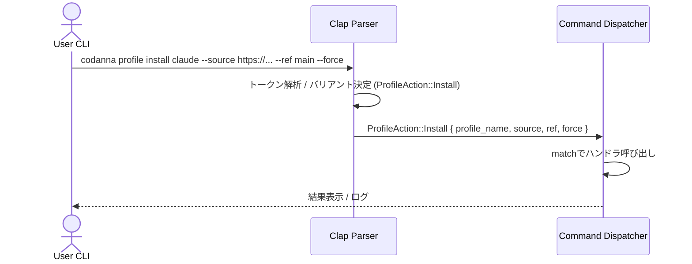

# profiles\commands.rs Review

## TL;DR

- 目的: CLIの「profile」関連サブコマンドを定義し、clapの`derive(Parser)`で引数から型安全なコマンド列挙体へパースする
- 主要公開API: `pub enum ProfileAction` と `pub enum ProviderAction`（いずれも`Parser`導出により`parse/try_parse`系メソッドが利用可能）
- 複雑箇所: `ProfileAction::Provider { action: ProviderAction }` のネストされたサブコマンド階層（clapの`#[command(subcommand)]`による入れ子構造）
- 重大リスク: 実処理は別モジュールだが、入力値（パス/URL/ID）により後工程でパストラバーサルやコマンドインジェクションのリスクにつながる可能性
- エラー挙動: `Verify`で`conflicts_with = "profile_name"`が設定されており、`--all`と`profile_name`の同時指定時にclapがエラーを返す
- 並行性/unsafe: 本ファイルはデータ定義のみで`unsafe`なし、非同期/共有状態もなし。メモリ安全性は列挙体と所有`String/PathBuf`中心で安全

## Overview & Purpose

このファイルは、プロファイル管理に関するCLIサブコマンド群をRustの列挙体として定義し、`clap::Parser`の導出により、コマンドライン引数から`ProfileAction`または`ProviderAction`へ直接パース可能にすることを目的としています。  
「インストール」「初期化」「更新」「削除」などの操作、ならびにプロバイダの追加/削除/一覧などを一貫したAPIで表現します。

対象読者はプロジェクト全体を知らない前提でも理解できるよう、各バリアントの責務とフィールドを説明します。実際の処理（ファイル操作、Git操作など）はこのチャンクには含まれず、コマンド判別・引数受け取りまでが本ファイルの責務です。

## Structure & Key Components

| 種別 | 名前 | 公開範囲 | 責務 | 複雑度 |
|------|------|----------|------|--------|
| Enum | ProfileAction | pub | プロファイル関連サブコマンドのトップレベル集合を定義（init/install/list/status/sync/update/remove/provider/verify） | Med |
| Enum | ProviderAction | pub | プロバイダ管理のサブコマンド集合を定義（add/remove/list） | Low |

### Dependencies & Interactions

- 内部依存
  - `ProfileAction::Provider { action: ProviderAction }`により、プロファイル系のコマンド内にプロバイダ管理のサブコマンドをネスト
- 外部依存（クレート/モジュール）
  | 依存 | 用途 | 影響 |
  |------|------|------|
  | clap::Parser | CLI引数の自動パース（`derive`で`parse/try_parse`系メソッドが利用可能） | 実行時に引数解析を行い、構造体/列挙体へ安全にマッピング |
  | std::path::PathBuf | ファイルパスの受け取り（`Init`の`source`オプション） | OS依存のパス表現を所有型で保持 |
- 被依存推定
  - ルートCLI（このチャンクには現れない）から「profile」サブコマンドへ委譲され、さらに`ProfileAction`で分岐して各ハンドラへ渡される
  - コマンドハンドラ群（このチャンクには現れない）が`match`で`ProfileAction`/`ProviderAction`を受け、実処理を行う

## API Surface (Public/Exported) and Data Contracts

| API名 | シグネチャ | 目的 | Time | Space |
|-------|-----------|------|------|-------|
| ProfileAction（Parser派生） | fn parse() -> ProfileAction | 環境の引数から`ProfileAction`を生成 | O(n_args) | O(n_args) |
| ProfileAction（Parser派生） | fn parse_from<I,T>(itr: I) -> ProfileAction where I: IntoIterator<Item=T>, T: Into<OsString> | 任意の引数列からパース（panic on error） | O(n_args) | O(n_args) |
| ProfileAction（Parser派生） | fn try_parse() -> Result<ProfileAction, clap::Error> | 環境引数を検証付きでパース | O(n_args) | O(n_args) |
| ProfileAction（Parser派生） | fn try_parse_from<I,T>(itr: I) -> Result<ProfileAction, clap::Error> where I: IntoIterator<Item=T>, T: Into<OsString> | 任意引数列から検証付きでパース | O(n_args) | O(n_args) |
| ProviderAction（Parser派生） | 上記4種に同じ | プロバイダサブコマンドの直接パース（入れ子で使う場合は`ProfileAction`経由が一般的） | O(n_args) | O(n_args) |

各APIの詳細（構造化）

1) ProfileAction
- 目的と責務
  - プロファイル管理サブコマンドを列挙体にまとめ、clapで引数から型安全に生成
- アルゴリズム（clapによる自動生成）
  - 引数列をトークン化
  - バリアント名（例: `init`, `install`など）に一致するか判定
  - 一致したバリアントのフィールドへオプション/引数をマッピング
  - 必要な検証（`conflicts_with`など）を実行
- 引数（バリアント別）
  | バリアント | フィールド | 型 | 必須 | 説明 |
  |-----------|-----------|----|------|------|
  | Init | profile_name | String | Yes | 初期化するプロファイル名 |
  | Init | source | Option<PathBuf> | No | プロファイルソースディレクトリ（既定: ~/.codanna/profilesと説明ありだが、コード上はdefault値未設定） |
  | Init | force | bool | No | `.codanna`があっても強制初期化 |
  | Install | profile_name | String | Yes | インストール対象のプロファイル |
  | Install | source | Option<String> | No | Git URLまたはローカルディレクトリ |
  | Install | r#ref | Option<String> | No | Git参照（branch/tag/commit） |
  | Install | force | bool | No | 既存でも強制インストール |
  | List | verbose | bool | No | 詳細表示 |
  | List | json | bool | No | JSON出力 |
  | Status | verbose | bool | No | 詳細なファイル追跡情報 |
  | Sync | force | bool | No | 既存/競合があっても強制 |
  | Update | profile_name | String | Yes | 更新対象プロファイル |
  | Update | force | bool | No | 最新でも強制更新 |
  | Remove | profile_name | String | Yes | 削除対象プロファイル |
  | Remove | verbose | bool | No | 詳細な削除情報 |
  | Provider | action | ProviderAction | Yes | プロバイダ管理サブコマンド（入れ子） |
  | Verify | profile_name | Option<String> | No | 検証対象（`--all`指定時は省略） |
  | Verify | all | bool | No | すべてのプロファイルを検証（`conflicts_with = "profile_name"`） |
  | Verify | verbose | bool | No | 詳細検証情報 |
- 戻り値
  | メソッド | 戻り値 |
  |---------|--------|
  | parse/parse_from | ProfileAction（エラー時はpanic: clapの標準仕様） |
  | try_parse/try_parse_from | Result<ProfileAction, clap::Error> |
- 使用例
  ```rust
  use clap::Parser;
  use profiles::commands::ProfileAction;

  fn main() {
      // ルートCLIが別にある場合、その「profile」サブコマンドのコンテキストで使うのが一般的。
      // 単体で試す場合は`["init", "claude", "--force"]`のようにサブコマンド部分のみを与える。
      let action = ProfileAction::try_parse_from(["init", "claude", "--force"])
          .expect("parse error");

      match action {
          ProfileAction::Init { profile_name, source, force } => {
              // 実処理は別モジュール（このチャンクには現れない）
              println!("init {profile_name}, source={source:?}, force={force}");
          }
          _ => {}
      }
  }
  ```
- エッジケース
  - `Verify`で`--all`と`profile_name`を同時指定するとclapがエラー（`conflicts_with`属性の効果）
  - `Init`の`source`は説明上デフォルトが示唆されているが、コード上は`Option<PathBuf>`で`default_value`未設定（呼び出し側で補完が必要）

2) ProviderAction
- 目的と責務
  - グローバルレジストリのプロバイダ管理（追加/削除/一覧）を列挙体として定義
- アルゴリズム
  - clapにより`add/remove/list`いずれかへ引数をマッピング
- 引数
  | バリアント | フィールド | 型 | 必須 | 説明 |
  |-----------|-----------|----|------|------|
  | Add | source | String | Yes | GitHub短縮表記/git URL/ローカルパス |
  | Add | id | Option<String> | No | 明示的ID（未指定時はsourceから導出想定） |
  | Remove | provider_id | String | Yes | 削除するプロバイダID |
  | List | verbose | bool | No | 追加情報（利用可能プロファイル一覧など） |
- 戻り値
  | メソッド | 戻り値 |
  |---------|--------|
  | parse/parse_from | ProviderAction |
  | try_parse/try_parse_from | Result<ProviderAction, clap::Error> |
- 使用例
  ```rust
  use clap::Parser;
  use profiles::commands::ProviderAction;

  fn main() {
      let action = ProviderAction::try_parse_from(["add", "codanna/claude-provider", "--id", "custom"])
          .expect("parse error");

      match action {
          ProviderAction::Add { source, id } => {
              println!("add provider source={source}, id={id:?}");
          }
          _ => {}
      }
  }
  ```
- エッジケース
  - `Add`の`id`省略時、ID導出ロジックはこのチャンクには現れない（不明）

## Walkthrough & Data Flow

- 入力（CLI引数）をclapが解析し、対応する`ProfileAction`/`ProviderAction`バリアントへマッピング
- `ProfileAction::Provider`は`ProviderAction`をサブコマンドとして受け取る入れ子構造
- この後、アプリ側で`match`によりバリアントごとのハンドラを呼び分ける（このチャンクには現れない）

Mermaidシーケンス図（アクター3以上、入れ子サブコマンドの流れを示す）



上記の図は`ProfileAction`列挙体定義の主要な流れ（このファイル全体の列挙体定義に該当、正確な行番号はこのチャンクのメタとは不一致のため不明）を示します。

## Complexity & Performance

- 解析コストはclapの引数数に線形依存
  - 時間計算量: O(n_args)
  - 空間計算量: O(n_args)（`String`/`PathBuf`などの所有データを保持）
- ボトルネック
  - 本ファイル自体は定義のみ。実処理（Git操作、ファイルI/O、ネットワーク）は他モジュール側に依存
- スケール限界
  - サブコマンドやオプションが増えても、clapの内部は効率的だが、巨大な`after_help`などはヘルプ生成時の出力が長くなる程度

## Edge Cases, Bugs, and Security

セキュリティチェックリスト観点で評価（このチャンクは定義のみのため、潜在リスクを列挙）

- メモリ安全性
  - Buffer overflow / Use-after-free / Integer overflow: 該当なし（所有`String`/`PathBuf`とブール/Optionのみ）
- インジェクション
  - SQL/Command/Path traversal: このチャンクには現れないが、`Install.source`/`Init.source`/`ProviderAction::Add.source`は後続処理で外部入力として扱われるため、バリデーション欠如があると脆弱性に繋がる可能性
- 認証・認可
  - 権限チェック漏れ / セッション固定: CLIレベルでは該当なし
- 秘密情報
  - Hard-coded secrets: 該当なし
  - Log leakage: `verbose`フラグで詳細出力が増える想定。後続モジュールで機密情報のログ出力に注意が必要
- 並行性
  - Race condition / Deadlock: 該当なし（並行処理はこのチャンクには現れない）

エッジケース詳細（このチャンクで確定できる仕様）

| エッジケース | 入力例 | 期待動作 | 実装 | 状態 |
|-------------|--------|----------|------|------|
| Verifyで`--all`と`profile_name`併用 | `verify foo --all` | clapが競合エラーを返す | `#[arg(long, conflicts_with = "profile_name")]` | 対応済 |
| Initのsource未指定 | `init claude` | 呼び出し側がデフォルト（~/.codanna/profiles）を補完 | `Option<PathBuf>`（default未設定） | 要呼び出し側対応 |
| Provider addのid未指定 | `provider add codanna/claude-provider` | sourceからID導出（仕様はこのチャンクには現れない） | `Option<String>` | 不明 |
| Installのref未指定 | `install claude --source https://...` | デフォルトref（例: ブランチ指定なし）扱い | `Option<String>` | 呼び出し側仕様 |

根拠（コード要素:このファイル内）
- ProfileAction::Verifyの競合設定: `conflicts_with = "profile_name"`（本チャンク内に明示）
- Providerネスト: `ProfileAction::Provider { action: ProviderAction }`かつ`#[command(subcommand)]`（本チャンク内に明示）

## Design & Architecture Suggestions

- デフォルト値の明示
  - `Init.source`: 説明に既定パスがあるが、`default_value_os`で明示する方がユーザーフレンドリー
- サブコマンドの責務分離
  - 実行ハンドラは別モジュールへ分離し、`ProfileAction`/`ProviderAction`に対する`From`/`TryFrom`で設定オブジェクトへ移すと依存が明確になる
- 入力バリデーション
  - `Install.source`や`ProviderAction::Add.source`に対し、URL/パス形式検証を導入（clapの`value_parser`や`validator`）
- ユーザビリティ
  - `--quiet`や`--no-confirm`など共通フラグの導入を検討
- 国際化
  - `about`/`after_help`のローカライズ対応（このチャンクでは英語固定）

## Testing Strategy (Unit/Integration) with Examples

- 単体テスト（clapパース）
  - 正常系: 各バリアントが想定通りに生成される
  - 異常系: `Verify`の競合、未知オプション、必須引数不足

```rust
#[cfg(test)]
mod tests {
    use clap::Parser;
    use super::{ProfileAction, ProviderAction};

    #[test]
    fn parse_init_minimal() {
        let a = ProfileAction::try_parse_from(["init", "claude"]).unwrap();
        if let ProfileAction::Init { profile_name, source, force } = a {
            assert_eq!(profile_name, "claude");
            assert!(source.is_none());
            assert!(!force);
        } else {
            panic!("unexpected variant");
        }
    }

    #[test]
    fn parse_verify_conflict_all_and_name() {
        let err = ProfileAction::try_parse_from(["verify", "foo", "--all"]).unwrap_err();
        // clap::Errorのkindやメッセージの確認（正確な文字列はclapバージョン依存）
        assert!(err.kind().is_invalid_value()); // 例：実際にはInvalidValue/ArgumentConflictなど
    }

    #[test]
    fn parse_provider_add_with_id() {
        let p = ProviderAction::try_parse_from(["add", "codanna/claude-provider", "--id", "custom"]).unwrap();
        match p {
            ProviderAction::Add { source, id } => {
                assert_eq!(source, "codanna/claude-provider");
                assert_eq!(id.as_deref(), Some("custom"));
            }
            _ => panic!("unexpected variant"),
        }
    }

    #[test]
    fn parse_install_with_ref_and_force() {
        let a = ProfileAction::try_parse_from([
            "install", "claude", "--source", "https://github.com/codanna/profiles.git", "--ref", "main", "--force"
        ]).unwrap();
        match a {
            ProfileAction::Install { profile_name, source, r#ref, force } => {
                assert_eq!(profile_name, "claude");
                assert_eq!(source.as_deref(), Some("https://github.com/codanna/profiles.git"));
                assert_eq!(r#ref.as_deref(), Some("main"));
                assert!(force);
            }
            _ => panic!("unexpected variant"),
        }
    }
}
```

- 統合テスト（このチャンクには現れないルートCLIと組み合わせ）
  - `codanna profile ...`全体の引数列で`RootCli`→`ProfileAction`に正しく委譲されることを確認

## Complexity & Performance

- Big-O
  - パース時間: O(n_args)
  - メモリ: O(n_args)（所有`String`/`PathBuf`の確保）
- 実運用負荷
  - この定義は軽量。実処理はI/O/ネットワーク/DB/Git操作に依存し、そちらがボトルネックになる
- スケール
  - サブコマンド数・オプション数の増加に伴いヘルプ生成はやや重くなるが、通常問題ない

## Refactoring Plan & Best Practices

- `Init.source`に`default_value_os`を設定してドキュメントとの整合性を取る
- 共通フラグ（`--verbose`, `--json`など）をtrait/構造体に集約し、各コマンドに`#[command(flatten)]`で再利用
- `value_parser`や明示的`validator`でURL/パス整合性チェックを追加
- `ProfileAction`をマッチした後に構成体（Config/Options）へ`From`で変換し、ハンドラへ渡すことでテスト容易性と責務分離を改善
- ヘルプ文の改良（具体例を最新化、失敗時の典型的エラーと対処法）

## Observability (Logging, Metrics, Tracing)

- ロギング
  - ハンドラ側で`--verbose`に応じて詳細ログを出力（このチャンクにはロギング処理はない）
- メトリクス
  - コマンド実行回数、失敗率、所要時間などを計測し、CLI利用状況を把握
- トレーシング
  - 実処理部分で`tracing`クレートを用い、各サブコマンドごとにスパンを張ると診断に有効

## Risks & Unknowns

- ルートCLI構造や各ハンドラの実装はこのチャンクには現れないため、引数のバリデーション/デフォルト補完の最終責務がどこにあるかは不明
- `ProviderAction::Add`のID導出規則は不明（sourceからどのようにIDを決定するか、このチャンクには記載なし）
- `Init.source`のデフォルト（~/.codanna/profiles）は説明のみで、コード上は未設定。実際の挙動が呼び出し側に依存する点は要確認

【Rust特有の観点】

- メモリ安全性
  - 所有権: `String`/`PathBuf`は所有で保持。値は`parse`時に新規生成/所有され、ハンドラへ`move`するのが一般的（このチャンクにはハンドラは現れない）
  - 借用・ライフタイム: フィールドはすべて所有型で、明示的ライフタイム不要
- unsafe境界
  - 使用箇所: なし
  - 保証すべき条件/安全性根拠: clapの`derive`は安全なコード生成により、未初期化アクセス等は発生しない
- 並行性・非同期
  - Send/Sync: 列挙体は`String`/`PathBuf`/`bool`/`Option`のみで構成され、一般に`Send`/`Sync`可能（カスタム非`Send`型は含まれない）
  - データ競合: 共有状態なし
  - await境界/キャンセル: 該当なし
- エラー設計
  - `Result` vs `Option`: 引数の存在は`Option`で表現（存在しない場合は`None`）。解析エラーはclapの`Result<_, clap::Error>`で表現
  - panic箇所: `parse/parse_from`は失敗時panicする仕様。ライブラリ/テストでは`try_parse`系の利用を推奨
  - エラー変換: `clap::Error`は標準のエラー出力に対応。アプリ側でユーザーフレンドリーなメッセージへ変換可能（このチャンクには現れない）