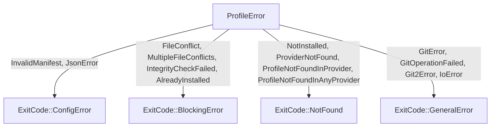

# error.rs Review

## TL;DR

- 公開APIは主に、エラー型のenum **ProfileError**、型エイリアス **ProfileResult<T>**、およびエラーからCLI終了コードへ写像する **ProfileError::exit_code(&self) -> ExitCode**。
- コアロジックは、thiserrorを用いたユーザ向けエラーメッセージ整形と、複数ファイル競合の整形関数、エラー種別からExitCodeへの安定したマッピング。
- 複雑度は全体的に低いが、複数競合整形関数は件数に比例してO(n)のコストがかかる。
- Rust安全性: unsafeなし、所有権/借用は単純でメモリ安全。送受信（Send/Sync）性は含有型に依存するが、一般的な使用では問題になりにくい。
- 重要なリスク: 非UTF-8パスをStringへ詰める必要がある設計（PathBuf不採用）/ "unknown"というセンチネル値への依存 / Git系エラーの重複表現により原因チェーンが失われやすい。
- 改善提案: Gitエラー統合（source連鎖）、PathBuf採用またはエンコード安全な表現、#[non_exhaustive]付与、エラー分類の安定ID化、観測性（メトリクス/ログ）強化。

## Overview & Purpose

このファイルはプロファイルシステムにおけるドメインエラーの集約点であり、操作（インストール、整合性検証、プロバイダ参照、Git/IO/JSON処理など）で発生しうる失敗を、開発者とCLIユーザー双方に分かりやすく提示することを目的としています。

- thiserrorにより、各バリアントは人間可読なメッセージと「Suggestion: ...」を含む指示を提供。
- 例外/失敗の種類に応じて、CLI用のExitCodeへ安定して写像するメソッドを提供し、UXを統一。
- 複数ファイル競合時に、個別の所有者情報を列挙した詳細な説明を生成。

本チャンクは単一ファイル完結のため、他モジュールからの呼び出しパスは「不明」ですが、エラー型の利用はプロファイル機能全般に及ぶと推定されます。

## Structure & Key Components

| 種別 | 名前 | 公開範囲 | 責務 | 複雑度 |
|------|------|----------|------|--------|
| Enum | ProfileError | pub | プロファイル操作全般のドメインエラー集合。ユーザ向けメッセージ整形と原因保持（一部）。 | Low |
| Type | ProfileResult<T> | pub | Result<T, ProfileError> のエイリアスでAPIの可読性を向上。 | Low |
| Fn | format_multiple_conflicts | private | 複数ファイル競合のメッセージ整形（一覧化と提案）。 | Med |
| Impl Method | ProfileError::exit_code | pub | エラー種別からCLI ExitCodeへ写像。 | Low |
| Test Module | tests | private(test) | メッセージ/サジェスチョン/変換/終了コードの単体テスト。 | Low |

### Dependencies & Interactions

- 内部依存
  - ProfileError::MultipleFileConflicts は表示に format_multiple_conflicts を使用（thiserrorのフォーマット機構で間接呼び出し）。
  - exit_code は ProfileError の全バリアントにパターンマッチして ExitCode を返却。

- 外部依存（ライブラリ/モジュール）

| 依存名 | 用途 | 備考 |
|-------|------|------|
| thiserror::Error | エラー型実装（Display, source） | メッセージ整形とFrom/source連鎖の簡素化 |
| std::io | IoError用のラッパ | IoErrorは#[from]で自動変換 |
| serde_json::Error | JsonErrorのラップ | #[from]により自動変換 |
| git2::Error | Git2Errorのラップ | #[from]により自動変換 |
| crate::io::exit_code::ExitCode | CLI終了コード | 実体は本チャンク外（不明） |

- 被依存推定
  - プロファイル管理の各サブコマンド（install/remove/list/verify）、プロバイダ登録/照会、Git連携ダウンロード/フェッチ処理、JSONマニフェスト読み書き、ファイル配置や整合性チェック等のモジュールから利用されると推定（このチャンクには現れない）。

## API Surface (Public/Exported) and Data Contracts

| API名 | シグネチャ | 目的 | Time | Space |
|-------|-----------|------|------|-------|
| ProfileError | pub enum ProfileError | ドメインエラーの網羅的表現（ユーザ向けメッセージ含む） | O(1) 構築/保持, Displayはバリアント依存 | O(1)〜O(n)（メッセージ整形で追加確保あり） |
| ProfileResult | pub type ProfileResult<T> = Result<T, ProfileError> | 統一的な結果型を提供 | O(1) | O(1) |
| exit_code | pub fn exit_code(&self) -> ExitCode | エラーをCLI終了コードに分類 | O(1) | O(1) |

以下、各APIの詳細。

### ProfileError

1) 目的と責務
- プロファイル操作の失敗を型安全かつ分類可能な形で表現し、ユーザ向けの文脈化されたメッセージと「Suggestion」を提示。

2) アルゴリズム
- なし（データキャリア＋thiserrorのDisplay自動実装）。

3) 引数
- なし（コンストラクタはバリアントごとにフィールドを受け取る）。

4) 戻り値
- なし（エラー値そのもの）。

5) 使用例
```rust
use crate::profiles::error::{ProfileError, ProfileResult};

fn require_installed(name: &str) -> ProfileResult<()> {
    // 何らかの条件判定…
    Err(ProfileError::NotInstalled { name: name.to_string() })
}
```

6) エッジケース
- "FileConflict" や "MultipleFileConflicts" でパスに非UTF-8が含まれる状況は型がStringのため表現不能（呼び出し側での変換失敗が別途必要）。
- "MultipleFileConflicts" の conflicts が空の場合、ヘッダのみの出力になり情報希薄。

バリアント一覧（抜粋）:
- InvalidManifest { reason }
- FileConflict { path, owner }
- MultipleFileConflicts { conflicts: Vec<(String, String)> }
- IntegrityCheckFailed { profile, expected, actual }
- AlreadyInstalled { name, version }
- NotInstalled { name }
- ProviderNotFound { provider }
- ProfileNotFoundInProvider { profile, provider }
- ProfileNotFoundInAnyProvider { profile }
- GitError { message }
- GitOperationFailed { operation }
- JsonError(serde_json::Error)
- IoError(std::io::Error)
- Git2Error(git2::Error)

注意: GitError/GitOperationFailed/Git2Error は意味の重複があり、原因チェーンの欠落リスクあり（詳細は設計改善提案参照）。

### ProfileResult<T>

1) 目的と責務
- 返り値の統一により呼び出し側のエラー処理を簡潔に。

2) アルゴリズム
- なし（type alias）。

3) 引数
- T: 成功時の値の型。

4) 戻り値
- Result<T, ProfileError>

5) 使用例
```rust
fn load_manifest(path: &str) -> ProfileResult<serde_json::Value> {
    let data = std::fs::read_to_string(path)?;      // IoError -> ProfileError::IoError
    let json = serde_json::from_str(&data)?;        // JsonError -> ProfileError::JsonError
    Ok(json)
}
```

6) エッジケース
- なし（Resultの一般的仕様に準拠）。

### exit_code(&self) -> ExitCode

1) 目的と責務
- UXの一貫性確保のため、エラー種別→CLI終了コードを安定的に割り当てる。

2) アルゴリズム（ステップ）
- selfのバリアントにマッチ
- カテゴリに応じて ExitCode::{ConfigError, BlockingError, NotFound, GeneralError} のいずれかを返す

3) 引数

| 名前 | 型 | 説明 |
|------|----|------|
| self | &ProfileError | 現在のエラー値 |

4) 戻り値

| 型 | 説明 |
|----|------|
| ExitCode | CLI用終了コード（詳細はcrate::io::exit_codeに依存/不明） |

5) 使用例
```rust
fn main_like() {
    use crate::profiles::error::ProfileError;
    // 例: 実行時にエラーを得たとする
    let err = ProfileError::NotInstalled { name: "demo".into() };
    let code = err.exit_code();
    // 実際のプロセス終了処理は ExitCode の実装に依存（このチャンクには現れない）
    // 例: std::process::exit(code.as_i32()); // as_i32の有無は不明
    eprintln!("{err}");
}
```

6) エッジケース
- なし（完全マッチ）。ExitCode自体の詳細は「不明」。

## Walkthrough & Data Flow

- 典型フロー
  - 下位処理でエラーが発生（IO/JSON/Git/ドメイン）。
  - それぞれ `?` により ProfileError（IoError/JsonError/Git2Error など）へ自動変換（#[from]）。
  - 呼び出し側は `ProfileResult<T>` を返却し、最上位（CLIハンドラ）で `err.to_string()` によりユーザ向け文字列化。
  - 同時に `err.exit_code()` で終了コードに変換し、プロセス終了に用いる。

- 複数ファイル競合時は、`MultipleFileConflicts` バリアントが用いられ、表示時に `format_multiple_conflicts` 関数で一覧が整形される。
  - "unknown" という所有者名は特別扱いとして「not tracked by any profile」と表示。

以下は `exit_code` の分岐を図示（行番号は本チャンク単独で厳密には不明）。



上記の図は `ProfileError::exit_code` 関数（行番号: 不明）の主要分岐を示す。

## Complexity & Performance

- メッセージ整形
  - 単一エラー（ほとんどのバリアント）: O(1) 時間・空間
  - MultipleFileConflicts: 衝突件数kに対し O(k) 時間・空間（文字列連結）
- exit_code: O(1)
- 運用負荷
  - ファイル数が非常に多い場合の競合一覧出力で表示文字列が大きくなりうるが、I/Oやネットワークのような重いボトルネックは当該ファイルには存在しない。

## Edge Cases, Bugs, and Security

- メモリ安全性
  - unsafe未使用。所有権はStringによる完全所有。借用のライフタイム問題なし。
- バッファ/Use-after-free/整数オーバーフロー
  - 不該当（純Rust安全コード、数値演算なし）。
- インジェクション（SQL/Command/Path traversal）
  - 本ファイルは表示文字列生成のみ。コマンド実行/SQL実行はなし。ユーザー入力をメッセージに含めるが実行されないため直接のインジェクションリスクは低い。
- 認証・認可/セッション
  - 不該当。
- 秘密情報
  - エラー文言にファイルパスやプロファイル名が含まれる。秘匿情報になり得る場合はマスク方針の策定が望ましい（このチャンクには現れない）。
- 並行性
  - 共有状態なし。エラー型のSend/Syncは含有型に依存。一般にString, std::io::Error, serde_json::Error, git2::Error はSend+Syncが多いが、最終判断は使用バージョンに依存（本チャンクでは断定不可）。

エッジケース詳細

| エッジケース | 入力例 | 期待動作 | 实装 | 状態 |
|-------------|--------|----------|------|------|
| 複数競合なし | conflicts = [] | ヘッダと提案のみ表示、非エラー動作 | format_multiple_conflicts | 要検討（情報希薄） |
| unknown所有者 | ("path", "unknown") | 「exists (not tracked by any profile)」と表示 | format_multiple_conflicts | OK |
| 長大パス | 非常に長いpath | メッセージが冗長化するが安全に表示 | 文字列連結 | OK |
| 非UTF-8パス | OsStrに非UTF-8 | Stringへの変換が必要で失敗し得る | 呼出側次第 | 要改善（PathBuf採用検討） |
| Git原因の欠落 | Git2Error発生 | 原因チェーンを保持しユーザ提案提示 | Git2Error(#[from])はOK、GitErrorはmessageのみ | 要改善（source統合） |
| JSONスキーマ詳細 | InvalidManifest | reasonで詳細提供 | InvalidManifest { reason } | OK（詳細は呼出側責務） |

## Design & Architecture Suggestions

- Gitエラーの統合と原因連鎖の強化
  - 現状: GitError { message } / GitOperationFailed { operation } / Git2Error(git2::Error) が分断。
  - 改善案: 例）Git { operation: &'static str, #[source] source: git2::Error } に統合し、ユーザ文言＋sourceを両立。
- パス表現の安全化
  - Stringでは非UTF-8パスが表現できず、呼び出し側でのロスや失敗リスク。
  - 改善案: PathBufをフィールド型に採用し、表示は format_args!("{path}", path = path.display()) 等で明示的に行う（thiserrorのフォーマットに補助フィールドやカスタムDisplayを活用）。
- "unknown" センチネルの明示化
  - String比較に依存せず、所有者を Option<String> にする、あるいは enum Owner { Known(String), Unknown } を導入して分岐の意図を型で保証。
- API進化の余地確保
  - `#[non_exhaustive]` を `enum ProfileError` に付与し、将来のバリアント追加による下位互換性を確保。
- エラー分類の安定ID化
  - ユーザー表示とは別に、機械可読なエラーコード（例: "E_PROFILE_NOT_INSTALLED"）や numeric code を持たせ、ログ/メトリクス/ドキュメントで横断可能に。
- 表示とデータの分離
  - 現在はDisplayにサジェストを埋め込んでいる。プログラム的に扱うために「メッセージ（短文）」「詳細」「提案」をフィールド化orメソッド化してもよい。

## Testing Strategy (Unit/Integration) with Examples

現状テストは以下を網羅:
- サジェスト文言の存在
- FileConflict のメッセージ（パスや--forceが含まれる）
- IntegrityCheckFailed の内容表示
- std::io::Error からの自動変換
- exit_code の代表ケース

追加推奨テスト:
- MultipleFileConflicts の unknown 分岐と複数列挙順の保持
- FileConflict の中括弧エスケープ（"{{filename}}.{{provider}}.{{ext}}" が期待通り "{filename}.{provider}.{ext}" と表示される）
- Git2Error/JsonError の exit_code マッピング検証と Display の含有情報（簡易）
- MultipleFileConflicts の conflicts = [] の整形確認
- パス長大ケースの性能退行がないこと（ベンチは任意）

例: unknown分岐のテスト
```rust
#[test]
fn test_multiple_conflicts_unknown_owner_message() {
    let err = ProfileError::MultipleFileConflicts {
        conflicts: vec![
            ("/tmp/a".into(), "unknown".into()),
            ("/tmp/b".into(), "profile-x".into()),
        ],
    };
    let msg = err.to_string();
    assert!(msg.contains("/tmp/a - exists (not tracked by any profile)"));
    assert!(msg.contains("/tmp/b - owned by profile 'profile-x'"));
    assert!(msg.contains("Use --force"));
}
```

例: 中括弧エスケープのテスト
```rust
#[test]
fn test_file_conflict_braces_are_literal() {
    let err = ProfileError::FileConflict {
        path: "test.txt".into(),
        owner: "p".into(),
    };
    let s = err.to_string();
    // thiserrorのフォーマットで {{...}} が {…} と出力されることを確認
    assert!(s.contains("{filename}.{provider}.{ext}"));
}
```

## Refactoring Plan & Best Practices

- Git系エラーの再設計（統合・source保持）
  - 影響箇所洗い出し → 新バリアント Git { operation, source } 導入 → 既存の GitError/GitOperationFailed deprecate → 呼び出し側移行
- Pathの型見直し
  - FileConflict / MultipleFileConflicts を PathBuf または OsString ベースに置換 → Display時に .display() で安全表示 → 呼び出し側もUTF-8前提排除
- enumの拡張性
  - `#[non_exhaustive]` 付与 → 下位クレートでのmatchにワイルドカードを促す
- エラーコードの導入
  - `fn code(&self) -> &'static str` 等を追加し、ログ/メトリクス/ドキュメントの参照性を向上
- ドキュメント強化
  - 各バリアントに「発生条件」「推奨対処」のdocコメント追記（公開APIとしての利便性向上）

## Observability (Logging, Metrics, Tracing)

- ログ
  - 重要フィールド（profile名、provider名、path、version、operation）を構造化ログ（key-value）で記録し、ユーザ表示とは独立して機械可読に。
- メトリクス
  - エラー種別別のカウンタ（e.g., profile_error_total{kind="NotInstalled"}）を集計。ExitCode種別別カウンタも有用。
- トレーシング
  - 上位で span に profile/provider/operation をタグ付け。エラー時は error! レベルで発火し、sourceチェーン（std::error::Error::source）を辿って原因を添付。
- サンプリング
  - MultipleFileConflicts の大量行時、ログはサマリ＋件数に留め、詳細はデバッグ時に出す等の工夫。

## Risks & Unknowns

- ExitCode の実装詳細（整数コードや変換方法）は本チャンクには現れないため不明。
- git2::Error, serde_json::Error, std::io::Error の Send/Sync 保証は使用バージョンに依存（一般には問題ないが、厳密な保証は不明）。
- "unknown" センチネル値の規約はこのファイル外に依存（どこで付与されるか不明）。型安全にした方が将来の保守性が高い。
- 非UTF-8パスの取り扱いは呼び出し側設計に依存し、本エラー型ではStringのため情報欠落の可能性。