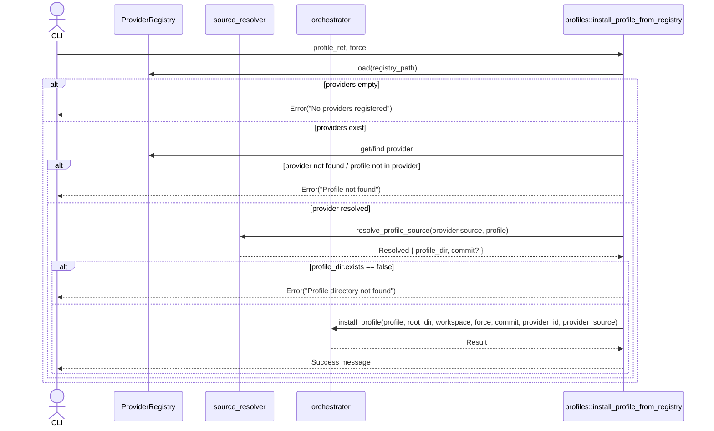

# mod.rs Review

## TL;DR

- 目的: プロファイル管理の公開APIを提供（プロバイダ登録/一覧/削除、プロフィールのインストール/削除/更新、検証、チーム設定の同期、ステータス表示）。
- 主要公開API: init_profile, add_provider, remove_provider, list_providers, verify_profile, verify_all_profiles, list_profiles, show_status, sync_team_config, remove_profile, install_profile_from_registry, update_profile, profiles_dir, provider_registry_path。
- コアロジック: レジストリを読み取り、プロファイル取得元（GitHub/URL/ローカル）を解決し、orchestrator::install_profileに委譲して原子的インストール。updateはリモートHEADとロックファイルのコミット比較後に再インストール。
- 重大リスク:
  - commitやintegrityの固定長スライス表示（[..8], [..16]）でパニックの可能性。
  - remove_profileのファイル削除でパス検証がなく、ロックファイル汚染時にワークスペース外への削除（パストラバーサル）リスク。
  - install_profile_from_registryでprofile_dir.parent().unwrap()のアンラップパニック可能性。
  - Git URLをそのまま渡すため、外部コマンド呼出し形態次第でインジェクション/信頼性リスク（gitモジュールの実装不明）。
- 並行性: すべて同期I/Oで実行。レースコンディションは主にTOCTOU（exists→remove）に限定。Send/Sync/unsafe使用なし（このチャンクでは不明）。
- エラー設計: ProfileResultに集約。詳細はerrorモジュール依存だが戻り値は一貫してResult型。unwrap/expectの使用箇所あり（要改善）。

## Overview & Purpose

このファイルは「プロファイルシステム」の公開APIをまとめたモジュールで、プロジェクト初期化やチーム標準設定の適用を支援します。具体的には:

- プロバイダ（プロファイルを提供するソース）の管理（追加/削除/一覧）
- プロファイルのインストール、削除、更新、検証
- チーム設定（.codanna/profiles.json）の同期
- 現在のワークスペースにインストール済みプロファイルのステータス表示

内部的には、ProviderRegistry（グローバルレジストリ）とlockfile（ワークスペース固有のインストール記録）、orchestrator/installer/git/verificationなどのサブモジュールを利用します。

このチャンクは主にCLIコマンドの実装と紐づく「操作系の関数」を公開しており、具体的なファイル操作・検証・インストールの詳細は各サブモジュールに委譲されています。

## Structure & Key Components

| 種別 | 名前 | 公開範囲 | 責務 | 複雑度 |
|------|------|----------|------|--------|
| Module | commands, error, fsops, git, installer, local, lockfile, manifest, orchestrator, project, provider, provider_registry, reference, resolver, source_resolver, template, variables, verification | pub | サブ機能群（ここでは宣言のみ、詳細は各モジュール） | Low |
| Function | profiles_dir | pub | グローバルプロファイルディレクトリのパス取得 | Low |
| Function | provider_registry_path | pub | プロバイダレジストリファイルのパス取得 | Low |
| Function | init_profile | pub | ローカル/グローバルのプロファイルを現在のワークスペースへインストール | Med |
| Function | add_provider | pub | プロバイダのグローバル登録 | Med |
| Function | remove_provider | pub | プロバイダの登録解除 | Low |
| Function | list_providers | pub | 登録済みプロバイダ一覧表示 | Low |
| Function | verify_profile | pub | 指定プロファイルの整合性検証 | Med |
| Function | verify_all_profiles | pub | 全プロファイルの整合性検証 | Med |
| Function | list_profiles | pub | 全プロバイダから利用可能なプロファイル一覧表示（JSON対応） | Med |
| Function | show_status | pub | ワークスペースのインストール済みプロファイル状況表示 | Med |
| Function | sync_team_config | pub | チーム設定に従ってプロバイダ登録・プロファイルインストール | High |
| Function | remove_profile | pub | インストール済みプロファイルの削除 | Med |
| Function | install_profile_from_registry | pub | レジストリからプロファイル参照を解決しインストール | High |
| Function | update_profile | pub | プロバイダからプロファイルを更新（再インストール） | High |
| Function | derive_provider_id | private | ソースからプロバイダID推定 | Low |
| Function | load_provider_manifest | private | ソース種別からProviderManifestをロード | Med |
| Function | load_manifest_from_git | private | GitリポジトリからProviderManifest取得 | Med |

### Dependencies & Interactions

- 内部依存
  - install_profile_from_registry → ProviderRegistry.load, .get_provider, .find_provider_with_id, source_resolver::resolve_profile_source, orchestrator::install_profile
  - update_profile → lockfile::ProfileLockfile.load, ProviderRegistry.find_provider_for_profile, git::resolve_reference, verification::verify_profile, install_profile_from_registry
  - add_provider → ProviderRegistry.load/save/add_provider/get_provider, ProviderSource::parse, load_provider_manifest
  - show_status → project::ProfilesConfig.load, ProviderRegistry.load/get_provider, lockfile::ProfileLockfile.load, reference::ProfileReference::parse
  - sync_team_config → ProfilesConfig.load, ProviderRegistry.load/save/add_provider/get_provider, load_provider_manifest, install_profile_from_registry
  - remove_profile → ProfileLockfile.load/save/get_profile/remove_profile, std::fs::remove_file/remove_dir
  - verify_profile/verify_all_profiles → verificationモジュール
  - list_profiles/list_providers → ProviderRegistry.load, serde_json（JSON出力）
  - load_manifest_from_git → tempfile::tempdir, git::clone_repository, ProviderManifest::from_file
- 外部依存（このモジュールから参照しているもの）
  | 依存名 | 種別 | 用途 |
  |--------|------|------|
  | std::env, std::fs, std::path | 標準ライブラリ | 環境/FS/パス操作 |
  | tempfile | crate | 一時ディレクトリ作成 |
  | serde_json | crate | JSON出力 |
  | crate::init::global_dir | 内部クレート関数 | グローバルディレクトリ決定 |
  | git（内部モジュール） | 内部 | clone_repository, resolve_reference |
  | orchestrator（内部） | 内部 | install_profile（原子的インストール） |
  | provider_registry / provider | 内部 | レジストリロード/保存/検索/マニフェスト |
  | verification（内部） | 内部 | 整合性検証 |
  | lockfile（内部） | 内部 | インストール記録の管理 |
  | project（内部） | 内部 | チーム設定のロード |
  | source_resolver（内部） | 内部 | プロファイルソースの解決 |
  | reference（内部） | 内部 | "profile@provider" 参照文字列の解析 |
- 被依存推定
  - CLIレイヤ（commandsモジュール）から、この公開APIが直接呼ばれる想定。その他のモジュールがこのAPIをラップする可能性は不明（このチャンクには現れない）。

## API Surface (Public/Exported) and Data Contracts

| API名 | シグネチャ | 目的 | Time | Space |
|-------|-----------|------|------|-------|
| profiles_dir | fn profiles_dir() -> PathBuf | グローバルプロファイルディレクトリ取得 | O(1) | O(1) |
| provider_registry_path | fn provider_registry_path() -> PathBuf | プロバイダレジストリファイルのパス取得 | O(1) | O(1) |
| init_profile | fn init_profile(profile_name: &str, source: Option<&Path>, force: bool) -> ProfileResult<()> | 現ワークスペースへプロファイルをインストール | O(F)＋I/O | O(1) |
| add_provider | fn add_provider(source: &str, provider_id: Option<&str>) -> ProfileResult<()> | プロバイダ登録 | O(P)+Git/I/O | O(P) |
| remove_provider | fn remove_provider(provider_id: &str) -> ProfileResult<()> | プロバイダ削除 | O(P) | O(1) |
| list_providers | fn list_providers(verbose: bool) -> ProfileResult<()> | プロバイダ一覧表示 | O(P+Σprofiles) | O(1) |
| verify_profile | fn verify_profile(profile_name: &str, verbose: bool) -> ProfileResult<()> | 指定プロファイル検証 | 不明（verification次第） | 不明 |
| verify_all_profiles | fn verify_all_profiles(verbose: bool) -> ProfileResult<()> | 全プロファイル検証 | 不明（verification次第） | 不明 |
| list_profiles | fn list_profiles(verbose: bool, json: bool) -> ProfileResult<()> | 利用可能なプロファイル一覧（JSON対応） | O(P+Σprofiles) | O(P+Σprofiles) |
| show_status | fn show_status(verbose: bool) -> ProfileResult<()> | インストール状況表示 | O(P+Σprofiles+F) | O(P+Σprofiles+F) |
| sync_team_config | fn sync_team_config(force: bool) -> ProfileResult<()> | チーム設定に従った同期 | O(Providers+Installs+Git/I/O) | O(P) |
| remove_profile | fn remove_profile(profile_name: &str, verbose: bool) -> ProfileResult<()> | プロファイル削除 | O(F) | O(1) |
| install_profile_from_registry | fn install_profile_from_registry(profile_ref: &str, force: bool) -> ProfileResult<()> | レジストリ経由インストール | O(Repo clone + F) | O(1)+一時領域 |
| update_profile | fn update_profile(profile_name: &str, force: bool) -> ProfileResult<()> | プロファイル更新 | O(HEAD解決＋再インストール) | O(1) |

凡例: P=プロバイダ数, F=対象プロファイルのファイル数, Σprofiles=全プロバイダのプロファイル総数。

以下、主要APIの詳細（全APIを網羅）:

1) profiles_dir
- 目的と責務: グローバルディレクトリ（~/.codanna/profiles）を返す。
- アルゴリズム:
  1. crate::init::global_dir()を取得
  2. "profiles" をjoin
- 引数: なし
- 戻り値: PathBuf
- 使用例:
  ```rust
  let dir = profiles_dir();
  println!("{}", dir.display());
  ```
- エッジケース:
  - global_dirの取得失敗はここでは起きない（返り値はPathBuf）。不明。

2) provider_registry_path
- 目的: グローバルのプロバイダレジストリ（~/.codanna/providers.json）パス取得。
- アルゴリズム: global_dir()に"providers.json"をjoin。
- 使用例:
  ```rust
  let path = provider_registry_path();
  assert!(path.ends_with("providers.json"));
  ```
- エッジケース: なし。

3) init_profile
- 目的: 指定名のプロファイルをワークスペースへインストール。
- アルゴリズム:
  1. 現在ディレクトリ＝ワークスペース取得
  2. sourceがSomeならそのパス、Noneならprofiles_dir()
  3. 情報メッセージprint
  4. orchestrator::install_profile(...)呼出し（commit/provider情報なし）
  5. 成功メッセージprint
- 引数:
  | 名 | 型 | 説明 |
  |----|----|------|
  | profile_name | &str | インストールするプロファイル名 |
  | source | Option<&Path> | ローカルソースディレクトリ（未指定はグローバル） |
  | force | bool | 競合ファイルを上書きするか |
- 戻り値:
  | 型 | 説明 |
  |----|------|
  | ProfileResult<()> | 成否（error詳細はerrorモジュール） |
- 使用例:
  ```rust
  init_profile("rust-basic", None, false)?;
  ```
- エッジケース:
  - sourceのパスが不正/存在しない → orchestrator側のエラー
  - 権限不足で書込不可 → エラー
  - 既存ファイル競合 → force=falseなら失敗、trueなら上書き

4) add_provider
- 目的: プロバイダをグローバルレジストリに追加。
- アルゴリズム:
  1. ProviderRegistry.load
  2. ProviderSource::parse(source)
  3. provider_id（指定 or derive_provider_id）決定
  4. 既登録チェック→存在なら終了
  5. load_provider_manifest(source)（Git/ローカルに応じて）
  6. registry.add_provider(...), registry.save(...)
  7. 追加結果のprint
- 引数:
  | 名 | 型 | 説明 |
  |----|----|------|
  | source | &str | "github:org/repo", git URL, ローカルパス |
  | provider_id | Option<&str> | 明示的ID（未指定なら推定） |
- 戻り値: ProfileResult<()>
- 使用例:
  ```rust
  add_provider("github:codanna/claude-provider", None)?;
  ```
- エッジケース:
  - マニフェストが見つからない/パース失敗 → エラー
  - Gitクローン失敗（ネットワーク/認証） → エラー
  - provider_idの重複 → 早期return（情報表示のみ）

5) remove_provider
- 目的: グローバルレジストリから削除。
- アルゴリズム: load→remove_provider→save（成功時）→print
- 引数: provider_id: &str
- 戻り値: ProfileResult<()>
- 使用例:
  ```rust
  remove_provider("claude-provider")?;
  ```
- エッジケース:
  - 未登録ID → Not foundメッセージ、成功扱い

6) list_providers
- 目的: 登録済みプロバイダ一覧表示。
- アルゴリズム: load→空ならヘルプ→各プロバイダをprint（verbose時プロフィール詳細）
- 引数: verbose: bool
- 戻り値: ProfileResult<()>
- 使用例:
  ```rust
  list_providers(true)?;
  ```
- エッジケース:
  - providers空 → ヘルプ表示

7) verify_profile
- 目的: 指定プロファイルの整合性検証。
- アルゴリズム: current_dir→verification::verify_profile(...)
- 引数: profile_name: &str, verbose: bool
- 戻り値: ProfileResult<()>
- 使用例:
  ```rust
  verify_profile("rust-basic", true)?;
  ```
- エッジケース: verificationの仕様次第（このチャンクでは不明）

8) verify_all_profiles
- 目的: 全インストール済みの整合性検証。
- アルゴリズム: current_dir→verification::verify_all_profiles
- 引数: verbose: bool
- 戻り値: ProfileResult<()>
- 使用例:
  ```rust
  verify_all_profiles(false)?;
  ```
- エッジケース: 不明（verification次第）

9) list_profiles
- 目的: 登録済みプロバイダの提供するプロファイル一覧（JSON対応）。
- アルゴリズム:
  1. load registry
  2. 空ならヘルプ表示
  3. json=trueならserde_json::to_string_prettyで出力して終了
  4. それ以外は人向け印字
- 引数: verbose, json: bool
- 戻り値: ProfileResult<()>
- 使用例:
  ```rust
  list_profiles(false, true)?; // JSON出力
  ```
- エッジケース:
  - providers空 → ヘルプ表示
  - JSON化失敗（不整合なデータ） → エラー

10) show_status
- 目的: ワークスペースにおけるプロファイルの状態表示。チーム設定の不足についても通知。
- アルゴリズム（要点）:
  1. .codanna/profiles.jsonが存在し、必要プロバイダ/プロファイルが不足していれば同期の提案を表示
  2. lockfile存在チェック→なければ「ない」
  3. lockfileロード→空なら「ない」
  4. 詳細表示（verbose時はcommitの短縮、ファイル一覧等）
- 引数: verbose: bool
- 戻り値: ProfileResult<()>
- 使用例:
  ```rust
  show_status(true)?;
  ```
- エッジケース:
  - commitやintegrityの短縮表示でスライス長不足パニックの可能性（後述）

11) sync_team_config
- 目的: チーム設定を読み込み、追加プロバイダの登録および必要なプロファイルのインストールを実施。
- アルゴリズム（要点）:
  1. profiles.json存在/空のチェック
  2. registryロード→extra_known_providersを追加（manifestロード込み）→save
  3. lockfileロード
  4. profiles.jsonの各参照について、未インストールならinstall_profile_from_registryをtryし、エラーは継続
- 引数: force: bool（インストール時に競合上書き）
- 戻り値: ProfileResult<()>
- 使用例:
  ```rust
  sync_team_config(false)?;
  ```
- エッジケース:
  - Git/ネットワーク失敗, manifest不正 → 個別にeprintlnし継続

12) remove_profile
- 目的: 指定プロファイルの削除。
- アルゴリズム（要点）:
  1. lockfileロード→エントリ取得（なければエラー）
  2. entry.filesを順次削除（存在チェック→remove_file）。親ディレクトリが空ならremove_dir試行
  3. lockfileからプロファイル削除→空ならlockfile自体削除、それ以外はsave
  4. 結果表示
- 引数: profile_name: &str, verbose: bool
- 戻り値: ProfileResult<()>
- 使用例:
  ```rust
  remove_profile("rust-basic", true)?;
  ```
- エッジケース:
  - ファイル削除失敗は警告出して継続
  - パストラバーサル対策なし（後述）

13) install_profile_from_registry
- 目的: レジストリのプロファイル参照（"name"または"name@provider"）を解決してインストール。
- アルゴリズム（主な分岐）:
  1. ProfileReference::parse(profile_ref)
  2. ProviderRegistry.load（providers空ならエラー）
  3. provider指定あり→get_provider、なし→find_provider_with_id(profile)で検索
  4. provider.profilesにprofileが存在するか確認（なければエラー）
  5. source_resolver::resolve_profile_sourceからprofile_dir取得→存在チェック
  6. commit（gitソースなら）取得
  7. orchestrator::install_profile(..., commit, Some(provider_id), Some(provider.source.clone()))
  8. 成功表示
- 引数: profile_ref: &str, force: bool
- 戻り値: ProfileResult<()>
- 使用例:
  ```rust
  install_profile_from_registry("rust-basic@claude-provider", false)?;
  install_profile_from_registry("rust-basic", true)?; // プロバイダ自動検索
  ```
- エッジケース:
  - providers空 → エラー
  - 指定provider未登録 → エラー
  - profile未提供 → エラー
  - profile_dirが存在しない → エラー
  - parent().unwrap()でのパニック可能性（後述）

14) update_profile
- 目的: インストール済みプロファイルをプロバイダから更新（reinstall）。
- アルゴリズム（主な分岐）:
  1. lockfileロード→既存entry取得（なければNotInstalled）
  2. 既存entry.commitがSomeであること確認（なければローカル由来→更新不可）
  3. registry.load→find_provider_for_profileでprovider特定
  4. provider.source種別でrepo URLを決定（Localは更新不可）
  5. force=falseならgit::resolve_reference("HEAD")でremote_commit取得
     - remote==existingならverification::verify_profile成功時は「最新」表示→終了
     - 違うなら「更新」表示
  6. install_profile_from_registry(profile_name, true)で強制再インストール
  7. remote_commitがSomeなら短縮表示、Noneなら「強制再インストール」
- 引数: profile_name: &str, force: bool
- 戻り値: ProfileResult<()>
- 使用例:
  ```rust
  update_profile("rust-basic", false)?;
  ```
- エッジケース:
  - providerがLocal → 更新不可エラー
  - find_provider_for_profileが見つからない → エラー
  - commit短縮表示のパニック可能性（後述）

データコントラクト（このチャンクに現れる利用側の期待）
- ProviderRegistry: load/save/get_provider/remove_provider/add_provider/find_provider_with_id/find_provider_for_profile、providersフィールド（連想配列）を持つ。
- ProviderManifest: from_fileで読み込める。profilesフィールドにVecかMap構造（このチャンクでは詳細不明）。
- ProviderSource: enum（Github/Url/Local）でparse可能。
- ProfileLockfile: load/save/get_profile/remove_profile、profilesフィールド（Map）で、entryにversion, installed_at, commit: Option<String>, files: Vec<String>, integrity: String などが存在。
- ProfilesConfig: load/is_empty/extra_known_providers/profiles/get_required_provider_ids など。
- ProfileReference: parseで{ profile, provider: Option<String> }を返す。

いずれも正確な構造体定義はこのチャンクには現れないため詳細は不明。

## Walkthrough & Data Flow

主要なデータフローを簡潔に説明します。

- init_profile
  - 入力: profile_name, source（Optional）, force
  - フロー: current_dir → profiles_dir（source優先） → orchestrator::install_profile（commit/providerなし） → 結果表示

- add_provider
  - 入力: source, provider_id（Optional）
  - フロー: ProviderRegistry.load → ProviderSource::parse → id決定 → load_provider_manifest（Git/Local） → add_provider → save → 結果表示

- show_status
  - 入力: verbose
  - フロー: workspace → .codanna/profiles.json存在 → ProfilesConfig.load → ProviderRegistry.load → 必要providerとlockfileの不足判定 → 提示 → lockfile存在チェック → lockfile.load → profiles表示（verboseでcommit/integrity短縮やファイル一覧）

- sync_team_config
  - 入力: force
  - フロー: ProfilesConfig.load → extra_known_providersをmanifest読み込みでregistryに追加 → registry.save → lockfile.load → profilesConfig.profilesを順次install_profile_from_registryでインストール（エラーは継続） → 結果表示

- remove_profile
  - 入力: profile_name, verbose
  - フロー: lockfile.load → entry取得 → entry.filesを削除（存在確認→remove_file、親ディレクトリが空ならremove_dir） → lockfile更新/削除 → 結果表示

- install_profile_from_registry（複雑分岐あり）
  - 入力: profile_ref, force
  - フロー:
    1. ProfileReference::parse
    2. ProviderRegistry.load（空ならエラー）
    3. providerの決定（指定ありならget、なければfind_provider_with_id）
    4. providerにprofileが存在するか確認
    5. source_resolver::resolve_profile_source → profile_dir存在確認
    6. commit（gitなら）取得
    7. orchestrator::install_profile（commit/provider情報を付与）
    8. 結果表示

- update_profile（複雑分岐あり）
  - 入力: profile_name, force
  - フロー:
    1. lockfile.load→entry取得（未インストールならエラー）
    2. entry.commitがなければエラー（ローカル起源）
    3. ProviderRegistry.find_provider_for_profile
    4. repo URLをsourceから導出（Localはエラー）
    5. force=falseならgit::resolve_reference("HEAD")でremote_commit取得
       - remote==existingならverify_profile成功で早期終了
       - そうでなければ更新メッセージ
    6. install_profile_from_registry(profile_name, true)
    7. 結果表示

### Mermaid: install_profile_from_registryの主要分岐（関数: 行番号はこのチャンクでは不明）



上記の図はinstall_profile_from_registry関数の主要分岐を示します（行番号はこのチャンクでは不明）。

### Mermaid: update_profileの主要分岐（関数: 行番号はこのチャンクでは不明）

```mermaid
flowchart TD
  A[Load lockfile] --> B{Profile installed?}
  B -- No --> E[Error: NotInstalled]
  B -- Yes --> C{Has commit?}
  C -- No --> F[Error: Local provider cannot update]
  C -- Yes --> D[Find provider for profile]
  D --> G{Provider source}
  G -- Local --> H[Error: Cannot update local provider]
  G -- Github/URL --> I[Resolve remote HEAD (if !force)]
  I --> J{force? or remote == existing?}
  J -- remote == existing --> K[verify_profile]
  K -- OK --> L[Up-to-date message]
  K -- Err --> M[Reinstall due to integrity fail]
  J -- force or remote != existing --> N[install_profile_from_registry(profile, true)]
  N --> O[Print updated message]
```

上記の図はupdate_profile関数の主要分岐を示します（行番号はこのチャンクでは不明）。

## Complexity & Performance

- 全体的にI/O主導（ファイルシステム、ネットワーク）。
- ボトルネック
  - Gitクローン（load_manifest_from_git, resolve_profile_source内部のgit操作が想定）：リポジトリサイズ・ネットワーク遅延。
  - 大量ファイルのインストール/削除（orchestrator/installerによるファイルI/O）。
  - JSONのシリアライズ（list_profilesのverbose/json出力）—通常は軽微。
- スケール限界
  - プロバイダ数/プロファイル数が増えると、list_*系がO(P+Σprofiles)で線形に増加。
  - 同時実行は考慮されていないため、複数プロセスからの並行操作でレースの可能性（lockfile更新/レジストリ保存）。
- 実運用負荷要因
  - ネットワーク: Git操作、外部URLのアクセス。
  - ディスク: 大量のファイル展開・削除・ロックファイル/レジストリ保存。
  - 権限: ワークスペース/グローバルディレクトリへの書込み権限。

## Edge Cases, Bugs, and Security

セキュリティチェックリストと指摘事項:

- メモリ安全性
  - Buffer overflow: Rust安全。文字列スライスで範囲外アクセスの可能性あり（パニック）:
    - show_status: `&commit[..8]`, `&entry.integrity[..16]` → 長さ未満でpanic。
    - update_profile: `&existing_commit[..8]`, `&remote[..8]` → 同様。
  - Use-after-free: なし。
  - Integer overflow: なし（このチャンクでは不明）。
- インジェクション
  - Command injection: git::clone_repository/resolve_referenceの実装が外部コマンド実行なら、URL/リポジトリ参照文字列の取り扱いに注意（エスケープ/検証不明）。
  - Path traversal: remove_profileは`workspace.join(file_path)`で相対パスを受け入れる。lockfileが汚染されている場合、`../../`などでワークスペース外の削除を試みる可能性。canonicalizeでワークスペース内かチェックが必要。
  - SQL: 該当なし。
- 認証・認可
  - 権限チェック: ファイル/ディレクトリ削除・作成時の権限不足はエラーになるが、事前検証なし。
  - セッション固定: 該当なし。
- 秘密情報
  - Hard-coded secrets: なし。
  - Log leakage: verbose時にファイルパス一覧を表示。秘密情報のパスや内容を含む可能性は利用側次第（CLIなので許容されるが慎重に）。
- 並行性
  - Race condition: `exists()`チェック後に`remove_file()`などのTOCTOU。現状は許容範囲だが、失敗時の処理は継続。
  - Deadlock: なし。
- その他のバグ/懸念
  - `profile_dir.parent().unwrap()`（install_profile_from_registry）: `profile_dir`がルートの可能性は低いが、親が存在しないとpanic。`ok_or_else`でエラー化推奨。
  - コミット短縮表示の固定長依存: 8/16文字未満の値の取り扱い。
  - ProviderRegistry検索関数名と用途の不一致感:
    - `find_provider_with_id(&reference.profile)`と命名が「with_id」だが、渡しているのはprofile名。APIネーミング/設計要確認。
  - update_profileで再インストール時のプロバイダ選択曖昧性:
    - `install_profile_from_registry(profile_name, true)`はプロバイダ非指定。複数プロバイダが同名profileを持つ場合、意図しないプロバイダが選択される可能性。lockfile側のprovider_idを利用すべき。

### エッジケース詳細

| エッジケース | 入力例 | 期待動作 | 実装 | 状態 |
|-------------|--------|----------|------|------|
| プロバイダ未登録 | list_profiles(false, false) | ヘルプ表示 | あり | OK |
| プロファイル未インストール | remove_profile("x", false) | Err(NotInstalled) | あり | OK |
| profile_dir親なし（理論上） | "badref" | Err(InvalidManifest)（unwrap回避） | parent().unwrap() | 要修正 |
| commit短すぎ | commit="abcd" | 安全な短縮（"abcd"） | `[..8]`スライス | バグ |
| integrity短すぎ | integrity="deadbeef" | 安全な短縮（"deadbeef"） | `[..16]`スライス | バグ |
| lockfile汚染のパストラバーサル | "../../etc/passwd" | ワークスペース外は拒否 | joinのみ | 要修正 |
| Gitネットワーク障害 | add_provider("url") | エラー/再試行案内 | エラー | OK |
| プロバイダ重複登録 | add_provider(..) | 早期終了（情報表示） | あり | OK |

このチャンクでは行番号が不明なため、関数単位の指摘としています。

## Design & Architecture Suggestions

- **安全な文字列短縮ユーティリティ**を導入
  - 例: `fn abbrev(s: &str, n: usize) -> &str { s.get(..n).unwrap_or(s) }`
  - すべてのcommit/integrity短縮表示で利用。
- **パス正規化と境界チェック**
  - `remove_profile`で各`file_path`に対して`canonicalize`し、`workspace`配下であることを検証。`strip_prefix(workspace)`が成功した場合のみ削除。
- **unwrap排除**
  - `profile_dir.parent()`は`ok_or_else`で`ProfileError::InvalidManifest`へ。
- **プロバイダ選択の一貫性**
  - lockfileに`provider_id`が記録されているなら、`update_profile`ではそれを使用して確実に同一プロバイダから再インストール。
- **Git操作のキャッシュ/最適化**
  - provider manifestやprofileソース解決のためのクローンをキャッシュし、不要な再クローンを削減。
- **ロギングの導入**
  - println/eprintlnの代わりに`log`クレートを使い、レベル（info/warn/error/debug）を適切に分離。CLIでは人向け出力とログを分離する。
- **APIのエラー報告強化**
  - `ActionReport`のような構造体で、成功・失敗件数（削除/インストールファイル数など）を返すと、上位レイヤでの表示/テレメトリが容易。
- **テスト容易性のためのDI**
  - グローバルディレクトリ（`crate::init::global_dir()`）をオーバーライド可能に（環境変数やテスト用フック）し、ProviderRegistry/lockfileのI/Oをtempdirへ向けられるようにする。

## Testing Strategy (Unit/Integration) with Examples

- 単体テスト（純粋関数/軽量I/O）
  - derive_provider_idの挙動検証（GitHub/URL/Local）
  - 文字列短縮ユーティリティ（提案）検証
- 統合テスト（tempdirを用いた擬似環境）
  - ProviderRegistryのロード/保存・list_providersの出力（JSON/非JSON）
  - remove_profileのファイル削除ロジック（空ディレクトリ削除、失敗時継続）
  - install_profile_from_registryのエラー分岐（プロバイダ未登録、profile未提供）

注意: このチャンクには`crate::init::global_dir`や各サブモジュールの詳細がないため、以下のコードは擬似例です。実際のテストでは環境設定/フィクスチャが必要になります。

例1: derive_provider_idのテスト

```rust
#[cfg(test)]
mod tests {
    use super::*;
    use provider_registry::ProviderSource;

    #[test]
    fn test_derive_provider_id_github() {
        let src = ProviderSource::Github { repo: "codanna/claude-provider".into() };
        assert_eq!(derive_provider_id(&src), "claude-provider");
    }

    #[test]
    fn test_derive_provider_id_url() {
        let src = ProviderSource::Url { url: "https://example.com/foo/bar.git".into() };
        assert_eq!(derive_provider_id(&src), "bar");
    }

    #[test]
    fn test_derive_provider_id_local() {
        let tmp = tempfile::tempdir().unwrap();
        let path = tmp.path().join("my-provider");
        std::fs::create_dir(&path).unwrap();
        let src = ProviderSource::Local { path: path.to_string_lossy().to_string() };
        assert_eq!(derive_provider_id(&src), "my-provider");
    }
}
```

例2: 安全な短縮関数（提案）とテスト

```rust
fn abbrev<'a>(s: &'a str, n: usize) -> &'a str {
    s.get(..n).unwrap_or(s)
}

#[cfg(test)]
mod abbrev_tests {
    use super::abbrev;

    #[test]
    fn abbrev_shorter() {
        assert_eq!(abbrev("abcd", 8), "abcd");
    }

    #[test]
    fn abbrev_longer() {
        assert_eq!(abbrev("1234567890", 8), "12345678");
    }
}
```

例3: remove_profileのパス境界チェック（提案の関数）テスト
このチャンクには境界チェックは未実装のため、テストは提案コードに対して。

```rust
fn is_within_workspace(workspace: &std::path::Path, candidate: &std::path::Path) -> bool {
    if let Ok(canon) = candidate.canonicalize() {
        canon.starts_with(workspace)
    } else {
        false
    }
}

#[cfg(test)]
mod path_tests {
    use super::*;
    use std::path::PathBuf;

    #[test]
    fn within_workspace_ok() {
        let ws = PathBuf::from("/tmp/ws");
        let f = PathBuf::from("/tmp/ws/src/main.rs");
        assert!(is_within_workspace(&ws, &f));
    }

    #[test]
    fn outside_workspace_blocked() {
        let ws = PathBuf::from("/tmp/ws");
        let f = PathBuf::from("/etc/passwd");
        assert!(!is_within_workspace(&ws, &f));
    }
}
```

例4: list_profilesのJSON出力検証（擬似）
ProviderRegistryのフィクスチャが必要。実テストではtempdirにproviders.jsonを作成し、load対象を切り替える仕組みが必要（このチャンクでは不明）。

```rust
// 擬似例：実際はProviderRegistryのsave/loadを使ってfixturesを構築
fn assert_list_profiles_json() {
    // 前提: プロバイダ登録済みの状態を作る
    // 実装詳細はこのチャンクには現れない
    let _ = list_profiles(false, true);
}
```

## Refactoring Plan & Best Practices

- 文字列短縮の安全化: `abbrev()`ユーティリティ導入。全表示箇所で差し替え。
- パス境界チェック: `remove_profile`で`workspace.join(file_path)`後に`canonicalize`→`starts_with(workspace)`検証を追加。拒否時は警告とスキップ。
- unwrap除去:
  - `profile_dir.parent()`は`ok_or_else(ProfileError::InvalidManifest { reason: ... })?`に置換。
- 更新時のプロバイダ指定:
  - lockfileに保存されている`provider_id`（存在する前提）を取得し、`install_profile_from_registry(&format!("{}@{}", profile_name, provider_id), true)`で再インストール。
- ロギング導入:
  - `println!/eprintln!`を`log`クレート経由に段階的に置換（CLI向けのユーザ表示は保持）。
- Git操作の最適化:
  - マニフェスト/ソースのキャッシュディレクトリ（~/.codanna/cache/providers/<id>）を導入し、再クローンを避ける。
- エラー型の統一:
  - 各分岐のメッセージを`ProfileError`バリアントへ集約。上位で見やすい表示に。

## Observability (Logging, Metrics, Tracing)

- 現状: 標準出力/標準エラーへのprintln/eprintlnのみ。構造化ログなし。
- 推奨:
  - logクレート＋環境ベースの初期化（例: env_logger）。
  - 主要操作に計測ポイント（インストール時間、削除ファイル数、Git操作時間、検証結果）。
  - トレースID（インストール/更新単位）で関連ログを紐づけ。
  - エラー時に原因カテゴリ（ネットワーク/FS/権限/検証不一致）をメトリクスへカウント。

## Risks & Unknowns

- このチャンクに構造体定義がないため、ProviderRegistry/Manifest/Lockfile/ProfilesConfigの詳細は不明。
- gitモジュールの実装が外部コマンド依存かライブラリ依存か不明。安全性/パフォーマンスの評価は限定的。
- crate::init::global_dirの挙動（環境変数や設定の影響）不明。テスト容易性に影響。
- `find_provider_with_id`の返り型・検索仕様（プロファイル名を渡しているが命名的に不一致）不明。設計の意図確認が必要。
- 行番号情報が無いため、指摘位置は関数単位の記述に留まる。

以上により、公開APIの使い勝手は良好ですが、表示の安全性（短縮スライス）と削除操作の境界チェック、更新時プロバイダ選択の一貫性が優先度高の改善ポイントです。