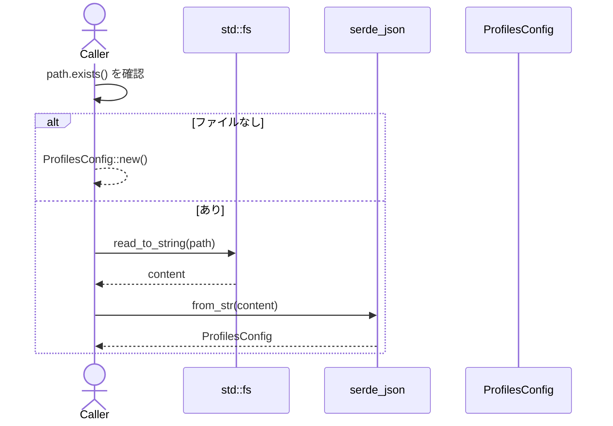
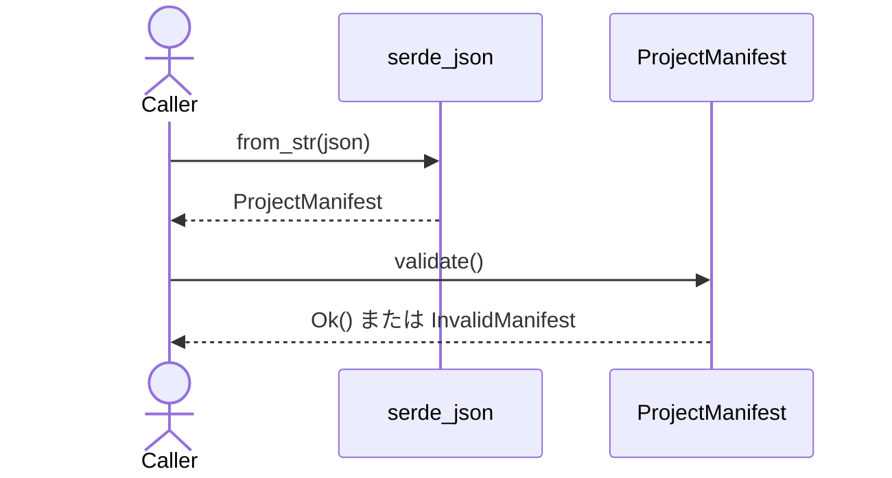

# project.rs Review

## TL;DR

- 目的: チーム用のプロファイル設定ファイル「.codanna/profiles.json」と、レガシーな「ProjectManifest」をJSONとして読み書きするための軽量ユーティリティ。
- 主な公開API: ProfilesConfig::{new, load, save, add_profile, remove_profile, parse_profiles, is_empty, get_required_provider_ids} と ProjectManifest::{new, load, save, load_or_create, from_json}。
- データ契約: extraKnownProviders(HashMap<provider_id -> ExtraProvider>) と profiles(Vec<String> "name@provider"形式推奨)。ProjectManifestは profile:String。
- 複雑箇所: get_required_provider_ids の重複排除が Vec の contains で O(n^2) になりうる。parse_profiles は ProfileReference に依存（このチャンクでは仕様不明）。
- 重大リスク: I/O/serdeエラーの変換が ProfileError に委譲されているため、From 実装の網羅性が前提。ProjectManifest::new() は空プロファイルで、from_json との整合性に注意。
- 並行性: すべて同期処理でスレッド共有状態なし。unsafeなし。メモリ安全性はRustの所有権/借用規則内で問題なし。
- セキュリティ: 外部入力のパスを無検証で読み書きするため、呼び出し側のパス安全性（権限/トラバーサル）に依存。秘密情報の扱い・認可は本ファイル対象外。

## Overview & Purpose

このファイルは、.codanna ディレクトリ配下に保存されるチームプロファイル設定を取り扱うためのモデルとI/Oユーティリティを提供します。設定は「三層構成」を想定します（コメントより）:

1. Global: ~/.codanna/providers.json（ユーザ登録済みプロバイダ）
2. Team: .codanna/profiles.json（チーム契約・Git管理）
3. Local: .codanna/profiles.lock.json（インストール状態・Git非管理）

本チャンクでは、チーム層の JSON スキーマに対応する構造体 ProfilesConfig と、後方互換用の ProjectManifest を実装しています。JSONの読み書きに serde/serde_json を用いています。

## Structure & Key Components

| 種別 | 名前 | 公開範囲 | 責務 | 複雑度 |
|------|------|----------|------|--------|
| Struct | ProfilesConfig | pub | チーム設定（version, extraKnownProviders, profiles）のモデルとI/O | Low |
| Struct | ExtraProvider | pub | 追加プロバイダの定義（source: ProviderSource） | Low |
| Struct | ProjectManifest | pub | レガシーな単一プロファイル指定のマニフェスト | Low |
| Function | ProfilesConfig::new | pub | 空の設定を生成（version=1） | Low |
| Function | ProfilesConfig::load | pub | JSONファイルからロード（存在しなければ空設定） | Low |
| Function | ProfilesConfig::save | pub | JSONファイルへ保存（親ディレクトリ作成） | Low |
| Function | ProfilesConfig::add_profile | pub | profiles へ重複排除追加 | Low |
| Function | ProfilesConfig::remove_profile | pub | profiles から削除（存在時true） | Low |
| Function | ProfilesConfig::parse_profiles | pub | profiles の各文字列を ProfileReference に変換 | Low |
| Function | ProfilesConfig::is_empty | pub | profiles が空かを判定 | Low |
| Function | ProfilesConfig::get_required_provider_ids | pub | 必要な provider_id の一覧（重複排除） | Med |
| Function | ProjectManifest::new | pub | 空のマニフェスト作成（profile=""） | Low |
| Function | ProjectManifest::load | pub | JSONからロード（validate実行） | Low |
| Function | ProjectManifest::save | pub | JSONへ保存（親ディレクトリ作成） | Low |
| Function | ProjectManifest::load_or_create | pub | 存在時ロード、なければ new | Low |
| Function | ProjectManifest::from_json | pub | JSON文字列からパースし validate | Low |

### Dependencies & Interactions

- 内部依存
  - ProfilesConfig::load/save は std::fs と serde_json を使用。
  - ProfilesConfig::parse_profiles/get_required_provider_ids は **ProfileReference::parse**（super::reference）に依存。
  - get_required_provider_ids は self.extra_known_providers のキーと profiles の provider を併合。
  - ProjectManifest::load は from_json を経由し validate（private）を呼び出し。
- 外部依存（このモジュールが使用する）
  | 依存 | 用途 |
  |------|------|
  | serde::{Serialize, Deserialize} | 構造体のシリアライズ/デシリアライズ |
  | serde_json | JSONの読み書き |
  | std::fs | ファイルI/O |
  | std::path::Path | パス引数 |
  | std::collections::HashMap | extraKnownProviders |
  | super::error::{ProfileError, ProfileResult} | エラー伝播と結果型 |
  | super::provider_registry::ProviderSource | ExtraProvider のフィールド型 |
  | super::reference::ProfileReference | profiles 文字列の解析結果 |
- 被依存推定（このモジュールを利用する側）
  - CLIやツールの初期化/設定コマンド（例: プロファイル追加・削除）
  - 実行時に必要なプロバイダ解決（get_required_provider_ids の結果を用いてプロバイダ登録）

## API Surface (Public/Exported) and Data Contracts

| API名 | シグネチャ | 目的 | Time | Space |
|-------|-----------|------|------|-------|
| ProfilesConfig::new | fn new() -> Self | 空設定生成（version=1） | O(1) | O(1) |
| ProfilesConfig::load | fn load(path: &Path) -> ProfileResult<Self> | JSON読込（なければ空設定） | O(n) I/O | O(n) |
| ProfilesConfig::save | fn save(&self, path: &Path) -> ProfileResult<()> | JSON保存（親dir作成） | O(n) I/O | O(n) |
| ProfilesConfig::add_profile | fn add_profile(&mut self, profile_ref: &str) | 重複がなければ追加 | O(n) | O(1) 追加 |
| ProfilesConfig::remove_profile | fn remove_profile(&mut self, profile_ref: &str) -> bool | 存在時削除 | O(n) | O(1) |
| ProfilesConfig::parse_profiles | fn parse_profiles(&self) -> Vec<ProfileReference> | 文字列→ProfileReference 変換 | O(m) | O(m) |
| ProfilesConfig::is_empty | fn is_empty(&self) -> bool | profiles が空か判定 | O(1) | O(1) |
| ProfilesConfig::get_required_provider_ids | fn get_required_provider_ids(&self) -> Vec<String> | 必要provider_idの重複排除一覧 | O(k^2) worst | O(k) |
| ProjectManifest::new | fn new() -> Self | 空マニフェスト作成 | O(1) | O(1) |
| ProjectManifest::load | fn load(path: &Path) -> ProfileResult<Self> | JSONからロード+検証 | O(n) I/O | O(n) |
| ProjectManifest::save | fn save(&self, path: &Path) -> ProfileResult<()> | JSONへ保存 | O(n) I/O | O(n) |
| ProjectManifest::load_or_create | fn load_or_create(path: &Path) -> ProfileResult<Self> | 存在時ロード/なければ new | O(n) | O(n) |
| ProjectManifest::from_json | fn from_json(json: &str) -> ProfileResult<Self> | JSON文字列からのパース+検証 | O(n) | O(n) |

n はファイルサイズ（バイト）に比例、m は profiles の要素数、k は provider候補数（extraKnownProviders のキー数 + provider付き profiles の件数）。

以下、代表的APIの詳細。

### ProfilesConfig::new

1) 目的と責務
- デフォルト値（version=1, 空の extraKnownProviders/profiles）で構築。

2) アルゴリズム
- 定数時間で構造体を初期化。

3) 引数
| 名前 | 型 | 説明 |
|------|----|------|
| なし | - | - |

4) 戻り値
| 型 | 説明 |
|----|------|
| Self | 初期化済み ProfilesConfig |

5) 使用例
```rust
let mut cfg = ProfilesConfig::new();
assert!(cfg.is_empty());
```

6) エッジケース
- 特になし（pure 関数）

### ProfilesConfig::load

1) 目的と責務
- 指定パスから JSON を読み込み、なければ空設定を返却。

2) アルゴリズム
- path.exists() で存在確認
- 存在しなければ new() を返す
- read_to_string → serde_json::from_str → Ok(config)

3) 引数
| 名前 | 型 | 説明 |
|------|----|------|
| path | &Path | 設定ファイルパス |

4) 戻り値
| 型 | 説明 |
|----|------|
| ProfileResult<Self> | ロード成功時は構造体、失敗時はエラー |

5) 使用例
```rust
use std::path::Path;
let cfg = ProfilesConfig::load(Path::new(".codanna/profiles.json"))?;
```

6) エッジケース
- ファイルが存在しない: Ok(ProfilesConfig::new())
- JSONが壊れている: serde_json エラーを ProfileError へ伝播

### ProfilesConfig::save

1) 目的と責務
- 構造体を整形JSONにして保存。親ディレクトリがなければ作成。

2) アルゴリズム
- path.parent() のディレクトリを create_dir_all
- serde_json::to_string_pretty
- std::fs::write

3) 引数
| 名前 | 型 | 説明 |
|------|----|------|
| path | &Path | 出力ファイルパス |

4) 戻り値
| 型 | 説明 |
|----|------|
| ProfileResult<()> | 成否 |

5) 使用例
```rust
use std::path::Path;
let cfg = ProfilesConfig::new();
cfg.save(Path::new(".codanna/profiles.json"))?;
```

6) エッジケース
- 書き込み権限なし: I/Oエラー
- 親ディレクトリ解決不能: I/Oエラー

### ProfilesConfig::add_profile

1) 目的と責務
- profiles に文字列を重複しないよう追加。

2) アルゴリズム
- contains で重複チェック
- 未登録なら push

3) 引数
| 名前 | 型 | 説明 |
|------|----|------|
| profile_ref | &str | 例: "name@provider" |

4) 戻り値
| 型 | 説明 |
|----|------|
| () | なし |

5) 使用例
```rust
let mut cfg = ProfilesConfig::new();
cfg.add_profile("writer@anthropic");
```

6) エッジケース
- 大文字小文字の扱いは区別あり（そのまま文字列一致）

### ProfilesConfig::remove_profile

1) 目的と責務
- 指定プロファイルを削除し、削除有無を返す。

2) アルゴリズム
- position でインデックス検索
- 見つかれば remove、true を返す
- 見つからなければ false

3) 引数
| 名前 | 型 | 説明 |
|------|----|------|
| profile_ref | &str | 削除対象 |

4) 戻り値
| 型 | 説明 |
|----|------|
| bool | 削除した場合 true |

5) 使用例
```rust
let mut cfg = ProfilesConfig::new();
cfg.add_profile("writer@anthropic");
assert!(cfg.remove_profile("writer@anthropic"));
assert!(!cfg.remove_profile("writer@anthropic"));
```

6) エッジケース
- 同一文字列のみが対象。部分一致なし。

### ProfilesConfig::parse_profiles

1) 目的と責務
- profiles の各文字列を **ProfileReference** へパース。

2) アルゴリズム
- イテレートして ProfileReference::parse を適用

3) 引数
| 名前 | 型 | 説明 |
|------|----|------|
| なし | - | self の profiles を使用 |

4) 戻り値
| 型 | 説明 |
|----|------|
| Vec<ProfileReference> | パース結果 |

5) 使用例
```rust
let cfg = ProfilesConfig { profiles: vec!["a@p".into(), "b".into()], ..ProfilesConfig::new() };
let refs = cfg.parse_profiles();
// refs[0].provider は Some("p"), refs[1].provider は None の可能性
```

6) エッジケース
- 不正形式の扱いは ProfileReference::parse に依存（このチャンクには現れない）

### ProfilesConfig::is_empty

1) 目的と責務
- profiles が空かを判定。

2) アルゴリズム
- Vec::is_empty

3) 引数/戻り値
- なし / bool

5) 使用例
```rust
assert!(ProfilesConfig::new().is_empty());
```

6) エッジケース
- なし

### ProfilesConfig::get_required_provider_ids

1) 目的と責務
- extraKnownProviders のキー、および profiles の "name@provider" の provider を集約し、重複を取り除いた provider_id の Vec を返す。

2) アルゴリズム
- extra_known_providers.keys() を push
- profiles を ProfileReference::parse し、provider が Some のとき contains チェック後に push

3) 引数
| 名前 | 型 | 説明 |
|------|----|------|
| なし | - | self を使用 |

4) 戻り値
| 型 | 説明 |
|----|------|
| Vec<String> | 必要な provider_id の集合（順序は出現順） |

5) 使用例
```rust
let mut cfg = ProfilesConfig::new();
cfg.extra_known_providers.insert("p1".into(), ExtraProvider { source: /* ... */ todo!() });
cfg.add_profile("writer@p1");
cfg.add_profile("coder@p2");
let providers = cfg.get_required_provider_ids();
// => ["p1", "p2"] のように重複なし
```

6) エッジケース
- profiles に provider 指定がない要素は無視される
- 現状 O(k^2) の重複チェック（HashSet 利用で最適化余地）

### ProjectManifest::new

- 単純なデフォルト生成（profile = ""）。from_json とは異なり検証はしない。

使用例
```rust
let m = ProjectManifest::new();
assert!(m.profile.is_empty());
```

### ProjectManifest::load

1) 目的と責務
- JSONファイルを読み込み、from_json（= validate 含む）で検証。

2) アルゴリズム
- read_to_string → from_json（serde_json::from_str → validate）

3) 引数/戻り値
| 引数 | 型 | 説明 |
|-----|----|------|
| path | &Path | マニフェストパス |
| 戻り | ProfileResult<Self> | 成否 |

使用例
```rust
let m = ProjectManifest::load(Path::new(".codanna/project.json"))?;
```

エッジケース
- ファイルなし: エラー。必要であれば load_or_create を使う。

### ProjectManifest::save

- ProfilesConfig::save と同様、親ディレクトリを作成して保存。

使用例
```rust
let m = ProjectManifest { profile: "writer@p".into() };
m.save(Path::new(".codanna/project.json"))?;
```

### ProjectManifest::load_or_create

- path.exists() なら load、なければ new を返す（new は空 profile で検証しない）。

使用例
```rust
let m = ProjectManifest::load_or_create(Path::new(".codanna/project.json"))?;
```

エッジケース
- 生成直後は profile="" のため、保存前に profile を設定する必要がある。

### ProjectManifest::from_json

- serde_json::from_str で読み込み後、validate() で空文字を禁止。
- 無効な場合 ProfileError::InvalidManifest を返す。

使用例
```rust
let json = r#"{ "profile": "writer@p" }"#;
let m = ProjectManifest::from_json(json)?;
```

データ契約（JSONスキーマの要点）
- ProfilesConfig
  - version: u32（デフォルト=1）
  - extraKnownProviders: { [provider_id: string]: { "source": ProviderSource(...) } }
  - profiles: string[]（"name@provider"を推奨）
- ProjectManifest
  - profile: string（空不可。from_json/load 時に検証）

## Walkthrough & Data Flow

- ProfilesConfig::load のデータフロー
  - 入力: Path
  - path.exists? → yes: read_to_string → serde_json::from_str → ProfilesConfig
  - path.exists? → no : ProfilesConfig::new()

- 保存フロー（ProfilesConfig::save / ProjectManifest::save）
  - path.parent() → create_dir_all → serde_json::to_string_pretty → fs::write

- ProjectManifest::load
  - read_to_string → ProjectManifest::from_json → serde_json::from_str → validate（profile 非空）

シーケンス図（ProfilesConfig::load; このチャンク内、正確な行番号なし）



シーケンス図（ProjectManifest::from_json; このチャンク内、正確な行番号なし）



## Complexity & Performance

- 読み書き（load/save/load_or_create/from_json）
  - 時間: O(n)（n=JSONサイズ）
  - 空間: O(n)（デシリアライズ/シリアライズバッファ）
  - I/Oが支配。大量の profiles や extraKnownProviders があると JSON のパース/整形出力コスト増。
- add_profile/remove_profile
  - 時間: O(m)（m=profiles数）
  - 空間: 追加時 O(1)
- parse_profiles
  - 時間: O(m)
  - 空間: O(m)
- get_required_provider_ids
  - 時間: O(k^2)（contains による重複チェックで最悪二重ループ）
  - 空間: O(k)
- ボトルネック
  - 大規模設定時の JSON I/O と、get_required_provider_ids の重複排除アルゴリズム。
- スケール限界
  - 現状メモリ内で全読み書き。数MB〜数十MB級のJSONで遅延が顕著に。

## Edge Cases, Bugs, and Security

エッジケース詳細

| エッジケース | 入力例 | 期待動作 | 実装 | 状態 |
|-------------|--------|----------|------|------|
| 設定ファイルなし（ProfilesConfig::load） | path 不存在 | 空設定を返す | path.exists() で new() | OK |
| マニフェストなし（ProjectManifest::load） | path 不存在 | エラー（or デフォルト） | 直接 load はエラー、load_or_create で new | OK |
| 不正JSON（ProfilesConfig::load/from_json） | "{bad}" | パースエラー | serde_json 経由でエラー | OK |
| マニフェストの空profile | {"profile": ""} | エラー | validate() で InvalidManifest | OK |
| profilesの重複追加 | "a@p" 二回 | 一度のみ保持 | contains チェック | OK |
| get_required_provider_ids の重複 | extraにp1、profilesに@p1 | 重複なし | contains で排除 | OK（だがO(k^2)） |
| profilesの不正形式 | "invalid" | parse結果に依存 | ProfileReference::parse に委譲 | 不明 |
| 文字大小・正規化 | "A@P" vs "a@p" | 仕様による | 生文字列一致 | 仕様未定 |

セキュリティチェックリスト

- メモリ安全性
  - Buffer overflow / Use-after-free / Integer overflow: 該当なし。unsafe 不使用。標準ライブラリと serde の安全APIのみ。
- インジェクション
  - SQL/Command/Path traversal: SQL/Command は該当なし。Path は呼び出し元次第で任意パス操作が可能（アプリの脅威モデルでパス検証が必要）。
- 認証・認可
  - 権限チェック漏れ / セッション固定: 本モジュールはローカルファイルI/Oのみ。呼び出し側がパス/権限を管理する必要あり。
- 秘密情報
  - Hard-coded secrets: なし。Log leakage: ログ出力なし。よって漏洩の心配は本ファイル単体では低い。
- 並行性
  - Race condition / Deadlock: 共有状態なし。I/O の間に外部でファイルが変更される TOCTOU 可能性は一般論としてあり。
  - スレッド安全: グローバル可変状態なし。Send/Sync の特別な境界は登場しない。

Rust特有の観点

- 所有権/借用
  - &Path, &str を借用で受け取り、内部で必要に応じて String を所有化。移動やライフタイムの難所なし。
- ライフタイム
  - 明示的ライフタイムパラメータ不要。
- unsafe 境界
  - 使用なし（このチャンク内）。
- 非同期・await
  - すべて同期I/O。await境界なし。キャンセル考慮不要。
- エラー設計
  - ProfileResult と ProfileError（super::error）に依存。? 演算子使用により From<io::Error>, From<serde_json::Error> 実装が必要。InvalidManifest を明示（ProjectManifest::validate）。

## Design & Architecture Suggestions

- パフォーマンス
  - get_required_provider_ids: Vec での contains による O(k^2) を HashSet<String> で O(k) に改善。最後に元の順序が必要なら LinkedHashSet 相当（IndexSet）や2段構え（HashSet で重複管理＋Vec で順序保持）を推奨。
- バリデーションの一貫性
  - ProfilesConfig にも基本的な validate を追加（profiles の形式や空白、許容文字など）。ProjectManifest 同様に from_json 後の validate を用意。
- スキーマバージョニング
  - version フィールドは常に 1。将来変更のために migrate(version) の雛形を用意。
- 型安全性の向上
  - profiles: Vec<String> を Vec<ProfileReference> に近い型へ移行し、シリアライズ時に "name@provider" 形式でエンコードする newtype を導入すると整合性維持が容易。
- I/Oの堅牢性
  - fs::write は全置換。クラッシュ耐性が必要なら一時ファイル→原子的 rename を検討（tempfile + persist）。
- エラー表現
  - プロバイダID/プロファイル形式のエラー種別（InvalidProfileRef など）を ProfileError に追加して、呼び出し側が対処しやすく。

## Testing Strategy (Unit/Integration) with Examples

- ユニットテスト観点
  - ファイル非存在時の ProfilesConfig::load が new() を返す
  - ProjectManifest::load_or_create が new() を返す
  - ProjectManifest::from_json で空 profile が InvalidManifest
  - add_profile が重複を防ぐ
  - remove_profile の戻り値（true/false）
  - parse_profiles が provider なしも処理できる（ProfileReference::parse の期待に合わせモック/スタブも検討）
  - get_required_provider_ids が重複排除する

サンプル（一部）

```rust
#[test]
fn load_nonexistent_returns_new_config() -> Result<(), Box<dyn std::error::Error>> {
    let dir = tempfile::tempdir()?;
    let path = dir.path().join("profiles.json");
    let cfg = ProfilesConfig::load(&path)?;
    assert_eq!(cfg.version, 1);
    assert!(cfg.profiles.is_empty());
    Ok(())
}

#[test]
fn project_manifest_from_json_validates_non_empty_profile() {
    let ok = r#"{ "profile": "writer@p" }"#;
    assert!(ProjectManifest::from_json(ok).is_ok());

    let ng = r#"{ "profile": "" }"#;
    let err = ProjectManifest::from_json(ng).unwrap_err();
    // エラー種別のアサートは ProfileError のAPIに依存（このチャンクには現れない）
}

#[test]
fn add_remove_profile_and_dedup() {
    let mut cfg = ProfilesConfig::new();
    cfg.add_profile("a@p");
    cfg.add_profile("a@p");
    assert_eq!(cfg.profiles.len(), 1);
    assert!(cfg.remove_profile("a@p"));
    assert!(!cfg.remove_profile("a@p"));
}

#[test]
fn get_required_provider_ids_dedupes_across_sources() {
    use super::provider_registry::ProviderSource;
    let mut cfg = ProfilesConfig::new();
    cfg.extra_known_providers.insert("p1".into(), ExtraProvider { source: ProviderSource::Local { path: "X".into() }});
    cfg.add_profile("writer@p1");
    cfg.add_profile("coder@p2");
    let ids = cfg.get_required_provider_ids();
    assert!(ids.contains(&"p1".to_string()));
    assert!(ids.contains(&"p2".to_string()));
    // 重複しないこと（順序要件があれば別途検証）
    assert_eq!(ids.iter().filter(|&&ref s| s == "p1").count(), 1);
}
```

- 統合テスト観点
  - save → load の往復で値が維持される
  - 親ディレクトリが存在しないパスでも save できる
  - 不正JSONファイルで適切なエラーにマッピングされる（ProfileError の variant を検証）

## Refactoring Plan & Best Practices

- get_required_provider_ids の重複排除を HashSet に変更
  ```rust
  pub fn get_required_provider_ids(&self) -> Vec<String> {
      let mut set = std::collections::HashSet::new();
      let mut order = Vec::new();

      for k in self.extra_known_providers.keys() {
          if set.insert(k.clone()) { order.push(k.clone()); }
      }
      for profile_ref in &self.profiles {
          let reference = ProfileReference::parse(profile_ref);
          if let Some(provider) = reference.provider {
              if set.insert(provider.clone()) { order.push(provider); }
          }
      }
      order
  }
  ```
- Validateの追加（ProfilesConfig）
  - profiles の各要素について ProfileReference::parse の結果に応じた警告/エラーを返す validate() を用意。
- 原子的保存
  - tempfile を用い、to_string_pretty → 書き込み → persist で中断耐性を強化。
- スキーママイグレーション
  - version に応じた from_v1, from_v2 … を用意し、load で適用。
- ドキュメント
  - JSONフィールド名（extraKnownProviders の rename 等）をドキュメントコメントで明示。サンプルJSONを追加。

## Observability (Logging, Metrics, Tracing)

- ロギング
  - load/save の開始/成功/失敗（パス、サイズ、経過時間）を debug/info レベルで記録（tracing や log クレート）。
  - validate 失敗理由（InvalidManifest の reason）を warn。
- メトリクス
  - 読込/書込バイト数、所要時間、失敗回数。
- トレーシング
  - I/O境界ごとに span を張り、上位の操作（例: init/setup コマンド）から相関できるようにする。

## Risks & Unknowns

- Unknown 型の詳細
  - ProfileReference::parse の仕様（不正形式の扱い、provider の抽出ルール）はこのチャンクには現れないため不明。
  - ProviderSource の具体形状（ローカル/リモート等）不明。
  - ProfileError / ProfileResult の変換詳細（From 実装網羅性）不明。
- 競合/TOCTOU
  - save 時に別プロセスが同じファイルにアクセスしている場合の競合は未対処。原子的書き込みやロックが必要なら上位で管理。
- クロスプラットフォーム
  - パス区切りや権限の差異（Windows/U*IX）に依存する I/O エラーのばらつきは上位で考慮が必要。
- バージョン進化
  - version=1 固定のため、将来の互換性維持戦略を別途設計要。

## Structure & Key Components (補足: Data Contracts)

- JSONフィールド名
  - ProfilesConfig.extra_known_providers は JSON では "extraKnownProviders" に rename。
  - 空の extraKnownProviders は skip_serializing_if で省略される。
  - version のデフォルトは default_version() = 1（JSONに欠落していても 1 に設定）。

以上、本チャンク内の公開APIとコアロジックを中心に、Rust安全性/エラー/並行性の観点も含めてレビューしました。