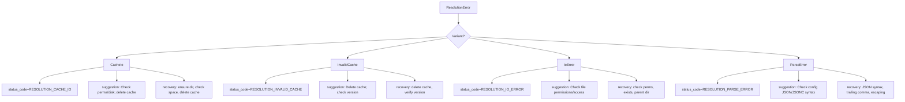

# project_resolver/mod.rs Review

## TL;DR

- 目的: 複数言語プロジェクトの設定解決における共通型（ハッシュとエラー）および下位モジュールの公開エントリを提供
- 主要公開API: Sha256Hash（Serialize/Deserialize可能なSHA-256新型）、ResolutionError（プログラム的に扱える安定コードを提供）、ResolutionResult（Resultエイリアス）、pub mod群
- コアロジック: ResolutionErrorの安定なstatus_code/suggestion/recovery_suggestionsのマッピング（4分岐のmatch）
- 複雑箇所: 例外ではないが、エラー型の設計（causeの扱い、序列化方針、構造化コード）に改善余地
- 重大リスク: IoErrorがStringのcauseでソースエラー連鎖が失われる可能性、status_codeがStringを返し不必要なアロケーション
- Rust安全性: unsafe未使用、所有権・借用は単純、Send/Syncは自動導出（Stringに準拠）
- 並行性/非同期: 該当なし（このチャンクには現れない）が、型はスレッド間共有に適合

## Overview & Purpose

本モジュールは「プロジェクト設定解決（tsconfig.json, pyproject.toml, go.mod など）」に関する上位レイヤの共通エントリを定義します。具体的には以下を提供します。

- 共通型
  - Sha256Hash: ハッシュの新型（Serialize/Deserialize可能）
  - ResolutionError: 解決処理で用いるエラー列挙と、安定なstatus_code/回復提案
  - ResolutionResult<T>: Resultエイリアス
- 下位モジュールの公開
  - memo, persist, provider, providers, registry, sha（中身はこのチャンクには現れない）

これらは「プロジェクト全体の設定をどう解決したか」という責務に対し、エラーを構造化し、キャッシュやプロバイダ、レジストリなどの具体的処理はpub modで分離する設計意図が伺えます。

## Structure & Key Components

| 種別 | 名前 | 公開範囲 | 責務 | 複雑度 |
|------|------|----------|------|--------|
| Module | memo | pub | 設定解決のメモ化/キャッシュ（推定） | 不明 |
| Module | persist | pub | 永続化（キャッシュの読み書き等、推定） | 不明 |
| Module | provider | pub | 単一プロバイダのインタフェース（推定） | 不明 |
| Module | providers | pub | 各言語別プロバイダ群（推定） | 不明 |
| Module | registry | pub | プロバイダ登録・解決ルーティング（推定） | 不明 |
| Module | sha | pub | ハッシュ計算ロジック（推定） | 不明 |
| Struct | Sha256Hash(String) | pub | SHA-256を16進文字列で保持する新型 | Low |
| Enum | ResolutionError | pub | 解決処理のエラーを型安全に表現 | Low |
| Type alias | ResolutionResult<T> | pub | Result<T, ResolutionError>の短縮 | Low |

短い抜粋（該当コードそのまま引用）:

```rust
#[derive(Debug, Clone, PartialEq, Eq, Hash, Serialize, Deserialize)]
pub struct Sha256Hash(pub String);

impl Sha256Hash {
    /// Get the hash as a string reference
    pub fn as_str(&self) -> &str {
        &self.0
    }

    /// Create from byte array (for testing)
    pub fn from_bytes(bytes: &[u8; 32]) -> Self {
        let hex = bytes.iter().map(|b| format!("{b:02x}")).collect::<String>();
        Self(hex)
    }
}
```

```rust
#[derive(Debug, thiserror::Error)]
pub enum ResolutionError {
    #[error("cache io error at '{path}': {source}")]
    CacheIo { path: PathBuf, #[source] source: std::io::Error },
    #[error("invalid cache: {details}")]
    InvalidCache { details: String },
    #[error("I/O error at '{path}': {cause}")]
    IoError { path: PathBuf, cause: String },
    #[error("Parse error: {message}")]
    ParseError { message: String },
}

impl ResolutionError {
    pub fn cache_io(path: PathBuf, source: std::io::Error) -> Self {
        Self::CacheIo { path, source }
    }
    pub fn invalid_cache(details: impl Into<String>) -> Self {
        Self::InvalidCache { details: details.into() }
    }
    pub fn suggestion(&self) -> &'static str { /* 4分岐のmatch */ }
    pub fn status_code(&self) -> String { /* 4分岐のmatch */ }
    pub fn recovery_suggestions(&self) -> Vec<&'static str> { /* 4分岐のmatch */ }
}
```

### Dependencies & Interactions

- 内部依存
  - Sha256Hashは独立。
  - ResolutionErrorはstd::io::Error（CacheIoのsource）に依存。
  - status_code/suggestion/recovery_suggestionsはResolutionErrorの各バリアントに対するmatch（4分岐）で振る舞いを決定。

- 外部依存（クレート・標準ライブラリ）

| 依存 | 用途 |
|------|------|
| serde::{Serialize, Deserialize} | Sha256Hashのシリアライズ/デシリアライズ |
| thiserror::Error | ResolutionErrorのエラー派生 |
| std::path::PathBuf | パス情報の受け渡し |
| std::io::Error | I/Oエラーのソース連鎖（CacheIo） |

- 被依存推定（このモジュールを利用しそうな箇所）
  - project_resolver::persist: キャッシュ永続化でResolutionError::CacheIo/InvalidCacheを利用
  - project_resolver::providers/*: 各言語設定の解析エラーでParseError/IoErrorを利用
  - project_resolver::registry: プロバイダの委譲でResolutionResult<T>を返却
  - project_resolver::sha: Sha256Hashの計算ユーティリティからSha256Hashを返す

## API Surface (Public/Exported) and Data Contracts

| API名 | シグネチャ | 目的 | Time | Space |
|-------|------------|------|------|-------|
| memo | pub mod memo | メモ化/キャッシュ機能公開（中身不明） | 不明 | 不明 |
| persist | pub mod persist | 永続化機能公開（中身不明） | 不明 | 不明 |
| provider | pub mod provider | プロバイダ抽象公開（中身不明） | 不明 | 不明 |
| providers | pub mod providers | プロバイダ実装群公開（中身不明） | 不明 | 不明 |
| registry | pub mod registry | プロバイダ登録/解決ルーティング（中身不明） | 不明 | 不明 |
| sha | pub mod sha | ハッシュ計算関連（中身不明） | 不明 | 不明 |
| Sha256Hash::as_str | fn as_str(&self) -> &str | 内部Stringの借用返却 | O(1) | O(1) |
| Sha256Hash::from_bytes | fn from_bytes(bytes: &[u8; 32]) -> Self | 32byteダイジェストから16進文字列へ | O(n=32) | O(1) |
| ResolutionError::cache_io | fn cache_io(path: PathBuf, source: std::io::Error) -> Self | CacheIoの簡便コンストラクタ | O(1) | O(1) |
| ResolutionError::invalid_cache | fn invalid_cache(details: impl Into<String>) -> Self | InvalidCacheの簡便コンストラクタ | O(len) | O(len) |
| ResolutionError::suggestion | fn suggestion(&self) -> &'static str | 単一の回復提案 | O(1) | O(1) |
| ResolutionError::status_code | fn status_code(&self) -> String | 安定なエラーコード（文字列） | O(1) | O(1) |
| ResolutionError::recovery_suggestions | fn recovery_suggestions(&self) -> Vec<&'static str> | 回復提案の複数候補 | O(k) | O(k) |
| ResolutionResult | type ResolutionResult<T> = Result<T, ResolutionError> | 共通Resultエイリアス | O(1) | O(1) |

以下、主要APIの詳細。

1) Sha256Hash::as_str
- 目的と責務: 内包する16進文字列を借用で返す。コピーを避け効率的に参照を提供。
- アルゴリズム: フィールド0番（String）への参照を返すだけ。
- 引数:
  - なし（&self）
- 戻り値:
  - &str: 内部文字列スライス
- 使用例:
```rust
let h = Sha256Hash("deadbeef".into());
assert_eq!(h.as_str(), "deadbeef");
```
- エッジケース:
  - 空文字列: そのまま空の&strを返す
  - 非UTF-8: Stringの保証により発生しない

2) Sha256Hash::from_bytes
- 目的と責務: 固定長32バイトのダイジェストから小文字16進文字列に変換し、新型を構築。
- アルゴリズム（ステップ）:
  1. bytes.iter()で各バイトを走査
  2. format!("{b:02x}")で2桁16進にフォーマット
  3. 連結してStringにcollect
- 引数:

| 名前 | 型 | 意味 |
|------|----|------|
| bytes | &[u8; 32] | SHA-256の32バイト配列参照 |

- 戻り値:

| 型 | 意味 |
|----|------|
| Sha256Hash | 16進文字列を格納する新型 |

- 使用例:
```rust
let bytes = [0u8; 32];
let h = Sha256Hash::from_bytes(&bytes);
assert_eq!(h.as_str().len(), 64);
assert!(h.as_str().chars().all(|c| c.is_ascii_hexdigit()));
```
- エッジケース:
  - 32バイト以外: コンパイル時に型不一致で弾かれる
  - 大文字/小文字: 常に小文字出力

3) ResolutionError::cache_io / invalid_cache
- 目的と責務: よく使うバリアントの簡便な構築子を提供。
- アルゴリズム: フィールド初期化のみ。
- 引数:

| 関数 | 引数 |
|------|------|
| cache_io | path: PathBuf, source: std::io::Error |
| invalid_cache | details: impl Into<String> |

- 戻り値: ResolutionError
- 使用例:
```rust
use std::path::PathBuf;
use std::fs::File;

fn read_cache(p: PathBuf) -> ResolutionResult<()> {
    File::open(&p).map_err(|e| ResolutionError::cache_io(p.clone(), e))?;
    Ok(())
}
```
- エッジケース:
  - detailsに巨大文字列: メモリ消費増。必要に応じてCow最適化を検討

4) ResolutionError::suggestion / status_code / recovery_suggestions
- 目的と責務: バリアントごとに人間可読な提案、安定コード、複数案を返す。
- アルゴリズム: 4分岐のmatchで固定文字列を返す。
- 引数: &self
- 戻り値:
  - suggestion: &'static str
  - status_code: String（安定コード。例: "RESOLUTION_CACHE_IO"）
  - recovery_suggestions: Vec<&'static str>
- 使用例:
```rust
let err = ResolutionError::InvalidCache { details: "mismatch".into() };
assert_eq!(err.status_code(), "RESOLUTION_INVALID_CACHE");
assert!(err.recovery_suggestions().iter().any(|s| s.contains("Delete")));
```
- エッジケース:
  - バリアント追加時: matchが非網羅になりコンパイルエラーで気付ける（安全）

5) ResolutionResult<T>
- 目的と責務: 一貫したResult型でAPI整合性を向上。
- 使用例:
```rust
fn resolve() -> ResolutionResult<Sha256Hash> {
    // ...
    Ok(Sha256Hash("...".into()))
}
```

## Walkthrough & Data Flow

典型的なデータフロー（推定）:
- provider/providersで言語別設定ファイルを探索・読み込み
- persistでキャッシュ読み書き（CacheIo/InvalidCacheを発生しうる）
- registryでプロバイダを選択しResolutionResult<T>を返す
- 上位レイヤではResolutionErrorからstatus_codeやsuggestionを抽出し、UIやJSONレスポンスに利用

エラー分岐の視覚化（4分岐のmatch。status_code/suggestion/recovery_suggestions共通の分岐構造）:



上記の図はResolutionErrorのstatus_code/suggestion/recovery_suggestions各関数の主要分岐を示す（行番号: このチャンクには明示なし）。

## Complexity & Performance

- Sha256Hash::as_str
  - 時間: O(1)
  - 空間: O(1)
- Sha256Hash::from_bytes
  - 時間: O(n)（n=32固定）
  - 空間: O(1)（64文字のString確保）
  - ボトルネック: format!("{:02x}")と32回の小String生成・連結が発生（iter.map(format!).collect::<String>()）。小規模だが不要なアロケーションがある
  - 改善: String::with_capacity(64) + push_str/ write! で連結、またはhexクレートのencode_to_sliceを利用
- ResolutionError関連
  - 時間/空間: いずれもO(1)（固定文字列/短いベクタ）

スケール限界/実運用負荷:
- 本チャンクの処理はCPU/メモリとも軽微。I/O/ネットワーク/DBは関与しない（このチャンクには現れない）

## Edge Cases, Bugs, and Security

エッジケース一覧:

| エッジケース | 入力例 | 期待動作 | 実装 | 状態 |
|-------------|--------|----------|------|------|
| Sha256Hash空 | Sha256Hash("".into()) | as_strが""を返す | as_str | 正常 |
| 32バイト以外 | &[u8]長さ≠32 | コンパイル不可 | from_bytesの型シグネチャ | 防止済 |
| InvalidCache大文字列 | detailsに巨大テキスト | メモリ消費増だが動作は正常 | invalid_cache | 要注意 |
| IoErrorの原因保持 | causeに元エラー | ソース連鎖でデバッグ容易 | IoErrorはStringのみ | 改善余地 |
| status_codeアロケーション | 全呼出しでString生成 | &'static strで十分 | status_code | 改善余地 |
| ParseErrorの文言 | TOML/他形式のとき | 文言が設定形式に整合 | suggestion文面はJSON/JSONC固定 | 改善余地 |

セキュリティチェックリスト:
- メモリ安全性
  - Buffer overflow / Use-after-free / Integer overflow: 発生箇所なし（unsafe未使用、format/collectは安全）
- インジェクション
  - SQL/Command/Path traversal: このチャンクには現れない。PathBufを抱えるのみ
- 認証・認可
  - 該当なし（このチャンクには現れない）
- 秘密情報
  - Hard-coded secrets: なし
  - Log leakage: Display/Debugの出力でハッシュ値は露出しうるが一般に問題低（ユースケース依存）
- 並行性
  - Race condition/Deadlock: 状態共有なし
  - Send/Sync: Sha256HashはStringベースのため自動でSend+Sync。ResolutionErrorもフィールドにPathBuf/String/std::io::ErrorのみでSend+Syncに適合

Rust特有の観点:
- 所有権/借用
  - as_strは&self→&str借用でコピー不要
  - from_bytesは所有するStringを構築しSelfに移動
- ライフタイム
  - 明示的ライフタイム不要
- unsafe境界
  - unsafe未使用
- 並行性・非同期
  - await境界/キャンセル: 該当なし
- エラー設計
  - Result vs Option: 失敗情報が重要なためResult採用は適切
  - panic箇所: unwrap/expect未使用
  - エラー変換: From/Into未実装。std::io::Error→ResolutionError::CacheIoはコンストラクタで対応

## Design & Architecture Suggestions

- ResolutionErrorのIoError改良
  - causeをStringではなく#[source] Box<dyn Error + Send + Sync + 'static>などで保持し、元エラー連鎖を維持する
  - あるいはstd::io::Errorを含める別バリアントに分離
- status_codeの戻り値を&'static strへ
  - 不要なアロケーションを回避し、定数として扱いやすくする
  - 例: pub const CODE_RESOLUTION_CACHE_IO: &str = "RESOLUTION_CACHE_IO";
- バリアント毎のビルダー統一
  - IoError/ParseErrorにも簡便コンストラクタを追加し、生成一貫性を向上
- ParseErrorの文言/提案を形式非依存に
  - TOML/YAML/JSONC等に応じて動的にメッセージを調整（呼出側でフォーマット名を渡すか、バリアントにFileTypeなどの情報を追加）
- Sha256Hash::from_bytesの効率化
  - String::with_capacity(64) + write!またはhexクレートのencode_to_sliceで一時Stringの生成を削減
- シリアライズポリシー
  - ResolutionErrorを外部公開のJSONに埋め込む運用があるなら、Serialize実装/DTOへの変換レイヤを設け、安定コード・メッセージ・提案を構造化して出力

## Testing Strategy (Unit/Integration) with Examples

ユニットテスト:
- Sha256Hash
  - from_bytesが期待通り64桁の小文字16進になる
  - as_strが借用である（ポインタ等価はテスト困難だが所有権移動がないことを静的に確認）
```rust
#[test]
fn hash_from_bytes_hex_lowercase() {
    let mut bytes = [0u8; 32];
    bytes[0] = 0xde; bytes[1] = 0xad; bytes[2] = 0xbe; bytes[3] = 0xef;
    let h = Sha256Hash::from_bytes(&bytes);
    assert_eq!(h.as_str().len(), 64);
    assert!(h.as_str().chars().all(|c| c.is_ascii_hexdigit() && c.is_ascii_lowercase()));
}
```

- ResolutionErrorのマッピング
  - 各バリアントに対しstatus_code/suggestion/recovery_suggestionsが期待通り
```rust
#[test]
fn error_status_and_suggestions() {
    use std::io;
    let e1 = ResolutionError::cache_io("cache/file".into(), io::Error::from(io::ErrorKind::Other));
    assert_eq!(e1.status_code(), "RESOLUTION_CACHE_IO");
    assert!(e1.suggestion().contains("Check permissions"));

    let e2 = ResolutionError::invalid_cache("bad version");
    assert_eq!(e2.status_code(), "RESOLUTION_INVALID_CACHE");
    assert!(e2.recovery_suggestions().iter().any(|s| s.contains("Delete")));
}
```

- 回帰テスト
  - バリアント追加時、status_code等が未更新だとコンパイルエラーになるため、追加の静的保証は不要。ただし、文字列定数が変更されないことのスナップショットテストを検討

プロパティテスト（任意）:
- from_bytes: 任意の32バイトに対して出力が長さ64で全て16進小文字である

統合テスト（このチャンクには現れない）:
- persistでの実ファイルI/OエラーがResolutionError::CacheIoとして伝播し、status_codeが期待通りであること

## Refactoring Plan & Best Practices

- APIの低コスト化
  - status_code: &'static strへ変更し、既存呼び出し側を置換
- エラー連鎖の改善
  - IoErrorのcauseを#[source]のエラー型へ変更し、?演算子連鎖の利便性を向上
  - ParseErrorに元の解析エラー（serde_json::Error/toml::de::Error等）を内部に保持できる余地を設ける（ただしこのチャンクには現れない）
- 表現の一般化
  - suggestion/recovery_suggestionsをファイル形式に応じて生成できるよう、ResolutionErrorにメタ情報を追加するか、呼出側で適切に拡張
- Sha256Hashの最適化実装
```rust
impl Sha256Hash {
    pub fn from_bytes(bytes: &[u8; 32]) -> Self {
        let mut s = String::with_capacity(64);
        for b in bytes {
            use std::fmt::Write;
            write!(&mut s, "{:02x}", b).unwrap();
        }
        Self(s)
    }
}
```
- 一貫性のための定数化
  - エラーコードをpub constに定義し、呼出側・テスト・ドキュメントで再利用

## Observability (Logging, Metrics, Tracing)

- ロギング
  - ResolutionErrorの表示はDisplayメッセージにpath等の文脈を含む（CacheIo/IoError）。ログにはstatus_codeを併記し、機械可読性を担保
  - 例: error!(code = err.status_code(), path = ?path, "{}", err);
- メトリクス
  - status_code単位でカウンタをインクリメント（resolution_errors_total{code}）
- トレーシング
  - 重要I/O境界（persist, providers）でspanを生成し、エラー発生時に記録。error.source()連鎖が有用になるようIoErrorを改善

## Risks & Unknowns

- 下位モジュールの詳細は不明（このチャンクには現れない）。実際のI/Oや並行処理がどのように扱われるかは未確認
- status_codeの安定性は文字列値に依存。変更管理ポリシー（バージョニング/テスト）が必要
- ParseErrorのメッセージ/提案がJSON/JSONC前提。pyproject.tomlやgo.modでは不適切な可能性
- エラーのシリアライズ方針は不明。外部公開するならDTO層の用意が望ましい