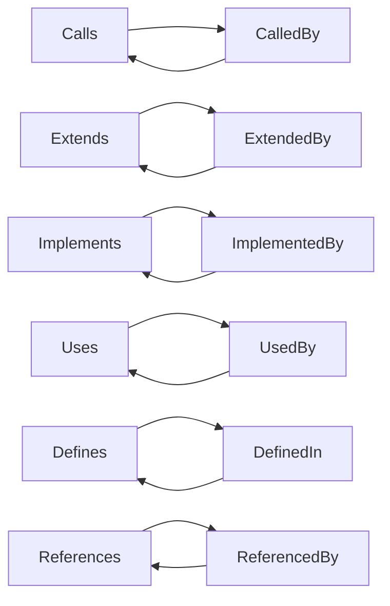

# relationship/mod.rs Review

## TL;DR

- 目的: コードシンボル間の関係（呼び出し・継承・実装・参照など）を表現するためのデータモデルとユーティリティを提供
- 主要公開API: RelationKindの分類/反転、Relationship/RelationshipMetadataのビルダー、RelationshipEdgeの生成、CompactRelationshipへの変換
- 複雑箇所: RelationKindの逆関係マッピング、CompactRelationshipのバイナリレイアウト（repr(C)・20バイト）
- 重大リスク: RelationKindをu8にキャストする暗黙の数値マッピングの脆さ、weightへの入力検証なし（NaN/∞/負値）、CompactRelationshipのID/offsetを0固定の曖昧さ
- 安全性: unsafeなし、所有権/借用はビルダーパターンで安全。並行性要件は不明（SymbolId次第）
- テスト: 基本的な作成・分類・逆関係・サイズ検証を網羅。デシリアライズやu8→RelationKindの逆変換テストは未実装
- 推奨改善: RelationKindにrepr(u8)とTryFrom<u8>実装、CompactRelationshipとの相互変換、weightのバリデーション

## Overview & Purpose

このモジュールは、コードベース内のシンボル間関係を型安全に扱うためのドメインモデルを提供します。関係の種類（呼び出す/呼び出される、継承/継承される、実装/実装される、参照/参照される、定義/定義されている）を列挙型で表現し、それらの重みや位置情報（行・列・コンテキスト文字列）を付加できます。また、FFIやバイナリストレージ向けに固定長のコンパクト表現（CompactRelationship）への変換もサポートしています。SymbolIdを用いた関係エッジ（source→target）を表現するための構造体も含まれます。

## Structure & Key Components

| 種別 | 名前 | 公開範囲 | 責務 | 複雑度 |
|------|------|----------|------|--------|
| Enum | RelationKind | pub | 関係種別の列挙（呼び出し/継承/実装/参照/定義） | Low |
| Struct | Relationship | pub（フィールドもpub） | 関係の属性（kind, weight, metadata） | Low |
| Struct | RelationshipMetadata | pub（フィールドもpub） | 位置と文脈（行/列/コンテキスト） | Low |
| Struct | CompactRelationship | pub（フィールドもpub, repr(C)） | バイナリ/FFI用の固定長レコード | Low |
| Struct | RelationshipEdge | pub（フィールドもpub） | source/targetとRelationshipからなるグラフのエッジ | Low |

### Dependencies & Interactions

- 内部依存
  - RelationshipEdgeはRelationshipとSymbolIdに依存
  - RelationshipはRelationKindとRelationshipMetadataに依存
  - CompactRelationshipはRelationshipから生成されうる（to_compact）
- 外部依存（クレート/モジュール）
  | 依存 | 用途 |
  |------|------|
  | serde::{Serialize, Deserialize} | モデルのシリアライズ/デシリアライズ（Relationship, RelationshipMetadata, RelationKind） |
  | crate::types::SymbolId | エッジのノードID型（詳細不明） |
- 被依存推定
  - コールグラフ構築、コードインデックス、関係分析、可視化層、ストレージ層（CompactRelationship）

## API Surface (Public/Exported) and Data Contracts

| API名 | シグネチャ | 目的 | Time | Space |
|-------|-----------|------|------|-------|
| RelationKind::inverse | fn inverse(&self) -> Self | 関係の逆種別を返す | O(1) | O(1) |
| RelationKind::is_hierarchical | fn is_hierarchical(&self) -> bool | 継承/実装系か判定 | O(1) | O(1) |
| RelationKind::is_usage | fn is_usage(&self) -> bool | 呼び出し/使用/参照系か判定 | O(1) | O(1) |
| Relationship::new | fn new(kind: RelationKind) -> Self | 既定重み1.0/metadataなしで生成 | O(1) | O(1) |
| Relationship::with_weight | fn with_weight(self, weight: f32) -> Self | 重みを設定（ビルダー） | O(1) | O(1) |
| Relationship::with_metadata | fn with_metadata(self, metadata: RelationshipMetadata) -> Self | メタデータ設定（ビルダー） | O(1) | O(1) |
| Relationship::to_compact | fn to_compact(&self) -> CompactRelationship | コンパクト表現へ変換（ID/offsetは0） | O(1) | O(1) |
| RelationshipMetadata::new | fn new() -> Self | 既定（None）で生成 | O(1) | O(1) |
| RelationshipMetadata::at_position | fn at_position(self, line: u32, column: u16) -> Self | 行・列を設定（ビルダー） | O(1) | O(1) |
| RelationshipMetadata::with_context | fn with_context(self, context: impl Into<Box<str>>) -> Self | コンテキスト文字列を設定（所有） | O(len) | O(len) |
| RelationshipEdge::new | fn new(source: SymbolId, target: SymbolId, relationship: Relationship) -> Self | エッジを生成 | O(1) | O(1) |

以下、各APIの詳細:

1) RelationKind::inverse
- 目的と責務: 対象の関係種別の逆関係（Calls↔CalledBy, Extends↔ExtendedBy, Implements↔ImplementedBy, Uses↔UsedBy, Defines↔DefinedIn, References↔ReferencedBy）を返す
- アルゴリズム:
  - matchで全バリアントに対応する逆を返す
- 引数
  | 名 | 型 | 説明 |
  |----|----|------|
  | self | &RelationKind | 変換元の関係種別 |
- 戻り値
  | 型 | 説明 |
  |----|------|
  | RelationKind | 逆関係種別 |
- 使用例
  ```rust
  let k = RelationKind::Calls;
  assert_eq!(k.inverse(), RelationKind::CalledBy);
  ```
- エッジケース
  - 列挙子追加時にmatchが未網羅になる可能性（コンパイルエラーで検出可）
  - 数値化（u8）と整合性が取れている必要あり（to_compactに影響）

2) RelationKind::is_hierarchical
- 目的と責務: 継承/実装系かどうかを判定
- アルゴリズム:
  - matches!で Extends/ExtendedBy/Implements/ImplementedBy を真とする
- 引数/戻り値
  | 名 | 型 | 説明 |
  |----|----|------|
  | self | &RelationKind | 対象 |
  | ret | bool | 継承系ならtrue |
- 使用例
  ```rust
  assert!(RelationKind::Extends.is_hierarchical());
  assert!(!RelationKind::Defines.is_hierarchical());
  ```
- エッジケース
  - 新種別が継承系に追加される場合は更新必要

3) RelationKind::is_usage
- 目的と責務: 呼び出し/使用/参照系かどうかを判定
- アルゴリズム:
  - matches!で Calls/CalledBy/Uses/UsedBy/References/ReferencedBy を真とする
- 引数/戻り値は上記同様
- 使用例
  ```rust
  assert!(RelationKind::Calls.is_usage());
  assert!(!RelationKind::Defines.is_usage());
  ```
- エッジケース
  - 新種別追加時の分類の更新漏れ

4) Relationship::new
- 目的と責務: 関係の基本インスタンス生成（weight=1.0, metadata=None）
- アルゴリズム: フィールド初期化のみ
- 引数/戻り値
  | 名 | 型 | 説明 |
  |----|----|------|
  | kind | RelationKind | 関係種別 |
  | ret | Relationship | 生成結果 |
- 使用例
  ```rust
  let r = Relationship::new(RelationKind::Calls);
  assert_eq!(r.weight, 1.0);
  assert!(r.metadata.is_none());
  ```
- エッジケース
  - weightの初期値変更要件がある場合は影響大

5) Relationship::with_weight
- 目的と責務: ビルダーパターンで重みを設定
- アルゴリズム: self.weightに代入してselfを返す
- 引数/戻り値
  | 名 | 型 | 説明 |
  |----|----|------|
  | self | Self | 所有権を受け取り更新 |
  | weight | f32 | 重み（仕様不明: 範囲/単位） |
  | ret | Self | 更新後 |
- 使用例
  ```rust
  let r = Relationship::new(RelationKind::Extends).with_weight(0.8);
  ```
- エッジケース
  - NaN/∞/負値の扱い未定義

6) Relationship::with_metadata
- 目的と責務: ビルダーパターンでメタデータを設定
- アルゴリズム: self.metadata = Some(metadata)
- 引数/戻り値
  | 名 | 型 | 説明 |
  |----|----|------|
  | self | Self | 所有権を受け取り更新 |
  | metadata | RelationshipMetadata | 添付メタ |
  | ret | Self | 更新後 |
- 使用例
  ```rust
  let md = RelationshipMetadata::new().at_position(10, 5).with_context("inside main");
  let r = Relationship::new(RelationKind::Calls).with_metadata(md);
  ```
- エッジケース
  - metadataサイズが大きい場合の扱い（シリアライズ可能）

7) Relationship::to_compact
- 目的と責務: CompactRelationshipへの変換（現在はID/offset不明のため0で初期化）
- アルゴリズム:
  - kindをu8へキャスト
  - weightをそのままコピー
  - source_id/target_id/metadata_offsetは0固定
- 引数/戻り値
  | 名 | 型 | 説明 |
  |----|----|------|
  | self | &Self | 参照 |
  | ret | CompactRelationship | コンパクト表現 |
- 使用例
  ```rust
  let r = Relationship::new(RelationKind::Calls).with_weight(0.5);
  let c = r.to_compact();
  assert_eq!(c.kind, RelationKind::Calls as u8);
  ```
- エッジケース
  - enum→u8の順序依存（追加/並べ替えで破壊的変更）
  - 0のID/offsetの意味付けが曖昧

8) RelationshipMetadata::new
- 目的と責務: デフォルトNoneで生成
- 引数/戻り値は省略（O(1)）
- 使用例
  ```rust
  let m = RelationshipMetadata::new();
  assert!(m.line.is_none());
  ```

9) RelationshipMetadata::at_position
- 目的と責務: 行/列を設定
- 引数/戻り値
  | 名 | 型 | 説明 |
  |----|----|------|
  | self | Self | 所有権を受け取り更新 |
  | line | u32 | 行番号（0/1開始かは仕様不明） |
  | column | u16 | 列番号 |
  | ret | Self | 更新後 |
- 使用例
  ```rust
  let m = RelationshipMetadata::new().at_position(10, 5);
  ```

10) RelationshipMetadata::with_context
- 目的と責務: コンテキスト文字列を所有（Box<str>）して設定
- アルゴリズム: Into<Box<str>>で所有権を取得
- 引数/戻り値
  | 名 | 型 | 説明 |
  |----|----|------|
  | self | Self | 所有権を受け取り更新 |
  | context | impl Into<Box<str>> | 文字列（String/str） |
  | ret | Self | 更新後 |
- 使用例
  ```rust
  let m = RelationshipMetadata::new().with_context("call site");
  ```

11) RelationshipEdge::new
- 目的と責務: グラフのエッジ生成
- 引数/戻り値
  | 名 | 型 | 説明 |
  |----|----|------|
  | source | SymbolId | ソースシンボルID |
  | target | SymbolId | ターゲットシンボルID |
  | relationship | Relationship | 関係情報 |
  | ret | RelationshipEdge | 生成結果 |
- 使用例
  ```rust
  // SymbolIdの詳細はcrate側に依存
  let src = SymbolId::new(1).unwrap();
  let dst = SymbolId::new(2).unwrap();
  let edge = RelationshipEdge::new(src, dst, Relationship::new(RelationKind::Calls));
  ```

データ契約（構造体の公開フィールド）
- Relationship { kind: RelationKind, weight: f32, metadata: Option<RelationshipMetadata> }
- RelationshipMetadata { line: Option<u32>, column: Option<u16>, context: Option<Box<str>> }
- CompactRelationship { source_id: u32, target_id: u32, kind: u8, weight: f32, metadata_offset: u32 }
- RelationshipEdge { source: SymbolId, target: SymbolId, relationship: Relationship }

## Walkthrough & Data Flow

- RelationshipEdgeはグラフのエッジを表し、source/targetにSymbolId、payloadとしてRelationshipを持ちます
- Relationshipは関係種別（RelationKind）と重み（f32）、任意のメタデータ（RelationshipMetadata）を保持します
- RelationshipMetadataは位置（line/column）やテキスト文脈（Box<str>）を保持します
- Relationship::to_compactは、関係の一部（kind/weight）をCompactRelationshipにコピーし、source_id/target_id/metadata_offsetは0で初期化します（現段階では埋める責務が別コンポーネントにある前提と推測）
- RelationKind::inverse/is_hierarchical/is_usageは関係種別の分類/変換ロジックを提供し、上位の分析や可視化処理で利用されます

Mermaid図（RelationKind::inverseの主要マッピング）:

上記の図は`RelationKind::inverse`関数（行番号: 不明）の主要マッピングを示す。

## Complexity & Performance

- 時間計算量: すべてのAPIはO(1)。文字列コンテキスト設定（with_context）は入力長に比例してO(len)のコピー/割当
- 空間計算量: O(1)（メタデータのBox<str>生成はO(len)）
- ボトルネック:
  - 大量のエッジ作成時、コンテキスト文字列の割当がヒープ負荷となりうる
  - CompactRelationshipへの変換は軽量だが、ID/offsetの埋め込みが別段階に必要で、二段階処理になる可能性
- スケール限界:
  - メタデータのテキストサイズが大きい場合、総メモリ使用量が増加
  - RelationKind→u8キャストが外部プロトコルと合わないとシリアル化/保存の互換性問題

## Edge Cases, Bugs, and Security

- メモリ安全性
  - Buffer overflow / Use-after-free: 該当なし（安全なRustのみ、所有権は明確）
  - Integer overflow: line(u32), column(u16), kind(u8)使用。外部からの値は受け取るが演算はしないためオーバーフローリスク低
- インジェクション
  - SQL/Command/Path traversal: 該当なし
  - context文字列はログ/表示されうるが、このモジュール単体では不正使用はなし
- 認証・認可
  - 該当なし（データモデルのみ）
- 秘密情報
  - Hard-coded secrets: なし
  - Log leakage: contextに機密が入る可能性は上位層の運用次第。マスキング方針は上位層で必要
- 並行性
  - Race condition / Deadlock: 該当なし（共有可変状態なし）
  - Send/Sync: Relationship/RelationshipMetadata/CompactRelationshipは基本的にSend+Syncですが、RelationshipEdgeのSend/SyncはSymbolIdの特性に依存（不明）
- 既知/潜在バグ
  - RelationKindをu8にキャストする設計（to_compact）は、列挙子の順序/追加に脆弱。外部表現と整合しなくなる恐れ
  - Relationship::to_compactでsource_id/target_id/metadata_offsetが0固定。0の意味（未設定/有効ID）が曖昧
  - weightの検証なし。負値/NaN/∞を許してしまう

詳細エッジケース一覧:

| エッジケース | 入力例 | 期待動作 | 実装 | 状態 |
|-------------|--------|----------|------|------|
| weightが負値 | -0.5 | 拒否/クリップ/許容の定義 | 現状そのまま設定 | 仕様不明 |
| weightがNaN | f32::NAN | エラー/拒否/除外 | そのまま設定 | 要検討 |
| weightが∞ | f32::INFINITY | エラー/拒否/除外 | そのまま設定 | 要検討 |
| column上限 | u16::MAX | 許容か検証か | そのまま設定 | 許容（検証なし） |
| kindの数値化 | RelationKind as u8 | 安定な番号付け | 列挙順依存 | 脆弱 |
| CompactのID/offset | 0 | 未設定の意味 | 0固定で返す | 曖昧 |
| context巨大 | "A".repeat(10MB) | メモリ使用増加に留意 | Box<str>で所有 | メモリ負荷 |

## Design & Architecture Suggestions

- RelationKindに明示的な数値表現
  - enumに`#[repr(u8)]`を付与し、「外部仕様と一致する番号付け」をドキュメント化
  - `impl TryFrom<u8> for RelationKind`を実装して逆変換を安全に提供（未知値はErr）
- CompactRelationshipとの相互変換
  - `impl From<&Relationship> for CompactRelationship`（現行と同等）
  - `fn from_compact(source_id: u32, target_id: u32, compact: CompactRelationship) -> RelationshipEdge`などを設計
  - metadata_offsetの意味（別ストレージへのポインタ/インデックス）を仕様化し、Option型と整合取る
- 重みのドメイン制約
  - 重みの範囲（例: 0.0..=1.0）を仕様化し、設定時に検証（NaN/∞拒否）
  - 必要なら`NonNaN<f32>`のようなnewtypeを導入
- シリアライズの互換性
  - serdeの`#[serde(rename_all = "snake_case")]`などで安定した文字列表現を明示
  - CompactRelationshipはSerialize/Deserializeを付与せずFFI専用に徹するか、別モジュール化
- ドキュメント/コメントの充実
  - 行/列の起点（0/1）と意味付け、weightの意味、0のID/offsetの意味を明示

## Testing Strategy (Unit/Integration) with Examples

- 単体テストの拡充
  - RelationKindの逆変換の双方向性/冪等性
  - is_hierarchical/is_usageの完全網羅と新規列挙子追加時の失敗検知
  - to_compactのkind/weightが一致すること、0初期化の仕様確認
  - weightにNaN/∞/負値を設定した場合の振る舞い（期待仕様を決めた上で）
  - serdeラウンドトリップ（Relationship/RelationshipMetadata/RelationKind）

- 例（ラウンドトリップ）
  ```rust
  use serde_json;

  let md = RelationshipMetadata::new().at_position(42, 7).with_context("call site");
  let rel = Relationship::new(RelationKind::References).with_weight(0.3).with_metadata(md);

  let json = serde_json::to_string(&rel).unwrap();
  let back: Relationship = serde_json::from_string(&json).unwrap();
  assert_eq!(back.kind, RelationKind::References);
  assert_eq!(back.weight, 0.3);
  assert_eq!(back.metadata.as_ref().unwrap().line, Some(42));
  ```

- 例（TryFrom<u8>を導入した場合のテスト案）
  ```rust
  // 仮のAPI: TryFrom<u8> for RelationKind を導入した場合
  assert_eq!(RelationKind::try_from(RelationKind::Calls as u8).unwrap(), RelationKind::Calls);
  assert!(RelationKind::try_from(255).is_err()); // 未知値
  ```

- 例（weightのバリデーション導入時）
  ```rust
  // 仮のAPI: with_weightがResultを返す場合
  assert!(Relationship::new(RelationKind::Uses).with_weight(f32::NAN).is_err());
  ```

## Refactoring Plan & Best Practices

- Builderメソッドの受け取りと返却
  - 現状の`self`所有を受け取るスタイルはOK。併用して`&mut self`版のAPIも用意すると柔軟（チェーンと逐次更新の両立）
- RelationKindとCompactRelationshipの整合性
  - `#[repr(u8)]`＋`TryFrom<u8>`で順序依存を排除
  - CompactRelationshipへの変換にID/offsetを受け取り可能な関数を追加し、ゼロ初期化の曖昧さを解消
- 明示的なドメイン型
  - weightの新型（例: NormalizedWeight）で不正値を型レベルで防止
  - 行/列の新型（Line(u32), Column(u16)）で意味付けとバリデーション
- エラーハンドリング
  - バリデーションを導入するAPIは`Result<_, Error>`にし、エラー型を`thiserror`などで定義
- ドキュメント
  - 各フィールド/メソッドにrustdoc（///）で仕様補足

## Observability (Logging, Metrics, Tracing)

- 本モジュールは純粋データ型のため、ロギングは不要が基本
- メタデータcontextは観測情報になり得るが、この層でログするより上位の処理で収集すべき
- メトリクス提案
  - 作成されたRelationshipEdge数、種別分布、weightの統計は上位で計測すると分析に有用
- トレーシング
  - 変換（to_compact）や保存時にspanを付与するのは呼び出し元で実施

## Risks & Unknowns

- SymbolIdの仕様不明
  - Send/Sync特性、IDの0の有効性、生成/検証ロジックはこのチャンクには現れない
- weightの意味/範囲
  - 正規化有無、比較/集約方法の仕様が不明
- metadata_offsetの意味
  - 外部ストレージインデックスか、オフセットバイト数か、未設定の表現かが不明
- シリアライズ形式の互換性
  - RelationKindのserde表現（文字列/内部表現）はデフォルトのまま。外部契約が不明
- 行番号/列番号の起点
  - 0/1開始やUTF-8の列定義などは不明

以上により、公開APIは軽量で安全ですが、外部とのプロトコル整合性（enumの数値化）、weight/offsetの仕様策定と検証が重要な改善ポイントです。