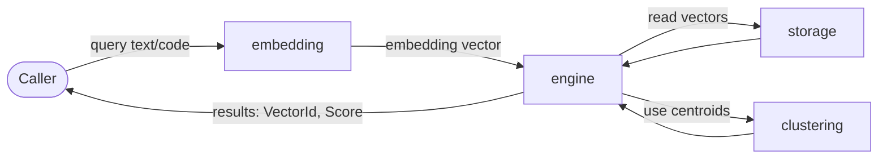

# vector/mod.rs Review

## TL;DR

- 目的: コードインテリジェンス向けの高速ベクター検索を提供するトップレベルモジュール。IVFFlat＋K-meansクラスタリング、メモリマップ（mmap）ストレージの採用（モジュールコメント L12-L15）。
- 公開API: clustering/embedding/engine/storage/types からの再エクスポートで構成。特に VectorSearchEngine、ConcurrentVectorStorage、MmapVectorStorage、kmeans_clustering、cosine_similarity、EmbeddingGenerator 等（L24-L37）。
- 複雑箇所: 検索エンジン（engine）、クラスタリング（clustering）、並行ストレージ（storage）が高複雑度。具体実装はこのチャンクには現れないため詳細は不明。
- 重大リスク: mmap を伴う低レベルアクセスや並行更新による安全性・整合性リスクが潜在。unsafe の有無・使用条件は不明だが、注意が必要。
- データ契約: ベクター次元（VECTOR_DIMENSION_384）や ID/Score 型が公開されるため、次元不一致や ID の整合性が契約上の重要点。
- テスト方針: 公開APIの可用性・シグネチャ安定性のコンパイルテスト、モデルパースの負例テスト、類似度・クラスタリングの数値的特性テストが推奨（実装は不明）。
- パフォーマンス: 「<1μs/ベクター」「<10ms 検索」が目標（L6-L10）。IVFFlatによりサブリニア検索が意図されるが、実測は不明。

## Overview & Purpose

このファイルは「vector」モジュールのルートであり、ベクター検索機能の公開窓口です。モジュールコメント（L3-L5）にある通り、既存の Tantivy ベースのテキスト検索と統合される高性能なベクターストレージ／検索機能を提供します。設計面では IVFFlat（Inverted File with Flat vectors）インデックスと K-means クラスタリングを用い（L13-L15）、メモリマップ（mmap）を介した常時ロード可能・低オーバーヘッドなストレージが想定されています。性能目標は、<1μs/ベクターアクセス、~100B/シンボル、10k+ ファイル/秒のインデックス、<10ms のセマンティック検索レイテンシ（L6-L10）。

このファイル自体にロジックは含まれておらず、下位モジュールの宣言（L17-L21）と公開APIの再エクスポート（L24-L37）のみです。

## Structure & Key Components

| 種別 | 名前 | 公開範囲 | 責務 | 複雑度 |
|------|------|----------|------|--------|
| Module | clustering | 非公開（re-exportあり） | K-means、類似度計算、クラスタ割当 | High |
| Module | embedding | 非公開（re-exportあり） | 埋め込み生成、モデルパース、シンボルテキスト生成 | Med |
| Module | engine | 非公開（re-exportあり） | ベクター検索のコアエンジン | High |
| Module | storage | 非公開（re-exportあり） | メモリマップ／並行アクセスのベクターストレージ | High |
| Module | types | 非公開（re-exportあり） | ID、次元、スコア、エラー型等のデータ契約 | Low |
| Symbol | VectorSearchEngine | pub（L33） | 検索エンジンの公開エントリポイント | High |
| Symbol | ConcurrentVectorStorage | pub（L34） | 並行安全なストレージ | High |
| Symbol | MmapVectorStorage | pub（L34） | mmap バックエンドのストレージ | High |
| Symbol | VectorStorageError | pub（L34） | ストレージ関連エラー | Med |
| Symbol | kmeans_clustering | pub（L24-L26） | K-means 実行 | High |
| Symbol | assign_to_nearest_centroid | pub（L24-L26） | セントロイドへの割当 | Med |
| Symbol | cosine_similarity | pub（L24-L26） | コサイン類似度計算 | Low |
| Symbol | EmbeddingGenerator | pub（L29-L32） | 埋め込み生成器（詳細不明） | Med |
| Symbol | FastEmbedGenerator | pub（L29-L32） | 高速な埋め込み生成器（詳細不明） | Med |
| Symbol | create_symbol_text | pub（L29-L32） | 入力からテキスト生成（詳細不明） | Low |
| Symbol | model_to_string | pub（L29-L32） | モデル表現の文字列化（詳細不明） | Low |
| Symbol | parse_embedding_model | pub（L29-L32） | モデル文字列のパース | Med |
| Symbol | MockEmbeddingGenerator | #[cfg(test)] pub（L27-L28） | テスト用モック（テスト時のみ公開） | Low |
| Symbol | ClusterId / VectorId / SegmentOrdinal | pub（L35-L37） | ID・セグメント識別 | Low |
| Symbol | Score | pub（L35-L37） | スコア表現 | Low |
| Symbol | VectorDimension / VECTOR_DIMENSION_384 | pub（L35-L37） | ベクター次元（定数を含む） | Low |
| Symbol | VectorError / ClusteringError | pub（L24-L26, L35-L37） | エラー型 | Med |
| Symbol | KMeansResult | pub（L24-L26） | K-means 結果 | Med |

### Dependencies & Interactions

- 内部依存（推定・このチャンクには現れない）
  - engine は storage（読み取り・書き込み）、types（ID/Score/次元）、clustering（インデックス作成・検索）、embedding（クエリやドキュメントの埋め込み）に依存している可能性が高い。
- 外部依存（不明）
  - Tantivy 統合はモジュールコメントで言及（L3-L5）されるが、このチャンク内にクレート名や実際の use はない。
  - mmap の実体（memmap2 等）もこのチャンクには現れない。
- 被依存推定
  - 上位の検索 API、コードインテリジェンス機能、インデクサ、サービスレイヤから vector::VectorSearchEngine 等が利用される可能性が高い。

## API Surface (Public/Exported) and Data Contracts

以下はこのファイルで再エクスポートされる公開API一覧です。シグネチャはこのチャンクには現れないため不明と記します。

| API名 | シグネチャ | 目的 | Time | Space |
|-------|-----------|------|------|-------|
| VectorSearchEngine | 不明 | ベクター検索の主要エンジン | 不明 | 不明 |
| ConcurrentVectorStorage | 不明 | 並行安全なベクターストレージ | 不明 | 不明 |
| MmapVectorStorage | 不明 | mmap ベースのベクターストレージ | 不明 | 不明 |
| VectorStorageError | 不明 | ストレージ関連のエラー | - | - |
| kmeans_clustering | 不明 | K-means を実行してクラスタを得る | 不明 | 不明 |
| assign_to_nearest_centroid | 不明 | 各ベクターを最近傍セントロイドに割当 | 不明 | 不明 |
| cosine_similarity | 不明 | 2ベクターのコサイン類似度 | 不明 | 不明 |
| EmbeddingGenerator | 不明 | 埋め込み生成器（トレイト/型は不明） | 不明 | 不明 |
| FastEmbedGenerator | 不明 | 高速埋め込み生成器 | 不明 | 不明 |
| create_symbol_text | 不明 | シンボルから埋め込み用テキストを生成 | 不明 | 不明 |
| model_to_string | 不明 | 埋め込みモデルの文字列化 | 不明 | 不明 |
| parse_embedding_model | 不明 | 埋め込みモデル文字列のパース | 不明 | 不明 |
| MockEmbeddingGenerator | 不明（#[cfg(test)]） | テスト用埋め込み生成器 | - | - |
| ClusterId | 不明 | クラスタID型 | - | - |
| VectorId | 不明 | ベクターID型 | - | - |
| SegmentOrdinal | 不明 | セグメント識別用序数 | - | - |
| Score | 不明 | 評価スコア | - | - |
| VectorDimension | 不明 | ベクター次元表現 | - | - |
| VECTOR_DIMENSION_384 | const（詳細不明） | 既定のベクター次元定数（384） | - | - |
| VectorError | 不明 | ベクター処理関連エラー | - | - |
| ClusteringError | 不明 | クラスタリング関連エラー | - | - |
| KMeansResult | 不明 | K-means 結果 | - | - |

以下、主なAPIの詳細は名称から推測される一般的責務のみ記述し、具体のシグネチャや挙動は「不明」とします。

1) VectorSearchEngine
- 目的と責務: ベクター検索の受付、クエリ埋め込み、近傍探索、スコアリングを統合する中心コンポーネント（L33）。
- アルゴリズム: IVFFlat＋K-means に基づくインデックス活用によるサブリニア検索が意図（L13-L15）。具体的ステップは不明。
- 引数: 不明（このチャンクには現れない）。
- 戻り値: 不明。
- 使用例:
  ```rust
  use crate::vector::VectorSearchEngine;
  // 具体的な構築・検索メソッドはこのチャンクには現れないため不明
  ```
- エッジケース:
  - ベクター次元の不一致
  - 空クエリやゼロベクター
  - ストレージ未初期化

2) ConcurrentVectorStorage / MmapVectorStorage
- 目的と責務: ベクターの格納・取得、永続化／メモリマップの扱い、並行安全性の提供（L34）。
- アルゴリズム: 不明。mmap を用いた読み出しが想定（L15）。
- 使用例:
  ```rust
  use crate::vector::{ConcurrentVectorStorage, MmapVectorStorage};
  // 具体的なAPIは不明
  ```
- エッジケース:
  - ファイル破損・不正なアラインメント
  - ベクター次元不一致
  - 競合更新による整合性問題

3) kmeans_clustering / assign_to_nearest_centroid / cosine_similarity
- 目的と責務: K-means の実行、セントロイド割当、類似度計算（L24-L26）。
- 使用例:
  ```rust
  use crate::vector::{kmeans_clustering, assign_to_nearest_centroid, cosine_similarity};
  // 具体的な引数と返り値は不明
  ```
- エッジケース:
  - k がデータ点数より大きい
  - ゼロベクターの正規化問題
  - 収束しないデータセット

4) EmbeddingGenerator / FastEmbedGenerator / create_symbol_text / model_to_string / parse_embedding_model
- 目的と責務: 埋め込みの生成とモデル管理、テキスト前処理（L29-L32）。
- 使用例:
  ```rust
  use crate::vector::{EmbeddingGenerator, FastEmbedGenerator, parse_embedding_model, create_symbol_text};
  // シグネチャは不明
  ```
- エッジケース:
  - 未対応モデル文字列
  - 空文字のテキスト生成
  - モデル名の前方後方空白や大文字小文字差異

5) types 群（ClusterId, VectorId, SegmentOrdinal, Score, VectorDimension, VECTOR_DIMENSION_384, VectorError, ClusteringError, KMeansResult）
- 目的と責務: データ契約（ID、次元、スコア、エラー）を明確化（L35-L37）。
- 注意: ベクター次元の整合性と ID のスコープ管理が契約上の重要ポイント。

## Walkthrough & Data Flow

このチャンクに実装はないため、データフローは概念的推定に留まります。

- 概念フロー（推定）
  - 入力（クエリテキスト/コード）→ embedding（埋め込み生成）→ engine（検索）→ storage（ベクター読み出し）→ clustering（インデックス・近傍探索補助）→ 結果（Score, VectorId 等）



## Complexity & Performance

- 理論的複雑度（推定）
  - kmeans_clustering: 典型的には O(n * k * i)（n: データ数、k: クラスタ数、i: 反復回数）。詳細は不明。
  - cosine_similarity: O(d)（d: ベクター次元）。
  - 検索（IVFFlat）: 典型的には探索対象をクラスタで絞り込むため、線形探索よりサブリニアだが、実装詳細とパラメータは不明。
- スペース複雑度（推定）
  - ベクターストレージ: O(n * d)。メモリマップにより常駐メモリ削減が意図される（L15）。
- ボトルネック（推定）
  - 埋め込み生成の計算コスト
  - mmap IO のページフォールト
  - k-means の再計算（インデックス更新時）
- スケール限界（推定）
  - 非常に大規模データではクラスタ数・探索候補数の調整が必要。
  - 書き込み並行性が高いワークロードでロック競合が発生する可能性。

## Edge Cases, Bugs, and Security

セキュリティチェックリストに基づく評価。実装はこのチャンクには現れないため具体は不明です。

- メモリ安全性
  - Buffer overflow / Use-after-free / Integer overflow: Rust では型安全だが、mmap やバイナリレイアウトの扱いで unsafe が関与する可能性。詳細不明。
  - ベクター次元不一致による out-of-bounds アクセスのリスク。VectorDimension/VECTOR_DIMENSION_384 の契約順守が重要。
- インジェクション
  - SQL/Command/Path traversal: 該当なし（このチャンクには現れない）。ストレージのファイルパス処理は不明。
- 認証・認可
  - 該当なし（このチャンクには現れない）。APIはローカルライブラリ想定。
- 秘密情報
  - Hard-coded secrets: 該当なし。
  - Log leakage: Observability はこのチャンクには現れない。
- 並行性
  - Race condition / Deadlock: ConcurrentVectorStorage の内部実装は不明。ロック粒度・順序の設計次第でデッドロックや飢餓が起きうる。

詳細なエッジケース一覧（実装・状態は不明）:

| エッジケース | 入力例 | 期待動作 | 実装 | 状態 |
|-------------|--------|----------|------|------|
| ベクター次元不一致 | d=512 のクエリ vs VECTOR_DIMENSION_384 | Err(VectorError) | 不明 | 不明 |
| cosine_similarity のゼロベクター | [0,..,0], [1,0,..] | 定義済みの扱い（0 または Err） | 不明 | 不明 |
| k がデータ点数より大 | k=1000, n=100 | Err(ClusteringError) or 調整 | 不明 | 不明 |
| parse_embedding_model の無効文字列 | "unknown-model" | Err or Default | 不明 | 不明 |
| create_symbol_text の空文字 | "" | Err or 空を許容 | 不明 | 不明 |
| mmap ファイル破損 | 破損バイト列 | Err(VectorStorageError) | 不明 | 不明 |

## Design & Architecture Suggestions

- 公開面の整流化
  - 現在の re-export は有用。将来的に「prelude」モジュールを設け、一般利用者向けの最小セット（Engine, Storage, types, basic functions）をまとめると可読性が向上。
- データ契約の明文化
  - VectorDimension と VECTOR_DIMENSION_384 の関係・検証ロジックを API レベルで強化（不一致時の明確なエラー）。
- エラー統一
  - VectorError / ClusteringError / VectorStorageError の階層化・変換（From/Into）でエラー伝播を簡潔化。
- 並行性設計
  - ConcurrentVectorStorage のロック戦略・非同期境界（Send/Sync）をドキュメント化。読み取りの lock-free 手法が可能なら検討。
- Tantivy との結合度
  - エンジン API にテキスト検索との結合ポイント（シンボルID、セグメント）を明確に露出し、疎結合を維持。

## Testing Strategy (Unit/Integration) with Examples

- コンパイル時 API 可用性テスト
  ```rust
  // tests/public_api.rs
  use crate::vector::{
      VectorSearchEngine,
      ConcurrentVectorStorage,
      MmapVectorStorage,
      kmeans_clustering,
      cosine_similarity,
      EmbeddingGenerator,
      FastEmbedGenerator,
      create_symbol_text,
      model_to_string,
      parse_embedding_model,
      ClusterId, VectorId, SegmentOrdinal, Score, VectorDimension, VECTOR_DIMENSION_384,
      VectorError, VectorStorageError, ClusteringError, KMeansResult,
  };

  #[test]
  fn public_api_symbols_are_accessible() {
      // 再エクスポートが壊れていないことを確認（参照だけで十分）
      let _ = VECTOR_DIMENSION_384;
  }

  #[cfg(test)]
  #[test]
  fn test_only_mock_is_available_in_tests() {
      use crate::vector::MockEmbeddingGenerator;
      let _ = std::any::TypeId::of::<MockEmbeddingGenerator>();
  }
  ```
- 負例テスト（推奨）
  - parse_embedding_model に未知モデル文字列を渡して Err を確認（具体実装は不明）。
  - cosine_similarity でゼロベクターを扱うときの挙動を確認（Err or 0）。
  - kmeans_clustering で不正パラメータ（k > n）時にエラーか調整が行われるか確認。
- 統合テスト（推奨）
  - MmapVectorStorage に格納→ VectorSearchEngine で検索→ Score/VectorId の妥当性を検証（実装は不明のため概念的提案）。

## Refactoring Plan & Best Practices

- 名前と層の整理
  - engine/storage/embedding/clustering/types の責務を README や Rustdoc に明記。
- API 安定性
  - 破壊的変更を避けるため公開型・関数のシグネチャにバージョニング方針を適用。
- 型安全の強化
  - VectorId/ClusterId を Newtype で厳密管理（既に types にあるが、利用規約の明記）。
  - 次元付きベクター型（PhantomData で d を持つ等）で次元不一致をコンパイル時検知する設計も検討。
- エラー取り扱い
  - Result と Option の使い分け基準を統一。panic（unwrap/expect）はライブラリ内部で避け、明示的エラーを返す。
- ドキュメント
  - モジュールコメントの性能目標に対し、測定方法とプロファイルのリンクを追加。

## Observability (Logging, Metrics, Tracing)

- ロギング
  - インデックス構築開始/完了、クラスタ収束、ストレージ開閉、mmap リマップなどの重要イベントを info レベルで。
- メトリクス
  - 検索レイテンシ、ヒット率、近傍探索数、mmap ページフォールト率（OS依存で難しいが可能なら）を収集。
- トレーシング
  - VectorSearchEngine の主要操作に span を付与し、embedding → engine → storage → clustering の流れを追跡可能にする。
- 機密保護
  - ログに実データ（コード断片や埋め込みベクター値）を出し過ぎないようサンプリング・匿名化。

## Risks & Unknowns

- 実装不明点
  - 具体的な関数シグネチャ、所有権/借用設計、unsafe の有無、Send/Sync 境界、await の位置、キャンセル対応などはこのチャンクには現れないため不明。
- 互換性
  - Tantivy との整合やバイナリフォーマット（mmap）の互換性は記述がない。
- パフォーマンス保証
  - モジュールコメントに性能目標はあるが、実測・プロファイル・パラメータ（クラスタ数、プローブ数）は不明。
- エラー設計
  - VectorError/ClusteringError/VectorStorageError 間の関係と透過的なエラー変換の有無が不明。
- 並行性
  - ConcurrentVectorStorage のロック戦略やデータ競合対策、デッドロック回避方針は不明。

以上は vector/mod.rs の再エクスポート情報とモジュールコメントに基づくレビューです。具体ロジックは各サブモジュールに存在するため、このチャンクでは「不明」とした項目が多数あります。実装確認は clustering.rs、embedding.rs、engine.rs、storage.rs、types.rs のソースが必要です。