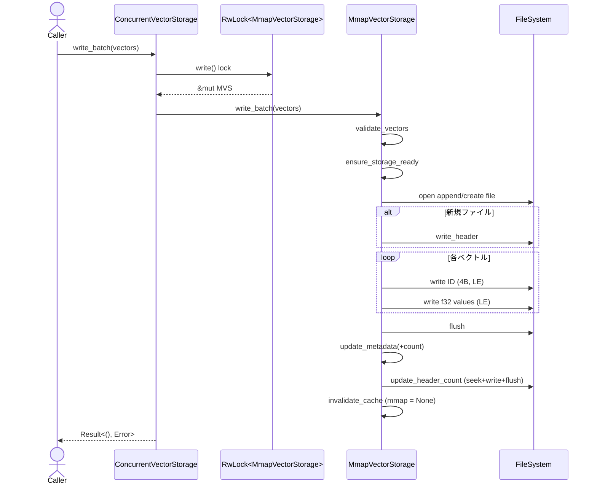

# vector/storage.rs Review

## TL;DR

- 目的: メモリマップを用いて埋め込みベクトルを高速に永続化・取得するシンプルなストレージを提供
- 主要公開API: MmapVectorStorage::{open_or_create, write_batch, read_vector, read_all_vectors}, ConcurrentVectorStorage::{read_vector, write_batch}
- コアロジック: 固定ヘッダ(16B) + 反復的な [ID(u32) + f32配列] のバイナリフォーマットをmmapで読み、ID線形走査でベクトルを取得
- 重大リスク:
  - read_vectorがO(N)線形走査であり、大規模データでは<1µsは不可能（索引なし）
  - ConcurrentVectorStorage::read_vectorが誤ってwrite()ロックを取得し、同時読取不可（ドキュメントと不一致）
  - ベクタ件数・次元をu32にエンコードしておりオーバーフロー検査なし（usize→u32縮退）
  - 書き込み途中クラッシュ時、ヘッダのvector_countと実体が不整合になりうる（復旧/検証なし）
  - 他プロセス/インスタンスによる外部更新を検知/再マップできない（単一プロセス内でのラップあり）

## Overview & Purpose

このモジュールは、セグメント単位のベクトル（埋め込み）をメモリマップ（memmap2）で高速に読み書きするためのストレージを提供します。フォーマットは固定ヘッダ+連続した[ID, f32…]で、書込みは追記のみ、読み出しはmmapしたメモリの線形走査で実現します。OSページキャッシュの恩恵を受け、起動時のオーバーヘッドを最小化します。

用途:
- 高速な一括書込み（write_batch）
- 特定IDのベクトル取得（read_vector）
- 全ベクトルの一括読み出し（read_all_vectors）
- スレッドセーフな利用（ConcurrentVectorStorageラッパ）

## Structure & Key Components

| 種別 | 名前 | 公開範囲 | 責務 | 複雑度 |
|------|------|----------|------|--------|
| Const | STORAGE_VERSION | private | ストレージフォーマットのバージョン | Low |
| Const | HEADER_SIZE | private | ヘッダサイズ(16B) | Low |
| Const | MAGIC_BYTES | private | マジック "CVEC" | Low |
| Const | BYTES_PER_F32 | private | f32のバイト数(4) | Low |
| Const | BYTES_PER_ID | private | ID(u32)のバイト数(4) | Low |
| Enum | VectorStorageError | pub | ストレージ層のエラー種別 | Low |
| Struct | MmapVectorStorage | pub | セグメント1つ分のmmapベクトルストレージ | Med |
| Struct | ConcurrentVectorStorage | pub | MmapVectorStorageのスレッドセーフラッパ | Low |

内部主要関数（private）
- segment_path: パス生成
- initialize: 空ファイル作成とヘッダ書込み
- write_header/read_header: ヘッダの入出力（mmapからの読み）
- ensure_mapped: mmapの遅延マッピング
- ensure_storage_ready: 親ディレクトリ作成
- validate_vectors: 次元検証
- append_vectors: 追記（IDとf32列をLEで書込）
- update_metadata/update_header_count: 件数フィールド更新
- invalidate_cache: mmapを捨てて次回読みで再マップ

### Dependencies & Interactions

- 内部依存（呼び出し関係の要点）
  - MmapVectorStorage::write_batch → validate_vectors → ensure_storage_ready → append_vectors → update_metadata → update_header_count → invalidate_cache
  - read_vector/read_all_vectors → ensure_mapped → read_header（vector_count更新）
  - open → read_header（フォーマット検証, バージョン一致確認）
- 外部依存（抜粋）

| クレート/モジュール | 用途 | 備考 |
|--------------------|------|------|
| memmap2::{Mmap, MmapOptions} | ファイルのメモリマッピング | unsafe境界あり |
| thiserror::Error | エラーderive | VectorStorageError |
| parking_lot::RwLock | 同期原語 | ConcurrentVectorStorage |
| std::fs::{File, OpenOptions} | ファイルI/O | 書込み・読み込み |
| std::io::{Write, Seek} | 書込み/シーク | ヘッダ更新 |
| crate::vector::types | 型 | SegmentOrdinal, VectorDimension, VectorId, VectorError（詳細は不明） |

- 被依存推定
  - 上位の検索/近傍探索コンポーネントやインデクサが本モジュールを使用する可能性が高いが、このチャンクには現れない（不明）。

## API Surface (Public/Exported) and Data Contracts

| API名 | シグネチャ | 目的 | Time | Space |
|-------|-----------|------|------|-------|
| VectorStorageError | enum VectorStorageError | ストレージエラー表現 | - | - |
| MmapVectorStorage::new | fn new(base_path, segment, dimension) -> Result<Self, VectorStorageError> | 新規ストレージ構造体の作成（未初期化） | O(1) | O(1) |
| MmapVectorStorage::open | fn open(base_path, segment) -> Result<Self, VectorStorageError> | 既存ファイルを開きmmapする | O(1) | O(1) |
| MmapVectorStorage::open_or_create | fn open_or_create(base_path, segment, dimension) -> Result<Self, VectorStorageError> | 既存ならopen、無ければ初期化 | O(1) | O(1) |
| MmapVectorStorage::write_batch | fn write_batch(&mut self, vectors: &[(VectorId, &[f32])]) -> Result<(), VectorStorageError> | ベクトル一括追記 | O(K·D) | O(K·D) 入力コピー |
| MmapVectorStorage::read_vector | fn read_vector(&mut self, id: VectorId) -> Option<Vec<f32>> | IDでベクトル取得（線形走査） | O(N + D) | O(D) |
| MmapVectorStorage::read_all_vectors | fn read_all_vectors(&mut self) -> Result<Vec<(VectorId, Vec<f32>)>, VectorStorageError> | 全件読み出し | O(N·D) | O(N·D) |
| MmapVectorStorage::vector_count | fn vector_count(&self) -> usize | ヘッダ由来の件数 | O(1) | O(1) |
| MmapVectorStorage::dimension | fn dimension(&self) -> VectorDimension | 次元取得 | O(1) | O(1) |
| MmapVectorStorage::segment | fn segment(&self) -> SegmentOrdinal | セグメント番号 | O(1) | O(1) |
| MmapVectorStorage::exists | fn exists(&self) -> bool | ファイル存在判定 | O(1) | O(1) |
| MmapVectorStorage::file_size | fn file_size(&self) -> Result<u64, io::Error> | ファイルサイズ取得 | O(1) | O(1) |
| ConcurrentVectorStorage::new | fn new(storage: MmapVectorStorage) -> Self | RwLockで包む | O(1) | O(1) |
| ConcurrentVectorStorage::read_vector | fn read_vector(&self, id: VectorId) -> Option<Vec<f32>> | 共有読取（実装は実際writeロック） | O(N + D) | O(D) |
| ConcurrentVectorStorage::write_batch | fn write_batch(&self, vectors) -> Result<(), VectorStorageError> | 排他書込み | O(K·D) | O(K·D) |

Data Contracts（このチャンクで観測できる不変条件/仕様）
- ファイルフォーマット
  - ヘッダ(16B): [MAGIC(4)="CVEC", VERSION(u32), DIMENSION(u32), COUNT(u32)]
  - レコード: [ID(u32, little-endian), f32×DIMENSION（全てlittle-endian）]
- VectorDimension: validate_vector(slice)で長さ一致を検証する想定（validate_vectorsで利用; 関数: validate_vectors, 行番号不明）
- VectorId: to_bytes()[4] で書込み、from_bytes([u8;4]) で読取り（LE想定）
- COUNTはu32で格納。usizeとの縮退・上限検証は本実装では無し（update_header_count, 行番号不明）

以下、主要APIの詳細（代表的なもの）

1) MmapVectorStorage::open_or_create
- 目的と責務: 既存ストレージを開くか、無ければ新規作成+ヘッダ初期化
- アルゴリズム
  1. segment_pathでパス生成
  2. 存在チェック exists
  3. 存在すればopen、無ければnew → initialize → Ok
- 引数
  | 名前 | 型 | 意味 |
  |------|----|------|
  | base_path | impl AsRef<Path> | ベースディレクトリ |
  | segment | SegmentOrdinal | セグメント番号 |
  | dimension | VectorDimension | ベクトル次元 |
- 戻り値
  | 型 | 説明 |
  |----|------|
  | Result<Self, VectorStorageError> | ストレージ |
- 使用例
  ```rust
  let dir = std::path::PathBuf::from("/tmp/vecs");
  let seg = SegmentOrdinal::new(0);
  let dim = VectorDimension::new(128).unwrap();
  let mut storage = MmapVectorStorage::open_or_create(&dir, seg, dim).unwrap();
  ```
- エッジケース
  - ディレクトリ作成不可（権限/存在しない親）→ Ioエラー
  - 既存ファイルのヘッダ破損 → InvalidFormat または VersionMismatch

2) MmapVectorStorage::write_batch
- 目的と責務: ベクトルを一括追記し、ヘッダの件数を更新
- アルゴリズム
  1. 入力[(VectorId, &[f32])]をVec<f32>にコピー（owned化）しvalidate_vectorsで長さ検証
  2. ensure_storage_readyで親ディレクトリ作成
  3. append_vectorsでファイルopen(append)→必要ならヘッダ初期化→ID+f32 LEで順次write→flush
  4. update_metadataでvector_countに加算→update_header_count（COUNT更新）→invalidate_cache（mmap破棄）
- 引数
  | 名前 | 型 | 意味 |
  |------|----|------|
  | vectors | &[(VectorId, &[f32])] | 追記するベクトル一覧 |
- 戻り値
  | 型 | 説明 |
  |----|------|
  | Result<(), VectorStorageError> | 成否 |
- 使用例
  ```rust
  let pairs: Vec<(VectorId, &[f32])> = vec![
      (VectorId::new(1).unwrap(), &[1.0,2.0,3.0,4.0]),
      (VectorId::new(2).unwrap(), &[5.0,6.0,7.0,8.0]),
  ];
  storage.write_batch(&pairs).unwrap();
  ```
- エッジケース
  - ベクトル長不一致 → VectorError→VectorStorageErrorに変換
  - ファイルI/O失敗 → Io
  - 件数u32オーバーフロー → 現状未検出で切り捨て（バグの可能性）

3) MmapVectorStorage::read_vector
- 目的と責務: 指定IDのレコードをmmap上で線形走査して見つけたら返す
- アルゴリズム
  1. ensure_mappedでmmap準備（未マップならファイルopen+MmapOptions::map）
  2. HEADER_SIZEから順にvector_sizeステップで走査
  3. ID一致でf32値をLEで復元してVec<f32>で返す
- 引数
  | 名前 | 型 | 意味 |
  |------|----|------|
  | id | VectorId | 検索ID |
- 戻り値
  | 型 | 説明 |
  |----|------|
  | Option<Vec<f32>> | 見つかればSome、無ければNone |
- 使用例
  ```rust
  if let Some(v) = storage.read_vector(VectorId::new(2).unwrap()) {
      assert_eq!(v.len(), storage.dimension().get());
  }
  ```
- エッジケース
  - mmap未初期化 → ensure_mapped内部で初期化
  - 部分的/破損データ → 走査条件(offset + vector_size <= mmap.len())で範囲外を避ける

4) MmapVectorStorage::read_all_vectors
- 目的と責務: 全レコードを読み出し、(VectorId, Vec<f32>)のVecで返す
- アルゴリズム
  1. ensure_mapped
  2. HEADER_SIZEから末尾までvector_size刻みで反復
  3. 各IDはVectorId::from_bytesで検証、各f32をLEで復元
- 引数: なし
- 戻り値
  | 型 | 説明 |
  |----|------|
  | Result<Vec<(VectorId, Vec<f32>)>, VectorStorageError> | 全件 |
- 使用例
  ```rust
  let all = storage.read_all_vectors().unwrap();
  for (id, vec) in all { /* ... */ }
  ```
- エッジケース
  - IDデコード失敗 → InvalidFormat("Invalid vector ID")

5) ConcurrentVectorStorage::{new, read_vector, write_batch}
- 目的: RwLockで包みスレッド間共有
- 注意: read_vectorがself.inner.write()でwriteロックを取得しており、同時読取を阻害（ドキュメントと不一致、バグ）
- 使用例
  ```rust
  let conc = ConcurrentVectorStorage::new(storage);
  let got = conc.read_vector(VectorId::new(1).unwrap());
  conc.write_batch(&pairs).unwrap();
  ```

型（Data Contracts）
- SegmentOrdinal: get()で数値取得（segment_pathで使用）
- VectorDimension: new(usize)->Result, get()->usize, validate_vector(&[f32])->Result（推測）
- VectorId: new(u32)->Result, get()->u32, to_bytes()->[u8;4], from_bytes([u8;4])->Option（推測）
- VectorError: VersionMismatch{expected, actual}等（openで使用）

不明点
- VectorId::to_bytesのエンディアン仕様（このチャンクには現れない）
- VectorDimension/VectorIdの具体的バリデーション内容（このチャンクには現れない）

## Walkthrough & Data Flow

処理の全体像（主なフロー）

- 初期化/オープン
  - open_or_create: パス生成→存在チェック→open or initialize（ヘッダ書込）→構造体返す
  - open: File::open→unsafe MmapOptions::map→read_headerでMAGIC/バージョン/次元/件数検証

- 書込み（write_batch）
  - 入力検証: validate_vectorsで次元一致
  - パス準備: ensure_storage_ready（親ディレクトリ作成）
  - 追記: append_vectorsでOpenOptions::append→新規ならヘッダ書込み→ID, f32値（LE）逐次write→flush
  - メタ更新: update_metadataでvector_count増→update_header_count（ヘッダCOUNT更新）→invalidate_cache（次回readで再mmap）

- 読み出し（read_vector/read_all_vectors）
  - マップ: ensure_mapped（未マップならFile::open+MmapOptions::map→read_headerでvector_count更新）
  - 取得: read_vectorは[HEADER_SIZE..]をvector_size刻みで線形走査しID一致なら値復元
  - 全件: read_all_vectorsは全レコードを復元しVecに詰めて返す（vector_countは容量のヒントのみ）

シーケンス図（ConcurrentVectorStorage::write_batch呼び出しの流れ）



上記の図は`ConcurrentVectorStorage::write_batch`および`MmapVectorStorage::write_batch`（行番号不明）の主要フローを示す。

## Complexity & Performance

- 書込み write_batch: O(K·D) 時間（K件・各D要素のf32書込み）。空間は入力をVecにコピーして検証するためO(K·D)の追加メモリを一時的に使用。
- 単一取得 read_vector: O(N + D) 時間（NレコードをID比較で線形走査、ヒット時にD要素復元）。空間O(D)。
- 全件取得 read_all_vectors: O(N·D) 時間、O(N·D) 空間。
- オープン/マップ: O(1)。

ボトルネック・スケール限界
- ID索引が無いためread_vectorは線形走査。Nが大きいと遅くなる（<1µsは小規模/ページキャッシュ前提でのみ成立）。
- write_batchの入力コピーが大きいとメモリ圧迫。
- ヘッダCOUNTがu32で、>4,294,967,295件を扱えない（サイレント縮退の危険）。

運用負荷要因
- I/O: 追記とflush、ヘッダ更新（seek+write）のI/Oが発生。
- OSページキャッシュ: 性能はOSキャッシュ依存。初回アクセスのページフォールトがスパイク要因。
- 競合: ConcurrentVectorStorageがreadにもwriteロックを用いておりスループットが低下。

## Edge Cases, Bugs, and Security

セキュリティ/堅牢性チェックリスト
- メモリ安全性
  - unsafe: MmapOptions::mapの使用（open/ensure_mappedで1箇所ずつ、行番号不明）。mmap対象ファイルの寿命・サイズが不変であることが前提。appendによりファイル拡張後は再マップが必要→invalidate_cacheで対応。ただし他プロセスによる更新は検知不可。
  - バッファ境界: mmap参照はoffset + vector_size <= mmap.len()で範囲検査済み（read_vector/read_all_vectors）。
  - 整数オーバーフロー: vector_count(usize)をu32でヘッダ書込み（update_header_count）。上限超え検知なし。
- インジェクション
  - SQL/Command/Path traversal: パスはformat!("segment_{}.vec", segment.get())固定形式。外部未検証入力を使用する箇所なし。
- 認証・認可
  - 本モジュールはストレージIOのみで認可なし。
- 秘密情報
  - 秘密情報のログ/ハードコード無し。
- 並行性
  - ConcurrentVectorStorage::read_vectorがwriteロック使用（self.inner.write()）で同時読取不可。ドキュメント「Allows concurrent read access」と不一致。バグ。
  - 同一プロセス内の一貫性: write_batch後にinvalidate_cacheするため、同インスタンスは次回読みで再マップする。しかし別インスタンス/別プロセスによる追記は検知しない。

詳細エッジケース一覧

| エッジケース | 入力例 | 期待動作 | 実装 | 状態 |
|-------------|--------|----------|------|------|
| ヘッダ不足 | 0〜15Bの壊れたファイル | InvalidFormat("File too small…") | read_header | OK |
| マジック不一致 | 先頭4B≠"CVEC" | InvalidFormat("Invalid magic bytes") | read_header | OK |
| バージョン不一致 | version≠1 | VectorError::VersionMismatch→Err | open | OK |
| 次元不正 | dim=0や大きすぎる | VectorDimension::newがErr | read_header | OK（外部型依存） |
| COUNTと実体不一致 | COUNT=100だが実データ80 | 読み出しはファイル末尾まで読む/COUNTはヒント | read_all_vectors | OK（実害小） |
| ベクトル長不一致 | D=3だがlen=2 | Err(VectorError) | validate_vectors | OK |
| ID重複 | 同一IDを複数追記 | 最初にヒットしたレコードを返す | read_vector | 仕様未定（現挙動は先勝ち） |
| u32上限超過 | 件数がu32::MAX+1 | 期待: Err or 防止 | 実装: サイレント縮退の恐れ | 要修正 |
| 追記中クラッシュ | ボディ書込後COUNT未更新 | 起動時にread_allは末尾まで読み可、COUNTは不一致 | 現状のまま | 受容/改善余地 |
| 別プロセス更新 | 他プロセスが追記 | 現インスタンスは再マップしない | 未対応 | 制約 |

Rust特有の観点
- 所有権/借用
  - write_batchは&mut selfで可変借用中にI/Oを実施。外部共有不可。ConcurrentVectorStorage側でwriteロックを要求。
- ライフタイム
  - Mmapは構造体のフィールドに所有され、Fileはマッピング時一時的に開くだけ。memmap2はFileのライフタイム不要。
- unsafe境界
  - unsafe { MmapOptions::map(&file) }（open/ensure_mapped）。不変条件: ファイルディスクリプタが有効、ファイルサイズがマッピング範囲以上、読み取り専用マップ。
- Send/Sync
  - MmapVectorStorageは自身ではスレッドセーフではない（mmapがOptionで&mut selfを必要）。ConcurrentVectorStorageでRwLock保護。
- 非同期/await
  - 非同期は不使用。ブロッキングI/O。
- エラー設計
  - VectorStorageErrorにIo/InvalidFormat/Vectorの3種。thiserrorでFrom実装済み。
  - ConcurrentVectorStorage::write_batchは元エラーをIo(Error::other)で包み直し、情報が失われる（要改善）。
- panic
  - ライブラリコードにunwrap/expectなし（テストはunwrapあり）。

## Design & Architecture Suggestions

- インデックス導入でO(1)検索
  - 起動時にID→オフセットのインデックス（HashMapやBTreeMap）を構築、または別ファイルに永続化（ID順offset、二分探索/メモリマップ可）。
  - write_batch時にインデックス追記。
- ConcurrentVectorStorageの同時読取対応
  - MmapVectorStorage::read_vector, read_all_vectorsを&selfに変更し、mmapフィールドはOnceCell<RwLock<Mmap>>などで内的に保護。readはreadロック、writeはwriteロックでinvalidate。
  - もしくはConcurrentVectorStorage::read_vectorでread()ロックを取得できるようにAPI/内部設計を見直す。
- COUNT/u32制限の明示と検証
  - 追記前にself.vector_count + batch_len <= u32::MAXを検証してErr返却。
  - 必要ならヘッダ仕様をu64に拡張（後方互換バージョンアップ）。
- エンディアンの明文化
  - VectorId::to_bytesがLEであることを明確化（必要ならto_le_bytes APIに変更）。書込み側も常にLE。
- 書込みの堅牢化
  - 2段階コミット: ボディ追記→COUNT更新→fsync、またはフッタ（終端シグネチャ+カウント）を導入して不整合検出。
  - BufWriter使用でシステムコール回数削減。
- 入力コピー削減
  - validate_vectorsは&[f32]に対する検証だけで可能。owned_vectorsへのコピーを不要化し、直接書込み（to_le_bytesをその場で出力）。
- APIのエラー透過性向上
  - ConcurrentVectorStorage::write_batchのmap_errでIo::otherに押し込めるのを廃止し、元のVectorStorageErrorを返す。
- マルチプロセス/他インスタンス更新検知
  - ファイルサイズやmtimeの監視で再マップトリガー、または明示的なrefresh() APIを提供。
- 大規模向け最適化
  - SIMD/unsafe bytemuckでf32スライスを一括LE書込み/読み込み（安全性の根拠を明示）。
  - read_vector時、IDだけを先読みして比較（現状通り）だが、プリフェッチやブロック単位のスキャン最適化も検討。

## Testing Strategy (Unit/Integration) with Examples

既存テスト（このチャンク内）
- test_storage_create_and_open: new後openが失敗（未初期化）を確認
- test_write_and_read_vectors: write_batch→read_vectorでラウンドトリップ
- test_read_all_vectors: 全件読み出し
- test_dimension_validation: 次元不一致でエラー
- test_persistence_across_instances: 別インスタンスでの読み出し
- test_vector_access_performance: 1000件での中央値レイテンシ測定（<100µs）

追加推奨テスト
- 壊れたヘッダ/マジック/バージョン不一致
  ```rust
  #[test]
  fn corrupted_header_is_rejected() {
      let dir = tempfile::TempDir::new().unwrap();
      let path = dir.path().join("segment_0.vec");
      std::fs::write(&path, b"BAD!").unwrap();
      assert!(MmapVectorStorage::open(&dir, SegmentOrdinal::new(0)).is_err());
  }
  ```
- COUNT不一致（ボディのみ追記）
  ```rust
  #[test]
  fn inconsistent_count_still_reads_all() {
      // 手動でファイル生成: ヘッダCOUNT=1、実体2件
      // read_all_vectorsが2件返ること、vector_count()==1であることを確認
  }
  ```
- u32上限境界
  ```rust
  // vector_countがu32::MAX付近のときに追記しようとするとErrを返すように変更後のテスト
  ```
- 大規模Nでのread_vector性能退行（索引がない現状の限界報告）
- ConcurrentVectorStorageの同時読取（readロックで並行可にした後のテスト）
- 異常系I/O（権限なし、ディスクフル）でのエラー伝播

## Refactoring Plan & Best Practices

- API整形
  - read_vector/read_all_vectorsを&self化。mmapをOnceCell<parking_lot::RwLock<Mmap>>に変更。
  - ConcurrentVectorStorage::read_vectorはinner.read()を使用し、&self APIに適合。
- 安全な再マップ
  - invalidate_cacheは内部のRwLockのwriteロックでNoneにし、ensure_mappedはreadロックで既存mmapを利用、未初期化時のみwriteで作成。
- エラー
  - ConcurrentVectorStorage::write_batchのmap_errを削除し、元エラーをそのまま返す。
- COUNTのu32チェックを追加
  ```rust
  let new_count = self.vector_count.checked_add(vectors.len())
      .ok_or_else(|| VectorStorageError::InvalidFormat("vector_count overflow".into()))?;
  if new_count > u32::MAX as usize {
      return Err(VectorStorageError::InvalidFormat("vector_count exceeds u32".into()));
  }
  ```
- 入力コピー削減
  ```rust
  // write_batch内
  self.validate_vectors_ref(vectors)?;
  self.append_vectors_ref(vectors)?;
  ```
- I/O最適化
  - BufWriter<File>でまとめ書き
  - f32スライスを小さなバッファに詰めてwrite_all回数を削減
- 将来の索引
  - .idxファイル（ID昇順で(offset, id)）を用意し、read_vectorで二分探索→O(log N)→mmapで直接復元

## Observability (Logging, Metrics, Tracing)

- ログ（tracing）
  - open/open_or_create/initializeでinfo
  - write_batch開始/完了、ベクトル件数、所要時間をdebug
  - ensure_mappedでマップ生成/再マップをdebug
  - 例
    ```rust
    use tracing::{info, debug, warn, error};
    // write_batch内
    let start = std::time::Instant::now();
    debug!("write_batch start: {} vectors", vectors.len());
    // ...処理...
    debug!("write_batch done in {:?}", start.elapsed());
    ```
- メトリクス
  - 書込み件数、読み出し件数、再マップ回数、read_vectorのレイテンシ分位（p50/p95）
- トレース
  - write_batchとread_all_vectorsはスパンで囲みI/O境界を可視化

## Risks & Unknowns

- リスク
  - 索引なし線形走査によるスケール不全
  - u32カウント制限によるサイレントなデータ破壊/不整合
  - ConcurrentVectorStorageの誤ロックでスループット低下
  - 書込み途中クラッシュでCOUNT不整合（データ喪失はないがメタがズレる）
  - 他プロセスでの追記/変更の未検知
- 不明
  - VectorId/VectorDimension/SegmentOrdinal/VectorErrorの正確な仕様（このチャンクには現れない）
  - VectorId::to_bytesのエンディアン契約（このチャンクには現れない）
  - 想定最大N/D、永続化の耐障害要件、索引設計の存在可否（このチャンクには現れない）