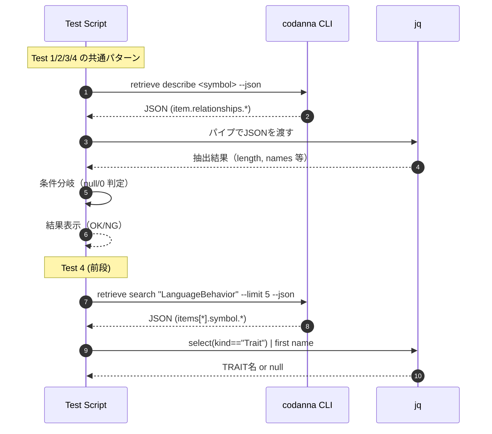

# cli/test_describe_relationships.sh Review

## TL;DR

- 目的: CLIツール**codanna**の「retrieve describe/search」APIが返す**relationships**（defines/called_by/calls/implemented_by）をJSONで検証する簡易インテグレーションスモークテスト。
- 公開API: 本スクリプト自体は公開APIなし。外部APIとして**codanna retrieve describe/search**と**jq**を利用。JSONのデータ契約は「.item.relationships.*」と「.items[*].symbol.*」。
- 複雑箇所: パイプラインの**エラー伝播**（pipefail未設定）、**null/0の判定**、シンボル名の**曖昧一致**によるテスト不安定化。
- 重大リスク: codanna/jq未インストールや異常終了が検出されない、**フレーク**（trait未発見をfailにしない）、**JSONスキーマ変更**に脆弱。
- セキュリティ: 変数のクォートは概ね適切。コマンドインジェクションは低リスク。ただし**strict mode未使用**で予期せぬ挙動の可能性。
- 改善: set -Eeuo pipefail、共通ヘルパー関数化、1テスト=1回のcodanna呼び出し、**exit codeによる失敗判定**、JSONスキーマ検証、CI向けレポート（TAP/JUnit）。

## Overview & Purpose

このBashスクリプトは、codanna CLIの「retrieve describe/search」機能が各種シンボル（Struct/Function/Method/Trait）間の**関係情報（relationships）**を正しく返すかを、簡易に確認するためのものです。具体的には以下を検証します。

- Struct: relationships.defines にメソッドが列挙されるか
- Function/Method: relationships.called_by / relationships.calls が適切に出るか
- Trait: relationships.implemented_by が実装の数を返すか

目的は網羅的なユニットテストではなく、変更やリグレッションに対するスモークチェックです。

## Structure & Key Components

| 種別 | 名前 | 公開範囲 | 責務 | 複雑度 |
|------|------|----------|------|--------|
| Script | cli/test_describe_relationships.sh | N/A | codannaのrelationshipsをJSONで検査し結果を表示 | Low |
| Variable | CODANNA | file-local | codannaバイナリのパス指定 | Low |
| Test Block | Test 1 (Struct: OutputManager) | file-local | definesの件数と一部メソッド名の表示 | Low |
| Test Block | Test 2 (Function: index_file) | file-local | called_by/callsの件数出力とcalls>0の判定 | Low |
| Test Block | Test 3 (Method: new) | file-local | called_by/callsの件数をJSONで表示 | Low |
| Test Block | Test 4 (Trait: LanguageBehavior) | file-local | search→describeでimplemented_byの件数出力 | Low |

### Dependencies & Interactions

- 内部依存:
  - 環境変数的役割の**CODANNA**を各テストブロックで使用。
  - 同一シンボルに対して複数回codannaを呼び出し、**jq**で異なるフィールドを抽出（重複I/O）。
- 外部依存:

| 依存 | 用途 | 必須 | 備考 |
|------|------|------|------|
| codanna (./target/release/codanna) | describe/searchエンドポイントの呼出 | Yes | バイナリパスは固定文字列 |
| jq | JSON抽出 | Yes | length, map, select, -rを使用 |
| bash | シェル | Yes | POSIX+拡張、strict mode未使用 |

- 被依存推定:
  - CIジョブや開発者のローカル検証から本スクリプトを起動する可能性が高いが、呼出元はこのチャンクには現れない（不明）。

## API Surface (Public/Exported) and Data Contracts

本スクリプト自体の公開APIはありません。以下は本スクリプトが前提として利用する外部CLIの契約（推測可能な最小限のデータ契約）です。

| API名 | シグネチャ | 目的 | Time | Space |
|-------|-----------|------|------|-------|
| codanna retrieve describe | codanna retrieve describe <symbol> --json | シンボルの詳細とrelationshipsツリーをJSONで取得 | 不明 | 不明 |
| codanna retrieve search | codanna retrieve search <query> --limit <n> --json | クエリに一致するシンボル一覧をJSONで取得 | 不明 | 不明 |

各APIの詳細:

1) codanna retrieve describe
- 目的と責務:
  - 指定シンボルの**関係情報**（.item.relationships.defines / called_by / calls / implemented_by 等）を返す。
- アルゴリズム（本スクリプト側の利用手順）:
  1. codannaに--jsonで問い合わせ
  2. jqで必要なパスを抽出・集計（length、部分配列、map(.name)など）
- 引数:

| 引数名 | 型 | 必須 | 説明 |
|-------|----|------|------|
| symbol | string | Yes | 例: "OutputManager", "index_file", "new" |
| --json | flag | Yes | JSON出力を強制 |

- 戻り値（期待JSONの一部）:

| パス | 型 | 説明 |
|-----|----|------|
| .item.relationships.defines | array or null | Structが定義するメソッド等 |
| .item.relationships.called_by | array or null | 呼び出し元 |
| .item.relationships.calls | array or null | 呼び出し先 |
| .item.relationships.implemented_by | array or null | Traitの実装 |

- 使用例:

```bash
# Structのメソッド数
$CODANNA retrieve describe OutputManager --json \
  | jq '.item.relationships.defines | length'

# Functionの呼び出し関係
json="$($CODANNA retrieve describe index_file --json)"
echo "$json" | jq '.item.relationships.called_by | length'
echo "$json" | jq '.item.relationships.calls | length'
```

- エッジケース:
  - symbolが曖昧または重複（"new"など）
  - relationshipsのパスがnullまたは存在しない
  - JSONスキーマ変更（パス名変更・階層変更）

2) codanna retrieve search
- 目的と責務:
  - シンボル検索。**Trait**などkindでフィルタ可能な情報を返す（本スクリプトはjq側でフィルタ）。
- アルゴリズム（本スクリプト側の利用手順）:
  1. codannaで検索
  2. jqで .items | select(.symbol.kind == "Trait") | 最初のnameを取り出し
- 引数:

| 引数名 | 型 | 必須 | 説明 |
|-------|----|------|------|
| query | string | Yes | 例: "LanguageBehavior" |
| --limit | number | No | 最大件数（例: 5） |
| --json | flag | Yes | JSON出力を強制 |

- 戻り値（期待JSONの一部）:

| パス | 型 | 説明 |
|-----|----|------|
| .items | array | 検索結果 |
| .items[].symbol.kind | string | 種別（"Trait"等） |
| .items[].symbol.name | string | シンボル名 |

- 使用例:

```bash
TRAIT="$($CODANNA retrieve search "LanguageBehavior" --limit 5 --json \
  | jq -r '.items | map(select(.symbol.kind == "Trait")) | .[0].symbol.name')"

if [ -n "$TRAIT" ] && [ "$TRAIT" != "null" ]; then
  $CODANNA retrieve describe "$TRAIT" --json \
    | jq '.item.relationships.implemented_by | length'
fi
```

- エッジケース:
  - ヒットなし（.itemsが空）→ 以降のdescribeが実行できない
  - 件数制限により期待Traitが結果に含まれない

注: 上記APIの契約は本スクリプトの利用から読み取れる範囲に限る。このチャンクには公式仕様は現れない。

## Walkthrough & Data Flow

- 初期化:
  - CODANNA="./target/release/codanna" を定義。
- Test 1（Struct: OutputManager）
  - describeでdefines配列のlengthを取得。
  - nullでなく、かつ > 0 のとき先頭3件のnameを表示。
- Test 2（Function: index_file）
  - called_byとcallsのlengthを取得して表示。
  - callsがnull/0でなければOK表示。
- Test 3（Method: new）
  - called_byとcallsのlengthをまとめてJSONで表示（判定なし）。
- Test 4（Trait: LanguageBehavior）
  - searchでTraitを探索し、最初の1件のnameを取得。
  - describeでimplemented_byのlengthを表示（見つからない場合はスキップ通知）。

Mermaidシーケンス図（アクター3以上のため使用）



上記の図は「各テストブロック（'Test 1'〜'Test 4' の echo と if/fi で囲まれた範囲）」の主要な入出力と分岐を示す（本ファイルの行番号メタ情報に不整合があるため、厳密な行範囲Lxx-yyの指定は不明）。

## Complexity & Performance

- 時間計算量: スクリプト自体はO(1)。コストはほぼすべて外部プロセス起動数に依存。
  - codanna呼び出し回数（最大）:
    - Test1: 2回
    - Test2: 2回
    - Test3: 1回
    - Test4: 1〜2回（search + describe）
    - 合計: 6〜7回
- 空間計算量: O(1)（JSONはストリーム処理で保持しない）。ただし改修で一時ファイルに保存する場合はJSONサイズに比例。
- ボトルネック:
  - 外部プロセス起動（codanna/jq）のオーバーヘッド
  - codannaの内部検索・解析コスト（このチャンクには現れない）
- スケール限界:
  - 大規模リポジトリでのdescribe/searchは重くなる可能性（不明）
  - 逐次実行のため並列性はない

## Edge Cases, Bugs, and Security

セキュリティチェックリスト観点:

- メモリ安全性: このチャンクには現れない（Bash側は非該当、codanna内部は不明）
- インジェクション:
  - コマンドインジェクション: 変数展開は二重引用符で囲っており概ね安全（"$TRAIT"など）。低リスク。
  - パス: CODANNAは固定パスで安全だが、一般化時はクォート必須。
- 認証・認可: このチャンクには現れない
- 秘密情報: ハードコードされた秘密はなし。ログ漏えいの懸念も低い。
- 並行性: このチャンクには現れない（シリアル実行）

エッジケース詳細:

| エッジケース | 入力例 | 期待動作 | 実装 | 状態 |
|-------------|--------|----------|------|------|
| codannaが存在しない/実行不可 | CODANNAが不在 | 早期にエラー終了 | ? | 未対応 |
| jq未インストール | which jq失敗 | 早期にエラー終了 | ? | 未対応 |
| pipefail未設定でcodanna失敗を見逃す | codannaが非0終了 | スクリプトも失敗 | ? | 未対応 |
| JSONスキーマ変更 | .item.relationships.callsが欠落 | テスト失敗として検知 | 文字列比較のみ | 脆弱 |
| null/非数の数値比較 | METHODS=null | 安全にスキップ | Test1はnullガードあり | 一部対応 |
| シンボル名の曖昧さ | "new" | FQN指定やkind指定 | 生の名前のみ | 不安定 |
| Trait未発見時の扱い | search結果空 | テスト失敗にする | 画面出力のみ | スキップ |
| 期待の下限保証 | calls>0だけでOK | called_byも検証 | callsのみ判定 | 片側のみ |
| ローカル環境依存 | 固定パス./target/release/codanna | パラメタ化 | 固定 | 改善余地 |

## Design & Architecture Suggestions

- エラー耐性/堅牢化
  - set -Eeuo pipefail と IFSの明示設定（例: IFS=$'\n\t'）
  - 必須コマンド検査: command -v "$CODANNA" と command -v jq
  - 失敗時は非ゼロで終了し、最後に総合結果を返す
- 再利用性/可読性
  - 共通ヘルパー関数を定義（describe_once, json_len, assert_gt_zero 等）
  - 同一シンボルに対する**単一のdescribe呼び出し**結果を使い回し（重複I/O排除）
  - 一時ファイル（mktemp）でJSONをキャッシュ
- 確定性
  - シンボルの**FQN**や**kindフィルタ**をサポート（曖昧名回避）
  - searchのlimit/フィルタを厳格化、該当なしは明確にfail
- レポーティング
  - TAP/JUnit形式の出力に対応し、CIで可視化
  - 成功/失敗カウントと経過時間を最後に要約

## Testing Strategy (Unit/Integration) with Examples

- 単体的（スクリプトのロジック単位）
  - ヘルパー関数の引数/戻り値テスト（jq抽出・判定）
- インテグレーション（現行と同趣旨）
  - 期待件数が0でないことに加え、**具体的な名前**や**kind**を検証
  - 失敗時に非0で終了、出力に根拠（抜粋JSON）を含める

例: ヘルパー関数による堅牢化

```bash
#!/usr/bin/env bash
set -Eeuo pipefail
IFS=$'\n\t'

CODANNA="${CODANNA:-./target/release/codanna}"
command -v "$CODANNA" >/dev/null || { echo "codanna not found"; exit 1; }
command -v jq >/dev/null || { echo "jq not found"; exit 1; }

describe_to_file() {
  local symbol="$1" out="$2"
  "$CODANNA" retrieve describe "$symbol" --json > "$out"
}

json_len() {
  local file="$1" path="$2"
  jq -e "$path | if type==\"array\" then length else 0 end" "$file"
}

assert_gt_zero() {
  local what="$1" val="$2"
  if [ "$val" -le 0 ]; then
    echo "FAIL: $what expected > 0 but was $val"
    exit 1
  fi
}

# Test: Struct defines includes specific method names
tmp="$(mktemp)"; trap 'rm -f "$tmp"' EXIT
describe_to_file "OutputManager" "$tmp"
len="$(json_len "$tmp" '.item.relationships.defines')"
assert_gt_zero "OutputManager.defines length" "$len"
jq -e '.item.relationships.defines | map(.name) | index("new")' "$tmp" >/dev/null \
  || { echo "FAIL: OutputManager.defines missing 'new'"; exit 1; }
echo "OK: OutputManager defines has $len items incl. 'new'"
```

例: Traitの厳格検索と必須実装数

```bash
trait="$("$CODANNA" retrieve search "LanguageBehavior" --limit 20 --json \
  | jq -r '.items | map(select(.symbol.kind=="Trait")) | first | .symbol.name // empty')"
[ -n "$trait" ] || { echo "FAIL: Trait LanguageBehavior not found"; exit 1; }

tmp="$(mktemp)"; trap 'rm -f "$tmp"' RETURN
describe_to_file "$trait" "$tmp"
impls="$(json_len "$tmp" '.item.relationships.implemented_by')"
assert_gt_zero "$trait.implemented_by length" "$impls"
echo "OK: Trait $trait has $impls implementations"
```

## Refactoring Plan & Best Practices

- ステップ1: set -Eeuo pipefail と IFS設定、依存コマンド検査を追加
- ステップ2: describe結果のキャッシュ（mktemp）とヘルパー関数群（describe_to_file/json_len/assert系）
- ステップ3: あいまい名の排除（FQN指定・kind指定の導入）、search結果未取得時は即fail
- ステップ4: 期待値の強化（件数>0だけでなく、具体的シンボル名・kind一致を検証）
- ステップ5: 出力整形（TAP/JUnit）とCI連携、--verbose/--quietフラグ追加
- ステップ6: タイムアウト（timeoutコマンド）、リトライ（限定回数）、計測（SECONDS/time）

ベストプラクティス:
- すべての変数展開は二重引用符で保護
- パイプラインではpipefail、jq -eで失敗を検出
- 数値比較は -gt/-le を使用、非数は事前に型検査（jqでguard）
- 一時ファイルはtrapで確実に削除

## Observability (Logging, Metrics, Tracing)

- ロギング:
  - 成功/失敗を一行サマリで出力し、失敗時に該当JSON抜粋を併記
  - --verboseでコマンドと所要時間を表示（set -xは必要時のみ）
- メトリクス:
  - テスト件数、成功数、失敗数、スキップ数、総所要時間
  - 各codanna呼び出し時間計測（SECONDSやtimeコマンド）
- トレーシング:
  - 必要に応じてcodanna側に--trace/--debugがあれば活用（このチャンクには現れない）

## Risks & Unknowns

- codannaのJSONスキーマや挙動はこのチャンクには現れないため、将来の変更に脆弱。
- シンボル名の曖昧性（例: "new"）により他シンボルへ解決されるリスク（フレーク原因）。
- 大規模コードベースでのdescribe/searchのパフォーマンス特性は不明。
- Rust実装に関する安全性/エラー処理/並行性はこのチャンクには現れない。