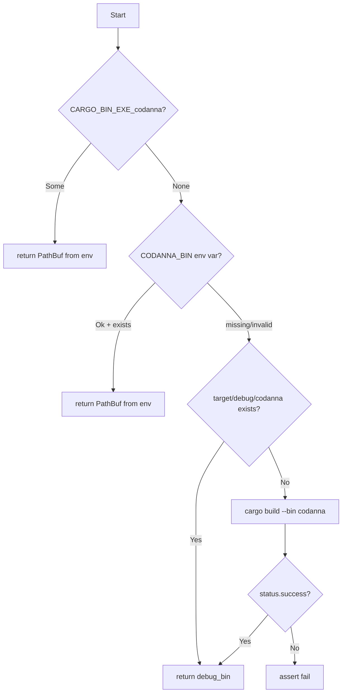
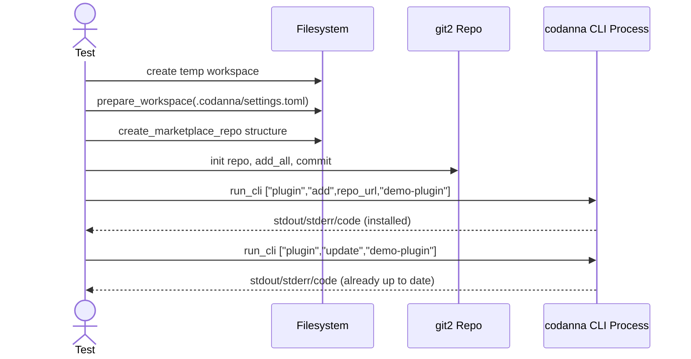

# cli\test_plugin_commands.rs Review

## TL;DR

- 目的: CLI「codanna」のプラグイン管理コマンド（add/update/remove）の挙動を、実際のバイナリ起動で検証する統合テスト補助ユーティリティ群とテストケース。
- 主要API: with_temp_workspace, prepare_workspace, create_marketplace_repo, codanna_binary, run_cli（いずれもテスト内部のヘルパー関数）。
- 複雑箇所: codanna_binaryのバイナリ探索/ビルド分岐と、create_marketplace_repoのGitリポジトリ初期化・コミット。
- 重大リスク: 非UTF-8パスでのunwrap, 共有HOMEディレクトリに起因する並行テストの競合, 外部プロセス実行に依存する不安定性, エラー処理をexpect/assertに依存。
- セキュリティ: コマンドインジェクションは直接は無しだが、環境変数やファイルパス扱いの安全性に注意。ハードコードされたテストHOMEの共有は危険。
- パフォーマンス: 主にファイルI/Oとgit2操作、外部プロセスの起動が支配。入力規模は小さく、ボトルネックはほぼ外部プロセス。
- 不明点: codanna CLI本体の実装や詳細挙動、プラグイン管理の内部仕様はこのチャンクには現れない。

## Overview & Purpose

このファイルは、CLI「codanna」のプラグインコマンド（add, update, remove）の動作を、実際のバイナリを起動して検証するための統合テストを含みます。テスト用の一時ワークスペースを構築し、擬似マーケットプレイス（Gitリポジトリ）とプラグイン構成ファイルを生成してから、codannaバイナリを実行し、標準出力/標準エラーと終了コードを検証します。

目的は以下の通り:
- プラグイン追加のドライランおよび実安定性の確認
- 未インストール時の更新/削除コマンドの応答確認
- 既に最新であるプラグインの更新動作の検証

このチャンクはテスト補助ロジックに集中しており、CLI実装本体の内部ロジックは含まれません。

## Structure & Key Components

| 種別 | 名前 | 公開範囲 | 責務 | 複雑度 |
|------|------|----------|------|--------|
| fn | with_temp_workspace | private | 一時ディレクトリ作成とクリーンアップのラッパー | Low |
| fn | prepare_workspace | private | テスト用設定ディレクトリと設定ファイル(.codanna/settings.toml)の用意 | Low |
| fn | create_marketplace_repo | private | 擬似マーケットプレイスGitリポジトリとプラグイン構造/マニフェスト生成、初回コミット | Med |
| fn | codanna_binary | private | codannaバイナリの探索、存在しなければcargo buildで生成 | Med |
| fn | run_cli | private | codannaバイナリを指定引数/環境で起動して出力を収集 | Low |
| test | dry_run_add_reports_expected_output | private | プラグイン追加のドライラン検証 | Low |
| test | dry_run_update_succeeds_without_install | private | 未インストールでの更新ドライラン挙動の検証 | Low |
| test | dry_run_remove_succeeds_without_install | private | 未インストールでの削除ドライラン挙動の検証 | Low |
| test | update_reports_already_up_to_date | private | インストール後の更新が「最新」表示になるかの検証 | Low |

### Dependencies & Interactions

- 内部依存
  - テストケース群 → with_temp_workspace, prepare_workspace, create_marketplace_repo（必要に応じて）, run_cli
  - run_cli → codanna_binary
  - create_marketplace_repo → std::fs, git2::{Repository, IndexAddOption, Signature}
- 外部依存（クレート/標準）
  - std::env, std::path::{Path, PathBuf}, std::process::Command, std::fs
  - git2: Gitリポジトリ初期化・インデックス・コミット
  - tempfile: TempDirで一時ディレクトリ管理
  - dirs: home_dirの取得
- 被依存推定
  - このモジュールはテスト専用。プロダクションコードからの直接利用は「該当なし」。

## API Surface (Public/Exported) and Data Contracts

このファイルのAPIはテスト内部のヘルパー関数であり、公開APIはありません（exports=0）。ただし、テストの安定性・再利用性のためにインターフェイスとして整理します。

| API名 | シグネチャ | 目的 | Time | Space |
|-------|-----------|------|------|-------|
| with_temp_workspace | fn with_temp_workspace<F>(test: F) where F: FnOnce(&Path) | 一時ワークスペースでテストを実行 | O(1) | O(1) |
| prepare_workspace | fn prepare_workspace(workspace: &Path) | 設定ディレクトリと設定ファイルの用意 | O(1) | O(1) |
| create_marketplace_repo | fn create_marketplace_repo(workspace: &Path, plugin_name: &str) -> String | 擬似マーケットプレイスGitリポジトリの生成 | O(F) | O(F) |
| codanna_binary | fn codanna_binary() -> PathBuf | codannaバイナリの探索/ビルド | O(1) + 外部プロセス | O(1) |
| run_cli | fn run_cli(workspace: &Path, args: &[&str]) -> (i32, String, String) | codannaを外部プロセスとして起動し結果取得 | O(1) + 外部プロセス | O(|stdout|+|stderr|) |

Fはファイル数。外部プロセス実行に要する時間はCLIの処理に依存。

### with_temp_workspace

1) 目的と責務
- 一時ディレクトリを生成し、そのパスを引数クロージャに渡してテストを実行する。ライフタイム終了時にディレクトリは自動削除される。

2) アルゴリズム
- TempDir::new()
- closure(test)(temp_dir.path())

3) 引数

| 名前 | 型 | 必須 | 説明 |
|------|----|------|------|
| test | F where F: FnOnce(&Path) | 必須 | ワークスペースパスを受け取りテスト処理を行うクロージャ |

4) 戻り値

| 型 | 説明 |
|----|------|
| () | なし |

5) 使用例
```rust
with_temp_workspace(|workspace| {
    prepare_workspace(workspace);
    let (_code, _stdout, _stderr) = run_cli(workspace, &["--help"]);
});
```

6) エッジケース
- TempDirの作成失敗時はexpectでパニック。テストでのfailとしては妥当だが、詳細エラーが失われる。

状態: 実装あり、未対処。

### prepare_workspace

1) 目的と責務
- テスト用設定ディレクトリ「.codanna」とsettings.tomlの作成。「index_path = "index"」を初期化。

2) アルゴリズム
- workspace.join(".codanna")
- create_dir_all
- settings.tomlが存在しなければwrite

3) 引数

| 名前 | 型 | 必須 | 説明 |
|------|----|------|------|
| workspace | &Path | 必須 | ワークスペースのルート |

4) 戻り値

| 型 | 説明 |
|----|------|
| () | なし |

5) 使用例
```rust
prepare_workspace(workspace);
```

6) エッジケース
- ファイルシステム権限不足やディスクフルでexpectパニック。メッセージは固定。

状態: 実装あり、未対処。

### create_marketplace_repo

1) 目的と責務
- 擬似マーケットプレイスGitリポジトリをworkspace配下に作成。プラグインmanifestやmarketplace.json、簡易コマンドMarkdownを配置して、初回コミット。リポジトリパス文字列を返す。

2) アルゴリズム
- repo_path = workspace/"cli-marketplace"
- plugin_root = repo_path/"plugin"
- marketplace_dir = repo_path/".claude-plugin"
- plugin_manifest_dir = plugin_root/".claude-plugin"
- 各ディレクトリ作成
- marketplace.jsonとplugin.jsonを文字列formatで生成・書き込み
- commands/cli-command.mdを作成
- git2でRepository::init → index.add_all(["*"]) → index.write → write_tree → Signature::now → commit
- repo_path.to_str().unwrap().to_string()

3) 引数

| 名前 | 型 | 必須 | 説明 |
|------|----|------|------|
| workspace | &Path | 必須 | ベースディレクトリ |
| plugin_name | &str | 必須 | プラグイン名（manifestへ埋め込み） |

4) 戻り値

| 型 | 説明 |
|----|------|
| String | リポジトリパス（UTF-8文字列） |

5) 使用例
```rust
let repo_url = create_marketplace_repo(workspace, "demo-plugin");
let (code, stdout, stderr) = run_cli(workspace, &["plugin", "add", &repo_url, "demo-plugin"]);
```

6) エッジケース
- repo_path.to_str().unwrap()が非UTF-8パスでパニック。
- git2操作が失敗した場合expectでパニック。
- plugin_nameに制御文字や特殊文字がある場合、JSONの整合性に影響しうる（このテストでは制御なし）。

状態: 実装あり、未対処。

### codanna_binary

1) 目的と責務
- 実行可能なcodannaバイナリのパスを特定。見つからない場合はcargo buildで生成し、target/debug/codannaを返す。

2) アルゴリズム（主要分岐）
- option_env!("CARGO_BIN_EXE_codanna") が Some → そのパスを返す
- env::var("CODANNA_BIN") が Ok → パスが存在すれば返す
- manifest_dir = CARGO_MANIFEST_DIR or current_dir
- debug_bin = manifest_dir/"target/debug/codanna" → 存在すれば返す
- 上記いずれも不可 → Command::new("cargo").args(["build", "--bin", "codanna"]).current_dir(manifest_dir).status()
  - 成功アサート後、debug_binを返す

3) 引数

| 名前 | 型 | 必須 | 説明 |
|------|----|------|------|
| なし | - | - | 環境変数から探索 |

4) 戻り値

| 型 | 説明 |
|----|------|
| PathBuf | codannaバイナリのフルパス |

5) 使用例
```rust
let bin = codanna_binary();
assert!(bin.exists(), "codanna binary must be present");
```

6) エッジケース
- cargoがインストールされていない/ビルドが失敗 → assertでテスト失敗。
- Windows等でバイナリ名拡張子差異（例: codanna.exe）に未対応の可能性。
- CODANNA_BINが存在しないパスでも無視して継続（安全だが理由のログが無い）。

状態: 実装あり、未対処。

### run_cli

1) 目的と責務
- 指定ワークスペースでcodannaを起動し、HOMEをテスト用ディレクトリに設定して副作用を隔離。終了コードと標準出力/標準エラーを返す。

2) アルゴリズム
- bin = codanna_binary()
- test_home = dirs::home_dir().unwrap_or(PathBuf::from("/tmp")) + ".codanna-test"
- create_dir_all(test_home)
- Command::new(bin).args(args).current_dir(workspace).env("HOME", test_home).output()
- status.code().unwrap_or(-1), stdout/stderrをUTF-8（lossy）文字列化

3) 引数

| 名前 | 型 | 必須 | 説明 |
|------|----|------|------|
| workspace | &Path | 必須 | 実行カレントディレクトリ |
| args | &[&str] | 必須 | CLI引数配列 |

4) 戻り値

| 型 | 説明 |
|----|------|
| (i32, String, String) | (終了コード, 標準出力, 標準エラー) |

5) 使用例
```rust
let (code, stdout, stderr) = run_cli(workspace, &["plugin", "remove", "demo-plugin", "--dry-run"]);
assert_eq!(code, 0);
```

6) エッジケース
- HOMEディレクトリが取得不可でも「/tmp/.codanna-test」を使用。
- 標準出力/標準エラーが非UTF-8でもlossy変換。精密評価には不向き。
- テスト間で同一HOME「~/.codanna-test」を共有し、並行実行で競合の可能性。

状態: 実装あり、未対処。

## Walkthrough & Data Flow

- テストケースの共通フロー
  1. with_temp_workspaceで一時ディレクトリを作成。
  2. prepare_workspaceで「.codanna/settings.toml」を用意。
  3. 必要に応じてcreate_marketplace_repoで擬似リポジトリを作成し、パス文字列を得る。
  4. run_cliでcodannaを起動。内部でcodanna_binaryによりバイナリを探索/ビルド。
  5. 実行結果(終了コード、stdout、stderr)をアサートで検証。

- 代表的テスト: update_reports_already_up_to_date
  - addコマンドでインストールの成功を確認後、updateコマンドで「already up to date」の表示を確認。

### Mermaid: codanna_binaryの分岐フロー



上記の図は`codanna_binary`関数（行番号: 不明）の主要分岐を示す。

### Mermaid: update_reports_already_up_to_dateテストの主要アクター



上記の図は`update_reports_already_up_to_date`テスト（行番号: 不明）の主要フローを示す。

## Complexity & Performance

- with_temp_workspace: 時間O(1)、空間O(1)。TempDirの作成のみ。
- prepare_workspace: 時間O(1)（小規模ファイルI/O）、空間O(1)。
- create_marketplace_repo: 時間O(F)（ディレクトリ作成+インデックス追加+コミット、Fはファイル数）、空間O(F)。
- codanna_binary: 時間O(1)+外部プロセス（cargo buildの時間に支配）、空間O(1)。
- run_cli: 時間O(1)+外部プロセス（CLIの処理時間とI/Oに支配）、空間O(|stdout|+|stderr|)。

ボトルネック:
- 外部プロセス起動（cargo buildとcodanna実行）
- git2処理（IndexAddOption::DEFAULTでのadd_allはファイルスキャン）

スケール限界:
- テスト用に小規模なリポジトリを生成しているため実質問題なし。大量ファイル化するとcreate_marketplace_repoが遅くなる可能性。

実運用負荷要因（このテスト内での想定）:
- ディスクI/O（ディレクトリ・ファイル作成）
- 外部プロセス起動（cargo、codanna）

## Edge Cases, Bugs, and Security

- エッジケース詳細

| エッジケース | 入力例 | 期待動作 | 実装 | 状態 |
|-------------|--------|----------|------|------|
| 非UTF-8パス | TempDirが非UTF-8 | エラーとして扱い、OsStringを保持 | to_str().unwrap()でパニック | 問題あり |
| cargo未インストール/ビルド失敗 | codanna_binaryでbuild | テストをわかりやすく失敗させ、詳細ログ | assert!(status.success())のみ | 改善余地 |
| 共有HOMEの競合 | 並行テスト | テスト毎に固有のHOMEを使用 | 固定「~/.codanna-test」 | 問題あり |
| plugin_nameに特殊文字 | "demo-plugin\n" | JSONエスケープして安全に書込 | format!で素通し | 問題あり（理論上） |
| 標準出力が非UTF-8 | バイナリ出力 | 安全にバイナリ扱い/明示的エンコード指定 | lossy変換 | 許容だが注意 |
| Windows拡張子差異 | codanna.exe | 正しくバイナリパス検出 | 固定"codanna" | 問題あり（移植性） |

- セキュリティチェックリスト
  - メモリ安全性: 全コードは安全なRust（unsafe無し）。git2やCommandはFFI/外部プロセスだがラッパで安全。Buffer overflow/use-after-freeは「該当なし」。
  - Integer overflow: 「該当なし」。
  - インジェクション:
    - Commandインジェクション: 引数はリストで渡しており安全。環境変数由来パスは存在確認あり。問題低。
    - Path traversal: テストが自身のworkspace配下を使用。低リスク。
    - SQLインジェクション: 「該当なし」。
  - 認証・認可: 「該当なし」。
  - 秘密情報: ハードコード秘密は無し。ログ漏洩は標準出力収集のみで低リスク。
  - 並行性: 共有HOMEによりレースの可能性。Mutex/RwLockなどの共有状態保護はなし。テストを並列実行すると副作用の衝突が起きうる。
  - Deadlock: 「該当なし」。

- Rust特有の観点（このチャンクに基づく）
  - 所有権/借用/ライフタイム: Path/PathBuf/TempDirの所有と借用は適切。クロージャに&Pathを渡すのみ。明示的ライフタイムパラメータは不要。
  - unsafe境界: unsafeブロックは「該当なし」。
  - Send/Sync: TempDirとPathBufはSend。並行実行前提ではないが、共有HOMEが問題。
  - 非同期/await: 「該当なし」（同期テスト）。
  - エラー設計: expect/unwrap/assertに依存。テストでは妥当だが、失敗時の原因特定しづらい個所あり（例: to_str().unwrap）。

根拠（関数名:行番号）
- 行番号はこのチャンクには付与されていないため「不明」。関数名に基づき記述。

## Design & Architecture Suggestions

- codanna_binaryの移植性強化
  - Windows対応: バイナリ拡張子（.exe）をOSに応じて処理。
  - 成功/失敗詳細ログ: cargo buildのstderrを表示してデバッグ容易化。
- HOME分離の改善
  - run_cliで「~/.codanna-test」ではなく、workspace固有のHOME（例: test_home/workspace-hash）を使用し、並列テストの競合を避ける。
- パスのUTF-8安全性
  - create_marketplace_repoのto_str().unwrap()を避け、OsStringベースのコマンド引数にするか、fallible conversionでResultを返す。
- エラー処理の改善
  - expect/unwrapの乱用を避け、失敗理由を返してアサート側で詳細出力する（テスト失敗時の診断性向上）。
- 構成ファイルの生成
  - JSON/ TOMLはserdeで構築し、エスケープ/整合性を安全に担保。

## Testing Strategy (Unit/Integration) with Examples

- 既存の統合テストはE2Eの主要パスをカバーしているが、追加の負荷・失敗系テストが有用。

追加テスト例:
1) 非UTF-8パスの扱い（期待：適切に失敗し、パニックしない）
```rust
// 疑似例: 非UTF-8を含むパスのTempDir生成は難しいため、to_str()を使わない設計変更後に検証
```
2) Windows環境でのバイナリ検出（codanna.exe）
```rust
// OS判定の追加後、codanna_binary()が.exeを返すことを確認
```
3) cargo build失敗時の詳細出力確認
```rust
with_temp_workspace(|workspace| {
    // 故意にCARGO_MANIFEST_DIRを不正に設定して失敗させる
    std::env::set_var("CARGO_MANIFEST_DIR", workspace.join("no-project"));
    let result = std::panic::catch_unwind(|| { let _ = codanna_binary(); });
    assert!(result.is_err());
});
```
4) plugin_nameに特殊文字を含める場合のJSON安全性
```rust
with_temp_workspace(|workspace| {
    prepare_workspace(workspace);
    let repo_url = create_marketplace_repo(workspace, r#"weird"plugin\n"#);
    // JSONの妥当性を検証（serde導入後）
});
```
5) 並列テスト安全性
- HOMEをユニーク化した上で、複数スレッドでrun_cliを並行起動し、競合がないことを確認。

## Refactoring Plan & Best Practices

- 関数のResult化
  - create_marketplace_repo: -> Result<String, Error>
  - codanna_binary: -> Result<PathBuf, Error>
  - run_cli: -> Result<(i32, String, String), Error>
- ロガーを活用
  - テスト時にRUST_LOG=debugで詳細ログを出す設計（CLI側）。
- OS互換性の考慮
  - std::env::consts::EXE_SUFFIXでバイナリ名に拡張子を付与。
- データ生成の安全性
  - serde_json/serdeでmanifest生成、plugin_nameのエスケープを自動化。
- テストHOMEの一意性
  - test_home = dirs::home_dir().unwrap_or(PathBuf::from("/tmp")).join(format!(".codanna-test-{}", uuid));
- 標準出力のバイナリ対応
  - UTF-8 losslessでなくとも、検証パターンが文字列包含ならOK。ただし必要に応じてbyte比較も提供。

## Observability (Logging, Metrics, Tracing)

- このテストではCLIの標準出力/標準エラーを収集しています。より良い可観測性のために:
  - CLI側で構造化ログ（JSON Lines）を提供し、テストでパース可能にする。
  - ログレベルを環境変数で制御（例: CODANNA_LOG=debug）。
  - 成功/失敗時の詳細（どのプラグイン、どのパス、どのリポジトリ）を明示的にログ化。
  - テストでstderrも積極的に解析し、失敗要因の自動抽出を行う。

メトリクス/トレースはテスト対象外だが、CLI本体で導入すれば、updateが「最新」であることの判定における外部操作（fetch/compare）の時間計測などが可能。

## Risks & Unknowns

- 不明
  - codanna CLIの内部実装、プラグイン管理の詳細仕様、エラーコード体系（例: update未インストール時に3を返す理由の規約）。
  - マーケットプレイス/プラグインマニフェストの正式スキーマ。
- リスク
  - 並行テスト時のHOME共有による副作用衝突。
  - OS差異（Windows拡張子、パスのUTF-8問題）。
  - 外部プロセス（cargo/codanna）に起因する不安定性（環境依存）。
  - 期待メッセージの文字列包含に依存した脆いアサーション（国際化やメッセージ変更に弱い）。

以上により、このテスト補助コードはE2E検証として有用ですが、非UTF-8/OS互換/並行実行の安定性の観点で改善の余地があります。