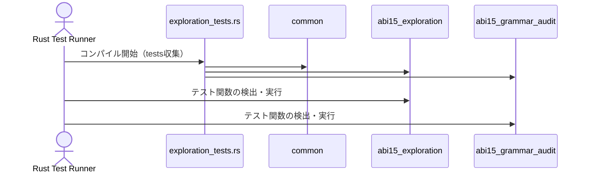

# exploration_tests.rs Review

## TL;DR

- このファイルは探索用テスト群をまとめてテストハーネスに公開するための**ゲートウェイ**であり、実装ロジックや公開APIは**存在しない**。
- `#[path]`属性で外部ファイルをモジュールとして読み込み、重複モジュール警告を避ける意図がコメントで明示されている（詳細はこのチャンクには現れない）。
- **Rust安全性/エラー/並行性**観点はこのファイルにはほぼ関係しないが、モジュール解決や重複名によるビルドエラーが主なリスク。
- **API Surface**はゼロ。データコントラクト、コアロジックは読み込まれる各モジュール側（不明）。
- パフォーマンス・複雑度は極小（コンパイル時のモジュール解決のみ）。主なボトルネックは**パス指定の脆弱性**（相対パスが変更に弱い）。
- 推奨は`#[path]`依存の削減とテストモジュールの整理・再エクスポート戦略の導入。

## Overview & Purpose

このファイルは探索用のABI15関連テストをまとめてRustのテストハーネスに公開するためのエントリポイントであり、以下の3つのモジュールを`#[path]`で明示的に読み込みます。

- `common/mod.rs`（共通テストユーティリティ）
- `exploration/abi15_exploration.rs`（ABI15文法探索）
- `exploration/abi15_grammar_audit.rs`（ABI15文法監査）

内部ロジックやテストケースの詳細はこれらのモジュールに定義されており、本ファイル自体には公開APIもロジックもありません。

```rust
// Gateway file to expose exploration tests from the exploration/ subdirectory
// These tests are for ABI15 grammar exploration and auditing

// Include the common test utilities
#[path = "common/mod.rs"]
mod common;

#[path = "exploration/abi15_exploration.rs"]
mod abi15_exploration;

// Note: abi15_exploration_common is loaded inside abi15_grammar_audit
// to avoid duplicate module warnings

#[path = "exploration/abi15_grammar_audit.rs"]
mod abi15_grammar_audit;
```

## Structure & Key Components

| 種別 | 名前 | 公開範囲 | 責務 | 複雑度 |
|------|------|----------|------|--------|
| File | exploration_tests.rs | private（テストクレート内） | テストモジュールの読み込みゲートウェイ | Low |
| Module | common | private（このテストクレート内） | 共通テストユーティリティ（詳細は不明） | 不明 |
| Module | abi15_exploration | private（このテストクレート内） | ABI15文法探索テスト（詳細は不明） | 不明 |
| Module | abi15_grammar_audit | private（このテストクレート内） | ABI15文法監査テスト（詳細は不明） | 不明 |

### Dependencies & Interactions

- 内部依存
  - `abi15_exploration`および`abi15_grammar_audit`は、`common`のユーティリティを利用している可能性が高いが、確証はこのチャンクにはない（不明）。
  - コメントより、`abi15_exploration_common`は`abi15_grammar_audit`内でロードされ、重複モジュール警告を避ける設計が示唆される。
- 外部依存（表）
  | 依存種別 | 名前 | 用途 | このチャンクでの使用有無 |
  |---------|------|------|----------------------|
  | Rust標準 | テストハーネス（cargo test） | テスト実行 | あり（間接的） |
  | クレート | 不明 | 不明 | 不明 |
- 被依存推定
  - `cargo test`によるテスト収集時に、このファイルが上記モジュールを読み込み、各テスト関数が実行対象となる。
  - 他のファイルからの直接依存は想定されない（このファイルはテスト用で公開されない）。

## API Surface (Public/Exported) and Data Contracts

| API名 | シグネチャ | 目的 | Time | Space |
|-------|-----------|------|------|-------|
| 該当なし | 該当なし | 該当なし | - | - |

- 目的と責務: 該当なし
- アルゴリズム: 該当なし
- 引数: 該当なし
- 戻り値: 該当なし
- 使用例: 該当なし
- エッジケース: 該当なし

このファイルはAPIを提供せず、データコントラクトも定義しません。全てのテストロジックは読み込まれる各モジュールに存在します（このチャンクには現れない）。

## Walkthrough & Data Flow

本ファイルのデータフローは「コンパイル時モジュール解決→テスト収集→テスト実行」であり、ランタイムのデータ処理や状態遷移はありません。テストハーネスからの高レベルの流れを示します。



上記の図は、このファイルの`mod`宣言全体に対応します（このチャンクのコード全体）。

## Complexity & Performance

- 時間計算量: コンパイル時に`#[path]`解決とモジュール読み込みのみ。実行時処理はこのファイルに存在しないため、O(1)。
- 空間計算量: このファイル自身はほぼゼロ。読み込まれるモジュール依存（不明）。
- ボトルネック:
  - `#[path]`による相対パスは**変更に脆弱**で、構成変更時にビルド失敗を引き起こしやすい。
  - 同名モジュールの重複読み込みは**コンパイルエラー**の主因となりうる。
- スケール限界:
  - モジュールが増えると`mod`宣言が増え、管理コストが増す。性能には影響しないが**可読性・保守性**に影響。

## Edge Cases, Bugs, and Security

- メモリ安全性
  - Buffer overflow / Use-after-free / Integer overflow: このファイルには該当なし。
- インジェクション
  - SQL / Command / Path traversal: パスは静的文字列でコンパイル時解決のため、ランタイムのインジェクションは発生しない。ただし、相対パス変更により意図せぬファイルを参照して**ビルド失敗**はあり得る。
- 認証・認可
  - 該当なし（テストコードの読み込みのみ）。
- 秘密情報
  - Hard-coded secrets / Log leakage: 該当なし。このファイルはログ出力しない。
- 並行性
  - Race condition / Deadlock: 該当なし。このファイルは並行処理を行わない。

Rust特有の観点（このファイルに限定）
- 所有権: 値の移動・借用は発生しない（モジュール宣言のみ）。
- 借用: 該当なし。
- ライフタイム: 該当なし。
- unsafe境界: `unsafe`ブロックは存在しない。
- Send/Sync: 該当なし（共有状態なし）。
- 非同期/await: 該当なし。
- エラー設計: `Result`や`Option`の扱いはこのファイルにはない。

エッジケース詳細

| エッジケース | 入力例 | 期待動作 | 実装 | 状態 |
|-------------|--------|----------|------|------|
| モジュールパス不正 | `#[path = "exploration/missing.rs"]` | コンパイルエラーで原因が明確表示 | `#[path]`の静的解決のみ | 想定通り（ただしUX低） |
| 重複モジュール名 | 同名の`mod foo;`を別パスで宣言 | コンパイルエラー（重複定義） | コメントで回避方針を示唆 | 潜在リスク |
| 依存モジュール側のビルド失敗 | 読み込んだファイルに構文エラー | エラーが該当ファイルに紐づいて表示 | Rust標準のビルドエラー処理 | 想定通り |
| ディレクトリ構成変更 | `exploration/`リネーム | パス更新が必要、更新漏れでビルド失敗 | 手動管理 | 脆弱 |
| cfg(test)不整合 | 本体クレート側の`cfg(test)`と齟齬 | テストが見つからない/実行されない | このファイルでは制御不可 | 不明 |

## Design & Architecture Suggestions

- `#[path]`依存の削減
  - より明示的なモジュール構造（Cargoの標準的な`tests/`ディレクトリ構成）を採用し、相対パス管理コストを削減。
- 再エクスポート戦略
  - `mod exploration; pub use exploration::*;`のように**集約モジュール**を用意し、重複読み込みや命名衝突を避けつつテストの見通しを良くする。
- 名前衝突の防止
  - `abi15_exploration_common`の読み込み位置はコメントで言及されているため、共通モジュールの**単一の導入点**を設ける。
- パスの定数化
  - `const`やビルドスクリプト（必要なら）でパスを一元管理し、リネーム時の保守性を向上。
- ドキュメント化
  - ゲートウェイの役割、読み込み順、重複回避ポリシーを明文化し、将来の変更に強くする。

## Testing Strategy (Unit/Integration) with Examples

このファイルはテスト実装を含みません。以下はモジュール側に置くべき推奨テスト例です（例示であり、このチャンクには現れない）。

- ユニットテスト（文法探索の最小ケース）
```rust
#[test]
fn parses_minimal_abi15_type() {
    // arrange
    let input = "type X = u32;";
    // act
    let ast = parse_abi15(input).expect("parse failed");
    // assert
    assert_eq!(ast.types.len(), 1);
}
```

- プロパティテスト（双方向性や閉包性）
```rust
#[test]
fn roundtrip_serialization_property() {
    let inputs = [
        "type A = u8;",
        "type B<T> = Vec<T>;",
        // ...
    ];
    for src in inputs {
        let ast = parse_abi15(src).expect("parse failed");
        let out = format_abi15(&ast);
        let ast2 = parse_abi15(&out).expect("re-parse failed");
        assert_eq!(ast, ast2);
    }
}
```

- エラー系テスト（診断精度）
```rust
#[test]
fn reports_invalid_token_position() {
    let bad = "type = ;";
    let err = parse_abi15(bad).unwrap_err();
    assert!(err.message.contains("expected identifier"));
    assert!(err.span.start <= bad.len());
}
```

## Refactoring Plan & Best Practices

- ステップ1: `tests/`配下へ集約
  - `exploration/`のテストソースを`tests/exploration/`へ移し、`#[path]`を不要化。
- ステップ2: 共通ユーティリティの単一点導入
  - `tests/common/mod.rs`を作り、共通ユーティリティはここに限定して読み込む。
- ステップ3: 名前空間整理
  - `mod abi15;`配下に`exploration`/`audit`をサブモジュール化し、`use abi15::{exploration::*, audit::*};`で集約。
- ステップ4: テストの再エクスポート
  - 上位モジュールで`pub use`し、テストエントリから見通しを良くする。
- ベストプラクティス
  - **相対パスの乱用禁止**、**モジュール名の一意性**、**テストの自己完結性（モック/スタブの局所化）**。

## Observability (Logging, Metrics, Tracing)

- このファイル単体では観測点がないため、モジュール側での導入を推奨。
  - ログ: `env_logger`や`tracing`をテストセットアップで初期化し、失敗時の診断を強化。
  - メトリクス: ベンチマーク（`criterion`）を別途導入して解析コストやフォーマッタ性能を計測。
  - トレース: 文法解析のステップに`span`を付与してデバッグ容易化。

## Risks & Unknowns

- 不明点
  - 各モジュールの具体的なテスト内容、公開関数、データ構造はこのチャンクには現れない。
  - `abi15_exploration_common`の正確な責務や読み込み位置の詳細は不明。
- リスク
  - **相対パスの脆弱性**に起因するビルド失敗。
  - **モジュール名重複**によるコンパイルエラー。
  - テスト構成の変更が**ゲートウェイ側に波及**しやすい設計上の結合。