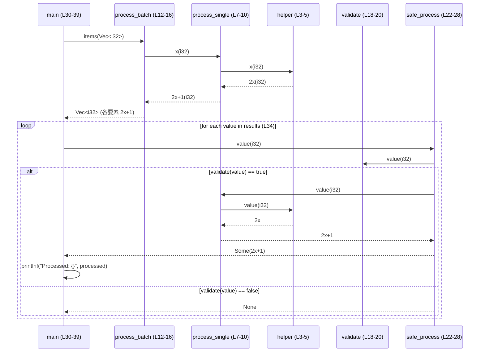

# fixtures\calls.rs Review

## TL;DR

- 目的: 関数呼び出しの関係（直列・バッチ処理・単純検証・再帰・相互再帰）を示すテスト用フィクスチャ。
- 公開API: なし（すべて非公開関数）。エントリポイントは main のみ。
- コアロジック: helper → process_single → process_batch の逐次/バッチ処理と validate → safe_process の検証分岐。
- 複雑箇所: 再帰 factorial（スタック/オーバーフロー）と is_even/is_odd の相互再帰（深い入力でスタック枯渇）。
- 重大リスク: i32 の乗算による整数オーバーフロー（debug では panic, release ではラップ）、u64 の factorial の急速なオーバーフロー、相互再帰のスタックオーバーフロー。
- エラー設計: safe_process が Option を用いて不正入力を None で表現。Result は未使用。
- 並行性: 該当なし（同期コードのみ）。可変借用・共有状態なしでデータ競合の心配は少ない。

## Overview & Purpose

このファイルは、Rust における関数間の呼び出し関係・データフロー・再帰の例を示す小規模なテスト用フィクスチャです。以下を含みます。

- 基本的な処理チェーン: helper（倍化）→ process_single（+1）→ process_batch（ベクタに適用）
- 入力検証: validate（範囲チェック）→ safe_process（Option によるガード付き処理）
- 再帰: factorial（単純再帰）と is_even/is_odd（相互再帰）

本チャンクには公開 API（pub）はなく、すべての関数はモジュール内プライベートです。main 関数（L30-39）がデモを実行し、println! により結果を出力します。

## Structure & Key Components

| 種別 | 名前 | 公開範囲 | 責務 | 複雑度 |
|------|------|----------|------|--------|
| Function | helper (L3-5) | private | 入力を2倍にする | Low |
| Function | process_single (L7-10) | private | helperで倍化し、+1 する | Low |
| Function | process_batch (L12-16) | private | ベクタに対して process_single を適用して収集 | Low |
| Function | validate (L18-20) | private | 0<x<100 の範囲チェック | Low |
| Function | safe_process (L22-28) | private | validate に合格した値のみ process_single を実行し Option で返す | Low |
| Function | main (L30-39) | private | デモの実行（バッチ処理→ガード付き処理→出力） | Low |
| Function | factorial (L42-48) | private | n! を単純再帰で計算 | Med |
| Function | is_even (L51-57) | private | 相互再帰で偶数判定 | Med |
| Function | is_odd (L59-65) | private | 相互再帰で奇数判定 | Med |

### Dependencies & Interactions

- 内部依存（呼び出し関係）
  - process_single → helper
  - process_batch → process_single
  - safe_process → validate, process_single
  - main → process_batch, safe_process, println!
  - factorial → factorial（自己再帰）
  - is_even ↔ is_odd（相互再帰）
- 外部依存
  - 標準ライブラリ: Vec, Iterator（into_iter, map, collect）, println!
  - 他クレート依存: 該当なし
- 被依存推定（このモジュールを利用しそうな箇所）
  - 学習用・サンプルコード・ドキュメントの例示
  - ユニットテストのフィクスチャとしての利用
  - ライブラリ化する場合はデータ前処理ユーティリティ（倍化＋オフセット）や検証ユーティリティ

## API Surface (Public/Exported) and Data Contracts

| API名 | シグネチャ | 目的 | Time | Space |
|-------|-----------|------|------|-------|
| 該当なし | - | このファイルには公開APIが存在しません | - | - |

内部関数（コアロジック）の参考一覧:

| 関数名 | シグネチャ | 目的 | Time | Space |
|-------|------------|------|------|-------|
| helper | fn helper(x: i32) -> i32 | 入力を2倍 | O(1) | O(1) |
| process_single | fn process_single(value: i32) -> i32 | 2倍＋1 | O(1) | O(1) |
| process_batch | fn process_batch(items: Vec<i32>) -> Vec<i32> | ベクタ各要素に process_single を適用 | O(n) | O(n) |
| validate | fn validate(x: i32) -> bool | 0<x<100 | O(1) | O(1) |
| safe_process | fn safe_process(value: i32) -> Option<i32> | validate合格時のみ処理 | O(1) | O(1) |
| factorial | fn factorial(n: u64) -> u64 | 単純再帰で階乗 | O(n) | O(n)（スタック） |
| is_even | fn is_even(n: u32) -> bool | 相互再帰で偶数判定 | O(n) | O(n)（スタック） |
| is_odd | fn is_odd(n: u32) -> bool | 相互再帰で奇数判定 | O(n) | O(n)（スタック） |

以下、各関数の詳細。

1) helper（L3-5）
- 目的と責務: 入力整数を2倍にする。
- アルゴリズム:
  1. x * 2 を返す。
- 引数:
  | 名前 | 型 | 意味 |
  |------|----|------|
  | x | i32 | 倍化対象の値 |
- 戻り値:
  | 型 | 意味 |
  |----|------|
  | i32 | 2倍にした値 |
- 使用例:
  ```rust
  let y = helper(10); // 20
  ```
- エッジケース:
  - 大きな x で整数オーバーフローの可能性（debugでpanic, releaseでラップ）。

2) process_single（L7-10）
- 目的と責務: 入力を helper で倍化し、+1 して返す。
- アルゴリズム:
  1. helper(value) で doubled を得る。
  2. doubled + 1 を返す。
- 引数:
  | 名前 | 型 | 意味 |
  |------|----|------|
  | value | i32 | 入力値 |
- 戻り値:
  | 型 | 意味 |
  |----|------|
  | i32 | 2倍＋1 の値 |
- 使用例:
  ```rust
  let z = process_single(3); // 7
  ```
- エッジケース:
  - helper 由来のオーバーフロー + 加算でさらにオーバーフローの可能性。

3) process_batch（L12-16）
- 目的と責務: ベクタの各要素に process_single を適用して Vec<i32> を生成。
- アルゴリズム:
  1. items.into_iter() で所有権を消費。
  2. map(|x| process_single(x)) で逐次変換。
  3. collect() で Vec に収集。
- 引数:
  | 名前 | 型 | 意味 |
  |------|----|------|
  | items | Vec<i32> | 入力ベクタ（消費される） |
- 戻り値:
  | 型 | 意味 |
  |----|------|
  | Vec<i32> | 各要素を 2倍＋1 した結果 |
- 使用例:
  ```rust
  let v = vec![1,2,3];
  let out = process_batch(v); // [3,5,7]
  ```
- エッジケース:
  - 空ベクタは空ベクタを返す。
  - 大きなベクタは O(n) 時間・メモリ使用。

4) validate（L18-20）
- 目的と責務: 入力が 0 < x < 100 にあるかを判定。
- アルゴリズム:
  1. x > 0 && x < 100 を返す。
- 引数:
  | 名前 | 型 | 意味 |
  |------|----|------|
  | x | i32 | 検証対象の値 |
- 戻り値:
  | 型 | 意味 |
  |----|------|
  | bool | 妥当なら true |
- 使用例:
  ```rust
  assert!(validate(50));
  assert!(!validate(0));
  assert!(!validate(100));
  ```
- エッジケース:
  - 0 と 100 は false（厳密不等号）。
  - 負数は false。

5) safe_process（L22-28）
- 目的と責務: validate 合格時のみ process_single を実行し Option で返す。
- アルゴリズム:
  1. if validate(value) { Some(process_single(value)) } else { None }
- 引数:
  | 名前 | 型 | 意味 |
  |------|----|------|
  | value | i32 | 入力値 |
- 戻り値:
  | 型 | 意味 |
  |----|------|
  | Option<i32> | 合格時 Some(2x+1)、不合格時 None |
- 使用例:
  ```rust
  match safe_process(10) {
      Some(v) => println!("ok {}", v),
      None => println!("invalid"),
  }
  ```
- エッジケース:
  - 境界値（1 と 99）は Some、0, 100 は None。
  - 大きな値でオーバーフロー可能。

6) main（L30-39）
- 目的と責務: デモ実行。ベクタを処理し、有効値のみ出力。
- アルゴリズム:
  1. vec![1,2,3,4,5] を作成。
  2. process_batch で変換。
  3. 各要素に対して safe_process し、Some のみ println!。
- 引数/戻り値: なし。
- 使用例: 実行時にコンソール出力。
- エッジケース:
  - 出力ベクタに 100 以上・0 以下がある場合は表示されない。

7) factorial（L42-48）
- 目的と責務: u64 の階乗を再帰で計算。
- アルゴリズム:
  1. n <= 1 なら 1。
  2. それ以外は n * factorial(n-1)。
- 引数:
  | 名前 | 型 | 意味 |
  |------|----|------|
  | n | u64 | 非負整数 |
- 戻り値:
  | 型 | 意味 |
  |----|------|
  | u64 | n! |
- 使用例:
  ```rust
  assert_eq!(factorial(5), 120);
  ```
- エッジケース:
  - 大きな n で u64 オーバーフロー（概ね n>=21）。
  - 深い再帰でスタック使用増大。

8) is_even（L51-57）
- 目的と責務: 相互再帰で偶数判定。
- アルゴリズム:
  1. n == 0 なら true。
  2. それ以外は is_odd(n-1)。
- 引数:
  | 名前 | 型 | 意味 |
  |------|----|------|
  | n | u32 | 判定対象 |
- 戻り値:
  | 型 | 意味 |
  |----|------|
  | bool | 偶数なら true |
- 使用例:
  ```rust
  assert!(is_even(100));
  assert!(!is_even(101));
  ```
- エッジケース:
  - 大きな n で深い再帰によりスタック枯渇。

9) is_odd（L59-65）
- 目的と責務: 相互再帰で奇数判定。
- アルゴリズム:
  1. n == 0 なら false。
  2. それ以外は is_even(n-1)。
- 引数/戻り値: is_even と対称。
- 使用例:
  ```rust
  assert!(is_odd(101));
  assert!(!is_odd(100));
  ```
- エッジケース:
  - is_even と同様に再帰が深くなると危険。

## Walkthrough & Data Flow

処理の主なフロー（main → batch → single → helper と validate → safe_process）を示します。



上記の図は main（L30-39）、process_batch（L12-16）、process_single（L7-10）、helper（L3-5）、safe_process（L22-28）、validate（L18-20）の主要フローを示します。

データの流れと所有権/移動:
- process_batch（L12-16）で items.into_iter() により Vec<i32> の所有権が消費され、各 i32 がムーブされます。結果は新たな Vec<i32> として返ります。
- main（L31-33）では data が process_batch にムーブされ、以後 data は使用不可（ただしコードでは再利用していないため問題なし）。
- 他の関数はすべて基本的にコピー可能なスカラー（i32, u32, u64）を値で受け渡ししているため、借用・ライフタイム問題は発生しません。

## Complexity & Performance

- helper: 時間 O(1), 空間 O(1)
- process_single: 時間 O(1), 空間 O(1)
- process_batch: 時間 O(n), 空間 O(n)（出力ベクタ）
- validate: 時間 O(1), 空間 O(1)
- safe_process: 時間 O(1), 空間 O(1)
- factorial: 時間 O(n), 空間 O(n)（再帰スタック）
- is_even/is_odd: 時間 O(n), 空間 O(n)（再帰スタック）

ボトルネックとスケール限界:
- 大規模ベクタ入力時は process_batch が支配的（線形）。I/Oやネットワーク・DBは関与せず、CPU中心。
- 再帰関数（factorial, is_even/is_odd）は入力が大きいとスタック消費が急増。特に相互再帰は n の値が大きいと危険。
- 整数演算のオーバーフローにより debug ビルドでは panic、release ビルドではラップが発生し得ます。

## Edge Cases, Bugs, and Security

セキュリティチェックリスト:
- メモリ安全性: unsafe は使用されておらず（全体）、所有権は値ムーブ中心で安全。Buffer overflow/use-after-free は発生しない。整数オーバーフローの可能性あり（helper, process_single, factorial）。
- インジェクション: SQL/Command/Path なし。println! のみでインジェクション要素はない。
- 認証・認可: 該当なし。
- 秘密情報: ハードコードされた秘密情報なし。ログ（println!）に機微情報は出力していない。
- 並行性: マルチスレッド/async 不使用。Race/Deadlock なし。

既知/潜在バグ:
- 整数オーバーフロー:
  - i32: helper（L4）と process_single（L9）でオーバーフローし得る。debug で panic, release でラップ。
  - u64: factorial（L46）で n>=21 でオーバーフロー。
- スタックオーバーフロー:
  - factorial: 大きな n で再帰が深くなる。
  - is_even/is_odd: 大きな n（u32 の範囲）で不可能な深さの再帰となりスタック枯渇。
- validate の境界仕様:
  - 0 と 100 を除外する仕様は意図的か不明。要件に応じて <= や >= を再検討必要。

エッジケース詳細:

| エッジケース | 入力例 | 期待動作 | 実装 | 状態 |
|-------------|--------|----------|------|------|
| 空ベクタ | items = [] | [] を返す | process_batch(L12-16) | OK |
| 0（検証） | x = 0 | None を返す | safe_process(L22-28) | OK |
| 100（検証） | x = 100 | None を返す | safe_process(L22-28) | OK |
| 負数（検証） | x = -5 | None を返す | safe_process(L22-28) | OK |
| 最小正値 | x = 1 | Some(process_single(1)) | safe_process(L22-28) | OK |
| 境界直前 | x = 99 | Some(process_single(99)) | safe_process(L22-28) | OK |
| i32 オーバーフロー | x = i32::MAX | debug: panic / release: ラップ | helper(L4), process_single(L9) | 注意 |
| factorial のオーバーフロー | n = 21 | u64 オーバーフロー | factorial(L46) | 注意 |
| 相互再帰の深さ | n = 1_000_000 | スタック枯渇の可能性 | is_even/is_odd(L51-65) | 危険 |
| 大規模ベクタ | items.len() = 10^7 | 線形時間・メモリ増 | process_batch(L12-16) | 負荷高 |

## Design & Architecture Suggestions

- 公開 API 設計:
  - ライブラリ化する場合、pub fn として safe_process, process_batch を公開し、helper/validate は内部（非公開）に保持するとよい。
  - エラー表現は Option ではなく Result を用いて不正理由を明示化（例: Result<i32, ValidationError>）。
- 整数安全性:
  - saturating_add / saturating_mul、checked_*、wrapping_* の利用で意図的な挙動を選択。
  - factorial は大きな n に対して BigInt（num-bigint）や iterative 実装＋早期打ち切り。
- 再帰の置き換え:
  - factorial はループに変換してスタック安全に。
  - is_even/is_odd は n % 2 == 0 / != 0 の定数時間に変更。
- API 契約の明確化:
  - validate の仕様（境界を含むか）をドキュメント化し、データ契約を明示。
- 出力/ログ:
  - println! はデモ用途。実運用は log クレートに置換し、レベル制御（info/debug）と構造化ログを導入。

## Testing Strategy (Unit/Integration) with Examples

対象ごとにユニットテストとプロパティテストを推奨。

- helper/process_single
  - 正常系: 少数例で期待値一致
  - オーバーフロー挙動: wrapping/checked の選択に応じたテスト

```rust
#[cfg(test)]
mod tests {
    use super::*;

    #[test]
    fn test_helper_basic() {
        assert_eq!(helper(10), 20);
        assert_eq!(helper(-3), -6);
    }

    #[test]
    fn test_process_single_basic() {
        assert_eq!(process_single(3), 7);
        assert_eq!(process_single(0), 1); // validate不使用のため 0 入力でも 1
    }
}
```

- validate/safe_process
  - 境界テスト: 0, 1, 99, 100
  - Option の None/Some 分岐

```rust
#[test]
fn test_validate_boundaries() {
    assert!(!validate(0));
    assert!(validate(1));
    assert!(validate(99));
    assert!(!validate(100));
}

#[test]
fn test_safe_process_option() {
    assert_eq!(safe_process(10), Some(21)); // 2*10+1
    assert_eq!(safe_process(0), None);
    assert_eq!(safe_process(100), None);
}
```

- process_batch
  - 空・複数要素・大きなサイズ（ベンチ向け）

```rust
#[test]
fn test_process_batch() {
    let out = process_batch(vec![1,2,3]);
    assert_eq!(out, vec![3,5,7]);

    let empty: Vec<i32> = vec![];
    assert!(process_batch(empty).is_empty());
}
```

- factorial
  - 小さい n の正確性、オーバーフロー手前まで（n=20）。大きな n の挙動（checked を採用するなら Err をテスト）

```rust
#[test]
fn test_factorial_small() {
    assert_eq!(factorial(0), 1);
    assert_eq!(factorial(1), 1);
    assert_eq!(factorial(5), 120);
    assert_eq!(factorial(20), 2_432_902_008_176_640_000u64);
}
```

- is_even/is_odd
  - プロパティ: is_even(n) == !is_odd(n)
  - 大きな n は非再帰版を導入後にテスト

```rust
#[test]
fn test_even_odd_properties() {
    for n in 0..1000 {
        assert_eq!(is_even(n), n % 2 == 0);
        assert_eq!(is_odd(n), n % 2 != 0);
        assert_eq!(is_even(n), !is_odd(n));
    }
}
```

プロパティテスト（proptest）例（任意）:
```rust
// Cargo.toml に proptest を追加後
use proptest::prelude::*;

proptest! {
    #[test]
    fn validate_in_range(x in 1i32..100i32) {
        prop_assert!(validate(x));
    }

    #[test]
    fn validate_out_of_range(x in any::<i32>().prop_filter("out of range", |&v| v <= 0 || v >= 100)) {
        prop_assert!(!validate(x));
    }
}
```

## Refactoring Plan & Best Practices

- 再帰の迭代化:
  - factorial をループ化し、オーバーフロー対策に checked_mul を適用。結果は Result に変更し、エラーを返す。
  ```rust
  fn factorial_checked(n: u64) -> Result<u64, &'static str> {
      let mut acc = 1u64;
      for i in 2..=n {
          acc = acc.checked_mul(i).ok_or("overflow")?;
      }
      Ok(acc)
  }
  ```
- 偶奇判定の簡略化:
  ```rust
  fn is_even_fast(n: u32) -> bool { n % 2 == 0 }
  fn is_odd_fast(n: u32) -> bool { n % 2 != 0 }
  ```
- エラー設計の改善:
  - safe_process を Result に変更し、検証失敗理由（境界外など）を明示。
- 整数演算の安全化:
  - process_single を checked_* や saturating_* で安全化。
  ```rust
  fn process_single_checked(value: i32) -> Option<i32> {
      value.checked_mul(2)?.checked_add(1)
  }
  ```
- API 可視性の整理:
  - ライブラリ化する場合、pub で公開する関数を最小限にし、内部ヘルパーは非公開に。

## Observability (Logging, Metrics, Tracing)

- 現状: println! のみ。構造化ログやレベル制御なし。
- 推奨:
  - log + env_logger/tracing でログ導入（info/debug）。
  - メトリクス例: 処理した要素数、検証失敗数、オーバーフロー回避カウント。
  - トレース: バッチ処理の開始/終了、エラー時のスパンタグ付け。

```rust
// 例: tracing を使う場合
use tracing::{info, instrument};

#[instrument]
fn process_batch(items: Vec<i32>) -> Vec<i32> {
    info!(count = items.len(), "start batch");
    let out = items.into_iter().map(process_single).collect();
    info!(count = out.len(), "end batch");
    out
}
```

## Risks & Unknowns

- 要件不明点:
  - validate の閾値（0 と 100 非許容）が意図通りか不明。
  - オーバーフロー時の期待挙動（panic, wrap, error）のポリシーが不明。
- 実運用上のリスク:
  - 大規模入力時のメモリ使用増大（collect による Vec の新規割り当て）。
  - 再帰関数のスタックオーバーフロー（防止策なし）。
- 依存関係:
  - 外部クレート依存はないが、将来の拡張（ビッグ整数、ログ/トレース）により追加される可能性。

【Rust特有の観点】

- 所有権（値の移動）
  - process_batch（L12-16）で items を into_iter により消費。main（L31-33）の data はムーブされ再利用不可。
- 借用
  - すべて値渡しで借用はほぼ不在。可変借用の期間は存在せず安全。
- ライフタイム
  - 明示的ライフタイムは不要。スカラー型のみ。
- unsafe 境界
  - unsafe ブロックは存在しない（全関数）。追加の不変条件なし。
- 並行性・非同期
  - Send/Sync の境界検討は不要（スカラーのみ）。共有状態なしでデータ競合なし。await やキャンセルも不在。
- エラー設計
  - Option（safe_process）を使用し不正入力を None として扱う。理由の欠如がデバッグを難しくする可能性。Result 導入を推奨。
- panic 箇所
  - コード上で unwrap/expect は未使用。整数オーバーフロー時に debug ビルドでランタイム panic が起こり得る点に留意。
- エラー変換
  - From/Into の実装はなし。Result を採用する際に適宜導入可。

以上より、本ファイルは教育・テスト用としては明快ですが、実運用に向けては整数安全性と再帰の安全化、エラー表現の改善、ロギングの整備が必要です。