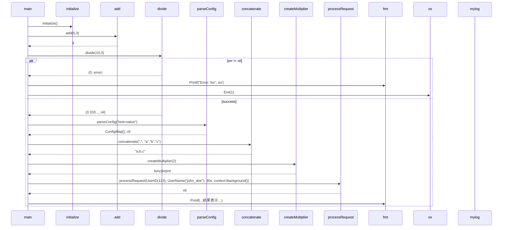

# fixtures\go\basic.go Review

## TL;DR

- 目的: Goの基本構文（定数・変数・型エイリアス・エラーハンドリング・高階関数・クロージャ・標準ライブラリ利用）をデモするサンプル。
- 公開API: 関数は**PublicFunction() string**のみ。公開データは**定数**（DefaultPort/MaxConnections/ServiceName/Version）と**型エイリアス**（UserID/UserName/ConfigMap）。
- コアロジック: エラーを返す**divide**、可変長結合**concatenate**、高階関数**processItems**、クロージャ生成**createMultiplier**、初期化**initialize**。
- 重大リスク: 未使用のドットインポート「. math」によりビルドエラー、未使用/副作用のないアンダースコアインポート「_ database/sql」、**global state**（isInitialized/globalCounter/serverConfig）による並行実行時のデータ競合リスク、**processor == nil**時のパニック（processItems）。
- エラー処理: divideの0除算は適切にエラー化、一方でparseConfigは実装未定でmainではエラーを破棄（config, _）。
- パフォーマンス: ほとんどO(1)、文字列結合とアイテム処理がO(n)。I/O（fmt.Printf）支配的。
- セキュリティ: 直接的なインジェクション経路は無し。秘密情報の扱いなし。認証・認可なし。ログ漏えいの懸念は低い。

## Overview & Purpose

このファイルは、Go言語の基本的な構成要素（パッケージ/インポート、定数・変数、型エイリアス、関数の多様なシグネチャ、エラー処理、関数値/クロージャ、標準ライブラリの利用、mainエントリポイント）を簡潔に示すデモです。実務アプリケーションを意図した実装ではなく、概念紹介用のサンプルとして位置づけられます（parseConfig/processRequestは未実装）。

## Structure & Key Components

| 種別 | 名前 | 公開範囲 | 責務 | 複雑度 |
|------|------|----------|------|--------|
| Const | DefaultPort | pub | デフォルトのポート番号 | Low |
| Const | MaxConnections | pub | 最大接続数 | Low |
| Const | ServiceName | pub | サービス名 | Low |
| Const | enableDebug | priv | デバッグフラグ（未使用） | Low |
| Const | Version | pub | バージョン表記 | Low |
| Var | globalCounter | priv | グローバルカウンタ（initializeで0リセット） | Low |
| Var | serverConfig | priv | 設定マップ（未使用） | Low |
| Var | isInitialized | priv | 初期化済フラグ（initializeでtrue） | Low |
| Var | appName | priv | アプリ名（未使用） | Low |
| Type alias | UserID | pub | ユーザID（int64） | Low |
| Type alias | UserName | pub | ユーザ名（string） | Low |
| Type alias | ConfigMap | pub | 設定（map[string]interface{}） | Low |
| Func | initialize() | priv | 初期化（フラグとカウンタ） | Low |
| Func | add(int,int) int | priv | 加算 | Low |
| Func | divide(float64,float64) (float64,error) | priv | 除算（0除算時エラー） | Low |
| Func | parseConfig(string) (ConfigMap,error) | priv | 文字列から設定を解釈（未実装） | Low |
| Func | concatenate(string, ...string) string | priv | 可変長文字列結合 | Low |
| Func | processRequest(UserID,UserName,time.Duration,context.Context) error | priv | リクエスト処理（未実装） | Low |
| Func | PublicFunction() string | pub | 公開関数デモ | Low |
| Func | privateFunction() string | priv | 非公開関数デモ | Low |
| Func | processItems([]string, func(string) string) []string | priv | 高階関数での要素処理 | Low |
| Func | createMultiplier(int) func(int) int | priv | 乗算クロージャ生成 | Low |
| Func | main() | entry | 実行例の組み立て | Med |

### Dependencies & Interactions

- 内部依存
  - main → initialize/add/divide/parseConfig/concatenate/createMultiplier/processRequest/privateな無名関数（square）
  - processItems は独立（mainでは未使用）
- 外部依存

| パッケージ | 用途 | 備考 |
|---|---|---|
| fmt | 出力 | PrintfでI/O |
| os | プロセス終了 | os.Exit(1) |
| strconv | 数値→文字列 | Itoa(DefaultPort) |
| strings | 文字列結合 | Join(items, separator) |
| context | コンテキスト | processRequest引数 |
| time | タイムアウト | processRequest引数 |
| database/sql | アンダースコア import | このままでは副作用なし（未使用） |
| math（. import） | ドット import | 本コードでは未使用のためビルドエラー原因 |
| log（mylog） | ロギング | エラーログに使用 |

- 被依存推定
  - PublicFunction, 定数・型エイリアスは外部パッケージから利用されうる。
  - 現状は単一mainパッケージ内デモのため、実運用での被依存は不明。

## API Surface (Public/Exported) and Data Contracts

| API名 | シグネチャ | 目的 | Time | Space |
|-------|-----------|------|------|-------|
| PublicFunction | func PublicFunction() string | 公開関数の最小例。固定文字列"public"を返す | O(1) | O(1) |

- 公開データ（定数）
  - DefaultPort int = 8080
  - MaxConnections int = 100
  - ServiceName string = "go-parser-test"
  - Version string = "1.0.0"

- 公開データ（型）
  - type UserID int64
  - type UserName string
  - type ConfigMap map[string]interface{}

詳細（PublicFunction）

1) 目的と責務
- 外部に公開される最小の関数例として固定文字列を返す。

2) アルゴリズム
- リテラル"public"を返却。

3) 引数
| 名前 | 型 | 必須 | 意味 |
|---|---|---|---|
| なし | なし | - | - |

4) 戻り値
| 型 | 意味 |
|---|---|
| string | 固定文字列"public" |

5) 使用例
```go
package main

import "fmt"

func main() {
    fmt.Println(PublicFunction()) // "public"
}
```

6) エッジケース
- なし（副作用なし、エラーなし）

データ契約（ConfigMap）
- キー: string、値: 任意（interface{}）。本ファイルではスキーマ不定。このため利用側で型アサーションとバリデーションが必須（parseConfigは未実装）。

根拠: PublicFunction/定数/型宣言は本ファイル内に定義（行番号: 不明）。

## Walkthrough & Data Flow

- initialize: グローバル状態をセット（isInitialized=true, globalCounter=0）。
- add: 2整数の加算。
- divide: 0除算検出時にerror返却。それ以外は商を返す。
- parseConfig: 空のConfigMapを返すのみ（実装省略）。
- concatenate: strings.Joinで文字列配列を区切り文字で結合。
- createMultiplier: 因子factorを閉包した関数を返す。
- processItems: 渡されたprocessorで各要素を処理して新スライス生成（processorがnilならpanic）。
- processRequest: 現状は何もせずnilを返す（実装省略）。
- main: 上記関数を順に呼び出して、標準出力/ログを出す。

Mermaidシーケンス図（mainの主要フロー）



上記の図はmain関数（行番号: 不明）の主要フローを示す。

## Complexity & Performance

- add, initialize, PublicFunction, privateFunction, createMultiplier: 時間O(1), 空間O(1)
- divide: 時間O(1), 空間O(1)
- concatenate: 時間O(n)（合計文字数に線形）、空間O(n)（新規バッファ確保）
- processItems: 時間O(n)（items長）、空間O(n)（結果スライス作成）
- parseConfig, processRequest: 現状はO(1)だが、実装次第でI/Oやパースコストが増加
- ボトルネック
  - 大量の文字列をconcatenateすると再割り当て・コピーでCPU/メモリ負荷
  - fmt.PrintfはI/Oコストが高く、繰り返し呼び出しはパフォーマンスに影響
- スケール限界
  - グローバル状態のため、並行処理時の同期無し利用はスループットの頭打ちとデータ競合の温床

## Edge Cases, Bugs, and Security

エッジケース・不具合

| エッジケース | 入力例 | 期待動作 | 実装 | 状態 |
|-------------|--------|----------|------|------|
| 0除算 | divide(1,0) | errorを返す | b==0でerror返却 | OK |
| 空またはnilのitems | concatenate(",", nil...) | ""を返す | strings.Joinが空文字返却 | OK |
| processorがnil | processItems([]{"a"}, nil) | Err(nil processor) or no-op | nil呼び出しでpanic | 要修正 |
| itemsがnil | processItems(nil, f) | 空スライス返却 | 空スライス返却 | OK |
| parseConfigの失敗 | "不正形式" | エラーを返す | 実装未・常にnilエラー | 要実装 |
| mainでのエラー無視 | config, _ := parseConfig(...) | エラーを扱う | エラー破棄 | 要改善 |
| 未使用ドットimport | import . "math" | 使用 or 削除 | 未使用→ビルドエラー | 要修正 |
| アンダースコアimportの無意味化 | import _ "database/sql" | ドライバinitの副作用 | database/sql単体では副作用なし | 要修正/削除 |
| グローバル状態の競合 | initialize併用 | スレッド安全 | 同期なし | 並行性リスク |
| os.Exitの副作用 | エラー時終了 | 正常だがdefer未実行に注意 | 使用 | 設計要確認 |

セキュリティチェックリスト

- メモリ安全性: Goの型安全で直接的なバッファオーバーフローやUAFは見られない。processorがnilのときpanic（DoSにつながる恐れ）(processItems: 行番号不明)。
- インジェクション: SQL/コマンド/パスは未使用。database/sqlはドライバ未指定で無害。
- 認証・認可: 該当なし（このチャンクには現れない）。
- 秘密情報: ハードコードされたシークレットなし。ログ漏えいの可能性低。
- 並行性: グローバル変数に対するデータ競合の可能性（このチャンクではgoroutineなしだが、拡張時はsync保護必須）。

根拠: divideの0チェック、processItemsのprocessor呼び出し、import群（行番号: 不明）。

## Design & Architecture Suggestions

- グローバル状態を廃止
  - App/Server構造体を導入し、isInitialized/globalCounter/serverConfigをフィールド化。コンストラクタNewApp(ctx, cfg)で初期化。
- エラーハンドリングの一貫性
  - parseConfigを実装し、明確なエラー（sentinelまたはwrapped error）を返す。mainでエラーを破棄しない。
- APIの明確化
  - processRequestはcontextとtimeoutを尊重し、ctx.Done()監視と期限超過のエラーを返す。
- インポート整備
  - . "math" は削除（または使用箇所を明示的にmath.Abs等に変更）。
  - _ "database/sql" は不要。実際にドライバを使う場合は _ "github.com/lib/pq" のようなドライバをimport。
- 安全性
  - processItemsでprocessor == nilを検出しエラー返却またはno-opにする。
- ロギング
  - 標準logよりも構造化ロギング（log/slogやzap）とcontextの関連付けを検討。
- 名前付け・公開範囲
  - 実用コードではPublicFunctionのようなダミーは避け、公開APIは最小限に。

## Testing Strategy (Unit/Integration) with Examples

推奨: テーブル駆動テストとサブテスト。以下は単体テスト例。

- divide: 正常系と0除算
```go
package main

import "testing"

func TestDivide(t *testing.T) {
    got, err := divide(10, 2)
    if err != nil {
        t.Fatalf("unexpected error: %v", err)
    }
    if got != 5 {
        t.Errorf("want 5, got %v", got)
    }
}

func TestDivide_ByZero(t *testing.T) {
    _, err := divide(1, 0)
    if err == nil {
        t.Fatalf("expected error, got nil")
    }
}
```

- concatenate: 空・複数
```go
func TestConcatenate(t *testing.T) {
    if got := concatenate(",", "a", "b"); got != "a,b" {
        t.Errorf("want a,b got %s", got)
    }
    if got := concatenate(",", []string{}...); got != "" {
        t.Errorf("want empty got %q", got)
    }
}
```

- processItems: 正常系とnil processor
```go
func TestProcessItems(t *testing.T) {
    items := []string{"a", "b"}
    upper := func(s string) string { return strings.ToUpper(s) }
    got := processItems(items, upper)
    want := []string{"A", "B"}
    for i := range want {
        if got[i] != want[i] {
            t.Fatalf("idx %d: want %s got %s", i, want[i], got[i])
        }
    }
}

func TestProcessItems_NilProcessorPanics(t *testing.T) {
    defer func() {
        if r := recover(); r == nil {
            t.Fatalf("expected panic on nil processor, got none")
        }
    }()
    _ = processItems([]string{"a"}, nil)
}
```

- createMultiplier
```go
func TestCreateMultiplier(t *testing.T) {
    times2 := createMultiplier(2)
    if got := times2(7); got != 14 {
        t.Errorf("want 14 got %d", got)
    }
}
```

- PublicFunction
```go
func TestPublicFunction(t *testing.T) {
    if got := PublicFunction(); got != "public" {
        t.Errorf("want public got %s", got)
    }
}
```

- processRequest（要仕様）
  - ctxキャンセル時に文脈エラーを返す設計が望ましい。実装後に以下のようなテストを追加:
```go
func TestProcessRequest_ContextCanceled(t *testing.T) {
    ctx, cancel := context.WithCancel(context.Background())
    cancel()
    err := processRequest(UserID(1), UserName("x"), time.Second, ctx)
    if err == nil {
        t.Fatalf("expected context cancellation error")
    }
}
```

## Refactoring Plan & Best Practices

1) ビルド修正
- 削除: import . "math"
- 削除: import _ "database/sql"（必要なら実ドライバに置換）

2) 安全性
- processItemsでnil processorを検出しエラー返しに変更（戻り値とエラーのタプルに変更も検討）

3) エラーハンドリング
- parseConfigを実装して、データ不正時にエラー
- mainでparseConfigのエラーを処理し、os.Exit前に必要なクリーンアップ

4) 設計の見直し
- App構造体導入でグローバル変数を排除
- processRequestでctx/timeoutを尊重（selectでctx.Done()を監視）

5) API整備
- 公開API（定数・型）のドキュメントコメント追加
- PublicFunctionは用途に応じて削除/リネーム

6) 観測性
- ログを構造化し、識別子（request id等）を出力
- メトリクス（処理件数、エラー数、レイテンシ）導入

## Observability (Logging, Metrics, Tracing)

- Logging
  - mylog.Printf使用箇所を拡張し、レベル（Info/Warn/Error）とkey-valueで構造化。
  - エラーにはwrapして文脈付与（fmt.Errorf("...: %w", err)）。
- Metrics
  - 処理回数（processRequest呼び出し）、エラー数、処理時間ヒストグラムを追加（例: OpenTelemetry/Prometheus）。
- Tracing
  - contextにトレースを紐づけ、processRequestや外部I/O（将来追加時）をspan化。
- 例: コンテキスト対応のログ/メトリクス（擬似コード）
```go
func processRequest(id UserID, name UserName, timeout time.Duration, ctx context.Context) error {
    // start trace span...
    // record metrics...
    // log with request context...
    return nil
}
```

## Risks & Unknowns

- 未実装部分
  - parseConfig / processRequestの仕様が不明。このチャンクには現れないため、返却エラー方針・データスキーマ・I/O要件は不明。
- インポート方針
  - database/sqlのアンダースコアimportは有効な副作用を持たないため、意図不明。適切なドライバimportが必要かは不明。
- 並行実行要件
  - グローバル状態に対する排他要件は不明。今後goroutineでの利用が想定されるなら設計変更が必須。
- エラーポリシー
  - mainがエラーで即os.Exitする基準や、ログ/ユーザ通知戦略が不明。
- ビルド状態
  - . "math" の未使用によりビルド不可。意図的な構文デモか、過誤かは不明。

以上により、公開APIは極小であり、安全性・並行性・観測性はサンプル水準です。実用化する場合は、インポート整理、エラー設計、状態管理の再設計が最優先となります。