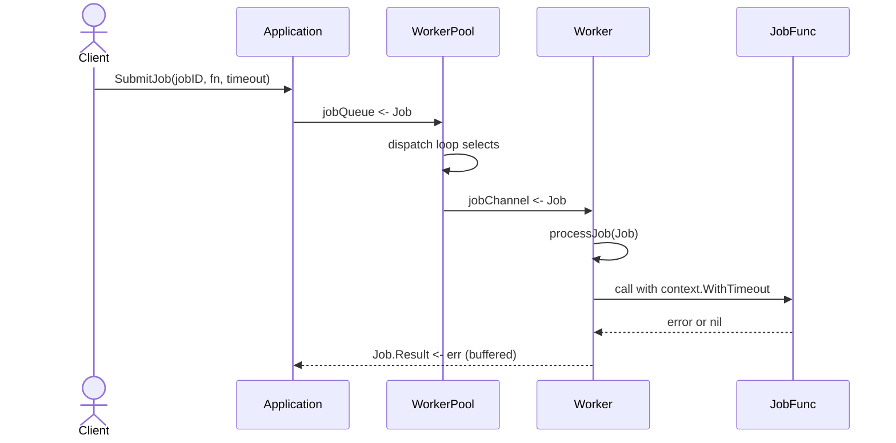

# complex.go Review

## TL;DR

- 目的: 汎用のジョブ実行基盤（WorkerPool + Application）と、バッチ処理/リトライ/フィルタリングなどの実用的パターンを提供
- 主要公開API: NewApplication/Start/Stop/SubmitJob/WaitForJob、NewWorkerPool、ProcessBatch、CreateRetryFunc、Pipeline、DefaultProcessor、InitializeApplicationWithDefaults、Logger
- 複雑箇所: WorkerPoolのディスパッチ/ワーカー制御（チャネル間連携とゴルーチン運用）、リトライクロージャの時間制御、ジェネリックPipeline
- 重大リスク: WorkerPool.StopがWorkerを停止しないためゴルーチンリーク/デッドロックの可能性、WaitForJobが結果待機を実装していない、ProcessBatchがMaxConcurrent/RetryPolicyを未使用、unsafe.Pointerの露出
- エラー/並行性: コンテキストとタイムアウトを広く活用している一方、Quitシグナルの配布不足・WaitGroupのカバレッジ不足・ブロッキングポイントが存在
- パフォーマンス: ProcessBatchは逐次O(n)、PipelineはO(n*k)。WorkerPoolのジョブ毎ゴルーチンスピンは高負荷下でオーバーヘッドとなりうる
- セキュリティ/安全性: ハードコード秘密は無し。unsafe.Pointerの戻りは型安全性を損ねうる。ログ出力で機密が出る可能性に配慮が必要

## Overview & Purpose

このファイルは、現実的なGoの構成要素（ワーカープール、DI向けインタフェース、メトリクス収集、ヘルスチェック、ジェネリクス、リトライ制御、ログI/F）をまとめたサンプル実装です。中心となるのは、チャネルとゴルーチンを使ったジョブ実行の抽象化（WorkerPool、Application）で、ジョブを非同期に投入し、任意のProcessor（DI）で処理できるようにします。また、バッチ処理（ProcessBatch）、汎用フィルタパイプライン（Pipeline）、リトライ関数生成（CreateRetryFunc）など、周辺のユーティリティも提供します。

## Structure & Key Components

| 種別 | 名前 | 公開範囲 | 責務 | 複雑度 |
|------|------|----------|------|--------|
| Const | StatusUnknown/Pending/Running/Completed/Failed | exported | ジョブ状態の定数 | Low |
| Type | Status | exported | ステータス種別 | Low |
| Type | WorkerID | exported | ワーカー識別子 | Low |
| Type | JobFunc | exported | ジョブ関数シグネチャ | Low |
| Struct | Job | exported | ジョブID/関数/タイムアウト/結果チャネル | Low |
| Struct | WorkerPool | exported | ワーカープール本体、キュー/ディスパッチ | Med |
| Struct | Worker | exported | 単一ワーカー、ジョブ受信/実行 | Med |
| Interface | JobProcessor | exported | ジョブ処理抽象（DI） | Low |
| Struct | ProcessorStats | exported | 処理統計（トータル/成功/失敗/平均時間） | Low |
| Struct | Application | exported | アプリ全体（プール、ctx、設定、プロセッサ、メトリクス） | Med |
| Struct | Config | exported | 設定（MaxWorkers/Timeout/Retryなど、JSON/YAMLタグ付） | Low |
| Interface | Logger | exported | ログI/F（Debug/Info/Warning/Error） | Low |
| Struct | DefaultProcessor | exported | JobProcessor実装（統計更新） | Low |
| Struct | BatchOptions | exported | バッチ設定（FailFast/MaxConcurrent/RetryPolicy） | Low |
| Struct | BatchResult | exported | バッチ結果（開始/終了、各ジョブ結果） | Low |
| Struct | JobResult | exported | 単一ジョブ結果（ID/エラー/所要時間） | Low |
| Struct | RetryPolicy | exported | リトライ回数とバックオフ関数 | Low |
| Generic Type | TransformFunc/FilterFunc/ReduceFunc | exported | 汎用高階関数型 | Low |
| Interface | Configurable | exported | 設定適用I/F | Low |
| Struct | DefaultLogger | exported | デフォルトログ出力（fmt.Printf） | Low |
| Func | NewApplication | exported | Applicationの構築 | Low |
| Method | (a *Application) Start/Stop/SubmitJob/WaitForJob | exported | 起動/停止/ジョブ投入/待機 | Med |
| Func | NewWorkerPool | exported | ワーカープール作成 | Low |
| Method | (wp *WorkerPool) Start/Stop | exported | ワーカープール起動/停止 | Med |
| Func | NewWorker | exported | ワーカー作成 | Low |
| Method | (w Worker) Start/Stop | exported | ワーカー起動/停止（チャネルで制御） | Med |
| Func | ProcessBatch | exported | バッチ逐次処理（FailFast対応） | Med |
| Generic Func | Pipeline | exported | フィルタ連鎖 | Low |
| Func | CreateRetryFunc | exported | リトライ関数の生成 | Med |
| Method | (a *Application) Configure/GetConfiguration | exported | 設定I/F実装 | Low |
| Func | InitializeApplicationWithDefaults | exported | デフォルト初期化 | Low |

下位セクション「Dependencies & Interactions」

- 内部依存
  - Application → WorkerPool.Start/Stop/dispatch, runMetricsCollector, runHealthCheck, collectMetrics, performHealthCheck
  - WorkerPool.dispatch → WorkerPool.workers（各Workerが提供）/ jobQueue
  - Worker.Start → processJob（JobFunc呼び出し）
  - DefaultProcessor.Process → Job.Function（JobFunc）
  - ProcessBatch → JobProcessor.Process, timeouts
  - CreateRetryFunc → time.After, context.Done
  - Pipeline → FilterFunc群
- 外部依存（標準ライブラリのみ）

| パッケージ | 用途 |
|-----------|------|
| context | キャンセル/タイムアウト制御 |
| fmt | 文字列整形/エラー生成/ログ |
| sync | WaitGroup, Mutex, Map |
| time | タイムアウト、Ticker、バックオフ |
| unsafe | unsafe.Pointer（デモ） |

- 被依存推定
  - 上位アプリケーションがApplicationを使ってジョブライフサイクルを管理
  - 外部実装がJobProcessorを実装してDI
  - バッチ処理/ユーティリティ（ProcessBatch, CreateRetryFunc, Pipeline）はライブラリ的に再利用

## API Surface (Public/Exported) and Data Contracts

| API名 | シグネチャ | 目的 | Time | Space |
|-------|-----------|------|------|-------|
| NewApplication | func NewApplication(config *Config, logger Logger) (*Application, error) | アプリ初期化 | O(1) | O(1) |
| (*Application).Start | func (a *Application) Start() error | プール/メトリクス/ヘルス起動 | O(W) | O(1) |
| (*Application).Stop | func (a *Application) Stop() error | キャンセルと停止 | O(1)〜待機 | O(1) |
| (*Application).SubmitJob | func (a *Application) SubmitJob(id string, fn JobFunc, t time.Duration) error | ジョブ投入 | O(1) | O(1) |
| (*Application).WaitForJob | func (a *Application) WaitForJob(id string, t time.Duration) (interface{}, error) | ジョブ完了待機（簡易） | O(1) | O(1) |
| NewWorkerPool | func NewWorkerPool(maxWorkers int) (*WorkerPool, error) | プール構築 | O(1) | O(W) |
| (*WorkerPool).Start | func (wp *WorkerPool) Start() | ワーカー生成・ディスパッチ起動 | O(W) | O(W) |
| (*WorkerPool).Stop | func (wp *WorkerPool) Stop() | ディスパッチ停止 | O(1)待機 | O(1) |
| NewWorker | func NewWorker(id WorkerID, pool chan chan Job) Worker | ワーカー構築 | O(1) | O(1) |
| (Worker).Start | func (w Worker) Start() | ワーカー起動 | O(1) | O(1) |
| (Worker).Stop | func (w Worker) Stop() | ワーカー停止通知 | O(1) | O(1) |
| ProcessBatch | func ProcessBatch(ctx context.Context, jobs []Job, p JobProcessor, opt BatchOptions) (*BatchResult, error) | バッチ逐次処理 | O(n) | O(n) |
| CreateRetryFunc | func CreateRetryFunc(maxAttempts int, backoff time.Duration) func(JobFunc) JobFunc | リトライ関数生成 | O(1)生成/実行時O(k) | O(1) |
| Pipeline | func Pipeline[T any](input []T, filters ...FilterFunc[T]) []T | ジェネリックフィルタ | O(nk) | O(n) |
| (*DefaultProcessor).Process | func (p *DefaultProcessor) Process(ctx context.Context, job Job) error | ジョブ実行+統計 | O(1)+job | O(1) |
| (*DefaultProcessor).GetStats | func (p *DefaultProcessor) GetStats() ProcessorStats | 統計取得 | O(1) | O(1) |
| (*Application).Configure | func (a *Application) Configure(config map[string]interface{}) error | 設定I/F（ダミー） | O(1) | O(1) |
| (*Application).GetConfiguration | func (a *Application) GetConfiguration() map[string]interface{} | 設定の可視化 | O(1) | O(1) |
| InitializeApplicationWithDefaults | func InitializeApplicationWithDefaults() (*Application, error) | 既定初期化 | O(1) | O(1) |
| Logger各種 | Debug/Info/Warning/Error | ロギングI/F | O(1) | O(1) |
| Data | Config | 設定（JSON/YAMLタグ） | — | — |
| Data | ProcessorStats | 統計値 | — | — |
| Data | BatchOptions | バッチ設定 | — | — |
| Data | BatchResult/JobResult | バッチ結果 | — | — |
| Data | RetryPolicy | リトライ方針 | — | — |
| Data | Job/JobFunc/Status/WorkerID | コアデータ/型 | — | — |

以下、コアAPIの詳細。

1) NewApplication

- 目的と責務
  - Applicationを構築し、内部にWorkerPoolを組み込む。config検証、キャンセル可能なcontext生成。
- アルゴリズム
  1. configがnilならエラー
  2. context.WithCancelでctx/cancelを作成
  3. Applicationフィールドを初期化（processors map、metrics sync.Map、doneチャネル）
  4. NewWorkerPool(config.MaxWorkers)でプール生成。失敗時はcancelしてエラー
- 引数

| 名 | 型 | 説明 |
|---|---|----|
| config | *Config | 必須設定 |
| logger | Logger | 任意実装のロガー |

- 戻り値

| 名 | 型 | 説明 |
|---|---|----|
| app | *Application | 初期化済みApplication |
| err | error | 失敗理由 |

- 使用例
```go
app, err := complex.NewApplication(&complex.Config{MaxWorkers: 4}, &complex.DefaultLogger{})
if err != nil { panic(err) }
```
- エッジケース
  - config == nil → エラー
  - MaxWorkers <= 0 → NewWorkerPoolでエラー

2) (*Application).Start

- 目的と責務
  - WorkerPool起動、メトリクス/ヘルスチェックのゴルーチン起動
- アルゴリズム
  1. ログ
  2. a.WorkerPool.Start()
  3. EnableMetricsならrunMetricsCollectorをgo起動
  4. runHealthCheckをgo起動
- 引数/戻り値
  - 引数なし / error（現状は常にnil）
- 使用例
```go
if err := app.Start(); err != nil { /* handle */ }
```
- エッジケース
  - EnableMetrics=false → メトリクス起動なし
  - WorkerPool.Startが内部でパニックしない前提

3) (*Application).Stop

- 目的と責務
  - 全体停止（ctxキャンセル、WorkerPool停止、doneクローズ）
- アルゴリズム
  1. a.cancel()
  2. a.WorkerPool.Stop()
  3. close(a.done)
- エッジケース
  - WorkerPool.Stopがワーカーを停止しないためゴルーチンリークの可能性（詳細はBugs参照）

4) (*Application).SubmitJob

- 目的と責務
  - Jobを構築し、WorkerPoolのjobQueueへ送る
- アルゴリズム
  1. Job{ID, Function, Timeout, Result(バッファ1)}を作成
  2. selectでjobQueue送信/ctx.Done/5秒タイムアウト
- 引数

| 名 | 型 | 説明 |
|---|---|----|
| jobID | string | ジョブ識別子 |
| fn | JobFunc | 実行関数 |
| timeout | time.Duration | ジョブタイムアウト |

- 戻り値: error（投入成功/失敗）
- 使用例
```go
_ = app.SubmitJob("job-1", func(ctx context.Context) error {
    // work
    return nil
}, 2*time.Second)
```
- エッジケース
  - ctx.Done済み → エラー
  - jobQueue輻輳 → 5秒でタイムアウト

5) (*Application).WaitForJob

- 目的と責務
  - 指定時間待つ簡易待機（結果は未実装）
- アルゴリズム
  1. timerを作りselectでタイムアウト/ctx.Doneを待つ
- 返り値
  - 常に結果はnil、タイムアウトまたはキャンセルのエラーのみ
- 注意
  - 実ジョブ結果のトラッキングは未実装（コメントに明記）

6) NewWorkerPool/(*WorkerPool).Start/Stop

- 目的と責務
  - プール作成、ワーカー起動、ディスパッチ制御
- 要点
  - Start: maxWorkers分のWorkerを生成しStart()、dispatchをgo起動
  - Stop: quitにtrueを送信しWaitGroup待機（dispatchのみ待つ）
- エッジケース
  - StopがWorkerを止めないためリークの可能性

7) NewWorker/(Worker).Start/Stop

- 目的と責務
  - ワーカー生成、jobChannelをプールに登録しジョブ受信、quit受信で停止
- 要点
  - Start: ループ内でworkerPoolに自身のjobChannelを送った後、job受信or quit待ち
- エッジケース
  - quitはWorkerPoolから送られないため、Stopが呼ばれなければ停止しない
  - workerPool送信でブロック中はquitを受け取れず停止不能（バグ候補）

8) ProcessBatch

- 目的と責務
  - jobsを逐次処理し、FailFast時は最初の失敗で終了
- アルゴリズム
  1. BatchResult初期化（StartTime）
  2. 各jobに対しWithTimeout→processor.Process→結果格納（DurationはStartTimeからの経過）
  3. FailFastかつエラーなら終了
  4. EndTime設定
- 引数

| 名 | 型 | 説明 |
|---|---|----|
| ctx | context.Context | バッチ全体のコンテキスト |
| jobs | []Job | 対象ジョブ |
| processor | JobProcessor | 実処理 |
| options | BatchOptions | FailFastなど |

- 戻り値: (*BatchResult, error)
- 使用例
```go
res, err := complex.ProcessBatch(ctx, jobs, proc, complex.BatchOptions{FailFast: true})
```
- エッジケース
  - MaxConcurrent/RetryPolicyは未使用（設計ギャップ）
  - Durationが各ジョブ個別時間ではなくバッチ開始からの累計（仕様の不整合）

9) CreateRetryFunc

- 目的と責務
  - JobFuncにリトライ機能を付与
- アルゴリズム
  1. attemptを0..maxAttempts-1でループ
  2. 成功なら即return nil
  3. 失敗時、最後でなければctx.Doneまたはtime.After(backoff*(attempt+1))で待つ
  4. 最終的にエラー包んで返す
- 引数/戻り値
  - maxAttempts int, backoff time.Duration → func(JobFunc) JobFunc
- 使用例
```go
retry := complex.CreateRetryFunc(3, 100*time.Millisecond)
job := retry(func(ctx context.Context) error { return errors.New("fail") })
err := job(context.Background())
```
- エッジケース
  - maxAttempts == 0 → ループ未実行、nilをwrapしたエラーが返る（挙動が直観的でない）
  - backoff=0 → 即時再試行（高負荷リスク）

10) Pipeline

- 目的と責務
  - フィルタ関数を順に適用する汎用ユーティリティ
- 計算量
  - O(nk)（n:要素数, k:フィルタ数）
- 使用例
```go
out := complex.Pipeline([]int{1,2,3,4},
    func(x int) bool { return x%2==0 },
    func(x int) bool { return x>2 },
) // -> [4]
```

11) (*DefaultProcessor).Process/GetStats

- 目的
  - JobFunc実行と統計更新（排他制御）
- 注意
  - AverageTimeが直近の処理時間に上書きされ真の平均ではない

12) InitializeApplicationWithDefaults

- 目的
  - デフォルトConfig/LoggerでApplicationを構築し"default"プロセッサを登録

データコントラクト（抜粋）
- Config: MaxWorkers, JobTimeout, RetryAttempts, EnableMetrics, LogLevel（JSON/YAMLタグ付き）
- ProcessorStats: TotalJobs, SuccessfulJobs, FailedJobs, AverageTime
- BatchOptions: FailFast, MaxConcurrent, RetryPolicy
- BatchResult/JobResult: バッチの開始/終了、各ジョブのエラーとDuration
- RetryPolicy: MaxAttempts, BackoffFunc

根拠（関数名:行番号）: 行番号はこのチャンクには現れないため不明。関数名は本ファイル内の定義に一致。

## Walkthrough & Data Flow

ジョブ投入から実行までの流れ:

- ClientがApplication.SubmitJobでJobをjobQueueへ送信
- WorkerPool.dispatchがjobQueueからJobを受信し、空いているWorkerのjobChannelを取得してJobを送信
- Worker.StartのループでjobChannelからJobを受け取り、processJobでコンテキスト付きでJobFuncを実行し、結果をJob.Resultへ送信

Mermaidシーケンス図:



上記の図はSubmitJob / WorkerPool.dispatch / Worker.Start / Worker.processJobの主要フローを示す（行番号: 不明）。

CreateRetryFuncの分岐フロー:

```mermaid
flowchart TD
    A[開始 attempt=0] --> B{original(ctx) エラー?}
    B -- いいえ --> C[return nil]
    B -- はい --> D{attempt < maxAttempts-1?}
    D -- いいえ --> E[return fmt.Errorf(... lastErr)]
    D -- はい --> F{ctx.Done?}
    F -- はい --> G[return ctx.Err()]
    F -- いいえ --> H[time.After(backoff*(attempt+1))]
    H --> I[attempt++]
    I --> B
```

該当コード: CreateRetryFunc（行番号: 不明）

## Complexity & Performance

- SubmitJob: 平均O(1)（チャネル送信）。輻輳時に最大5秒待機
- WorkerPool.dispatch: 各ジョブにつき1ゴルーチン生成（オーバーヘッド）。空きワーカー取得/送信はO(1)期待
- Worker.processJob: O(ジョブ処理時間)
- ProcessBatch: O(n) 逐次。MaxConcurrent未使用のためスループットは単一スレッド相当
- Pipeline: O(nk)、中間スライス作成によるメモリO(n)
- DefaultProcessor.Process: ロックの粒度は短い（統計更新時のみ）。AverageTime計測の定義が不正確なため値の有用性は限定的
- スケール限界/ボトルネック
  - WorkerPoolのジョブ毎ゴルーチンスピン（dispatch内）と、Worker停止手段不備によるリソースリークで長期運用時のメモリ/ゴルーチン数が膨らむリスク
  - ProcessBatchが逐次処理のため大量ジョブでは遅い（MaxConcurrentを活かせていない）

## Edge Cases, Bugs, and Security

エッジケース一覧

| エッジケース | 入力例 | 期待動作 | 実装 | 状態 |
|-------------|--------|----------|------|------|
| 無効なMaxWorkers | maxWorkers <= 0 | エラー | NewWorkerPoolで検証 | 対応済 |
| SubmitJob時のシャットダウン | app.ctx.Done | エラー返却 | select分岐あり | 対応済 |
| SubmitJob輻輳 | jobQueue満杯 | 一定時間でタイムアウト | 5秒でタイムアウト | 対応済 |
| WaitForJobで結果受領 | jobID="x" | 結果/エラー待機 | 実装なし（タイムアウト/ctxのみ） | 未対応 |
| Stop時にWorker停止 | Stop呼び出し | すべてのWorker停止 | WorkerPool.Stopはdispatchのみ停止 | 未対応（バグ） |
| Workerの停止不可 | workerPool送信でブロック | quit受信して停止 | 送信前でブロック中はquitを受け取れない | バグ可能性 |
| ProcessBatch並行度 | MaxConcurrent>1 | 並行処理 | 未使用 | 未対応 |
| ProcessBatchリトライ | RetryPolicy設定 | リトライ適用 | 未使用 | 未対応 |
| 平均処理時間の定義 | 複数ジョブ | 真の平均 | 直近時間に上書き | 不備 |
| JobResult.Duration | 個別時間 | 個別の実時間 | バッチ開始からの経過 | 仕様不整合 |
| CreateRetryFunc(0) | maxAttempts=0 | 即成功or明確な失敗 | nilをwrapしたエラー返却 | 要見直し |
| unsafe.Pointer露出 | getInternalPointer | 型安全維持 | unsafeで返す | リスク |

セキュリティチェックリスト

- メモリ安全性
  - Go自体はメモリ安全だが、unsafe.Pointerを返すgetInternalPointerは型/ライフタイム安全性を破壊しうる。外部での不正キャストによる破壊的操作のリスク
  - バッファオーバーフロー/Use-after-free/整数オーバーフロー: 該当なし（このコードに生の配列操作や危険な整数算術は無い）
- インジェクション
  - SQL/コマンド/パス: 該当なし
- 認証・認可
  - 本コードは認証/認可を扱わない
- 秘密情報
  - ハードコード秘密: なし
  - ログ漏えい: Loggerに渡すfieldsに機密が含まれると出力される可能性。マスキング等は未実装
- 並行性
  - Race condition: DefaultProcessorはRWMutexで保護、Application.metricsはsync.Mapで安全
  - Deadlock/Leak:
    - WorkerPool.StopがWorker停止を指示しないため、Workerの無限ループ存続
    - Worker.Startの「w.workerPool <- w.jobChannel」送信でブロックするとquitを受信できず停止不能（停止時のデッドロック/リークリスク）
    - Stopの待機はdispatchのWaitGroupのみで、Workersは未追跡

Rust観点の安全性（準拠の参考）
- Rustの所有権/借用に相当する厳格な生存期間管理がGoには無く、unsafe.Pointerは特に危険。getInternalPointerはRustならunsafeブロックと明示的ライフタイム境界が必要。Goでも返却を避け、必要なら読み取り専用の値コピーを返すべき
- 並行性はRustではSend/Sync境界で静的保証するが、Goは実行時の規約頼み。チャネル操作と終了シグナルの設計を見直すことでRustライクな健全性に近づける

根拠（関数名:行番号）: 行番号は不明。該当箇所は本ファイル内の定義（Worker.Start/Stop/dispatch/getInternalPointer/ProcessBatch/CreateRetryFuncなど）。

## Design & Architecture Suggestions

- Worker停止の明示的制御
  - WorkerPoolが全Workerの参照を保持し、Stopで全Worker.Stop()を呼ぶ
  - workerPool送信とquit受信をselectで競合させるパターンに変更
  - quitチャネルはcloseでブロードキャストする方が安全
- WaitGroupの適用範囲拡大
  - dispatchだけでなく、各Worker起動時にAdd、終了時にDone
- WaitForJobの実装
  - jobID→Job.ResultのマップをApplicationで保持し、完了時にclose/削除
  - 競合を避けるためsync.Mapか専用マップ+Mutex
- ProcessBatchの拡張
  - MaxConcurrentに基づくセマフォ/ワーカープールでの並列実行
  - RetryPolicy適用（BackoffFunc使用）
  - Jobごとの開始時刻でDurationを算出
- 統計値の改善
  - AverageTimeは移動平均や加重平均に変更（sum/totalで算出）
- unsafe除去
  - getInternalPointerは削除か、内部パッケージ限定/デバッグ限定に
- ロギング
  - フィールドをkey-valueの構造に統一。機密フィールドのマスキングポリシー

## Testing Strategy (Unit/Integration) with Examples

ユニットテスト例（要: testingパッケージ）

1) NewWorkerPoolの検証
```go
func TestNewWorkerPool_Invalid(t *testing.T) {
    if _, err := complex.NewWorkerPool(0); err == nil {
        t.Fatal("expected error for maxWorkers <= 0")
    }
}
```

2) WorkerPoolでジョブが実行される
```go
func TestWorkerPool_JobExecution(t *testing.T) {
    wp, _ := complex.NewWorkerPool(2)
    wp.Start()
    defer wp.Stop()

    done := make(chan struct{})
    job := complex.Job{
        ID: "j1",
        Timeout: time.Second,
        Function: func(ctx context.Context) error { close(done); return nil },
        Result: make(chan error, 1),
    }
    select {
    case wp.jobQueue <- job:
    case <-time.After(time.Second):
        t.Fatal("submit timeout")
    }
    select {
    case <-done:
    case <-time.After(time.Second):
        t.Fatal("job not executed")
    }
}
```

3) Application.SubmitJobタイムアウト/キャンセル
```go
func TestApplication_SubmitJob_Cancelled(t *testing.T) {
    app, _ := complex.NewApplication(&complex.Config{MaxWorkers: 1}, &complex.DefaultLogger{})
    _ = app.Start()
    _ = app.Stop() // cancel context

    err := app.SubmitJob("id", func(ctx context.Context) error { return nil }, time.Second)
    if err == nil {
        t.Fatal("expected error when app is shutting down")
    }
}
```

4) ProcessBatch FailFastとDuration
```go
func TestProcessBatch_FailFast(t *testing.T) {
    jobs := []complex.Job{
        {ID: "1", Timeout: time.Second, Function: func(ctx context.Context) error { return errors.New("x") }},
        {ID: "2", Timeout: time.Second, Function: func(ctx context.Context) error { return nil }},
    }
    res, err := complex.ProcessBatch(context.Background(), jobs, &complex.DefaultProcessor{}, complex.BatchOptions{FailFast: true})
    if err == nil || res == nil {
        t.Fatal("expected failfast error and partial result")
    }
}
```

5) CreateRetryFuncの挙動（ctxキャンセル）
```go
func TestCreateRetryFunc_Cancel(t *testing.T) {
    retry := complex.CreateRetryFunc(3, 10*time.Millisecond)
    f := retry(func(ctx context.Context) error { return errors.New("fail") })
    ctx, cancel := context.WithCancel(context.Background())
    cancel()
    if err := f(ctx); err == nil || !errors.Is(err, context.Canceled) {
        t.Fatal("expected context canceled")
    }
}
```

6) Pipelineフィルタ適用
```go
func TestPipeline_Filter(t *testing.T) {
    out := complex.Pipeline([]int{1,2,3,4},
        func(x int) bool { return x%2==0 },
        func(x int) bool { return x>2 },
    )
    if len(out) != 1 || out[0] != 4 {
        t.Fatalf("unexpected: %v", out)
    }
}
```

並行性テスト（リーク検知）には、ゴルーチン数の計測やcontextのタイムアウトを活用。

## Refactoring Plan & Best Practices

- Worker制御の是正
  - WorkerPoolに[]*Workerを保持
  - Startでwg.Add(1) per worker、worker終了でwg.Done()
  - Stopで全Worker.Stop()を呼び、quitチャネルはcloseにする
  - Worker.Startは次のようにquitと登録送信をselectで競合
```go
func (w Worker) Start() {
    go func() {
        for {
            select {
            case w.workerPool <- w.jobChannel:
                // registered
            case <-w.quit:
                return
            }
            select {
            case job := <-w.jobChannel:
                w.processJob(job)
            case <-w.quit:
                return
            }
        }
    }()
}
```
- WaitForJobの実装
  - Applicationにresults: map[string]chan errorを追加し、SubmitJob時に登録、processJobで送信/close、WaitForJobでselect
- ProcessBatchの並列化/RetryPolicy
  - セマフォchanで同時実行数制限
  - RetryPolicy.BackoffFuncを用いてProcessor.Processにリトライラッパを適用
- 統計の平均化
```go
// 加算平均
p.stats.TotalJobs++
elapsed := time.Since(start)
p.stats.AverageTime = (p.stats.AverageTime*time.Duration(p.stats.TotalJobs-1) + elapsed) / time.Duration(p.stats.TotalJobs)
```
- unsafeの削除
  - getInternalPointerを削除。内部用途ならテストビルドタグで限定
- エラーモデル一貫性
  - CreateRetryFunc(0)は即座にoriginalを1回だけ実行 or ErrInvalidAttemptsを返すなど明確化

## Observability (Logging, Metrics, Tracing)

- ログ
  - Loggerを構造化（key-value）に統一し、機密値のマスキングを実装
  - Start/Stop/Submit/Dispatch/Retryなど主要イベントにログレベル指針を設定
- メトリクス
  - Application.collectMetricsはProcessorStatsをsync.Mapに保存。Prometheusなどへのエクスポート層を追加可能
  - 処理時間ヒストグラム、失敗率、キュー長、ワーカー稼働数など
- トレーシング
  - contextにtrace/spanを流し、JobFunc/Processor.Processの境界でspanを開始/終了
- ヘルスチェック
  - performHealthCheckを拡張し、キュー長/ワーカー稼働/エラー率によるStatusを返す

## Risks & Unknowns

- Worker停止の不備によりゴルーチンリーク/停止待ち無限待機のリスク
- WaitForJobが未実装同然で、クライアントの同期的な完了待ちニーズを満たさない
- ProcessBatchでMaxConcurrent/RetryPolicyが未使用（仕様と実装の乖離）
- AverageTime/Duration算出の意味的整合性がない
- Logger実装がfmt.Printfのみで、実運用の要件（レベル、構造化、出力先）に未対応
- 行番号情報はこのチャンクには現れないため詳細な行参照は不明（関数名は本ファイルの内容に対応）

以上の課題を解消することで、並行性の健全性、安全性、性能、観測性が大幅に向上します。