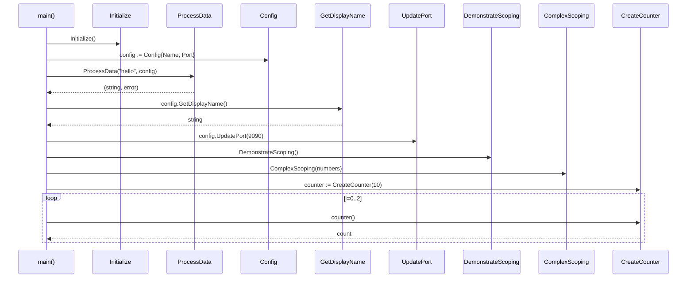

# scoping.go Review

## TL;DR

- 目的: Goのスコープ規則とシャドーイングを実例で解説する教育用ファイル。多数のブロックスコープ・ループ・switch・クロージャを網羅。
- 公開API: Config/Logger/Initialize/ProcessData/GetDisplayName/UpdatePort/DemonstrateScoping/ComplexScoping/CreateCounter と定数 MAX_RETRIES。コンソール出力中心。
- 重大なビルド不備: 未インポートの strings を使用（L52）、未使用 import strconv（L7）、同一スコープでの変数再宣言 data（L47 と L120）、未使用変数 count（L38）によりコンパイルエラー。
- エラー設計: ProcessData が error を返すシグネチャだが、常に nil を返し実質未使用。ライブラリ関数が fmt.Printf/Println に強く依存。
- 並行性/安全性: パッケージ変数 packageCount を多箇所で更新（L215, L317）。並行使用時にデータ競合の潜在リスク。クロージャ CreateCounter はスレッドセーフではない。
- コア複雑箇所: ProcessData（L33-149）は if/for/switch/range/type switch/クロージャと多分岐の複合。ComplexScoping（L220-263）も分岐多。
- 推奨: コンパイルエラー修正、ライブラリから直接の標準出力を排除し Logger を活用、エラー設計の明確化、シャドーイングの削減、テスト容易性向上。

## Overview & Purpose

このファイルは、Go言語におけるスコープ（パッケージ・関数・ブロック・メソッドレシーバ・ループ・switch・type switch・無名関数/クロージャ）と変数シャドーイングの挙動を体系的に示す教育用コードです。実行例（main）を通じて、各スコープでの可視性、シャドーイングの影響、クロージャによる外部変数キャプチャを確認できます。

## Structure & Key Components

| 種別 | 名前 | 公開範囲 | 責務 | 複雑度 |
|------|------|----------|------|--------|
| Const | MAX_RETRIES | pub | リトライ上限の例示 | Low |
| Const | debug | priv | デバッグフラグ（パッケージ内） | Low |
| Var | globalVar | priv | パッケージレベルの状態（デモ用） | Low |
| Var | packageCount | priv | パッケージレベルのカウンタ（デモ用） | Low |
| Struct | Config | pub | 設定（Name, Port） | Low |
| Interface | Logger | pub | ログインターフェイス（Log） | Low |
| Func | Initialize() | pub | パッケージ状態初期化 | Low |
| Func | ProcessData(input, config) (string, error) | pub | 多様なスコープのデモ＋文字列処理 | Med |
| Method | (Config) GetDisplayName() string | pub | 表示名生成 | Low |
| Method | (*Config) UpdatePort(newPort int) | pub | Port更新（検証＋ログ） | Low |
| Func | DemonstrateScoping() | pub | 多段シャドーイングのデモ | Low |
| Func | ComplexScoping(numbers []int) | pub | 複合分岐とスコープのデモ | Med |
| Func | CreateCounter(start int) func() int | pub | クロージャによるカウンタ | Low |
| Func | main() | priv | 実行例（パッケージが main でないため通常のエントリではない） | Low |

### Dependencies & Interactions

- 内部依存
  - main → Initialize, ProcessData, Config.GetDisplayName, (*Config).UpdatePort, DemonstrateScoping, ComplexScoping, CreateCounter（L283-318）
  - UpdatePort → パッケージ定数 debug（L177）
  - ProcessData → MAX_RETRIES（L71）, config.Name（L87, L139）
- 外部依存

| パッケージ | 用途 | 使用箇所 |
|------------|------|----------|
| fmt | 出力整形/表示 | 全体多数（例: L80, L161, L178, ...） |
| os | 異常終了 | main のエラーハンドリング（L291） |
| strings | 文字列加工（ToUpper） | 必要だが未インポート（L52 使用） |
| strconv | 数値変換 | インポート済だが未使用（L7） |

- 被依存推定
  - 教育・チュートリアル用コード。実運用向けに他モジュールがこのパッケージに依存する設計にはなっていないが、Config 型・UpdatePort・CreateCounter は再利用しやすい。

## API Surface (Public/Exported) and Data Contracts

| API名 | シグネチャ | 目的 | Time | Space |
|-------|-----------|------|------|-------|
| MAX_RETRIES | const MAX_RETRIES = 3 | リトライ回数例示 | O(1) | O(1) |
| Config | type Config struct { Name string; Port int } | 設定データ | O(1) | O(1) |
| Logger | type Logger interface { Log(message string) } | ロガー契約 | O(1) | O(1) |
| Initialize | func Initialize() | パッケージ状態初期化 | O(1) | O(1) |
| ProcessData | func ProcessData(input string, config Config) (string, error) | 入力を加工しスコープをデモ | O(n) | O(n) |
| GetDisplayName | func (c Config) GetDisplayName() string | 表示名を組み立て | O(|Name|) | O(|Name|) |
| UpdatePort | func (c *Config) UpdatePort(newPort int) | Portのバリデーションと更新 | O(1) | O(1) |
| DemonstrateScoping | func DemonstrateScoping() | 多段シャドーイングの出力 | O(1) | O(1) |
| ComplexScoping | func ComplexScoping(numbers []int) | 数列を走査し複合分岐 | O(n) | O(1) |
| CreateCounter | func CreateCounter(start int) func() int | クロージャでカウント | O(1)/call | O(1) |

以下、主要APIの詳細。

### Initialize

1) 目的と責務
- パッケージ変数の初期化: globalVar="initialized"、packageCount=1（L27-30）

2) アルゴリズム
- 代入のみ。

3) 引数
- なし

4) 戻り値
- なし

5) 使用例
```go
scoping.Initialize()
```

6) エッジケース
- 競合更新（並行環境）: packageCount がレース条件になる可能性。

### ProcessData

1) 目的と責務
- 文字列入力に対する処理を行い、スコープ/シャドーイングの例を網羅的に示す（L33-149）。
- 論理的には入力に前置詞を付けた結果を返す。

2) アルゴリズム（主要ステップ）
- debug ローカル変数でパッケージ定数 debug をシャドー（L41-44）
- data := "processed: " + input（L47）
- if len(input)>0: 大文字化、result 更新、count のシャドー、ネスト内で message を構築し出力（L50-67）
- for i:=0; i<MAX_RETRIES; i++: ブレーク条件、入れ子の for j で出力（L71-83）
- switch config.Name: "production"/"development"/default で logLevel と verbose を扱う（L87-105）
- range items: index/value を使用し、result のシャドー（L108-116）
- type switch (v := data.(type)) で string/int を分岐（L121-131）
- 無名関数 processor が config.Name をキャプチャ（L135-144）
- final := processor(data) を返す（L147-149）

3) 引数

| 名称 | 型 | 意味 |
|------|----|------|
| input | string | 入力文字列 |
| config | Config | 設定（Name/Port のうち Name を使用） |

4) 戻り値

| 型 | 意味 |
|----|------|
| string | 加工済みの文字列（config.Name を前置した data） |
| error | 現状常に nil（将来の拡張余地） |

5) 使用例
```go
cfg := scoping.Config{Name: "test", Port: 8080}
s, err := scoping.ProcessData("hello", cfg)
// s: "test: processed: hello"
```

6) エッジケース
- 入力が空: if ブロック未実行、最終結果は "Name: processed: "。
- 大文字化: strings をインポートしていないため現状ビルドエラー（L52）。
- 変数衝突: 同一スコープで data を再宣言（L120）はコンパイルエラー（「data redeclared in this block」）。
- 未使用変数: count（L38）が未使用でコンパイルエラー。
- エラー値: 常に nil、呼び出し側のエラーパスが実質無効。

### (Config) GetDisplayName

1) 目的と責務
- Config の表示名生成（L153-164）

2) アルゴリズム
- prefix, suffix を組み立て、メソッドローカルの globalVar でパッケージ変数をシャドーして結合。

3) 引数

| 名称 | 型 | 意味 |
|------|----|------|
| c | Config (receiver) | 対象 Config |

4) 戻り値

| 型 | 意味 |
|----|------|
| string | "[CONFIG] Name:Port method_local" |

5) 使用例
```go
cfg := scoping.Config{Name: "web", Port: 8080}
name := cfg.GetDisplayName()
```

6) エッジケース
- Name が空/Port が 0 でもそのまま文字列化。

### (*Config) UpdatePort

1) 目的と責務
- ポート値の検証と更新。検証 OK のときのみ更新しログ（L167-181）

2) アルゴリズム
- 0 < newPort < 65536 なら oldPort 保存 → 代入 → debug が真ならログ。

3) 引数

| 名称 | 型 | 意味 |
|------|----|------|
| c | *Config (receiver) | 更新対象 |
| newPort | int | 新しいポート番号 |

4) 戻り値
- なし（結果の可観測性は副作用とログのみ）

5) 使用例
```go
cfg := &scoping.Config{Port: 8080}
cfg.UpdatePort(9090)
```

6) エッジケース
- 無効値（<=0 or >=65536）は黙って無視。呼び出し側に通知なし。

### DemonstrateScoping

- 多段ブロックスコープで globalVar のシャドーと packageCount 更新/出力（L184-217）。
- エッジ: 出力のみ。副作用として packageCount++（L215）。

### ComplexScoping

- numbers を走査し、>10 の時は補正加算、<0 と 0 を switch でログ、最後に平均値を出力（L220-263）。
- Time O(n)、Space O(1)。

### CreateCounter

- start をキャプチャしつつ count++ を閉包内で行うカウンタ（L266-276）。
- 注意: 複数ゴルーチンからの同時呼び出しはレースになる。

## Walkthrough & Data Flow

### ProcessData の主要分岐とデータフロー

```mermaid
flowchart TD
  A[Start: input, config] --> B[debug := false]
  B --> C{len(input) > 0?}
  C -- Yes --> D[temp := ToUpper(input); result := temp + "_PROCESSED"; count := len(temp); nested status/message]
  C -- No --> E[skip]
  D --> F[for i in 0..MAX_RETRIES-1; break at i==2; inner for j]
  E --> F
  F --> G{switch config.Name}
  G -->|production| G1[logLevel := "error"]
  G -->|development| G2[logLevel := "debug"; verbose := true]
  G -->|default| G3[logLevel := "info"]
  G1 --> H[range items: index,value; result shadowed]
  G2 --> H
  G3 --> H
  H --> I{type switch on data}
  I -->|string| I1[length := len(v)]
  I -->|int| I2[doubled := v*2]
  I1 --> J[processor := closure capturing config.Name]
  I2 --> J
  J --> K[final := processor(data); return final,nil]
```

上記の図は ProcessData 関数（L33-149）の主要分岐を示す。

注意: 実コードは L120 の data 再宣言により構文エラー。図は意図された処理フローを表す。

### main の呼び出しシーケンス



上記の図は main 関数（L279-319）の呼び出し関係を示す。

## Complexity & Performance

- Initialize: O(1) 時間・空間
- ProcessData: O(n) 時間（n=|input|。ToUpper, 文字列結合が支配的）。ループは MAX_RETRIES（定数）と items（3要素）で定数時間。空間 O(n)（新規文字列の割当）。
- GetDisplayName: O(|Name|)（フォーマットと結合）
- UpdatePort: O(1)
- DemonstrateScoping: O(1)
- ComplexScoping: O(m) 時間・ O(1) 空間（m=|numbers|）
- CreateCounter: 初期化 O(1)、呼び出しごと O(1)

ボトルネック/スケール限界
- 文字列操作（ProcessData, GetDisplayName）は入力長に比例して割当とコピー。
- fmt.Printf/Println は I/O バウンド。大量出力で遅延。
- グローバル変数の更新は並行実行時にスケーラビリティ低下（ロック等が必要）。

## Edge Cases, Bugs, and Security

セキュリティ/安全性チェックリスト観点で評価。

- メモリ安全性
  - Go は GC によりメモリ安全。明示的な Buffer overflow / Use-after-free はなし。
  - コンパイルエラー
    - 未インポート利用: strings.ToUpper（L52）に対し strings が import されていない。
    - 未使用 import: strconv（L7）。
    - 未使用変数: count（L38）。
    - 同一スコープ再宣言: data を L47 と L120 で宣言（コンパイルエラー）。
- インジェクション
  - SQL/コマンド/パストラバーサルは該当なし。
  - fmt.Printf に外部入力を渡しているが、フォーマット文字列は固定で安全。
- 認証・認可
  - 該当なし（このチャンクには現れない）。
- 秘密情報
  - ハードコードされた秘密情報なし。ログ漏洩の懸念も低い（デモ出力のみ）。
- 並行性
  - packageCount の更新（L215, L317）は非同期アクセスでデータ競合のリスク。
  - CreateCounter のクロージャは複数ゴルーチンから呼ぶとレースコンディション。
  - UpdatePort は単純な代入だが、複数ゴルーチンから同一インスタンス更新時は同期が必要。

エッジケース一覧

| エッジケース | 入力例 | 期待動作 | 実装 | 状態 |
|-------------|--------|----------|------|------|
| 空文字列（ProcessData） | input="" | "Name: processed: " を返す | if len(input)>0 をスキップ | OK |
| strings 未インポート | ー | ビルド成功 | strings を import | NG（未修正） |
| 変数再宣言（data） | ー | ビルド成功 | 異名にする/ブロック分け | NG（未修正） |
| 未使用変数（count） | ー | ビルド成功 | 使用/削除 | NG（未修正） |
| UpdatePort の境界 | newPort=0,65536 | 更新拒否の明示通知 | 無音で無視 | 改善余地 |
| ComplexScoping 負数 | numbers=[-1] | 警告出力 | 実装済（L242-246） | OK |
| ComplexScoping ゼロ | numbers=[0] | 警告出力 | 実装済（L247-251） | OK |
| CreateCounter の並行呼び出し | 複数ゴルーチン | データレース回避 | ミューテックス等 | 要対策 |

## Design & Architecture Suggestions

- 出力責務の分離
  - ライブラリ関数から fmt.Printf/Println を除去し、戻り値/エラーで結果を返す。ログは Logger インターフェース（既存）を活用。
- エラー設計
  - ProcessData は error を返すなら、入力検証等で非 nil を返す条件を定義。さもなくば error 戻り値を削除。
  - UpdatePort は更新失敗時に bool や error を返す。
- シャドーイングの最小化
  - デモ目的の箇所を除き、業務コードでは変数名の再利用を避ける。go vet -shadow を導入。
- グローバル状態の削減
  - packageCount/globalVar はデモ専用に限定。運用コードでは状態注入（DI）やコンテキストで渡す。
- スレッドセーフティ
  - packageCount や CreateCounter を並行使用する場合は sync.Mutex/atomic を適用。
- main の配置
  - 実行可能例は package main に分離（例: cmd/scoping-demo/main.go）。ライブラリ面は package scoping を純化。

## Testing Strategy (Unit/Integration) with Examples

- 単体テスト（table-driven）
  - ProcessData
    - 入力: 正常/空文字/長文。config.Name 別の switch 分岐確認。
    - 期待: 戻り値の前置詞、ToUpper の反映（strings import 修正後）。
```go
func TestProcessData(t *testing.T) {
  cfg := scoping.Config{Name: "dev", Port: 8080}
  got, err := scoping.ProcessData("hello", cfg)
  if err != nil { t.Fatalf("unexpected err: %v", err) }
  wantPrefix := "dev: "
  if !strings.HasPrefix(got, wantPrefix) {
    t.Errorf("prefix mismatch: got %q", got)
  }
}
```
  - GetDisplayName
```go
func TestGetDisplayName(t *testing.T) {
  c := scoping.Config{Name: "api", Port: 9000}
  got := c.GetDisplayName()
  if !strings.Contains(got, "[CONFIG] api:9000") {
    t.Errorf("got %q", got)
  }
}
```
  - UpdatePort
```go
func TestUpdatePort(t *testing.T) {
  c := &scoping.Config{Port: 80}
  c.UpdatePort(8080)
  if c.Port != 8080 { t.Fatal("port not updated") }
  c.UpdatePort(70000)
  if c.Port != 8080 { t.Fatal("invalid port should not update") }
}
```
  - CreateCounter
```go
func TestCreateCounter(t *testing.T) {
  next := scoping.CreateCounter(10)
  if next()!=11 || next()!=12 || next()!=13 { t.Fatal("unexpected count") }
}
```
- 出力検証
  - DemonstrateScoping / ComplexScoping は bytes.Buffer に出力をリダイレクトしてゴールデンテスト。
- 競合検出
  - -race オプションで並行テスト（CreateCounter をあえてゴルーチンから呼びデータレース検出）。

## Refactoring Plan & Best Practices

1) コンパイルエラー修正（最優先）
- import に strings を追加、未使用の strconv を削除。
- ProcessData の未使用変数 count（L38）を削除、あるいは利用。
- ProcessData の data 再宣言（L120）を別名（e.g., anyData）または別ブロックに移動。
2) ロギングの抽象化
- Logger インターフェースを引数に取り、fmt に直書きしない。環境で差し替え可能に。
3) エラー方針の明確化
- ProcessData はエラー条件定義または error 削除。
- UpdatePort は (bool, error) を返して呼び出し側で分岐。
4) 命名とスコープ
- 教育用以外の箇所はシャドーを避け、読みやすさ優先。短いスコープで宣言を限定。
5) パッケージ構成
- 実行用 main を cmd/ 下へ分離。ライブラリは副作用レスでテスト容易に。
6) 静的解析/CI
- go vet（特に -shadow）、golangci-lint、-race を CI に導入。

修正後の代表例（ProcessData の問題箇所のみ抜粋）

```go
import (
  "fmt"
  "os"
  "strings" // 追加
)

func ProcessData(input string, config Config) (string, error) {
  var result string
  // var count int // 削除 or 使用
  dbg := false // 名前を変えてパッケージ定数 debug と混同回避
  if dbg {
    fmt.Println("Debug mode is on")
  }
  data := "processed: " + input

  // ... 省略 ...

  // Type switch 用に別名にする
  var anyData interface{} = "test"
  switch v := anyData.(type) {
  case string:
    // ...
  case int:
    // ...
  }

  processor := func(text string) string {
    prefix := config.Name + ": "
    return prefix + text
  }
  final := processor(data)
  return final, nil
}
```

## Observability (Logging, Metrics, Tracing)

- ログ
  - 既存 Logger を活用し、出力先/フォーマット/レベルを注入可能に。
  - debug フラグは構成可能に（環境変数や Config フィールド）。
- メトリクス
  - 処理回数、エラー件数、UpdatePort 成功/失敗カウントなどを計測（expvar/otel 等）。
- トレーシング
  - 重要関数（ProcessData, ComplexScoping）にコンテキスト受け取りを追加し、span を開始。

## Risks & Unknowns

- このチャンクには外部システム（DB/ネットワーク/ファイル）依存がないため、I/O 失敗時の挙動は不明。
- Logger インターフェースの具体実装は未提供。
- ProcessData の戻り値 error の意味づけが不明。将来的な拡張意図は不明。
- 並行使用の要件（packageCount, CreateCounter など）の要件が不明。用途により同期設計が必要。