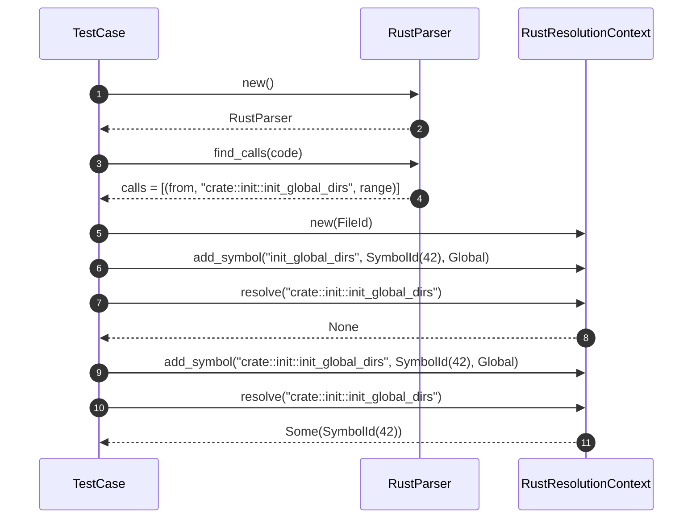

# integration\test_cross_module_resolution.rs Review

## TL;DR

- 目的: codannaのRust解析・解決機構における「モジュールを跨ぐ関数呼び出し」の解決バグを再現し、修正（module_pathでの登録）により解決できることを検証する統合テスト。
- 主要公開API（本ファイル内）: #[test]関数2つ（test_cross_module_call_resolution_step_by_step, test_resolution_shows_the_problem）。外部APIとしてRustParser::find_calls、RustResolutionContext::{add_symbol, resolve}、Symbol関連を使用。
- 複雑箇所: 呼び出し解決キーが「短い名前」と「完全修飾パス」で異なるため、パーサ出力（完全修飾）とインデックス登録（短名）不一致による解決失敗。
- 重大リスク: add_symbolのキー設計とresolveの照合ロジックの非対称性。重複キー（短名と完全修飾）を別々に登録する設計は衝突・一貫性の問題を抱える可能性。
- エラー/安全性: unwrap使用によるpanicの可能性（SymbolId::new, FileId::new, RustParser::new）。テストでは問題になりにくいが、実運用では避けるべき。
- 並行性: 本テストには非同期・並行実行なし。RustResolutionContextのスレッド安全性は不明（このチャンクには現れない）。
- パフォーマンス: 本テストは小規模。外部API（find_calls/resolve）の内部計算量は不明。テストの動作は定数時間。

## Overview & Purpose

本ファイルは、codannaのRustコード解析・呼び出し解決の統合テストで、以下を目的としています。

- パーサが抽出する呼び出しターゲット文字列（例: "crate::init::init_global_dirs"）と、インデックスに格納されるシンボル名（例: "init_global_dirs"）の不一致により、呼び出し解決が失敗する既知のバグを再現。
- 解決コンテキストに「module_path（完全修飾パス）」をキーとしてシンボルを追加する「修正」を適用し、呼び出し解決が成功することを検証。

テストは以下の2つで構成されます。
- test_cross_module_call_resolution_step_by_step: ステップごとの再現と修正の検証。
- test_resolution_shows_the_problem: 問題の最小再現（短名登録のみ→解決失敗、短名解決のみ成功）。

行番号はこのチャンクでは不明のため、主張の根拠は関数名（行番号: 不明）で併記します。

## Structure & Key Components

| 種別 | 名前 | 公開範囲 | 責務 | 複雑度 |
|------|------|----------|------|--------|
| Function | test_cross_module_call_resolution_step_by_step | private (#[test]) | 解決失敗の再現とmodule_path追加による修正の検証 | Med |
| Function | test_resolution_shows_the_problem | private (#[test]) | 問題の最小例での実証（短名登録のみだと失敗） | Low |
| Struct (external) | RustParser | external (codanna) | Rustコードから関数呼び出しを抽出 | 不明 |
| Struct (external) | RustResolutionContext | external (codanna) | シンボル解決コンテキスト（名前→SymbolIdマップなど） | 不明 |
| Struct (external) | Symbol | external (codanna) | シンボル表現（id, name, kind, file, range, module_path, visibility） | 不明 |
| Struct (external) | SymbolId | external (codanna) | シンボルID（newで生成） | 低 |
| Struct (external) | FileId | external (codanna) | ファイルID | 低 |
| Enum (external) | SymbolKind | external (codanna) | シンボル種別（Functionなど） | 低 |
| Struct (external) | Range | external (codanna) | ソースコード位置範囲 | 低 |
| Enum (external) | Visibility | external (codanna) | 可視性（Publicなど） | 低 |
| Enum (external) | ScopeLevel | external (codanna) | スコープレベル（Globalなど） | 低 |

### Dependencies & Interactions

- 内部依存:
  - test_cross_module_call_resolution_step_by_step → RustParser, RustResolutionContext, Symbol を利用（関数名: 行番号不明）。
  - test_resolution_shows_the_problem → RustResolutionContext を利用（関数名: 行番号不明）。

- 外部依存（使用クレート・モジュール）:

| パス | 用途 | 影響範囲 |
|------|------|----------|
| codanna::parsing::rust::parser::RustParser | 呼び出し解析（find_calls） | 呼び出しターゲット文字列の抽出 |
| codanna::parsing::rust::resolution::RustResolutionContext | シンボル解決（add_symbol, resolve） | 解決成功/失敗の判定 |
| codanna::parsing::{ResolutionScope, ScopeLevel} | スコープ指定 | Global指定に使用（ResolutionScopeは未使用） |
| codanna::{FileId, Range, Symbol, SymbolId, SymbolKind, Visibility} | シンボル作成、ID生成、範囲、可視性 | テスト用シンボルの初期化 |

- 被依存推定:
  - このテストは「クロスモジュール解決機構」の回帰防止に用いられます。具体的な被依存箇所は不明（このチャンクには現れない）。

## API Surface (Public/Exported) and Data Contracts

本ファイルの公開API（外部から利用可能）はありません（すべて#[test]のプライベート関数）。ただしテストハーネスから実行されるため、以下のテスト関数をAPI一覧として整理します。

| API名 | シグネチャ | 目的 | Time | Space |
|-------|-----------|------|------|-------|
| test_cross_module_call_resolution_step_by_step | fn() | 解決失敗→修正適用→解決成功の検証 | O(1) | O(1) |
| test_resolution_shows_the_problem | fn() | 短名登録のみでは完全修飾の解決が失敗することを実証 | O(1) | O(1) |

加えて、本テストが使用する外部API（参考）:

| API名（外部） | シグネチャ（推定/不明） | 目的 | Time | Space |
|---------------|--------------------------|------|------|-------|
| RustParser::new | fn() -> Result<RustParser, E>（推定） | パーサ生成 | 不明 | 不明 |
| RustParser::find_calls | fn(&str) -> Vec<(String, String, Range)>（推定） | 呼び出し抽出（from関数名, toターゲット, range） | 不明 | 不明 |
| RustResolutionContext::new | fn(FileId) -> RustResolutionContext（推定） | 解決コンテキスト生成 | 不明 | 不明 |
| RustResolutionContext::add_symbol | fn(String, SymbolId, ScopeLevel) | 文字列キー（名前またはmodule_path）でシンボルIDを登録 | 不明 | 不明 |
| RustResolutionContext::resolve | fn(&str) -> Option<SymbolId> | キー文字列からSymbolIdを解決 | 不明 | 不明 |
| Symbol::new | fn(SymbolId, &str, SymbolKind, FileId, Range) -> Symbol | シンボルインスタンス生成 | 不明 | 不明 |

詳細（テスト関数）:

1) test_cross_module_call_resolution_step_by_step
- 目的と責務:
  - バグの再現（短名登録のみでは失敗）と、module_path登録の「修正」で成功することを検証。
- アルゴリズム（ステップ分解）:
  1. Symbolを作成し、module_path="crate::init::init_global_dirs"・Visibility=Publicを設定。
  2. RustParserで、関数内の呼び出し "crate::init::init_global_dirs()" を抽出、確認。
  3. RustResolutionContextを用意し、短名 "init_global_dirs" をGlobalスコープで登録。
  4. resolve("crate::init::init_global_dirs") → None を確認（失敗）。
  5. 修正: module_pathでも登録。
  6. resolve("crate::init::init_global_dirs") → Some(SymbolId(42)) を確認（成功）。
- 引数: なし
- 戻り値: なし（テスト）
- 使用例:
```rust
// 修正のコア部分（長い関数の抜粋）
if let Some(module_path) = &init_global_dirs_symbol.module_path {
    context.add_symbol(
        module_path.to_string(),
        init_global_dirs_id,
        ScopeLevel::Global,
    );
}
let resolved_with_fix = context.resolve("crate::init::init_global_dirs");
assert_eq!(resolved_with_fix, Some(init_global_dirs_id));
```
- エッジケース:
  - パーサが複数呼び出しを抽出した場合の動作は未検証。
  - module_pathがNoneの場合、修正が適用できず失敗のまま。

2) test_resolution_shows_the_problem
- 目的と責務:
  - 現状のバグ（短名のみ登録→完全修飾ターゲット解決失敗）をシンプルに示す。
- アルゴリズム（ステップ分解）:
  1. 解決コンテキストへ "init_global_dirs" の短名で登録。
  2. resolve("crate::init::init_global_dirs") → None（失敗）を確認。
  3. resolve("init_global_dirs") → Some(SymbolId(42))（成功）を確認。
- 引数: なし
- 戻り値: なし（テスト）
- 使用例:
```rust
let mut context = RustResolutionContext::new(FileId::new(1).unwrap());
context.add_symbol("init_global_dirs".to_string(), symbol_id, ScopeLevel::Global);
assert_eq!(context.resolve("crate::init::init_global_dirs"), None);
assert_eq!(context.resolve("init_global_dirs"), Some(symbol_id));
```
- エッジケース:
  - 同名のシンボルが複数ある場合の挙動は不明。
  - スコープや可視性の影響は未検証。

データ契約（このファイル内で確定している範囲）:
- parser.find_calls(code) が返す要素において、to は "crate::init::init_global_dirs" という完全修飾パスである（関数: test_cross_module_call_resolution_step_by_step, 行番号: 不明）。
- resolve の入力は文字列キーであり、短名と完全修飾の両方を受け取るが、登録キーに依存して解決可否が変わる（関数: 両テスト, 行番号: 不明）。

## Walkthrough & Data Flow

全体のデータフロー（step-by-step テスト）:

- 入力コード文字列 → RustParser::find_calls → 呼び出しタプル（from, to, range）
- シンボル作成（name, module_path）→ RustResolutionContext::add_symbol による登録（短名／完全修飾）
- 解決（resolve(to)）→ Option<SymbolId>

Mermaidシーケンス図（アクター3つ以上のため使用）。上記の図は`test_cross_module_call_resolution_step_by_step`関数（行番号: 不明）の主要フローを示す。



要点:
- パーサは完全修飾パスを出力。
- コンテキストが短名のみをキーにする場合、resolveが失敗。
- 完全修飾パスもキーとして追加することで解決成功。

## Complexity & Performance

- テスト関数は定数ステップのため時間・空間ともにO(1)。
- RustParser::find_calls の計算量は外部実装で不明（このチャンクには現れない）。
- RustResolutionContext::{add_symbol, resolve} の計算量は内部データ構造次第で不明（ハッシュマップならO(1)期待、ただし不明）。
- 実運用負荷要因:
  - I/O/ネットワーク/DBは使用しない。
  - 大規模コード解析時はパーサと解決コンテキストのメモリとCPUがボトルネックになりうるが、本テストでは影響軽微。

## Edge Cases, Bugs, and Security

既知バグの要旨:
- 完全修飾パス（例: "crate::init::init_global_dirs"）での解決が、短名（"init_global_dirs"）のみ登録した場合に失敗する（関数: test_resolution_shows_the_problem, 行番号: 不明）。
- 修正として「module_path（完全修飾）でも登録」すると解決成功（関数: test_cross_module_call_resolution_step_by_step, 行番号: 不明）。

詳細エッジケース表:

| エッジケース | 入力例 | 期待動作 | 実装 | 状態 |
|-------------|--------|----------|------|------|
| 完全修飾のみ登録なし | resolve("crate::init::init_global_dirs") | None | 短名のみadd_symbol | 再現済 |
| 完全修飾登録あり | resolve("crate::init::init_global_dirs") | Some(SymbolId(42)) | module_pathでもadd_symbol | 修正で成功 |
| 短名解決 | resolve("init_global_dirs") | Some(SymbolId(42)) | 短名でadd_symbol | 成功 |
| module_pathがNone | resolve(完全修飾) | None | 完全修飾の登録不可 | 未検証 |
| 複数シンボル同名 | resolve("init_global_dirs") | 衝突回避/曖昧性解消 | 不明（このチャンクには現れない） | 不明 |

セキュリティチェックリスト:
- メモリ安全性:
  - Buffer overflow / Use-after-free / Integer overflow: 該当なし（安全なRustのみ、unsafe使用なし）。
  - panicリスク: unwrap使用箇所あり（RustParser::new, SymbolId::new, FileId::new）。固定値での使用のためテストでは低リスクだが、本番ではエラー処理推奨。
- インジェクション:
  - SQL/Command/Path traversal: 該当なし。
  - 文字列キーに外部入力を用いる場合の想定は本テストにない。
- 認証・認可:
  - 該当なし。
- 秘密情報:
  - ハードコード秘密情報なし。ログ漏洩の懸念もなし。
- 並行性:
  - Race/Deadlock: テストでは並行実行なし。
  - ResolutionContextの内部同期やSend/Syncは不明（このチャンクには現れない）。

Rust特有の観点（詳細チェックリスト）:
- メモリ安全性（所有権・借用・ライフタイム）:
  - 文字列・構造体の所有権移動/借用は標準的で問題なし（関数: 両テスト, 行番号: 不明）。
  - 明示的ライフタイムパラメータは不要、未使用。
- unsafe境界:
  - unsafeブロック: なし。
- 並行性・非同期:
  - Send/Sync: 不明（このチャンクには現れない）。
  - await境界・キャンセル: 該当なし。
- エラー設計:
  - Result vs Option: resolveがOption<SymbolId>を返す設計は適切。
  - panic箇所: unwrap/expectあり。テスト文脈では許容、プロダクションでは回避推奨。
  - エラー変換: From/Intoの実装は不明（このチャンクには現れない）。

## Design & Architecture Suggestions

- 名前正規化/キー戦略の一貫化:
  - 解決時に完全修飾パス→短名への正規化（最後のセグメント抽出）を試みるフォールバックを追加。
  - あるいは、コンテキスト内部で「短名」と「完全修飾」を正規化した同一キー空間にマッピングし、別々のキーで二重登録しない。
- 衝突/曖昧性解消:
  - 同名関数が複数モジュールに存在する場合、短名解決が曖昧になるため、優先順位規則（スコープ、use導入、可視性）を設計。
- モデル改善:
  - module_pathを強い型（ModulePath型）で持ち、分解/結合/比較ユーティリティを提供してエラーを減らす。
- ビルド時インデックス化:
  - ビルドフェーズで短名・完全修飾の双方をキーとして登録するが、内部は1つのシンボルにエイリアス（別名）として束ねる構造を採用する（例: MultiKeyMap風）。
- エラー処理:
  - unwrapを避け、テストでも anyhow/eyre などで明示的に失敗を報告。テスト失敗時により良い診断情報を提供。

## Testing Strategy (Unit/Integration) with Examples

- 追加ユースケース:
  - 複数モジュールに同名関数がある場合の解決優先順位テスト。
  - useで導入された短縮パス（use crate::init::init_global_dirs as igd）に対する解決。
  - 相対パス（super::, self::）の解決。
  - 非公開（Visibility::Private）の解決拒否検証。
  - 異なるFileIdからの参照と解決の検証。

- 例: useによる別名解決のテスト（擬似コード）
```rust
#[test]
fn test_resolve_with_use_alias() {
    // 準備
    let symbol_id = SymbolId::new(100).unwrap();
    let mut context = RustResolutionContext::new(FileId::new(3).unwrap());
    // 本来の完全修飾
    context.add_symbol("crate::init::init_global_dirs".to_string(), symbol_id, ScopeLevel::Global);
    // useによる別名
    context.add_symbol("igd".to_string(), symbol_id, ScopeLevel::Global);

    // 検証
    assert_eq!(context.resolve("igd"), Some(symbol_id));
    assert_eq!(context.resolve("crate::init::init_global_dirs"), Some(symbol_id));
}
```

- 例: 相対パスの解決（擬似コード）
```rust
#[test]
fn test_resolve_relative_paths() {
    let symbol_id = SymbolId::new(101).unwrap();
    let mut context = RustResolutionContext::new(FileId::new(4).unwrap());
    context.add_symbol("crate::init::init_global_dirs".to_string(), symbol_id, ScopeLevel::Global);

    // 相対パスを正規化し、内部で完全修飾に解決するフォールバックがあると想定
    assert_eq!(context.resolve("super::init::init_global_dirs"), Some(symbol_id)); // 実装次第
}
```

- 例: 可視性の検証（擬似コード）
```rust
#[test]
fn test_visibility_enforced() {
    // SymbolのvisibilityがPrivateの場合、外部モジュールから解決できないことを検証（実装が必要）
    // 実装・APIはこのチャンクには現れないため、擬似コードのみ。
}
```

## Refactoring Plan & Best Practices

- ヘルパーの抽出:
  - 「テスト用シンボル生成」「contextへの登録（短名+完全修飾）」をユーティリティ関数に抽出し、重複を削減。
- unwrapの排除:
  - テストでも `expect("理由")` を用いて失敗時のメッセージを明確化。
  - プロダクションコードでは `?` 伝播や明示的なエラー型を使用。
- キー正規化ユーティリティ:
  - 完全修飾パスをセグメントに分割し、末尾名とパスの両方で検索する共通関数を実装。
- ログ整備:
  - printlnではなく `log` クレートを使用し、テスト時に `env_logger` 等で可視化。

## Observability (Logging, Metrics, Tracing)

- ロギング:
  - 解決失敗時に「入力キー」「利用可能なキー一覧」「スコープ情報」を出力するデバッグログを追加。
  - 解決成功時に「選択されたキー種別（短名/完全修飾）」「衝突回避の詳細」をログ。
- メトリクス:
  - 解決試行回数、成功率、フォールバック回数（正規化を使用した解決）をカウント。
- トレーシング:
  - `tracing` クレート導入でスパン（parse→index→resolve）を可視化し、遅延や失敗箇所の特定を容易に。

## Risks & Unknowns

- Unknowns（このチャンクには現れない）:
  - RustParser::find_calls の正確な戻り値型・アルゴリズム詳細。
  - RustResolutionContext の内部データ構造（HashMapか、複合インデックスか）・スレッド安全性（Send/Sync）。
  - ScopeLevel の詳細な意味（モジュール/クレート/グローバルなどの振る舞い）。
  - Visibility の解決時への影響（公開/非公開のフィルタリング）。
  - 複数シンボルの衝突時の解決規則。

- リスク:
  - 二重登録（短名＋完全修飾）による一貫性問題。更新/削除時に両方のキーを同期させる必要。
  - 短名フォールバックにより誤解決が発生する可能性（同名関数が複数ある場合）。
  - unwrap によるテストの脆弱性（失敗時にパニック）。プロダクションでの誤使用に注意。