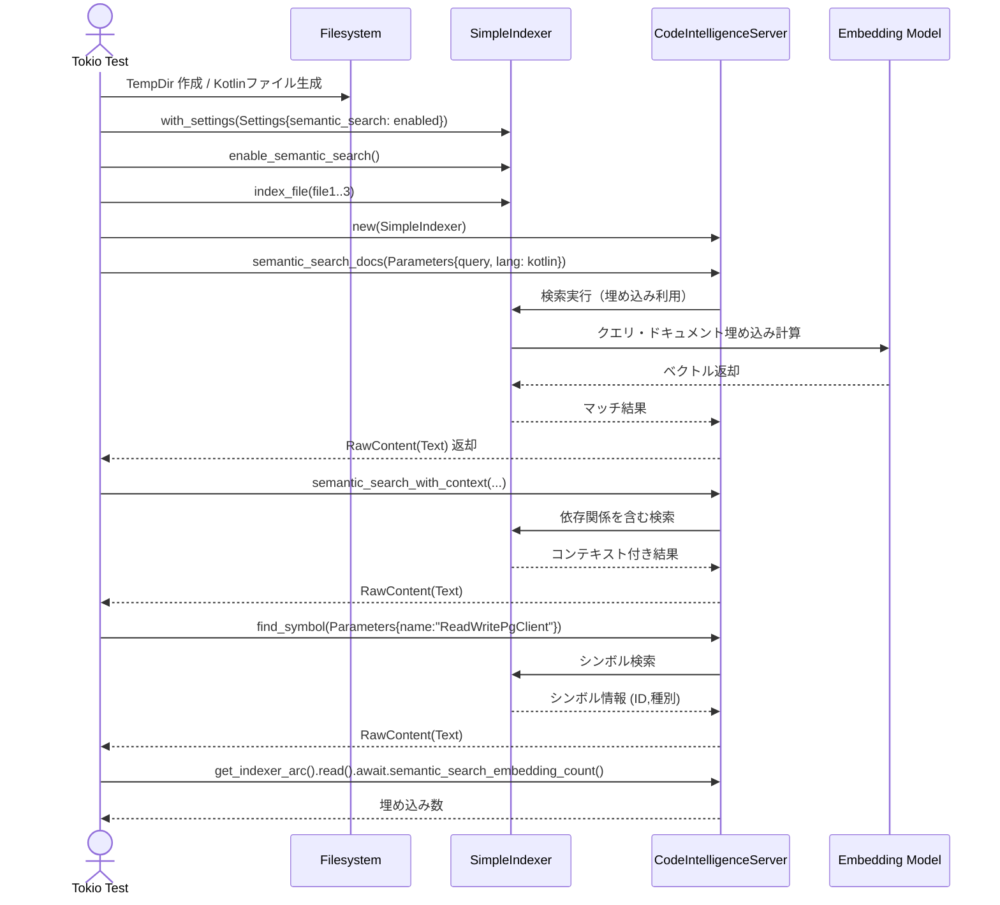

# integration\test_kotlin_semantic_search.rs Review

## TL;DR

- 目的: Kotlinソースをインデックスし、**Semantic Search**・**Context付き検索**・**Symbol検索**の挙動をRustから統合テストすることで、コードインテリジェンス機能の正しさを検証
- 公開API: このファイル自体の公開（export）APIは**なし**。外部の公開APIは codanna の SimpleIndexer / CodeIntelligenceServer、rmcp の Parameters を利用
- 複雑箇所: 非同期処理（Tokio current_thread）下でのインデックス作成と検索呼び出し、結果抽出（RawContentフィルタリング）、埋め込みモデルの存在に依存するテスト
- 重大リスク: 86MBの埋め込みモデル依存によりCI不適合、ファイル生成・インデックス作成のI/O例外は `expect` によりテスト失敗（panic）へ直結、言語指定や検索閾値の扱いに関する未検証のエッジケース
- Rust安全性: unsafeなし、Arcと非同期RwLock（推定）による共有資源の読み取りは安全側。ロック中に重い処理はなくデッドロックリスクは低い
- パフォーマンス: インデックス・検索は外部モデル（埋め込み推論）に依存しCPU/メモリ負荷が高い可能性。テストは小規模セットで現実的
- セキュリティ: テスト用Kotlin文字列にSQLインジェクション例が含まれるが、Rust側でDB実行はなし。ハードコード秘密情報や権限チェックは関与なし

## Overview & Purpose

このファイルは、Kotlinファイル群を一時ディレクトリに生成し、codannaの**SimpleIndexer**でインデックスを作成、**CodeIntelligenceServer**経由で以下を検証する統合テストです。

- ドキュメントの**Semantic Search**がKotlinクラス（例: AuroraCurrencyRepository）を検出できること
- **Context付きSemantic Search**が依存関係（例: ReadWritePgClient）を含むこと
- **シンボル検索**がKotlinのクラスをシンボルとして見つけ、種別（Class）等のメタを返すこと
- **埋め込み数**が期待以上に生成されること
- 依存注入（DI）パターンでDatabaseClientを受け取るクラス群を検索できること

これらを通じて、codannaのKotlin言語サポート、依存関係解析、埋め込みモデル連携が正しく動作するか検証します。

## Structure & Key Components

| 種別 | 名前 | 公開範囲 | 責務 | 複雑度 |
|------|------|----------|------|--------|
| Const | REPOSITORY_FIXTURE | private | Kotlinリポジトリクラスのテキストフィクスチャ | Low |
| Const | CLIENT_FIXTURE | private | Kotlinクライアントクラスのテキストフィクスチャ | Low |
| Const | SERVICE_FIXTURE | private | Kotlinサービスクラスのテキストフィクスチャ | Low |
| Function | test_kotlin_semantic_search_and_dependency_injection | private (test) | Kotlin3ファイルのインデックスと検索系の総合検証 | Med |
| Function | test_kotlin_dependency_injection_discovery | private (test) | DIに焦点を当てた単一ファイルの検索検証 | Low |
| External Type | SimpleIndexer (codanna) | external | インデックス作成・検索バックエンド | Med |
| External Type | CodeIntelligenceServer (codanna::mcp) | external | サーバーAPIで検索等を提供 | Med |
| External Type | Settings / SemanticSearchConfig (codanna::config) | external | ワークスペースと検索設定 | Low |
| External Type | Parameters (rmcp) | external | MCPハンドラーのリクエストラッパー | Low |
| External Type | RawContent (rmcp::model) | external | レスポンスコンテンツの型 | Low |
| External Type | TempDir (tempfile) | external | 一時ディレクトリ管理 | Low |

### Dependencies & Interactions

- 内部依存
  - 両テストは以下の共通ステップに依存
    - TempDirでワークスペース作成
    - Kotlinファイル書き込み
    - Settings構築とArcラップ
    - SimpleIndexer初期化・semantic search有効化
    - index_fileでファイル追加
    - CodeIntelligenceServerで検索API実行
    - RawContent::Textのみ抽出しアサート
    - 埋め込み数取得（get_indexer_arc().read().await）
- 外部依存（クレート／モジュール）
  | クレート/モジュール | 用途 |
  |---------------------|------|
  | codanna::SimpleIndexer | ファイルインデックスと検索 |
  | codanna::config::{Settings, SemanticSearchConfig} | 設定（semantic_search有効化） |
  | codanna::mcp::{CodeIntelligenceServer, FindSymbolRequest, SemanticSearchRequest, SemanticSearchWithContextRequest} | 検索API（MCPスタイル） |
  | rmcp::handler::server::wrapper::Parameters | リクエストラッパー |
  | rmcp::model::RawContent | レスポンス形式（Textなど） |
  | tempfile::TempDir | 一時ディレクトリ |
  | std::sync::Arc | 設定共有 |
  | tokio::test | 非同期テスト |
- 被依存推定
  - プロジェクト全体の他の統合テストや、Kotlin言語サポートの回帰確認で本テストが参照される可能性
  - CIには不適合（ignore指定）なのでローカル検証用

## API Surface (Public/Exported) and Data Contracts

| API名 | シグネチャ | 目的 | Time | Space |
|-------|-----------|------|------|-------|
| 該当なし | 該当なし | このファイルに公開APIは存在しない | - | - |

- 詳細説明
  1. 目的と責務: 該当なし
  2. アルゴリズム: 該当なし
  3. 引数: 該当なし
  4. 戻り値: 該当なし
  5. 使用例: 該当なし
  6. エッジケース: 該当なし

※ このファイルはテスト関数のみを含み、外部公開APIを定義していません。

## Walkthrough & Data Flow

以下は、主テスト関数内の処理の流れです。

- TempDir作成 → ワークスペースパス取得
- Kotlinファイルを3つ作成（Repository/Client/Service）
- `.codanna-index`を作り、Settingsを構築（semantic_searchを有効化）
- SimpleIndexerをSettingsで作成し、`enable_semantic_search()`を呼ぶ
- 3ファイルを`index_file()`でインデックス
- CodeIntelligenceServerを作成して検索APIを順に実行
  - `semantic_search_docs`: 文書の自然言語検索
  - `semantic_search_with_context`: 文書＋依存関係（コンテキスト）付き検索
  - `find_symbol`: 名前からシンボル検索（種別とID確認）
  - `get_indexer_arc().read().await.semantic_search_embedding_count()`: 埋め込み数を確認

主要な抽出・確認処理（RawContentフィルタリング）は次のように単純です。

```rust
let semantic_text = semantic_result
    .content
    .iter()
    .filter_map(|content| match &content.raw {
        RawContent::Text(block) => Some(block.text.as_str()),
        _ => None,
    })
    .collect::<Vec<_>>()
    .join("\n");
assert!(semantic_text.contains("AuroraCurrencyRepository"));
```

### Sequence Diagram (Mermaid)



上記の図は`test_kotlin_semantic_search_and_dependency_injection`関数の主要な呼び出し・相互作用を示しています（行番号はこのチャンクに含まれないため不明）。

## Complexity & Performance

- インデックス作成
  - 時間計算量: O(F)（Fはインデックスするファイル数）＋各ファイルの内容に対する埋め込み計算コスト
  - 空間計算量: O(F + E)（Eは生成される埋め込みベクトル総数）
- 検索（semantic）
  - 時間計算量: O(N)（Nはインデックス済みベクトル数）＋類似度計算のコスト（通常ベクトル次元に線形）
  - 空間計算量: O(N)
- ボトルネック
  - 埋め込みモデルの読み込み（86MB）と推論が最も重い
  - I/O（ファイル作成・読み込み）は小規模で軽い
- スケール限界
  - 大量ファイルでは埋め込み生成時間・メモリが増加
  - 本テストはファイル数が少なくスケール問題は顕在化しない
- 実運用負荷要因
  - CPU（埋め込み推論）
  - メモリ（ベクトル保持）
  - ディスク（インデックス保存）

## Edge Cases, Bugs, and Security

- メモリ安全性
  - unsafeブロック: なし（このチャンクには現れない）
  - 所有権/借用: `Arc<Settings>`により設定を共有。`get_indexer_arc().read().await`は読み取りロックで安全側
  - ライフタイム: 明示的パラメータ不要（このコードでは参照の寿命はブロックスコープ内）
- インジェクション
  - Kotlinフィクスチャに`"SELECT * FROM users WHERE id = $id"`などが含まれるが、Rust側でDB実行はしないため実害なし
  - コマンド/パス トラバーサル: TempDir配下の明示作成のみで安全
- 認証・認可
  - 該当なし（このチャンクには現れない）
- 秘密情報
  - ハードコード秘密: なし
  - ログ漏えい: `println!`は成功メッセージのみ
- 並行性
  - Tokioのcurrent_threadフレーバーでシングルスレッド実行。`read().await`中に重い処理は行っていないためデッドロックリスク低
  - レースコンディション: インデックスは逐次、検索も逐次で共有状態の変更はなし（このチャンクでは）
- エッジケース詳細

| エッジケース | 入力例 | 期待動作 | 実装 | 状態 |
|-------------|--------|----------|------|------|
| 埋め込みモデル未取得 | 実ファイルなし | 検索APIがエラーを返す/テスト失敗 | `expect("enable semantic search")`等でpanic | Present（テストはignore） |
| 非UTF-8パス | OS依存で不可 | エラー/安全に失敗 | `to_str().expect("utf8 path")`でpanic | Present |
| ファイル作成失敗 | 権限なし | エラー/失敗 | `std::fs::write(...).expect(...)`でpanic | Present |
| インデックスディレクトリなし | パス不正 | 明示作成 | `create_dir_all`で対応 | Present |
| 言語不一致 | lang: Some("kotlin")だが内容が別言語 | 低一致/ゼロ結果 | 検索結果を`assert!`で検証 | Present |
| 検索閾値異常 | threshold: None だが高閾値設定時 | ゼロ結果/低一致 | 未検証（このチャンクには現れない） | Unknown |
| limit=0 | 0指定 | 空結果 | 未検証（このチャンクには現れない） | Unknown |
| 空クエリ | "" | エラー/空結果 | 未検証（このチャンクには現れない） | Unknown |

## Design & Architecture Suggestions

- 共通セットアップの抽出
  - TempDir作成、Settings構築、Indexer初期化、ファイルインデックス化をヘルパー関数化して重複削減
- エラー処理の改善
  - テストでの`expect`は許容されるが、失敗個所の識別を容易にするため`anyhow::Result`で早期戻り＋`?`構文の利用を検討
- 検索パラメータのバリエーションテスト
  - `threshold`や`limit`の異常値、`lang`未指定時の挙動もカバー
- 設定ビルダー導入
  - `Settings`構築の冗長性を小さくし、読みやすさ向上
- 依存注入のバリエーション
  - コンストラクタ以外のDI（フィールド注入/メソッド注入）例も追加し、検出能力を広く確認

## Testing Strategy (Unit/Integration) with Examples

- 正常系（既に実装済み）
  - Kotlinクラスの検索、コンテキスト付き検索、シンボル検索、埋め込み数の検証
- 追加すべきテスト案
  - 言語未指定
    ```rust
    let res = server.semantic_search_docs(Parameters(SemanticSearchRequest {
        query: "repository",
        limit: 5,
        threshold: None,
        lang: None,
    })).await?;
    assert!(!res.content.is_empty());
    ```
  - limit=0の動作
    ```rust
    let res = server.semantic_search_docs(Parameters(SemanticSearchRequest {
        query: "client",
        limit: 0,
        threshold: None,
        lang: Some("kotlin".into()),
    })).await?;
    assert!(res.content.is_empty());
    ```
  - 高閾値によるゼロ結果
    ```rust
    let res = server.semantic_search_docs(Parameters(SemanticSearchRequest {
        query: "unrelated",
        limit: 5,
        threshold: Some(0.99),
        lang: Some("kotlin".into()),
    })).await?;
    assert!(res.content.is_empty());
    ```
  - シンボル未検出時の挙動
    ```rust
    let res = server.find_symbol(Parameters(FindSymbolRequest {
        name: "NonExistentClass".into(),
        lang: Some("kotlin".into()),
    })).await?;
    assert!(res.content.is_empty());
    ```
  - 競合テスト（順序）
    - current_threadでも複数検索を連続実行し、結果整合性を確認

## Refactoring Plan & Best Practices

- ヘルパー導入
  - `fn setup_indexer_with_files(files: &[(&str, &str)]) -> (TempDir, CodeIntelligenceServer)` のように共通化
- コードの簡潔化
  - RawContent抽出ユーティリティ関数:
    ```rust
    fn extract_texts(result: &ResponseType) -> String { /* ... 省略 ... */ }
    ```
- アサートの明確化
  - 期待するクラス名・種別などを定数化し、失敗時のメッセージを統一
- リソースクリーンアップ
  - TempDirはドロップで自動削除されるが、明示的なログを追加しデバッグ容易化
- ドキュメント化
  - 「このテストはignoreでありローカル実行前にモデル取得が必要」をコメントで明示

## Observability (Logging, Metrics, Tracing)

- 現状
  - `println!`による成功ログのみ
- 推奨
  - `tracing`クレートでステップごとのspanを付与（設定構築、インデックス、検索）
  - メトリクス
    - インデックス済みファイル数
    - 埋め込み数（既に検証済み）
    - 検索レイテンシ（`Instant::now()`で簡易計測）
  - 失敗時の詳細エラー出力強化（`anyhow`でchain表示）

## Risks & Unknowns

- 埋め込みモデルのバージョン/互換性
  - 86MBモデルの取得方法やバージョンはこのチャンクには現れない
- codanna/rmcpの内部仕様
  - `semantic_search_with_context`のコンテキスト構築アルゴリズム詳細は不明
- 言語判定の正確性
  - `lang: Some("kotlin")`指定時のフィルタ動作の詳細は不明
- 大規模プロジェクトでのスケーリング
  - インデックス・検索のパフォーマンス特性はこの小規模テストでは観測不可

---

### Rust特有の観点（詳細チェック）

- メモリ安全性（所有権/借用/ライフタイム）
  - 設定は`Arc<Settings>`で共有、短命参照はスコープに限定。明示ライフタイム不要
  - `get_indexer_arc().read().await`による読み取りロックは非同期で安全。ロック保持中に待機を増やさない設計が望ましい
- unsafe境界
  - unsafe使用なし（このチャンクには現れない）。安全性根拠の明示不要
- 並行性・非同期
  - `#[tokio::test(flavor = "current_thread")]`により単スレッドEvent Loop。Send/Sync要件は緩いが、外部型の境界は不明
  - await境界: `semantic_search_docs/with_context/find_symbol`、`read()`に対して`.await`。各await間で共有状態の一貫性は保たれる
  - キャンセル: テスト終了時に自動解放。明示キャンセルロジックなし
- エラー設計
  - `expect`/`assert!`による即時失敗。テストでは妥当だが、失敗理由の粒度は粗い
  - Result vs Option: 外部APIがResultを返し、`expect`で昇格。Optionは`to_str()`に対して使用
  - エラー変換（From/Into）: 該当なし（このチャンクには現れない）
- panic箇所の妥当性
  - フィクスチャ作成/インデックス・検索失敗時にpanicはテストとして妥当。CI不適合のためignore設定済み

```rust
// 読み取りロックと軽量処理の組み合わせ（安全側）
let embedding_count = server
    .get_indexer_arc()
    .read()
    .await
    .semantic_search_embedding_count()
    .expect("get embedding count");
assert!(embedding_count >= 3);
```

このコードはロック下で軽量関数のみを呼び出しており、デッドロックや過度な待機のリスクは低いと評価できます（行番号は不明）。